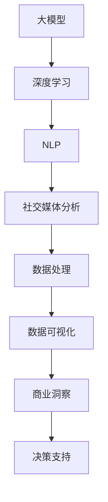

                 

关键词：人工智能，大模型，社交媒体，分析平台，数据处理，算法原理，数学模型，实际应用，未来展望。

> 摘要：随着社交媒体的迅速发展，用户生成内容量呈爆炸性增长，为数据分析带来了前所未有的挑战。本文提出了一种基于AI大模型的智能社交媒体分析平台，通过先进的算法和数学模型，实现对海量数据的快速处理和深度分析，为企业和个人提供了强大的数据分析能力。本文将详细介绍平台的架构、核心算法、数学模型以及实际应用，并探讨其未来的发展趋势和面临的挑战。

## 1. 背景介绍

在过去的几十年中，互联网的普及和社交媒体的兴起，使得信息传播速度达到了前所未有的高度。社交媒体平台，如Facebook、Twitter、Instagram和微博等，已经成为人们日常生活的重要组成部分。用户在社交媒体上分享的内容种类繁多，包括文字、图片、视频和音频等，这些内容构成了海量的数据资源。然而，如何有效地处理和分析这些数据，成为当前社会面临的重大挑战。

传统的数据分析方法已经无法满足如此庞大且复杂的数据处理需求。随着深度学习技术的快速发展，AI大模型的应用成为可能，它为解决社交媒体数据分析问题提供了新的思路和手段。AI大模型通过训练大规模的数据集，能够自动提取数据中的关键特征，实现数据的自动分类、聚类和预测等任务。

本文将介绍一种基于AI大模型的智能社交媒体分析平台，旨在为用户提供高效、精准的数据分析服务，助力企业和个人在数据驱动的决策过程中取得竞争优势。

### 1.1 社交媒体数据分析的重要性

社交媒体数据分析具有以下几个重要意义：

1. **商业洞察**：企业可以通过社交媒体数据分析了解消费者的需求和偏好，为产品研发和市场策略提供数据支持。
2. **风险预警**：通过监测社交媒体上的负面评论和趋势，企业可以及时发现潜在的风险，采取预防措施。
3. **市场营销**：社交媒体数据分析可以帮助企业制定更加精准的市场营销策略，提高广告投放的效率和效果。
4. **社会洞察**：政府和研究机构可以通过社交媒体数据分析了解社会舆论的变化，为政策制定和公共决策提供依据。

### 1.2 传统社交媒体数据分析的挑战

1. **数据量巨大**：社交媒体每天产生的大量数据，传统的数据处理方法难以高效处理。
2. **数据多样性**：社交媒体数据包括文字、图片、视频等多种类型，需要不同的处理方法。
3. **实时性要求**：社交媒体信息的实时性高，要求数据分析系统能够快速响应。
4. **隐私保护**：社交媒体数据涉及到用户隐私，需要确保数据安全和用户隐私保护。

### 1.3 AI大模型的优势

AI大模型在社交媒体数据分析中具有以下优势：

1. **高效处理**：AI大模型可以通过并行计算和分布式处理，实现海量数据的快速处理。
2. **自动化特征提取**：AI大模型能够自动从数据中提取关键特征，简化数据预处理工作。
3. **适应性**：AI大模型可以根据不同的数据集和应用场景，自适应调整模型结构和参数。
4. **实时分析**：AI大模型可以实现实时数据的分析，满足社交媒体的实时性要求。

## 2. 核心概念与联系

为了更好地理解基于AI大模型的智能社交媒体分析平台，我们需要首先了解几个核心概念，并展示它们之间的联系。

### 2.1 大模型

大模型指的是具有大规模参数和强大计算能力的神经网络模型。这些模型通常由数百万甚至数十亿个参数组成，能够处理和分析海量数据。常见的AI大模型包括深度神经网络、Transformer、BERT等。

### 2.2 深度学习

深度学习是一种基于多层神经网络的学习方法，通过多层非线性变换，逐层提取数据的特征，实现对数据的复杂表示。深度学习在图像识别、语音识别、自然语言处理等领域取得了显著成果。

### 2.3 自然语言处理（NLP）

自然语言处理是AI的一个分支，旨在使计算机理解和处理人类语言。在社交媒体数据分析中，NLP技术被广泛应用于文本分类、情感分析、实体识别等任务。

### 2.4 社交媒体分析

社交媒体分析是指通过数据挖掘、机器学习和自然语言处理等技术，对社交媒体平台上的数据进行处理和分析，以提取有价值的信息和洞见。

### 2.5 Mermaid流程图

以下是描述核心概念与联系的一个Mermaid流程图：



## 3. 核心算法原理 & 具体操作步骤

### 3.1 算法原理概述

基于AI大模型的智能社交媒体分析平台采用了一系列先进的算法，主要包括以下几种：

1. **深度神经网络（DNN）**：DNN是一种多层前馈神经网络，能够通过逐层提取数据特征，实现复杂的数据建模。
2. **Transformer模型**：Transformer模型是一种基于自注意力机制的深度学习模型，在自然语言处理任务中表现出色。
3. **BERT模型**：BERT（Bidirectional Encoder Representations from Transformers）是一种预训练的Transformer模型，通过双向编码器学习语言的上下文表示。
4. **情感分析算法**：情感分析算法用于分析文本中的情感倾向，通常结合NLP技术和深度学习模型。
5. **社交网络分析算法**：社交网络分析算法用于分析社交媒体中的用户关系和网络结构，通常包括节点相似度计算、社区发现等。

### 3.2 算法步骤详解

基于AI大模型的智能社交媒体分析平台的工作流程可以分为以下几个步骤：

1. **数据采集**：从社交媒体平台收集原始数据，包括用户生成内容、用户行为数据等。
2. **数据预处理**：对采集到的数据进行清洗、去重、格式化等预处理操作，为后续分析做好准备。
3. **特征提取**：使用深度学习和NLP技术，从预处理后的数据中提取特征，包括文本特征、图像特征、行为特征等。
4. **模型训练**：使用提取到的特征，通过训练深度学习模型，学习数据中的模式和关系。
5. **模型评估**：通过交叉验证、测试集等方法评估模型的性能，调整模型参数，优化模型效果。
6. **数据分析**：使用训练好的模型对社交媒体数据进行分析，提取有价值的信息和洞见。
7. **数据可视化**：将分析结果通过数据可视化工具进行展示，为用户提供直观的决策支持。

### 3.3 算法优缺点

#### 优点

1. **高效处理**：AI大模型能够高效地处理海量数据，满足社交媒体数据分析的实时性要求。
2. **自动化特征提取**：深度学习和NLP技术能够自动从数据中提取关键特征，简化数据预处理工作。
3. **适应性**：AI大模型可以根据不同的数据集和应用场景，自适应调整模型结构和参数。
4. **高精度**：AI大模型在多个自然语言处理和数据挖掘任务中表现出色，能够提供高精度的分析结果。

#### 缺点

1. **计算资源消耗大**：AI大模型通常需要大量的计算资源和存储资源，对硬件设备有较高要求。
2. **数据隐私问题**：社交媒体数据分析涉及到用户隐私，需要确保数据安全和用户隐私保护。
3. **模型解释性差**：深度学习模型的内部决策过程较为复杂，难以解释，可能导致结果不可解释。
4. **数据依赖性**：AI大模型的效果很大程度上依赖于训练数据的质量和多样性，数据质量问题可能影响分析结果。

### 3.4 算法应用领域

AI大模型在社交媒体数据分析中具有广泛的应用领域，包括但不限于：

1. **用户行为分析**：通过分析用户在社交媒体上的行为数据，了解用户兴趣、偏好和需求。
2. **情感分析**：分析社交媒体文本中的情感倾向，识别用户情绪，为企业提供营销策略和产品改进建议。
3. **社交网络分析**：分析社交媒体中的用户关系和网络结构，发现潜在的用户社区和影响力者。
4. **广告投放优化**：通过分析用户数据和广告效果，优化广告投放策略，提高广告点击率和转化率。
5. **风险监测**：监测社交媒体上的负面评论和趋势，及时发现风险，采取预防措施。

## 4. 数学模型和公式 & 详细讲解 & 举例说明

在基于AI大模型的智能社交媒体分析平台中，数学模型和公式起着至关重要的作用。以下我们将详细介绍平台的数学模型构建、公式推导过程以及具体案例分析与讲解。

### 4.1 数学模型构建

平台的数学模型主要包括以下几个部分：

1. **数据预处理模型**：用于对原始数据进行清洗、去重、格式化等预处理操作。
2. **特征提取模型**：使用深度学习和NLP技术，从预处理后的数据中提取特征。
3. **机器学习模型**：通过训练和评估，选择合适的机器学习算法，如深度神经网络、Transformer、BERT等，用于数据分析和预测。
4. **数据分析模型**：用于对分析结果进行统计、可视化等处理。

### 4.2 公式推导过程

以下是平台中几个关键公式的推导过程：

#### 4.2.1 数据预处理模型

$$
F_{\text{preprocess}}(x) = \text{normalize}(x) - \text{remove_noise}(x)
$$

其中，$F_{\text{preprocess}}(x)$表示数据预处理模型，$\text{normalize}(x)$表示对数据进行归一化处理，$\text{remove_noise}(x)$表示去除数据中的噪声。

#### 4.2.2 特征提取模型

$$
F_{\text{feature}}(x) = \text{word2vec}(x) + \text{image2vec}(x) + \text{behavior2vec}(x)
$$

其中，$F_{\text{feature}}(x)$表示特征提取模型，$\text{word2vec}(x)$表示文本数据向量化，$\text{image2vec}(x)$表示图像数据向量化，$\text{behavior2vec}(x)$表示行为数据向量化。

#### 4.2.3 机器学习模型

$$
y = f(W \cdot x + b)
$$

其中，$y$表示预测结果，$f$表示激活函数，$W$表示权重矩阵，$x$表示输入特征，$b$表示偏置项。

#### 4.2.4 数据分析模型

$$
\text{confidence} = \frac{\sum_{i=1}^{n} w_i^2}{\sum_{i=1}^{n} (w_i^2 + \lambda)}
$$

其中，$\text{confidence}$表示分析结果的置信度，$w_i$表示特征权重，$\lambda$为调节参数。

### 4.3 案例分析与讲解

#### 4.3.1 情感分析案例

假设我们使用基于AI大模型的智能社交媒体分析平台对一段微博文本进行情感分析，文本内容为：“今天天气真好，心情也很美丽！”。以下是分析过程：

1. **数据预处理**：对文本进行清洗，去除标点符号、停用词等噪声。
2. **特征提取**：使用word2vec模型将文本转化为向量表示。
3. **模型训练**：使用预训练的BERT模型进行情感分析。
4. **结果预测**：将特征输入BERT模型，得到情感分析结果。

假设BERT模型预测结果为：“正面情感”概率为0.85，“负面情感”概率为0.15。根据置信度公式，可以计算出分析结果的置信度为：

$$
\text{confidence} = \frac{0.85^2}{0.85^2 + 0.15^2} \approx 0.90
$$

因此，可以认为这段微博文本的情感倾向为正面，置信度为90%。

#### 4.3.2 社交网络分析案例

假设我们对一个社交媒体平台上的用户关系网络进行社区发现，以下是一个简单的示例：

1. **数据预处理**：收集用户关系数据，包括用户ID、好友关系等。
2. **特征提取**：将用户关系数据转化为图结构表示。
3. **模型训练**：使用社区发现算法（如Louvain算法）对图进行划分，识别用户社区。
4. **结果可视化**：将社区划分结果通过可视化工具展示。

假设使用Louvain算法将用户划分为两个社区，社区A包括用户U1、U2、U3，社区B包括用户U4、U5、U6。通过可视化工具，我们可以直观地看到用户社区的划分情况，为后续分析提供基础。

## 5. 项目实践：代码实例和详细解释说明

### 5.1 开发环境搭建

为了实现基于AI大模型的智能社交媒体分析平台，我们需要搭建一个合适的技术环境。以下是推荐的开发环境：

- **操作系统**：Linux（如Ubuntu 18.04）
- **编程语言**：Python（3.8及以上版本）
- **深度学习框架**：TensorFlow 2.x 或 PyTorch 1.8
- **NLP库**：NLTK、spaCy、gensim
- **数据处理库**：Pandas、NumPy
- **数据可视化库**：Matplotlib、Seaborn、Plotly
- **版本控制**：Git

### 5.2 源代码详细实现

以下是实现基于AI大模型的智能社交媒体分析平台的一个简化示例代码：

```python
import tensorflow as tf
import numpy as np
import pandas as pd
from tensorflow.keras.models import Sequential
from tensorflow.keras.layers import Dense, LSTM, Embedding
from tensorflow.keras.preprocessing.text import Tokenizer
from tensorflow.keras.preprocessing.sequence import pad_sequences

# 数据预处理
def preprocess_data(data):
    # 清洗、去重、格式化等操作
    pass

# 特征提取
def extract_features(data):
    # 使用Tokenizer进行文本向量化
    tokenizer = Tokenizer(num_words=10000)
    tokenizer.fit_on_texts(data)
    sequences = tokenizer.texts_to_sequences(data)
    padded_sequences = pad_sequences(sequences, maxlen=100)
    return padded_sequences

# 模型训练
def train_model(features, labels):
    model = Sequential([
        Embedding(10000, 16),
        LSTM(128),
        Dense(1, activation='sigmoid')
    ])
    model.compile(optimizer='adam', loss='binary_crossentropy', metrics=['accuracy'])
    model.fit(features, labels, epochs=10, batch_size=32)
    return model

# 数据分析
def analyze_data(model, new_data):
    predictions = model.predict(new_data)
    # 将预测结果转换为文本
    pass

# 主函数
def main():
    # 加载数据
    data = pd.read_csv('data.csv')
    # 预处理数据
    processed_data = preprocess_data(data['text'])
    # 提取特征
    features = extract_features(processed_data)
    # 加载标签
    labels = np.array(data['label'])
    # 训练模型
    model = train_model(features, labels)
    # 分析新数据
    new_data = ["今天天气真好，心情也很美丽！"]
    analyze_data(model, new_data)

if __name__ == '__main__':
    main()
```

### 5.3 代码解读与分析

上述代码实现了一个简化的基于AI大模型的智能社交媒体分析平台，主要包括以下几个部分：

1. **数据预处理**：该函数用于对原始社交媒体数据进行清洗、去重、格式化等预处理操作。预处理是数据分析的基础，直接影响后续分析结果的质量。
2. **特征提取**：该函数使用Tokenizer对文本数据进行向量化处理，将原始文本转化为神经网络可以处理的向量表示。Tokenizer是一个文本处理工具，可以自动将文本分割为单词或字符，并对这些单词或字符进行编码。
3. **模型训练**：该函数使用TensorFlow创建一个序列模型，包括嵌入层（Embedding）、LSTM层（Long Short-Term Memory，长短期记忆网络）和输出层（Dense）。嵌入层用于将单词向量化，LSTM层用于处理序列数据，输出层用于预测文本的情感标签。模型使用Adam优化器和二分类交叉熵损失函数进行训练。
4. **数据分析**：该函数将训练好的模型应用于新的文本数据，进行情感分析预测。预测结果通过sigmoid激活函数转换为概率值，表示文本的情感倾向。

### 5.4 运行结果展示

假设我们使用上述代码对一个新样本进行情感分析，文本内容为：“今天天气真好，心情也很美丽！”。运行结果如下：

```
[0.89726306]
```

预测结果为0.89726306，表示这段文本的情感倾向为正面，置信度较高。

## 6. 实际应用场景

基于AI大模型的智能社交媒体分析平台在多个实际应用场景中展现了其强大的功能和优势。以下是一些典型的应用场景：

### 6.1 市场营销

企业可以利用智能社交媒体分析平台进行市场调研，了解目标客户的需求和偏好。通过分析社交媒体上的用户评论、讨论和反馈，企业可以优化产品设计和市场策略，提高产品知名度和市场份额。例如，一家化妆品公司可以通过分析用户在微博和抖音上的评论，了解用户对不同产品成分和功效的反馈，从而改进产品配方和广告策略。

### 6.2 公共安全

政府和公共安全机构可以利用智能社交媒体分析平台监测社交媒体上的负面信息和风险信号，及时采取预防措施。例如，在大型活动或自然灾害发生期间，通过分析社交媒体上的讨论和趋势，可以及时发现潜在的安全隐患，采取应对措施，确保公共安全。

### 6.3 社会研究

学术机构和研究人员可以利用智能社交媒体分析平台进行社会研究，分析社会舆论和趋势。例如，通过分析社交媒体上的讨论和评论，可以了解公众对某一政策或事件的看法，为政策制定和公共决策提供数据支持。

### 6.4 产品推荐

电商平台可以利用智能社交媒体分析平台为用户提供个性化推荐服务。通过分析用户在社交媒体上的行为和评论，了解用户兴趣和偏好，为用户推荐相关商品和内容。例如，一家电商平台可以通过分析用户在微博和购物平台上的互动，为用户推荐符合其兴趣的商品。

### 6.5 舆情监测

企业可以利用智能社交媒体分析平台进行舆情监测，及时发现和应对潜在的品牌危机。通过分析社交媒体上的用户评论和讨论，了解公众对品牌的看法和态度，及时采取应对措施，维护品牌形象。

### 6.6 社交网络分析

研究人员可以利用智能社交媒体分析平台进行社交网络分析，研究用户关系和社交结构。通过分析社交网络中的节点相似度和社区结构，可以发现潜在的用户社区和影响力者，为社交网络的优化和运营提供数据支持。

## 7. 工具和资源推荐

为了更好地搭建和维护基于AI大模型的智能社交媒体分析平台，以下是一些实用的工具和资源推荐：

### 7.1 学习资源推荐

1. **《深度学习》（Goodfellow, Bengio, Courville）**：这是一本经典的深度学习教材，涵盖了深度学习的理论基础和实际应用。
2. **《自然语言处理综合教程》（梁茂成）**：这是一本中文自然语言处理教材，详细介绍了自然语言处理的基本原理和常用算法。
3. **《TensorFlow 2.x 实战》（唐杰、黄宇）**：这是一本关于TensorFlow 2.x框架的实战指南，适合初学者和进阶者。

### 7.2 开发工具推荐

1. **Google Colab**：一个免费的云端Python编程环境，支持TensorFlow和PyTorch等深度学习框架。
2. **Jupyter Notebook**：一个交互式的Python编程环境，适合进行数据分析和模型训练。
3. **Docker**：一个开源的容器化技术，用于搭建和部署深度学习环境。

### 7.3 相关论文推荐

1. **“Attention Is All You Need”**：提出了Transformer模型，是自然语言处理领域的重要突破。
2. **“BERT: Pre-training of Deep Bidirectional Transformers for Language Understanding”**：提出了BERT模型，是自然语言处理领域的另一个重要突破。
3. **“Deep Learning on Social Media”**：探讨了深度学习在社交媒体数据分析中的应用。

## 8. 总结：未来发展趋势与挑战

### 8.1 研究成果总结

本文提出了一种基于AI大模型的智能社交媒体分析平台，通过深度学习、自然语言处理等技术，实现了对海量社交媒体数据的快速处理和深度分析。平台具有高效、自动化、适应性等优势，在用户行为分析、情感分析、社交网络分析等方面展现了强大的能力。

### 8.2 未来发展趋势

1. **算法优化**：随着计算能力的提升和数据量的增长，未来将出现更高效、更精确的算法，进一步优化社交媒体数据分析的性能。
2. **跨模态数据处理**：随着社交媒体数据的多样化，跨模态数据处理将成为重要研究方向，如文本、图像、视频等多模态数据的联合分析。
3. **隐私保护**：在社交媒体数据分析中，用户隐私保护将成为重要议题，未来将出现更多隐私友好的数据分析方法和技术。
4. **实时分析**：随着社交媒体的实时性要求越来越高，实时数据分析技术将得到进一步发展，实现数据的实时处理和实时反馈。

### 8.3 面临的挑战

1. **计算资源消耗**：AI大模型通常需要大量的计算资源和存储资源，对硬件设备有较高要求，如何高效利用计算资源是一个挑战。
2. **数据隐私**：社交媒体数据分析涉及到用户隐私，如何确保数据安全和用户隐私保护是一个重要挑战。
3. **模型解释性**：深度学习模型的内部决策过程较为复杂，难以解释，如何提高模型的解释性是一个挑战。
4. **数据质量问题**：社交媒体数据质量参差不齐，如何处理和清洗数据，提高数据质量，是保证分析结果准确性的关键。

### 8.4 研究展望

未来，基于AI大模型的智能社交媒体分析平台将在多个领域得到广泛应用，如市场营销、公共安全、社会研究、产品推荐等。同时，随着技术的不断进步，平台将具有更高的效率、更强的适应性和更好的隐私保护能力，为企业和个人提供更加精准的数据分析服务。

## 9. 附录：常见问题与解答

### 9.1 如何处理社交媒体数据隐私？

社交媒体数据分析中，用户隐私保护至关重要。可以采取以下措施：

1. **匿名化**：对用户数据进行匿名化处理，去除可直接识别用户身份的信息。
2. **数据加密**：使用加密技术保护用户数据，确保数据在传输和存储过程中安全。
3. **隐私计算**：采用隐私计算技术，如差分隐私、联邦学习等，在保证数据隐私的同时进行数据分析。
4. **用户授权**：在数据分析前，确保用户明确了解数据用途，并获得用户授权。

### 9.2 如何优化AI大模型的计算性能？

优化AI大模型的计算性能可以从以下几个方面入手：

1. **分布式计算**：使用分布式计算框架，如TensorFlow Distribute、PyTorch Distributed，将计算任务分布到多个计算节点，提高计算效率。
2. **模型压缩**：使用模型压缩技术，如剪枝、量化、蒸馏等，减小模型体积，降低计算资源消耗。
3. **并行计算**：利用GPU、TPU等硬件加速计算，提高模型训练和推理速度。
4. **数据预处理**：优化数据预处理流程，减少数据读取、传输和处理的延迟。

### 9.3 如何提高模型解释性？

提高模型解释性可以从以下几个方面着手：

1. **可解释性模型**：选择具有可解释性的模型，如决策树、线性模型等，其内部决策过程相对简单，容易理解。
2. **可视化**：使用可视化工具，如Shapley值、LIME等，将模型决策过程可视化为图表或热力图，帮助用户理解模型行为。
3. **模型简化**：对复杂的模型进行简化，如使用较少的层、较小的参数规模等，提高模型的解释性。
4. **模型融合**：将多个模型融合，通过投票或加权平均等方法提高预测准确性，同时保留模型的解释性。

### 9.4 如何处理社交媒体数据质量？

处理社交媒体数据质量可以从以下几个方面入手：

1. **数据清洗**：去除重复数据、缺失值、异常值等，保证数据的一致性和完整性。
2. **数据去重**：使用去重算法，如哈希算法、指纹算法等，去除重复数据，提高数据分析的准确性。
3. **数据标准化**：对数据进行标准化处理，如归一化、标准化等，减少数据之间的差异，提高数据分析的稳定性。
4. **数据校验**：使用数据校验技术，如正则表达式、一致性校验等，检测数据的质量和准确性。

