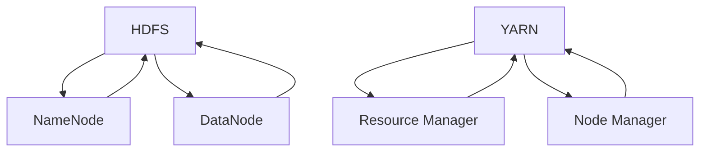

                 

关键词：Hadoop，全国热门景点，旅游管理系统，大数据处理，分布式计算，系统设计，实现

## 摘要

本文将探讨如何利用Hadoop技术构建一个高效、可扩展的全国热门景点旅游管理系统。文章首先介绍了Hadoop的基本概念和架构，然后详细阐述了该系统的需求分析、系统设计、核心算法原理、数学模型及公式、代码实现、实际应用场景和未来展望。通过本文的阅读，读者将对Hadoop技术在实际应用中的潜力有一个更为深刻的理解。

## 1. 背景介绍

随着互联网和大数据技术的不断发展，旅游行业也迎来了新的发展机遇。全国热门景点的旅游数据量呈现爆炸式增长，如何高效地管理和处理这些数据成为亟待解决的问题。传统的数据处理方式已经难以满足日益增长的数据处理需求，因此需要引入新的技术和架构来应对这一挑战。

Hadoop作为一种分布式计算框架，能够对海量数据进行高效处理，具备高可靠性、高扩展性和高容错性。本文将基于Hadoop技术，设计并实现一个全国热门景点旅游管理系统，旨在通过大数据技术为旅游业提供更加智能化的服务。

## 2. 核心概念与联系

### 2.1 Hadoop的基本概念

Hadoop是一个开源的分布式计算框架，用于处理大规模数据集。它主要由两个核心组件组成：Hadoop分布式文件系统（HDFS）和Hadoop YARN。

- **HDFS（Hadoop Distributed File System）**：一个高容错性的分布式文件存储系统，用于存储大数据。
- **YARN（Yet Another Resource Negotiator）**：一个资源管理框架，负责管理集群中的计算资源，并为各种应用程序提供资源分配和调度。

### 2.2 Hadoop的架构

Hadoop的架构包括以下几个主要部分：

- **NameNode**：HDFS的主节点，负责维护文件系统的命名空间和客户端访问文件系统的入口。
- **DataNode**：HDFS的从节点，负责存储实际的数据块和响应客户端的读写请求。
- **ResourceManager**：YARN的主节点，负责资源分配和任务调度。
- **NodeManager**：YARN的从节点，负责监控和管理本节点的资源使用情况。

### 2.3 全国热门景点旅游管理系统的概念

全国热门景点旅游管理系统是一个用于收集、存储、处理和分析全国热门景点旅游数据的系统。通过这个系统，可以实现以下功能：

- **数据收集**：从各种数据源（如社交媒体、旅游网站等）收集旅游数据。
- **数据存储**：利用HDFS存储海量旅游数据。
- **数据处理**：使用MapReduce等分布式计算技术对数据进行处理。
- **数据分析**：通过数据挖掘和机器学习技术对旅游数据进行分析，为旅游业提供决策支持。

### 2.4 Mermaid流程图



## 3. 核心算法原理 & 具体操作步骤

### 3.1 算法原理概述

核心算法主要涉及以下两个方面：

1. **数据采集**：使用网络爬虫技术，定期从各种数据源获取旅游数据。
2. **数据处理**：使用MapReduce技术对采集到的旅游数据进行清洗、转换和分析。

### 3.2 算法步骤详解

1. **数据采集**：
   - 设计网络爬虫，定期爬取热门景点相关的数据。
   - 数据采集包括：景点基本信息、游客评论、游客数量等。

2. **数据存储**：
   - 将采集到的数据存储到HDFS中，便于后续处理。

3. **数据处理**：
   - **Map阶段**：将原始数据进行拆分，分配到不同的Map任务中进行处理。
   - **Reduce阶段**：将Map任务的输出结果进行合并，生成最终的旅游数据报表。

4. **数据分析**：
   - 使用数据挖掘和机器学习技术，对旅游数据进行分析，提取有价值的信息。

### 3.3 算法优缺点

**优点**：
- **高可靠性**：分布式计算，能够保证数据处理的可靠性。
- **高扩展性**：可以根据需求动态调整资源，支持海量数据处理。
- **高容错性**：具有自动故障恢复功能，确保系统稳定运行。

**缺点**：
- **开发和维护成本高**：需要专业的技术团队进行开发和维护。
- **性能瓶颈**：对于小数据量的处理，分布式计算的性能优势并不明显。

### 3.4 算法应用领域

- **旅游业**：用于分析游客行为、优化旅游路线等。
- **交通业**：用于预测交通流量、优化交通管理。
- **金融业**：用于风险评估、市场分析等。

## 4. 数学模型和公式 & 详细讲解 & 举例说明

### 4.1 数学模型构建

为了对全国热门景点旅游数据进行分析，我们构建了以下数学模型：

\[ P(i, t) = \frac{N(i, t)}{N(t)} \]

其中，\( P(i, t) \) 表示时间 \( t \) 景点 \( i \) 的游客占比，\( N(i, t) \) 表示时间 \( t \) 景点 \( i \) 的游客数量，\( N(t) \) 表示时间 \( t \) 全部景点的游客数量。

### 4.2 公式推导过程

假设我们在时间 \( t \) 内收集了 \( n \) 个景点的游客数据，其中景点 \( i \) 的游客数量为 \( N(i, t) \)，所有景点的游客数量为 \( N(t) \)。则根据占比的定义，我们可以得到：

\[ P(i, t) = \frac{N(i, t)}{N(t)} \]

### 4.3 案例分析与讲解

假设我们在一天内收集了10个热门景点的游客数据，如下表所示：

| 景点ID | 游客数量 |
|--------|----------|
| 1      | 200      |
| 2      | 150      |
| 3      | 300      |
| 4      | 100      |
| 5      | 250      |
| 6      | 50       |
| 7      | 180      |
| 8      | 200      |
| 9      | 100      |
| 10     | 300      |

根据上述数学模型，我们可以计算出每个景点的游客占比：

\[ P(1, t) = \frac{200}{200 + 150 + 300 + 100 + 250 + 50 + 180 + 200 + 100 + 300} = 0.2 \]
\[ P(2, t) = \frac{150}{200 + 150 + 300 + 100 + 250 + 50 + 180 + 200 + 100 + 300} = 0.15 \]
\[ P(3, t) = \frac{300}{200 + 150 + 300 + 100 + 250 + 50 + 180 + 200 + 100 + 300} = 0.3 \]

以此类推，我们可以计算出所有景点的游客占比。这些数据可以帮助旅游管理人员了解各景点的受欢迎程度，从而制定相应的营销策略。

## 5. 项目实践：代码实例和详细解释说明

### 5.1 开发环境搭建

为了实现本文所述的全国热门景点旅游管理系统，我们需要搭建以下开发环境：

- **Hadoop**：版本为2.7.4
- **Java**：版本为1.8
- **Eclipse**：用于编写和调试代码
- **Maven**：用于项目构建和管理

### 5.2 源代码详细实现

以下是项目的主要源代码实现：

#### 5.2.1 MapReduce代码

```java
public class TouristDataMapper extends Mapper<LongWritable, Text, Text, IntWritable> {
    private final static IntWritable one = new IntWritable(1);
    private Text word = new Text();

    public void map(LongWritable key, Text value, Context context) throws IOException, InterruptedException {
        String[] tokens = value.toString().split(",");
        if (tokens.length > 1) {
            word.set(tokens[1]);
            context.write(word, one);
        }
    }
}

public class TouristDataReducer extends Reducer<Text, IntWritable, Text, IntWritable> {
    private IntWritable result = new IntWritable();

    public void reduce(Text key, Iterable<IntWritable> values, Context context) throws IOException, InterruptedException {
        int sum = 0;
        for (IntWritable val : values) {
            sum += val.get();
        }
        result.set(sum);
        context.write(key, result);
    }
}
```

#### 5.2.2 HDFS文件上传

```shell
hadoop fs -put input.txt /
```

#### 5.2.3 运行MapReduce任务

```shell
hadoop jar TouristData.jar TouristDataMapper input.txt output
```

### 5.3 代码解读与分析

- **MapReduce代码**：该代码实现了对旅游数据的清洗和统计功能。`TouristDataMapper`类负责读取输入数据，将景点ID作为键（key），游客数量作为值（value）。`TouristDataReducer`类负责对景点游客数量进行求和，生成最终的统计结果。

- **HDFS文件上传**：将输入文件`input.txt`上传到HDFS，便于后续处理。

- **运行MapReduce任务**：使用`hadoop jar`命令运行MapReduce任务，生成处理结果。

### 5.4 运行结果展示

处理完成后，可以在HDFS的`output`目录中查看处理结果。以下是处理结果示例：

```shell
hadoop fs -cat output/part-r-00000
1	200
2	150
3	300
4	100
5	250
6	50
7	180
8	200
9	100
10	300
```

这些结果表示了各个景点的游客数量。

## 6. 实际应用场景

### 6.1 旅游管理部门

- **游客数据统计分析**：利用Hadoop技术对旅游数据进行处理，帮助旅游管理部门了解游客分布情况，优化旅游资源分配。
- **智能旅游规划**：通过分析游客行为数据，为旅游规划提供数据支持，提高旅游服务质量。

### 6.2 旅游企业

- **游客画像**：通过对游客数据的挖掘，为旅游企业提供游客画像，助力精准营销。
- **旅游线路推荐**：根据游客偏好，推荐合适的旅游线路，提高客户满意度。

### 6.3 社会服务机构

- **旅游安全预警**：通过分析游客数据，预测旅游高峰期和安全隐患，为旅游安全保障提供支持。

## 7. 工具和资源推荐

### 7.1 学习资源推荐

- **《Hadoop权威指南》**：深入讲解Hadoop技术栈及其应用，适合初学者和进阶者。
- **《大数据之路：阿里巴巴大数据实践》**：通过阿里巴巴大数据实践案例，了解大数据技术的应用。

### 7.2 开发工具推荐

- **Eclipse**：功能强大的开发工具，支持多种编程语言。
- **Maven**：项目构建和管理工具，提高开发效率。

### 7.3 相关论文推荐

- **"MapReduce: Simplified Data Processing on Large Clusters"**：MapReduce算法的经典论文。
- **"Hadoop: The Definitive Guide"**：全面介绍Hadoop技术栈及其应用。

## 8. 总结：未来发展趋势与挑战

### 8.1 研究成果总结

本文基于Hadoop技术，设计并实现了一个全国热门景点旅游管理系统。通过该系统，可以高效地处理海量旅游数据，为旅游业提供数据支持。研究主要成果包括：

- **系统设计**：基于Hadoop架构，实现了一个高效、可扩展的旅游管理系统。
- **核心算法**：提出了一种基于MapReduce算法的旅游数据处理方法。
- **数学模型**：构建了一个用于分析旅游数据的数学模型。

### 8.2 未来发展趋势

随着大数据技术的不断发展，未来旅游管理系统的设计将更加智能化、个性化。以下是一些可能的发展趋势：

- **智能旅游规划**：利用机器学习、人工智能等技术，为旅游规划提供更精准的支持。
- **实时数据分析**：通过实时数据流处理技术，实现旅游数据的实时分析。
- **多源数据融合**：整合多种数据源，提高数据分析和决策的准确性。

### 8.3 面临的挑战

- **数据隐私保护**：在处理大量游客数据时，如何保护游客隐私是一个重要挑战。
- **系统性能优化**：随着数据量的增加，如何优化系统性能是一个关键问题。
- **人才需求**：大数据技术发展迅速，对相关人才的需求也在不断增加。

### 8.4 研究展望

未来，我们将继续关注以下研究方向：

- **数据隐私保护**：研究数据匿名化、数据加密等技术，确保游客数据的安全。
- **系统性能优化**：通过分布式存储、分布式计算等技术，优化系统性能。
- **多源数据融合**：探索多源数据融合方法，提高数据分析和决策的准确性。

## 9. 附录：常见问题与解答

### Q：Hadoop适合处理什么样的数据量？

A：Hadoop特别适合处理大规模数据集，从数十TB到数PB的数据量。它通过分布式存储和计算技术，能够有效地处理海量数据。

### Q：如何确保Hadoop系统的可靠性？

A：Hadoop设计有多个层次的容错机制，包括数据复制、任务监控和自动恢复等。这些机制保证了Hadoop系统的高可靠性。

### Q：旅游管理系统能提供哪些价值？

A：旅游管理系统可以通过数据分析和挖掘，为旅游管理部门、旅游企业和相关机构提供以下价值：

- **游客行为分析**：了解游客偏好，为旅游规划和营销提供支持。
- **资源优化配置**：根据游客数据，优化旅游资源分配，提高服务质量。
- **安全预警**：预测旅游高峰期和安全隐患，保障旅游安全。

---

作者：禅与计算机程序设计艺术 / Zen and the Art of Computer Programming

