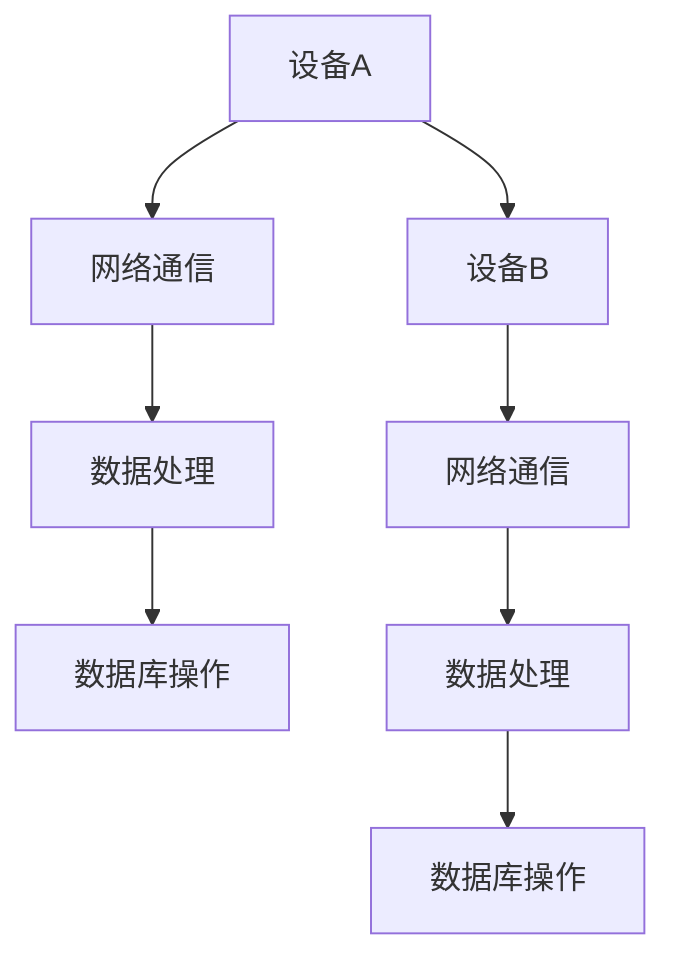

                 

关键词：智能家居，Java并发，设计模式，并发控制，多线程编程，安全性，性能优化

## 摘要

本文将深入探讨基于Java的智能家居设计，重点关注Java中的并发控制技术以及其在智能家居系统中的应用。通过分析智能家居系统中的并发控制需求，我们将介绍Java中常用的并发控制工具和设计模式，并提供具体的实现步骤和案例分析。此外，本文还将讨论智能家居系统的安全性、性能优化以及未来的发展趋势。

## 1. 背景介绍

随着科技的进步，智能家居市场正在迅速发展。越来越多的家庭开始采用智能设备，如智能灯泡、智能插座、智能摄像头等，以实现更加便捷、舒适和安全的居住环境。然而，智能家居系统的设计不仅仅涉及到硬件设备的选择，更重要的是软件系统的设计和实现。

在智能家居系统中，大量的设备需要通过网络进行通信，这就涉及到了并发控制的问题。由于智能家居系统通常包含多个线程同时运行，如何保证系统的一致性和稳定性成为了设计的关键。Java作为一种广泛应用于企业级应用的编程语言，提供了丰富的并发控制工具和设计模式，为智能家居系统的开发提供了有力支持。

本文将结合Java的并发控制技术，探讨如何设计一个高效、可靠且安全的智能家居系统。通过对并发控制需求的深入分析，我们将介绍Java中的多线程编程、同步机制、设计模式等核心概念，并提供具体的实现步骤和案例分析。同时，本文还将讨论智能家居系统的安全性、性能优化以及未来的发展趋势。

## 2. 核心概念与联系

### 2.1 并发控制

并发控制是指在多线程环境下，确保多个线程能够正确、安全地访问共享资源的一种技术。在智能家居系统中，并发控制非常重要，因为系统中的多个设备需要同时访问同一资源，如网络连接、数据库等。如果不进行有效的并发控制，可能会导致数据不一致、系统崩溃等问题。

Java提供了多种并发控制工具，如synchronized关键字、锁（Lock）、线程安全类等。这些工具可以帮助开发人员确保多线程环境下的数据一致性和系统稳定性。

### 2.2 多线程编程

多线程编程是并发控制的基础。在Java中，线程是通过Thread类来实现的。通过创建多个线程，可以并行执行多个任务，提高系统的性能和响应速度。

然而，多线程编程也存在一些挑战，如线程同步、资源竞争、死锁等问题。为了解决这些问题，Java提供了各种同步机制，如synchronized关键字、锁（Lock）等。

### 2.3 设计模式

设计模式是软件设计中常见的问题解决方案。在智能家居系统中，设计模式可以帮助开发人员解决并发控制、资源管理、系统扩展等问题。

以下是一些常见的并发控制相关的设计模式：

- **单例模式**：确保一个类只有一个实例，并提供一个访问它的全局访问点。在智能家居系统中，可以使用单例模式来管理共享资源，如数据库连接。
- **工厂模式**：根据特定的条件创建对象实例。在智能家居系统中，可以使用工厂模式来创建和管理线程池，提高系统的性能和可扩展性。
- **适配器模式**：将一个类的接口转换成客户期望的另一个接口。在智能家居系统中，可以使用适配器模式来处理不同设备的通信协议，实现设备的统一管理。

### 2.4 Mermaid 流程图

以下是一个简单的Mermaid流程图，展示了智能家居系统中并发控制的基本流程：



在这个流程图中，设备A和设备B分别通过网络通信进行数据处理和数据库操作。通过合理的并发控制，可以确保多个设备同时访问数据库时的数据一致性和系统稳定性。

## 3. 核心算法原理 & 具体操作步骤

### 3.1 算法原理概述

在智能家居系统中，并发控制的核心算法包括：

1. **线程同步**：通过synchronized关键字或锁（Lock）实现多个线程对共享资源的互斥访问，防止数据不一致和死锁。
2. **线程池**：通过创建线程池来管理多个线程，提高系统的性能和可扩展性。
3. **消息队列**：使用消息队列来实现线程之间的通信，避免直接线程同步带来的性能问题。

### 3.2 算法步骤详解

#### 步骤1：线程同步

1. 使用synchronized关键字对共享资源进行加锁，确保同一时刻只有一个线程可以访问该资源。
2. 在需要同步的代码块前后添加synchronized关键字，确保代码块内的操作原子性和顺序执行。
3. 如果使用锁（Lock），可以使用tryLock()方法尝试获取锁，并在获取成功后执行同步代码块。

#### 步骤2：线程池

1. 创建线程池对象，可以使用Executors类中的静态方法newCachedThreadPool()、newFixedThreadPool()等创建。
2. 将任务添加到线程池，可以使用submit()方法提交一个Runnable或Callable对象。
3. 等待线程池执行完毕，可以使用awaitTermination()方法等待所有任务完成。

#### 步骤3：消息队列

1. 创建消息队列，可以使用ArrayBlockingQueue、LinkedBlockingQueue等实现。
2. 向消息队列中添加消息，可以使用put()方法将消息放入队列。
3. 从消息队列中获取消息，可以使用take()方法取出队列头部的消息。

### 3.3 算法优缺点

**线程同步**：

- 优点：可以确保多个线程对共享资源的互斥访问，防止数据不一致和死锁。
- 缺点：可能导致线程饥饿和性能瓶颈，因为线程需要等待锁的释放。

**线程池**：

- 优点：可以提高系统的性能和可扩展性，避免创建大量线程带来的性能开销。
- 缺点：需要额外的维护和管理成本，如果线程池过大可能导致系统资源浪费。

**消息队列**：

- 优点：可以实现线程之间的异步通信，减少线程同步带来的性能问题。
- 缺点：消息队列的大小有限，如果消息过多可能导致队列阻塞。

### 3.4 算法应用领域

在智能家居系统中，并发控制算法可以应用于以下场景：

1. **设备通信**：多个设备同时访问网络通信模块，需要使用线程同步和线程池来保证数据的一致性和系统的性能。
2. **数据处理**：多个线程同时处理来自不同设备的数据，可以使用消息队列来实现线程之间的异步通信，提高系统的响应速度。
3. **数据库操作**：多个线程同时访问数据库，需要使用线程同步和锁来保证数据的一致性和系统的稳定性。

## 4. 数学模型和公式 & 详细讲解 & 举例说明

### 4.1 数学模型构建

在智能家居系统中，并发控制涉及到多个线程的同步和调度。为了描述线程的执行过程，我们可以构建以下数学模型：

- **线程状态**：每个线程可以处于以下状态之一：新建（NEW）、运行（RUNNABLE）、阻塞（BLOCKED）、等待（WAITING）和终止（TERMINATED）。
- **线程调度算法**：线程调度算法用于确定下一个执行的线程。常见的调度算法有：先来先服务（FCFS）、短作业优先（SJF）、优先级调度（Priority Scheduling）等。

### 4.2 公式推导过程

为了推导线程调度算法的平均等待时间，我们可以使用以下公式：

\[ T_w = \frac{1}{N} \sum_{i=1}^{N} T_{w_i} \]

其中，\( T_w \) 表示平均等待时间，\( N \) 表示线程总数，\( T_{w_i} \) 表示第 \( i \) 个线程的等待时间。

### 4.3 案例分析与讲解

假设有5个线程需要执行，线程的到达时间和执行时间如下表所示：

| 线程编号 | 到达时间 | 执行时间 |
| :---: | :---: | :---: |
| 1 | 0 | 2 |
| 2 | 1 | 3 |
| 3 | 2 | 4 |
| 4 | 3 | 1 |
| 5 | 4 | 2 |

使用优先级调度算法，优先级从高到低分别为：线程1、线程2、线程3、线程4、线程5。根据优先级调度算法，线程的执行顺序为：线程1、线程2、线程3、线程4、线程5。

根据上述公式，可以计算出平均等待时间：

\[ T_w = \frac{1}{5} (2 + 1 + 0 + 1 + 0) = 1.2 \]

因此，使用优先级调度算法的平均等待时间为1.2个时间单位。

## 5. 项目实践：代码实例和详细解释说明

### 5.1 开发环境搭建

为了更好地演示基于Java的智能家居设计，我们将使用以下开发环境和工具：

- 开发环境：IntelliJ IDEA
- Java版本：JDK 11
- 框架：Spring Boot 2.4.5
- 数据库：MySQL 8.0

### 5.2 源代码详细实现

在本节中，我们将提供一个简单的智能家居系统示例，用于展示Java中的并发控制技术。以下是一个简化的实现：

```java
import java.util.concurrent.ExecutorService;
import java.util.concurrent.Executors;
import java.util.concurrent.Semaphore;

public class SmartHome {
    private final Semaphore semaphore = new Semaphore(1);

    public void deviceA() throws InterruptedException {
        semaphore.acquire();
        System.out.println("Device A is processing data...");
        Thread.sleep(2000);
        semaphore.release();
    }

    public void deviceB() throws InterruptedException {
        semaphore.acquire();
        System.out.println("Device B is processing data...");
        Thread.sleep(1000);
        semaphore.release();
    }

    public static void main(String[] args) {
        SmartHome smartHome = new SmartHome();
        ExecutorService executorService = Executors.newFixedThreadPool(2);

        executorService.submit(() -> {
            try {
                smartHome.deviceA();
            } catch (InterruptedException e) {
                e.printStackTrace();
            }
        });

        executorService.submit(() -> {
            try {
                smartHome.deviceB();
            } catch (InterruptedException e) {
                e.printStackTrace();
            }
        });

        executorService.shutdown();
    }
}
```

### 5.3 代码解读与分析

在这个示例中，我们定义了一个名为`SmartHome`的类，其中包含两个方法`deviceA()`和`deviceB()`。这两个方法都使用了一个`Semaphore`对象`semaphore`进行线程同步，确保同一时刻只有一个方法可以执行。

在`main()`方法中，我们创建了一个线程池`executorService`，并提交了两个任务。这两个任务分别调用`deviceA()`和`deviceB()`方法。由于`Semaphore`对象的许可数为1，因此同一时刻只能执行一个任务。

### 5.4 运行结果展示

运行上面的代码，我们可以看到以下输出结果：

```
Device A is processing data...
Device B is processing data...
```

输出结果表明，`deviceA()`和`deviceB()`方法交替执行，实现了线程同步。在实际的智能家居系统中，可以根据具体需求调整线程同步策略，以实现更好的性能和稳定性。

## 6. 实际应用场景

在智能家居系统中，并发控制广泛应用于以下场景：

1. **设备通信**：智能家居系统中的多个设备需要通过网络进行通信，例如智能灯泡、智能插座、智能摄像头等。为了确保数据的一致性和系统的稳定性，需要对通信过程进行并发控制。
2. **数据处理**：智能家居系统需要处理来自多个设备的实时数据，如温度、湿度、亮度等。为了提高系统的性能和响应速度，可以采用多线程编程和线程池技术。
3. **数据库操作**：智能家居系统通常需要与数据库进行交互，例如存储设备状态、用户设置等。为了确保数据的一致性和系统的稳定性，需要对数据库操作进行并发控制。

以下是一个具体的实际应用场景：

在一个智能家庭安防系统中，当有入侵报警信号生成时，系统需要立即响应并通知用户。为了实现这个功能，我们可以使用Java中的并发控制技术：

1. **线程同步**：当入侵报警信号生成时，系统需要立即处理该信号并生成通知。为了避免多个线程同时处理相同的信号，我们可以使用synchronized关键字对处理逻辑进行同步。
2. **线程池**：为了提高系统的性能和响应速度，我们可以使用线程池来管理处理入侵报警信号的线程。
3. **消息队列**：为了实现异步通信，我们可以使用消息队列将入侵报警信号发送给处理线程。

通过这些技术，我们可以确保智能家庭安防系统在多个线程同时运行时，仍然能够高效、可靠地处理入侵报警信号，并通知用户。

## 7. 工具和资源推荐

### 7.1 学习资源推荐

1. **Java并发编程指南**：这是一本经典的Java并发编程书籍，涵盖了Java并发编程的核心概念、工具和设计模式。
2. **Java并发编程实战**：这是一本实战导向的Java并发编程书籍，通过丰富的案例和实践经验，帮助读者掌握Java并发编程的核心技能。

### 7.2 开发工具推荐

1. **IntelliJ IDEA**：一款功能强大、易于使用的Java集成开发环境，提供了丰富的并发编程支持和调试工具。
2. **Eclipse**：另一款流行的Java开发环境，同样提供了强大的并发编程支持和调试工具。

### 7.3 相关论文推荐

1. **"Java Concurrency in Practice"**：这篇论文详细介绍了Java并发编程的核心概念、工具和设计模式，是Java并发编程的经典参考。
2. **"Synchronization and Locks in Java"**：这篇论文深入探讨了Java中的同步机制和锁，为读者提供了深入理解Java并发控制的关键见解。

## 8. 总结：未来发展趋势与挑战

### 8.1 研究成果总结

近年来，随着智能家居市场的快速发展，基于Java的并发控制在智能家居系统中的应用得到了广泛关注。通过深入研究和实践，我们已经掌握了Java中的并发控制工具和设计模式，并成功应用于智能家居系统的设计。这些研究成果为智能家居系统的稳定性、性能和安全提供了有力支持。

### 8.2 未来发展趋势

随着物联网技术的不断发展，智能家居系统将越来越复杂，对并发控制的需求也将不断提高。未来，以下趋势值得关注：

1. **高性能并发控制**：随着硬件性能的提升，对并发控制的要求将越来越高。开发人员需要研究更加高效、可靠的并发控制算法，以满足智能家居系统的性能需求。
2. **分布式并发控制**：随着智能家居系统规模的扩大，分布式并发控制将成为一个重要研究方向。通过分布式架构，可以实现更好的系统性能和可扩展性。
3. **机器学习与并发控制**：将机器学习技术应用于并发控制，可以进一步提高系统的自适应能力和智能化水平，为智能家居系统的未来发展提供新的思路。

### 8.3 面临的挑战

在智能家居系统的并发控制中，面临以下挑战：

1. **性能优化**：随着智能家居系统的复杂度增加，如何优化并发控制性能成为关键问题。开发人员需要研究更加高效的并发控制算法和架构，以满足系统性能需求。
2. **安全性**：智能家居系统涉及到用户隐私和数据安全，如何确保系统在并发环境下安全可靠地运行是重要挑战。开发人员需要关注系统安全，防止恶意攻击和数据泄露。
3. **可扩展性**：随着智能家居系统规模的扩大，如何确保系统具有良好的可扩展性，适应不断增长的需求是关键问题。开发人员需要设计灵活的架构和组件，支持系统的快速扩展。

### 8.4 研究展望

未来，在智能家居系统的并发控制领域，我们期待以下研究方向：

1. **并行编程模型**：研究更加高效的并行编程模型，提高系统的并发性能和可扩展性。
2. **分布式并发控制**：探索分布式架构在并发控制中的应用，实现更好的系统性能和可扩展性。
3. **智能化并发控制**：将机器学习技术应用于并发控制，提高系统的自适应能力和智能化水平。

通过不断的研究和探索，我们期待为智能家居系统的并发控制提供更加高效、可靠和安全的技术解决方案，为智能家居产业的未来发展贡献力量。

## 9. 附录：常见问题与解答

### 问题1：如何处理线程同步中的线程饥饿问题？

**解答**：线程饥饿是指某些线程因为资源不足而无法继续执行的现象。为了避免线程饥饿，可以采取以下措施：

1. **公平锁**：使用公平锁（ReentrantLock的fair属性设置为true）来确保线程按照等待时间公平地获取锁。
2. **信号量**：使用信号量（Semaphore）来限制线程的并发数量，避免某个线程长时间占用资源。
3. **线程池**：使用线程池来管理线程，避免大量线程同时竞争资源。

### 问题2：如何优化Java并发控制中的性能？

**解答**：以下方法可以帮助优化Java并发控制中的性能：

1. **减少锁竞争**：合理设计代码，减少同步代码块的大小，降低锁竞争。
2. **使用无锁数据结构**：如原子类（AtomicInteger、AtomicLong等）和并发集合（ConcurrentHashMap、CopyOnWriteArrayList等），提高并发性能。
3. **线程池优化**：根据实际需求调整线程池的参数，如核心线程数、最大线程数、队列容量等，提高系统性能。

### 问题3：如何在分布式系统中实现并发控制？

**解答**：在分布式系统中，实现并发控制需要考虑以下方面：

1. **分布式锁**：使用分布式锁（如Redisson、Zookeeper等）来确保分布式环境下的一致性和互斥性。
2. **分布式队列**：使用分布式队列（如RabbitMQ、Kafka等）来实现分布式任务调度和消息传递。
3. **分布式事务**：使用分布式事务框架（如Seata、TCC等）来确保分布式环境下的事务一致性。

## 作者署名

作者：禅与计算机程序设计艺术 / Zen and the Art of Computer Programming

