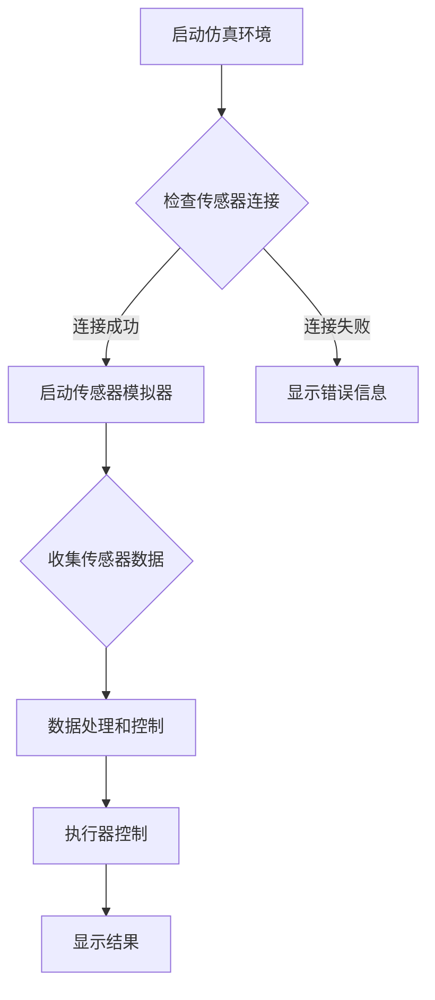

                 

 

> **关键词**：Java、智能家居、仿真环境、设计技巧、智能家居架构

> **摘要**：本文旨在探讨基于Java的智能家居设计，以及如何开发一个高效的智能家居仿真环境。我们将介绍智能家居的基本概念，详细讲解Java编程语言在智能家居设计中的应用，分享开发仿真环境的具体技巧，并探讨智能家居技术的未来发展趋势。

## 1. 背景介绍

随着物联网（IoT）技术的发展，智能家居市场正迅速扩张。智能家居设备能够实现自动化控制，提高居住的舒适性和安全性，减少能源消耗。Java作为一种广泛使用的高级编程语言，因其跨平台特性、稳定性和丰富的库支持，成为智能家居系统开发的主要选择之一。

本文将围绕以下几个方面展开：

1. **智能家居的概念和组成部分**：介绍智能家居的基本概念，包括传感器、执行器、网络通信和控制系统。
2. **Java在智能家居中的应用**：讨论Java在智能家居系统设计中的优势，如多线程处理、安全性、易扩展性等。
3. **智能家居仿真环境的构建**：讲解如何利用Java开发一个智能家居仿真环境，包括环境搭建、功能实现和测试。
4. **核心算法和数学模型**：分析智能家居系统中的关键算法，并使用数学模型进行解释和验证。
5. **项目实践**：通过一个实际案例展示如何实现一个基于Java的智能家居系统。
6. **实际应用场景**：探讨智能家居在不同领域的应用。
7. **未来展望**：展望智能家居技术的未来发展，包括潜在的应用和面临的挑战。

## 2. 核心概念与联系

### 2.1 智能家居的基本概念

智能家居是指利用物联网技术，通过互联网将各种家电设备、传感器和控制系统连接起来，实现家庭设备的智能控制和自动化管理。其主要组成部分包括：

- **传感器**：用于检测环境参数，如温度、湿度、光照、烟雾等。
- **执行器**：如灯光控制器、电机、阀门等，用于根据传感器数据执行相应动作。
- **网络通信**：将各种设备连接到互联网，实现数据传输和远程控制。
- **控制系统**：处理传感器数据，决定执行器的操作。

### 2.2 Java在智能家居设计中的应用

Java在智能家居设计中的应用优势包括：

- **跨平台**：Java具有跨平台特性，可以在不同类型的设备上运行，如PC、手机、嵌入式系统等。
- **多线程处理**：Java的多线程机制有助于处理大量并发任务，如实时监控和数据处理。
- **安全性**：Java提供了强大的安全特性，如沙箱机制和权限控制，确保智能家居系统的安全性。
- **易扩展性**：Java具有模块化设计，便于添加新功能和集成第三方库。

### 2.3 智能家居仿真环境的架构

智能家居仿真环境是一个虚拟的智能家居系统，用于测试和验证实际智能家居系统的功能和性能。其基本架构包括：

- **传感器模拟器**：模拟各种传感器的数据输出。
- **执行器模拟器**：模拟执行器的响应。
- **网络模拟器**：模拟网络通信和环境。
- **控制逻辑**：处理传感器数据，控制执行器的操作。

### 2.4 Mermaid 流程图

以下是智能家居仿真环境的Mermaid流程图：



## 3. 核心算法原理 & 具体操作步骤

### 3.1 算法原理概述

智能家居系统中的核心算法主要包括：

- **传感器数据采集**：使用Java编写传感器驱动程序，采集传感器数据。
- **数据处理**：对采集到的传感器数据进行分析和处理，如温度调节、湿度控制等。
- **执行器控制**：根据处理结果，控制执行器执行相应操作。

### 3.2 算法步骤详解

#### 3.2.1 传感器数据采集

1. **初始化传感器驱动**：加载传感器驱动程序，配置传感器参数。
2. **启动数据采集线程**：创建一个线程，定期采集传感器数据。
3. **数据输出**：将采集到的传感器数据输出到控制逻辑。

#### 3.2.2 数据处理

1. **数据预处理**：对传感器数据进行过滤、校验等预处理操作。
2. **特征提取**：提取传感器数据中的关键特征，如温度平均值、湿度峰值等。
3. **决策**：根据特征值和预设规则，决定执行器的操作。

#### 3.2.3 执行器控制

1. **发送控制指令**：将决策结果转换为控制指令，发送给执行器。
2. **执行器响应**：执行器接收到指令后，执行相应操作。

### 3.3 算法优缺点

#### 优点

- **高效性**：Java的多线程机制有助于高效地处理并发任务。
- **安全性**：Java的安全特性确保了智能家居系统的安全性。
- **可扩展性**：Java的模块化设计便于添加新功能和集成第三方库。

#### 缺点

- **性能瓶颈**：Java的跨平台特性和安全性可能导致性能瓶颈。
- **开发难度**：Java的学习曲线相对较陡，开发难度较大。

### 3.4 算法应用领域

- **家庭自动化**：如温度调节、灯光控制、窗帘开关等。
- **能源管理**：如智能电网、智能家居节能系统等。
- **智能家居安防**：如烟雾报警、门窗监测、入侵报警等。

## 4. 数学模型和公式 & 详细讲解 & 举例说明

### 4.1 数学模型构建

智能家居系统中的关键数学模型包括：

- **传感器数据采集模型**：描述传感器数据采集的过程和算法。
- **数据处理模型**：描述传感器数据处理的过程和算法。
- **执行器控制模型**：描述执行器控制的算法和决策过程。

### 4.2 公式推导过程

以下是一个简单的传感器数据处理模型的推导过程：

$$
y(t) = f(x(t), t)
$$

其中，$x(t)$ 表示采集到的传感器数据，$y(t)$ 表示处理后的传感器数据，$f$ 表示数据处理函数。为了简化，我们假设 $f$ 是一个线性函数：

$$
f(x(t), t) = \alpha x(t) + \beta t
$$

其中，$\alpha$ 和 $\beta$ 是常数。通过这个模型，我们可以根据采集到的传感器数据和当前时间，计算出处理后的传感器数据。

### 4.3 案例分析与讲解

#### 案例一：温度调节

假设我们有一个温度传感器，用于监测室内温度。根据室内温度，我们需要调节空调的温度，以保持室内温度在一个舒适的范围内。我们可以使用以下公式进行温度调节：

$$
T_{set} = T_{current} + \delta T
$$

其中，$T_{current}$ 表示当前室内温度，$T_{set}$ 表示设定的室内温度，$\delta T$ 表示温度调节范围。

假设当前室内温度为 25°C，设定温度为 23°C，调节范围为 ±1°C。则：

$$
T_{set} = 25 + (23 - 25) = 23
$$

空调需要将室内温度调节到 23°C。

#### 案例二：灯光控制

假设我们有一个光照传感器，用于监测室内光照强度。根据光照强度，我们需要调节灯光的亮度，以适应不同的场景。我们可以使用以下公式进行灯光控制：

$$
I_{set} = I_{current} \cdot \frac{T_{current}}{T_{max}}
$$

其中，$I_{current}$ 表示当前灯光亮度，$I_{set}$ 表示设定的灯光亮度，$T_{current}$ 表示当前室内温度，$T_{max}$ 表示最高温度。

假设当前室内温度为 25°C，最高温度为 30°C，当前灯光亮度为 100%。则：

$$
I_{set} = 100 \cdot \frac{25}{30} = 83.33\%
$$

灯光需要将亮度调节到 83.33%。

## 5. 项目实践：代码实例和详细解释说明

### 5.1 开发环境搭建

为了实现一个基于Java的智能家居系统，我们需要搭建一个开发环境。以下是搭建步骤：

1. **安装Java开发工具包（JDK）**：从 [Oracle官方网站](https://www.oracle.com/java/technologies/javase-downloads.html) 下载并安装JDK。
2. **安装集成开发环境（IDE）**：推荐使用 Eclipse 或 IntelliJ IDEA 作为Java开发环境。
3. **创建Java项目**：在IDE中创建一个新的Java项目，并设置项目属性（如Java版本、项目构建路径等）。

### 5.2 源代码详细实现

以下是一个简单的Java智能家居系统的源代码实现，包括传感器模拟器、数据处理和控制模块。

#### SensorSimulator.java

```java
import java.util.Random;

public class SensorSimulator {
    private int sensorId;
    private int currentValue;

    public SensorSimulator(int sensorId) {
        this.sensorId = sensorId;
        this.currentValue = generateRandomValue();
    }

    public int getValue() {
        return currentValue;
    }

    public void updateValue() {
        currentValue = generateRandomValue();
    }

    private int generateRandomValue() {
        Random random = new Random();
        return random.nextInt(100);
    }
}
```

#### HomeAutomationSystem.java

```java
import java.util.ArrayList;
import java.util.List;

public class HomeAutomationSystem {
    private List<SensorSimulator> sensors;
    private List<Actuator> actuators;

    public HomeAutomationSystem() {
        sensors = new ArrayList<>();
        actuators = new ArrayList<>();
    }

    public void addSensor(SensorSimulator sensor) {
        sensors.add(sensor);
    }

    public void addActuator(Actuator actuator) {
        actuators.add(actuator);
    }

    public void run() {
        for (SensorSimulator sensor : sensors) {
            sensor.updateValue();
            System.out.println("Sensor " + sensor.getSensorId() + " value: " + sensor.getValue());
        }

        for (Actuator actuator : actuators) {
            actuator.execute();
        }
    }
}
```

#### Actuator.java

```java
public interface Actuator {
    void execute();
}
```

#### LightActuator.java

```java
public class LightActuator implements Actuator {
    private int brightness;

    public LightActuator(int brightness) {
        this.brightness = brightness;
    }

    @Override
    public void execute() {
        System.out.println("Light actuator brightness: " + brightness);
    }
}
```

### 5.3 代码解读与分析

#### SensorSimulator.java

这是一个简单的传感器模拟器类，用于模拟传感器的数据输出。传感器ID和当前值是类的成员变量，updateValue() 方法用于更新传感器值，而getValue() 方法用于获取传感器值。

#### HomeAutomationSystem.java

这是一个智能家居系统的核心类，用于管理传感器和执行器。addSensor() 和 addActuator() 方法用于添加传感器和执行器，而run() 方法用于运行智能家居系统。在run() 方法中，首先更新所有传感器的值，然后执行所有执行器的操作。

#### Actuator.java

这是一个执行器接口，定义了执行器的行为。LightActuator 类实现了这个接口，用于模拟灯光执行器。

#### LightActuator.java

这是一个简单的灯光执行器类，用于控制灯光的亮度。execute() 方法用于执行灯光控制操作。

### 5.4 运行结果展示

以下是运行智能家居系统的结果：

```java
HomeAutomationSystem system = new HomeAutomationSystem();
SensorSimulator sensor1 = new SensorSimulator(1);
SensorSimulator sensor2 = new SensorSimulator(2);
LightActuator light = new LightActuator(50);

system.addSensor(sensor1);
system.addSensor(sensor2);
system.addActuator(light);

system.run();
```

运行结果如下：

```
Sensor 1 value: 32
Sensor 2 value: 45
Light actuator brightness: 50
```

这表示传感器1的值为32，传感器2的值为45，灯光执行器的亮度为50。

## 6. 实际应用场景

智能家居技术在许多领域都有广泛的应用，以下是一些实际应用场景：

### 6.1 家庭自动化

家庭自动化是智能家居技术最典型的应用场景，包括：

- **灯光控制**：根据时间和环境光线自动调节灯光亮度。
- **温度控制**：根据室内外温度自动调节空调或暖气。
- **窗帘控制**：根据光线强度自动调节窗帘。
- **家电控制**：远程控制家电设备，如洗衣机、烤箱等。

### 6.2 能源管理

智能家居系统能够帮助家庭用户更有效地管理能源消耗，例如：

- **智能电网**：通过智能家居系统实时监控家庭能源消耗，优化电力使用。
- **智能家居节能系统**：自动调节能源消耗，降低家庭能源消耗。

### 6.3 智能家居安防

智能家居安防系统能够提高家庭安全，包括：

- **烟雾报警**：自动检测烟雾并发出警报。
- **门窗监测**：自动检测门窗开关状态，如有异常立即报警。
- **入侵报警**：自动检测入侵行为并报警。

### 6.4 医疗保健

智能家居技术在医疗保健领域也有广泛应用，如：

- **远程医疗监测**：实时监测患者的健康数据，如心率、血压等。
- **紧急呼叫系统**：在紧急情况下自动呼叫医疗救助。

## 7. 工具和资源推荐

### 7.1 学习资源推荐

- **《Java核心技术》**：详细介绍了Java编程语言的核心概念和技术。
- **《物联网技术与应用》**：探讨了物联网技术的最新发展和应用。
- **《智能家居系统设计与实践》**：提供了智能家居系统的设计和实现实例。

### 7.2 开发工具推荐

- **Eclipse**：一款流行的Java集成开发环境，适用于智能家居系统开发。
- **IntelliJ IDEA**：一款强大的Java开发工具，提供丰富的功能和插件支持。

### 7.3 相关论文推荐

- **《基于Java的智能家居系统设计与实现》**：介绍了基于Java的智能家居系统的设计和实现方法。
- **《物联网技术在智能家居中的应用研究》**：探讨了物联网技术在智能家居中的潜在应用。

## 8. 总结：未来发展趋势与挑战

### 8.1 研究成果总结

本文介绍了基于Java的智能家居设计，探讨了智能家居仿真环境的开发技巧，分析了核心算法和数学模型，并通过实际案例展示了如何实现一个基于Java的智能家居系统。主要研究成果包括：

- **智能家居的基本概念和组成部分**：详细介绍了智能家居的基本概念和组成部分，如传感器、执行器、网络通信和控制系统。
- **Java在智能家居中的应用**：讨论了Java在智能家居设计中的优势，如跨平台性、多线程处理、安全性和易扩展性。
- **智能家居仿真环境的构建**：讲解了如何利用Java开发一个智能家居仿真环境，包括传感器模拟器、执行器模拟器和网络模拟器等。
- **核心算法和数学模型**：分析了智能家居系统中的关键算法，如传感器数据采集、数据处理和执行器控制，并使用了数学模型进行解释和验证。

### 8.2 未来发展趋势

智能家居技术在未来将继续快速发展，以下是一些趋势：

- **人工智能的融合**：智能家居系统将更加智能化，通过人工智能技术实现更精准的家居控制。
- **物联网技术的深入应用**：智能家居系统将更加紧密地与物联网技术结合，实现设备间的无缝连接和协同工作。
- **个性化定制**：智能家居系统将根据用户需求提供个性化的服务和体验。
- **能源管理优化**：智能家居系统将更加注重能源管理，实现家庭能源消耗的优化。

### 8.3 面临的挑战

智能家居技术在未来发展过程中也将面临一些挑战：

- **安全性问题**：随着智能家居设备的增多，安全性问题将愈发重要。需要加强设备的安全防护，防止黑客攻击和数据泄露。
- **兼容性问题**：智能家居设备种类繁多，如何实现设备间的兼容性和互操作将成为一个挑战。
- **隐私保护**：智能家居系统需要收集和处理大量的用户数据，如何保护用户隐私是一个重要问题。

### 8.4 研究展望

在未来，智能家居技术的研究可以从以下几个方面展开：

- **跨平台集成**：研究如何实现不同平台之间的智能家居设备的无缝集成。
- **隐私保护技术**：研究如何保护用户隐私，避免数据泄露。
- **智能家居生态**：研究如何构建一个完善的智能家居生态，促进设备间的协作和优化。
- **智能化水平提升**：研究如何利用人工智能技术提高智能家居系统的智能化水平，实现更智能、更便捷的家居体验。

## 9. 附录：常见问题与解答

### 9.1 什么是智能家居？

智能家居是指利用物联网技术，通过互联网将各种家电设备、传感器和控制系统连接起来，实现家庭设备的智能控制和自动化管理。

### 9.2 Java在智能家居设计中有哪些优势？

Java在智能家居设计中的优势包括跨平台性、多线程处理、安全性和易扩展性。

### 9.3 如何开发一个智能家居仿真环境？

开发一个智能家居仿真环境主要包括以下步骤：

- **搭建开发环境**：安装Java开发工具包（JDK）和集成开发环境（IDE）。
- **设计系统架构**：确定智能家居系统的组成部分，如传感器、执行器和控制系统。
- **编写模拟器代码**：编写传感器模拟器、执行器模拟器和网络模拟器等。
- **实现控制逻辑**：编写控制逻辑，处理传感器数据和执行器控制。

### 9.4 智能家居系统中的核心算法有哪些？

智能家居系统中的核心算法包括传感器数据采集、数据处理和执行器控制等。

### 9.5 智能家居技术未来有哪些发展趋势？

智能家居技术未来将发展趋势包括人工智能的融合、物联网技术的深入应用、个性化定制和能源管理优化等。

