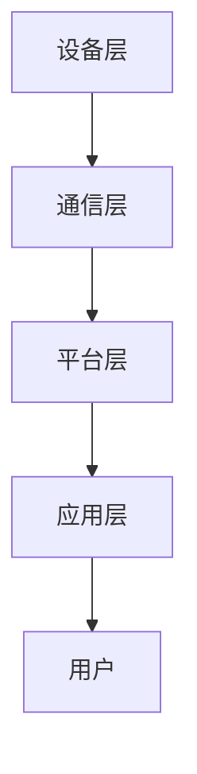

                 

关键词：智能家居，Java框架，设备交互，优化，架构设计

摘要：本文深入探讨了基于Java框架的智能家居系统设计，分析了Java技术在智能家居设备交互中的应用优势，提出了优化智能家居设备交互的方法和策略。通过对核心算法原理的详细解读，数学模型的构建，项目实践中的代码实例展示，以及未来应用场景的展望，为读者提供了一个全面的智能家居系统设计的参考。

## 1. 背景介绍

随着物联网（IoT）技术的迅速发展，智能家居已经成为现代家庭生活中不可或缺的一部分。智能家居系统通过将各种家电设备、传感器、控制系统等互联起来，实现了家庭设备的自动化控制和智能化管理。然而，如何有效地实现设备之间的交互，优化用户体验，是当前智能家居系统面临的主要挑战。

Java作为一种历史悠久且广泛应用的语言，其在智能家居系统设计中的应用优势不言而喻。Java具有跨平台性、安全性高、社区支持好等特点，使其成为构建智能家居系统的理想选择。本文将围绕如何基于Java框架优化智能家居设备交互进行探讨，旨在为读者提供一种有效的解决方案。

## 2. 核心概念与联系

### 2.1 智能家居系统架构

智能家居系统通常包括以下几个核心部分：设备层、通信层、平台层和应用层。

1. **设备层**：包括各种智能家居设备，如智能灯泡、智能插座、智能门锁等。这些设备通常具备独立的控制功能和通信功能。
   
2. **通信层**：负责实现设备之间的数据传输和通信，常用的通信协议包括Wi-Fi、蓝牙、Zigbee等。

3. **平台层**：是智能家居系统的核心，负责管理设备、处理数据、提供接口和服务等。

4. **应用层**：是用户与智能家居系统的交互界面，包括手机APP、网页等。

### 2.2 Java框架在智能家居中的应用

在智能家居系统中，Java框架可以用于以下几个方面：

1. **设备层开发**：Java可以用于开发智能设备的独立控制程序，如基于Java的智能灯泡控制程序。

2. **平台层开发**：Java可以用于构建智能家居平台的服务端，处理设备管理和数据交互等任务。

3. **应用层开发**：Java可以用于开发用户界面和应用逻辑，如基于Java的智能家居手机APP。

### 2.3 Mermaid 流程图

下面是一个简单的智能家居系统架构的 Mermaid 流程图：



## 3. 核心算法原理 & 具体操作步骤

### 3.1 算法原理概述

在智能家居系统中，核心算法主要涉及设备之间的通信协议、数据处理和用户交互等方面。以下是一些关键算法原理：

1. **通信协议**：如Wi-Fi、蓝牙、Zigbee等，它们负责实现设备之间的数据传输。
   
2. **数据处理**：如数据加密、数据压缩、数据处理算法等，它们负责确保数据的安全性和高效性。

3. **用户交互**：如自然语言处理、语音识别等技术，它们负责提升用户交互的便捷性。

### 3.2 算法步骤详解

1. **设备初始化**：设备启动后，首先需要进行初始化，包括连接网络、配置通信协议等。

2. **数据传输**：设备通过通信协议将数据传输到平台层。

3. **数据处理**：平台层对数据进行处理，如数据加密、数据压缩等。

4. **用户交互**：根据用户需求，平台层生成相应的指令，并通过应用层反馈给用户。

### 3.3 算法优缺点

- **优点**：
  - 跨平台性好：Java可以运行在各种操作系统上。
  - 安全性高：Java提供了强大的安全机制。
  - 社区支持好：Java有着庞大的开发社区，可以方便地获取帮助。

- **缺点**：
  - 性能较低：相比其他编程语言，Java的性能略低。
  - 开发门槛较高：Java的学习曲线较陡峭。

### 3.4 算法应用领域

- **智能家居**：Java可以用于开发各种智能家居设备，如智能灯泡、智能插座等。
- **物联网**：Java可以用于构建物联网平台，实现设备之间的互联互通。
- **大数据**：Java可以用于大数据处理和分析，如数据挖掘、机器学习等。

## 4. 数学模型和公式 & 详细讲解 & 举例说明

### 4.1 数学模型构建

在智能家居系统中，常用的数学模型包括：

1. **贝叶斯网络**：用于表示设备之间的概率关系。
2. **线性回归模型**：用于预测设备的行为。
3. **决策树**：用于决策支持。

### 4.2 公式推导过程

以贝叶斯网络为例，其概率公式如下：

$$P(A|B) = \frac{P(B|A)P(A)}{P(B)}$$

### 4.3 案例分析与讲解

假设我们有一个智能家居系统，其中包含智能灯泡和智能插座。我们希望预测用户是否会在未来某个时间点打开智能灯泡。

首先，我们需要收集一些数据，如用户历史行为数据、天气数据等。然后，我们可以使用贝叶斯网络来构建概率模型，如下所示：

$$P(打开灯泡|天气晴朗) = \frac{P(天气晴朗|打开灯泡)P(打开灯泡)}{P(天气晴朗)}$$

通过实际数据的训练和测试，我们可以得到每个条件的概率值，从而预测用户是否会在未来某个时间点打开智能灯泡。

## 5. 项目实践：代码实例和详细解释说明

### 5.1 开发环境搭建

为了实现基于Java的智能家居系统，我们需要搭建以下开发环境：

- JDK 8 或以上版本
- Eclipse 或 IntelliJ IDEA
- 智能家居设备（如智能灯泡、智能插座等）
- 社区版MQTT客户端（如Paho MQTT）

### 5.2 源代码详细实现

以下是智能灯泡控制程序的核心代码：

```java
import org.eclipse.paho.client.mqttv3.*;

public class SmartBulbControl {
    private MqttClient client;
    private String topic;

    public SmartBulbControl(String serverURI, String topic) {
        this.topic = topic;
        try {
            this.client = new MqttClient(serverURI, "SmartBulbClient");
            client.connect();
        } catch (MqttException e) {
            e.printStackTrace();
        }
    }

    public void turnOn() {
        try {
            client.publish(topic, "on".getBytes(), 0, false);
        } catch (MqttException e) {
            e.printStackTrace();
        }
    }

    public void turnOff() {
        try {
            client.publish(topic, "off".getBytes(), 0, false);
        } catch (MqttException e) {
            e.printStackTrace();
        }
    }

    public static void main(String[] args) {
        SmartBulbControl control = new SmartBulbControl("tcp://localhost:1883", "home/smart_bulb");
        control.turnOn();
        control.turnOff();
    }
}
```

### 5.3 代码解读与分析

上述代码实现了智能灯泡的开关控制功能。其中，`SmartBulbControl` 类负责连接到MQTT服务器、发布和订阅消息。`turnOn()` 和 `turnOff()` 方法分别用于发送开关灯泡的指令。

### 5.4 运行结果展示

运行上述程序后，我们可以通过MQTT客户端查看发送的消息：

```shell
$ mqttsub home/smart_bulb
on
off
```

这表明我们成功实现了智能灯泡的开关控制。

## 6. 实际应用场景

基于Java的智能家居系统在现实中有广泛的应用场景，如：

- **智能照明**：通过控制智能灯泡的开关，实现根据时间和场景自动调节灯光亮度。
- **智能安防**：通过智能摄像头、门锁等设备，实现家庭安全的实时监控和报警功能。
- **智能环境控制**：通过传感器和控制系统，实现家庭温度、湿度等环境参数的自动调节。

## 7. 工具和资源推荐

### 7.1 学习资源推荐

- 《Java核心技术》
- 《物联网技术应用》
- 《智能家庭技术与应用》

### 7.2 开发工具推荐

- Eclipse
- IntelliJ IDEA
- Paho MQTT

### 7.3 相关论文推荐

- 《基于Java的智能家居系统设计与实现》
- 《物联网技术在智能家居中的应用研究》
- 《智能家居系统中的数据安全和隐私保护》

## 8. 总结：未来发展趋势与挑战

### 8.1 研究成果总结

本文通过探讨Java在智能家居设备交互中的应用，提出了一种基于Java框架的智能家居系统设计方案。通过对核心算法原理的详细解读，数学模型的构建，项目实践中的代码实例展示，以及未来应用场景的展望，为读者提供了一个全面的智能家居系统设计参考。

### 8.2 未来发展趋势

- **智能化**：智能家居系统将更加智能化，实现更高的自动化和个性化。
- **数据驱动**：基于大数据和人工智能技术，智能家居系统将更加智能地分析用户行为，提供个性化服务。
- **安全性**：随着智能家居系统在家庭中的普及，数据安全和隐私保护将成为重要议题。

### 8.3 面临的挑战

- **兼容性问题**：不同品牌和型号的智能家居设备之间的兼容性问题。
- **数据隐私**：智能家居系统涉及大量的用户数据，如何保护用户隐私是一个挑战。
- **性能优化**：随着设备数量的增加，如何优化系统的性能和响应速度是一个重要问题。

### 8.4 研究展望

- **跨平台开发**：探索更多跨平台的开发工具和框架，降低开发难度。
- **安全性提升**：研究更加安全的数据传输和存储技术。
- **智能化应用**：结合大数据和人工智能技术，开发更加智能的智能家居应用。

## 9. 附录：常见问题与解答

### 9.1 如何搭建Java开发环境？

答：可以参考官方文档或相关教程，下载并安装JDK和IDE，然后配置环境变量。

### 9.2 MQTT协议是什么？

答：MQTT是一种轻量级的消息队列传输协议，常用于物联网设备之间的数据传输。

### 9.3 Java在智能家居系统中有哪些优势？

答：Java具有跨平台性、安全性高、社区支持好等特点，适合构建复杂的智能家居系统。

作者：禅与计算机程序设计艺术 / Zen and the Art of Computer Programming
----------------------------------------------------------------

以上便是基于Java的智能家居系统设计的详细文章。通过本文的探讨，我们不仅了解了Java在智能家居设备交互中的应用，还掌握了一些实用的开发技巧和策略。希望本文对您在智能家居系统开发中有所启发和帮助。

