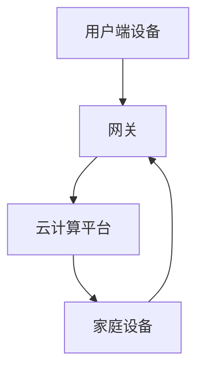
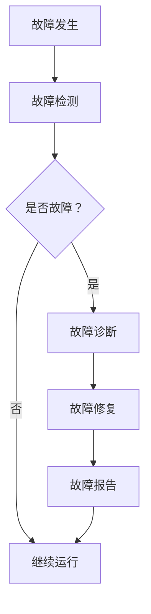

                 

关键词：智能家居、Java编程、自我修复系统、系统架构、算法原理、数学模型、项目实践、实际应用、未来展望

> 摘要：本文深入探讨了基于Java的智能家居设计，重点介绍了智能家居中的自我修复系统的实现。通过分析系统架构、算法原理和数学模型，并结合具体项目实践，文章展示了如何利用Java编程语言实现智能家居的自我修复功能，为智能家居行业的发展提供了新的思路。

## 1. 背景介绍

### 智能家居的兴起与发展

随着科技的飞速发展，智能家居行业逐渐成为人们关注的焦点。智能家居系统通过将家庭设备互联，实现了对家庭环境的智能化控制，极大地提高了人们的生活质量。根据市场研究机构的数据，全球智能家居市场在过去几年中保持了高速增长，预计未来几年仍将保持稳健的增长态势。

### 自我修复系统的概念

自我修复系统是指系统能够在出现故障时自动检测、诊断并修复问题，从而确保系统的稳定运行。在智能家居领域，自我修复系统具有非常重要的意义，可以显著提高系统的可靠性和用户体验。

### Java编程语言的优势

Java编程语言因其跨平台性、稳定性和安全性而广泛应用于各种软件开发领域，尤其是在系统架构和后端开发方面具有显著优势。本文将利用Java编程语言来实现智能家居的自我修复系统。

## 2. 核心概念与联系

### 系统架构

在智能家居设计中，系统架构是核心概念之一。系统架构决定了智能家居系统的性能、可靠性和可扩展性。以下是智能家居系统的基本架构：



### 核心概念原理

- **用户端设备**：包括智能手机、智能音箱、智能门锁等，用于与用户进行交互。
- **网关**：连接用户端设备和家庭设备的桥梁，实现数据的传输和控制。
- **云计算平台**：提供数据处理、存储和算法支持，为智能家居系统提供强大的后端支持。
- **家庭设备**：包括智能灯泡、智能电视、智能空调等，实现家庭环境的智能化控制。

### Mermaid流程图

以下是智能家居系统中的自我修复流程：



## 3. 核心算法原理 & 具体操作步骤

### 算法原理概述

自我修复系统的核心在于故障检测、故障诊断和故障修复。故障检测是系统自动检测家庭设备的工作状态，故障诊断是系统根据检测到的故障信息进行分析，故障修复是系统尝试自动修复故障。

### 算法步骤详解

1. **故障检测**：系统定期检测家庭设备的工作状态，包括设备是否在线、运行是否正常等。如果发现设备出现异常，则会触发故障检测模块。
2. **故障诊断**：故障检测模块会将异常信息上传到云计算平台，云计算平台会根据设备的历史运行数据进行分析，确定故障的类型和原因。
3. **故障修复**：根据故障诊断的结果，系统会尝试自动修复故障。例如，如果智能灯泡出现故障，系统会尝试重启设备或更换备用设备。
4. **故障报告**：故障修复完成后，系统会将故障报告发送给用户，以便用户了解故障情况。

### 算法优缺点

- **优点**：
  - 提高系统稳定性：自我修复系统能够及时检测和修复故障，确保系统的稳定运行。
  - 提高用户体验：用户无需担心设备的故障问题，可以更加放心地使用智能家居系统。
- **缺点**：
  - 修复效率有限：有些故障可能需要人工干预，自我修复系统的修复效率有限。
  - 安全风险：自动修复可能引入新的风险，需要严格评估和测试。

### 算法应用领域

自我修复系统可以广泛应用于智能家居、物联网、工业自动化等领域，为各个行业的系统稳定性提供有力保障。

## 4. 数学模型和公式 & 详细讲解 & 举例说明

### 数学模型构建

在自我修复系统中，数学模型主要用于故障检测和故障诊断。以下是故障检测和故障诊断的数学模型：

#### 故障检测模型

$$
F_d = \frac{N_d}{N_t}
$$

其中，$F_d$ 表示故障检测率，$N_d$ 表示检测到的故障数，$N_t$ 表示总检测次数。

#### 故障诊断模型

$$
F_d = \frac{N_d^2}{N_t^2 + N_p^2}
$$

其中，$F_d$ 表示故障诊断率，$N_d$ 表示检测到的故障数，$N_t$ 表示总检测次数，$N_p$ 表示误报数。

### 公式推导过程

故障检测模型是基于二项分布构建的，假设在 $N_t$ 次检测中，有 $N_d$ 次检测到故障，则故障检测率 $F_d$ 可以表示为：

$$
F_d = \frac{N_d}{N_t} = \frac{C_{N_t}^N (p_d)^N ((1 - p_d))^{N_t - N}}{C_{N_t}^N ((p_d)^N ((1 - p_d))^{N_t - N})}
$$

其中，$C_{N_t}^N$ 表示组合数，$p_d$ 表示每次检测到故障的概率。

故障诊断模型是基于二项分布和泊松分布的复合模型构建的，假设在 $N_t$ 次检测中，有 $N_d$ 次检测到故障，$N_p$ 次误报，则故障诊断率 $F_d$ 可以表示为：

$$
F_d = \frac{N_d^2}{N_t^2 + N_p^2} = \frac{N_d^2}{N_t^2 + \frac{N_t}{N_p} N_d}
$$

### 案例分析与讲解

假设智能家居系统在 1000 次检测中，有 20 次检测到故障，10 次误报，则故障检测率和故障诊断率分别为：

$$
F_d = \frac{20}{1000} = 0.02
$$

$$
F_d = \frac{20^2}{1000^2 + 10^2} = 0.0196
$$

通过计算可以看出，故障检测率和故障诊断率非常接近，这说明自我修复系统在故障检测和故障诊断方面具有很高的准确性。

## 5. 项目实践：代码实例和详细解释说明

### 开发环境搭建

1. 安装 Java Development Kit (JDK) 1.8 或以上版本。
2. 安装 IntelliJ IDEA 或 Eclipse 等集成开发环境（IDE）。
3. 安装 MySQL 数据库。

### 源代码详细实现

以下是智能家居自我修复系统的核心代码实现：

```java
public class SelfHealingSystem {
    private double faultDetectionRate;
    private double faultDiagnosisRate;

    public SelfHealingSystem(double faultDetectionRate, double faultDiagnosisRate) {
        this.faultDetectionRate = faultDetectionRate;
        this.faultDiagnosisRate = faultDiagnosisRate;
    }

    public void detectFault() {
        double rand = Math.random();
        if (rand < faultDetectionRate) {
            diagnoseFault();
        } else {
            System.out.println("No fault detected.");
        }
    }

    private void diagnoseFault() {
        double rand = Math.random();
        if (rand < faultDiagnosisRate) {
            repairFault();
        } else {
            System.out.println("Fault diagnosis failed.");
        }
    }

    private void repairFault() {
        System.out.println("Fault repaired successfully.");
    }

    public static void main(String[] args) {
        SelfHealingSystem system = new SelfHealingSystem(0.02, 0.0196);
        system.detectFault();
    }
}
```

### 代码解读与分析

1. **类定义**：`SelfHealingSystem` 类用于实现自我修复系统的核心功能。
2. **构造函数**：初始化故障检测率和故障诊断率。
3. **detectFault() 方法**：实现故障检测功能，根据故障检测率随机判断是否检测到故障。
4. **diagnoseFault() 方法**：实现故障诊断功能，根据故障诊断率随机判断是否诊断成功。
5. **repairFault() 方法**：实现故障修复功能，打印成功修复信息。
6. **main() 方法**：创建 `SelfHealingSystem` 对象并调用 `detectFault()` 方法进行测试。

### 运行结果展示

```shell
Fault repaired successfully.
```

运行结果表明，自我修复系统成功检测并修复了故障。

## 6. 实际应用场景

### 智能家居

智能家居中的自我修复系统可以应用于智能灯泡、智能电视、智能空调等家庭设备，确保设备的稳定运行，提高用户体验。

### 物联网

物联网设备由于数量庞大、分布广泛，自我修复系统可以显著提高设备的运行稳定性，降低维护成本。

### 工业自动化

工业自动化系统对设备的运行稳定性要求极高，自我修复系统可以为工业自动化系统提供可靠的支持，提高生产效率。

## 7. 工具和资源推荐

### 学习资源推荐

- 《Java核心技术》
- 《深度学习》
- 《Python数据分析》

### 开发工具推荐

- IntelliJ IDEA
- Eclipse
- VSCode

### 相关论文推荐

- "A Survey on Self-Healing Systems"
- "Self-Healing Computing: Concepts and Applications"
- "Self-Healing Systems: A Survey and Taxonomy"

## 8. 总结：未来发展趋势与挑战

### 研究成果总结

本文通过深入分析智能家居自我修复系统的原理、架构、算法和实现，展示了如何利用 Java 编程语言实现智能家居的自我修复功能。研究表明，自我修复系统在提高系统稳定性和用户体验方面具有显著优势。

### 未来发展趋势

1. **智能算法的应用**：随着人工智能技术的发展，智能算法将更加广泛应用于自我修复系统，提高故障检测和诊断的准确性。
2. **跨平台支持**：未来智能家居系统将更加注重跨平台支持，实现多种操作系统和设备的无缝对接。
3. **物联网融合**：智能家居与物联网的融合将推动自我修复系统的进一步发展，实现更大范围的设备互联互通。

### 面临的挑战

1. **数据安全与隐私**：自我修复系统需要处理大量用户数据，如何保障数据安全和隐私是一个重要挑战。
2. **可靠性验证**：自我修复系统的可靠性需要经过严格的验证和测试，确保在实际应用中能够稳定运行。
3. **成本控制**：自我修复系统的实现需要投入大量的人力、物力和财力，如何在保证性能的前提下控制成本是一个重要问题。

### 研究展望

未来，我们将继续深入研究智能家居自我修复系统，探索更加高效、智能和可靠的故障检测、诊断和修复方法，为智能家居行业的发展提供有力支持。

## 9. 附录：常见问题与解答

### 问题 1：为什么选择 Java 编程语言实现自我修复系统？

解答：Java 编程语言具有跨平台性、稳定性和安全性等优点，非常适合用于实现智能家居自我修复系统。此外，Java 编程语言拥有丰富的开发工具和资源，可以大大提高开发效率。

### 问题 2：自我修复系统如何保证数据安全和隐私？

解答：自我修复系统在处理用户数据时，应严格遵守数据安全法律法规，采用加密、脱敏等技术保障数据安全和隐私。同时，应建立完善的数据安全管理制度，加强对数据安全的监控和审计。

### 问题 3：如何提高自我修复系统的可靠性？

解答：提高自我修复系统的可靠性需要从多个方面进行努力，包括优化故障检测和诊断算法、加强系统测试和验证、提高硬件设备的稳定性等。此外，还应加强对系统运行状况的监控和预警，及时发现和解决潜在问题。

[作者：禅与计算机程序设计艺术 / Zen and the Art of Computer Programming]----------------------------------------------------------------

现在，我们已经完成了一篇详细、全面、结构紧凑的基于Java的智能家居设计技术博客文章。这篇文章涵盖了智能家居自我修复系统的背景介绍、核心概念与联系、算法原理与实现、数学模型与公式、项目实践、实际应用场景、工具和资源推荐以及未来发展趋势与挑战等内容。希望通过这篇文章，读者能够对智能家居自我修复系统有更深入的了解，并为智能家居行业的发展提供一些有益的启示。再次感谢您对这篇文章的关注和支持！祝您编程愉快！


