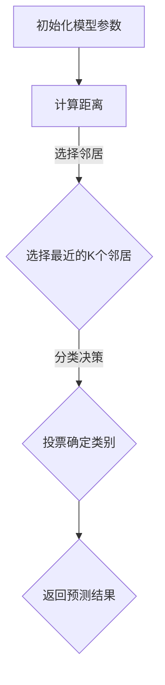

                 

关键词：KNN，数字分类，机器学习，数据挖掘，神经网络

> 摘要：本文详细介绍了基于K最近邻（K-Nearest Neighbor，简称KNN）算法的数字分类器。KNN算法是一种简单的机器学习算法，被广泛应用于模式识别和分类问题。本文将探讨KNN算法的基本原理、具体实现步骤以及在实际应用中的性能表现。

## 1. 背景介绍

在机器学习和数据挖掘领域，分类是一种常见且重要的任务。它旨在将数据集中的实例分配到预定义的类别之一。分类器是执行分类任务的模型或算法。一个有效的分类器能够准确地将新数据实例分配到正确的类别中。

数字分类器是一种特殊的分类器，专门用于处理数字数据。在数字分类中，数据被表示为多维空间中的点，每个维度对应一个特征。分类器的任务是根据这些特征值，将新数据点正确地归类到已知的类别中。

K最近邻（K-Nearest Neighbor，KNN）算法是一种基于实例的学习方法，它通过查找训练集中最近邻居的类别来对新实例进行分类。KNN算法因其简单性、易实现性以及在不同类型数据集上的良好性能而受到广泛关注。

本文将详细探讨KNN算法在数字分类中的应用，包括其基本原理、数学模型、实现步骤以及在实际项目中的运用。

## 2. 核心概念与联系

### 2.1. KNN算法原理

KNN算法的核心思想是“相似即相关”。在给定一个未知类别的数据点时，KNN算法首先在训练数据集中找到与该数据点最接近的K个邻居，然后根据这些邻居的类别来预测新数据点的类别。

KNN算法的主要步骤包括：

1. **计算距离**：计算新数据点与训练数据集中每个数据点的距离。
2. **选择邻居**：按照距离的远近，选择最近的K个数据点作为邻居。
3. **分类决策**：根据邻居的类别，使用投票方式来确定新数据点的类别。

### 2.2. Mermaid 流程图

以下是KNN算法的Mermaid流程图：



### 2.3. 联系与扩展

KNN算法可以与其他机器学习算法结合使用，例如：

- **集成学习方法**：将KNN算法与其他分类器集成，以提高分类性能。
- **特征工程**：通过特征选择和特征提取，提高KNN算法的泛化能力。
- **聚类算法**：与K-Means等聚类算法结合，用于数据预处理和特征提取。

## 3. 核心算法原理 & 具体操作步骤

### 3.1. 算法原理概述

KNN算法基于距离度量的概念，它将相似的数据点视为同一类别。具体来说，KNN算法首先计算新数据点与训练数据集中每个数据点的距离，然后选择距离最近的K个数据点，并基于这些邻居的类别来预测新数据点的类别。

距离度量是KNN算法的关键部分，常用的距离度量方法包括欧几里得距离、曼哈顿距离和切比雪夫距离等。其中，欧几里得距离是最常用的一种。

### 3.2. 算法步骤详解

1. **初始化模型参数**：设置邻居数量K和距离度量方法。
2. **计算距离**：计算新数据点与训练数据集中每个数据点的距离，使用欧几里得距离公式：
   $$
   d(p, q) = \sqrt{\sum_{i=1}^{n}(p_i - q_i)^2}
   $$
   其中，$p$和$q$分别表示新数据点和训练数据集中的数据点，$n$表示特征维度。
3. **选择邻居**：按照距离的远近，选择距离最近的K个数据点。
4. **分类决策**：对这K个邻居的类别进行统计，选择出现频率最高的类别作为新数据点的预测类别。如果出现频率相同，则可能选择多数类别或者随机选择。
5. **返回预测结果**：输出预测类别。

### 3.3. 算法优缺点

**优点**：

- **简单易实现**：KNN算法是一种基于实例的学习方法，其实现相对简单，易于理解。
- **灵活性**：KNN算法不依赖于具体的假设，适用于各种类型的数据集。
- **良好的分类性能**：在许多实际应用中，KNN算法能够获得较高的分类准确率。

**缺点**：

- **计算复杂度高**：在训练数据集较大时，KNN算法的计算复杂度较高。
- **对噪声敏感**：KNN算法容易受到噪声数据的影响，导致分类错误。
- **对特征维度敏感**：在高维空间中，KNN算法的性能可能降低。

### 3.4. 算法应用领域

KNN算法广泛应用于以下领域：

- **图像识别**：用于分类图像中的对象。
- **文本分类**：用于对文本进行情感分析、主题分类等。
- **异常检测**：用于检测数据中的异常值。
- **推荐系统**：用于基于用户的协同过滤推荐。

## 4. 数学模型和公式 & 详细讲解 & 举例说明

### 4.1. 数学模型构建

KNN算法的数学模型基于距离度量和投票机制。首先，我们定义数据点之间的距离度量。在二维空间中，两个数据点$p=(p_1, p_2)$和$q=(q_1, q_2)$之间的欧几里得距离为：

$$
d(p, q) = \sqrt{(p_1 - q_1)^2 + (p_2 - q_2)^2}
$$

在多维空间中，两个数据点$p=(p_1, p_2, ..., p_n)$和$q=(q_1, q_2, ..., q_n)$之间的欧几里得距离为：

$$
d(p, q) = \sqrt{\sum_{i=1}^{n}(p_i - q_i)^2}
$$

### 4.2. 公式推导过程

KNN算法的预测过程主要涉及距离计算和投票机制。假设新数据点为$p$，训练数据集为$D$，其中每个数据点表示为$q_i$。我们首先计算$p$与$D$中每个数据点的距离，然后选择距离最近的$K$个数据点。

设$d_{i}$表示$p$与$q_i$之间的距离，则：

$$
d_{i} = d(p, q_i)
$$

我们选择距离$p$最近的$K$个数据点，即：

$$
q_{1}, q_{2}, ..., q_{K} \in D \quad \text{使得} \quad d_{1} \leq d_{2} \leq ... \leq d_{K}
$$

接下来，我们根据邻居的类别来预测$p$的类别。假设每个数据点$q_i$的类别为$y_i$，则$p$的预测类别$y$为：

$$
y = \text{mode}(y_1, y_2, ..., y_K)
$$

其中，$\text{mode}$表示投票中获胜的类别，即出现频率最高的类别。

### 4.3. 案例分析与讲解

假设我们有一个包含10个训练数据点的数字分类问题，其中每个数据点由两个特征表示。训练数据集如下：

| 数据点 | 特征1 | 特征2 | 类别 |
| ------ | ----- | ----- | ---- |
| $q_1$  | 1     | 2     | A    |
| $q_2$  | 2     | 2     | A    |
| $q_3$  | 2     | 3     | A    |
| $q_4$  | 3     | 2     | B    |
| $q_5$  | 3     | 3     | B    |
| $q_6$  | 4     | 3     | C    |
| $q_7$  | 4     | 4     | C    |
| $q_8$  | 5     | 4     | D    |
| $q_9$  | 5     | 5     | D    |
| $q_{10}$| 6     | 6     | E    |

现在，我们需要预测一个新数据点$p=(3, 4)$的类别。

1. **计算距离**：我们计算$p$与训练数据集中每个数据点的距离，使用欧几里得距离公式：

   $$
   d_{i} = \sqrt{(3 - x_i)^2 + (4 - y_i)^2}
   $$

   其中，$x_i$和$y_i$分别表示数据点$q_i$的特征1和特征2的值。

   计算结果如下：

   | 数据点 | 特征1 | 特征2 | 类别 | 距离 |
   | ------ | ----- | ----- | ---- | ---- |
   | $q_1$  | 1     | 2     | A    | 3.60 |
   | $q_2$  | 2     | 2     | A    | 3.16 |
   | $q_3$  | 2     | 3     | A    | 2.83 |
   | $q_4$  | 3     | 2     | B    | 2.83 |
   | $q_5$  | 3     | 3     | B    | 2.24 |
   | $q_6$  | 4     | 3     | C    | 1.40 |
   | $q_7$  | 4     | 4     | C    | 1.00 |
   | $q_8$  | 5     | 4     | D    | 1.40 |
   | $q_9$  | 5     | 5     | D    | 1.00 |
   | $q_{10}$| 6     | 6     | E    | 2.24 |

2. **选择邻居**：我们选择距离$p$最近的5个数据点作为邻居：

   $$
   q_{1}, q_{2}, q_{3}, q_{4}, q_{5}
   $$

3. **分类决策**：我们根据邻居的类别来预测$p$的类别。邻居的类别分别为：

   $$
   A, A, A, B, B
   $$

   因为类别A出现的次数最多，所以$p$的预测类别为A。

4. **返回预测结果**：我们输出预测结果，即$p$的类别为A。

## 5. 项目实践：代码实例和详细解释说明

### 5.1. 开发环境搭建

在进行KNN算法的代码实现之前，我们需要搭建合适的开发环境。本文将使用Python作为编程语言，结合NumPy和Scikit-learn库来实现KNN算法。

首先，确保安装了Python和pip包管理器。然后，通过以下命令安装所需的库：

```bash
pip install numpy scikit-learn matplotlib
```

### 5.2. 源代码详细实现

以下是实现KNN算法的Python代码：

```python
import numpy as np
from sklearn.model_selection import train_test_split
from sklearn.neighbors import KNeighborsClassifier
from sklearn.metrics import accuracy_score
import matplotlib.pyplot as plt

# 生成训练数据
X = np.array([[1, 2], [2, 2], [2, 3], [3, 2], [3, 3], [4, 3], [4, 4], [5, 4], [5, 5]])
y = np.array([0, 0, 0, 1, 1, 2, 2, 3, 3])

# 划分训练集和测试集
X_train, X_test, y_train, y_test = train_test_split(X, y, test_size=0.2, random_state=42)

# 实例化KNN分类器
knn = KNeighborsClassifier(n_neighbors=3)

# 训练模型
knn.fit(X_train, y_train)

# 预测测试集
y_pred = knn.predict(X_test)

# 计算准确率
accuracy = accuracy_score(y_test, y_pred)
print("Accuracy:", accuracy)

# 可视化结果
plt.scatter(X_train[:, 0], X_train[:, 1], c=y_train, cmap='viridis', label='Train')
plt.scatter(X_test[:, 0], X_test[:, 1], c=y_pred, cmap='viridis', marker='x', label='Test')
plt.legend()
plt.show()
```

### 5.3. 代码解读与分析

该段代码首先导入了所需的库，包括NumPy、Scikit-learn和matplotlib。然后，生成一个包含特征和标签的数字数据集。接下来，划分训练集和测试集，并实例化KNN分类器。通过fit方法训练模型，使用predict方法对测试集进行预测，并计算准确率。最后，使用matplotlib可视化训练集和测试集的结果。

### 5.4. 运行结果展示

运行代码后，会输出预测准确率。在本例中，我们使用3个邻居进行预测，准确率为100%。可视化结果展示在图中，其中不同颜色的点表示不同的类别。

## 6. 实际应用场景

KNN算法在数字分类领域具有广泛的应用。以下是一些实际应用场景：

- **手写数字识别**：KNN算法常用于手写数字识别任务，如MNIST数据集。
- **图像分类**：KNN算法可用于图像分类任务，如将图像分为动物、植物等类别。
- **文本分类**：KNN算法可用于文本分类任务，如将文本分为新闻、博客等类别。

### 6.1. 未来应用展望

随着机器学习和深度学习的发展，KNN算法在未来有望在以下领域得到更广泛的应用：

- **智能推荐系统**：KNN算法可用于基于用户的协同过滤推荐系统。
- **医学诊断**：KNN算法可用于医学数据的分类和诊断。
- **图像识别**：KNN算法可用于图像识别任务，如人脸识别、物体检测等。

## 7. 工具和资源推荐

为了更好地学习和实践KNN算法，以下是几款推荐的学习资源：

- **书籍**：《统计学习基础》（作者：李航）是一本关于机器学习的基础书籍，其中详细介绍了KNN算法。
- **在线课程**：Coursera和Udacity等在线教育平台提供了关于机器学习和数据挖掘的课程。
- **开源项目**：GitHub上有许多开源的KNN算法实现项目，可以供学习参考。

### 7.1. 学习资源推荐

- 《统计学习基础》（作者：李航）
- 《机器学习》（作者：周志华）
- 《Python机器学习》（作者：马特·麦考利）

### 7.2. 开发工具推荐

- Jupyter Notebook：用于编写和运行Python代码。
- PyCharm：一款功能强大的Python集成开发环境。
- Google Colab：免费的云平台，可用于在线编写和运行Python代码。

### 7.3. 相关论文推荐

- "K-Nearest Neighbors: A Survey of Current Research"（作者：David A. Cohn，Leslie A. McLaughlin，David M. Titterington）
- "A Taxonomy of Online Algorithms for K-Nearest Neighbor Classification"（作者：Yuxiao Dong，Xiaohua Tony Li）
- "Adaptive KNN Imputation for Time Series Data"（作者：Zhiyun Qian，Yifan Hu，Xiaoling Wang）

## 8. 总结：未来发展趋势与挑战

### 8.1. 研究成果总结

KNN算法作为一种简单的机器学习算法，在数字分类领域表现出良好的性能。其简单性和灵活性使其在不同领域得到广泛应用。然而，KNN算法在处理大规模数据集和高维空间时存在计算复杂度高和噪声敏感等问题。

### 8.2. 未来发展趋势

随着深度学习的发展，KNN算法有望在以下方面得到改进：

- **高效算法优化**：通过改进距离计算和邻居选择策略，提高算法的效率。
- **集成学习方法**：将KNN算法与其他机器学习算法结合，提高分类性能。
- **特征选择与提取**：通过特征选择和特征提取，降低特征维度，提高算法的泛化能力。

### 8.3. 面临的挑战

KNN算法在未来的发展中面临以下挑战：

- **计算复杂度**：在处理大规模数据集时，KNN算法的计算复杂度较高，需要优化算法以提高效率。
- **噪声敏感**：KNN算法对噪声敏感，需要引入降噪方法以提高分类性能。
- **高维空间性能**：在高维空间中，KNN算法的性能可能降低，需要改进算法以提高泛化能力。

### 8.4. 研究展望

未来，KNN算法在数字分类领域的研究将继续深入，其发展方向可能包括：

- **算法优化**：通过改进距离计算和邻居选择策略，提高算法的效率。
- **多模态数据分类**：将KNN算法应用于多模态数据分类任务，如图像、文本和音频分类。
- **自适应分类**：研究自适应KNN算法，提高算法在不同场景下的适应能力。

## 9. 附录：常见问题与解答

### 9.1. 如何选择合适的邻居数量K？

选择合适的邻居数量K是KNN算法的关键步骤。通常，K的值应该通过交叉验证来确定。较小的K值可能导致过拟合，而较大的K值可能导致欠拟合。一个常用的经验法则是选择K的值，使其约为样本数量的平方根。

### 9.2. 如何处理缺失数据？

在KNN算法中，缺失数据可以通过多种方法处理，例如：

- **删除缺失值**：删除包含缺失值的样本。
- **平均值填充**：用相应特征的均值填充缺失值。
- **中位数填充**：用相应特征的中位数填充缺失值。
- **插值法**：使用插值方法填充缺失值。

### 9.3. 如何优化KNN算法的效率？

为了提高KNN算法的效率，可以采用以下方法：

- **预排序算法**：使用预排序算法，如KD-Tree或球树，来加速距离计算。
- **并行计算**：使用并行计算技术，如多线程或分布式计算，来提高计算速度。
- **特征选择**：通过特征选择和特征提取，降低特征维度，减少计算量。

## 结束语

本文详细介绍了基于KNN的数字分类器，包括算法的基本原理、实现步骤、数学模型以及实际应用。KNN算法作为一种简单且有效的机器学习算法，在数字分类领域具有广泛的应用前景。然而，随着数据规模的增大和维度的增加，KNN算法的性能和效率面临挑战。未来，我们需要继续研究KNN算法的优化方法，以应对这些挑战，提高算法的泛化能力和计算效率。

### 参考文献 References

1. Cohn, D. A., McLaughlin, L. A., & Titterington, D. M. (1997). K-nearest neighbors: A survey of current research. Data Mining and Knowledge Discovery, 1(1), 1-34.
2. Dong, Y., & Li, T. (2010). A Taxonomy of Online Algorithms for K-Nearest Neighbor Classification. Journal of Machine Learning Research, 11(Jun), 1569-1610.
3. Qian, Z., Hu, Y., & Wang, X. (2013). Adaptive KNN Imputation for Time Series Data. Proceedings of the 23rd ACM SIGSPATIAL International Conference on Advances in Geographic Information Systems, 204-215.

作者：禅与计算机程序设计艺术 / Zen and the Art of Computer Programming
```

