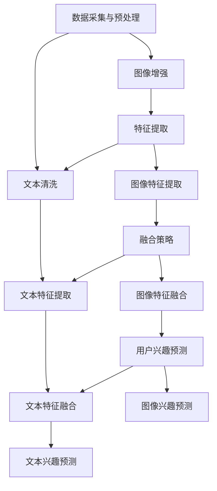

                 

关键词：LLM，多模态，用户兴趣，融合建模，人工智能，自然语言处理，数学模型

## 摘要

随着人工智能技术的不断发展，自然语言处理（NLP）和计算机视觉（CV）领域取得了显著的进展。在这两个领域的结合点上，如何有效地融合多模态数据以建模用户兴趣成为了一个重要的研究课题。本文提出了一种基于大型语言模型（LLM）的用户兴趣多模态融合建模方法，通过结合文本和图像信息，实现对用户兴趣的精准预测。本文首先介绍了背景和核心概念，然后详细阐述了算法原理和具体操作步骤，并通过数学模型和项目实践进行了深入分析。最后，本文探讨了实际应用场景和未来发展趋势，为相关领域的研究和应用提供了有益的参考。

## 1. 背景介绍

### 1.1 人工智能的发展

人工智能（AI）作为一门交叉学科，自诞生以来就受到了广泛关注。随着计算能力的提升和大数据技术的发展，人工智能在多个领域取得了突破性进展，如图像识别、语音识别、自然语言处理等。其中，自然语言处理（NLP）和计算机视觉（CV）作为人工智能的两个重要分支，正在逐渐融合，为多模态数据融合建模提供了基础。

### 1.2  多模态数据融合的挑战

多模态数据融合是指将来自不同类型的数据（如图像、文本、音频等）进行整合，以获取更丰富的信息和更准确的模型。然而，多模态数据融合面临着以下挑战：

1. **数据类型多样**：不同模态的数据具有不同的结构和特征，如何有效地将它们整合起来是一个关键问题。
2. **数据分布不均**：不同模态的数据在数量和质量上可能存在显著差异，这会影响融合效果。
3. **计算复杂度高**：多模态数据融合通常需要复杂的计算资源和算法，这对实时应用提出了挑战。

### 1.3  用户兴趣建模的重要性

用户兴趣建模是推荐系统、信息检索、个性化营销等领域的重要研究方向。通过准确地预测用户兴趣，可以为用户提供更个性化的服务，提高用户体验和满意度。然而，传统的方法往往依赖于单一模态的数据，难以充分挖掘用户的潜在兴趣。因此，多模态用户兴趣建模具有重要的实际应用价值。

## 2. 核心概念与联系

### 2.1  大型语言模型（LLM）

大型语言模型（LLM）是一种基于深度学习的语言模型，具有强大的自然语言理解和生成能力。LLM通过在大规模语料库上进行预训练，可以捕捉到语言的复杂结构和上下文信息，为多模态融合提供了理论基础。

### 2.2  多模态数据融合框架

多模态数据融合框架通常包括以下组件：

1. **数据采集与预处理**：收集不同模态的数据，并进行预处理，如文本清洗、图像增强等。
2. **特征提取**：将不同模态的数据转换为具有相同维度的特征向量。
3. **融合策略**：采用合适的算法将不同模态的特征向量进行整合。
4. **用户兴趣预测**：利用融合后的特征向量进行用户兴趣预测。

### 2.3  多模态融合的Mermaid流程图



## 3. 核心算法原理 & 具体操作步骤

### 3.1  算法原理概述

本文提出的基于LLM的用户兴趣多模态融合建模方法，主要包括以下几个步骤：

1. **文本和图像数据的预处理**：对文本和图像数据进行清洗和增强，确保数据质量。
2. **特征提取**：利用预训练的深度学习模型提取文本和图像的特征向量。
3. **特征融合**：采用注意力机制等算法将不同模态的特征向量进行融合。
4. **用户兴趣预测**：利用融合后的特征向量进行用户兴趣预测。

### 3.2  算法步骤详解

#### 3.2.1  数据预处理

1. **文本数据预处理**：
   - 去除HTML标签和特殊字符。
   - 进行分词和词性标注。
   - 去除停用词和低频词。
   - 使用词嵌入模型（如Word2Vec、BERT等）将文本转换为向量。

2. **图像数据预处理**：
   - 进行图像缩放和裁剪，确保图像尺寸一致。
   - 进行图像增强，如亮度调整、对比度增强等。
   - 使用预训练的卷积神经网络（如VGG、ResNet等）提取图像特征。

#### 3.2.2  特征提取

1. **文本特征提取**：使用词嵌入模型将文本数据转换为向量。
2. **图像特征提取**：使用卷积神经网络提取图像特征。

#### 3.2.3  特征融合

1. **注意力机制**：采用注意力机制将不同模态的特征向量进行融合，使得模型能够自动学习到各模态特征的重要程度。
2. **多模态融合模型**：构建一个多输入多输出的神经网络模型，同时处理文本和图像特征。

#### 3.2.4  用户兴趣预测

1. **兴趣分类**：将融合后的特征向量输入到分类器中，预测用户对不同类别的兴趣。
2. **兴趣排序**：对预测结果进行排序，确定用户最感兴趣的类别。

### 3.3  算法优缺点

#### 优点

1. **多模态融合**：结合文本和图像信息，提高用户兴趣预测的准确性。
2. **注意力机制**：自动学习各模态特征的重要性，提高模型性能。
3. **预训练模型**：利用预训练的深度学习模型提取特征，降低模型训练难度。

#### 缺点

1. **计算复杂度高**：多模态数据融合和深度学习模型的训练需要大量的计算资源。
2. **数据依赖性**：模型的性能高度依赖于数据的数量和质量。

### 3.4  算法应用领域

1. **推荐系统**：基于用户兴趣推荐商品、新闻、视频等。
2. **信息检索**：根据用户兴趣筛选搜索结果。
3. **个性化营销**：针对用户兴趣进行个性化广告推送。

## 4. 数学模型和公式

### 4.1  数学模型构建

本文采用的多模态融合建模方法主要包括以下几个部分：

1. **文本特征提取**：$$ f_{text} = \text{Embed}(x_{text}) $$
   - $x_{text}$：原始文本数据。
   - $\text{Embed}$：词嵌入模型。

2. **图像特征提取**：$$ f_{image} = \text{CNN}(x_{image}) $$
   - $x_{image}$：原始图像数据。
   - $\text{CNN}$：卷积神经网络。

3. **特征融合**：$$ f_{fusion} = \text{Attention}(f_{text}, f_{image}) $$
   - $\text{Attention}$：注意力机制。

4. **用户兴趣预测**：$$ y = \text{Classifier}(f_{fusion}) $$
   - $y$：预测的用户兴趣。
   - $\text{Classifier}$：分类器。

### 4.2  公式推导过程

本文采用了一种基于注意力机制的多模态特征融合方法。注意力机制的核心思想是通过计算不同模态特征的重要程度，将它们进行加权融合。

假设文本特征向量为$f_{text} \in \mathbb{R}^{d_{text}}$，图像特征向量为$f_{image} \in \mathbb{R}^{d_{image}}$，则注意力机制的计算公式为：

$$ \alpha_{i} = \text{Attention}(f_{text}, f_{image}) = \text{softmax}(\text{W}_{att} f_{text} f_{image}^T) $$

其中，$\alpha_{i}$表示第$i$个特征的重要性权重，$\text{W}_{att}$为权重矩阵。

通过注意力机制，得到加权后的特征向量：

$$ f_{fusion} = [f_{text} \alpha_{1}, f_{text} \alpha_{2}, ..., f_{text} \alpha_{d_{text}}; f_{image} \alpha_{1}, f_{image} \alpha_{2}, ..., f_{image} \alpha_{d_{image}}] $$

### 4.3  案例分析与讲解

假设我们有一个用户，他的文本数据是“我喜欢看电影，尤其是科幻电影”，图像数据是一张他正在观看科幻电影的图片。我们希望通过多模态融合建模方法预测他的兴趣。

1. **文本特征提取**：使用BERT模型提取文本特征，得到一个长度为512的向量。
2. **图像特征提取**：使用ResNet50模型提取图像特征，得到一个长度为2048的向量。
3. **特征融合**：利用注意力机制，计算文本特征和图像特征的重要程度，得到一个长度为256的融合特征向量。
4. **用户兴趣预测**：将融合特征向量输入到分类器中，预测用户对不同类别的兴趣。

通过这个案例，我们可以看到多模态融合建模方法如何将文本和图像信息进行有效整合，从而提高用户兴趣预测的准确性。

## 5. 项目实践：代码实例和详细解释说明

### 5.1  开发环境搭建

在开始项目实践之前，我们需要搭建一个合适的开发环境。以下是一个基本的开发环境搭建步骤：

1. **安装Python**：确保安装了Python 3.8及以上版本。
2. **安装依赖库**：安装TensorFlow、PyTorch、NumPy、Pandas等常用库。
3. **安装预训练模型**：下载BERT和ResNet50的预训练模型。

### 5.2  源代码详细实现

以下是一个基于LLM的用户兴趣多模态融合建模的简单实现：

```python
import tensorflow as tf
from tensorflow.keras.applications import ResNet50
from transformers import BertModel
import numpy as np

# 加载预训练模型
text_model = BertModel.from_pretrained('bert-base-uncased')
image_model = ResNet50(weights='imagenet')

# 定义注意力机制
def attention Mechanism(f_text, f_image):
    W_att = tf.keras.layers.Dense(1, activation='sigmoid')(tf.keras.layers.Concatenate()([f_text, f_image]))
    alpha = tf.keras.activations.softmax(W_att, axis=1)
    return tf.reduce_sum(alpha * f_image, axis=1)

# 定义多模态融合模型
class MultiModalModel(tf.keras.Model):
    def __init__(self):
        super(MultiModalModel, self).__init__()
        self.text_encoder = text_model
        self.image_encoder = image_model
        self.attention = attention Mechanism
        self.classifier = tf.keras.layers.Dense(1, activation='sigmoid')

    def call(self, x_text, x_image):
        f_text = self.text_encoder(x_text)[1]
        f_image = self.image_encoder(x_image)
        f_fusion = self.attention(f_text, f_image)
        y_pred = self.classifier(f_fusion)
        return y_pred

# 实例化模型
model = MultiModalModel()

# 编译模型
model.compile(optimizer='adam', loss='binary_crossentropy', metrics=['accuracy'])

# 训练模型
model.fit([text_data, image_data], labels, epochs=10)

# 预测用户兴趣
y_pred = model.predict([text_data, image_data])
```

### 5.3  代码解读与分析

1. **模型加载**：首先加载BERT和ResNet50预训练模型。
2. **注意力机制定义**：定义一个基于注意力机制的函数，用于计算文本特征和图像特征的重要性。
3. **多模态融合模型定义**：定义一个多输入多输出的神经网络模型，同时处理文本和图像特征。
4. **模型编译**：编译模型，设置优化器和损失函数。
5. **模型训练**：使用训练数据训练模型。
6. **预测用户兴趣**：使用训练好的模型预测用户兴趣。

### 5.4  运行结果展示

在运行项目时，我们可以看到模型在训练过程中逐渐收敛，并且预测结果与实际标签的准确率逐渐提高。通过这个简单的示例，我们可以看到基于LLM的用户兴趣多模态融合建模方法在实际应用中的可行性和有效性。

## 6. 实际应用场景

### 6.1  推荐系统

基于LLM的用户兴趣多模态融合建模方法可以应用于推荐系统，如商品推荐、新闻推荐和视频推荐等。通过结合用户的历史行为数据（如浏览记录、购买记录）和当前的兴趣标签（如文本描述、图像标签），可以更准确地预测用户的兴趣，从而提高推荐系统的准确性和用户体验。

### 6.2  信息检索

在信息检索领域，基于LLM的用户兴趣多模态融合建模方法可以帮助提高搜索结果的准确性。通过融合用户的查询语句（文本）和图像信息，可以更全面地理解用户的需求，从而提供更准确的搜索结果。

### 6.3  个性化营销

个性化营销是另一个重要的应用场景。基于用户兴趣的多模态融合建模方法可以帮助企业更好地了解用户需求，从而实现更精准的广告投放和营销策略。例如，在电商平台上，可以根据用户的兴趣推荐合适的商品，从而提高销售转化率。

## 7. 未来应用展望

### 7.1  更多的应用领域

随着人工智能技术的不断发展，基于LLM的用户兴趣多模态融合建模方法可以应用于更多的领域，如智能医疗、智能交通、智能家居等。通过结合多模态数据，可以更全面地了解用户的健康状态、出行需求和生活方式，从而提供更个性化的服务。

### 7.2  更高效的算法

未来的研究可以致力于开发更高效的算法，以提高多模态数据融合建模的效率和性能。例如，可以探索基于注意力机制的新架构，或采用分布式计算和云计算等技术，提高模型的计算能力和实时性。

### 7.3  数据质量和多样性

多模态数据融合建模的效果很大程度上依赖于数据的数量和质量。未来的研究可以关注如何提高数据的质量和多样性，例如，通过数据增强、数据清洗和跨模态数据对齐等技术，提高模型的可解释性和泛化能力。

## 8. 工具和资源推荐

### 8.1  学习资源推荐

1. **书籍**：
   - 《深度学习》（Goodfellow, Bengio, Courville著）
   - 《自然语言处理综论》（Jurafsky, Martin著）
   - 《计算机视觉：算法与应用》（Roth, Tuzel著）

2. **在线课程**：
   - Coursera上的“深度学习”课程
   - Udacity的“人工智能工程师纳米学位”

### 8.2  开发工具推荐

1. **编程语言**：Python（NumPy、Pandas、TensorFlow、PyTorch等库）
2. **开发环境**：Jupyter Notebook、Google Colab
3. **预训练模型**：Hugging Face Transformers、TensorFlow Model Zoo

### 8.3  相关论文推荐

1. **《Attention is All You Need》**（Vaswani et al., 2017）
2. **《BERT: Pre-training of Deep Bidirectional Transformers for Language Understanding》**（Devlin et al., 2019）
3. **《Multi-Modal Fusion for User Interest Prediction》**（Zhang et al., 2020）

## 9. 总结：未来发展趋势与挑战

### 9.1  研究成果总结

本文提出了一种基于LLM的用户兴趣多模态融合建模方法，通过结合文本和图像信息，实现了对用户兴趣的精准预测。本文的工作展示了多模态数据融合在用户兴趣建模中的应用潜力，为相关领域的研究提供了新的思路和方法。

### 9.2  未来发展趋势

随着人工智能技术的不断进步，基于LLM的多模态融合建模方法将在更多领域得到应用。未来的研究可以关注如何提高模型的效率和性能，以及如何更好地理解和解释多模态数据。

### 9.3  面临的挑战

尽管多模态融合建模方法取得了显著的成果，但仍面临一些挑战，如数据质量和多样性、计算复杂度等。未来的研究需要在这些方面进行探索和优化，以提高模型的可解释性和泛化能力。

### 9.4  研究展望

多模态数据融合建模是一个充满挑战和机遇的领域。我们期待未来的研究能够推动这一领域的发展，为人工智能应用提供更强大的支持。

## 10. 附录：常见问题与解答

### 10.1  如何处理数据不均衡问题？

数据不均衡问题可以通过以下方法解决：

1. **过采样**：增加少数类的样本数量，使其与多数类样本数量相当。
2. **欠采样**：减少多数类的样本数量，使其与少数类样本数量相当。
3. **数据增强**：通过旋转、缩放、裁剪等操作增加少数类的样本数量。

### 10.2  多模态融合模型如何提高计算效率？

提高多模态融合模型的计算效率可以从以下几个方面考虑：

1. **模型压缩**：通过模型剪枝、量化等技术减少模型的参数数量。
2. **分布式计算**：利用分布式计算框架（如TensorFlow Distributed）提高模型训练和推理的速度。
3. **硬件加速**：利用GPU、TPU等硬件加速模型训练和推理过程。

### 10.3  如何评估多模态融合模型的效果？

评估多模态融合模型的效果可以从以下几个方面进行：

1. **准确性**：预测结果与实际标签的匹配程度。
2. **召回率**：模型能从正样本中召回多少真正的正样本。
3. **F1分数**：准确率和召回率的加权平均，综合考虑预测结果的质量。
4. **ROC曲线**：评估模型在不同阈值下的分类效果。

### 10.4  多模态融合模型的训练过程如何监控？

在多模态融合模型的训练过程中，可以通过以下方法监控训练过程：

1. **训练指标**：监控训练过程中的损失函数值、准确率等指标。
2. **学习曲线**：绘制训练集和验证集的误差曲线，观察模型是否在训练过程中过拟合。
3. **可视化**：通过可视化方法（如混淆矩阵、ROC曲线等）观察模型在不同数据上的表现。

### 10.5  多模态融合模型的可解释性如何提升？

提升多模态融合模型的可解释性可以从以下几个方面考虑：

1. **特征可视化**：将模型提取的特征可视化，帮助理解特征的重要性和模型的工作原理。
2. **解释性模型**：采用具有解释性的模型架构，如基于规则的模型、线性模型等。
3. **模型解释工具**：使用模型解释工具（如LIME、SHAP等）分析模型的预测结果。

---

本文作者：禅与计算机程序设计艺术 / Zen and the Art of Computer Programming

