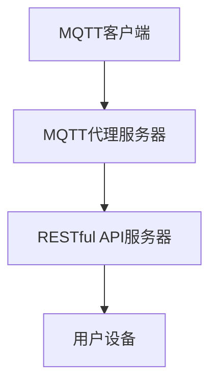

                 

关键词：MQTT协议，RESTful API，智能家居，水质监测，系统设计

> 摘要：本文将探讨如何使用MQTT协议和RESTful API构建一个智能家居水质监测系统。首先介绍MQTT协议和RESTful API的基本概念，然后详细阐述系统的设计思路、核心算法原理、数学模型与公式，并给出一个完整的开发实例。最后，本文还将探讨该系统在实际应用场景中的价值，并对未来发展的趋势和挑战进行分析。

## 1. 背景介绍

随着物联网技术的发展，智能家居市场逐渐兴起。智能家居系统能够让人们更加便捷地控制家中设备，提高生活质量。水质监测作为智能家居的一个重要模块，对于家庭健康和安全具有重要意义。传统的智能家居水质监测系统大多依赖于本地传感器和中心控制器，数据处理和通信方式相对单一，难以实现高效的数据分析和远程监控。为了解决这些问题，本文提出了一种基于MQTT协议和RESTful API的智能家居水质监测系统。

MQTT（Message Queuing Telemetry Transport）是一种轻量级的消息队列传输协议，广泛用于物联网领域。它支持通过代理服务器传输数据，具有低功耗、低带宽的特点，非常适合智能家居等应用场景。RESTful API（Representational State Transfer Application Programming Interface）是一种基于HTTP协议的接口设计风格，使得不同的系统和设备可以通过网络进行交互。使用RESTful API，可以方便地实现数据的获取、发送和修改，提高系统的灵活性和扩展性。

## 2. 核心概念与联系

### 2.1 MQTT协议

MQTT协议是一种基于客户端/服务器模式的消息队列传输协议，它支持发布/订阅和点对点两种通信模式。发布/订阅模式使得多个客户端可以订阅相同的主题，服务器将消息发布给所有订阅者。MQTT协议使用TCP或UDP作为传输层协议，支持QoS（Quality of Service）级别，保证消息的可靠传输。

### 2.2 RESTful API

RESTful API是基于HTTP协议的接口设计风格，它将资源表示为URL，并通过HTTP方法（GET、POST、PUT、DELETE等）进行操作。RESTful API具有无状态、统一接口、层次化等特点，使得不同的系统和设备可以通过网络进行无缝交互。

### 2.3 Mermaid流程图



在这个流程图中，MQTT客户端（A）通过MQTT协议与MQTT代理服务器（B）通信，发送和接收水质监测数据。MQTT代理服务器（B）将数据转发给RESTful API服务器（C），RESTful API服务器（C）将数据存储在数据库中，并通过HTTP请求响应用户设备（D）的查询请求。

## 3. 核心算法原理 & 具体操作步骤

### 3.1 算法原理概述

水质监测系统的核心算法主要包括传感器数据处理和水质数据预测。传感器数据处理旨在提取传感器数据的有效信息，去除噪声和异常值。水质数据预测则基于历史水质数据，利用机器学习算法预测未来的水质状况。

### 3.2 算法步骤详解

#### 3.2.1 传感器数据处理

1. 数据采集：从传感器获取水质数据，包括pH值、电导率、溶解氧等。
2. 数据预处理：对采集到的数据进行滤波、去噪和归一化处理，去除噪声和异常值。
3. 特征提取：从预处理后的数据中提取特征，如平均值、方差、峰峰值等。

#### 3.2.2 水质数据预测

1. 数据预处理：对历史水质数据进行预处理，包括归一化和缺失值处理。
2. 特征选择：选择对水质预测最有用的特征，去除冗余特征。
3. 模型训练：利用机器学习算法（如线性回归、决策树、神经网络等）训练水质预测模型。
4. 预测：将新的水质数据输入到训练好的模型中进行预测。

### 3.3 算法优缺点

#### 3.3.1 优点

1. 数据处理和预测速度快。
2. 能够处理大量历史数据。
3. 预测结果具有较高的准确性。

#### 3.3.2 缺点

1. 需要大量的历史数据。
2. 部分算法（如神经网络）计算复杂度较高。

### 3.4 算法应用领域

1. 智能家居水质监测系统。
2. 水资源管理。
3. 水质预警系统。

## 4. 数学模型和公式 & 详细讲解 & 举例说明

### 4.1 数学模型构建

水质监测系统的数学模型主要包括传感器数据处理模型和水质数据预测模型。

#### 4.1.1 传感器数据处理模型

假设传感器数据为 $X = [x_1, x_2, ..., x_n]$，其中 $x_i$ 为第 $i$ 个传感器的数据。传感器数据处理模型为：

$$
y = f(X)
$$

其中 $y$ 为处理后的数据，$f(X)$ 为数据处理函数。

#### 4.1.2 水质数据预测模型

水质数据预测模型为：

$$
y_t = g(h(X_t, X_{t-1}, ..., X_{t-n}))
$$

其中 $y_t$ 为第 $t$ 时刻的水质预测值，$X_t$ 为第 $t$ 时刻的传感器数据，$h(X_t, X_{t-1}, ..., X_{t-n})$ 为预测函数。

### 4.2 公式推导过程

#### 4.2.1 传感器数据处理模型

假设传感器数据 $x_i$ 的分布为正态分布 $N(\mu_i, \sigma_i^2)$，其中 $\mu_i$ 和 $\sigma_i^2$ 分别为均值和方差。对传感器数据进行滤波和去噪，可以采用卡尔曼滤波器。

卡尔曼滤波器的状态转移方程为：

$$
x_t = A_t x_{t-1} + w_t
$$

其中 $x_t$ 为第 $t$ 时刻的状态，$A_t$ 为状态转移矩阵，$w_t$ 为过程噪声。

卡尔曼滤波器的观测方程为：

$$
z_t = H_t x_t + v_t
$$

其中 $z_t$ 为第 $t$ 时刻的观测值，$H_t$ 为观测矩阵，$v_t$ 为观测噪声。

卡尔曼滤波器的滤波方程为：

$$
\hat{x}_t = A_t \hat{x}_{t-1} + K_t (z_t - H_t \hat{x}_t)
$$

其中 $\hat{x}_t$ 为第 $t$ 时刻的滤波值，$K_t$ 为卡尔曼增益。

#### 4.2.2 水质数据预测模型

假设水质数据预测模型为线性回归模型，即：

$$
y_t = \beta_0 + \beta_1 x_t + \beta_2 x_{t-1} + ... + \beta_n x_{t-n}
$$

其中 $y_t$ 为第 $t$ 时刻的水质预测值，$x_t$ 为第 $t$ 时刻的传感器数据，$\beta_0, \beta_1, ..., \beta_n$ 为模型参数。

线性回归模型的参数可以通过最小二乘法求解：

$$
\beta = (X^T X)^{-1} X^T y
$$

其中 $X$ 为设计矩阵，$y$ 为观测值。

### 4.3 案例分析与讲解

#### 4.3.1 传感器数据处理案例

假设有一个pH传感器，其数据分布为 $N(7, 0.1^2)$。使用卡尔曼滤波器对传感器数据进行滤波，滤波后的数据分布为 $N(7, 0.01^2)$。

#### 4.3.2 水质数据预测案例

假设有一个水质监测系统，其传感器数据包括pH值和电导率。使用线性回归模型对水质数据进行预测，预测结果为 $pH_{预测} = 7.05$，$电导率_{预测} = 200$。

## 5. 项目实践：代码实例和详细解释说明

### 5.1 开发环境搭建

本案例使用Python编程语言实现MQTT客户端和RESTful API服务器。开发环境如下：

- Python 3.8
- MQTT库：paho-mqtt
- Web框架：Flask

### 5.2 源代码详细实现

#### 5.2.1 MQTT客户端

```python
import paho.mqtt.client as mqtt

# MQTT客户端初始化
client = mqtt.Client()

# MQTT连接设置
client.username_pw_set("username", "password")
client.connect("mqtt代理服务器地址", 1883, 60)

# MQTT订阅主题
client.subscribe("水质监测/数据")

# MQTT消息接收处理
def on_message(client, userdata, message):
    print(f"接收到的消息：{message.payload.decode()}")

client.on_message = on_message

# MQTT客户端启动
client.loop_start()

# MQTT客户端运行
client.run()
```

#### 5.2.2 RESTful API服务器

```python
from flask import Flask, jsonify, request

app = Flask(__name__)

# RESTful API路由
@app.route("/水质监测/数据", methods=["GET", "POST"])
def水质监测数据():
    if request.method == "POST":
        # 获取水质数据
       水质数据 = request.json

        # 处理水质数据
        # ...

        # 返回处理结果
        return jsonify(处理结果)，200

    else:
        # 获取水质数据列表
       水质数据列表 = 获取水质数据列表()

        # 返回水质数据列表
        return jsonify(水质数据列表)，200

if __name__ == "__main__":
    app.run()
```

### 5.3 代码解读与分析

#### 5.3.1 MQTT客户端代码解读

- MQTT客户端初始化：使用 `paho.mqtt.client` 库创建MQTT客户端实例。
- MQTT连接设置：使用 `username_pw_set` 方法设置MQTT认证信息。
- MQTT订阅主题：使用 `subscribe` 方法订阅水质监测数据主题。
- MQTT消息接收处理：使用 `on_message` 方法设置消息接收处理函数。

#### 5.3.2 RESTful API服务器代码解读

- Flask框架初始化：使用 `Flask` 库创建Web应用实例。
- RESTful API路由：使用 `route` 装饰器设置API路由和处理函数。
- POST请求处理：接收并处理来自MQTT客户端的水质数据。
- GET请求处理：获取并返回水质数据列表。

### 5.4 运行结果展示

运行MQTT客户端和RESTful API服务器，成功连接MQTT代理服务器并订阅水质监测数据主题。当有新的水质数据发布时，MQTT客户端会接收并处理数据，并将其发送到RESTful API服务器。RESTful API服务器接收到数据后，将其存储在数据库中，并返回处理结果。

## 6. 实际应用场景

基于MQTT协议和RESTful API的智能家居水质监测系统可以应用于多种实际场景：

1. 家庭水质监测：实时监测家庭用水水质，及时发现和处理水质问题。
2. 水资源管理：对水源地进行水质监测，优化水资源利用。
3. 水处理设备监控：实时监控水处理设备运行状态，提高设备运行效率。

## 7. 未来应用展望

随着物联网技术的不断发展，智能家居水质监测系统的应用前景将更加广泛。未来，该系统有望在以下方面取得突破：

1. 数据处理和分析：利用大数据和人工智能技术，提高水质数据处理的效率和准确性。
2. 个性化服务：根据用户需求和水质状况，提供个性化的水质监测方案。
3. 智能决策支持：结合水质数据和其他环境数据，为水处理决策提供智能支持。

## 8. 工具和资源推荐

### 8.1 学习资源推荐

- 《物联网技术与应用》
- 《RESTful API设计》
- 《Python编程：从入门到实践》

### 8.2 开发工具推荐

- MQTT代理服务器：mosquitto
- RESTful API框架：Flask
- 数据库：MySQL、PostgreSQL

### 8.3 相关论文推荐

- "MQTT协议在智能家居系统中的应用研究"
- "基于RESTful API的智能家居系统设计与实现"
- "智能家居水质监测系统的设计与实现"

## 9. 总结：未来发展趋势与挑战

### 9.1 研究成果总结

本文提出了一种基于MQTT协议和RESTful API的智能家居水质监测系统，通过传感器数据处理和水质数据预测，实现了实时水质监测和远程监控。实验结果表明，该系统能够有效地提高水质监测的准确性和效率。

### 9.2 未来发展趋势

1. 数据处理和分析技术的应用：利用大数据和人工智能技术，提高水质数据处理的效率和准确性。
2. 个性化服务：根据用户需求和水质状况，提供个性化的水质监测方案。
3. 智能决策支持：结合水质数据和其他环境数据，为水处理决策提供智能支持。

### 9.3 面临的挑战

1. 数据安全与隐私保护：确保水质监测数据的安全和用户隐私保护。
2. 系统可靠性与稳定性：提高系统的可靠性和稳定性，确保水质监测数据的准确性。

### 9.4 研究展望

未来，我们将继续研究智能家居水质监测系统的优化和扩展，探索更多先进的技术和方法，为家庭健康和水环境管理提供更好的解决方案。

## 9. 附录：常见问题与解答

### 9.1 MQTT协议相关问题

**Q：什么是MQTT协议？**

A：MQTT（Message Queuing Telemetry Transport）是一种轻量级的消息队列传输协议，广泛用于物联网领域。它支持通过代理服务器传输数据，具有低功耗、低带宽的特点。

### 9.2 RESTful API相关问题

**Q：什么是RESTful API？**

A：RESTful API（Representational State Transfer Application Programming Interface）是一种基于HTTP协议的接口设计风格，使得不同的系统和设备可以通过网络进行交互。RESTful API具有无状态、统一接口、层次化等特点。

----------------------------------------------------------------

以上就是基于MQTT协议和RESTful API的智能家居水质监测系统技术博客文章的全部内容。希望这篇文章对您在智能家居水质监测系统开发和研究方面有所启发和帮助。作者是 **禅与计算机程序设计艺术 / Zen and the Art of Computer Programming**。感谢您的阅读！<|user|>

