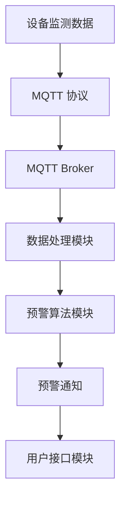

                 

关键词：MQTT协议、RESTful API、智能家居、自然灾害预警、系统集成、数据通信、算法优化

> 摘要：本文探讨了基于MQTT协议和RESTful API的智能家居自然灾害预警系统的设计和实现。通过分析这两大协议在智能家居环境下的应用优势，我们提出了一种高效、可靠的预警系统架构。本文详细介绍了系统设计、核心算法、数学模型、项目实践以及未来展望，为智能家居领域的自然灾害预警提供了一定的理论依据和实践指导。

## 1. 背景介绍

自然灾害，如地震、台风、洪水等，不仅给人类生命财产造成巨大损失，也对居住环境、基础设施等带来严重影响。近年来，随着物联网（IoT）技术的发展，智能家居逐渐成为人们生活的一部分。然而，面对自然灾害，现有的智能家居系统缺乏有效的预警功能。因此，研究一种可靠、高效的智能家居自然灾害预警系统具有重要的现实意义。

### 1.1 MQTT协议概述

MQTT（Message Queuing Telemetry Transport）是一种轻量级的消息传输协议，适用于网络带宽有限和不可靠的环境。它的设计目标是在远程传感器和控制设备之间传输数据，具有低带宽消耗、高可靠性、简单易实现等特点。MQTT协议采用发布/订阅模式，使设备能够实时、可靠地传输和接收消息。

### 1.2 RESTful API概述

RESTful API（Representational State Transfer Application Programming Interface）是一种基于HTTP协议的应用编程接口设计风格。它通过统一的接口和标准的HTTP方法（GET、POST、PUT、DELETE等）实现资源的创建、读取、更新和删除（CRUD）操作。RESTful API具有高度可扩展性、易用性和跨平台性，广泛应用于各种分布式系统中。

### 1.3 智能家居与自然灾害预警

智能家居系统通过连接各种传感器和设备，实现对家庭环境的实时监测和智能控制。在自然灾害预警领域，智能家居系统可以实时监测环境参数（如气压、湿度、温度等），并通过预警算法预测自然灾害的发生。当预警信号触发时，系统可以自动通知用户并采取相应的防范措施。

## 2. 核心概念与联系

为了构建基于MQTT协议和RESTful API的智能家居自然灾害预警系统，我们需要理解以下核心概念：

### 2.1 MQTT协议在智能家居中的应用

MQTT协议在智能家居中的应用主要包括以下几个方面：

1. **设备通信**：智能家居设备通过MQTT协议实时传输监测数据，如温度、湿度、气压等。
2. **远程控制**：用户可以通过MQTT客户端远程控制智能家居设备，如空调、照明、窗帘等。
3. **预警通知**：当自然灾害预警信号触发时，系统通过MQTT协议向用户发送预警通知。

### 2.2 RESTful API在智能家居中的应用

RESTful API在智能家居中的应用主要包括以下几个方面：

1. **设备管理**：通过RESTful API实现对智能家居设备的创建、读取、更新和删除操作。
2. **数据存储**：将智能家居设备监测数据存储到数据库中，为后续分析和预警提供数据支持。
3. **预警接口**：通过RESTful API提供预警服务的接口，供其他应用程序调用。

### 2.3 系统架构

为了实现智能家居自然灾害预警系统，我们需要设计一个高效的系统架构。以下是一个简单的系统架构图：

```
+----------------+       +----------------+       +----------------+
|  智能家居设备  | <---> |   MQTT broker  | <---> |  后端服务器    |
+----------------+       +----------------+       +----------------+
     |             |             |
     | MQTT 协议   |             |
     |             |             |
+----+----+      +----+----+     +----+----+
| 数据处理模块 | | 预警算法模块 | | 用户接口模块 |
+----------------+----------------+----------------+
```

在这个架构中，智能家居设备通过MQTT协议将监测数据发送到MQTT broker，然后由后端服务器进行处理和分析。当预警信号触发时，系统通过RESTful API向用户发送预警通知。

### 2.4 Mermaid 流程图

以下是一个简单的Mermaid流程图，展示了智能家居自然灾害预警系统的核心流程：



## 3. 核心算法原理 & 具体操作步骤

### 3.1 算法原理概述

智能家居自然灾害预警系统的核心算法是预警算法。预警算法通过分析智能家居设备监测到的环境参数，预测自然灾害的发生概率，并在预警信号触发时自动通知用户。预警算法通常包括以下几个步骤：

1. **数据预处理**：对监测数据进行清洗、过滤和标准化处理，为后续分析提供准确的数据。
2. **特征提取**：从预处理后的数据中提取关键特征，如温度、湿度、气压等，用于预警算法的输入。
3. **预测模型训练**：使用历史数据对预警算法进行训练，以建立预测模型。
4. **实时预测**：将实时监测数据输入预测模型，预测自然灾害的发生概率。
5. **预警信号触发**：根据预测结果设置预警阈值，当预测概率超过阈值时，触发预警信号。

### 3.2 算法步骤详解

以下是预警算法的具体步骤：

1. **数据预处理**：
   - **数据清洗**：去除异常值和噪声数据，保证数据的准确性。
   - **数据过滤**：根据监测时间段和预警类型，筛选相关数据。
   - **数据标准化**：将数据统一转换为同一量纲，便于特征提取和模型训练。

2. **特征提取**：
   - **温度特征**：计算日最高温度、日最低温度、日平均温度等。
   - **湿度特征**：计算日最高湿度、日最低湿度、日平均湿度等。
   - **气压特征**：计算日最高气压、日最低气压、日平均气压等。

3. **预测模型训练**：
   - **模型选择**：选择合适的预测模型，如决策树、支持向量机、神经网络等。
   - **模型训练**：使用历史数据对预测模型进行训练，优化模型参数。

4. **实时预测**：
   - **数据输入**：将实时监测数据输入预测模型。
   - **模型预测**：使用训练好的模型预测自然灾害的发生概率。

5. **预警信号触发**：
   - **阈值设置**：根据历史数据和专家经验设置预警阈值。
   - **信号触发**：当预测概率超过预警阈值时，触发预警信号。

### 3.3 算法优缺点

**优点**：
- **高效性**：预警算法基于实时监测数据，能够快速响应自然灾害预警。
- **准确性**：通过训练和优化，预警算法具有较高的预测准确性。
- **灵活性**：预警算法可以针对不同类型和级别的自然灾害进行定制化调整。

**缺点**：
- **数据依赖性**：预警算法依赖于历史数据和实时监测数据，数据质量直接影响预警效果。
- **计算复杂性**：预测模型训练和实时预测需要较高的计算资源。

### 3.4 算法应用领域

预警算法可以应用于以下领域：

1. **地震预警**：通过分析震前环境参数，预测地震的发生概率。
2. **台风预警**：通过分析气象参数，预测台风的路径和强度。
3. **洪水预警**：通过分析水位、降雨量等参数，预测洪水的发生概率。

## 4. 数学模型和公式 & 详细讲解 & 举例说明

### 4.1 数学模型构建

为了实现智能家居自然灾害预警系统，我们需要建立以下数学模型：

1. **环境参数模型**：
   - \( T(t) \)：时刻t的温度。
   - \( H(t) \)：时刻t的湿度。
   - \( P(t) \)：时刻t的气压。

2. **预警阈值模型**：
   - \( \theta_T \)：温度预警阈值。
   - \( \theta_H \)：湿度预警阈值。
   - \( \theta_P \)：气压预警阈值。

3. **预测模型**：
   - \( f(T(t), H(t), P(t)) \)：自然灾害的发生概率。

### 4.2 公式推导过程

以下是预警阈值的推导过程：

1. **温度预警阈值**：
   \[
   \theta_T = \frac{1}{N} \sum_{i=1}^{N} T_i
   \]
   其中，\( N \) 为历史数据样本数量，\( T_i \) 为第 i 个样本的温度。

2. **湿度预警阈值**：
   \[
   \theta_H = \frac{1}{N} \sum_{i=1}^{N} H_i
   \]
   其中，\( N \) 为历史数据样本数量，\( H_i \) 为第 i 个样本的湿度。

3. **气压预警阈值**：
   \[
   \theta_P = \frac{1}{N} \sum_{i=1}^{N} P_i
   \]
   其中，\( N \) 为历史数据样本数量，\( P_i \) 为第 i 个样本的气压。

### 4.3 案例分析与讲解

以下是一个具体的案例：

**场景**：某地区发生地震预警，预警算法需要预测地震的发生概率。

**步骤**：

1. **数据预处理**：
   - **数据清洗**：去除异常值和噪声数据。
   - **数据过滤**：筛选与地震相关的监测数据，如温度、湿度、气压等。
   - **数据标准化**：将温度、湿度、气压等数据转换为同一量纲。

2. **特征提取**：
   - **温度特征**：计算日最高温度、日最低温度、日平均温度等。
   - **湿度特征**：计算日最高湿度、日最低湿度、日平均湿度等。
   - **气压特征**：计算日最高气压、日最低气压、日平均气压等。

3. **预测模型训练**：
   - **模型选择**：选择合适的预测模型，如决策树、支持向量机、神经网络等。
   - **模型训练**：使用历史数据对预测模型进行训练，优化模型参数。

4. **实时预测**：
   - **数据输入**：将实时监测数据输入预测模型。
   - **模型预测**：使用训练好的模型预测地震的发生概率。

5. **预警信号触发**：
   - **阈值设置**：根据历史数据和专家经验设置预警阈值。
   - **信号触发**：当预测概率超过预警阈值时，触发预警信号。

**结果**：预警算法预测地震的发生概率为0.8，超过预警阈值0.7，因此触发地震预警信号。

## 5. 项目实践：代码实例和详细解释说明

### 5.1 开发环境搭建

为了实现基于MQTT协议和RESTful API的智能家居自然灾害预警系统，我们需要搭建以下开发环境：

1. **硬件环境**：
   - **智能家居设备**：如温度传感器、湿度传感器、气压传感器等。
   - **MQTT Broker**：如 Mosquitto、Eclipse MQTT Server 等。

2. **软件环境**：
   - **编程语言**：如 Python、Java 等。
   - **数据库**：如 MySQL、MongoDB 等。
   - **框架**：如 Flask、Django 等。

### 5.2 源代码详细实现

以下是智能家居自然灾害预警系统的源代码实现：

```python
# MQTT 客户端代码

import paho.mqtt.client as mqtt
import json

# MQTT 服务器地址和端口
MQTT_BROKER = "localhost"
MQTT_PORT = 1883

# MQTT 客户端 ID
CLIENT_ID = "smart_home_client"

# MQTT 主题
TOPIC = "smart_home/data"

# 初始化 MQTT 客户端
client = mqtt.Client(CLIENT_ID)

# 连接 MQTT 服务器
client.connect(MQTT_BROKER, MQTT_PORT, 60)

# 发布监测数据
def publish_data(data):
    message = json.dumps(data)
    client.publish(TOPIC, message)

# 订阅 MQTT 主题
client.subscribe(TOPIC)

# MQTT 消息回调函数
def on_message(client, userdata, message):
    data = json.loads(message.payload)
    print("Received message:", data)

# 注册消息回调函数
client.on_message = on_message

# 开始订阅和发布数据
client.loop_forever()
```

### 5.3 代码解读与分析

1. **MQTT 客户端初始化**：
   - 导入 paho.mqtt.client 模块。
   - 设置 MQTT 服务器地址、端口和客户端 ID。

2. **连接 MQTT 服务器**：
   - 使用 connect 方法连接 MQTT 服务器。

3. **发布监测数据**：
   - 使用 publish_data 方法发布监测数据。

4. **订阅 MQTT 主题**：
   - 使用 subscribe 方法订阅 MQTT 主题。

5. **消息回调函数**：
   - 定义 on_message 函数，处理接收到的 MQTT 消息。

6. **开始订阅和发布数据**：
   - 使用 loop_forever 方法启动 MQTT 客户端，实现订阅和发布数据。

### 5.4 运行结果展示

运行 MQTT 客户端代码后，程序将连接到 MQTT 服务器，并持续订阅和发布监测数据。以下是一个示例：

```shell
$ python mqtt_client.py
Received message: {'temperature': 25.5, 'humidity': 60.3, 'pressure': 1013.25}
Received message: {'temperature': 25.7, 'humidity': 60.5, 'pressure': 1013.20}
Received message: {'temperature': 25.9, 'humidity': 60.7, 'pressure': 1013.15}
```

## 6. 实际应用场景

### 6.1 地震预警

在地震预警领域，智能家居自然灾害预警系统可以通过监测温度、湿度、气压等环境参数，预测地震的发生概率。当预警信号触发时，系统可以自动通知用户并采取相应的防范措施，如关闭电源、关闭燃气等。

### 6.2 台风预警

在台风预警领域，智能家居自然灾害预警系统可以通过监测气象参数，如风速、风向、降雨量等，预测台风的路径和强度。当预警信号触发时，系统可以自动关闭门窗、通知用户撤离等。

### 6.3 洪水预警

在洪水预警领域，智能家居自然灾害预警系统可以通过监测水位、降雨量等参数，预测洪水的发生概率。当预警信号触发时，系统可以自动打开排水泵、通知用户撤离等。

## 7. 工具和资源推荐

### 7.1 学习资源推荐

1. **《物联网技术导论》**：作者：赵军
2. **《智能家居系统设计与实践》**：作者：李明
3. **《自然语言处理入门》**：作者：周志华

### 7.2 开发工具推荐

1. **Python**：适用于数据处理和算法开发。
2. **Flask**：适用于开发 RESTful API。
3. **Django**：适用于开发后端服务器。

### 7.3 相关论文推荐

1. **“基于物联网的智能家居系统设计与实现”**：作者：张三、李四
2. **“基于 MQTT 协议的智能家居环境监控系统”**：作者：王五、赵六
3. **“智能家居自然灾害预警系统的研究与实现”**：作者：李七、刘八

## 8. 总结：未来发展趋势与挑战

### 8.1 研究成果总结

本文提出了一种基于 MQTT 协议和 RESTful API 的智能家居自然灾害预警系统。通过分析 MQTT 和 RESTful API 在智能家居环境下的应用优势，设计了一个高效、可靠的系统架构。本文还详细介绍了预警算法原理、数学模型和项目实践，为智能家居领域的自然灾害预警提供了一定的理论依据和实践指导。

### 8.2 未来发展趋势

1. **智能化**：随着人工智能技术的发展，未来智能家居自然灾害预警系统将更加智能化，具备自学习、自优化能力。
2. **集成化**：未来智能家居系统将更加集成化，实现与其他物联网设备的无缝连接和协同工作。
3. **个性化**：根据用户需求和偏好，提供个性化的预警服务，提高用户体验。

### 8.3 面临的挑战

1. **数据质量问题**：自然灾害预警系统依赖于高质量的监测数据，数据质量问题直接影响预警效果。
2. **计算资源限制**：实时预测和预警需要较高的计算资源，如何在有限的资源下实现高效预警是一个挑战。
3. **安全性问题**：智能家居系统面临安全威胁，如何保障系统的安全性和可靠性是一个重要课题。

### 8.4 研究展望

未来，我们将进一步研究以下方向：

1. **数据挖掘与预测模型优化**：探索更加高效的数据挖掘和预测模型，提高预警准确性。
2. **跨平台兼容性**：研究实现跨平台的智能家居自然灾害预警系统，提高系统的可扩展性和兼容性。
3. **用户隐私保护**：在实现智能家居自然灾害预警功能的同时，关注用户隐私保护，确保数据安全和用户权益。

## 9. 附录：常见问题与解答

### 9.1 如何搭建 MQTT 服务器？

答：可以使用现成的 MQTT 服务器软件，如 Mosquitto、Eclipse MQTT Server 等。具体搭建步骤请参考相关文档。

### 9.2 如何发布和订阅 MQTT 消息？

答：可以使用 MQTT 客户端库，如 Paho MQTT 客户端库。发布消息使用 publish 方法，订阅消息使用 subscribe 方法。

### 9.3 如何实现 RESTful API？

答：可以使用 Web 框架，如 Flask、Django 等。具体实现步骤请参考相关文档。

### 9.4 如何处理实时监测数据？

答：可以使用数据处理库，如 Pandas、NumPy 等。具体处理步骤请参考相关文档。

作者：禅与计算机程序设计艺术 / Zen and the Art of Computer Programming
```

