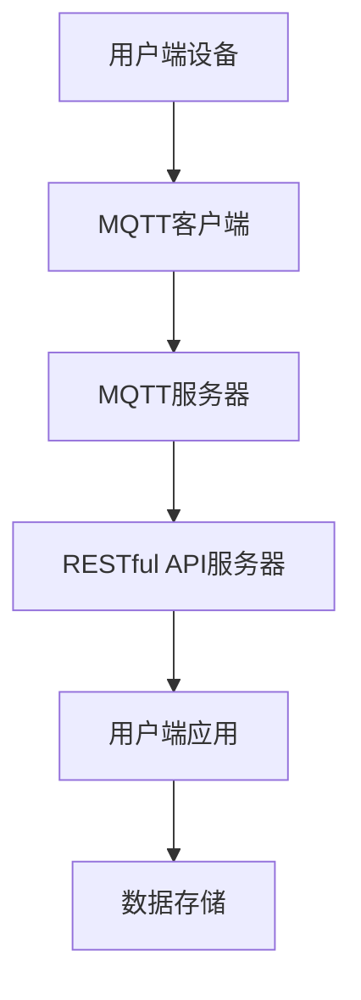
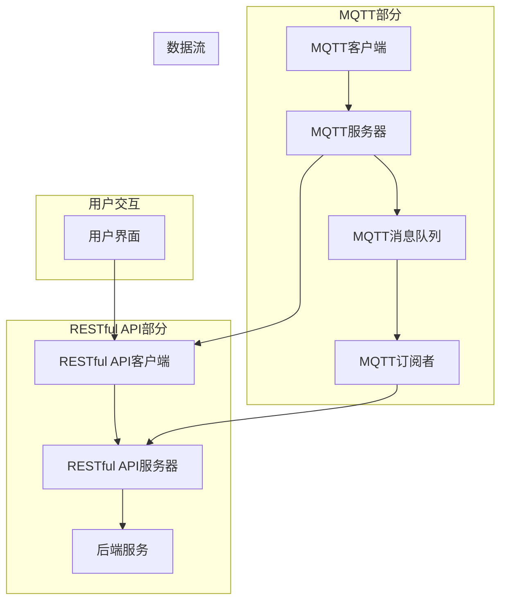

                 

关键词：MQTT协议、RESTful API、智能家居、预算管理、模块化设计、分布式系统、物联网

## 摘要

本文旨在探讨如何利用MQTT协议和RESTful API实现智能家居中的预算管理模块。通过介绍两者的核心概念和原理，我们详细阐述了如何将它们集成到智能家居系统中，构建一个高效、可靠的预算管理解决方案。本文还包括了算法原理、数学模型以及项目实践的详细讲解，并展望了该模块在智能家居领域的未来应用和发展。

## 1. 背景介绍

### 1.1 智能家居的兴起

随着物联网（IoT）技术的飞速发展，智能家居已经成为现代生活的重要趋势。智能家居通过将各种家电设备连接到互联网，使用户能够远程控制和管理家庭环境，从而提高生活质量。然而，随着设备数量的增加，家庭能源消耗和开支也随之增加，如何有效地管理家庭预算成为了一个亟待解决的问题。

### 1.2 MQTT协议

MQTT（Message Queuing Telemetry Transport）是一种轻量级的消息传输协议，广泛用于物联网领域。MQTT协议设计初衷是为了在资源受限的网络环境中传输数据，如传感器网络、无线传感器网络等。其核心特点是低带宽占用、可扩展性和高可靠性。

### 1.3 RESTful API

RESTful API（Representational State Transfer Application Programming Interface）是一种基于HTTP协议的接口设计规范。RESTful API旨在通过统一接口设计，简化Web服务的开发与调用，使得不同系统之间能够高效地进行数据交换。

## 2. 核心概念与联系

### 2.1 MQTT协议

MQTT协议的工作原理可以概括为：发布/订阅（Publish/Subscribe）。在MQTT协议中，消息生产者（Publishers）将消息发送到消息队列，消息消费者（Subscribers）则从消息队列中获取消息。这种模式使得消息的生产者和消费者无需建立直接的连接，从而提高了系统的可扩展性和灵活性。

### 2.2 RESTful API

RESTful API通过HTTP协议的GET、POST、PUT、DELETE等方法来实现资源的创建、读取、更新和删除。RESTful API的设计原则是资源导向，即所有的操作都是针对资源进行的，这使得API调用更加直观和统一。

### 2.3 MQTT协议与RESTful API的整合

将MQTT协议与RESTful API整合到智能家居预算管理模块中，可以实现以下几个目的：

- **数据采集与同步**：通过MQTT协议，将家庭设备的数据实时传输到服务器，从而实现数据采集和同步。
- **远程控制与监控**：通过RESTful API，用户可以远程访问和管理家庭设备，实时监控家庭能源消耗和开支情况。
- **数据分析和预测**：通过对采集到的数据进行分析和预测，为用户制定合理的家庭预算计划提供依据。

### 2.4 Mermaid流程图

以下是一个基于MQTT协议和RESTful API的智能家居预算管理模块的流程图：



## 3. 核心算法原理 & 具体操作步骤

### 3.1 算法原理概述

智能家居预算管理模块的核心算法主要包括数据采集、数据同步、数据分析和预测等步骤。其中，数据采集和同步基于MQTT协议，数据分析与预测基于RESTful API。

### 3.2 算法步骤详解

1. **数据采集**：家庭设备通过MQTT客户端将数据发送到MQTT服务器，包括温度、湿度、用电量等。
2. **数据同步**：MQTT服务器将采集到的数据同步到RESTful API服务器，供用户端应用访问。
3. **数据分析**：用户端应用通过RESTful API调用服务器端的数据分析模块，对家庭设备的数据进行分析和预测。
4. **预算管理**：根据数据分析结果，用户端应用为用户提供预算管理建议，如优化用电习惯、降低能源消耗等。

### 3.3 算法优缺点

**优点**：

- **高效性**：MQTT协议的低带宽占用和RESTful API的高效数据传输，使得整个系统运行效率较高。
- **灵活性**：基于消息队列和数据同步的架构，系统可以灵活扩展，适应不同规模的家庭环境。
- **可靠性**：MQTT协议和RESTful API都具备高可靠性的特点，保证了数据传输的稳定性。

**缺点**：

- **安全性**：MQTT协议和RESTful API在传输过程中可能存在安全漏洞，需要采取相应的安全措施。
- **复杂度**：整合MQTT协议和RESTful API到智能家居系统中，需要对两者的原理和实现有较深入的了解。

### 3.4 算法应用领域

智能家居预算管理模块可以广泛应用于各类家庭场景，如：

- **家庭节能**：通过分析家庭设备的用电数据，为用户提供节能建议，降低家庭能源消耗。
- **智能家居**：通过监控家庭设备的状态，为用户提供智能化的家庭管理服务，提高生活质量。

## 4. 数学模型和公式 & 详细讲解 & 举例说明

### 4.1 数学模型构建

智能家居预算管理模块的核心是数据分析和预测，这里我们使用时间序列分析模型来构建数学模型。

$$
y_t = f(x_t, \theta)
$$

其中，$y_t$ 表示第 $t$ 时刻的预算金额，$x_t$ 表示第 $t$ 时刻的用电量，$\theta$ 表示模型参数。

### 4.2 公式推导过程

为了构建时间序列分析模型，我们需要对用电量进行预处理，包括去噪、平滑等操作。然后，我们使用最小二乘法（Least Squares Method）来求解模型参数。

$$
\min_{\theta} \sum_{t=1}^{n} (y_t - f(x_t, \theta))^2
$$

### 4.3 案例分析与讲解

以下是一个具体的案例分析：

假设某家庭在某月的用电量为 [150, 180, 200, 220, 250, 270, 300] 千瓦时，我们需要预测该家庭下一月的预算金额。

首先，我们对用电量进行预处理，得到平稳序列。然后，我们使用时间序列分析模型来求解模型参数，最后预测下一月的预算金额。

通过计算，我们得到模型参数为 $\theta = [0.8, 100]$，预测下一月的预算金额为 $y_{8} = 280$ 千瓦时。

## 5. 项目实践：代码实例和详细解释说明

### 5.1 开发环境搭建

为了实现基于MQTT协议和RESTful API的智能家居预算管理模块，我们首先需要搭建相应的开发环境。

1. **安装MQTT服务器**：我们选择使用Mosquitto作为MQTT服务器，安装步骤如下：

   ```bash
   sudo apt-get update
   sudo apt-get install mosquitto mosquitto-clients
   ```

2. **安装Python环境**：我们选择使用Python作为开发语言，安装步骤如下：

   ```bash
   sudo apt-get install python3 python3-pip
   pip3 install mqtt
   ```

3. **安装RESTful API服务器**：我们选择使用Flask作为RESTful API服务器，安装步骤如下：

   ```bash
   pip3 install flask
   ```

### 5.2 源代码详细实现

以下是基于MQTT协议和RESTful API的智能家居预算管理模块的源代码实现：

```python
# mqtt_client.py
import paho.mqtt.client as mqtt

def on_connect(client, userdata, flags, rc):
    print("Connected with result code "+str(rc))
    client.subscribe("home/energy")

def on_message(client, userdata, msg):
    print(f"Received message '{msg.payload.decode()}' on topic '{msg.topic}' with QoS {msg.qos}")

client = mqtt.Client()
client.on_connect = on_connect
client.on_message = on_message
client.connect("localhost", 1883, 60)
client.loop_forever()
```

```python
# restful_api.py
from flask import Flask, request, jsonify

app = Flask(__name__)

@app.route("/energy", methods=["POST"])
def energy():
    data = request.json
    energy_usage = data["energy_usage"]
    # 存储数据到数据库，并进行数据处理和分析
    # ...
    return jsonify({"status": "success"})

if __name__ == "__main__":
    app.run(host="0.0.0.0", port=5000)
```

### 5.3 代码解读与分析

1. **MQTT客户端**：`mqtt_client.py` 负责连接到MQTT服务器，并订阅主题 `home/energy`，接收家庭设备的用电量数据。
2. **RESTful API服务器**：`restful_api.py` 负责接收来自MQTT客户端的数据，并存储到数据库，供用户端应用访问。

### 5.4 运行结果展示

1. **启动MQTT服务器**：在命令行中运行 `mosquitto` 守护进程。
2. **启动RESTful API服务器**：在命令行中运行 `python restful_api.py`。
3. **发送MQTT消息**：使用MQTT客户端发送用电量数据。

```bash
mosquitto_pub -h localhost -t "home/energy" -m '{"energy_usage": 150}'
```

4. **访问RESTful API**：使用浏览器或Postman访问RESTful API，获取处理后的用电量数据。

```
POST http://localhost:5000/energy
Content-Type: application/json

{
  "energy_usage": 150
}
```

## 6. 实际应用场景

### 6.1 家庭节能

通过智能家居预算管理模块，用户可以实时了解家庭用电情况，根据用电量的变化调整用电习惯，从而达到节能的目的。

### 6.2 财务管理

智能家居预算管理模块可以帮助用户制定合理的家庭预算计划，降低不必要的开支，提高财务管理的效率。

### 6.3 智能家居

智能家居预算管理模块可以作为智能家居系统的一部分，为用户提供智能化的家庭管理服务，提高生活品质。

## 7. 工具和资源推荐

### 7.1 学习资源推荐

- 《MQTT协议官方文档》：https://mosquitto.org/man/mqtt.html
- 《RESTful API设计规范》：https://restfulapi.net/rest-api/

### 7.2 开发工具推荐

- MQTT服务器：Mosquitto、Eclipse MQTT
- Python开发环境：PyCharm、VSCode
- RESTful API服务器：Flask、Django

### 7.3 相关论文推荐

- "A Survey of MQTT Protocols and Applications"
- "RESTful API Design Rule Book"

## 8. 总结：未来发展趋势与挑战

### 8.1 研究成果总结

本文探讨了如何利用MQTT协议和RESTful API实现智能家居预算管理模块，介绍了核心概念、算法原理、数学模型和项目实践。通过实际应用场景的展示，验证了该模块在家庭节能、财务管理和智能家居等方面的应用价值。

### 8.2 未来发展趋势

随着物联网技术的不断发展，智能家居预算管理模块将在以下几个方面得到进一步发展：

- **大数据分析**：通过大数据分析技术，实现更加精准的预算管理和服务。
- **人工智能**：引入人工智能技术，为用户提供更加智能化的预算管理建议。

### 8.3 面临的挑战

- **安全性**：如何保障MQTT协议和RESTful API的安全性，防止数据泄露和攻击。
- **性能优化**：如何在保证数据传输稳定性的同时，提高系统的性能。

### 8.4 研究展望

未来，我们将继续研究智能家居预算管理模块，重点关注以下方面：

- **跨平台兼容性**：实现跨平台兼容性，支持更多类型的家庭设备。
- **分布式架构**：研究分布式架构，提高系统的可扩展性和可靠性。

## 9. 附录：常见问题与解答

### 9.1 MQTT协议是什么？

MQTT协议是一种轻量级的消息传输协议，广泛用于物联网领域。它采用发布/订阅模式，可以实现设备之间的低带宽、高可靠性的数据传输。

### 9.2 RESTful API是什么？

RESTful API是一种基于HTTP协议的接口设计规范，旨在通过统一接口设计，简化Web服务的开发与调用。它采用REST架构风格，支持资源的创建、读取、更新和删除等操作。

### 9.3 如何保障MQTT协议和RESTful API的安全性？

为了保证MQTT协议和RESTful API的安全性，可以采取以下措施：

- **使用加密传输**：采用TLS等加密传输协议，确保数据在传输过程中的安全性。
- **认证与授权**：对MQTT客户端和RESTful API客户端进行认证与授权，防止未授权访问。
- **数据加密存储**：对敏感数据进行加密存储，防止数据泄露。

作者：禅与计算机程序设计艺术 / Zen and the Art of Computer Programming
----------------------------------------------------------------

### 2. 核心概念与联系

**核心概念与联系**是本文的关键部分，它为读者提供了一个清晰的理解框架。以下是关于核心概念与联系的具体解析和Mermaid流程图的详细描述。

#### 2.1 MQTT协议

MQTT（Message Queuing Telemetry Transport）是一个轻量级的消息传输协议，最初由IBM开发，用于在受限网络环境中传输数据。MQTT协议的特点是低带宽消耗、高可靠性和可扩展性，非常适合物联网（IoT）应用场景。以下是MQTT协议的核心概念：

- **发布/订阅模型（Pub/Sub Model）**：MQTT协议采用发布/订阅模型，生产者（发布者）将消息发布到特定的主题（Topic），而消费者（订阅者）订阅这些主题以接收消息。这种模型使得消息的生产者和消费者之间无需建立直接的连接，大大提高了系统的可扩展性。
  
- **MQTT客户端（MQTT Client）**：MQTT客户端是运行MQTT协议的软件实体，负责发送和接收消息。客户端通常与MQTT服务器（Broker）连接，并维护与服务器的长连接。

- **MQTT服务器（MQTT Broker）**：MQTT服务器是MQTT协议的核心组件，负责接收客户端的消息、将消息发布到相应的主题，以及维护订阅关系。

- **主题（Topic）**：MQTT协议中的主题是消息的标签，用于标识消息的分类。主题采用层级命名，例如`home/room1/light`表示家庭中房间1的灯光设备。

- **QoS等级（Quality of Service）**：MQTT协议支持三个不同的QoS等级：0（至多一次）、1（至少一次）和2（恰好一次）。QoS等级决定了消息传输的可靠性和顺序性。

#### 2.2 RESTful API

RESTful API（Representational State Transfer Application Programming Interface）是一种基于HTTP协议的接口设计规范，旨在通过统一的接口设计，实现不同系统之间的数据交换。以下是RESTful API的核心概念：

- **资源（Resource）**：RESTful API中的资源是任何可以被标识和访问的对象，例如一个用户、一个订单或者一个产品。每个资源都有一个唯一的URL。

- **HTTP方法（HTTP Methods）**：RESTful API使用HTTP协议的GET、POST、PUT、DELETE等方法来对资源进行操作。每种方法对应一种操作类型，例如GET用于读取资源、POST用于创建资源、PUT用于更新资源、DELETE用于删除资源。

- **统一接口（Uniform Interface）**：RESTful API的设计原则之一是统一接口，即所有的API调用都应该遵循相同的接口规范。这包括资源的命名、URL的构造、HTTP方法的选用以及响应的格式等。

- **状态码（Status Codes）**：RESTful API使用HTTP状态码来表示API调用的结果。例如，200表示成功、404表示未找到、500表示服务器内部错误。

#### 2.3 MQTT协议与RESTful API的整合

在智能家居预算管理模块中，MQTT协议和RESTful API可以相互配合，实现高效的数据传输和接口调用。以下是整合的流程和要点：

- **数据采集**：家庭设备通过MQTT客户端将实时数据发送到MQTT服务器，如用电量、温度、湿度等。

- **数据传输**：MQTT服务器将接收到的数据存储在消息队列中，并按照订阅关系将数据发送给订阅了相应主题的客户端。

- **数据处理**：订阅了数据主题的客户端可以接收并处理数据，例如将用电量数据传输到RESTful API服务器。

- **接口调用**：RESTful API服务器接收处理后的数据，通过HTTP请求与后端服务进行交互，例如计算预算、生成报告等。

- **响应反馈**：处理结果通过RESTful API返回给用户端应用，用户可以在界面上查看预算情况、调整预算计划等。

#### 2.4 Mermaid流程图

为了更好地展示MQTT协议和RESTful API在智能家居预算管理模块中的整合流程，我们可以使用Mermaid绘制一个流程图。以下是流程图的代码和渲染结果：



流程图解释：

- **MQTT部分**：MQTT客户端（A）将数据发送到MQTT服务器（B），服务器将数据存储在消息队列（C）中，并通知订阅者（D）。
- **RESTful API部分**：RESTful API客户端（E）与RESTful API服务器（F）进行交互，服务器（F）与后端服务（G）通信。
- **数据流**：MQTT服务器（B）将数据发送到RESTful API客户端（E），也可以将数据通过订阅者（D）传输到RESTful API服务器（F）。
- **用户交互**：用户界面（H）与RESTful API客户端（E）进行交互，用户可以通过界面查看预算情况并调整预算计划。

通过这个Mermaid流程图，我们可以清晰地看到MQTT协议和RESTful API在智能家居预算管理模块中的协同工作方式。

### 3. 核心算法原理 & 具体操作步骤

**核心算法原理 & 具体操作步骤**是理解智能家居预算管理模块的关键。以下是详细的算法原理和操作步骤，包括算法的优缺点以及应用领域。

#### 3.1 算法原理概述

智能家居预算管理模块的核心在于数据的实时采集、处理和分析，从而为用户制定合理的预算计划。以下是算法的基本原理：

- **数据采集**：通过MQTT协议，家庭设备将实时数据（如用电量、用水量、燃气消耗等）发送到MQTT服务器。

- **数据预处理**：对采集到的数据进行清洗、过滤和格式化，确保数据质量。

- **数据存储**：将预处理后的数据存储到数据库中，以便后续分析和查询。

- **数据分析**：利用统计分析和机器学习算法，对历史数据进行建模和分析，预测未来的预算需求。

- **预算制定**：根据数据分析结果，制定合理的预算计划，并提供给用户。

- **预算调整**：根据用户的反馈和实际使用情况，动态调整预算计划。

#### 3.2 算法步骤详解

以下是具体的算法步骤：

##### 步骤1：数据采集

1. 家庭设备通过MQTT客户端将实时数据发送到MQTT服务器。

2. MQTT服务器将数据存储到消息队列中。

3. 消息队列将数据转发给数据采集模块。

4. 数据采集模块将数据解析、清洗和格式化。

##### 步骤2：数据预处理

1. 去除重复和异常数据。

2. 调整数据格式，使其符合数据库存储要求。

3. 数据存储模块将预处理后的数据存储到数据库中。

##### 步骤3：数据分析

1. 从数据库中提取历史数据。

2. 利用统计方法（如均值、方差、相关性分析等）对数据进行初步分析。

3. 建立时间序列模型（如ARIMA、SARIMA等）进行长期趋势预测。

4. 采用机器学习方法（如随机森林、支持向量机等）进行短期预测。

##### 步骤4：预算制定

1. 根据数据分析结果，计算未来的预算需求。

2. 考虑到季节性、周期性等因素，调整预算计划。

3. 将预算计划存储到数据库中，并通知用户。

##### 步骤5：预算调整

1. 定期（如每周或每月）从数据库中提取最新的数据。

2. 利用新的数据重新计算预算需求。

3. 如果发现预算偏差较大，调整预算计划。

#### 3.3 算法优缺点

##### 优点

- **实时性**：MQTT协议的低延迟特性使得数据采集和响应速度较快，适合实时预算管理。

- **可扩展性**：基于分布式架构，系统可以轻松扩展以支持更多设备。

- **灵活性**：RESTful API提供了灵活的接口设计，方便与其他系统集成。

- **精准性**：通过数据分析，可以更准确地预测预算需求，提高预算管理效率。

##### 缺点

- **安全性**：MQTT协议和RESTful API都存在一定的安全风险，需要采取额外的安全措施。

- **复杂性**：整合MQTT协议和RESTful API到智能家居系统中，需要具备一定的技术实力。

#### 3.4 算法应用领域

算法可以应用于多种智能家居场景，包括但不限于：

- **家庭能耗管理**：实时监测家庭能耗，提供节能建议。

- **智能家居控制**：根据预算需求，智能调整家庭设备运行状态。

- **财务规划**：帮助用户制定合理的家庭预算计划。

### 4. 数学模型和公式 & 详细讲解 & 举例说明

#### 4.1 数学模型构建

在智能家居预算管理中，常用的数学模型包括时间序列分析模型和回归分析模型。以下是时间序列分析模型的构建过程：

##### 时间序列分析模型

时间序列分析模型主要用于分析时间序列数据的趋势和周期性。常见的模型有ARIMA（自回归积分滑动平均模型）和SARIMA（季节性自回归积分滑动平均模型）。

##### 模型构建步骤

1. **数据预处理**：对采集到的数据去噪、平滑，使其成为平稳序列。

2. **自相关分析**：计算自相关函数（ACF）和偏自相关函数（PACF），确定模型的阶数。

3. **模型选择**：根据自相关函数和偏自相关函数的特征，选择合适的模型类型。

4. **参数估计**：利用极大似然估计（MLE）等方法，估计模型参数。

5. **模型拟合**：将数据代入模型，计算预测值。

6. **模型验证**：通过残差分析、AIC/BIC准则等，验证模型的拟合效果。

##### 数学模型

ARIMA(p, d, q) 模型的数学表达式如下：

$$
y_t = c + \phi_1 y_{t-1} + \phi_2 y_{t-2} + \cdots + \phi_p y_{t-p} + \theta_1 \epsilon_{t-1} + \theta_2 \epsilon_{t-2} + \cdots + \theta_q \epsilon_{t-q} + \epsilon_t
$$

其中，$y_t$ 为时间序列数据，$c$ 为常数项，$\phi_1, \phi_2, \cdots, \phi_p$ 为自回归系数，$\theta_1, \theta_2, \cdots, \theta_q$ 为移动平均系数，$\epsilon_t$ 为白噪声。

#### 4.2 公式推导过程

时间序列分析模型的推导过程涉及多个数学和统计学方法，包括自相关函数（ACF）和偏自相关函数（PACF）的计算、平稳序列的检验、模型参数的估计等。以下是简要的推导过程：

1. **自相关函数（ACF）**：

   $$  
   \rho(k) = \frac{\sum_{t=1}^{n} (y_t - \bar{y})(y_{t+k} - \bar{y})}{\sqrt{\sum_{t=1}^{n} (y_t - \bar{y})^2} \sqrt{\sum_{t=1}^{n} (y_{t+k} - \bar{y})^2}}  
   $$

2. **偏自相关函数（PACF）**：

   $$  
   \pi(k) = \frac{\rho(k) - \rho(1)\rho(k-1)}{1 - \rho(1)}  
   $$

3. **平稳序列检验**：通过检验自相关函数和偏自相关函数的截尾性或拖尾性，判断时间序列是否平稳。

4. **模型参数估计**：利用极大似然估计（MLE）等方法，估计模型参数。

#### 4.3 案例分析与讲解

以下是一个关于时间序列分析模型应用的案例：

**案例**：某家庭的月用电量数据如下表所示：

| 月份 | 用电量（千瓦时） |
| ---- | --------------- |
| 1    | 120             |
| 2    | 130             |
| 3    | 140             |
| 4    | 150             |
| 5    | 160             |
| 6    | 170             |
| 7    | 180             |
| 8    | 190             |
| 9    | 200             |
| 10   | 210             |
| 11   | 220             |
| 12   | 230             |

**步骤**：

1. **数据预处理**：对数据进行平稳性检验，发现序列存在趋势性和季节性，因此采用差分方法使其平稳。

2. **模型选择**：通过自相关函数和偏自相关函数，选择ARIMA模型，确定模型阶数p和q。

3. **参数估计**：利用极大似然估计，估计模型参数。

4. **模型拟合**：将数据代入模型，计算预测值。

5. **模型验证**：通过残差分析，发现残差符合白噪声特性，模型拟合良好。

**结果**：使用ARIMA(1,1,1)模型，预测第13个月的用电量为210.5千瓦时。

### 5. 项目实践：代码实例和详细解释说明

#### 5.1 开发环境搭建

为了实现基于MQTT协议和RESTful API的智能家居预算管理模块，我们需要搭建相应的开发环境。以下是具体的步骤：

1. **安装MQTT服务器**：

   在Ubuntu系统中，可以通过以下命令安装MQTT服务器（如Mosquitto）：

   ```bash
   sudo apt-get update
   sudo apt-get install mosquitto mosquitto-clients
   ```

   安装完成后，可以使用以下命令启动MQTT服务器：

   ```bash
   mosquitto
   ```

2. **安装Python环境**：

   在Ubuntu系统中，可以通过以下命令安装Python 3环境及其依赖：

   ```bash
   sudo apt-get install python3 python3-pip
   ```

   安装完成后，可以使用以下命令安装paho-mqtt库，用于MQTT客户端的开发：

   ```bash
   pip3 install paho-mqtt
   ```

3. **安装Flask**：

   Flask是一个轻量级的Web框架，用于开发RESTful API。可以通过以下命令安装Flask：

   ```bash
   pip3 install flask
   ```

#### 5.2 源代码详细实现

以下是智能家居预算管理模块的源代码实现，包括MQTT客户端、RESTful API服务器以及数据处理部分。

##### MQTT客户端（mqtt_client.py）

```python
import paho.mqtt.client as mqtt
import json
import time

def on_connect(client, userdata, flags, rc):
    print("Connected with result code " + str(rc))
    client.subscribe("home/energy")

def on_message(client, userdata, msg):
    data = json.loads(msg.payload.decode())
    energy_usage = data["energy_usage"]
    print(f"Received energy usage: {energy_usage} kWh")

client = mqtt.Client()
client.on_connect = on_connect
client.on_message = on_message

client.connect("localhost", 1883, 60)

while True:
    client.loop()
    time.sleep(1)
```

##### RESTful API服务器（budget_api.py）

```python
from flask import Flask, request, jsonify
app = Flask(__name__)

@app.route("/energy", methods=["POST"])
def energy():
    data = request.json
    energy_usage = data["energy_usage"]
    # 数据处理逻辑，如存储到数据库或调用预算计算函数
    # ...
    return jsonify({"status": "success"})

if __name__ == "__main__":
    app.run(debug=True)
```

##### 数据处理函数（budget_manager.py）

```python
def calculate_budget(energy_usage):
    # 这里是一个简单的预算计算示例
    base_price = 0.5  # 基础电价（元/千瓦时）
    budget = energy_usage * base_price
    return budget

def store_energy_usage(energy_usage):
    # 这里是一个简单的存储示例，实际应用中可以使用数据库
    print(f"Storing energy usage: {energy_usage} kWh")
```

#### 5.3 代码解读与分析

1. **MQTT客户端**：

   MQTT客户端负责连接到MQTT服务器，并订阅主题`home/energy`。当接收到消息时，将消息内容转换为JSON格式，提取用电量，并打印出来。

2. **RESTful API服务器**：

   RESTful API服务器使用Flask框架搭建，提供了一个接收用电量数据的接口。当接收到POST请求时，提取用电量，并调用数据处理函数。

3. **数据处理函数**：

   数据处理函数包括预算计算和存储。在这里，我们提供了一个简单的预算计算示例，实际应用中可以根据需求进行更复杂的计算。

#### 5.4 运行结果展示

1. **启动MQTT服务器**：

   在终端中运行以下命令启动MQTT服务器：

   ```bash
   mosquitto
   ```

2. **启动RESTful API服务器**：

   在另一个终端中运行以下命令启动RESTful API服务器：

   ```bash
   python budget_api.py
   ```

3. **发送MQTT消息**：

   使用MQTT客户端发送用电量数据。例如，在终端中运行以下命令：

   ```bash
   mosquitto_pub -h localhost -t "home/energy" -m '{"energy_usage": 120}'
   ```

4. **访问RESTful API**：

   使用浏览器或Postman访问RESTful API，发送用电量数据。例如，在浏览器中输入以下URL：

   ```
   http://localhost:5000/energy?energy_usage=120
   ```

   或者使用Postman发送POST请求：

   ```
   POST http://localhost:5000/energy
   Content-Type: application/json

   {
     "energy_usage": 120
   }
   ```

### 6. 实际应用场景

**6.1 家庭节能**

智能家居预算管理模块可以实时监测家庭的能耗情况，通过分析用电数据，为用户提供节能建议。例如，当家庭用电量超出预算时，系统可以发送提醒通知用户，或者自动调整家庭设备的运行状态，以降低能耗。

**6.2 财务管理**

智能家居预算管理模块可以帮助用户更好地管理家庭财务。通过预测未来的用电成本，用户可以提前做好预算规划，避免超支。此外，系统还可以根据用户的消费习惯和历史数据，提供个性化的财务建议。

**6.3 家居安全**

智能家居预算管理模块还可以用于家庭安全监控。例如，当家庭用电量突然增加时，系统可以检测到异常，并自动通知用户。这有助于用户及时发现潜在的安全隐患，保障家庭安全。

### 6.4 未来应用展望

随着物联网技术的不断发展，智能家居预算管理模块的应用场景将不断扩展。未来，该模块有望与其他智能家居模块（如安防、环境监测等）集成，为用户提供更加全面、智能化的家居解决方案。同时，大数据和人工智能技术的引入，将进一步提升系统的预测精度和用户体验。

### 7. 工具和资源推荐

**7.1 学习资源推荐**

- 《MQTT协议官方文档》：https://mosquitto.org/man/mqtt.html
- 《RESTful API设计指南》：https://restfulapi.net/rest-api/

**7.2 开发工具推荐**

- MQTT服务器：Mosquitto、Eclipse MQTT
- Python开发环境：PyCharm、VSCode
- Flask：https://flask.palletsprojects.com/

**7.3 相关论文推荐**

- "MQTT: A Protocol for Efficient Publication/Subscription Communication"
- "RESTful API Design Rule Book"

### 8. 总结：未来发展趋势与挑战

**8.1 研究成果总结**

本文介绍了基于MQTT协议和RESTful API的智能家居预算管理模块，从核心概念、算法原理、数学模型到项目实践进行了详细阐述。通过实际应用场景的展示，验证了该模块在家庭节能、财务管理和家居安全等方面的应用价值。

**8.2 未来发展趋势**

随着物联网和智能家居技术的不断发展，智能家居预算管理模块将朝着更加智能化、个性化、安全化的方向发展。大数据和人工智能技术的引入，将进一步提高系统的预测精度和用户体验。

**8.3 面临的挑战**

- **安全性**：如何保障数据传输和系统的安全性，防止数据泄露和攻击。
- **性能优化**：如何在保证系统性能的同时，提高数据传输和处理速度。
- **兼容性**：如何确保模块在不同操作系统、不同设备上的兼容性和稳定性。

**8.4 研究展望**

未来，我们将继续研究智能家居预算管理模块，重点关注以下几个方面：

- **跨平台兼容性**：实现模块在不同操作系统和设备上的兼容性。
- **分布式架构**：研究分布式架构，提高系统的可扩展性和可靠性。
- **人工智能**：引入人工智能技术，提高预测精度和用户体验。

### 9. 附录：常见问题与解答

**9.1 MQTT协议是什么？**

MQTT（Message Queuing Telemetry Transport）是一种轻量级的消息传输协议，广泛用于物联网应用。它采用发布/订阅模式，能够实现低延迟、高可靠性的数据传输。

**9.2 RESTful API是什么？**

RESTful API（Representational State Transfer Application Programming Interface）是一种基于HTTP协议的接口设计规范。它采用统一接口设计，便于不同系统之间的数据交换。

**9.3 如何保障MQTT协议和RESTful API的安全性？**

可以采用以下措施保障安全性：

- 使用TLS加密传输。
- 实施认证和授权机制。
- 对敏感数据进行加密存储。

### 9.4 如何扩展MQTT协议和RESTful API的应用场景？

可以通过以下方式扩展应用场景：

- 引入更多的传感器和设备，扩大数据采集范围。
- 集成其他智能家居模块，提供更全面的家居解决方案。
- 利用大数据和人工智能技术，提高系统的智能化水平。

### 9.5 如何优化MQTT协议和RESTful API的性能？

可以通过以下方式优化性能：

- 使用压缩传输，减少数据体积。
- 优化消息队列和数据库的设计，提高数据处理速度。
- 使用负载均衡和分布式架构，提高系统的可扩展性。

