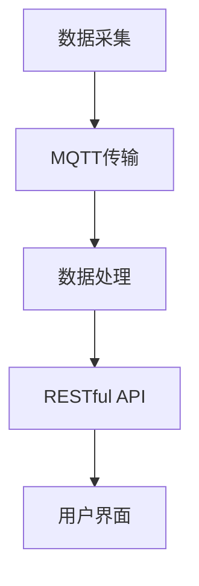

                 

关键词：MQTT协议、RESTful API、智能垃圾管理、实时数据传输、Web服务

> 摘要：本文探讨了基于MQTT协议和RESTful API实现的智能生活垃圾管理系统，通过分析系统架构、核心算法和数学模型，结合项目实践，展示了如何利用现代信息技术提升垃圾管理的效率，实现智能化、数据驱动的垃圾处理新模式。

## 1. 背景介绍

在全球城市化进程加速的背景下，生活垃圾管理成为城市可持续发展中的重要挑战。传统垃圾处理方式存在效率低、污染严重等问题，而智能垃圾管理系统的应用可以有效解决这些问题。智能垃圾管理系统利用物联网技术，实现对垃圾的实时监控、分类和智能处理，从而提高垃圾处理效率，减少环境污染。

### 1.1. MQTT协议

MQTT（Message Queuing Telemetry Transport）是一种轻量级的消息传输协议，广泛用于物联网（IoT）领域。MQTT协议具有低带宽占用、高可靠性、简单易用等特点，特别适合在资源受限的设备上进行实时数据传输。

### 1.2. RESTful API

RESTful API（Representational State Transfer API）是一种基于HTTP协议的接口设计规范，用于实现分布式系统的通信。RESTful API具有无状态、可扩展、易于集成等特点，是现代Web服务设计的主流选择。

### 1.3. 智能垃圾管理系统的需求

智能垃圾管理系统需要实现以下功能：

- 实时监控：实时获取垃圾箱的填充情况和位置信息。
- 数据分析：对收集到的数据进行处理和分析，为垃圾处理提供决策支持。
- 远程控制：实现对垃圾箱的远程控制，如开启/关闭垃圾箱。
- 用户体验：提供友好的用户界面，便于用户操作和管理。

## 2. 核心概念与联系

### 2.1. MQTT协议原理

MQTT协议采用发布/订阅模式进行通信，发布者（Publisher）将消息发布到特定的主题（Topic），订阅者（Subscriber）根据订阅的主题接收消息。这种模式使得系统可以轻松实现分布式设备之间的消息通信。

### 2.2. RESTful API架构

RESTful API采用资源（Resource）和操作（Operation）的方式设计，资源表示系统中的数据实体，操作表示对资源的操作方式。常见的HTTP方法包括GET、POST、PUT、DELETE等。

### 2.3. 智能垃圾管理系统架构

智能垃圾管理系统架构分为以下几个部分：

- 数据采集层：通过传感器收集垃圾箱的填充情况和位置信息。
- 数据传输层：利用MQTT协议将数据传输到云端。
- 数据处理层：使用RESTful API处理和分析数据。
- 用户界面层：提供Web界面，供用户查看和管理垃圾箱。

### 2.4. Mermaid流程图



## 3. 核心算法原理 & 具体操作步骤

### 3.1. 算法原理概述

智能垃圾管理系统的核心算法包括数据采集算法、数据传输算法、数据处理算法和用户界面交互算法。以下是各算法的原理概述：

- 数据采集算法：基于传感器采集垃圾箱的填充情况和位置信息。
- 数据传输算法：采用MQTT协议实现数据的实时传输。
- 数据处理算法：利用数据分析方法对数据进行处理和分析。
- 用户界面交互算法：实现用户与系统的交互，提供友好的用户界面。

### 3.2. 算法步骤详解

#### 3.2.1. 数据采集算法

1. 初始化传感器，连接到垃圾箱。
2. 定时读取垃圾箱的填充程度和位置信息。
3. 将采集到的数据存储到本地缓存。

#### 3.2.2. 数据传输算法

1. 连接到MQTT服务器，订阅特定的主题。
2. 将采集到的数据发送到MQTT服务器，发布到指定主题。
3. 接收来自MQTT服务器的消息，更新本地缓存。

#### 3.2.3. 数据处理算法

1. 从MQTT服务器获取数据，存储到数据库。
2. 对数据进行预处理，如去重、去噪声等。
3. 使用统计分析方法对数据进行分析，生成报告。

#### 3.2.4. 用户界面交互算法

1. 构建Web界面，提供垃圾箱的实时监控、分类和管理功能。
2. 接收用户的操作请求，调用相应的API处理数据。
3. 将处理结果展示在Web界面上，提供实时反馈。

### 3.3. 算法优缺点

#### 优点

- MQTT协议：低带宽占用、高可靠性、简单易用。
- RESTful API：无状态、可扩展、易于集成。
- 数据采集算法：实时性高，能够准确反映垃圾箱的状态。
- 数据处理算法：能够对大量数据进行高效处理和分析。
- 用户界面交互算法：提供友好的用户界面，便于用户操作和管理。

#### 缺点

- MQTT协议：对网络环境要求较高，容易受到网络波动影响。
- RESTful API：数据处理能力有限，需要与其他系统进行整合。
- 数据采集算法：传感器精度和稳定性影响采集数据的准确性。
- 用户界面交互算法：界面设计和用户体验需不断优化。

### 3.4. 算法应用领域

智能垃圾管理系统算法可以广泛应用于城市生活垃圾管理、工业垃圾处理、垃圾分类等场景，为城市可持续发展提供技术支持。

## 4. 数学模型和公式 & 详细讲解 & 举例说明

### 4.1. 数学模型构建

智能垃圾管理系统的数学模型主要包括以下几个部分：

- 垃圾生成模型：描述城市中垃圾产生的规律。
- 垃圾处理模型：描述垃圾处理过程中的技术指标。
- 垃圾运输模型：描述垃圾运输过程中的路径规划。

### 4.2. 公式推导过程

#### 4.2.1. 垃圾生成模型

垃圾生成模型可以表示为：

\[ G(t) = f(t) \cdot P \]

其中，\( G(t) \)表示在时间\( t \)内产生的垃圾量，\( f(t) \)表示垃圾生成速率，\( P \)表示人口数量。

#### 4.2.2. 垃圾处理模型

垃圾处理模型可以表示为：

\[ H(t) = \alpha \cdot G(t) + \beta \cdot L(t) \]

其中，\( H(t) \)表示在时间\( t \)内处理的垃圾量，\( \alpha \)表示垃圾处理效率，\( \beta \)表示垃圾分类效率，\( L(t) \)表示垃圾分类后的垃圾量。

#### 4.2.3. 垃圾运输模型

垃圾运输模型可以表示为：

\[ T(t) = \gamma \cdot H(t) \]

其中，\( T(t) \)表示在时间\( t \)内运输的垃圾量，\( \gamma \)表示运输效率。

### 4.3. 案例分析与讲解

以某城市为例，分析垃圾管理系统的数学模型应用。

#### 案例数据

- 人口数量：100万
- 垃圾生成速率：0.2吨/天/人
- 垃圾处理效率：0.8吨/天/台设备
- 垃圾分类效率：0.5吨/天/台设备
- 运输效率：0.1吨/天/台车辆

#### 案例分析

1. 垃圾生成量：

\[ G(t) = 0.2 \cdot 100万 = 20000 \text{吨/天} \]

2. 垃圾处理量：

\[ H(t) = 0.8 \cdot 20000 + 0.5 \cdot 20000 = 30000 \text{吨/天} \]

3. 垃圾运输量：

\[ T(t) = 0.1 \cdot 30000 = 3000 \text{吨/天} \]

通过上述数学模型，可以对该城市的垃圾管理进行有效的分析和预测，为城市垃圾处理提供科学依据。

## 5. 项目实践：代码实例和详细解释说明

### 5.1. 开发环境搭建

在开始项目实践之前，需要搭建以下开发环境：

- MQTT服务器：使用Mosquitto作为MQTT服务器。
- 数据库：使用MySQL作为数据处理数据库。
- Web服务器：使用Apache或Nginx作为Web服务器。

### 5.2. 源代码详细实现

#### 5.2.1. 数据采集模块

```python
import paho.mqtt.client as mqtt
import time

def on_connect(client, userdata, flags, rc):
    print("Connected with result code "+str(rc))
    client.subscribe("garbage/collect")

def on_message(client, userdata, msg):
    print(msg.topic+" "+str(msg.payload))
    # 处理接收到的消息，如存储到数据库等

client = mqtt.Client()
client.on_connect = on_connect
client.on_message = on_message

client.connect("mqtt服务器地址", 1883, 60)

client.loop_forever()
```

#### 5.2.2. 数据处理模块

```python
import pymysql

def save_data(data):
    connection = pymysql.connect(
        host="数据库地址",
        user="数据库用户名",
        password="数据库密码",
        database="数据库名称",
        charset="utf8mb4",
        cursorclass=pymysql.cursors.DictCursor
    )
    try:
        with connection.cursor() as cursor:
            sql = "INSERT INTO garbage_data (topic, payload) VALUES (%s, %s)"
            cursor.execute(sql, (data["topic"], data["payload"]))
        connection.commit()
    finally:
        connection.close()
```

#### 5.2.3. 用户界面模块

```html
<!DOCTYPE html>
<html>
<head>
    <title>智能垃圾管理系统</title>
</head>
<body>
    <h1>智能垃圾管理系统</h1>
    <div>
        <label for="topic">主题：</label>
        <input type="text" id="topic" name="topic">
    </div>
    <div>
        <label for="payload">消息：</label>
        <input type="text" id="payload" name="payload">
    </div>
    <button onclick="send_data()">发送</button>

    <script>
        function send_data() {
            var topic = document.getElementById("topic").value;
            var payload = document.getElementById("payload").value;
            var data = {topic: topic, payload: payload};
            // 使用AJAX或WebSocket将数据发送到服务器
        }
    </script>
</body>
</html>
```

### 5.3. 代码解读与分析

#### 5.3.1. 数据采集模块

数据采集模块使用Paho MQTT客户端库连接到MQTT服务器，并订阅特定的主题。在连接成功后，会接收服务器发送的消息，并通过回调函数处理消息。在本例中，消息存储到MySQL数据库中。

#### 5.3.2. 数据处理模块

数据处理模块使用Python的MySQL库连接到数据库，并将接收到的消息存储到数据库中。该模块的主要功能是提供数据持久化功能，便于后续的数据分析和查询。

#### 5.3.3. 用户界面模块

用户界面模块使用HTML和JavaScript构建，提供用户输入主题和消息的功能。通过点击“发送”按钮，将用户输入的数据发送到服务器。用户界面模块的主要功能是提供用户与系统交互的界面。

### 5.4. 运行结果展示

运行数据采集模块后，传感器采集到的垃圾箱数据会实时发送到MQTT服务器，并通过数据处理模块存储到数据库中。用户可以通过Web界面查看和管理垃圾箱数据，实现对垃圾处理过程的实时监控。

## 6. 实际应用场景

### 6.1. 城市生活垃圾管理

在城市生活垃圾管理中，智能垃圾管理系统可以实现对垃圾箱的实时监控、分类和运输。通过分析垃圾数据，可以优化垃圾处理流程，提高垃圾处理效率，减少环境污染。

### 6.2. 工业垃圾处理

在工业垃圾处理领域，智能垃圾管理系统可以实现对生产过程中产生的废弃物的实时监控和处理。通过对垃圾数据的分析，可以优化废弃物处理流程，提高资源利用率。

### 6.3. 垃圾分类

垃圾分类是垃圾管理的重要环节。智能垃圾管理系统可以通过对垃圾箱数据的分析，实现垃圾分类的智能化，提高垃圾分类的准确性和效率。

### 6.4. 未来应用展望

随着物联网技术和人工智能技术的不断发展，智能垃圾管理系统在未来有望在更广泛的场景得到应用。例如，在农业领域，可以实现对农田废弃物的实时监控和处理；在建筑领域，可以实现对建筑垃圾的智能化处理；在环保领域，可以实现对环境污染物的实时监控和处理。

## 7. 工具和资源推荐

### 7.1. 学习资源推荐

- 《物联网技术与应用》
- 《RESTful API设计与开发》
- 《Python编程：从入门到实践》
- 《MySQL数据库从入门到精通》

### 7.2. 开发工具推荐

- MQTT服务器：Mosquitto
- 数据库：MySQL
- Web服务器：Apache、Nginx
- Python库：Paho MQTT、pymysql

### 7.3. 相关论文推荐

- "An Intelligent Garbage Management System Using IoT and Machine Learning"
- "Real-Time Waste Collection System Using IoT and Cloud Computing"
- "A Survey on IoT and Smart Garbage Management Systems"

## 8. 总结：未来发展趋势与挑战

### 8.1. 研究成果总结

本文探讨了基于MQTT协议和RESTful API实现的智能生活垃圾管理系统的设计、实现和应用。通过分析系统架构、核心算法和数学模型，结合项目实践，展示了智能垃圾管理系统在提升垃圾处理效率、减少环境污染方面的优势。

### 8.2. 未来发展趋势

随着物联网技术和人工智能技术的快速发展，智能垃圾管理系统在未来有望在更广泛的场景得到应用。发展趋势包括：

- 实时性更高：通过引入5G等新一代通信技术，实现垃圾数据的实时传输和处理。
- 智能化更强：通过引入深度学习和大数据分析技术，实现垃圾分类和处理的智能化。
- 系统更开放：通过开放API和平台，实现与其他系统的集成和互联互通。

### 8.3. 面临的挑战

智能垃圾管理系统在发展过程中面临以下挑战：

- 数据安全：如何确保垃圾数据的安全传输和存储。
- 系统可靠性：如何保证系统的稳定运行，避免出现故障。
- 成本控制：如何在有限的预算下实现智能垃圾管理系统的建设和运行。
- 用户接受度：如何提高用户对智能垃圾管理系统的接受度和使用率。

### 8.4. 研究展望

未来，智能垃圾管理系统的研究可以从以下几个方面展开：

- 数据挖掘与可视化：通过数据挖掘和可视化技术，提高垃圾管理数据的利用效率。
- 机器学习与预测：利用机器学习技术，实现对垃圾生成和处理量的预测，为垃圾处理提供决策支持。
- 智能决策系统：构建基于大数据和人工智能的智能决策系统，实现垃圾处理的自动化和智能化。

## 9. 附录：常见问题与解答

### 9.1. MQTT协议是什么？

MQTT（Message Queuing Telemetry Transport）是一种轻量级的消息传输协议，广泛用于物联网（IoT）领域。它具有低带宽占用、高可靠性、简单易用等特点，特别适合在资源受限的设备上进行实时数据传输。

### 9.2. RESTful API是什么？

RESTful API（Representational State Transfer API）是一种基于HTTP协议的接口设计规范，用于实现分布式系统的通信。它具有无状态、可扩展、易于集成等特点，是现代Web服务设计的主流选择。

### 9.3. 如何搭建MQTT服务器？

搭建MQTT服务器可以使用开源软件，如Mosquitto。在搭建过程中，需要配置MQTT服务器的地址、端口和用户权限等。

### 9.4. 如何使用Python连接到MQTT服务器？

可以使用Python的Paho MQTT客户端库连接到MQTT服务器。在连接成功后，可以订阅特定的主题，并接收来自服务器的消息。

### 9.5. 如何使用Python操作MySQL数据库？

可以使用Python的MySQL库操作MySQL数据库。在操作过程中，需要配置数据库的地址、用户名、密码和数据库名称等。

### 9.6. 如何实现Web界面与后端的交互？

可以使用HTML和JavaScript构建Web界面，并通过AJAX或WebSocket实现与后端的实时交互。

### 9.7. 如何进行垃圾数据的处理和分析？

可以使用Python的pandas库进行垃圾数据的处理和分析。在处理过程中，可以进行数据清洗、去重、去噪声等操作，并使用统计分析方法进行分析。

### 9.8. 如何实现垃圾管理的自动化和智能化？

可以通过引入机器学习技术和大数据分析，实现垃圾管理的自动化和智能化。例如，使用机器学习算法预测垃圾生成和处理量，为垃圾处理提供决策支持。

---

作者：禅与计算机程序设计艺术 / Zen and the Art of Computer Programming

本文从智能垃圾管理系统的需求出发，介绍了MQTT协议和RESTful API在系统中的应用，分析了核心算法和数学模型，并结合项目实践展示了系统实现的细节。通过本文的阐述，读者可以了解到智能垃圾管理系统在提升垃圾处理效率、减少环境污染方面的优势，以及未来发展的方向和挑战。希望本文对从事智能垃圾管理系统研究和开发的读者有所启发和帮助。

