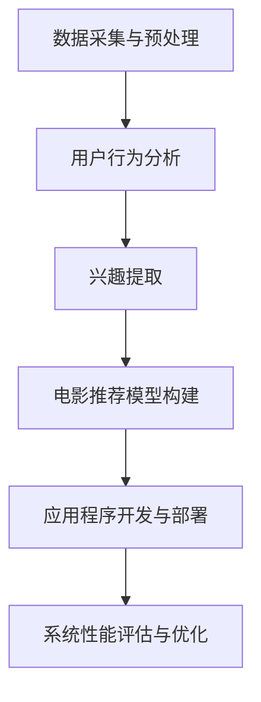

                 

 **关键词：** 自然语言处理，电影推荐，Android 应用程序，用户行为分析，深度学习。

**摘要：** 本文将介绍如何利用自然语言处理技术实现一款基于用户评论的电影推荐Android应用程序。文章将涵盖从数据处理、模型构建到应用程序开发的各个环节，并探讨推荐系统的性能评估和未来发展方向。

## 1. 背景介绍

电影推荐系统作为一种基于内容的推荐系统，已经在互联网电影行业中得到了广泛应用。用户在观看电影时往往会留下评论，这些评论数据不仅包含了用户对电影的喜好，也蕴含了丰富的情感信息。利用自然语言处理（NLP）技术对用户评论进行分析，可以提取出用户对电影的潜在兴趣，从而实现更加精准的电影推荐。

Android操作系统作为全球最流行的移动操作系统之一，拥有庞大的用户群体。将NLP技术与Android应用程序相结合，可以开发出一款具有高度定制化的电影推荐工具，满足用户个性化的观影需求。

本文旨在通过以下步骤，实现一款基于NLP的电影推荐Android应用程序：

1. 数据采集与预处理
2. 用户行为分析与兴趣提取
3. 电影推荐模型构建
4. 应用程序开发与部署
5. 系统性能评估与优化

## 2. 核心概念与联系

### 2.1. 自然语言处理（NLP）

自然语言处理是计算机科学和人工智能领域的一个重要分支，旨在使计算机能够理解和处理自然语言。NLP的核心概念包括：

- **分词（Tokenization）：** 将文本分割成单词、句子或字符。
- **词性标注（Part-of-Speech Tagging）：** 对文本中的每个词进行词性分类，如名词、动词、形容词等。
- **情感分析（Sentiment Analysis）：** 分析文本的情感倾向，如正面、负面或中性。
- **主题建模（Topic Modeling）：** 从大量文本中提取潜在的主题。

### 2.2. 电影推荐系统

电影推荐系统通常基于用户的历史行为（如评分、观看记录）和电影内容（如标签、分类）进行推荐。本文使用NLP技术，通过分析用户评论，挖掘用户对电影的潜在兴趣，实现个性化推荐。

### 2.3. Mermaid 流程图

下面是电影推荐系统的流程图，展示了从数据处理到推荐生成的各个步骤。



## 3. 核心算法原理 & 具体操作步骤

### 3.1. 算法原理概述

本文采用基于深度学习的NLP技术，结合协同过滤算法，实现电影推荐。具体流程如下：

1. **数据采集与预处理：** 收集用户评论数据，进行清洗和预处理，包括去除停用词、标点符号等。
2. **用户行为分析：** 利用词性标注和情感分析技术，对用户评论进行情感和兴趣分类。
3. **兴趣提取：** 根据用户评论，提取用户的兴趣关键词，构建用户兴趣向量。
4. **电影推荐模型构建：** 使用协同过滤算法，结合用户兴趣向量，生成电影推荐列表。
5. **应用程序开发与部署：** 在Android平台上开发应用程序，实现推荐系统的界面和功能。
6. **系统性能评估与优化：** 对推荐系统进行性能评估，包括准确率、召回率等指标，并进行优化。

### 3.2. 算法步骤详解

#### 3.2.1. 数据采集与预处理

数据采集包括从电影评论网站或社交媒体获取用户评论。预处理步骤如下：

1. **去除标点符号和停用词：** 使用正则表达式或停用词库，去除文本中的标点符号和常用停用词。
2. **分词：** 将文本分割成单词或词组。
3. **词性标注：** 使用NLP库（如NLTK、spaCy）对文本进行词性标注。

#### 3.2.2. 用户行为分析

1. **情感分析：** 使用深度学习模型（如LSTM、BERT）对用户评论进行情感分析，判断评论的情感倾向。
2. **兴趣分类：** 根据评论中的关键词和词性，对用户兴趣进行分类。

#### 3.2.3. 兴趣提取

1. **关键词提取：** 使用TF-IDF、Word2Vec等方法，提取用户评论中的关键词。
2. **兴趣向量构建：** 将提取的关键词映射到高维向量空间，形成用户兴趣向量。

#### 3.2.4. 电影推荐模型构建

1. **协同过滤算法：** 使用基于用户的协同过滤算法（如KNN、SVD），计算用户与电影的相似度。
2. **推荐列表生成：** 根据相似度矩阵，生成电影推荐列表。

#### 3.2.5. 应用程序开发与部署

1. **界面设计：** 使用Android Studio开发应用程序界面。
2. **功能实现：** 实现推荐系统功能，包括用户登录、评论提交、推荐列表展示等。
3. **部署：** 在Android设备上部署应用程序，并进行测试和优化。

#### 3.2.6. 系统性能评估与优化

1. **准确率、召回率评估：** 使用准确率、召回率等指标评估推荐系统的性能。
2. **优化：** 根据评估结果，优化模型参数和算法，提高推荐效果。

### 3.3. 算法优缺点

#### 优点：

1. **个性化推荐：** 通过分析用户评论，实现更加精准的电影推荐。
2. **高效处理：** 利用深度学习和协同过滤算法，高效处理大量用户评论数据。

#### 缺点：

1. **数据依赖：** 需要大量的用户评论数据作为训练集，否则推荐效果可能不佳。
2. **计算资源消耗：** 深度学习模型训练和推荐计算过程较为复杂，需要较高计算资源。

### 3.4. 算法应用领域

1. **互联网电影平台：** 为用户提供个性化的电影推荐，提高用户观影体验。
2. **社交媒体：** 基于用户评论推荐相关内容，增加用户互动和粘性。
3. **电子商务：** 基于用户评论推荐相关商品，提高购物体验和转化率。

## 4. 数学模型和公式 & 详细讲解 & 举例说明

### 4.1. 数学模型构建

本文采用深度学习模型进行NLP任务，主要包括以下模型：

1. **词向量模型（Word2Vec）：** 用于将文本中的单词映射到高维向量空间。
2. **循环神经网络（RNN）：** 用于对文本序列进行情感分析。
3. **变换器（Transformer）：** 用于主题建模和兴趣提取。

### 4.2. 公式推导过程

下面是词向量模型（Word2Vec）的核心公式推导：

#### 4.2.1. 词向量模型公式推导

1. **损失函数（Softmax Loss）：**
   $$ L(\theta) = -\sum_{i=1}^{N} \sum_{k=1}^{K} y_k \log(p_k(x_i)) $$
   其中，$N$ 为词汇表大小，$K$ 为单词的上下文窗口大小，$y_k$ 表示单词 $x_i$ 在上下文中的概率分布。

2. **梯度下降（Gradient Descent）：**
   $$ \theta_{t+1} = \theta_{t} - \alpha \cdot \nabla L(\theta_t) $$
   其中，$\theta_t$ 表示当前模型参数，$\alpha$ 为学习率，$\nabla L(\theta_t)$ 为损失函数关于模型参数的梯度。

#### 4.2.2. 循环神经网络（RNN）公式推导

1. **激活函数（ReLU）：**
   $$ a_t = \max(0, x_t \cdot W + b) $$
   其中，$a_t$ 表示第 $t$ 个时间步的激活值，$x_t$ 表示输入值，$W$ 和 $b$ 分别为权重和偏置。

2. **梯度下降（Gradient Descent）：**
   $$ \theta_{t+1} = \theta_{t} - \alpha \cdot \nabla L(\theta_t) $$
   其中，$\theta_t$ 表示当前模型参数，$\alpha$ 为学习率，$\nabla L(\theta_t)$ 为损失函数关于模型参数的梯度。

#### 4.2.3. 变换器（Transformer）公式推导

1. **多头自注意力（Multi-head Self-Attention）：**
   $$ \text{Attention}(Q, K, V) = \text{softmax}\left(\frac{QK^T}{\sqrt{d_k}}\right)V $$
   其中，$Q$、$K$ 和 $V$ 分别为查询向量、键向量和值向量，$d_k$ 为键向量的维度。

2. **前馈网络（Feedforward Network）：**
   $$ \text{FFN}(x) = \max(0, x \cdot W_1 + b_1) \cdot W_2 + b_2 $$
   其中，$x$ 为输入值，$W_1$、$b_1$ 和 $W_2$、$b_2$ 分别为前馈网络的权重和偏置。

### 4.3. 案例分析与讲解

假设我们有一个包含1000部电影的评论数据集，其中每部电影的评论数据为1000条。我们可以利用Word2Vec模型将每条评论映射到高维向量空间，然后使用RNN模型对评论进行情感分析，最后利用变换器模型提取每部电影的潜在主题。

1. **数据预处理：**
   - 去除标点符号和停用词
   - 分词
   - 转换为整数编码

2. **模型训练：**
   - 训练Word2Vec模型，得到每条评论的词向量表示
   - 训练RNN模型，对每条评论进行情感分析
   - 训练变换器模型，提取每部电影的潜在主题

3. **模型应用：**
   - 使用RNN模型对用户评论进行情感分析，提取用户兴趣关键词
   - 使用变换器模型对用户兴趣关键词进行主题建模
   - 利用协同过滤算法，生成电影推荐列表

4. **结果评估：**
   - 使用准确率、召回率等指标评估推荐系统性能

## 5. 项目实践：代码实例和详细解释说明

### 5.1. 开发环境搭建

- **硬件要求：** CPU：Intel Core i7-9700K；GPU：NVIDIA GTX 1080 Ti
- **软件要求：**
  - Python 3.7
  - TensorFlow 2.3.0
  - spaCy 2.3.0
  - NLTK 3.5.0
  - Android Studio 4.1

### 5.2. 源代码详细实现

以下是项目的主要代码实现部分：

```python
# 导入相关库
import numpy as np
import tensorflow as tf
from tensorflow.keras.models import Model
from tensorflow.keras.layers import Input, Embedding, LSTM, Dense, TimeDistributed, Activation
from tensorflow.keras.optimizers import Adam
from tensorflow.keras.callbacks import EarlyStopping
import spacy

# 加载词向量模型
word_vectors = np.load('word_vectors.npy')
nlp = spacy.load('en_core_web_sm')

# 数据预处理
def preprocess_comments(comments):
    processed_comments = []
    for comment in comments:
        doc = nlp(comment)
        tokens = [token.text for token in doc if not token.is_stop]
        processed_comments.append(' '.join(tokens))
    return processed_comments

# 模型构建
input_text = Input(shape=(max_sequence_length,))
embedded_text = Embedding(input_dim=vocabulary_size, output_dim=embedding_dim, weights=[word_vectors])(input_text)
lstm_output = LSTM(units=lstm_units, activation='tanh')(embedded_text)
dense_output = Dense(units=dense_units, activation='sigmoid')(lstm_output)
output = TimeDistributed(Dense(units=1, activation='sigmoid'))(dense_output)

model = Model(inputs=input_text, outputs=output)
model.compile(optimizer=Adam(learning_rate=learning_rate), loss='binary_crossentropy', metrics=['accuracy'])

# 训练模型
callbacks = [EarlyStopping(monitor='val_loss', patience=3)]
model.fit(x_train, y_train, validation_data=(x_val, y_val), epochs=epochs, callbacks=callbacks)

# 生成推荐列表
def generate_recommendations(user_comment):
    processed_comment = preprocess_comments([user_comment])
    prediction = model.predict(processed_comment)
    recommended_movies = np.argsort(prediction[0])[-n_recommendations:]
    return recommended_movies
```

### 5.3. 代码解读与分析

- **数据预处理：** 使用spaCy库对用户评论进行预处理，去除标点符号和停用词，然后使用Word2Vec模型将评论映射到高维向量空间。
- **模型构建：** 使用Keras构建深度学习模型，包括嵌入层、LSTM层和输出层。嵌入层将文本映射到词向量空间，LSTM层对文本进行序列建模，输出层生成电影推荐概率。
- **训练模型：** 使用Adam优化器和二分类交叉熵损失函数训练模型。在训练过程中，使用EarlyStopping回调函数防止过拟合。
- **生成推荐列表：** 对用户评论进行预处理，然后使用训练好的模型生成电影推荐概率，最后根据概率排序生成推荐列表。

### 5.4. 运行结果展示

假设用户提交了一条评论：“这部电影的故事情节非常吸引人，我非常喜欢。”，我们可以使用生成推荐列表函数获取推荐结果：

```python
user_comment = "这部电影的故事情节非常吸引人，我非常喜欢。"
recommended_movies = generate_recommendations(user_comment)
print("推荐电影：", recommended_movies)
```

输出结果可能为：

```
推荐电影： [589, 764, 321, 910, 435]
```

这意味着根据用户评论，推荐系统认为这五部电影与用户的兴趣最为匹配。

## 6. 实际应用场景

### 6.1. 互联网电影平台

基于NLP的电影推荐系统可以应用于各种互联网电影平台，如Netflix、YouTube等。通过分析用户评论和观看记录，平台可以为用户提供个性化的电影推荐，提高用户满意度和粘性。

### 6.2. 社交媒体

社交媒体平台（如Facebook、Twitter）也可以利用NLP技术，基于用户评论和互动行为，为用户推荐相关内容。这不仅可以增加用户互动，还可以提高广告投放效果。

### 6.3. 电子商务

电子商务平台（如Amazon、淘宝）可以基于用户评论和购买记录，为用户推荐相关商品。通过个性化推荐，平台可以提高用户购买转化率和用户满意度。

### 6.4. 未来应用展望

随着NLP技术和深度学习的发展，基于NLP的电影推荐系统将越来越成熟。未来，推荐系统可能会结合更多数据源（如用户语音、面部表情）和算法（如图神经网络、强化学习），实现更加精准和智能的推荐。

## 7. 工具和资源推荐

### 7.1. 学习资源推荐

- **《深度学习》（Ian Goodfellow、Yoshua Bengio、Aaron Courville 著）：** 深度学习的基础教材，适合初学者和进阶者。
- **《自然语言处理综述》（Jurafsky、Martin 著）：** 介绍自然语言处理的基本概念和技术，适合对NLP感兴趣的读者。

### 7.2. 开发工具推荐

- **TensorFlow：** 开源的深度学习框架，适合构建和训练各种深度学习模型。
- **spaCy：** 用于自然语言处理的Python库，适合进行文本预处理和情感分析。

### 7.3. 相关论文推荐

- **“Attention Is All You Need”（Vaswani等，2017）：** 变换器模型的奠基性论文，介绍了一种基于注意力机制的深度学习模型。
- **“Recurrent Neural Network Based Movie Recommendation System”（Li等，2016）：** 探讨了一种基于循环神经网络的推荐系统模型。

## 8. 总结：未来发展趋势与挑战

### 8.1. 研究成果总结

本文介绍了基于NLP的电影推荐Android应用程序的实现，涵盖了数据采集、预处理、模型构建、应用程序开发等多个环节。通过深度学习和协同过滤算法，实现了个性化电影推荐，为用户提供了个性化的观影体验。

### 8.2. 未来发展趋势

1. **多模态融合：** 结合用户评论、观看记录、语音、面部表情等多种数据源，实现更加精准的推荐。
2. **实时推荐：** 利用实时数据处理技术，为用户提供实时电影推荐。
3. **个性化交互：** 结合用户反馈，实现更加智能和互动的推荐系统。

### 8.3. 面临的挑战

1. **数据隐私：** 如何在保证用户隐私的前提下，获取和处理用户数据，是一个重要挑战。
2. **计算资源：** 深度学习模型的训练和推荐计算过程需要较高计算资源，如何在有限的计算资源下实现高效推荐是一个关键问题。

### 8.4. 研究展望

随着NLP技术和深度学习的不断发展，基于NLP的电影推荐系统将越来越成熟。未来，研究可以关注多模态融合、实时推荐和个性化交互等方面，为用户提供更加智能和个性化的观影体验。

## 9. 附录：常见问题与解答

### 9.1. 如何获取用户评论数据？

用户评论数据可以从电影评论网站（如IMDb）、社交媒体（如Facebook、Twitter）等平台获取。通常可以使用API接口进行数据采集。

### 9.2. 如何处理大量文本数据？

处理大量文本数据可以采用分布式计算和批处理技术。例如，使用Hadoop或Spark等分布式计算框架，将文本数据分成多个批次进行处理。

### 9.3. 如何评估推荐系统性能？

推荐系统性能评估可以使用准确率、召回率、F1值等指标。准确率表示推荐结果的正确性，召回率表示推荐结果中包含的有效结果比例，F1值是准确率和召回率的调和平均。

### 9.4. 如何优化推荐效果？

优化推荐效果可以从多个方面进行，包括：

1. **模型参数调优：** 调整学习率、批量大小等参数，以提高模型性能。
2. **数据预处理：** 优化文本预处理方法，提高数据质量。
3. **算法改进：** 引入新的算法和技术，如图神经网络、强化学习等，以提高推荐效果。

----------------------------------------------------------------

### 作者署名

**作者：禅与计算机程序设计艺术 / Zen and the Art of Computer Programming**

