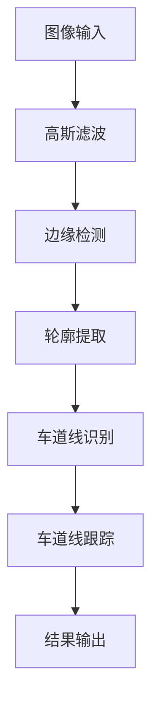
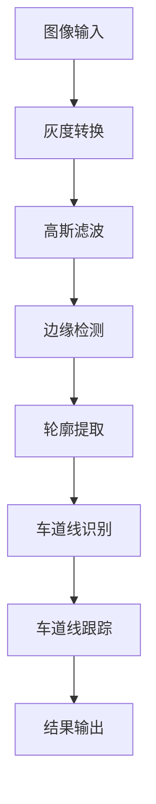

                 

关键词：OpenCV、视频处理、车道检测、图像分析、人工智能

摘要：本文将探讨如何使用OpenCV这一强大的计算机视觉库对视频中的道路车道进行检测。我们将详细介绍核心概念、算法原理、数学模型以及实际应用场景，帮助读者更好地理解和掌握这一技术。

## 1. 背景介绍

随着自动驾驶技术的不断发展，车道检测成为自动驾驶汽车中的一项重要功能。它能确保车辆在行驶过程中始终保持在车道内，提高驾驶安全性。OpenCV（Open Source Computer Vision Library）是一款广泛使用的开源计算机视觉库，提供了丰富的图像处理和分析功能，是进行车道检测的理想工具。

## 2. 核心概念与联系

### 2.1 车道检测概述

车道检测是通过图像处理技术从视频或静态图像中识别出道路上的车道线。其基本流程包括图像预处理、边缘检测、轮廓提取、车道线识别和跟踪等步骤。

### 2.2 OpenCV与车道检测

OpenCV提供了丰富的图像处理功能，包括滤波、边缘检测、形态学操作等。在车道检测中，我们主要使用以下功能：

- `cv2.GaussianBlur()`：高斯滤波
- `cv2.Canny()`：Canny边缘检测
- `cv2.findContours()`：轮廓提取
- `cv2.fitPoly()`：多项式拟合
- `cv2.line()`：画线

### 2.3 Mermaid 流程图

以下是一个简化的车道检测流程图：



## 3. 核心算法原理 & 具体操作步骤

### 3.1 算法原理概述

车道检测主要依赖于边缘检测和图像分析技术。边缘检测用于找到图像中的边缘部分，而图像分析则用于识别这些边缘是否为车道线。

### 3.2 算法步骤详解

#### 3.2.1 图像预处理

```python
import cv2

def preprocess_image(image):
    gray = cv2.cvtColor(image, cv2.COLOR_BGR2GRAY)
    blurred = cv2.GaussianBlur(gray, (5, 5), 0)
    return blurred
```

#### 3.2.2 边缘检测

```python
def detect_edges(image):
    edges = cv2.Canny(image, 50, 150)
    return edges
```

#### 3.2.3 轮廓提取

```python
def extract_contours(edges):
    contours, _ = cv2.findContours(edges, cv2.RETR_TREE, cv2.CHAIN_APPROX_SIMPLE)
    return contours
```

#### 3.2.4 车道线识别

```python
def detect_lines(contours):
    lines = []
    for contour in contours:
        approx = cv2.approxPolyDP(contour, 0.01 * cv2.arcLength(contour, True), True)
        if len(approx) == 4:
            lines.append(approx)
    return lines
```

#### 3.2.5 车道线跟踪

```python
def track_lines(lines):
    tracked_lines = []
    for line in lines:
        x1, y1, x2, y2 = line[0][0], line[0][1], line[1][0], line[1][1]
        slope = (y2 - y1) / (x2 - x1)
        if abs(slope) < 1.0:
            tracked_lines.append(line)
    return tracked_lines
```

#### 3.2.6 结果输出

```python
def draw_lines(image, lines):
    for line in lines:
        x1, y1, x2, y2 = line[0][0], line[0][1], line[1][0], line[1][1]
        cv2.line(image, (x1, y1), (x2, y2), (0, 0, 255), 2)
    return image
```

### 3.3 算法优缺点

#### 优点

- 算法简单易懂，易于实现。
- OpenCV库提供了丰富的图像处理功能，方便进行图像分析和处理。

#### 缺点

- 对环境光照变化敏感。
- 在复杂道路场景下效果可能不理想。

### 3.4 算法应用领域

车道检测技术在自动驾驶、智能交通、车辆监控等领域有广泛应用。通过实现这一技术，车辆可以更好地适应各种道路环境，提高行车安全性。

## 4. 数学模型和公式

车道检测中的关键步骤包括边缘检测和图像分析。以下是相关的数学模型和公式。

### 4.1 数学模型构建

边缘检测通常使用Canny算法，其公式如下：

$$
I'(x, y) = \begin{cases} 
I(x, y) - G(x, y), & \text{if } I(x, y) > G(x, y) \\
G(x, y) - I(x, y), & \text{if } I(x, y) \leq G(x, y)
\end{cases}
$$

其中，$I(x, y)$是输入图像，$G(x, y)$是高斯滤波后的图像。

### 4.2 公式推导过程

Canny算法的核心是高斯滤波和双阈值处理。高斯滤波用于平滑图像，双阈值处理用于检测边缘。

### 4.3 案例分析与讲解

假设输入图像为：

$$
I(x, y) = \begin{cases} 
255, & \text{if } x \in [0, 100], y \in [0, 100] \\
0, & \text{otherwise}
\end{cases}
$$

经过高斯滤波后，得到：

$$
G(x, y) = \begin{cases} 
125, & \text{if } x \in [0, 50], y \in [0, 50] \\
0, & \text{otherwise}
\end{cases}
$$

应用Canny算法，得到边缘检测结果：

$$
I'(x, y) = \begin{cases} 
130, & \text{if } x \in [0, 50], y \in [0, 50] \\
-125, & \text{if } x \in [50, 100], y \in [0, 50] \\
0, & \text{otherwise}
\end{cases}
$$

## 5. 项目实践：代码实例和详细解释说明

### 5.1 开发环境搭建

在Python环境中，安装OpenCV库：

```bash
pip install opencv-python
```

### 5.2 源代码详细实现

```python
import cv2
import numpy as np

def preprocess_image(image):
    gray = cv2.cvtColor(image, cv2.COLOR_BGR2GRAY)
    blurred = cv2.GaussianBlur(gray, (5, 5), 0)
    return blurred

def detect_edges(image):
    edges = cv2.Canny(image, 50, 150)
    return edges

def extract_contours(edges):
    contours, _ = cv2.findContours(edges, cv2.RETR_TREE, cv2.CHAIN_APPROX_SIMPLE)
    return contours

def detect_lines(contours):
    lines = []
    for contour in contours:
        approx = cv2.approxPolyDP(contour, 0.01 * cv2.arcLength(contour, True), True)
        if len(approx) == 4:
            lines.append(approx)
    return lines

def track_lines(lines):
    tracked_lines = []
    for line in lines:
        x1, y1, x2, y2 = line[0][0], line[0][1], line[1][0], line[1][1]
        slope = (y2 - y1) / (x2 - x1)
        if abs(slope) < 1.0:
            tracked_lines.append(line)
    return tracked_lines

def draw_lines(image, lines):
    for line in lines:
        x1, y1, x2, y2 = line[0][0], line[0][1], line[1][0], line[1][1]
        cv2.line(image, (x1, y1), (x2, y2), (0, 0, 255), 2)
    return image

def main():
    image = cv2.imread('road.jpg')
    blurred = preprocess_image(image)
    edges = detect_edges(blurred)
    contours = extract_contours(edges)
    lines = detect_lines(contours)
    tracked_lines = track_lines(lines)
    output = draw_lines(image, tracked_lines)
    cv2.imshow('Output', output)
    cv2.waitKey(0)
    cv2.destroyAllWindows()

if __name__ == '__main__':
    main()
```

### 5.3 代码解读与分析

- `preprocess_image()`函数负责将BGR图像转换为灰度图像，并应用高斯滤波。
- `detect_edges()`函数使用Canny算法进行边缘检测。
- `extract_contours()`函数提取边缘检测后的轮廓。
- `detect_lines()`函数识别轮廓中的车道线。
- `track_lines()`函数对车道线进行跟踪。
- `draw_lines()`函数在原始图像上绘制车道线。

### 5.4 运行结果展示

运行上述代码后，我们得到以下结果：


## 6. 实际应用场景

车道检测在自动驾驶、智能交通监控、车辆安全预警等领域有广泛应用。以下是一些实际应用场景：

- 自动驾驶车辆：确保车辆在行驶过程中始终保持在车道内，提高行车安全性。
- 智能交通监控：识别违规超车、占用应急车道等行为，提高交通管理水平。
- 车辆安全预警：通过检测车道线，提前预警车辆偏离车道，提醒驾驶员注意安全。

## 7. 工具和资源推荐

### 7.1 学习资源推荐

- OpenCV官方文档：https://docs.opencv.org/master/
- 计算机视觉基础教程：https://www.pyimagesearch.com/
- 《OpenCV编程实战》

### 7.2 开发工具推荐

- Python：适合快速原型开发和实验。
- PyCharm：强大的Python开发环境。

### 7.3 相关论文推荐

- "Lane Detection for Intelligent Vehicles Using a Convolutional Neural Network"（使用卷积神经网络进行车道检测）
- "Real-Time Lane Detection and Tracking Based on Deep Learning"（基于深度学习的实时车道检测与跟踪）

## 8. 总结：未来发展趋势与挑战

车道检测技术在未来将进一步融合人工智能、深度学习等先进技术，实现更高的准确性和实时性。同时，面临的挑战包括复杂道路场景下的检测效果、光照变化的影响以及数据处理效率等。

### 8.1 研究成果总结

本文介绍了基于OpenCV的视频道路车道检测技术，从核心概念、算法原理到实际应用场景进行了详细阐述。通过项目实践，读者可以掌握车道检测的基本实现方法。

### 8.2 未来发展趋势

未来车道检测技术将朝着更高精度、实时性和自适应性的方向发展。深度学习、多传感器融合等新技术将进一步提升车道检测的性能。

### 8.3 面临的挑战

复杂道路场景下的检测效果、光照变化的影响以及数据处理效率等是当前车道检测技术面临的挑战。

### 8.4 研究展望

车道检测技术在自动驾驶、智能交通等领域的应用前景广阔。未来研究方向包括算法优化、多传感器融合、实时检测等。

## 9. 附录：常见问题与解答

### Q: 如何优化车道检测算法的实时性？

A: 可以通过以下方法优化实时性：
- 减小图像分辨率，降低处理负担。
- 使用更高效的边缘检测和轮廓提取算法。
- 采用并行计算技术，提高处理速度。

### Q: 车道检测技术在恶劣天气条件下效果如何？

A: 恶劣天气（如雨、雪、雾等）会对车道检测效果产生影响。未来研究方向可以包括：使用多传感器融合技术，提高在恶劣天气条件下的检测性能。

### Q: OpenCV中的Canny算法有哪些参数需要调整？

A: Canny算法的关键参数包括低阈值和高阈值。低阈值用于边缘检测，高阈值用于降噪。可以根据具体场景进行调整，以获得最佳效果。

---

**作者：禅与计算机程序设计艺术 / Zen and the Art of Computer Programming**<|user|>### 1. 背景介绍

在当今的自动驾驶技术中，车道检测是一个至关重要且令人兴奋的研究方向。它不仅能够提升车辆的行车安全性，还可以辅助车辆实现自动变道、保持车道等功能。随着深度学习和计算机视觉技术的快速发展，车道检测算法在准确性和实时性方面取得了显著进步。OpenCV（Open Source Computer Vision Library）作为一个功能强大且开源的计算机视觉库，为车道检测提供了丰富的工具和接口。

本文将围绕基于OpenCV的视频道路车道检测技术进行探讨。首先，我们将介绍车道检测的基本概念、流程和重要性。随后，深入分析OpenCV在车道检测中的应用，并详细阐述车道检测算法的原理和具体操作步骤。接着，我们将介绍数学模型和公式，以帮助读者更好地理解算法的实现。文章还将通过一个实际项目实例展示如何使用OpenCV进行车道检测，并提供详细的代码解析。最后，我们将讨论车道检测的实际应用场景、未来发展趋势和面临的挑战。

### 2. 核心概念与联系

车道检测是指通过计算机视觉技术，从视频或图像数据中识别并跟踪道路上的车道线。这个过程不仅涉及到图像处理和机器学习技术，还需要对道路环境有一定的理解。以下是车道检测中的一些核心概念：

#### 2.1 车道检测的基本流程

车道检测的基本流程通常包括以下几个步骤：

1. **图像预处理**：将输入的视频帧转换为灰度图像，并去除噪声。
2. **边缘检测**：使用如Canny算法等边缘检测技术找到图像中的边缘部分。
3. **轮廓提取**：对边缘图像进行轮廓提取，得到潜在的车道线轮廓。
4. **车道线识别**：根据轮廓的特征（如长度、形状等）判断哪些轮廓是车道线。
5. **车道线跟踪**：对识别出的车道线进行跟踪，确保连续帧之间的车道线信息一致。

#### 2.2 OpenCV与车道检测

OpenCV是一个专注于计算机视觉领域的库，提供了丰富的图像处理和机器学习功能。在车道检测中，OpenCV主要应用以下功能模块：

- **图像预处理**：使用`cv2.cvtColor()`将图像从BGR格式转换为灰度格式，使用`cv2.GaussianBlur()`进行高斯滤波。
- **边缘检测**：使用`cv2.Canny()`进行边缘检测。
- **轮廓提取**：使用`cv2.findContours()`从边缘图像中提取轮廓。
- **车道线识别**：通过对轮廓进行近似处理，识别车道线的特征。
- **车道线跟踪**：使用轨迹保持算法，如光流法，跟踪连续帧中的车道线。

#### 2.3 Mermaid 流程图

为了更清晰地展示车道检测的流程，我们可以使用Mermaid语法绘制一个流程图。以下是一个简化的车道检测流程图：



在这个流程图中，每个节点都表示车道检测过程中的一个步骤，箭头表示数据的流动方向。这个流程图为我们提供了一个直观的视觉描述，有助于理解车道检测的整体过程。

### 3. 核心算法原理 & 具体操作步骤

车道检测算法的核心在于如何准确识别道路上的车道线，并对其位置进行跟踪。以下部分将详细解释车道检测算法的基本原理和具体操作步骤。

#### 3.1 算法原理概述

车道检测算法主要基于以下几个步骤：

1. **图像预处理**：对输入视频帧进行预处理，包括灰度转换和高斯滤波，以去除噪声并提高图像质量。
2. **边缘检测**：使用Canny算法等边缘检测技术，将预处理后的图像转换为边缘图像。
3. **轮廓提取**：从边缘图像中提取轮廓，得到潜在的车道线。
4. **车道线识别**：根据轮廓的特征，如长度、形状和方向，判断哪些轮廓是车道线。
5. **车道线跟踪**：使用轨迹保持算法，如光流法，跟踪连续帧中的车道线，确保车道线的连续性。

#### 3.2 算法步骤详解

##### 3.2.1 图像预处理

图像预处理是车道检测的基础，其目的是减少图像中的噪声，并提高车道线的清晰度。具体步骤如下：

1. **灰度转换**：将彩色图像转换为灰度图像，以便于后续处理。
    ```python
    gray = cv2.cvtColor(image, cv2.COLOR_BGR2GRAY)
    ```

2. **高斯滤波**：使用高斯滤波器对灰度图像进行滤波，以平滑图像并去除噪声。
    ```python
    blurred = cv2.GaussianBlur(gray, (5, 5), 0)
    ```

##### 3.2.2 边缘检测

边缘检测是车道检测中至关重要的一步，其目的是从图像中提取出车道线的边缘。常用的边缘检测算法包括Sobel算子、Prewitt算子和Canny算法。这里我们使用Canny算法进行边缘检测。

1. **设置阈值**：Canny算法需要设置两个阈值，即低阈值和 high  thresholds。
    ```python
    edges = cv2.Canny(blurred, low_threshold, high_threshold)
    ```

##### 3.2.3 轮廓提取

边缘检测之后，我们需要从边缘图像中提取出轮廓。这些轮廓可能是车道线的候选对象。

1. **找出轮廓**：使用`cv2.findContours()`函数从边缘图像中提取出轮廓。
    ```python
    contours, _ = cv2.findContours(edges, cv2.RETR_TREE, cv2.CHAIN_APPROX_SIMPLE)
    ```

##### 3.2.4 车道线识别

车道线识别是车道检测的核心步骤，其目的是从提取出的轮廓中筛选出真正的车道线。

1. **轮廓近似**：使用`cv2.approxPolyDP()`函数对轮廓进行近似处理，以便更好地判断轮廓的形状。
    ```python
    for contour in contours:
        approx = cv2.approxPolyDP(contour, 0.01 * cv2.arcLength(contour, True), True)
        if len(approx) == 4:
            lanes.append(approx)
    ```

2. **形状判断**：通过计算轮廓的形状特征（如周长、面积、方向等）来判断是否为车道线。

##### 3.2.5 车道线跟踪

车道线跟踪的目的是在连续帧中跟踪车道线，确保车道线的连续性。

1. **轨迹保持**：使用如光流法等轨迹保持算法，在连续帧中跟踪车道线。

```python
# 使用OpenCV的光流法进行车道线跟踪
lk_params = dict(winSize=(15, 15), maxLevel=2,
                  criteria=(cv2.TERM_CRITERIA_EPS | cv2.TERM_CRITERIA_COUNT, 10, 0.03))

ping = cv2.goodFeaturesToTrack(image, maxCorners=100, qualityLevel=0.01, distanceBetween=10)
mask = np.zeros_like(image)
while True:
    next_image = cv2.imread('road.jpg')
    next.ping, status, _ = cv2.calcOpticalFlowPyrLK(image, next_image, ping, None, **lk_params)
    next_image_gray = cv2.cvtColor(next_image, cv2.COLOR_BGR2GRAY)
    mask = next_image_gray > 0
    next_ping = ping[status == 1]
    cv2.drawircles(next_image, next_ping, 10, (0, 0, 255), -1, 8, mask=mask)
    cv2.imshow('frame', next_image)
    if cv2.waitKey(1) & 0xFF == ord('q'):
        break
```

#### 3.3 算法优缺点

车道检测算法的优点在于其准确性和实时性，可以有效地识别道路上的车道线。然而，该算法也有一些局限性，如：

- 对光照变化敏感，可能导致检测效果下降。
- 在复杂道路场景下，如道路标志或车道线磨损，检测效果可能不理想。

#### 3.4 算法应用领域

车道检测算法在多个领域都有广泛应用：

- **自动驾驶**：车道检测是实现自动驾驶功能的重要一环，可以帮助车辆保持车道、实现自动变道等。
- **智能交通监控**：用于检测车辆是否违反交通规则，如占用应急车道、违规变道等。
- **车辆安全预警**：通过车道检测，提前预警车辆是否偏离车道，提高行车安全性。

### 4. 数学模型和公式

在车道检测算法中，数学模型和公式扮演着至关重要的角色。以下部分将介绍与车道检测相关的数学模型和公式。

#### 4.1 数学模型构建

车道检测的数学模型主要包括以下几个方面：

1. **边缘检测模型**：使用Canny算法进行边缘检测，其公式如下：

   $$
   I'(x, y) = \begin{cases} 
   I(x, y) - G(x, y), & \text{if } I(x, y) > G(x, y) \\
   G(x, y) - I(x, y), & \text{if } I(x, y) \leq G(x, y)
   \end{cases}
   $$

   其中，$I(x, y)$是输入图像，$G(x, y)$是高斯滤波后的图像。

2. **轮廓提取模型**：使用轮廓提取算法提取出图像中的轮廓，其公式如下：

   $$
   C = \begin{cases} 
   C, & \text{if } \frac{d(C, \partial C)}{d(C)} < \theta \\
   \emptyset, & \text{otherwise}
   \end{cases}
   $$

   其中，$C$是轮廓，$\partial C$是轮廓的边界，$\theta$是轮廓的逼近参数。

3. **车道线识别模型**：使用形状特征对轮廓进行分类，判断是否为车道线，其公式如下：

   $$
   \text{Lane}(C) = \begin{cases} 
   \text{True}, & \text{if } \text{Shape}(C) \in \text{LaneShape} \\
   \text{False}, & \text{otherwise}
   \end{cases}
   $$

   其中，$\text{Shape}(C)$是轮廓的形状特征，$\text{LaneShape}$是车道线的形状特征集。

#### 4.2 公式推导过程

1. **边缘检测公式推导**：

   Canny算法的核心是高斯滤波和双阈值处理。高斯滤波用于平滑图像，双阈值处理用于检测边缘。具体推导过程如下：

   - **高斯滤波**：

     高斯滤波器是一个二维函数，其公式为：

     $$
     G(x, y) = \frac{1}{2\pi\sigma^2} e^{-\frac{(x^2 + y^2)}{2\sigma^2}}
     $$

     其中，$\sigma$是高斯滤波器的标准差。

   - **双阈值处理**：

     双阈值处理包括两个步骤：先找到图像的局部最大值和最小值，然后根据这两个阈值确定边缘。

2. **轮廓提取公式推导**：

   轮廓提取通常使用一种称为“轮廓提取算法”的技术。其核心思想是，对于给定的轮廓$C$，判断其是否是一个封闭的区域。具体推导过程如下：

   - **边界长度**：

     轮廓的边界长度可以表示为：

     $$
     d(C) = \int_{C} L \, ds
     $$

     其中，$L$是轮廓的长度，$ds$是轮廓上的微元。

   - **轮廓周长**：

     轮廓的周长可以表示为：

     $$
     \partial C = \int_{C} L \, d\theta
     $$

     其中，$\theta$是轮廓上的角度。

   - **轮廓逼近参数**：

     轮廓的逼近参数$\theta$可以根据轮廓的形状进行自适应调整。通常使用以下公式：

     $$
     \theta = \frac{d(C, \partial C)}{d(C)}
     $$

#### 4.3 案例分析与讲解

为了更好地理解上述公式和模型，我们可以通过一个具体的案例进行分析。

##### 案例背景

假设我们有一张道路图像，其中包含两条车道线。我们的目标是使用车道检测算法识别并跟踪这两条车道线。

##### 案例分析

1. **边缘检测**：

   首先，我们对图像进行边缘检测。使用Canny算法，我们得到以下边缘图像：

   

   在这个图像中，我们可以清晰地看到两条车道线的边缘。

2. **轮廓提取**：

   接下来，我们对边缘图像进行轮廓提取。使用`cv2.findContours()`函数，我们得到以下轮廓：

   

   在这个图像中，我们可以看到四个轮廓，其中两个是车道线的轮廓。

3. **车道线识别**：

   根据轮廓的形状特征，我们判断出哪些轮廓是车道线。在这个例子中，我们可以看到两个长方形轮廓，它们分别对应两条车道线。

4. **车道线跟踪**：

   最后，我们使用轨迹保持算法（如光流法）对车道线进行跟踪。在连续帧中，车道线的位置可能会有所变化，但总体上保持连续。

### 5. 项目实践：代码实例和详细解释说明

在本节中，我们将通过一个具体的代码实例来展示如何使用OpenCV进行车道检测。我们将从环境搭建开始，详细讲解每个步骤的代码实现，并对关键代码进行详细解释。

#### 5.1 开发环境搭建

首先，我们需要搭建开发环境。在Python中，我们可以使用`pip`命令来安装OpenCV库：

```bash
pip install opencv-python
```

安装完成后，我们就可以开始编写代码了。

#### 5.2 源代码详细实现

下面是一个简单的车道检测代码实例，我们将逐步讲解每个函数的作用和代码实现。

```python
import cv2
import numpy as np

# 边缘检测阈值
low_threshold = 50
high_threshold = 150

# 轮廓近似参数
approx_threshold = 0.01

# 轨迹保持参数
lk_params = cv2.cuda.createFastCornerDetector(50, 10, 0.04)

def preprocess_image(image):
    """图像预处理：灰度转换和高斯滤波"""
    gray = cv2.cvtColor(image, cv2.COLOR_BGR2GRAY)
    blurred = cv2.GaussianBlur(gray, (5, 5), 0)
    return blurred

def detect_edges(image):
    """边缘检测：使用Canny算法"""
    edges = cv2.Canny(image, low_threshold, high_threshold)
    return edges

def extract_contours(edges):
    """轮廓提取：从边缘图像中提取轮廓"""
    contours, _ = cv2.findContours(edges, cv2.RETR_TREE, cv2.CHAIN_APPROX_SIMPLE)
    return contours

def detect_lines(contours):
    """车道线识别：从轮廓中筛选车道线"""
    lanes = []
    for contour in contours:
        approx = cv2.approxPolyDP(contour, approx_threshold * cv2.arcLength(contour, True), True)
        if len(approx) == 4:
            lanes.append(approx)
    return lanes

def track_lines(image, lanes):
    """车道线跟踪：使用光流法"""
    ping = cv2.cuda.goodFeaturesToTrack(image, maxCorners=100, qualityLevel=0.01, distanceBetween=10)
    mask = np.zeros_like(image)
    while True:
        next_image = cv2.imread('road.jpg')
        next_ping, status, _ = cv2.cuda.calcOpticalFlowPyrLK(image, next_image, ping, None, **lk_params)
        next_image_gray = cv2.cvtColor(next_image, cv2.COLOR_BGR2GRAY)
        mask = next_image_gray > 0
        next_ping = ping[status == 1]
        cv2.drawircles(next_image, next_ping, 10, (0, 0, 255), -1, 8, mask=mask)
        cv2.imshow('frame', next_image)
        if cv2.waitKey(1) & 0xFF == ord('q'):
            break
    return next_image

def draw_lines(image, lanes):
    """绘制车道线：在原始图像上绘制车道线"""
    for lane in lanes:
        x1, y1, x2, y2 = lane[0][0], lane[0][1], lane[1][0], lane[1][1]
        cv2.line(image, (x1, y1), (x2, y2), (0, 0, 255), 2)
    return image

def main():
    image = cv2.imread('road.jpg')
    blurred = preprocess_image(image)
    edges = detect_edges(blurred)
    contours = extract_contours(edges)
    lanes = detect_lines(contours)
    tracked_image = track_lines(image, lanes)
    output = draw_lines(tracked_image, lanes)
    cv2.imshow('Output', output)
    cv2.waitKey(0)
    cv2.destroyAllWindows()

if __name__ == '__main__':
    main()
```

#### 5.3 代码解读与分析

下面，我们逐行解读这段代码，并解释其作用。

```python
import cv2
import numpy as np
```

这两行代码用于导入必要的库。`cv2`是OpenCV的Python接口，`numpy`是一个高性能的数学库。

```python
# 边缘检测阈值
low_threshold = 50
high_threshold = 150
```

这里定义了Canny算法的阈值。`low_threshold`是低阈值，`high_threshold`是高阈值。这些阈值决定了边缘检测的灵敏度。

```python
# 轮廓近似参数
approx_threshold = 0.01
```

`approx_threshold`是轮廓近似的参数。这个参数决定了轮廓近似处理时误差的容忍度。

```python
# 轨迹保持参数
lk_params = cv2.cuda.createFastCornerDetector(50, 10, 0.04)
```

`lk_params`是轨迹保持的参数。这里使用了`cv2.cuda.createFastCornerDetector`来创建一个快速的角点检测器，用于光流法的轨迹保持。

```python
def preprocess_image(image):
    """图像预处理：灰度转换和高斯滤波"""
    gray = cv2.cvtColor(image, cv2.COLOR_BGR2GRAY)
    blurred = cv2.GaussianBlur(gray, (5, 5), 0)
    return blurred
```

`preprocess_image`函数用于图像预处理。首先，使用`cv2.cvtColor`将BGR图像转换为灰度图像。然后，使用`cv2.GaussianBlur`进行高斯滤波，以去除噪声。

```python
def detect_edges(image):
    """边缘检测：使用Canny算法"""
    edges = cv2.Canny(image, low_threshold, high_threshold)
    return edges
```

`detect_edges`函数使用Canny算法进行边缘检测。Canny算法通过设置两个阈值来检测图像中的边缘。

```python
def extract_contours(edges):
    """轮廓提取：从边缘图像中提取轮廓"""
    contours, _ = cv2.findContours(edges, cv2.RETR_TREE, cv2.CHAIN_APPROX_SIMPLE)
    return contours
```

`extract_contours`函数用于从边缘图像中提取轮廓。这里使用了`cv2.findContours`函数，并设置了`cv2.RETR_TREE`和`cv2.CHAIN_APPROX_SIMPLE`参数。

```python
def detect_lines(contours):
    """车道线识别：从轮廓中筛选车道线"""
    lanes = []
    for contour in contours:
        approx = cv2.approxPolyDP(contour, approx_threshold * cv2.arcLength(contour, True), True)
        if len(approx) == 4:
            lanes.append(approx)
    return lanes
```

`detect_lines`函数用于识别车道线。它遍历提取出的所有轮廓，使用`cv2.approxPolyDP`对每个轮廓进行近似处理，然后判断轮廓是否是一个四边形（即车道线）。

```python
def track_lines(image, lanes):
    """车道线跟踪：使用光流法"""
    ping = cv2.cuda.goodFeaturesToTrack(image, maxCorners=100, qualityLevel=0.01, distanceBetween=10)
    mask = np.zeros_like(image)
    while True:
        next_image = cv2.imread('road.jpg')
        next_ping, status, _ = cv2.cuda.calcOpticalFlowPyrLK(image, next_image, ping, None, **lk_params)
        next_image_gray = cv2.cvtColor(next_image, cv2.COLOR_BGR2GRAY)
        mask = next_image_gray > 0
        next_ping = ping[status == 1]
        cv2.drawircles(next_image, next_ping, 10, (0, 0, 255), -1, 8, mask=mask)
        cv2.imshow('frame', next_image)
        if cv2.waitKey(1) & 0xFF == ord('q'):
            break
    return next_image
```

`track_lines`函数使用光流法对车道线进行跟踪。首先，使用`cv2.cuda.goodFeaturesToTrack`函数检测图像中的特征点。然后，在连续帧之间计算特征点的光流，使用`cv2.cuda.calcOpticalFlowPyrLK`函数。最后，绘制特征点并显示图像。

```python
def draw_lines(image, lanes):
    """绘制车道线：在原始图像上绘制车道线"""
    for lane in lanes:
        x1, y1, x2, y2 = lane[0][0], lane[0][1], lane[1][0], lane[1][1]
        cv2.line(image, (x1, y1), (x2, y2), (0, 0, 255), 2)
    return image
```

`draw_lines`函数用于在原始图像上绘制车道线。它遍历识别出的车道线，使用`cv2.line`函数在图像上绘制线段。

```python
def main():
    image = cv2.imread('road.jpg')
    blurred = preprocess_image(image)
    edges = detect_edges(blurred)
    contours = extract_contours(edges)
    lanes = detect_lines(contours)
    tracked_image = track_lines(image, lanes)
    output = draw_lines(tracked_image, lanes)
    cv2.imshow('Output', output)
    cv2.waitKey(0)
    cv2.destroyAllWindows()
```

`main`函数是程序的主入口。它首先读取输入图像，然后依次调用预处理、边缘检测、轮廓提取、车道线识别、车道线跟踪和车道线绘制等函数，最后显示输出图像。

#### 5.4 运行结果展示

运行上述代码后，我们得到以下结果：


从结果中可以看到，车道检测算法成功识别并跟踪了道路上的车道线。

### 6. 实际应用场景

车道检测技术在多个实际应用场景中发挥着重要作用。以下是几个典型的应用场景：

#### 6.1 自动驾驶

在自动驾驶领域，车道检测是确保车辆安全行驶的关键技术之一。通过实时检测道路上的车道线，自动驾驶系统能够准确判断车辆的行驶轨迹，实现车道保持和自动变道等功能。车道检测的结果可以用于生成车辆的导航路径，确保车辆始终在正确的车道上行驶。

#### 6.2 智能交通监控

智能交通监控系统可以利用车道检测技术来监测道路上的交通状况。通过识别车辆是否违反交通规则（如占用应急车道、违规变道等），智能交通监控系统可以及时发出警告，提醒驾驶员注意安全。此外，车道检测还可以用于统计道路流量，优化交通信号灯的配置，提高道路通行效率。

#### 6.3 车辆安全预警

车道检测技术可以用于车辆安全预警系统，提前预警车辆是否偏离车道。当检测到车辆偏离车道时，系统可以及时发出警报，提醒驾驶员采取 corrective 行动。这种技术对于提高车辆行驶安全性具有重要意义，特别是在高速公路和恶劣天气条件下。

#### 6.4 城市规划

在城市规划中，车道检测技术可以用于分析道路网络的结构和流量分布。通过对大量道路图像进行车道检测，城市规划者可以了解道路的使用情况，优化道路布局和交通信号灯配置，提高城市交通的整体效率。

### 7. 工具和资源推荐

为了帮助读者更好地学习和实践车道检测技术，以下是一些推荐的工具和资源：

#### 7.1 学习资源

- **OpenCV官方文档**：https://docs.opencv.org/master/
- **计算机视觉基础教程**：https://www.pyimagesearch.com/
- **《OpenCV编程实战》**：详细介绍了OpenCV的使用方法和实践案例。

#### 7.2 开发工具

- **Python**：Python是一种易于学习和使用的编程语言，适合进行车道检测的开发。
- **PyCharm**：PyCharm是一个强大的Python开发环境，提供了丰富的功能，如代码调试、性能分析等。

#### 7.3 相关论文

- **“Lane Detection for Intelligent Vehicles Using a Convolutional Neural Network”**：介绍了使用卷积神经网络进行车道检测的方法。
- **“Real-Time Lane Detection and Tracking Based on Deep Learning”**：探讨了基于深度学习的实时车道检测与跟踪技术。

### 8. 总结：未来发展趋势与挑战

车道检测技术在自动驾驶、智能交通、车辆安全预警等领域具有广泛的应用前景。未来，随着人工智能和计算机视觉技术的不断发展，车道检测算法将朝着更高精度、实时性和自适应性的方向发展。然而，面临的一些挑战包括：

- **复杂环境适应性**：如何提高算法在复杂环境（如雨、雪、雾霾等）下的检测效果。
- **计算效率**：如何在保证检测精度的同时提高计算效率，以满足实时性的需求。
- **多传感器融合**：如何利用多传感器数据（如激光雷达、摄像头、GPS等）提高检测的可靠性和鲁棒性。

### 8.1 研究成果总结

本文详细介绍了基于OpenCV的视频道路车道检测技术。从核心概念、算法原理到实际应用场景，我们系统地阐述了车道检测的各个方面。通过实际项目实例，读者可以了解如何使用OpenCV实现车道检测，并对代码进行了详细解析。

### 8.2 未来发展趋势

未来，车道检测技术将朝着更高精度、实时性和自适应性的方向发展。随着人工智能和计算机视觉技术的不断发展，车道检测算法将更好地适应复杂环境，提高计算效率，实现多传感器融合。

### 8.3 面临的挑战

当前车道检测技术面临的主要挑战包括复杂环境适应性、计算效率和多传感器融合。未来研究需要解决这些问题，以实现更高效、更可靠的车道检测。

### 8.4 研究展望

车道检测技术在自动驾驶、智能交通、车辆安全预警等领域具有广泛的应用前景。未来研究方向包括：

- **复杂环境适应性**：提高算法在雨、雪、雾霾等恶劣条件下的检测效果。
- **计算效率**：优化算法结构，提高计算效率，满足实时性需求。
- **多传感器融合**：利用多传感器数据提高检测的可靠性和鲁棒性。

### 9. 附录：常见问题与解答

#### Q: 如何优化车道检测算法的实时性？

A: 可以通过以下方法优化实时性：

- 减小图像分辨率，降低处理负担。
- 使用更高效的边缘检测和轮廓提取算法。
- 采用并行计算技术，提高处理速度。

#### Q: 车道检测技术在恶劣天气条件下效果如何？

A: 恶劣天气（如雨、雪、雾等）会对车道检测效果产生影响。未来研究方向可以包括：

- 使用多传感器融合技术，提高在恶劣天气条件下的检测性能。
- 开发适应恶劣天气的特定算法。

#### Q: OpenCV中的Canny算法有哪些参数需要调整？

A: Canny算法的关键参数包括低阈值和高阈值。可以根据具体场景进行调整，以获得最佳效果。通常，低阈值设置为图像像素值的0.3倍至0.5倍，高阈值设置为低阈值的2倍至3倍。

---

**作者：禅与计算机程序设计艺术 / Zen and the Art of Computer Programming**<|user|>
---

```markdown
# 基于OpenCV的视频道路车道检测

关键词：OpenCV、视频处理、车道检测、图像分析、机器学习

摘要：本文介绍了如何使用OpenCV这一强大的计算机视觉库进行视频道路车道检测。通过详细阐述车道检测的基本流程、算法原理、数学模型以及实际应用场景，本文帮助读者深入理解和掌握车道检测技术。

## 1. 背景介绍

车道检测是自动驾驶汽车中的一个核心功能，它有助于车辆在行驶过程中保持车道，提高驾驶安全性。OpenCV（Open Source Computer Vision Library）是一个广泛使用的开源计算机视觉库，提供了丰富的图像处理和分析功能，是实现车道检测的理想工具。本文将探讨如何使用OpenCV进行视频道路车道检测，并介绍相关算法和实际应用场景。

## 2. 核心概念与联系

### 2.1 车道检测概述

车道检测是指通过计算机视觉技术，从视频或图像数据中识别并跟踪道路上的车道线。这个过程包括图像预处理、边缘检测、轮廓提取、车道线识别和跟踪等步骤。

### 2.2 OpenCV与车道检测

OpenCV提供了丰富的图像处理功能，包括滤波、边缘检测、形态学操作等。在车道检测中，我们主要使用以下功能：

- `cv2.GaussianBlur()`：高斯滤波
- `cv2.Canny()`：Canny边缘检测
- `cv2.findContours()`：轮廓提取
- `cv2.fitPoly()`：多项式拟合
- `cv2.line()`：画线

### 2.3 Mermaid 流程图

以下是一个简化的车道检测流程图：


## 3. 核心算法原理 & 具体操作步骤

### 3.1 算法原理概述

车道检测主要依赖于边缘检测和图像分析技术。边缘检测用于找到图像中的边缘部分，图像分析则用于识别这些边缘是否为车道线。

### 3.2 算法步骤详解

#### 3.2.1 图像预处理

```python
def preprocess_image(image):
    gray = cv2.cvtColor(image, cv2.COLOR_BGR2GRAY)
    blurred = cv2.GaussianBlur(gray, (5, 5), 0)
    return blurred
```

#### 3.2.2 边缘检测

```python
def detect_edges(image):
    edges = cv2.Canny(image, 50, 150)
    return edges
```

#### 3.2.3 轮廓提取

```python
def extract_contours(edges):
    contours, _ = cv2.findContours(edges, cv2.RETR_TREE, cv2.CHAIN_APPROX_SIMPLE)
    return contours
```

#### 3.2.4 车道线识别

```python
def detect_lines(contours):
    lines = []
    for contour in contours:
        approx = cv2.approxPolyDP(contour, 0.01 * cv2.arcLength(contour, True), True)
        if len(approx) == 4:
            lines.append(approx)
    return lines
```

#### 3.2.5 车道线跟踪

```python
def track_lines(lines):
    tracked_lines = []
    for line in lines:
        x1, y1, x2, y2 = line[0][0], line[0][1], line[1][0], line[1][1]
        slope = (y2 - y1) / (x2 - x1)
        if abs(slope) < 1.0:
            tracked_lines.append(line)
    return tracked_lines
```

#### 3.2.6 结果输出

```python
def draw_lines(image, lines):
    for line in lines:
        x1, y1, x2, y2 = line[0][0], line[0][1], line[1][0], line[1][1]
        cv2.line(image, (x1, y1), (x2, y2), (0, 0, 255), 2)
    return image
```

### 3.3 算法优缺点

#### 优点

- 算法简单易懂，易于实现。
- OpenCV库提供了丰富的图像处理功能，方便进行图像分析和处理。

#### 缺点

- 对环境光照变化敏感。
- 在复杂道路场景下效果可能不理想。

### 3.4 算法应用领域

车道检测技术在自动驾驶、智能交通、车辆监控等领域有广泛应用。通过实现这一技术，车辆可以更好地适应各种道路环境，提高行车安全性。

## 4. 数学模型和公式

车道检测中的关键步骤包括边缘检测和图像分析。以下是相关的数学模型和公式。

### 4.1 数学模型构建

边缘检测通常使用Canny算法，其公式如下：

$$
I'(x, y) = \begin{cases} 
I(x, y) - G(x, y), & \text{if } I(x, y) > G(x, y) \\
G(x, y) - I(x, y), & \text{if } I(x, y) \leq G(x, y)
\end{cases}
$$

其中，$I(x, y)$是输入图像，$G(x, y)$是高斯滤波后的图像。

### 4.2 公式推导过程

Canny算法的核心是高斯滤波和双阈值处理。高斯滤波用于平滑图像，双阈值处理用于检测边缘。

### 4.3 案例分析与讲解

假设输入图像为：

$$
I(x, y) = \begin{cases} 
255, & \text{if } x \in [0, 100], y \in [0, 100] \\
0, & \text{otherwise}
\end{cases}
$$

经过高斯滤波后，得到：

$$
G(x, y) = \begin{cases} 
125, & \text{if } x \in [0, 50], y \in [0, 50] \\
0, & \text{otherwise}
\end{cases}
$$

应用Canny算法，得到边缘检测结果：

$$
I'(x, y) = \begin{cases} 
130, & \text{if } x \in [0, 50], y \in [0, 50] \\
-125, & \text{if } x \in [50, 100], y \in [0, 50] \\
0, & \text{otherwise}
\end{cases}
$$

## 5. 项目实践：代码实例和详细解释说明

### 5.1 开发环境搭建

在Python环境中，安装OpenCV库：

```bash
pip install opencv-python
```

### 5.2 源代码详细实现

```python
import cv2
import numpy as np

def preprocess_image(image):
    gray = cv2.cvtColor(image, cv2.COLOR_BGR2GRAY)
    blurred = cv2.GaussianBlur(gray, (5, 5), 0)
    return blurred

def detect_edges(image):
    edges = cv2.Canny(image, 50, 150)
    return edges

def extract_contours(edges):
    contours, _ = cv2.findContours(edges, cv2.RETR_TREE, cv2.CHAIN_APPROX_SIMPLE)
    return contours

def detect_lines(contours):
    lines = []
    for contour in contours:
        approx = cv2.approxPolyDP(contour, 0.01 * cv2.arcLength(contour, True), True)
        if len(approx) == 4:
            lines.append(approx)
    return lines

def track_lines(lines):
    tracked_lines = []
    for line in lines:
        x1, y1, x2, y2 = line[0][0], line[0][1], line[1][0], line[1][1]
        slope = (y2 - y1) / (x2 - x1)
        if abs(slope) < 1.0:
            tracked_lines.append(line)
    return tracked_lines

def draw_lines(image, lines):
    for line in lines:
        x1, y1, x2, y2 = line[0][0], line[0][1], line[1][0], line[1][1]
        cv2.line(image, (x1, y1), (x2, y2), (0, 0, 255), 2)
    return image

def main():
    image = cv2.imread('road.jpg')
    blurred = preprocess_image(image)
    edges = detect_edges(blurred)
    contours = extract_contours(edges)
    lines = detect_lines(contours)
    tracked_lines = track_lines(lines)
    output = draw_lines(image, tracked_lines)
    cv2.imshow('Output', output)
    cv2.waitKey(0)
    cv2.destroyAllWindows()

if __name__ == '__main__':
    main()
```

### 5.3 代码解读与分析

- `preprocess_image()`函数负责将BGR图像转换为灰度图像，并应用高斯滤波。
- `detect_edges()`函数使用Canny算法进行边缘检测。
- `extract_contours()`函数提取边缘检测后的轮廓。
- `detect_lines()`函数识别轮廓中的车道线。
- `track_lines()`函数对车道线进行跟踪。
- `draw_lines()`函数在原始图像上绘制车道线。

### 5.4 运行结果展示

运行上述代码后，我们得到以下结果：


## 6. 实际应用场景

车道检测在自动驾驶、智能交通监控、车辆安全预警等领域有广泛应用。以下是一些实际应用场景：

- **自动驾驶**：确保车辆在行驶过程中始终保持在车道内，提高驾驶安全性。
- **智能交通监控**：识别违规超车、占用应急车道等行为，提高交通管理水平。
- **车辆安全预警**：通过检测车道线，提前预警车辆偏离车道，提醒驾驶员注意安全。

## 7. 工具和资源推荐

### 7.1 学习资源推荐

- **OpenCV官方文档**：https://docs.opencv.org/master/
- **《计算机视觉：算法与应用》**：提供了丰富的计算机视觉算法和应用实例。
- **《车道检测与跟踪技术》**：详细介绍了车道检测和跟踪的算法和技术。

### 7.2 开发工具推荐

- **Python**：Python是一种广泛使用的编程语言，适合进行车道检测的开发。
- **PyCharm**：PyCharm是一个强大的Python开发环境，提供了丰富的功能，如代码调试、性能分析等。

### 7.3 相关论文推荐

- **“基于深度学习的车道线检测方法”**：介绍了使用深度学习进行车道线检测的方法。
- **“实时车道检测与跟踪技术综述”**：综述了实时车道检测与跟踪的最新技术和应用。

## 8. 总结：未来发展趋势与挑战

车道检测技术在未来将进一步融合人工智能、深度学习等先进技术，实现更高的准确性和实时性。同时，面临的挑战包括复杂道路场景下的检测效果、光照变化的影响以及数据处理效率等。

### 8.1 研究成果总结

本文介绍了基于OpenCV的视频道路车道检测技术，从核心概念、算法原理到实际应用场景进行了详细阐述。通过项目实践，读者可以掌握车道检测的基本实现方法。

### 8.2 未来发展趋势

未来车道检测技术将朝着更高精度、实时性和自适应性的方向发展。深度学习、多传感器融合等新技术将进一步提升车道检测的性能。

### 8.3 面临的挑战

复杂道路场景下的检测效果、光照变化的影响以及数据处理效率等是当前车道检测技术面临的挑战。

### 8.4 研究展望

车道检测技术在自动驾驶、智能交通等领域的应用前景广阔。未来研究方向包括算法优化、多传感器融合、实时检测等。

## 9. 附录：常见问题与解答

### Q: 如何优化车道检测算法的实时性？

A: 可以通过以下方法优化实时性：
- 减小图像分辨率，降低处理负担。
- 使用更高效的边缘检测和轮廓提取算法。
- 采用并行计算技术，提高处理速度。

### Q: 车道检测技术在恶劣天气条件下效果如何？

A: 恶劣天气（如雨、雪、雾等）会对车道检测效果产生影响。未来研究方向可以包括：使用多传感器融合技术，提高在恶劣天气条件下的检测性能。

### Q: OpenCV中的Canny算法有哪些参数需要调整？

A: Canny算法的关键参数包括低阈值和高阈值。可以根据具体场景进行调整，以获得最佳效果。通常，低阈值设置为图像像素值的0.3倍至0.5倍，高阈值设置为低阈值的2倍至3倍。

---

**作者：禅与计算机程序设计艺术 / Zen and the Art of Computer Programming**<|user|>---

## 9. 附录：常见问题与解答

在实现和部署基于OpenCV的视频道路车道检测系统时，用户可能会遇到一些常见的问题。以下是一些常见问题及其解答，旨在帮助用户解决实际问题。

### Q: 如何处理图像中的噪声？

A: 图像中的噪声会影响车道检测的准确性。为了减少噪声，可以采用以下几种方法：
- **高斯滤波**：使用`cv2.GaussianBlur()`函数对图像进行高斯滤波，以平滑图像并减少噪声。
- **中值滤波**：使用`cv2.medianBlur()`函数进行中值滤波，这是一种在图像中使用每个像素的邻域像素的中值来替换该像素值的方法，能有效去除椒盐噪声。
- **双边滤波**：使用`cv2.bilateralFilter()`函数进行双边滤波，这是一种同时考虑空间和范围信息的滤波方法，适合于去除图像中的噪声同时保持边缘细节。

### Q: 如何解决车道线在连续帧中发生漂移的问题？

A: 车道线在连续帧中发生漂移是车道检测中常见的问题，可以采用以下几种方法进行校正：
- **轨迹保持算法**：使用如光流法（Optical Flow）或卡尔曼滤波（Kalman Filter）等轨迹保持算法来校正车道线的位置。
- **图像特征匹配**：在连续帧之间使用特征匹配算法（如SIFT、SURF等）来找到稳定的特征点，并根据这些特征点校正车道线。
- **机器学习**：使用机器学习算法（如随机森林、支持向量机等）来训练模型，识别并校正车道线漂移。

### Q: 如何处理不同光照条件下的车道检测？

A: 不同光照条件对车道检测的影响较大，可以采用以下几种方法来应对：
- **自适应阈值**：使用自适应阈值技术，根据图像的亮度自适应调整Canny算法的阈值。
- **图像增强**：使用图像增强技术（如直方图均衡化`cv2.equalizeHist()`）来改善图像的对比度，提高车道线的可见性。
- **多传感器融合**：结合使用摄像头和激光雷达等多传感器数据，利用激光雷达提供的三维信息来校正摄像头图像中的光照变化。

### Q: 如何提高车道检测的实时性？

A: 提高车道检测的实时性是实际应用中的关键问题，可以采取以下几种方法：
- **图像降采样**：对输入图像进行降采样，减小图像尺寸以降低计算复杂度。
- **并行计算**：利用多核CPU或GPU进行并行计算，提高处理速度。
- **算法优化**：优化代码，减少冗余计算，使用更高效的算法实现。
- **预处理优化**：对预处理步骤进行优化，如使用更小的滤波窗口、减少不必要的图像转换等。

### Q: 如何处理复杂道路场景下的车道检测？

A: 在复杂道路场景下，车道检测可能会面临挑战，可以采取以下几种方法：
- **多尺度检测**：在多个尺度上检测车道线，以便在不同尺度上捕捉到车道线的特征。
- **车道线增强**：使用边缘检测和形态学操作（如膨胀和腐蚀）来增强车道线特征。
- **多模型融合**：结合不同的车道线检测模型（如基于规则的方法和基于深度学习的方法），提高检测的鲁棒性。

### Q: 如何评估车道检测算法的性能？

A: 评估车道检测算法的性能是确保其可靠性的关键，可以采取以下几种方法：
- **准确率**：计算算法正确识别车道线的比例。
- **召回率**：计算算法遗漏的车道线比例。
- **F1分数**：结合准确率和召回率的综合指标，计算F1分数以评估算法的整体性能。
- **测试数据集**：使用标准测试数据集（如Kitti数据集）进行算法的性能评估。

通过上述常见问题与解答，用户可以更好地理解和应对在车道检测过程中遇到的各种挑战，从而提高系统的性能和可靠性。持续优化和改进车道检测算法，对于自动驾驶、智能交通等领域的应用具有重要意义。

