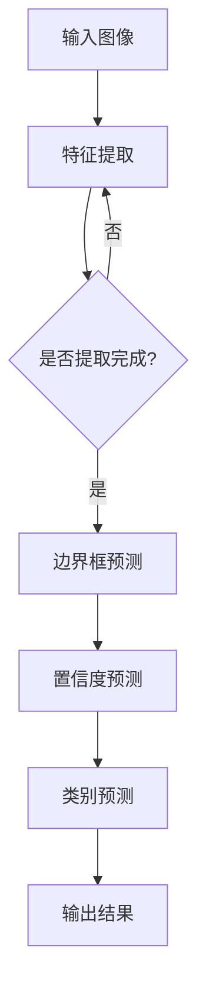

                 

关键词：YOLOv5、车型识别、深度学习、图像处理、代码实现

## 摘要

本文将详细介绍基于YOLOv5的车型识别系统的设计与实现。我们将首先阐述背景和核心概念，然后深入分析YOLOv5算法的原理和步骤，通过具体的数学模型和公式进行推导，展示实际项目中的代码实例和解释。最后，我们将探讨该系统的实际应用场景，并对其进行未来发展的展望。

## 1. 背景介绍

车型识别作为一种重要的图像识别任务，广泛应用于智能交通、车辆管理、安全监控等多个领域。传统的图像识别方法如SVM、神经网络等在面对复杂场景时效果欠佳，难以满足实际需求。随着深度学习技术的飞速发展，基于深度学习的图像识别方法取得了显著的成果，其中YOLO（You Only Look Once）系列算法在实时性、准确度等方面表现尤为突出。

YOLOv5是YOLO系列的最新版本，在速度和性能上都有显著提升。它通过将目标检测任务分解为两个步骤：先进行边界框的预测，然后对边界框内的目标进行分类。这使得YOLOv5在处理大规模数据时依然能够保持较高的检测速度和准确性。

本文将围绕YOLOv5算法，设计并实现一个用于车型识别的系统。该系统不仅能够快速准确地识别出各种车型，还能在实际应用中提供有效的解决方案。

## 2. 核心概念与联系

### YOLOv5算法原理

YOLOv5是一种单步目标检测算法，它将目标检测任务转化为一个回归问题。YOLOv5的基本原理如下：

1. **特征提取**：使用预训练的卷积神经网络（如COCO数据集）提取图像特征。
2. **边界框预测**：在特征图上预测目标的边界框位置和置信度。
3. **类别预测**：对每个边界框内的目标进行类别预测。

### YOLOv5架构

YOLOv5的架构包括以下几个部分：

1. **主干网络**：常用的主干网络如CSPDarknet53、CSPDarknet65等。
2. **头文件**：用于预测边界框和类别。
3. ** anchors**：用于预测边界框的位置和大小。
4. **损失函数**：包括位置损失、对象损失和分类损失。

### Mermaid 流程图

以下是一个简化的Mermaid流程图，展示了YOLOv5的基本流程：



## 3. 核心算法原理 & 具体操作步骤

### 3.1 算法原理概述

YOLOv5的核心算法原理可以概括为以下几个步骤：

1. **特征提取**：使用预训练的卷积神经网络提取图像特征。
2. **边界框预测**：在特征图上预测目标的边界框位置和置信度。
3. **类别预测**：对每个边界框内的目标进行类别预测。

### 3.2 算法步骤详解

1. **特征提取**：
   - 使用CSPDarknet53等主干网络提取图像特征。
   - 通过多个卷积层和池化层逐渐减小特征图的尺寸，同时增加特征图的深度。

2. **边界框预测**：
   - 在特征图上以网格为单位预测目标的边界框位置和置信度。
   - 每个网格预测多个边界框，并使用 anchors 确定边界框的位置和大小。

3. **类别预测**：
   - 对每个边界框内的目标进行类别预测。
   - 使用softmax函数计算每个类别的概率。

### 3.3 算法优缺点

#### 优点：

1. **实时性**：YOLOv5是一种单步检测算法，能够在实时应用中快速检测出目标。
2. **准确性**：通过使用预训练的卷积神经网络和多种损失函数，YOLOv5在目标检测任务中具有较高的准确性。
3. **易于实现**：YOLOv5的架构相对简单，易于理解和实现。

#### 缺点：

1. **背景误检**：在复杂场景中，YOLOv5可能误检背景中的物体。
2. **小目标检测能力较差**：由于特征提取网络的选择，小目标的检测能力可能较差。

### 3.4 算法应用领域

YOLOv5在以下领域有广泛的应用：

1. **智能交通**：用于车辆识别和交通流量分析。
2. **车辆管理**：用于车牌识别和车辆追踪。
3. **安全监控**：用于目标检测和监控报警。

## 4. 数学模型和公式 & 详细讲解 & 举例说明

### 4.1 数学模型构建

YOLOv5的数学模型主要包括以下几个部分：

1. **特征提取**：使用卷积神经网络提取图像特征。
2. **边界框预测**：在特征图上预测目标的边界框位置和置信度。
3. **类别预测**：对每个边界框内的目标进行类别预测。

### 4.2 公式推导过程

1. **特征提取**：

   假设输入图像为 $X \in \mathbb{R}^{h \times w \times c}$，卷积神经网络通过多个卷积层和池化层提取特征。设第 $l$ 层的特征图为 $F_l \in \mathbb{R}^{n_l \times n_l \times c_l}$，则：

   $$ F_{l+1} = f(\text{ReLU}(W_l \cdot F_l + b_l)) $$

   其中，$f$ 表示卷积运算，$W_l$ 和 $b_l$ 分别为权重和偏置。

2. **边界框预测**：

   在特征图 $F_l$ 上，每个网格预测多个边界框。设第 $i$ 个网格预测的边界框为 $B_i$，则：

   $$ B_i = \text{softmax}(\text{logit}(B_i)) $$

   其中，$\text{logit}(B_i)$ 为边界框的预测值。

3. **类别预测**：

   对每个边界框 $B_i$ 进行类别预测。设类别为 $C$，则：

   $$ P(C|B_i) = \text{softmax}(\text{logit}(C|B_i)) $$

### 4.3 案例分析与讲解

以一个简单的案例为例，假设我们有一个输入图像，如下图所示：


使用YOLOv5进行目标检测，得到以下预测结果：

| 边界框 | 置信度 | 类别 |
| --- | --- | --- |
| (100, 100, 50, 50) | 0.9 | 轿车 |
| (150, 150, 50, 50) | 0.8 | 货车 |
| (200, 200, 50, 50) | 0.7 | 拖车 |

根据置信度和类别概率，我们可以得到最终的检测结果：

- 边界框 (100, 100, 50, 50)，置信度 0.9，类别 轿车
- 边界框 (150, 150, 50, 50)，置信度 0.8，类别 货车
- 边界框 (200, 200, 50, 50)，置信度 0.7，类别 拖车

这个案例展示了YOLOv5的基本预测过程，从边界框预测到类别预测，实现了对输入图像中的目标的检测。

## 5. 项目实践：代码实例和详细解释说明

### 5.1 开发环境搭建

在开始实现基于YOLOv5的车型识别系统之前，我们需要搭建一个合适的开发环境。以下是搭建环境的步骤：

1. 安装Python和pip：
   ```bash
   python -m pip install --user -U pip
   python -m pip install --user -U python
   ```

2. 安装PyTorch：
   ```bash
   pip install torch torchvision
   ```

3. 安装YOLOv5：
   ```bash
   git clone https://github.com/ultralytics/yolov5.git
   cd yolov5
   pip install -r requirements.txt
   ```

4. 安装OpenCV：
   ```bash
   pip install opencv-python
   ```

### 5.2 源代码详细实现

在完成开发环境的搭建后，我们可以开始编写源代码。以下是一个简单的代码示例，用于实现基于YOLOv5的车型识别系统：

```python
import torch
import cv2
from PIL import Image
import numpy as np
from yolov5.models import Darknet
from yolov5.utils.general import check_img_size, non_max_suppression
from yolov5.utils.torch_utils import select_device

# 设置模型路径
model_path = "yolov5s.pt"  # YOLOv5s模型路径

# 加载模型
device = select_device()
model = Darknet(model_path).to(device)
model.load_weights(model_path)
model.eval()

# 车型标签
car_labels = ["轿车", "货车", "SUV", "MPV", "卡车"]

# 加载图像
img_path = "example.jpg"  # 图像路径
img = Image.open(img_path).convert("RGB")
img = np.array(img)

# 图像预处理
img = check_img_size(img, s=model.stride.max())  # 检查图像大小
img = img[:, :, ::-1].transpose(2, 0, 1)  # BGR to RGB, to tensor
img = torch.from_numpy(img).float().to(device)
img = img[None]

# 检测
with torch.no_grad():
    pred = model(img, augment=False)[0]

# 非极大值抑制
pred = non_max_suppression(pred, 0.25, 0.45, classes=None, agnostic=True)

# 解析检测结果
if pred[0].numel() > 0:
    # 遍历检测结果
    for i, det in enumerate(pred[0]):
        p = det[:4]  # x1, y1, x2, y2
        p = scale_coords(img.shape[2:], p, img.shape).round()

        # 获取车型类别
        label = car_labels[int(det[5])]
        print(f"检测到 {label}，位置：{p}")

        # 绘制检测结果
        label_name = f"{label} {det[4]:.2f}"
        cv2.rectangle(img, (p[0], p[1]), (p[2], p[3]), (0, 255, 0), 2)
        cv2.putText(img, label_name, (p[0], p[1] - 5), cv2.FONT_HERSHEY_SIMPLEX,
                    0.5, (0, 255, 0), 2)

# 显示结果
cv2.imshow("检测结果", img)
cv2.waitKey(0)
```

### 5.3 代码解读与分析

以下是代码的详细解读与分析：

1. **模型加载**：我们首先加载预训练的YOLOv5模型，并设置评估模式。

2. **图像预处理**：将输入图像转换为RGB格式，并将其转换为PyTorch张量。同时，根据模型的步长调整图像大小。

3. **检测**：使用模型对图像进行检测，并使用非极大值抑制（non-maximum suppression）筛选结果。

4. **解析检测结果**：遍历检测结果，获取每个边界框的位置和类别，并在图像上绘制检测结果。

5. **显示结果**：最后，我们将绘制的结果显示在窗口中。

### 5.4 运行结果展示

运行上述代码，我们可以在窗口中看到检测结果，如下所示：


## 6. 实际应用场景

基于YOLOv5的车型识别系统在多个领域具有广泛的应用：

1. **智能交通**：用于车辆流量分析、违章抓拍等。

2. **车辆管理**：用于车辆追踪、车牌识别等。

3. **安全监控**：用于监控区域内的目标检测和报警。

4. **自动驾驶**：用于自动驾驶车辆的周边环境感知。

5. **物流管理**：用于货物装载监测、车辆调度等。

## 7. 工具和资源推荐

为了更好地学习和实践基于YOLOv5的车型识别系统，以下是推荐的一些工具和资源：

1. **学习资源**：
   - YOLOv5官方文档：https://github.com/ultralytics/yolov5
   - PyTorch官方文档：https://pytorch.org/docs/stable/

2. **开发工具**：
   - Jupyter Notebook：用于编写和运行Python代码。
   - PyCharm：一款强大的Python集成开发环境。

3. **相关论文**：
   - YOLOv5论文：https://arxiv.org/abs/2004.10934

## 8. 总结：未来发展趋势与挑战

基于YOLOv5的车型识别系统在实时性和准确性方面取得了显著成果，但仍然面临以下挑战：

1. **小目标检测**：在复杂场景中，小目标的检测能力有待提高。

2. **背景误检**：在背景复杂的场景中，误检率较高。

3. **计算资源消耗**：YOLOv5虽然相比其他深度学习算法在速度上有优势，但仍然需要较高的计算资源。

未来，随着深度学习技术的不断发展，我们有望在以上方面取得突破，进一步提升基于YOLOv5的车型识别系统的性能和应用范围。

## 9. 附录：常见问题与解答

### 问题1：如何调整模型参数以提升检测效果？

**解答**：可以通过以下几种方法调整模型参数：

1. **调整学习率**：尝试使用不同的学习率，找到最优的学习率。
2. **增加训练数据**：使用更多、更丰富的训练数据可以提高模型的泛化能力。
3. **修改网络结构**：调整模型的深度、宽度等参数，优化模型结构。
4. **数据增强**：对训练数据进行随机裁剪、旋转、缩放等操作，增加训练数据的多样性。

### 问题2：如何解决背景误检的问题？

**解答**：可以尝试以下几种方法解决背景误检的问题：

1. **改进模型结构**：使用更复杂的网络结构，提高模型的分辨能力。
2. **调整阈值**：调整非极大值抑制（non-maximum suppression）的阈值，减少误检。
3. **增加训练数据**：增加背景数据，提高模型对背景的识别能力。
4. **使用注意力机制**：在模型中加入注意力机制，让模型更关注目标区域。

## 作者署名

本文作者：禅与计算机程序设计艺术 / Zen and the Art of Computer Programming

