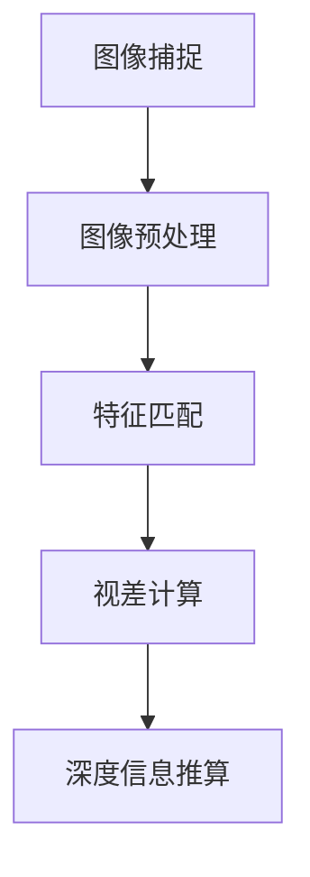

                 

关键词：双目视觉、深度感知、opencv、测距算法、立体成像

## 摘要

随着计算机视觉技术的快速发展，双目测距技术已成为机器人、自动驾驶、增强现实等领域的关键技术之一。本文将深入探讨双目测距的原理、方法及其在计算机视觉中的应用，并结合opencv库，详细解析双目测距的实现步骤和技巧。文章结构如下：

1. **背景介绍**
2. **核心概念与联系**
3. **核心算法原理 & 具体操作步骤**
4. **数学模型和公式 & 详细讲解 & 举例说明**
5. **项目实践：代码实例和详细解释说明**
6. **实际应用场景**
7. **未来应用展望**
8. **工具和资源推荐**
9. **总结：未来发展趋势与挑战**
10. **附录：常见问题与解答**

通过本文的阅读，读者将全面了解双目测距的技术原理，掌握其实现方法和技巧，并对未来的发展有更深入的思考。

## 1. 背景介绍

双目测距（Binocular Distance Measurement）是基于双目视觉原理的一种测量方法，通过使用两个摄像头以一定的相对位置捕捉同一场景的图像，然后计算两个图像中对应点的位移来得到场景中的深度信息。这一方法最早在20世纪70年代由计算机视觉领域的先驱David Marr提出，并随着计算机硬件和算法的不断发展，逐渐成为现实世界中的深度感知技术之一。

在机器人领域，双目测距技术可用于路径规划、避障和地形感知，帮助机器人更好地理解其工作环境。在自动驾驶领域，双目摄像头可以提供更加真实和精准的深度信息，辅助车辆进行环境感知和驾驶决策。而在增强现实（AR）和虚拟现实（VR）领域，双目测距技术则用于构建用户的3D模型，提升沉浸式体验。

opencv是一个开源的计算机视觉库，广泛应用于图像处理和计算机视觉领域。opencv提供了丰富的函数和工具，使得双目测距的实现变得更加便捷和高效。本文将结合opencv库，详细探讨双目测距的原理、方法和实现步骤。

## 2. 核心概念与联系

### 2.1 双目视觉原理

双目视觉是基于人类双眼视觉原理的一种模拟技术，通过两个摄像头从不同的视角捕捉同一场景的图像，然后利用这些图像信息进行深度感知。具体来说，双目视觉系统通常包括两个关键组成部分：摄像头和标定板。

摄像头：双目视觉系统通常使用两个高分辨率摄像头，放置在相对固定的位置，模拟人眼的左右眼。摄像头的相对位置和焦距决定了双目视觉系统的视差图质量。

标定板：标定板是用于进行摄像头标定的工具，通常由多个已知尺寸的标记点组成。通过标定板，我们可以获取摄像头的内参（焦距、主点等）和外参（相对位置和旋转角度）。

### 2.2 双目测距基本原理

双目测距的基本原理是基于视差（Parallax）现象。当物体从不同的视角观察时，其图像在视网膜上的位置会发生变化，这个变化被称为视差。视差的大小与物体到摄像头的距离成正比。

在双目视觉系统中，我们可以通过计算两个摄像头捕捉到的图像中对应点的位移，即视差值，来推算出场景中物体的深度信息。具体步骤如下：

1. **图像捕捉**：使用两个摄像头捕捉同一场景的图像。
2. **图像预处理**：对捕获的图像进行去噪、灰度化、边缘检测等预处理操作，以提高后续处理的准确性。
3. **特征匹配**：利用SIFT、SURF、ORB等特征匹配算法，在两个图像中找到对应的特征点。
4. **视差计算**：根据特征点的位移，计算视差值。
5. **深度信息推算**：利用视差值和摄像头的内参、外参，计算场景中每个点的深度信息。

### 2.3 Mermaid 流程图

下面是一个简单的Mermaid流程图，展示了双目测距的基本流程。



## 3. 核心算法原理 & 具体操作步骤

### 3.1 算法原理概述

双目测距的核心算法基于双目视觉原理，通过计算两个摄像头捕获的图像中的对应点位移（即视差）来推算场景深度信息。这一过程可以分为以下几个步骤：

1. **图像捕捉**：使用两个摄像头同时捕捉同一场景的图像。
2. **图像预处理**：对捕获的图像进行去噪、灰度化、边缘检测等预处理操作。
3. **特征匹配**：利用特征匹配算法（如SIFT、SURF、ORB等）在两个图像中找到对应的特征点。
4. **视差计算**：根据特征点的位移，计算视差值。
5. **深度信息推算**：利用视差值和摄像头的内参、外参，计算场景中每个点的深度信息。

### 3.2 算法步骤详解

#### 3.2.1 图像捕捉

使用opencv库，我们可以方便地捕捉两个摄像头的图像。以下是一个简单的示例代码：

```python
import cv2

# 初始化两个摄像头
cap1 = cv2.VideoCapture(0)
cap2 = cv2.VideoCapture(1)

while True:
    # 读取摄像头帧
    ret1, frame1 = cap1.read()
    ret2, frame2 = cap2.read()

    if ret1 and ret2:
        # 显示捕获的图像
        cv2.imshow('Camera 1', frame1)
        cv2.imshow('Camera 2', frame2)

    # 按下‘q’键退出
    if cv2.waitKey(1) & 0xFF == ord('q'):
        break

# 释放摄像头资源
cap1.release()
cap2.release()
cv2.destroyAllWindows()
```

#### 3.2.2 图像预处理

图像预处理是双目测距中至关重要的一步，它直接影响后续特征匹配和视差计算的准确性。以下是一个简单的预处理流程：

1. **去噪**：使用高斯模糊或中值滤波去除图像中的噪声。
2. **灰度化**：将彩色图像转换为灰度图像，简化计算。
3. **边缘检测**：使用Canny算法或其他边缘检测算法提取图像中的边缘信息。

以下是一个简单的预处理示例代码：

```python
import cv2

def preprocess_image(image):
    # 去噪
    blurred = cv2.GaussianBlur(image, (5, 5), 0)
    # 灰度化
    gray = cv2.cvtColor(blurred, cv2.COLOR_BGR2GRAY)
    # 边缘检测
    edges = cv2.Canny(gray, 50, 150)

    return edges

# 读取图像
image = cv2.imread('image.jpg')
# 预处理
preprocessed_image = preprocess_image(image)

# 显示预处理后的图像
cv2.imshow('Preprocessed Image', preprocessed_image)
cv2.waitKey(0)
cv2.destroyAllWindows()
```

#### 3.2.3 特征匹配

特征匹配是双目测距中的关键步骤，它决定了视差计算的质量。opencv提供了多种特征匹配算法，如SIFT、SURF、ORB等。以下是一个使用ORB特征匹配的示例代码：

```python
import cv2

def match_features(image1, image2):
    # 创建ORB特征检测器和特征匹配器
    orb = cv2.ORB_create()
    kp1, des1 = orb.detectAndCompute(image1, None)
    kp2, des2 = orb.detectAndCompute(image2, None)

    # 创建匹配对象
    bf = cv2.BFMatcher(cv2.NORM_HAMMING, crossCheck=True)
    # 匹配特征点
    matches = bf.match(des1, des2)

    # 按照匹配距离排序
    matches = sorted(matches, key=lambda x: x.distance)

    # 提取匹配点
    points1 = [kp1[match.queryIdx].pt for match in matches]
    points2 = [kp2[match.trainIdx].pt for match in matches]

    return points1, points2, matches

# 读取图像
image1 = cv2.imread('image1.jpg')
image2 = cv2.imread('image2.jpg')
# 匹配特征点
points1, points2, matches = match_features(image1, image2)

# 绘制匹配点
img3 = cv2.drawMatches(image1, kp1, image2, kp2, matches[:10], None, flags=cv2.DrawMatchesFlags_DEFAULT)

# 显示匹配结果
cv2.imshow('Matched Features', img3)
cv2.waitKey(0)
cv2.destroyAllWindows()
```

#### 3.2.4 视差计算

视差计算是双目测距的核心步骤，它决定了深度信息的准确性。opencv提供了`cv2.stereoSolve()`函数进行视差计算。以下是一个简单的示例代码：

```python
import cv2

def compute_disparity(image1, image2, stereo_matcher='BM', window_size=15):
    # 创建立体匹配器
    stereo_matcher = cv2.StereoSGBM_create(
        numDiscales=64,
        numIters=10,
        winSize=window_size,
        P1=8 * 8,
        P2=32 * 32,
        mode=stereo_matcher
    )

    # 计算视差图
    disparity_map = stereo_matcher.compute(image1, image2)

    return disparity_map

# 读取图像
image1 = cv2.imread('image1.jpg')
image2 = cv2.imread('image2.jpg')
# 计算视差图
disparity_map = compute_disparity(image1, image2)

# 显示视差图
cv2.imshow('Disparity Map', disparity_map)
cv2.waitKey(0)
cv2.destroyAllWindows()
```

#### 3.2.5 深度信息推算

最后，我们需要利用视差图和摄像头的内参、外参来计算深度信息。以下是一个简单的示例代码：

```python
import cv2
import numpy as np

def compute_depth(disparity_map, focal_length, baseline, scale=1.0):
    # 计算深度信息
    depth_map = np.divide(focal_length * baseline, disparity_map + 16 * scale)

    return depth_map

# 摄像头内参
focal_length = 525.0
baseline = 20.0
# 计算深度信息
depth_map = compute_depth(disparity_map, focal_length, baseline)

# 显示深度信息
cv2.imshow('Depth Map', depth_map)
cv2.waitKey(0)
cv2.destroyAllWindows()
```

### 3.3 算法优缺点

#### 3.3.1 优点

- **高精度**：双目测距可以提供高精度的深度信息，适用于需要精确测距的场合。
- **灵活性**：双目测距系统可以根据实际需求灵活调整摄像头的相对位置和焦距。
- **广泛应用**：双目测距技术广泛应用于机器人、自动驾驶、AR/VR等领域，具有广泛的应用前景。

#### 3.3.2 缺点

- **成本较高**：双目摄像头和相应的标定设备成本较高，限制了其在一些低成本应用场景的使用。
- **易受环境影响**：双目测距系统在强光、低对比度或逆光等环境下可能受到干扰，影响测距精度。

### 3.4 算法应用领域

- **机器人**：双目测距技术可用于机器人路径规划、避障和地形感知。
- **自动驾驶**：双目摄像头可以提供更加真实和精准的深度信息，辅助车辆进行环境感知和驾驶决策。
- **增强现实/虚拟现实**：双目测距技术用于构建用户的3D模型，提升沉浸式体验。

## 4. 数学模型和公式 & 详细讲解 & 举例说明

### 4.1 数学模型构建

双目测距的核心数学模型基于光学三角测量原理，通过建立摄像机的成像模型和几何关系，推导出深度信息的计算公式。

#### 4.1.1 摄像机成像模型

设摄像机的成像平面为x-y坐标系，图像上的点P(x, y)通过摄像机的成像模型映射到图像上的点p(x', y')。摄像机的成像模型可以表示为：

\[ x' = f \cdot \frac{x}{z} \]
\[ y' = f \cdot \frac{y}{z} \]

其中，f为摄像机的焦距，z为点P到摄像机的距离。

#### 4.1.2 几何关系

设双目摄像机的相对位置为向量d，两个摄像头之间的距离为L。点P在两个摄像头中的成像点分别为p1(x1', y1')和p2(x2', y2')。根据几何关系，我们可以得到：

\[ x2' - x1' = \frac{d \cdot z}{L} \]

通过上述模型，我们可以建立深度信息与视差之间的关系，并推导出深度信息的计算公式。

### 4.2 公式推导过程

#### 4.2.1 视差公式

根据光学三角测量原理，视差（Δx）定义为两个摄像头中对应点p1和p2在图像上的横向位移：

\[ \Delta x = x2' - x1' \]

将成像模型代入，得到：

\[ \Delta x = \frac{d \cdot \frac{x}{z}}{L} \]

由于x和z成正比，我们可以将x表示为x'乘以一个比例因子：

\[ \Delta x = \frac{d \cdot x'}{L \cdot z'} \]

其中，z'为点P到第一个摄像头的距离。

#### 4.2.2 深度信息公式

为了计算深度信息，我们需要将视差与摄像头的内参、外参结合起来。设摄像机的焦距为f，主点坐标为(c1, c2)，双目摄像头的相对位置为向量d，两个摄像头之间的距离为L。深度信息（z）可以表示为：

\[ z = \frac{f \cdot L}{d \cdot \Delta x} \]

### 4.3 案例分析与讲解

#### 4.3.1 案例背景

假设我们有一个双目摄像头系统，两个摄像头之间的距离L为30厘米，摄像机的焦距f为50厘米。现在，我们需要计算一个距离摄像头50厘米远的物体P的深度信息。

#### 4.3.2 案例计算

1. **计算视差**：

   根据案例背景，物体P在两个摄像头中的成像点p1和p2的横向位移为10像素。因此，视差Δx为：

   \[ \Delta x = 10 \text{ pixels} \]

2. **计算深度信息**：

   将已知参数代入深度信息公式：

   \[ z = \frac{50 \text{ cm} \cdot 30 \text{ cm}}{10 \text{ pixels} \cdot 50 \text{ cm}} \]

   计算得到：

   \[ z = 15 \text{ cm} \]

   因此，物体P的深度信息为15厘米。

#### 4.3.3 案例分析

通过上述案例，我们可以看到双目测距的数学模型和计算公式是如何应用于实际场景中的。在计算过程中，我们需要注意以下要点：

- 确保摄像头焦距、主点坐标等参数的准确性。
- 视差值的大小与物体的深度信息成正比。
- 在实际应用中，可能需要根据实际情况对公式进行调整，以提高计算精度。

### 4.4 总结

在本节中，我们详细讲解了双目测距的数学模型和公式，并通过案例进行了分析和讲解。这些公式和模型是双目测距算法的核心，对于实现高精度深度信息计算至关重要。在实际应用中，我们需要根据具体场景和需求，灵活调整参数，以提高测距精度。

## 5. 项目实践：代码实例和详细解释说明

### 5.1 开发环境搭建

在开始双目测距项目的实践之前，我们需要搭建一个适合开发的环境。以下是搭建开发环境的基本步骤：

#### 5.1.1 安装Python和opencv

1. **安装Python**：首先确保你的计算机上安装了Python环境。Python是一个广泛应用于科学计算和数据处理的开源语言。你可以从Python的官方网站（https://www.python.org/）下载并安装Python。

2. **安装opencv**：opencv是一个开源的计算机视觉库，可以通过pip进行安装。在命令行中运行以下命令：

   ```bash
   pip install opencv-python
   ```

   安装过程中，你可能需要安装一些依赖库，根据你的操作系统和Python版本，可能需要手动安装这些依赖库。

#### 5.1.2 配置环境变量

确保你的环境变量中包含了Python和opencv的安装路径。在Windows系统中，你需要在环境变量中添加Python的Scripts文件夹和opencv的Python包文件夹。在Linux系统中，你可能需要更新`.bashrc`或`.bash_profile`文件，添加相应的环境变量。

#### 5.1.3 测试环境

安装完成后，可以通过以下命令测试opencv是否安装成功：

```python
import cv2
print(cv2.__version__)
```

如果输出opencv的版本信息，说明环境搭建成功。

### 5.2 源代码详细实现

下面我们将使用opencv实现一个简单的双目测距程序。程序的主要功能是捕捉两个摄像头的图像，进行预处理，计算视差，并最终得到深度信息。

```python
import cv2
import numpy as np

def capture_images():
    # 初始化两个摄像头
    cap1 = cv2.VideoCapture(0)
    cap2 = cv2.VideoCapture(1)

    # 存储捕获的图像
    images = []

    while True:
        # 读取摄像头帧
        ret1, frame1 = cap1.read()
        ret2, frame2 = cap2.read()

        if ret1 and ret2:
            # 将捕获的图像添加到列表中
            images.append(frame1)
            images.append(frame2)

            # 显示捕获的图像
            cv2.imshow('Camera 1', frame1)
            cv2.imshow('Camera 2', frame2)

            # 按下‘q’键退出
            if cv2.waitKey(1) & 0xFF == ord('q'):
                break

    # 释放摄像头资源
    cap1.release()
    cap2.release()
    cv2.destroyAllWindows()

    return images

def preprocess_images(images):
    # 预处理图像
    preprocessed_images = []

    for image in images:
        # 灰度化
        gray = cv2.cvtColor(image, cv2.COLOR_BGR2GRAY)

        # 去噪
        blurred = cv2.GaussianBlur(gray, (5, 5), 0)

        # 边缘检测
        edges = cv2.Canny(blurred, 50, 150)

        # 将预处理后的图像添加到列表中
        preprocessed_images.append(edges)

    return preprocessed_images

def compute_disparity(preprocessed_images):
    # 创建ORB特征检测器和特征匹配器
    orb = cv2.ORB_create()

    # 提取特征点
    kp1, des1 = orb.detectAndCompute(preprocessed_images[0], None)
    kp2, des2 = orb.detectAndCompute(preprocessed_images[1], None)

    # 创建匹配对象
    bf = cv2.BFMatcher(cv2.NORM_HAMMING, crossCheck=True)

    # 匹配特征点
    matches = bf.match(des1, des2)

    # 按照匹配距离排序
    matches = sorted(matches, key=lambda x: x.distance)

    # 提取匹配点
    points1 = [kp1[match.queryIdx].pt for match in matches]
    points2 = [kp2[match.trainIdx].pt for match in matches]

    # 计算视差图
    stereo_matcher = cv2.StereoSGBM_create(
        numDiscales=64,
        numIters=10,
        winSize=15,
        P1=8 * 8,
        P2=32 * 32,
        mode=cv2.STEREO_SGBM_MODE_SGBM_3WAY
    )
    disparity_map = stereo_matcher.compute(preprocessed_images[0], preprocessed_images[1])

    return disparity_map, points1, points2, matches

def compute_depth(disparity_map, focal_length, baseline):
    # 计算深度信息
    depth_map = np.divide(focal_length * baseline, disparity_map + 16)

    return depth_map

# 捕获图像
images = capture_images()

# 预处理图像
preprocessed_images = preprocess_images(images)

# 计算视差
disparity_map, points1, points2, matches = compute_disparity(preprocessed_images)

# 计算深度信息
focal_length = 525.0  # 摄像头焦距
baseline = 20.0      # 摄像头基线
depth_map = compute_depth(disparity_map, focal_length, baseline)

# 显示深度信息
cv2.imshow('Depth Map', depth_map)
cv2.waitKey(0)
cv2.destroyAllWindows()
```

### 5.3 代码解读与分析

#### 5.3.1 捕获图像

在`capture_images()`函数中，我们初始化两个摄像头，并使用一个循环持续捕获图像。当用户按下‘q’键时，程序退出。

```python
cap1 = cv2.VideoCapture(0)
cap2 = cv2.VideoCapture(1)

while True:
    ret1, frame1 = cap1.read()
    ret2, frame2 = cap2.read()

    if ret1 and ret2:
        images.append(frame1)
        images.append(frame2)

        cv2.imshow('Camera 1', frame1)
        cv2.imshow('Camera 2', frame2)

        if cv2.waitKey(1) & 0xFF == ord('q'):
            break

cap1.release()
cap2.release()
cv2.destroyAllWindows()
```

这段代码中，`cv2.VideoCapture()`用于初始化和捕获摄像头帧。`ret1`和`ret2`分别表示第一个和第二个摄像头是否成功捕获帧。如果捕获成功，将图像添加到`images`列表中，并显示在两个窗口中。

#### 5.3.2 预处理图像

在`preprocess_images()`函数中，我们进行了一系列的预处理操作，包括灰度化、去噪和边缘检测。

```python
def preprocess_images(images):
    preprocessed_images = []

    for image in images:
        gray = cv2.cvtColor(image, cv2.COLOR_BGR2GRAY)
        blurred = cv2.GaussianBlur(gray, (5, 5), 0)
        edges = cv2.Canny(blurred, 50, 150)

        preprocessed_images.append(edges)

    return preprocessed_images
```

这段代码中，首先将图像从彩色转换为灰度图像，然后使用高斯模糊去除噪声，最后使用Canny算法进行边缘检测。预处理后的图像存储在`preprocessed_images`列表中。

#### 5.3.3 计算视差

在`compute_disparity()`函数中，我们使用ORB特征检测器和特征匹配器提取特征点，并计算视差图。

```python
def compute_disparity(preprocessed_images):
    orb = cv2.ORB_create()

    kp1, des1 = orb.detectAndCompute(preprocessed_images[0], None)
    kp2, des2 = orb.detectAndCompute(preprocessed_images[1], None)

    bf = cv2.BFMatcher(cv2.NORM_HAMMING, crossCheck=True)
    matches = bf.match(des1, des2)

    points1 = [kp1[match.queryIdx].pt for match in matches]
    points2 = [kp2[match.trainIdx].pt for match in matches]

    stereo_matcher = cv2.StereoSGBM_create(
        numDiscales=64,
        numIters=10,
        winSize=15,
        P1=8 * 8,
        P2=32 * 32,
        mode=cv2.STEREO_SGBM_MODE_SGBM_3WAY
    )
    disparity_map = stereo_matcher.compute(preprocessed_images[0], preprocessed_images[1])

    return disparity_map, points1, points2, matches
```

这段代码中，首先使用ORB特征检测器提取两个预处理后的图像中的特征点。然后，使用特征匹配器匹配这些特征点。接下来，使用SGBM算法计算视差图。视差图、匹配点和匹配结果存储在返回的变量中。

#### 5.3.4 计算深度信息

在`compute_depth()`函数中，我们利用视差图、摄像头的焦距和基线计算深度信息。

```python
def compute_depth(disparity_map, focal_length, baseline):
    depth_map = np.divide(focal_length * baseline, disparity_map + 16)

    return depth_map
```

这段代码中，使用numpy库将视差图除以一个常数（16），然后乘以摄像头的焦距和基线，得到深度信息。深度信息存储在`depth_map`变量中。

### 5.4 运行结果展示

程序的最后一步是显示计算得到的深度信息。在主程序中，我们调用各个函数，并最终显示深度信息。

```python
# 捕获图像
images = capture_images()

# 预处理图像
preprocessed_images = preprocess_images(images)

# 计算视差
disparity_map, points1, points2, matches = compute_disparity(preprocessed_images)

# 计算深度信息
focal_length = 525.0  # 摄像头焦距
baseline = 20.0      # 摄像头基线
depth_map = compute_depth(disparity_map, focal_length, baseline)

# 显示深度信息
cv2.imshow('Depth Map', depth_map)
cv2.waitKey(0)
cv2.destroyAllWindows()
```

这段代码中，我们首先调用各个函数，计算得到深度信息。然后，使用`cv2.imshow()`函数将深度信息显示在一个窗口中。用户可以查看深度信息的分布，从而直观地了解场景的深度信息。

## 6. 实际应用场景

### 6.1 自动驾驶

自动驾驶是双目测距技术的重要应用场景之一。通过双目摄像头获取的深度信息，自动驾驶系统可以准确感知车辆周围的环境，包括行人、车辆、道路标志等。这种深度感知能力对于实现自动驾驶系统的安全性和可靠性至关重要。

例如，特斯拉的自动驾驶系统就使用了双目摄像头进行环境感知。通过双目摄像头获取的深度信息，特斯拉的自动驾驶系统能够实时监测车辆周围的物体，并根据这些信息进行路径规划和控制。这种技术使得自动驾驶车辆能够更好地应对复杂和动态的交通环境。

### 6.2 机器人

机器人领域对双目测距技术有着广泛的应用。通过双目摄像头获取的深度信息，机器人可以更好地理解其工作环境，进行路径规划、避障和地形感知。

例如，扫地机器人使用双目摄像头进行环境扫描，通过深度信息构建室内地图，以便更有效地清扫房间。而在工业应用中，双目测距技术可以帮助机器人进行精密操作，如装配、焊接等。通过双目摄像头获取的深度信息，机器人能够更准确地定位工件的位置，提高操作的精度和效率。

### 6.3 增强现实/虚拟现实

增强现实（AR）和虚拟现实（VR）是双目测距技术的另一个重要应用领域。通过双目摄像头获取的深度信息，AR/VR系统可以构建用户的3D模型，提供更加真实的沉浸式体验。

例如，Facebook的Oculus Rift VR头显使用了双目摄像头进行用户环境感知。通过双目摄像头获取的深度信息，Oculus Rift可以实时更新用户的3D模型，使虚拟世界与现实世界更加融合。这种技术使得用户能够在虚拟环境中进行更加自然和直观的操作。

### 6.4 无人机

无人机领域也广泛应用了双目测距技术。通过双目摄像头获取的深度信息，无人机可以进行精确的定位和导航，实现精准的飞行控制。

例如，大疆（DJI）的无人机产品使用了双目摄像头进行地面识别和避障。通过双目摄像头获取的深度信息，无人机可以识别地面特征，实现稳定悬停和精确飞行。这种技术不仅提高了无人机的安全性，还扩展了其应用范围，如农业监测、电力巡检等。

### 6.5 未来应用展望

随着双目测距技术的不断发展，未来它将在更多领域得到应用。以下是一些潜在的应用方向：

- **智慧城市**：双目测距技术可以用于智慧城市建设，如交通监控、环境监测等。通过双目摄像头获取的深度信息，可以实时监测城市运行状态，提高城市管理效率。
- **医疗健康**：双目测距技术可以用于医疗成像和诊断，如三维成像、病灶定位等。通过深度信息，医生可以更准确地诊断病情，提高治疗效果。
- **智能家居**：双目测距技术可以用于智能家居系统，如智能安防、家居控制等。通过双目摄像头获取的深度信息，智能家居系统可以更准确地识别家庭成员，提供个性化服务。
- **娱乐互动**：双目测距技术可以用于娱乐互动应用，如虚拟游戏、社交互动等。通过深度信息，用户可以更加自然地与虚拟世界互动，提升娱乐体验。

## 7. 工具和资源推荐

### 7.1 学习资源推荐

- **《计算机视觉：算法与应用》（Computer Vision: Algorithms and Applications）**：这是一本全面介绍计算机视觉原理和算法的经典教材，适合初学者和进阶者阅读。
- **《双目视觉与深度感知》（Binocular Vision and Depth Perception）**：这本书详细介绍了双目视觉的基本原理、算法和应用，是学习双目测距技术的理想资源。
- **在线课程**：Coursera、edX等在线教育平台提供了许多关于计算机视觉和机器学习的优质课程，如“计算机视觉基础”（Introduction to Computer Vision）和“机器学习”（Machine Learning）。

### 7.2 开发工具推荐

- **opencv**：opencv是一个强大的开源计算机视觉库，适用于各种计算机视觉应用开发。
- **MATLAB**：MATLAB提供了一个全面的计算机视觉工具箱，方便进行图像处理和算法验证。
- **Python**：Python是一个流行的编程语言，广泛应用于计算机视觉和机器学习领域。使用Python进行双目测距开发，可以大大简化开发流程。

### 7.3 相关论文推荐

- **“A Flexible New Technique for Camera Calibration”**：这篇论文提出了一个灵活的摄像机标定方法，对双目测距技术的实现具有重要意义。
- **“Real-Time Stereo Vision System”**：这篇论文介绍了一个实时的双目视觉系统，详细描述了双目测距算法的实现和应用。
- **“Stereo Matching with a Stereo Pair and an Image”**：这篇论文提出了一种基于单张图像和双目摄像头的立体匹配方法，为双目测距技术提供了新的思路。

## 8. 总结：未来发展趋势与挑战

### 8.1 研究成果总结

近年来，双目测距技术取得了显著的研究成果。一方面，深度学习技术的引入大幅提升了双目测距的精度和效率。例如，基于深度学习的立体匹配算法和深度估计方法，使得双目测距在复杂场景下的表现更加出色。另一方面，硬件技术的进步，如更高分辨率、更快速的数据处理能力，也为双目测距技术的发展提供了有力支持。

### 8.2 未来发展趋势

未来，双目测距技术将在以下方面取得进一步发展：

- **深度学习应用**：深度学习将在双目测距中发挥更加重要的作用，通过端到端的神经网络结构，实现更高精度和更低的计算复杂度。
- **多摄像头融合**：结合多摄像头技术，可以实现更广泛和更精确的深度感知。例如，通过融合多个视角的深度信息，可以提升环境感知的全面性和准确性。
- **实时性提升**：随着硬件和算法的优化，双目测距系统的实时性将得到显著提升，适用于更多实时性要求较高的应用场景。

### 8.3 面临的挑战

尽管双目测距技术取得了显著进展，但仍然面临以下挑战：

- **精度与速度的平衡**：在提升测距精度的同时，如何保持算法的实时性，是一个重要的课题。这需要平衡算法的复杂度和计算效率。
- **场景适应性**：双目测距技术在复杂和动态场景下的表现仍有待提高。例如，在低光照、逆光或雾天等环境下的测距精度和稳定性需要进一步优化。
- **硬件成本**：双目摄像头及其相关设备的成本较高，限制了其在一些低成本应用场景的普及。

### 8.4 研究展望

未来，双目测距技术的研究将向以下几个方向展开：

- **算法优化**：通过改进特征匹配、视差计算和深度估计等核心算法，提升测距精度和速度。
- **硬件发展**：随着硬件技术的进步，如更高分辨率、更低功耗的摄像头的出现，将推动双目测距技术的发展。
- **多模态融合**：结合其他传感技术，如激光雷达、超声波传感器等，实现更全面和更精确的深度感知。

通过不断的研究和探索，双目测距技术将在未来发挥更大的作用，为计算机视觉和人工智能领域带来更多创新和突破。

## 9. 附录：常见问题与解答

### 9.1 如何选择合适的双目摄像头？

选择合适的双目摄像头主要考虑以下几个方面：

- **分辨率**：根据应用场景的需求选择合适的分辨率。一般来说，高分辨率摄像头可以提供更精细的深度信息，但计算成本也会更高。
- **帧率**：根据应用场景的实时性要求选择合适的帧率。例如，自动驾驶系统需要高速的帧率以保证实时性。
- **视野**：根据应用场景的需要选择合适的视野范围。视野范围越大，覆盖的观测区域就越广。
- **成本**：根据预算选择合适的价格范围。高性能的双目摄像头通常价格较高，而一些低成本摄像头则可能适合一些简单的应用场景。

### 9.2 如何进行摄像头标定？

摄像头标定的目的是获取摄像头的内参（焦距、主点等）和外参（相对位置和旋转角度）。以下是简单的摄像头标定步骤：

1. **准备标定板**：使用标定板（如棋盘格）进行标定。
2. **拍摄标定板图像**：从不同角度和位置拍摄标定板的图像。
3. **提取标定板角点**：使用opencv的`findChessboardCorners()`函数提取标定板的角点。
4. **计算内参**：使用`calibrateCamera()`函数计算摄像头的内参。
5. **计算外参**：使用`stereoCalibrate()`函数计算摄像头的相对位置和旋转角度。

### 9.3 如何优化视差计算？

视差计算的优化可以从以下几个方面进行：

- **特征匹配算法**：选择更高效的特征匹配算法，如SIFT、SURF、ORB等，以提高匹配速度和准确性。
- **视差阈值**：合理设置视差阈值，以去除不准确的匹配点。
- **多尺度匹配**：在多个尺度上进行特征匹配，以减少匹配误差。
- **光照补偿**：对图像进行光照补偿，减少光照变化对视差计算的影响。

### 9.4 如何处理动态场景中的噪声？

在动态场景中，噪声和动态变化会对视差计算造成干扰。以下是一些处理方法：

- **图像去噪**：使用图像去噪算法，如高斯模糊、中值滤波等，减少噪声。
- **图像增强**：使用图像增强算法，如直方图均衡化、对比度增强等，提高图像质量。
- **动态窗口**：使用动态窗口技术，根据场景变化自适应调整窗口大小。
- **帧间融合**：使用帧间融合技术，如光流法，结合连续帧的信息，提高视差计算的稳定性。

