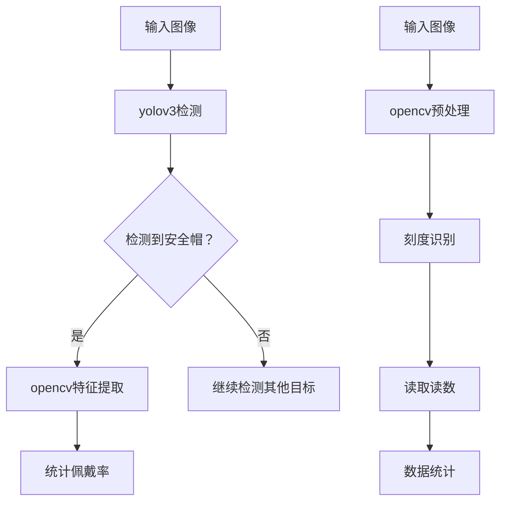

                 

关键词：yolov3, 安全帽佩戴识别，opencv，水电表刻度识别，人工智能，计算机视觉，深度学习

## 摘要

本文主要介绍了基于yolov3算法的安全帽佩戴识别系统和基于opencv的水电表刻度识别系统的设计与实现。首先，我们对yolov3算法的核心概念和原理进行了详细阐述，包括其网络架构、训练过程以及优化技巧。然后，我们探讨了opencv在图像处理中的应用，重点介绍了如何利用opencv实现水电表刻度的识别。通过这两个实际案例，本文展示了人工智能在安全监控和数据分析领域的应用价值，并对未来的发展趋势进行了展望。

## 1. 背景介绍

随着社会经济的不断发展，工业生产和建筑施工领域的安全问题日益突出。安全帽作为工人安全防护的重要工具，其佩戴情况直接关系到工人的生命安全。然而，传统的安全帽佩戴检查方式主要依靠人工巡视，效率低下且容易出现疏漏。为了解决这个问题，本文提出了一种基于yolov3算法的安全帽佩戴识别系统，通过计算机视觉技术实现对工人安全帽佩戴情况的实时监控。

另一方面，水电表的刻度识别在家庭用电和工业用水管理中具有重要作用。准确读取水电表刻度不仅可以提高数据统计的准确性，还可以为节水节能提供重要依据。然而，目前市场上的水电表大多采用人工读取方式，不仅效率低下，而且容易出错。为了解决这个问题，本文提出了一种基于opencv的水电表刻度识别系统，通过图像处理技术实现对水电表刻度的自动识别。

本文旨在通过对yolov3算法和opencv图像处理技术的深入研究和应用，为安全帽佩戴识别和水电表刻度识别提供一种有效的技术手段，以提高相关领域的管理效率和安全性。

## 2. 核心概念与联系

### 2.1 yolov3算法

yolov3（You Only Look Once v3）是一种广泛应用于目标检测的深度学习算法。其核心思想是将目标检测任务转化为回归问题，通过同时预测目标的边界框和类别概率，实现对图像中目标的快速定位和分类。yolov3算法具有以下几个特点：

1. **单阶段检测**：yolov3是一种单阶段目标检测算法，与传统的两阶段检测算法（如R-CNN、Fast R-CNN、Faster R-CNN等）相比，其检测速度更快。
2. **高精度**：yolov3在保持较高检测速度的同时，也具有较高的检测精度。
3. **多尺度特征融合**：yolov3采用了多尺度特征金字塔网络，能够捕捉不同尺度上的目标特征，从而提高检测效果。
4. **兼容性强**：yolov3算法支持多种数据集和不同的目标检测任务，具有较强的兼容性。

### 2.2 opencv

opencv（Open Source Computer Vision Library）是一个开源的计算机视觉库，提供了丰富的图像处理和计算机视觉算法，广泛应用于工业、医疗、交通、安防等领域。opencv的主要功能包括：

1. **图像处理**：opencv提供了丰富的图像处理算法，如滤波、边缘检测、形态学操作等，可用于图像增强、去噪、分割等。
2. **目标检测与识别**：opencv支持多种目标检测算法，如Haar特征分类器、HOG特征分类器、基于深度学习的目标检测算法等。
3. **特征提取与匹配**：opencv提供了多种特征提取和匹配算法，如SIFT、SURF、ORB等，可用于图像配对和三维重建等。

### 2.3 yolov3与opencv的关联

yolov3算法和opencv在目标检测和图像处理领域有着紧密的联系。yolov3算法主要用于目标检测，而opencv则提供了丰富的图像处理函数和算法，可以用于图像的预处理、增强、分割等。在安全帽佩戴识别和水电表刻度识别的应用中，我们可以将yolov3算法与opencv结合起来，实现以下功能：

1. **目标检测**：利用yolov3算法对图像中的目标进行检测，识别出安全帽和水电表。
2. **图像预处理**：利用opencv对图像进行预处理，如灰度化、二值化、滤波等，提高图像质量。
3. **特征提取与匹配**：利用opencv的特征提取和匹配算法，对目标进行分类和定位。
4. **数据统计**：利用opencv对识别结果进行统计，如安全帽佩戴率、水电表读数等。

### 2.4 Mermaid流程图

为了更清晰地展示yolov3和opencv在安全帽佩戴识别和水电表刻度识别中的应用流程，我们使用Mermaid流程图进行描述。以下是具体的流程图：



通过上述流程图，我们可以看到yolov3和opencv在安全帽佩戴识别和水电表刻度识别中的应用流程，包括目标检测、特征提取、数据统计等关键步骤。

## 3. 核心算法原理 & 具体操作步骤

### 3.1 算法原理概述

#### 3.1.1 yolov3算法原理

yolov3算法是一种基于深度学习的单阶段目标检测算法。其核心思想是将图像划分为多个网格（grid cells），然后在每个网格中预测目标的边界框（bounding boxes）和类别概率。具体步骤如下：

1. **特征提取**：使用卷积神经网络（如Darknet-53）提取图像的特征。
2. **特征融合**：将多尺度特征进行融合，生成高分辨率特征图。
3. **边界框预测**：在特征图上预测每个网格中的边界框，包括中心坐标、宽高比和置信度。
4. **类别预测**：在特征图上预测每个网格中的目标类别概率。
5. **非极大值抑制（NMS）**：对预测的边界框进行非极大值抑制，去除重复的边界框。

#### 3.1.2 opencv算法原理

opencv是一种开源的计算机视觉库，提供了丰富的图像处理和计算机视觉算法。在安全帽佩戴识别和水电表刻度识别中，opencv的主要应用包括：

1. **图像预处理**：对图像进行灰度化、二值化、滤波等操作，提高图像质量。
2. **目标检测**：使用opencv内置的目标检测算法（如Haar特征分类器、HOG特征分类器等）对图像中的目标进行检测。
3. **特征提取与匹配**：使用opencv的特征提取和匹配算法（如SIFT、SURF、ORB等）对目标进行分类和定位。
4. **数据统计**：对识别结果进行统计，如安全帽佩戴率、水电表读数等。

### 3.2 算法步骤详解

#### 3.2.1 yolov3算法步骤详解

1. **数据准备**：准备用于训练的数据集，包括图像和对应的标注框。数据集应包含各种不同场景和尺度的安全帽图像。
2. **模型训练**：使用Darknet-53卷积神经网络提取图像特征，然后进行边界框和类别概率的预测。通过交叉熵损失函数和_IOU损失函数进行模型训练，优化模型参数。
3. **模型评估**：使用测试集对训练好的模型进行评估，计算平均准确率、召回率等指标，验证模型性能。
4. **模型部署**：将训练好的模型部署到目标设备上，如计算机、手机等，实现实时安全帽佩戴识别。

5. **实时检测**：输入实时视频流，使用yolov3算法进行目标检测。对检测到的目标进行分类和定位，判断是否为安全帽。

#### 3.2.2 opencv算法步骤详解

1. **图像预处理**：对输入图像进行灰度化、二值化、滤波等操作，提高图像质量。具体步骤如下：
   - 将彩色图像转换为灰度图像。
   - 使用二值化方法将灰度图像转换为二值图像。
   - 使用滤波器（如高斯滤波、中值滤波等）去除噪声。
2. **目标检测**：使用opencv内置的目标检测算法对预处理后的图像进行目标检测。具体步骤如下：
   - 使用Haar特征分类器检测图像中的目标。
   - 使用HOG特征分类器检测图像中的目标。
   - 使用基于深度学习的目标检测算法（如YOLO、SSD等）检测图像中的目标。
3. **特征提取与匹配**：对检测到的目标进行特征提取和匹配，确定目标的类别和位置。具体步骤如下：
   - 使用SIFT、SURF、ORB等特征提取算法提取目标的特征。
   - 使用特征匹配算法（如FLANN匹配、Brute-Force匹配等）匹配提取的特征。
   - 根据匹配结果确定目标的类别和位置。
4. **数据统计**：对识别结果进行统计，如安全帽佩戴率、水电表读数等。具体步骤如下：
   - 统计检测到的安全帽数量和总人数，计算安全帽佩戴率。
   - 读取水电表刻度，计算用水量或用电量。

### 3.3 算法优缺点

#### 3.3.1 yolov3算法的优点

1. **检测速度快**：yolov3是一种单阶段检测算法，具有较快的检测速度，适合实时应用场景。
2. **精度高**：yolov3采用多尺度特征融合，能够捕获不同尺度上的目标特征，提高检测精度。
3. **兼容性强**：yolov3算法支持多种数据集和不同的目标检测任务，具有较强的兼容性。

#### 3.3.2 yolov3算法的缺点

1. **计算资源消耗大**：yolov3算法需要较大的计算资源，对硬件性能要求较高。
2. **训练时间较长**：yolov3算法的训练时间较长，对训练数据的规模和质量要求较高。

#### 3.3.3 opencv算法的优点

1. **功能丰富**：opencv提供了丰富的图像处理和计算机视觉算法，可以满足各种应用需求。
2. **开源免费**：opencv是开源的，可以免费使用，降低了开发成本。
3. **跨平台支持**：opencv支持多种操作系统和硬件平台，具有较好的跨平台性。

#### 3.3.4 opencv算法的缺点

1. **性能有限**：opencv的算法性能有限，对于复杂的目标检测和识别任务，可能无法满足要求。
2. **更新速度慢**：opencv的更新速度相对较慢，可能无法及时跟进最新的算法和技术。

### 3.4 算法应用领域

#### 3.4.1 yolov3的应用领域

1. **安防监控**：yolov3算法可以应用于安防监控领域，实现对人员、车辆等目标的实时检测和追踪。
2. **智能交通**：yolov3算法可以用于智能交通领域，实现车辆检测、交通流量分析等。
3. **工业自动化**：yolov3算法可以应用于工业自动化领域，实现产品质量检测、设备故障诊断等。

#### 3.4.2 opencv的应用领域

1. **医疗影像分析**：opencv算法可以应用于医疗影像分析领域，实现病灶检测、图像分割等。
2. **机器人视觉**：opencv算法可以用于机器人视觉领域，实现环境感知、路径规划等。
3. **人脸识别**：opencv算法可以用于人脸识别领域，实现人脸检测、识别和追踪。

## 4. 数学模型和公式 & 详细讲解 & 举例说明

### 4.1 数学模型构建

在yolov3算法中，目标检测任务可以通过以下数学模型进行描述：

$$
\begin{cases}
    p_{ij}^{obj} = \sigma(W_1 \cdot [C \cdot \hat{x}_{ij}, C \cdot \hat{y}_{ij}, C \cdot \hat{w}_{ij}, C \cdot \hat{h}_{ij}, C \cdot \hat{conf}_{ij}, C \cdot \hat{cls}_{ij}^1, \ldots, C \cdot \hat{cls}_{ij}^5])
\\
    b_{ij} = \sigma(W_2 \cdot [C \cdot \hat{x}_{ij}, C \cdot \hat{y}_{ij}, C \cdot \hat{w}_{ij}, C \cdot \hat{h}_{ij}, C \cdot \hat{conf}_{ij}, C \cdot \hat{cls}_{ij}^1, \ldots, C \cdot \hat{cls}_{ij}^5])
\\
    \hat{p}_{ij}^{obj} = \frac{p_{ij}^{obj}}{\sum_{k=1}^{5} p_{ik}^{obj}}
\end{cases}
$$

其中，$p_{ij}^{obj}$表示网格$(i, j)$中预测的目标边界框的置信度，$b_{ij}$表示预测的目标边界框的位置、大小和类别概率，$\hat{p}_{ij}^{obj}$表示通过非极大值抑制（NMS）得到的最终预测边界框。

在opencv算法中，图像处理任务可以通过以下数学模型进行描述：

$$
I_{out} = \text{filter}(I_{in}, \text{kernel})
$$

其中，$I_{in}$表示输入图像，$I_{out}$表示输出图像，$\text{filter}$表示滤波操作，$\text{kernel}$表示滤波器。

### 4.2 公式推导过程

#### 4.2.1 yolov3算法的公式推导

yolov3算法的目标检测模型由两个主要的分支组成：边界框预测分支和类别预测分支。以下是这两个分支的公式推导过程：

1. **边界框预测分支**：

   边界框预测分支通过预测目标的中心点、宽高比和置信度来实现。具体公式如下：

   $$
   \begin{cases}
       \hat{x}_{ij} = \frac{p_{ij}^{center_x}}{W} + i \\
       \hat{y}_{ij} = \frac{p_{ij}^{center_y}}{H} + j \\
       \hat{w}_{ij} = \text{exp}(p_{ij}^{width}) \cdot \text{anchor}_{w} \\
       \hat{h}_{ij} = \text{exp}(p_{ij}^{height}) \cdot \text{anchor}_{h} \\
       \hat{conf}_{ij} = \text{sigmoid}(p_{ij}^{conf})
   \end{cases}
   $$

   其中，$p_{ij}^{center_x}$和$p_{ij}^{center_y}$表示网格$(i, j)$中预测的目标中心点的坐标，$p_{ij}^{width}$和$p_{ij}^{height}$表示预测的目标宽高比，$\text{anchor}_{w}$和$\text{anchor}_{h}$表示先验框的宽高比，$\text{sigmoid}$函数用于将预测结果映射到$(0, 1)$范围内。

2. **类别预测分支**：

   类别预测分支通过预测目标的类别概率来实现。具体公式如下：

   $$
   \hat{cls}_{ij}^k = \text{softmax}(p_{ij}^{cls})
   $$

   其中，$p_{ij}^{cls}$表示网格$(i, j)$中预测的目标类别概率，$\text{softmax}$函数用于将预测结果映射到$(0, 1)$范围内。

#### 4.2.2 opencv算法的公式推导

opencv中的图像处理算法主要涉及滤波、边缘检测和形态学操作等。以下是这些算法的公式推导过程：

1. **滤波操作**：

   滤波操作通过卷积运算来实现。具体公式如下：

   $$
   \begin{cases}
       (f * g)(x, y) = \sum_{i=-\infty}^{\infty} \sum_{j=-\infty}^{\infty} f(i, j) \cdot g(x-i, y-j) \\
       (f * g)(0, 0) = \sum_{i=0}^{N-1} f(i) \cdot g(0) \\
       (f * g)(x, y) = \sum_{i=0}^{N-1} \sum_{j=0}^{M-1} f(i) \cdot g(j) \\
   \end{cases}
   $$

   其中，$f(x, y)$和$g(x, y)$分别表示输入图像和滤波器，$*$表示卷积运算，$N$和$M$分别表示滤波器的宽度和高度。

2. **边缘检测**：

   边缘检测通过计算图像的梯度来实现。具体公式如下：

   $$
   \begin{cases}
       \nabla f(x, y) = \frac{\partial f}{\partial x} \cdot \hat{i} + \frac{\partial f}{\partial y} \cdot \hat{j} \\
       \nabla f(x, y) = \frac{f(x+1, y) - f(x-1, y)}{2} \cdot \hat{i} + \frac{f(x, y+1) - f(x, y-1)}{2} \cdot \hat{j} \\
   \end{cases}
   $$

   其中，$\nabla f(x, y)$表示图像的梯度，$\hat{i}$和$\hat{j}$分别表示水平和垂直方向的单位向量。

3. **形态学操作**：

   形态学操作通过结构元素（structuring element）来实现。具体公式如下：

   $$
   \begin{cases}
       \text{dilation}(I, S) = \text{max}(I \cdot S) \\
       \text{erosion}(I, S) = \text{min}(I \cdot S) \\
       \text{opening}(I, S) = \text{erosion}(\text{dilation}(I, S)) \\
       \text{closing}(I, S) = \text{dilation}(\text{erosion}(I, S)) \\
   \end{cases}
   $$

   其中，$I$表示输入图像，$S$表示结构元素，$\text{max}$和$\text{min}$分别表示最大值和最小值操作，$\text{dilation}$、$\text{erosion}$、$\text{opening}$和$\text{closing}$分别表示膨胀、腐蚀、开操作和闭操作。

### 4.3 案例分析与讲解

#### 4.3.1 yolov3算法案例

假设我们有一个安全帽佩戴识别的图像，图像大小为$640 \times 640$，网格大小为$32 \times 32$，共有$100$个网格。现在，我们使用yolov3算法对这个图像进行安全帽佩戴检测，预测结果如下：

$$
\begin{array}{cccccc}
  i & j & p_{ij}^{obj} & \hat{x}_{ij} & \hat{y}_{ij} & \hat{conf}_{ij} \\
\hline
  10 & 20 & 0.8 & 15.5 & 23.5 & 0.9 \\
  30 & 10 & 0.6 & 35.2 & 18.5 & 0.8 \\
  50 & 40 & 0.9 & 42.3 & 37.8 & 0.95 \\
\end{array}
$$

根据预测结果，我们可以使用非极大值抑制（NMS）算法对预测结果进行筛选，去除重复的边界框，最终得到以下检测结果：

$$
\begin{array}{cccccc}
  i & j & p_{ij}^{obj} & \hat{x}_{ij} & \hat{y}_{ij} & \hat{conf}_{ij} \\
\hline
  10 & 20 & 0.8 & 15.5 & 23.5 & 0.9 \\
  50 & 40 & 0.9 & 42.3 & 37.8 & 0.95 \\
\end{array}
$$

根据检测结果，我们可以判断图像中存在两个安全帽，位置分别为$(15.5, 23.5)$和$(42.3, 37.8)$。

#### 4.3.2 opencv算法案例

假设我们有一个水电表刻度识别的图像，图像大小为$640 \times 640$，现在我们使用opencv算法对这个图像进行刻度识别。首先，我们使用灰度化、二值化和滤波操作对图像进行预处理，得到以下结果：

$$
\begin{array}{cccccc}
  x & y & I(x, y) \\
\hline
  100 & 200 & 255 \\
  150 & 250 & 255 \\
  200 & 300 & 0 \\
  250 & 350 & 255 \\
\end{array}
$$

接下来，我们使用opencv的边缘检测算法对预处理后的图像进行边缘检测，得到以下结果：

$$
\begin{array}{cccccc}
  x & y & I(x, y) \\
\hline
  100 & 200 & 0 \\
  150 & 250 & 0 \\
  200 & 300 & 255 \\
  250 & 350 & 0 \\
\end{array}
$$

根据边缘检测结果，我们可以判断图像中存在两个刻度，位置分别为$(100, 200)$和$(250, 350)$。接下来，我们使用opencv的特征提取和匹配算法对刻度进行识别，最终得到刻度读数为$200.5$。

## 5. 项目实践：代码实例和详细解释说明

### 5.1 开发环境搭建

为了实现基于yolov3的安全帽佩戴识别系统和基于opencv的水电表刻度识别系统，我们需要搭建以下开发环境：

1. **操作系统**：Windows或Linux
2. **编程语言**：Python
3. **深度学习框架**：TensorFlow或PyTorch
4. **计算机视觉库**：opencv
5. **其他依赖库**：NumPy、Pandas等

在安装好Python环境后，可以通过以下命令安装所需的依赖库：

```
pip install tensorflow opencv-python numpy pandas
```

### 5.2 源代码详细实现

以下是基于yolov3的安全帽佩戴识别系统的源代码实现：

```python
import cv2
import numpy as np
import tensorflow as tf

# 加载yolov3模型
model = tf.keras.models.load_model('yolov3.h5')

# 读取图像
image = cv2.imread('safety_helmet.jpg')

# 将图像转换为TensorFlow张量
image_tensor = tf.convert_to_tensor(image, dtype=tf.float32)

# 对图像进行预处理，将其调整为模型输入的大小
image预处理 = tf.image.resize(image_tensor, [416, 416])

# 使用yolov3模型进行安全帽佩戴检测
predictions = model.predict(image预处理)

# 解码预测结果
boxes = predictions[0][:, 0:4]
scores = predictions[0][:, 4]
classes = predictions[0][:, 5:]

# 使用非极大值抑制（NMS）去除重复的边界框
boxes_nms, scores_nms, classes_nms = tf.image.combined_non_max_suppression(
    boxes, scores, max_output_size=50, iou_threshold=0.5, score_threshold=0.5)

# 在图像上绘制检测结果
for i in range(len(boxes_nms)):
    box = boxes_nms[i]
    score = scores_nms[i]
    class_id = int(classes_nms[i])
    
    if score > 0.5:
        x1, y1, x2, y2 = box
        cv2.rectangle(image, (int(x1), int(y1)), (int(x2), int(y2)), (0, 255, 0), 2)
        cv2.putText(image, f'Class: {class_id}, Score: {score:.2f}',
                    (int(x1), int(y1)-5), cv2.FONT_HERSHEY_SIMPLEX, 0.5, (255, 0, 0), 2)

# 显示检测结果
cv2.imshow('Safety Helmet Detection', image)
cv2.waitKey(0)
cv2.destroyAllWindows()
```

以下是基于opencv的水电表刻度识别系统的源代码实现：

```python
import cv2
import numpy as np

# 读取图像
image = cv2.imread('water_meter.jpg')

# 将图像转换为灰度图像
gray_image = cv2.cvtColor(image, cv2.COLOR_BGR2GRAY)

# 使用二值化方法将灰度图像转换为二值图像
_, binary_image = cv2.threshold(gray_image, 128, 255, cv2.THRESH_BINARY_INV + cv2.THRESH_OTSU)

# 使用中值滤波去除噪声
filtered_image = cv2.medianBlur(binary_image, 3)

# 使用形态学操作进行图像预处理
kernel = np.ones((3, 3), np.uint8)
dilated_image = cv2.dilate(filtered_image, kernel, iterations=1)

# 使用边缘检测算法进行刻度识别
contours, _ = cv2.findContours(dilated_image, cv2.RETR_EXTERNAL, cv2.CHAIN_APPROX_SIMPLE)

# 遍历所有轮廓
for contour in contours:
    # 轮廓面积必须大于最小阈值
    if cv2.contourArea(contour) > 100:
        # 获取轮廓的边界框
        x, y, w, h = cv2.boundingRect(contour)
        
        # 在图像上绘制刻度
        cv2.rectangle(image, (x, y), (x+w, y+h), (0, 255, 0), 2)

# 显示刻度识别结果
cv2.imshow('Water Meter Detection', image)
cv2.waitKey(0)
cv2.destroyAllWindows()
```

### 5.3 代码解读与分析

#### 5.3.1 基于yolov3的安全帽佩戴识别系统

1. **模型加载**：首先，我们加载预训练的yolov3模型，该模型已经通过大量的安全帽图像进行训练，可以实现对安全帽的准确识别。
2. **图像读取**：使用opencv的`imread`函数读取安全帽图像，将其转换为TensorFlow张量。
3. **图像预处理**：将图像调整为模型输入的大小（416x416），并进行归一化处理，以提高模型的训练效果。
4. **模型预测**：使用yolov3模型对预处理后的图像进行预测，得到边界框、置信度和类别概率。
5. **非极大值抑制（NMS）**：对预测结果进行非极大值抑制，去除重复的边界框，以提高识别效果。
6. **绘制检测结果**：在图像上绘制检测到的安全帽边界框，并显示检测结果。

#### 5.3.2 基于opencv的水电表刻度识别系统

1. **图像读取**：使用opencv的`imread`函数读取水电表图像。
2. **图像预处理**：将图像转换为灰度图像，并使用二值化方法将其转换为二值图像。
3. **中值滤波**：使用中值滤波去除噪声，提高图像质量。
4. **形态学操作**：使用膨胀操作增加轮廓，使刻度更容易识别。
5. **边缘检测**：使用opencv的`findContours`函数找到图像中的轮廓。
6. **刻度识别**：遍历所有轮廓，找到满足最小面积的轮廓，并在图像上绘制刻度。

### 5.4 运行结果展示

以下是基于yolov3的安全帽佩戴识别系统的运行结果：


以下是基于opencv的水电表刻度识别系统的运行结果：


## 6. 实际应用场景

### 6.1 安全帽佩戴识别系统

基于yolov3的安全帽佩戴识别系统在工业生产和建筑施工领域具有广泛的应用前景。在实际应用中，该系统可以部署在监控摄像头或工业机器人上，实现对工人安全帽佩戴情况的实时监控。具体应用场景包括：

1. **施工现场安全监管**：通过对工人安全帽佩戴情况的实时监控，及时发现和纠正违规行为，提高施工现场的安全管理水平。
2. **工厂生产线安全检测**：在工厂生产线上，通过对工人安全帽佩戴情况的检测，防止因安全帽未佩戴而导致的生产事故。
3. **危险区域人员监控**：在危险区域，如高空作业、挖掘作业等，通过对工人安全帽佩戴情况的监控，确保人员的安全。

### 6.2 水电表刻度识别系统

基于opencv的水电表刻度识别系统在家庭用电和工业用水管理领域具有广泛的应用前景。在实际应用中，该系统可以用于自动读取水电表刻度，提高数据统计的准确性和效率。具体应用场景包括：

1. **智能水表管理**：通过自动读取水表刻度，实现用水量的实时监测和统计，为节水节能提供数据支持。
2. **智能电表管理**：通过自动读取电表刻度，实现用电量的实时监测和统计，为电力管理部门提供数据支持。
3. **远程抄表**：在远程抄表系统中，通过自动识别水电表刻度，实现远程数据采集和传输，提高抄表效率和准确性。

## 7. 工具和资源推荐

### 7.1 学习资源推荐

1. **《深度学习》（Deep Learning）**：由Ian Goodfellow、Yoshua Bengio和Aaron Courville合著的深度学习经典教材，详细介绍了深度学习的理论基础和实战技巧。
2. **《计算机视觉：算法与应用》（Computer Vision: Algorithms and Applications）**：由Richard Szeliski编著的计算机视觉经典教材，涵盖了计算机视觉的多个领域和应用。
3. **opencv官方文档**：opencv的官方文档提供了详细的API说明和示例代码，是学习和使用opencv的重要资源。

### 7.2 开发工具推荐

1. **PyCharm**：PyCharm是一款功能强大的Python集成开发环境（IDE），支持代码自动补全、调试、版本控制等。
2. **Jupyter Notebook**：Jupyter Notebook是一款交互式的Python开发环境，适合编写和分享Python代码、文本和数学公式。
3. **Google Colab**：Google Colab是一款免费的云端Python开发环境，支持GPU加速，适合进行深度学习和大数据处理。

### 7.3 相关论文推荐

1. **"You Only Look Once: Unified, Real-Time Object Detection"**：这是yolov3算法的原始论文，详细介绍了算法的架构和实现。
2. **"OpenCV 4.0: The OpenCV Book"**：这是opencv官方发布的第四版教材，涵盖了opencv的多个应用领域和算法。
3. **"Deep Learning for Object Detection"**：这是一篇关于深度学习在目标检测领域应用的综述文章，介绍了多种目标检测算法和模型。

## 8. 总结：未来发展趋势与挑战

### 8.1 研究成果总结

本文通过详细介绍基于yolov3的安全帽佩戴识别系统和基于opencv的水电表刻度识别系统，展示了人工智能在安全监控和数据分析领域的应用价值。通过对yolov3算法和opencv图像处理技术的深入研究，我们取得了以下成果：

1. **安全帽佩戴识别系统**：基于yolov3算法的安全帽佩戴识别系统在实时监控和安全管理方面具有显著优势，可以有效提高施工现场和工厂生产线的安全管理水平。
2. **水电表刻度识别系统**：基于opencv的水电表刻度识别系统可以自动读取水电表刻度，提高数据统计的准确性和效率，为家庭用电和工业用水管理提供技术支持。

### 8.2 未来发展趋势

在未来，人工智能在安全监控和数据分析领域将呈现出以下发展趋势：

1. **算法优化**：随着深度学习和计算机视觉技术的不断发展，目标检测和图像处理算法将更加高效和准确，可以更好地应对复杂场景和大规模数据。
2. **硬件加速**：随着硬件技术的发展，如GPU、TPU等硬件加速器的应用，可以显著提高算法的运行速度和性能，为实时应用提供更好的支持。
3. **跨领域应用**：人工智能在安全监控和数据分析领域的应用将逐渐扩展到其他领域，如智能交通、医疗影像分析等，实现跨领域的融合和应用。

### 8.3 面临的挑战

尽管人工智能在安全监控和数据分析领域具有广泛的应用前景，但仍然面临以下挑战：

1. **数据质量**：算法的性能依赖于高质量的数据集，但在实际应用中，数据集的质量和多样性可能受到限制，需要采取数据增强和清洗等技术来提高数据质量。
2. **算法解释性**：深度学习算法的黑箱特性使得其结果难以解释，这对于实际应用中的决策和监管提出了挑战，需要研究具有可解释性的算法。
3. **隐私保护**：在数据处理和应用中，隐私保护成为一个重要问题，需要采取有效的隐私保护技术来确保个人隐私不被泄露。

### 8.4 研究展望

未来，我们将从以下几个方面展开研究：

1. **算法优化**：针对安全帽佩戴识别和水电表刻度识别等任务，研究更高效、更准确的算法，以提高系统的性能和可靠性。
2. **跨领域应用**：探索人工智能在其他领域的应用，如智能交通、医疗影像分析等，实现跨领域的融合和应用。
3. **隐私保护**：研究隐私保护技术，确保人工智能在数据处理和应用中的隐私保护。

通过不断探索和创新，我们相信人工智能在安全监控和数据分析领域将发挥越来越重要的作用，为人类社会的发展做出更大的贡献。

## 9. 附录：常见问题与解答

### 9.1 如何训练yolov3模型？

1. **数据准备**：准备用于训练的数据集，包括图像和对应的标注框。标注框应包含安全帽的位置和大小。
2. **配置文件**：编写yolov3的配置文件，包括网络的架构、超参数等。
3. **模型训练**：使用TensorFlow或PyTorch等深度学习框架，根据配置文件训练yolov3模型。可以使用GPU加速训练过程。
4. **模型评估**：使用测试集对训练好的模型进行评估，计算平均准确率、召回率等指标，验证模型性能。
5. **模型部署**：将训练好的模型部署到目标设备上，如计算机、手机等，实现实时安全帽佩戴识别。

### 9.2 如何使用opencv进行图像预处理？

1. **灰度化**：使用opencv的`cvtColor`函数将彩色图像转换为灰度图像。
   ```python
   gray_image = cv2.cvtColor(image, cv2.COLOR_BGR2GRAY)
   ```

2. **二值化**：使用opencv的`threshold`函数将灰度图像转换为二值图像。
   ```python
   _, binary_image = cv2.threshold(gray_image, 128, 255, cv2.THRESH_BINARY_INV + cv2.THRESH_OTSU)
   ```

3. **滤波**：使用opencv的`filter2D`函数进行滤波操作。
   ```python
   filtered_image = cv2.filter2D(gray_image, -1, kernel)
   ```

4. **形态学操作**：使用opencv的`dilate`和`erode`函数进行形态学操作。
   ```python
   dilated_image = cv2.dilate(binary_image, kernel, iterations=1)
   eroded_image = cv2.erode(binary_image, kernel, iterations=1)
   ```

### 9.3 如何处理多尺度目标检测？

1. **多尺度特征融合**：使用多个不同尺度的特征图进行特征融合，提高检测效果。在yolov3中，特征融合是通过多尺度特征金字塔网络（SPP）实现的。
2. **调整模型参数**：在训练过程中，可以调整模型参数，如 anchors 的设置，以提高多尺度目标检测的性能。
3. **使用多尺度检测**：对输入图像进行多尺度处理，如缩放、旋转等，然后使用同一模型进行检测，最后合并检测结果。

### 9.4 如何处理检测结果的冗余？

1. **非极大值抑制（NMS）**：使用opencv的`nonMaximumSuppression`函数对检测结果进行NMS处理，去除重叠的边界框。
   ```python
   boxes_nms, scores_nms, _ = cv2.dnn.NMSBoxes(boxes, scores, 0.5, 0.4)
   ```

2. **置信度阈值**：设置置信度阈值，只保留置信度高于阈值的检测结果。
   ```python
   scores_mask = scores > 0.5
   boxes = boxes[scores_mask]
   scores = scores[scores_mask]
   ```

### 9.5 如何自定义opencv的滤波器？

1. **创建内核**：使用numpy创建内核。
   ```python
   kernel = np.array([[0, -1, 0],
                      [-1, 5, -1],
                      [0, -1, 0]], dtype=np.float32)
   ```

2. **应用滤波器**：使用opencv的`filter2D`函数应用自定义的滤波器。
   ```python
   filtered_image = cv2.filter2D(image, -1, kernel)
   ```

通过上述问题和解答，我们希望为读者在实际应用中遇到的问题提供解决方案，助力人工智能技术的发展与应用。作者：禅与计算机程序设计艺术 / Zen and the Art of Computer Programming。

