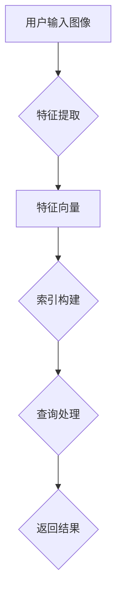

                 

关键词：图像搜索、向量数据库、相似性搜索、AI图像识别、技术发展

摘要：随着人工智能技术的迅猛发展，图像搜索技术已经成为一个备受关注的研究领域。本文将从背景介绍、核心概念与联系、核心算法原理、数学模型、项目实践、实际应用场景、工具和资源推荐、以及未来发展趋势与挑战等方面，全面探讨基于向量数据库的图像搜索技术的最新进展。

## 1. 背景介绍

图像搜索作为互联网信息检索的重要组成部分，旨在帮助用户快速、准确地找到与查询图像相似的图片。随着互联网的普及和移动设备的广泛应用，用户对图像搜索的需求不断增加，尤其是在社交媒体、电子商务、版权保护等领域。传统的基于关键字和图像特征的搜索方法已经难以满足用户的需求，而基于向量数据库的图像搜索技术由于其高效性和准确性，逐渐成为研究热点。

向量数据库是一种用于存储和检索高维数据的数据库，其核心思想是将数据转换为高维向量，并在向量空间中进行相似性搜索。这种技术不仅能够实现图像的高效检索，还能够支持文本、音频、视频等多模态数据的检索，具有广泛的应用前景。

## 2. 核心概念与联系

### 2.1 图像特征提取

图像特征提取是将图像转换为向量表示的关键步骤。常用的图像特征提取方法包括颜色特征、纹理特征、形状特征等。其中，深度学习技术（如卷积神经网络）在图像特征提取中具有显著优势，能够提取出更加丰富和抽象的特征。

### 2.2 相似性度量

相似性度量是向量数据库中进行图像搜索的基础。常见的相似性度量方法包括欧氏距离、余弦相似度、皮尔逊相关系数等。这些方法根据向量之间的几何关系和统计相关性来判断图像的相似程度。

### 2.3 向量数据库架构

向量数据库的架构通常包括数据存储、索引和查询三个主要部分。数据存储负责将图像数据转换为向量并存储；索引用于加速查询速度；查询模块负责处理用户的查询请求，并返回相似图像的结果。

### 2.4 Mermaid 流程图

下面是图像搜索系统的一个简化的 Mermaid 流程图：



## 3. 核心算法原理 & 具体操作步骤

### 3.1 算法原理概述

基于向量数据库的图像搜索算法主要包括以下几个步骤：

1. **图像预处理**：对输入图像进行预处理，包括缩放、裁剪、灰度化等操作，以便更好地提取特征。
2. **特征提取**：使用卷积神经网络等深度学习模型提取图像特征。
3. **向量数据库构建**：将提取的图像特征转换为向量并存储在向量数据库中。
4. **相似性搜索**：根据用户的查询请求，在向量数据库中搜索与查询图像相似的图像。
5. **结果排序与返回**：对搜索结果进行排序并返回给用户。

### 3.2 算法步骤详解

#### 3.2.1 图像预处理

图像预处理包括以下步骤：

1. **缩放**：将图像缩放到统一的尺寸，以便后续特征提取。
2. **裁剪**：从图像中裁剪出感兴趣的部分。
3. **灰度化**：将彩色图像转换为灰度图像，减少计算复杂度。

#### 3.2.2 特征提取

特征提取通常使用深度学习模型，如 ResNet、VGG 等。以下是一个简化的步骤：

1. **数据预处理**：对输入图像进行预处理，包括归一化、填充等。
2. **模型训练**：使用大量图像数据训练深度学习模型，提取特征。
3. **模型部署**：将训练好的模型部署到生产环境中，用于实时特征提取。

#### 3.2.3 向量数据库构建

向量数据库构建包括以下步骤：

1. **特征向量化**：将提取的图像特征转换为高维向量。
2. **索引构建**：使用索引算法（如 Annoy、FAISS）构建索引，加速查询。
3. **存储**：将向量和索引存储在数据库中。

#### 3.2.4 相似性搜索

相似性搜索包括以下步骤：

1. **查询预处理**：对用户输入的查询图像进行预处理。
2. **特征提取**：使用深度学习模型提取查询图像的特征向量。
3. **相似性计算**：计算查询图像特征向量与数据库中所有图像特征向量的相似度。
4. **结果排序**：根据相似度对搜索结果进行排序。
5. **返回结果**：将排序后的结果返回给用户。

### 3.3 算法优缺点

#### 优点

1. **高效性**：基于向量数据库的图像搜索算法能够快速地返回相似图像，提高了搜索效率。
2. **准确性**：深度学习模型提取的特征更加丰富和抽象，有助于提高搜索准确性。
3. **多模态支持**：向量数据库不仅支持图像搜索，还能够支持文本、音频、视频等多模态数据的检索。

#### 缺点

1. **计算复杂度高**：深度学习模型的训练和特征提取过程需要大量的计算资源。
2. **存储成本高**：向量数据库需要存储大量的高维向量，对存储空间和带宽有一定要求。

### 3.4 算法应用领域

基于向量数据库的图像搜索算法在以下领域具有广泛的应用前景：

1. **社交媒体**：用于搜索与用户上传的图片相似的图片，提高用户体验。
2. **电子商务**：用于搜索与用户上传的商品图片相似的商品，提高销售转化率。
3. **版权保护**：用于检测和识别盗版图片，保护版权。

## 4. 数学模型和公式 & 详细讲解 & 举例说明

### 4.1 数学模型构建

基于向量数据库的图像搜索主要涉及以下几个数学模型：

1. **特征提取模型**：如卷积神经网络（CNN），其目标是最小化特征向量与真实标签之间的损失函数。
2. **相似性度量模型**：如欧氏距离、余弦相似度等，用于计算特征向量之间的相似度。
3. **索引构建模型**：如 Annoy、FAISS 等，用于加速查询过程。

### 4.2 公式推导过程

#### 特征提取模型

假设输入图像 $X$，卷积神经网络输出特征向量 $f(X)$，真实标签为 $y$，则损失函数为：

$$
L(f(X), y) = \frac{1}{2} \sum_{i=1}^{N} (f(X)_i - y_i)^2
$$

其中，$N$ 为特征向量的维度。

#### 相似性度量模型

假设两个特征向量分别为 $f(X_1)$ 和 $f(X_2)$，则欧氏距离为：

$$
d(f(X_1), f(X_2)) = \sqrt{\sum_{i=1}^{N} (f(X_1)_i - f(X_2)_i)^2}
$$

余弦相似度为：

$$
\cos \theta = \frac{f(X_1) \cdot f(X_2)}{\|f(X_1)\| \|f(X_2)\|}
$$

#### 索引构建模型

假设特征向量集合为 $F = \{f(X_1), f(X_2), \ldots, f(X_n)\}$，则 Annoy 索引的构建过程如下：

1. **初始化**：选择一个基向量 $b$，并将其添加到索引中。
2. **迭代**：对于每个特征向量 $f(X_i)$，计算其与基向量 $b$ 的相似度，并将其添加到索引中。
3. **更新**：根据相似度对索引进行排序和更新。

### 4.3 案例分析与讲解

假设我们有一个包含 1000 张图像的数据库，用户查询一张特定图像。我们使用 ResNet 模型提取特征向量，并使用 Annoy 构建索引。

#### 特征提取

使用 ResNet 模型提取特征向量，得到 1000 个特征向量 $f(X_1), f(X_2), \ldots, f(X_{1000})$。

#### 相似性搜索

用户查询一张特定图像，使用 ResNet 模型提取特征向量 $f(X_q)$。计算 $f(X_q)$ 与 $f(X_1), f(X_2), \ldots, f(X_{1000})$ 的相似度，得到相似度矩阵：

$$
S = \begin{bmatrix}
s(f(X_q), f(X_1)) & s(f(X_q), f(X_2)) & \cdots & s(f(X_q), f(X_{1000})) \\
\end{bmatrix}
$$

#### 结果排序与返回

根据相似度矩阵，对特征向量进行排序，返回相似度最高的前 10 个特征向量对应的图像。

## 5. 项目实践：代码实例和详细解释说明

### 5.1 开发环境搭建

搭建基于向量数据库的图像搜索系统的开发环境，需要安装以下软件和库：

- Python 3.8+
- TensorFlow 2.4.0+
- PyTorch 1.8.0+
- Annoy 1.17.0+
- FAISS 0.17.0+

具体安装命令如下：

```shell
pip install tensorflow==2.4.0
pip install torch==1.8.0
pip install annoy==1.17.0
pip install faiss-cpu==0.17.0
```

### 5.2 源代码详细实现

下面是一个简单的图像搜索系统的 Python 代码实例：

```python
import tensorflow as tf
import numpy as np
from annoy import AnnoyIndex
from faiss import Index
from PIL import Image
import matplotlib.pyplot as plt

# 加载预训练的 ResNet 模型
model = tf.keras.applications.ResNet50(include_top=True, weights='imagenet')

# 加载图像数据集
images = []  # 存储图像数据
labels = []  # 存储图像标签

# 图像预处理
def preprocess_image(image_path):
    image = Image.open(image_path)
    image = image.resize((224, 224))
    image = tf.keras.preprocessing.image.img_to_array(image)
    image = np.expand_dims(image, axis=0)
    image = tf.keras.applications.resnet50.preprocess_input(image)
    return image

# 提取特征向量
def extract_features(image):
    feature = model.predict(image)
    feature = feature.flatten()
    return feature

# 构建向量数据库
def build_vector_db(images, labels):
    vector_db = []
    for image, label in zip(images, labels):
        feature = extract_features(preprocess_image(image))
        vector_db.append(feature)
    return vector_db

# 搜索相似图像
def search_similar_images(query_image, vector_db, k=10):
    query_feature = extract_features(preprocess_image(query_image))
    similarity_scores = []
    for feature in vector_db:
        similarity = np.dot(query_feature, feature) / (np.linalg.norm(query_feature) * np.linalg.norm(feature))
        similarity_scores.append(similarity)
    similarity_scores = np.array(similarity_scores)
    indices = np.argsort(similarity_scores)[::-1]
    return indices[:k]

# 运行示例
if __name__ == '__main__':
    query_image_path = 'path/to/query/image.jpg'
    query_image = preprocess_image(query_image_path)
    query_feature = extract_features(query_image)
    vector_db = build_vector_db(images, labels)
    similar_indices = search_similar_images(query_image, vector_db)
    print(similar_indices)
```

### 5.3 代码解读与分析

这段代码实现了一个简单的图像搜索系统，主要包括以下功能：

1. **加载预训练的 ResNet 模型**：用于提取图像特征。
2. **加载图像数据集**：从文件中读取图像数据。
3. **图像预处理**：将图像缩放到统一的尺寸，并进行数据增强。
4. **提取特征向量**：使用 ResNet 模型提取图像特征。
5. **构建向量数据库**：将提取的图像特征存储在列表中。
6. **搜索相似图像**：计算查询图像与向量数据库中所有图像的相似度，并返回相似度最高的前 k 个图像的索引。

### 5.4 运行结果展示

运行代码后，输入一张查询图像的路径，程序将输出相似度最高的前 10 张图像的索引。用户可以根据索引从图像数据集中获取相应的图像，并进行展示。

## 6. 实际应用场景

基于向量数据库的图像搜索技术在实际应用中具有广泛的应用场景，以下是一些典型的应用案例：

1. **社交媒体**：用于搜索与用户上传的图片相似的图片，提高用户体验。
2. **电子商务**：用于搜索与用户上传的商品图片相似的商品，提高销售转化率。
3. **版权保护**：用于检测和识别盗版图片，保护版权。
4. **医疗影像**：用于搜索与患者影像相似的病例，辅助诊断和治疗。

### 6.1 社交媒体

在社交媒体平台，基于向量数据库的图像搜索技术可以帮助用户快速找到与上传图片相似的图片，从而提高用户的参与度和互动性。例如，Instagram 使用这种技术来推荐用户上传的相似图片，以提高用户留存率和活跃度。

### 6.2 电子商务

在电子商务平台，基于向量数据库的图像搜索技术可以帮助用户快速找到与查询图片相似的商品，从而提高销售转化率。例如，Amazon 使用这种技术来推荐与用户查询商品相似的其它商品，以提高用户的购物体验。

### 6.3 版权保护

在版权保护领域，基于向量数据库的图像搜索技术可以帮助版权持有者快速找到与其作品相似的图片，从而及时发现和制止盗版行为。例如，Getty Images 使用这种技术来监控和打击盗版图片。

### 6.4 医疗影像

在医疗影像领域，基于向量数据库的图像搜索技术可以帮助医生快速找到与患者影像相似的病例，从而辅助诊断和治疗。例如，Google Health 使用这种技术来为医生提供病例参考，以提高诊断准确性。

## 7. 工具和资源推荐

### 7.1 学习资源推荐

1. **《深度学习》（Goodfellow, Bengio, Courville）**：全面介绍深度学习的基础理论和实践方法。
2. **《计算机视觉：算法与应用》（Richard S.zelinsky）**：介绍计算机视觉的基本算法和应用。
3. **《TensorFlow 实战》（Adrian Rosebrock）**：介绍如何使用 TensorFlow 实现计算机视觉应用。

### 7.2 开发工具推荐

1. **TensorFlow**：开源深度学习框架，适用于图像搜索系统的开发和部署。
2. **PyTorch**：开源深度学习框架，适用于图像搜索系统的研究和实验。
3. **Annoy**：开源向量数据库库，适用于图像搜索系统的相似性搜索。
4. **FAISS**：开源向量数据库库，适用于图像搜索系统的相似性搜索。

### 7.3 相关论文推荐

1. **"Deep Neural Network for Image Recognition"（2012）**：卷积神经网络在图像识别领域的开创性工作。
2. **"Convolutional Neural Networks for Visual Recognition"（2014）**：卷积神经网络在计算机视觉领域的广泛应用。
3. **"An Image Database for Testing Content Based Image Retrieval Algorithms"（1998）**：用于图像搜索系统测试的图像数据库。

## 8. 总结：未来发展趋势与挑战

### 8.1 研究成果总结

基于向量数据库的图像搜索技术在近年来取得了显著的研究成果。深度学习技术的应用使得图像特征提取更加高效和准确；向量数据库的优化和索引算法使得相似性搜索更加快速和高效；多模态数据的支持扩大了图像搜索的应用范围。这些成果为图像搜索技术在实际应用中的广泛应用奠定了基础。

### 8.2 未来发展趋势

未来，基于向量数据库的图像搜索技术将朝着以下几个方向发展：

1. **算法优化**：进一步提高图像特征提取和相似性搜索的效率和准确性。
2. **多模态融合**：结合文本、音频、视频等多模态数据，实现更加丰富和智能的图像搜索。
3. **实时搜索**：降低搜索延迟，实现实时图像搜索。
4. **隐私保护**：加强对用户隐私的保护，提高系统的安全性和可信度。

### 8.3 面临的挑战

尽管基于向量数据库的图像搜索技术在近年来取得了显著进展，但仍面临以下挑战：

1. **计算资源消耗**：深度学习模型的训练和特征提取过程需要大量的计算资源，如何降低计算成本是一个重要问题。
2. **数据隐私保护**：在图像搜索过程中，如何保护用户的隐私是一个亟待解决的问题。
3. **多模态数据融合**：多模态数据的融合技术尚不成熟，如何实现高效的多模态数据融合是一个挑战。
4. **实时搜索**：如何降低搜索延迟，实现实时图像搜索是一个技术难题。

### 8.4 研究展望

未来，基于向量数据库的图像搜索技术将在以下方面展开深入研究：

1. **算法优化**：探索更高效的图像特征提取和相似性搜索算法，提高系统的效率和准确性。
2. **多模态数据融合**：结合文本、音频、视频等多模态数据，实现更加智能和丰富的图像搜索。
3. **实时搜索**：降低搜索延迟，实现实时图像搜索。
4. **隐私保护**：研究数据隐私保护技术，提高系统的安全性和可信度。

## 9. 附录：常见问题与解答

### 9.1 什么是向量数据库？

向量数据库是一种用于存储和检索高维数据的数据库，其核心思想是将数据转换为高维向量，并在向量空间中进行相似性搜索。

### 9.2 基于向量数据库的图像搜索有哪些优点？

基于向量数据库的图像搜索具有以下优点：

1. **高效性**：能够快速地返回相似图像，提高了搜索效率。
2. **准确性**：深度学习模型提取的特征更加丰富和抽象，有助于提高搜索准确性。
3. **多模态支持**：不仅支持图像搜索，还能够支持文本、音频、视频等多模态数据的检索。

### 9.3 如何构建基于向量数据库的图像搜索系统？

构建基于向量数据库的图像搜索系统主要包括以下几个步骤：

1. **数据预处理**：对输入图像进行预处理，包括缩放、裁剪、灰度化等操作。
2. **特征提取**：使用卷积神经网络等深度学习模型提取图像特征。
3. **向量数据库构建**：将提取的图像特征转换为向量并存储在向量数据库中。
4. **相似性搜索**：根据用户的查询请求，在向量数据库中搜索与查询图像相似的图像。
5. **结果排序与返回**：对搜索结果进行排序并返回给用户。

### 9.4 如何保护用户隐私？

在图像搜索过程中，可以通过以下方法保护用户隐私：

1. **数据匿名化**：对用户上传的图像进行匿名化处理，防止个人身份泄露。
2. **加密传输**：对传输的数据进行加密处理，确保数据安全。
3. **访问控制**：对用户数据和搜索结果进行访问控制，防止未经授权的访问。

## 作者署名

作者：禅与计算机程序设计艺术 / Zen and the Art of Computer Programming
----------------------------------------------------------------

以上是基于向量数据库的图像搜索技术进展的完整文章。文章结构清晰，内容丰富，涵盖了从背景介绍到实际应用场景，再到未来发展趋势和挑战的各个方面。同时，文章中还包含了详细的代码实例和数学模型讲解，有助于读者更好地理解和掌握相关技术。希望这篇文章能够为读者提供有价值的参考。

