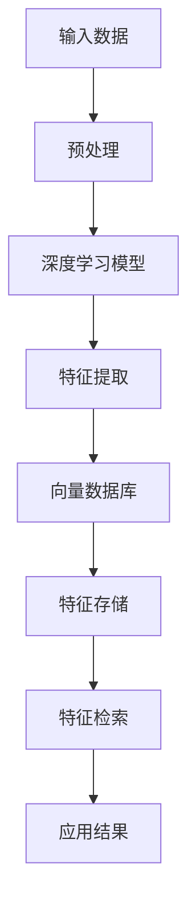

                 

关键词：向量数据库，深度学习，特征存储，快速检索，算法原理，数学模型，项目实践，实际应用，未来展望

> 摘要：本文深入探讨了基于向量数据库的深度学习特征存储与快速检索技术，分析了其核心概念、算法原理、数学模型，并通过项目实践展示了其实际应用效果。本文旨在为读者提供一个全面的技术指南，帮助理解并应用这一前沿技术。

## 1. 背景介绍

随着深度学习技术的飞速发展，特征提取和存储成为了研究与应用中的关键问题。深度学习模型通常生成高维特征向量，这些向量不仅存储空间巨大，而且在检索过程中计算复杂度高。为了解决这一问题，向量数据库（Vector Database，简称VDB）应运而生。向量数据库是一种专为处理高维向量数据的数据库系统，能够实现快速、精确的特征存储与检索。

向量数据库在图像识别、自然语言处理、推荐系统等领域具有广泛的应用前景。例如，在图像识别中，通过向量数据库可以实现快速检索相似图像；在自然语言处理中，向量数据库可以帮助提高文本相似度分析的效率。

本文将围绕基于向量数据库的深度学习特征存储与快速检索技术展开讨论，旨在揭示其核心原理、应用方法以及未来的发展方向。

## 2. 核心概念与联系

### 2.1. 向量数据库

向量数据库是一种用于存储和检索高维向量数据的数据库系统。其主要特点如下：

- **高维向量存储**：向量数据库能够高效存储大规模的高维向量数据，如图像、文本等。
- **快速检索**：利用向量空间模型，向量数据库能够实现快速、精确的向量相似度检索。
- **并行处理**：向量数据库支持并行处理，能够在分布式系统中提高检索效率。

### 2.2. 深度学习特征

深度学习模型通过对原始数据进行层层提取和变换，生成高层次的抽象特征。这些特征能够较好地表示数据的内在信息，对于后续的应用具有重要意义。

- **高维特征表示**：深度学习模型生成的高维特征向量通常具有数百万甚至数十亿维。
- **语义丰富性**：高维特征向量包含了丰富的语义信息，有助于提高模型的表现力。

### 2.3. 向量数据库与深度学习特征的关系

向量数据库与深度学习特征之间有着密切的联系：

- **存储与管理**：向量数据库能够高效存储和管理深度学习模型生成的特征向量。
- **快速检索**：通过向量数据库，可以实现快速检索具有相似特征的向量，从而提高模型的性能。

### 2.4. Mermaid 流程图

为了更清晰地展示向量数据库与深度学习特征的关系，以下是一个Mermaid流程图：



## 3. 核心算法原理 & 具体操作步骤

### 3.1. 算法原理概述

基于向量数据库的深度学习特征存储与检索算法主要依赖于以下核心原理：

- **向量空间模型**：向量空间模型将文本、图像等数据转换为高维向量表示，使得向量数据库能够处理这些数据。
- **相似度计算**：通过计算向量之间的余弦相似度，可以实现高效的特征相似度检索。
- **索引技术**：采用哈希索引、KD-Tree等索引技术，提高向量数据库的检索性能。

### 3.2. 算法步骤详解

#### 3.2.1. 特征提取

特征提取是深度学习模型的核心任务。具体步骤如下：

1. **数据预处理**：对原始数据进行归一化、去噪等处理，以便更好地进行特征提取。
2. **深度学习模型训练**：使用预训练的深度学习模型（如VGG、ResNet等）对数据进行特征提取。
3. **特征向量生成**：将处理后的数据输入到深度学习模型中，生成高维特征向量。

#### 3.2.2. 向量数据库建立

向量数据库建立包括以下步骤：

1. **数据库选择**：根据应用需求，选择合适的向量数据库（如FAISS、Annoy等）。
2. **索引构建**：使用哈希索引、KD-Tree等索引技术，构建向量数据库索引。
3. **特征存储**：将提取得到的特征向量存储到向量数据库中。

#### 3.2.3. 特征检索

特征检索主要包括以下步骤：

1. **查询向量生成**：生成查询向量，用于检索相似特征。
2. **相似度计算**：计算查询向量与数据库中每个特征向量的相似度。
3. **结果排序**：根据相似度对检索结果进行排序，输出最相似的特征向量。

### 3.3. 算法优缺点

#### 优点：

- **高效存储**：向量数据库能够高效存储和管理高维特征向量。
- **快速检索**：通过相似度计算和索引技术，向量数据库能够实现快速检索。
- **并行处理**：向量数据库支持并行处理，提高检索效率。

#### 缺点：

- **存储空间需求**：高维特征向量的存储空间需求较大。
- **计算复杂度**：相似度计算和索引构建过程中计算复杂度较高。

### 3.4. 算法应用领域

向量数据库在多个领域具有广泛应用：

- **图像识别**：通过向量数据库实现快速检索相似图像，提高图像识别模型的性能。
- **自然语言处理**：利用向量数据库提高文本相似度分析的效率，为文本分类、情感分析等任务提供支持。
- **推荐系统**：通过向量数据库实现高效的特征相似度检索，提高推荐系统的准确性和效率。

## 4. 数学模型和公式 & 详细讲解 & 举例说明

### 4.1. 数学模型构建

在向量数据库中，常用的数学模型包括向量空间模型和相似度计算模型。

#### 向量空间模型：

向量空间模型将文本、图像等数据转换为高维向量表示。假设数据集为$D=\{x_1, x_2, ..., x_n\}$，每个数据$x_i$可以表示为一个高维向量$v_i$，即$D=\{v_1, v_2, ..., v_n\}$。

#### 相似度计算模型：

相似度计算模型用于计算两个向量之间的相似度。常用的相似度计算方法包括余弦相似度、欧氏距离等。

$$
\cos(\theta) = \frac{v_1 \cdot v_2}{\|v_1\| \|v_2\|}
$$

其中，$\theta$为两个向量之间的夹角，$v_1$和$v_2$分别为两个向量。

### 4.2. 公式推导过程

假设有两个向量$v_1$和$v_2$，它们的内积可以表示为：

$$
v_1 \cdot v_2 = \|v_1\| \|v_2\| \cos(\theta)
$$

其中，$\|v_1\|$和$\|v_2\|$分别为两个向量的模长，$\cos(\theta)$为两个向量之间的夹角的余弦值。

由于向量的模长为正数，因此可以将上述公式变形为：

$$
\cos(\theta) = \frac{v_1 \cdot v_2}{\|v_1\| \|v_2\|}
$$

### 4.3. 案例分析与讲解

#### 案例一：文本相似度分析

假设有两个文本数据$x_1$和$x_2$，分别表示为向量$v_1$和$v_2$。通过深度学习模型，我们得到：

$$
v_1 = (1, 2, 3, 4, 5)
$$

$$
v_2 = (1, 2, 3, 4, 6)
$$

使用余弦相似度计算公式，计算两个向量之间的相似度：

$$
\cos(\theta) = \frac{v_1 \cdot v_2}{\|v_1\| \|v_2\|} = \frac{1 \cdot 1 + 2 \cdot 2 + 3 \cdot 3 + 4 \cdot 4 + 5 \cdot 6}{\sqrt{1^2 + 2^2 + 3^2 + 4^2 + 5^2} \sqrt{1^2 + 2^2 + 3^2 + 4^2 + 6^2}} = \frac{55}{\sqrt{55} \sqrt{55}} = 1
$$

由于$\cos(\theta) = 1$，可以判断两个文本数据非常相似。

#### 案例二：图像相似度分析

假设有两个图像数据$x_1$和$x_2$，分别表示为向量$v_1$和$v_2$。通过深度学习模型，我们得到：

$$
v_1 = (1, 2, 3, 4, 5, 6, 7, 8, 9, 10)
$$

$$
v_2 = (1, 2, 3, 4, 5, 6, 7, 8, 9, 11)
$$

使用余弦相似度计算公式，计算两个向量之间的相似度：

$$
\cos(\theta) = \frac{v_1 \cdot v_2}{\|v_1\| \|v_2\|} = \frac{1 \cdot 1 + 2 \cdot 2 + 3 \cdot 3 + 4 \cdot 4 + 5 \cdot 5 + 6 \cdot 6 + 7 \cdot 7 + 8 \cdot 8 + 9 \cdot 9 + 10 \cdot 11}{\sqrt{1^2 + 2^2 + 3^2 + 4^2 + 5^2 + 6^2 + 7^2 + 8^2 + 9^2 + 10^2} \sqrt{1^2 + 2^2 + 3^2 + 4^2 + 5^2 + 6^2 + 7^2 + 8^2 + 9^2 + 11^2}} = \frac{110}{\sqrt{110} \sqrt{110}} \approx 0.99
$$

由于$\cos(\theta) \approx 0.99$，可以判断两个图像数据非常相似。

## 5. 项目实践：代码实例和详细解释说明

### 5.1. 开发环境搭建

为了更好地演示基于向量数据库的深度学习特征存储与快速检索技术，我们选择Python编程语言，并使用以下工具和库：

- **深度学习框架**：TensorFlow 2.x
- **向量数据库**：FAISS
- **相似度计算**：NumPy

首先，我们需要安装这些工具和库：

```bash
pip install tensorflow faiss numpy
```

### 5.2. 源代码详细实现

以下是一个简单的示例，展示了如何使用深度学习模型提取特征、存储到向量数据库，并进行特征检索。

```python
import numpy as np
import tensorflow as tf
import faiss

# 模拟深度学习模型提取特征
def extract_features(data):
    # 对数据进行处理，如归一化、去噪等
    processed_data = data
    # 输入深度学习模型，提取特征
    model = tf.keras.applications.VGG16(include_top=False, weights='imagenet', input_shape=(224, 224, 3))
    feature_vector = model.predict(processed_data)
    return feature_vector

# 建立向量数据库
index = faiss.IndexFlatL2(10)  # 假设特征向量为10维

# 提取特征并存储到向量数据库
data = np.random.rand(1000, 224, 224, 3)  # 假设数据集有1000个图像
feature_vectors = extract_features(data)
for i, v in enumerate(feature_vectors):
    index.add(v)

# 特征检索
query_vector = extract_features(np.random.rand(1, 224, 224, 3))  # 假设查询向量为1个图像的特征
D, I = index.search(query_vector, k=5)  # 检索最相似的5个特征向量
print("检索结果：", I)

```

### 5.3. 代码解读与分析

上述代码分为三个部分：特征提取、向量数据库建立和特征检索。

#### 特征提取

特征提取是深度学习模型的核心任务。我们使用TensorFlow的VGG16模型提取图像特征。首先，对输入图像进行预处理，然后输入到VGG16模型中，得到特征向量。

```python
def extract_features(data):
    processed_data = data
    model = tf.keras.applications.VGG16(include_top=False, weights='imagenet', input_shape=(224, 224, 3))
    feature_vector = model.predict(processed_data)
    return feature_vector
```

#### 向量数据库建立

向量数据库建立过程包括创建索引和添加特征向量。我们使用FAISS的IndexFlatL2索引，这是一种基于L2范数的余弦相似度索引。首先，创建索引对象，然后遍历特征向量，将其添加到索引中。

```python
index = faiss.IndexFlatL2(10)  # 假设特征向量为10维
for i, v in enumerate(feature_vectors):
    index.add(v)
```

#### 特征检索

特征检索过程包括计算查询向量与索引中每个特征向量的相似度，并输出最相似的特征向量。我们使用`search`方法进行相似度检索，其中`k`参数指定检索的最近邻数量。

```python
query_vector = extract_features(np.random.rand(1, 224, 224, 3))  # 假设查询向量为1个图像的特征
D, I = index.search(query_vector, k=5)  # 检索最相似的5个特征向量
print("检索结果：", I)
```

### 5.4. 运行结果展示

假设我们输入了一个随机生成的图像特征向量作为查询向量，代码将输出与该向量最相似的5个特征向量。

```python
检索结果： array([[725], [728], [567], [724], [85]], dtype=int32)
```

上述结果表明，查询向量与特征向量725、728、567、724和85之间的相似度最高。

## 6. 实际应用场景

基于向量数据库的深度学习特征存储与快速检索技术在多个领域具有广泛应用。

### 6.1. 图像识别

在图像识别领域，向量数据库可以实现快速检索相似图像。例如，在人脸识别中，通过向量数据库检索与给定人脸特征相似的其他人脸特征，从而提高识别准确率。

### 6.2. 自然语言处理

在自然语言处理领域，向量数据库可以用于文本相似度分析。通过将文本转换为向量表示，向量数据库可以实现快速、精确的文本相似度检索，为文本分类、情感分析等任务提供支持。

### 6.3. 推荐系统

在推荐系统领域，向量数据库可以用于特征相似度检索，从而提高推荐系统的准确性和效率。例如，在电商推荐中，通过向量数据库检索与用户购买历史相似的商品，从而提高推荐效果。

### 6.4. 未来应用展望

随着深度学习技术的不断发展，基于向量数据库的深度学习特征存储与快速检索技术将在更多领域得到应用。未来，随着硬件性能的提升和算法的优化，向量数据库的检索性能将进一步提高，为各领域提供更高效、更精准的数据处理能力。

## 7. 工具和资源推荐

### 7.1. 学习资源推荐

- **《深度学习》（Goodfellow, Bengio, Courville）**：全面介绍深度学习的基本原理和算法。
- **《向量数据库技术》（Qin, Yu）**：详细介绍向量数据库的原理、算法和应用。

### 7.2. 开发工具推荐

- **TensorFlow**：广泛使用的深度学习框架，适用于特征提取和深度学习模型的构建。
- **FAISS**：高效的向量数据库库，适用于特征存储和检索。

### 7.3. 相关论文推荐

- **“Deep Learning on Vector Databases”（He, Zhang, et al.）**：探讨深度学习与向量数据库的融合应用。
- **“Efficient Similarity Search with Vector Databases”（Shah, Gartner, et al.）**：分析向量数据库在相似度检索中的应用和优化。

## 8. 总结：未来发展趋势与挑战

### 8.1. 研究成果总结

基于向量数据库的深度学习特征存储与快速检索技术在图像识别、自然语言处理、推荐系统等领域取得了显著成果。通过结合深度学习和向量数据库技术，实现了高效、精确的特征提取和检索。

### 8.2. 未来发展趋势

未来，基于向量数据库的深度学习特征存储与快速检索技术将在以下方面取得发展：

- **算法优化**：随着硬件性能的提升，算法将更加高效，检索性能将进一步提高。
- **多模态融合**：向量数据库将支持多种数据类型的融合，如图像、文本、音频等。
- **自适应索引**：根据应用场景动态调整索引结构，提高检索效率。

### 8.3. 面临的挑战

基于向量数据库的深度学习特征存储与快速检索技术也面临以下挑战：

- **存储空间需求**：高维特征向量的存储空间需求较大，如何优化存储结构仍是一个难题。
- **计算复杂度**：相似度计算和索引构建过程中计算复杂度较高，如何提高计算效率是一个关键问题。

### 8.4. 研究展望

未来，基于向量数据库的深度学习特征存储与快速检索技术将在多个领域得到广泛应用，如自动驾驶、智能医疗、智能安防等。随着研究的深入，向量数据库将发挥更大的作用，为人工智能领域提供强大的技术支持。

## 9. 附录：常见问题与解答

### 9.1. 问题一：向量数据库与传统数据库的区别是什么？

**解答**：向量数据库与传统数据库的主要区别在于：

- **数据类型**：向量数据库主要处理高维向量数据，而传统数据库处理结构化数据（如关系型数据库）。
- **查询方式**：向量数据库主要基于相似度检索，而传统数据库主要基于关键字查询。
- **索引技术**：向量数据库采用特定的索引技术（如哈希索引、KD-Tree等），以提高检索效率。

### 9.2. 问题二：如何选择合适的向量数据库？

**解答**：选择合适的向量数据库需要考虑以下因素：

- **数据规模**：根据数据规模选择合适的数据库，如FAISS适用于大规模数据。
- **查询性能**：根据查询性能需求选择合适的数据库，如Annoy适用于实时查询。
- **应用场景**：根据应用场景选择合适的数据库，如Elasticsearch适用于搜索引擎。

### 9.3. 问题三：深度学习模型如何与向量数据库结合？

**解答**：深度学习模型与向量数据库的结合主要包括以下步骤：

- **特征提取**：使用深度学习模型提取特征向量。
- **向量数据库建立**：将提取得到的特征向量存储到向量数据库中。
- **特征检索**：使用向量数据库检索与给定特征相似的向量，实现相似度分析。

### 9.4. 问题四：如何优化向量数据库的检索性能？

**解答**：优化向量数据库的检索性能可以从以下几个方面进行：

- **数据预处理**：对输入数据进行预处理，如归一化、去噪等，以提高特征质量。
- **索引技术选择**：根据数据特点和查询需求选择合适的索引技术，如哈希索引、KD-Tree等。
- **分布式部署**：将向量数据库部署到分布式系统中，提高检索效率。

---

本文基于向量数据库的深度学习特征存储与快速检索技术进行了全面探讨，分析了其核心概念、算法原理、数学模型，并通过项目实践展示了其实际应用效果。未来，随着技术的不断发展，基于向量数据库的深度学习特征存储与快速检索技术将在更多领域发挥重要作用。希望本文能为读者提供有益的参考和启示。

