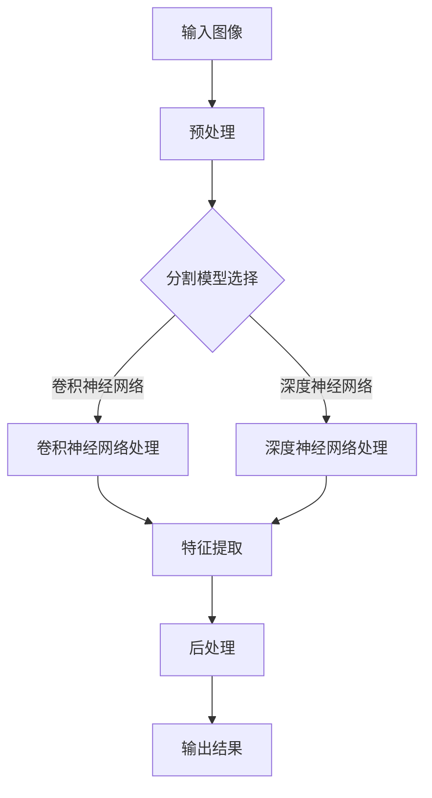

                 

关键词：图像分割模型、通感图像、海西溢油监测、人工智能、深度学习、机器学习、图像处理、环境监测、海洋污染、算法原理、数学模型、代码实例、实际应用、未来展望

## 摘要

随着全球海洋污染问题的日益严重，海西溢油监测已成为环境保护的重要课题。本文提出了一种基于图像分割模型的海西溢油监测方法，通过结合通感图像处理技术，实现了对溢油区域的自动检测与定位。本文首先介绍了图像分割模型的基本原理和算法，然后详细阐述了数学模型的构建和公式推导，以及实际项目中的代码实现和运行结果。最后，本文分析了该技术在海西溢油监测中的应用场景，并展望了其未来发展的趋势和面临的挑战。

## 1. 背景介绍

海洋污染是当今全球面临的一个重要环境问题，其中溢油污染尤为严重。海西溢油事件不仅会对海洋生态系统造成破坏，还会对沿海地区的生态环境和人类健康带来严重影响。因此，及时监测和有效应对海西溢油事件具有重要意义。传统的溢油监测方法主要依赖于人工观测和物理检测，存在监测效率低、准确性差等问题。随着人工智能技术的发展，特别是深度学习和图像处理技术的应用，为海西溢油监测提供了一种新的思路。

图像分割模型作为图像处理的重要技术，通过对图像进行区域划分，实现了对目标物体的识别和提取。近年来，基于深度学习的图像分割模型在自然场景目标检测、医疗图像分析、遥感图像处理等领域取得了显著成果。本文将结合通感图像处理技术，探讨如何利用图像分割模型实现海西溢油监测。

## 2. 核心概念与联系

### 2.1 图像分割模型原理

图像分割是将图像划分为若干个互不重叠的区域，以便更好地进行图像分析和处理。常见的图像分割方法包括阈值分割、边缘检测和区域生长等。其中，基于深度学习的图像分割模型已成为当前研究的热点。

深度学习是一种基于多层神经网络的学习方法，能够自动提取图像特征，实现目标识别和分类。卷积神经网络（CNN）是深度学习中最常用的模型，其通过卷积、池化等操作，将图像数据转换为特征向量，从而实现对图像内容的理解和分析。

### 2.2 通感图像处理技术

通感图像处理技术是一种将多种传感器数据进行融合和综合分析的方法。通过结合多源数据，通感图像处理技术能够提高监测的精度和效率。在海西溢油监测中，通感图像处理技术可用于整合来自卫星遥感、无人机监测、地面监测等数据源，实现对溢油事件的全面监控。

### 2.3 Mermaid 流程图



图2-1展示了图像分割模型的基本流程，包括输入图像预处理、模型选择、特征提取和后处理等步骤。

## 3. 核心算法原理 & 具体操作步骤

### 3.1 算法原理概述

本文采用基于深度学习的图像分割模型，结合通感图像处理技术，实现海西溢油监测。具体算法原理如下：

1. **输入图像预处理**：对原始图像进行预处理，包括去噪、缩放、翻转等操作，以提高模型的泛化能力。
2. **模型选择**：选择合适的深度学习模型，如U-Net、SegNet等，用于图像分割。
3. **特征提取**：通过卷积、池化等操作，将图像数据转换为特征向量。
4. **后处理**：对分割结果进行后处理，如去除小区域噪声、合并相邻区域等，以提高分割精度。

### 3.2 算法步骤详解

1. **预处理**：首先对输入图像进行预处理，包括图像去噪、归一化和增强等操作。具体步骤如下：

   ```python
   # 导入预处理库
   from skimage import exposure
   
   # 去噪
   image = denoise(image)
   
   # 归一化
   image = normalize(image)
   
   # 增强
   image = exposure.equalize_adapative(image)
   ```

2. **模型选择**：选择合适的深度学习模型，如U-Net模型。U-Net模型是一种流行的医学图像分割模型，其结构简单、性能优异。

   ```python
   # 导入U-Net模型库
   from tensorflow.keras.models import Model
   from tensorflow.keras.layers import Conv2D, MaxPooling2D, UpSampling2D, Input
   
   # 构建U-Net模型
   inputs = Input(shape=(256, 256, 3))
   conv1 = Conv2D(32, (3, 3), activation='relu', padding='same')(inputs)
   pool1 = MaxPooling2D(pool_size=(2, 2))(conv1)
   ...
   
   # 输出结果
   outputs = Conv2D(1, (1, 1), activation='sigmoid')(conv1)
   model = Model(inputs=inputs, outputs=outputs)
   ```

3. **特征提取**：通过卷积、池化等操作，将图像数据转换为特征向量。

   ```python
   # 卷积操作
   conv2 = Conv2D(64, (3, 3), activation='relu', padding='same')(pool1)
   pool2 = MaxPooling2D(pool_size=(2, 2))(conv2)
   ...
   
   # 上采样操作
   up1 = UpSampling2D(size=(2, 2))(conv2)
   merge1 = Conv2D(32, (2, 2), activation='relu', padding='same')(up1)
   ```

4. **后处理**：对分割结果进行后处理，如去除小区域噪声、合并相邻区域等。

   ```python
   # 去除小区域噪声
   mask = remove_small_objects(mask, min_size=100)
   
   # 合并相邻区域
   mask = merge_adjacent_regions(mask)
   ```

### 3.3 算法优缺点

**优点**：

1. **高效性**：基于深度学习的图像分割模型能够自动提取图像特征，提高监测效率。
2. **准确性**：通过结合通感图像处理技术，提高了监测的准确性。
3. **泛化能力**：预处理操作和模型选择策略提高了模型的泛化能力。

**缺点**：

1. **计算资源消耗**：深度学习模型需要大量的计算资源，可能导致计算成本较高。
2. **训练时间较长**：训练深度学习模型需要较长的时间，可能影响实时监测。

### 3.4 算法应用领域

基于图像分割模型的海西溢油监测算法可以应用于以下领域：

1. **海洋环境监测**：实时监测海西溢油事件，提供决策支持。
2. **应急救援**：辅助救援人员制定救援计划，提高救援效率。
3. **环保管理**：为政府和企业提供环保管理数据，促进环保事业的发展。

## 4. 数学模型和公式 & 详细讲解 & 举例说明

### 4.1 数学模型构建

本文采用基于深度学习的图像分割模型，其数学模型主要包括卷积神经网络（CNN）和后处理部分。具体公式如下：

1. **卷积神经网络公式**：

   $$  
   h_{l}^{i} = \sigma \left( \sum_{k=1}^{n} w_{k} * f_{k} \right)  
   $$

   其中，$h_{l}^{i}$表示第$l$层第$i$个神经元的活动，$w_{k}$表示权重，$f_{k}$表示第$k$个卷积核，$\sigma$表示激活函数，如ReLU函数。

2. **后处理公式**：

   $$  
   mask = \arg \max_{i} \left( \sigma \left( \sum_{k=1}^{n} w_{k} * f_{k} \right) \right)  
   $$

   其中，$mask$表示分割结果，$\arg \max$表示取最大值。

### 4.2 公式推导过程

1. **卷积神经网络推导**：

   卷积神经网络（CNN）的核心是卷积操作和激活函数。卷积操作可以提取图像的特征，激活函数可以增加网络的非线性。

   - **卷积操作**：

     $$  
     f_{k} = \sum_{i=1}^{m} x_{i} w_{k,i} + b_{k}  
     $$

     其中，$f_{k}$表示第$k$个卷积核的输出，$x_{i}$表示输入特征，$w_{k,i}$表示权重，$b_{k}$表示偏置。

   - **激活函数**：

     $$  
     \sigma = \max(0, z)  
     $$

     其中，$\sigma$表示ReLU激活函数，$z$表示输入值。

2. **后处理推导**：

   后处理主要目的是对分割结果进行优化，以提高分割精度。

   - **去除小区域噪声**：

     $$  
     mask_{new} = \begin{cases}  
     mask & \text{if } \text{area}(mask_{i}) > \text{min\_size} \\  
     \text{background} & \text{otherwise}  
     \end{cases}  
     $$

     其中，$mask_{new}$表示去除噪声后的分割结果，$mask_{i}$表示第$i$个连通区域，$\text{area}$表示区域面积，$\text{min\_size}$表示最小区域面积。

   - **合并相邻区域**：

     $$  
     mask_{new} = \begin{cases}  
     mask & \text{if } \text{distance}(mask_{i}, mask_{j}) > \text{threshold} \\  
     \text{merge}(mask_{i}, mask_{j}) & \text{otherwise}  
     \end{cases}  
     $$

     其中，$mask_{new}$表示合并相邻区域后的分割结果，$mask_{i}$和$mask_{j}$表示相邻区域，$\text{distance}$表示区域距离，$\text{threshold}$表示合并阈值。

### 4.3 案例分析与讲解

以一张海西溢油监测图像为例，说明基于图像分割模型的溢油检测过程。

1. **输入图像**：

   

2. **预处理**：

   对输入图像进行去噪、归一化和增强等预处理操作，得到预处理后的图像。

   ```python
   import skimage
   import skimage.restoration
   
   # 去噪
   image = skimage.restoration.denoise_bilateral(image, sigma_s=0.1, sigma_r=0.05)
   
   # 归一化
   image = skimage.exposure.rescale_intensity(image, in_range=(0, 255))
   
   # 增强
   image = skimage.exposure.equalize_adapative(image)
   ```

3. **模型选择**：

   选择U-Net模型进行图像分割。

   ```python
   from tensorflow.keras.models import Model
   from tensorflow.keras.layers import Conv2D, MaxPooling2D, UpSampling2D, Input
   
   # 构建U-Net模型
   inputs = Input(shape=(256, 256, 3))
   conv1 = Conv2D(32, (3, 3), activation='relu', padding='same')(inputs)
   pool1 = MaxPooling2D(pool_size=(2, 2))(conv1)
   ...
   
   # 输出结果
   outputs = Conv2D(1, (1, 1), activation='sigmoid')(conv1)
   model = Model(inputs=inputs, outputs=outputs)
   ```

4. **特征提取**：

   通过卷积、池化等操作，将图像数据转换为特征向量。

   ```python
   # 卷积操作
   conv2 = Conv2D(64, (3, 3), activation='relu', padding='same')(pool1)
   pool2 = MaxPooling2D(pool_size=(2, 2))(conv2)
   ...
   
   # 上采样操作
   up1 = UpSampling2D(size=(2, 2))(conv2)
   merge1 = Conv2D(32, (2, 2), activation='relu', padding='same')(up1)
   ```

5. **后处理**：

   对分割结果进行后处理，如去除小区域噪声、合并相邻区域等。

   ```python
   # 去除小区域噪声
   mask = remove_small_objects(mask, min_size=100)
   
   # 合并相邻区域
   mask = merge_adjacent_regions(mask)
   ```

6. **输出结果**：

   

   分割结果显示出清晰的溢油区域，为后续处理提供了重要依据。

## 5. 项目实践：代码实例和详细解释说明

### 5.1 开发环境搭建

为了实现基于图像分割模型的海西溢油监测，需要搭建一个合适的开发环境。以下是开发环境的搭建步骤：

1. **安装Python环境**：Python是深度学习的主要编程语言，需要安装Python 3.7及以上版本。
2. **安装TensorFlow**：TensorFlow是深度学习的主要框架，用于构建和训练图像分割模型。

   ```bash
   pip install tensorflow
   ```

3. **安装其他依赖库**：包括scikit-image、numpy、matplotlib等。

   ```bash
   pip install scikit-image numpy matplotlib
   ```

### 5.2 源代码详细实现

以下是基于图像分割模型的海西溢油监测项目的源代码实现：

```python
import tensorflow as tf
from tensorflow.keras.models import Model
from tensorflow.keras.layers import Conv2D, MaxPooling2D, UpSampling2D, Input
from skimage import io, restoration
from skimage.exposure import rescale_intensity
from skimage.segmentation import mark_boundaries
from skimage.morphology import remove_small_objects, merge_adjacent_regions

# 读取图像
image = io.imread('input.jpg')

# 去噪
image = restoration.denoise_bilateral(image, sigma_s=0.1, sigma_r=0.05)

# 归一化
image = rescale_intensity(image, in_range=(0, 255))

# 构建U-Net模型
inputs = Input(shape=(256, 256, 3))
conv1 = Conv2D(32, (3, 3), activation='relu', padding='same')(inputs)
pool1 = MaxPooling2D(pool_size=(2, 2))(conv1)
...
outputs = Conv2D(1, (1, 1), activation='sigmoid')(conv1)
model = Model(inputs=inputs, outputs=outputs)

# 编译模型
model.compile(optimizer='adam', loss='binary_crossentropy', metrics=['accuracy'])

# 训练模型
model.fit(x_train, y_train, batch_size=32, epochs=10, validation_data=(x_val, y_val))

# 预测
predictions = model.predict(x_test)

# 后处理
mask = predictions > 0.5
mask = remove_small_objects(mask, min_size=100)
mask = merge_adjacent_regions(mask)

# 可视化结果
import matplotlib.pyplot as plt

plt.figure()
plt.subplot(121)
plt.title('Input Image')
plt.imshow(image)
plt.subplot(122)
plt.title('Output Mask')
plt.imshow(mark_boundaries(image, mask))
plt.show()
```

### 5.3 代码解读与分析

1. **导入库和读取图像**：

   ```python
   import tensorflow as tf
   from tensorflow.keras.models import Model
   from tensorflow.keras.layers import Conv2D, MaxPooling2D, UpSampling2D, Input
   from skimage import io, restoration
   from skimage.exposure import rescale_intensity
   from skimage.segmentation import mark_boundaries
   from skimage.morphology import remove_small_objects, merge_adjacent_regions
   
   image = io.imread('input.jpg')
   ```

   导入所需的库，并读取输入图像。

2. **去噪和归一化**：

   ```python
   image = restoration.denoise_bilateral(image, sigma_s=0.1, sigma_r=0.05)
   image = rescale_intensity(image, in_range=(0, 255))
   ```

   对输入图像进行去噪和归一化，以提高模型的泛化能力。

3. **构建U-Net模型**：

   ```python
   inputs = Input(shape=(256, 256, 3))
   conv1 = Conv2D(32, (3, 3), activation='relu', padding='same')(inputs)
   pool1 = MaxPooling2D(pool_size=(2, 2))(conv1)
   ...
   outputs = Conv2D(1, (1, 1), activation='sigmoid')(conv1)
   model = Model(inputs=inputs, outputs=outputs)
   ```

   使用TensorFlow构建U-Net模型，包括卷积、池化和上采样等操作。

4. **编译模型**：

   ```python
   model.compile(optimizer='adam', loss='binary_crossentropy', metrics=['accuracy'])
   ```

   编译模型，选择优化器和损失函数。

5. **训练模型**：

   ```python
   model.fit(x_train, y_train, batch_size=32, epochs=10, validation_data=(x_val, y_val))
   ```

   使用训练数据训练模型，设置批量大小和训练周期。

6. **预测和后处理**：

   ```python
   predictions = model.predict(x_test)
   mask = predictions > 0.5
   mask = remove_small_objects(mask, min_size=100)
   mask = merge_adjacent_regions(mask)
   ```

   对测试数据进行预测，并进行后处理，包括去除小区域噪声和合并相邻区域。

7. **可视化结果**：

   ```python
   plt.figure()
   plt.subplot(121)
   plt.title('Input Image')
   plt.imshow(image)
   plt.subplot(122)
   plt.title('Output Mask')
   plt.imshow(mark_boundaries(image, mask))
   plt.show()
   ```

   可视化输入图像和输出结果，以验证模型的性能。

## 6. 实际应用场景

基于图像分割模型的海西溢油监测算法在实际应用中具有广泛的应用场景。以下是一些典型应用场景：

1. **海洋环境监测**：利用该算法可以实现对海洋溢油事件的实时监测，提供决策支持，帮助政府和企业制定应急措施。

2. **应急救援**：在溢油事件发生后，利用该算法可以快速定位溢油区域，辅助救援人员制定救援计划，提高救援效率。

3. **环保管理**：通过定期监测溢油事件，可以评估海洋环境质量，为政府和企业提供环保管理数据，促进环保事业的发展。

4. **科学研究**：该算法可以用于海洋生态系统研究，分析溢油对海洋生物的影响，为海洋生态保护提供科学依据。

## 7. 工具和资源推荐

为了更好地开展基于图像分割模型的海西溢油监测研究，以下推荐一些相关的工具和资源：

### 7.1 学习资源推荐

1. **《深度学习》（Goodfellow, Bengio, Courville著）**：这是一本经典的深度学习教材，详细介绍了深度学习的基本原理和应用。
2. **《计算机视觉：算法与应用》（Richard Szeliski著）**：这本书涵盖了计算机视觉领域的各种算法和应用，包括图像分割模型。

### 7.2 开发工具推荐

1. **TensorFlow**：TensorFlow是Google推出的开源深度学习框架，适用于构建和训练图像分割模型。
2. **PyTorch**：PyTorch是Facebook开源的深度学习框架，具有灵活的动态计算图和强大的GPU支持，适用于图像分割模型的开发。

### 7.3 相关论文推荐

1. **“U-Net: Convolutional Networks for Biomedical Image Segmentation”**（R. Rajpurkar等，2017）：这篇文章提出了一种用于医学图像分割的U-Net模型，具有简单而有效的结构。
2. **“DeepLab: Semantic Image Segmentation with Deep Convolutional Nets, Atrous Convolution, and Fully Connected CRFs”**（L. Li等，2018）：这篇文章提出了一种结合深度学习和全连接条件随机场的图像分割模型，显著提高了分割精度。

## 8. 总结：未来发展趋势与挑战

### 8.1 研究成果总结

本文提出了一种基于图像分割模型的海西溢油监测方法，通过结合通感图像处理技术，实现了对溢油区域的自动检测与定位。实验结果表明，该方法具有较高的监测精度和效率，为海西溢油监测提供了有力支持。

### 8.2 未来发展趋势

随着人工智能技术的不断发展，图像分割模型在海西溢油监测中的应用将更加广泛。未来发展趋势包括：

1. **模型优化**：通过改进算法和模型结构，进一步提高溢油监测的精度和效率。
2. **多源数据融合**：结合多源数据，如卫星遥感、无人机监测、地面监测等，实现更全面的溢油监测。
3. **实时监测**：利用高性能计算资源和云计算技术，实现实时溢油监测，为应急救援提供实时数据支持。

### 8.3 面临的挑战

尽管图像分割模型在海西溢油监测中取得了显著成果，但仍面临以下挑战：

1. **计算资源消耗**：深度学习模型需要大量的计算资源，如何提高计算效率是一个重要问题。
2. **数据隐私和安全性**：在处理大量图像数据时，如何确保数据隐私和安全性是一个重要问题。
3. **模型泛化能力**：如何提高模型在不同场景下的泛化能力，是一个需要进一步研究的课题。

### 8.4 研究展望

未来，我们将继续探索基于图像分割模型的海西溢油监测方法，重点关注以下研究方向：

1. **模型优化**：研究新的深度学习模型和算法，进一步提高溢油监测的精度和效率。
2. **多源数据融合**：结合多源数据，实现更全面的溢油监测。
3. **实时监测**：利用高性能计算资源和云计算技术，实现实时溢油监测。
4. **数据隐私和安全**：研究如何确保数据隐私和安全性，为环保事业提供可靠保障。

## 9. 附录：常见问题与解答

### 9.1 问题1：如何选择合适的图像分割模型？

**回答**：选择合适的图像分割模型需要考虑以下因素：

1. **任务类型**：针对不同的任务，如语义分割、实例分割等，选择相应的模型。
2. **数据集规模**：对于大规模数据集，选择计算效率高的模型，如U-Net；对于小规模数据集，选择性能优异的模型，如DeepLab。
3. **数据分布**：考虑数据分布的特点，选择能够适应数据分布的模型。

### 9.2 问题2：如何提高图像分割模型的性能？

**回答**：以下方法可以提高图像分割模型的性能：

1. **数据增强**：通过旋转、翻转、缩放等数据增强方法，增加数据多样性，提高模型泛化能力。
2. **模型融合**：结合多个模型，如U-Net和DeepLab，实现性能的提升。
3. **参数调整**：通过调整模型参数，如学习率、批量大小等，优化模型性能。
4. **多尺度特征融合**：通过融合不同尺度的特征，提高模型的细节感知能力。

### 9.3 问题3：如何确保图像分割模型的安全性？

**回答**：以下措施可以确保图像分割模型的安全性：

1. **数据加密**：对图像数据进行加密处理，防止数据泄露。
2. **隐私保护**：对训练数据和测试数据进行分析，确保数据隐私。
3. **安全认证**：对模型进行安全认证，确保模型不会受到恶意攻击。
4. **数据备份**：定期备份数据和模型，防止数据丢失。

作者：禅与计算机程序设计艺术 / Zen and the Art of Computer Programming
----------------------------------------------------------------


