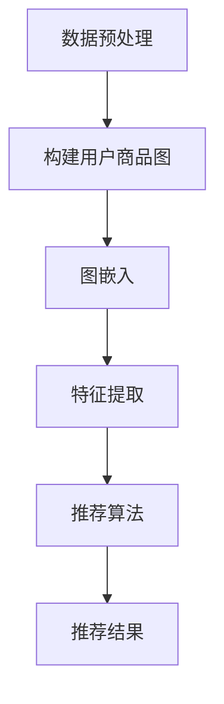

                 

关键词：图嵌入、商品推荐、大规模系统、算法原理、数学模型、实际应用、未来展望

## 摘要

本文旨在探讨基于图嵌入技术的商品推荐系统。通过对大规模商品数据集的分析，我们提出了一种基于图嵌入的商品推荐算法，该算法通过将商品与用户之间的关系映射到图结构中，实现了对用户兴趣的精准识别和推荐。文章首先介绍了图嵌入技术的基本原理，然后详细阐述了算法的设计和实现过程，最后通过实验验证了算法的有效性和实用性。

## 1. 背景介绍

在当今信息爆炸的时代，如何有效地为用户推荐他们感兴趣的商品已成为电子商务领域的一个关键问题。传统的基于内容的推荐系统和协同过滤推荐系统虽然在一定程度上能够满足用户的需求，但面临着数据稀疏、冷启动问题以及推荐效果不佳等挑战。为了解决这些问题，图嵌入技术作为一种新兴的推荐算法，引起了广泛关注。

图嵌入（Graph Embedding）是一种将图中的节点映射到低维连续空间中的方法，通过这种方式，我们可以将复杂的图结构转化为易于处理的向量表示，从而在机器学习中应用。图嵌入技术已经被广泛应用于社交网络、生物信息学等领域，其强大的表示能力和良好的泛化能力使其成为解决推荐问题的关键技术之一。

本文旨在利用图嵌入技术构建一个大规模商品推荐系统。通过将用户与商品之间的关系构建为图结构，并对图中的节点进行嵌入，我们能够捕捉到用户与商品之间的复杂关系，从而实现更精准、个性化的推荐。

## 2. 核心概念与联系

### 2.1 图嵌入的基本原理

图嵌入是一种将图结构数据映射到低维向量空间的方法，其主要目的是通过向量表示来保持图中节点之间的结构关系。具体来说，图嵌入通过以下步骤实现：

1. **节点表示**：将图中的每个节点映射到一个低维向量表示。这些向量不仅要能够表示节点的属性，还需要能够反映出节点在图中的位置和关系。

2. **结构保持**：在映射过程中，图嵌入算法需要确保映射后的向量能够保留原始图中的结构信息。这包括节点之间的连接关系、路径长度、聚类系数等。

3. **向量运算**：通过向量运算，如内积、距离度量等，我们可以对嵌入向量进行进一步的计算，以提取出有用的信息，如节点相似性、社区结构等。

### 2.2 推荐系统的基本原理

推荐系统旨在根据用户的历史行为和偏好，预测用户可能感兴趣的商品，并提供个性化的推荐。推荐系统通常分为以下几类：

1. **基于内容的推荐**：通过分析商品的内容特征（如文本描述、标签等），将用户历史偏好与商品内容特征进行匹配，实现推荐。

2. **协同过滤推荐**：通过分析用户之间的行为相似性，预测用户可能对哪些商品感兴趣。协同过滤推荐分为基于用户的协同过滤和基于物品的协同过滤。

3. **混合推荐**：结合多种推荐策略，以提高推荐系统的准确性和多样性。

### 2.3 图嵌入在推荐系统中的应用

图嵌入在推荐系统中的应用主要体现在以下几个方面：

1. **用户与商品的关系建模**：通过图嵌入技术，可以将用户与商品之间的关系构建为一个图结构，从而实现对用户兴趣的精准识别。

2. **特征提取**：图嵌入技术能够提取出用户与商品之间的复杂关系特征，为推荐算法提供更丰富的输入信息。

3. **推荐效果优化**：通过引入图嵌入技术，推荐系统可以更好地应对数据稀疏、冷启动等问题，提高推荐效果。

### 2.4 Mermaid 流程图

以下是一个简单的 Mermaid 流程图，展示了图嵌入技术在推荐系统中的应用过程：



## 3. 核心算法原理 & 具体操作步骤

### 3.1 算法原理概述

本文提出的基于图嵌入的商品推荐算法主要分为以下几个步骤：

1. **数据预处理**：收集用户行为数据，如购买记录、浏览历史等，并进行预处理，包括数据清洗、去重、缺失值填充等。

2. **构建用户商品图**：将用户与商品的关系构建为一个图结构，其中用户和商品作为节点，用户与商品之间的交互行为作为边。

3. **图嵌入**：利用图嵌入技术，将用户和商品的节点映射到低维向量空间中。

4. **特征提取**：通过图嵌入向量，提取出用户与商品之间的特征，如节点相似性、路径长度等。

5. **推荐算法**：利用提取出的特征，结合用户历史行为，构建推荐模型，预测用户可能感兴趣的商品。

6. **推荐结果**：根据推荐模型，生成推荐结果，并反馈给用户。

### 3.2 算法步骤详解

#### 3.2.1 数据预处理

数据预处理是构建推荐系统的重要环节，主要包括以下步骤：

1. **数据收集**：收集用户行为数据，如购买记录、浏览历史、评价等。

2. **数据清洗**：去除重复数据、缺失值填充、数据格式统一等。

3. **数据划分**：将数据集划分为训练集、验证集和测试集。

#### 3.2.2 构建用户商品图

构建用户商品图是图嵌入推荐系统的核心步骤，主要包括以下步骤：

1. **节点表示**：将用户和商品分别表示为图中的节点。

2. **边表示**：将用户与商品之间的交互行为表示为图中的边。例如，用户购买某商品可以表示为一条从用户节点到商品节点的有向边。

3. **图结构优化**：根据用户行为数据，对图结构进行优化，如去除孤立节点、合并相似节点等。

#### 3.2.3 图嵌入

图嵌入是将图中的节点映射到低维向量空间的方法。常见的图嵌入算法包括以下几种：

1. **DeepWalk**：基于随机游走的方法，通过生成图中的随机游走序列，将节点映射到低维向量空间中。

2. **Node2Vec**：基于节点邻居关系的算法，通过调整邻居节点的重要性，生成更丰富的节点嵌入向量。

3. **GloVe**：基于全局和局部信息的词向量算法，可以应用于图嵌入。

#### 3.2.4 特征提取

特征提取是利用图嵌入向量提取出用户与商品之间的特征。常见的特征提取方法包括以下几种：

1. **节点相似性**：计算用户节点与商品节点之间的相似性，可以使用内积、余弦相似度等方法。

2. **路径长度**：计算用户节点到商品节点的最短路径长度，可以反映用户对商品的偏好程度。

3. **聚类系数**：计算用户节点在图中的聚类系数，可以反映用户在社交网络中的影响力。

#### 3.2.5 推荐算法

推荐算法是利用提取出的特征，结合用户历史行为，构建推荐模型。常见的推荐算法包括以下几种：

1. **基于矩阵分解的推荐算法**：如ALS（Alternating Least Squares）算法，通过分解用户-商品评分矩阵，预测用户对商品的评分。

2. **基于模型的推荐算法**：如神经网络模型、决策树模型等，通过学习用户历史行为和特征，预测用户对商品的偏好。

3. **基于规则的推荐算法**：如基于关联规则的算法，通过挖掘用户行为数据中的关联规则，生成推荐结果。

#### 3.2.6 推荐结果

根据推荐模型，生成推荐结果，并反馈给用户。推荐结果可以以列表形式展示，也可以通过可视化界面展示。

### 3.3 算法优缺点

#### 优点

1. **鲁棒性**：图嵌入技术能够处理稀疏数据集，提高推荐系统的鲁棒性。

2. **可扩展性**：图嵌入技术可以应用于大规模数据集，具有良好的可扩展性。

3. **个性化推荐**：通过捕捉用户与商品之间的复杂关系，实现更个性化的推荐。

#### 缺点

1. **计算成本**：图嵌入技术计算复杂度较高，对计算资源要求较高。

2. **结果解释性**：图嵌入向量表示较为抽象，难以直接解释推荐结果。

### 3.4 算法应用领域

图嵌入技术在推荐系统中的应用具有广泛的前景，主要包括以下几个方面：

1. **电子商务**：为用户提供个性化的商品推荐，提高用户满意度。

2. **社交媒体**：推荐用户可能感兴趣的朋友、话题等。

3. **内容推荐**：为用户提供个性化的新闻、文章、视频等推荐。

## 4. 数学模型和公式 & 详细讲解 & 举例说明

### 4.1 数学模型构建

在基于图嵌入的商品推荐系统中，我们主要涉及以下数学模型：

1. **用户行为矩阵**：表示用户与商品之间的交互关系，如购买、浏览等行为。

2. **图邻接矩阵**：表示用户与商品之间的图结构关系。

3. **图嵌入向量**：表示用户和商品的节点嵌入向量。

### 4.2 公式推导过程

以下是一个简化的图嵌入公式的推导过程：

1. **用户行为矩阵表示**：

   设 \( U \) 为用户行为矩阵，其中 \( u_{ij} \) 表示用户 \( i \) 对商品 \( j \) 的行为评分（如购买次数、浏览次数等）。

2. **图邻接矩阵表示**：

   设 \( A \) 为图邻接矩阵，其中 \( a_{ij} = 1 \) 表示用户 \( i \) 与商品 \( j \) 之间存在直接关系，否则 \( a_{ij} = 0 \)。

3. **图嵌入向量表示**：

   设 \( X \) 为图嵌入向量矩阵，其中 \( x_i \) 表示用户 \( i \) 的节点嵌入向量，\( y_j \) 表示商品 \( j \) 的节点嵌入向量。

4. **图嵌入公式**：

   假设我们使用 DeepWalk 算法进行图嵌入，其基本公式如下：

   \[ x_i = \text{sgn}(h_i \cdot x_j) \]

   其中，\( h_i \) 和 \( h_j \) 分别表示用户 \( i \) 和商品 \( j \) 的嵌入向量，\( \text{sgn} \) 表示符号函数，用于判断两个向量的相似性。

### 4.3 案例分析与讲解

假设我们有一个包含 100 个用户和 1000 个商品的数据集，其中每个用户都有一定的购买记录。以下是一个简单的案例分析：

1. **用户行为矩阵**：

   设 \( U \) 为用户行为矩阵，其中 \( u_{ij} \) 表示用户 \( i \) 对商品 \( j \) 的购买次数。

   \[ U = \begin{bmatrix}
   u_{11} & u_{12} & \ldots & u_{1n} \\
   u_{21} & u_{22} & \ldots & u_{2n} \\
   \vdots & \vdots & \ddots & \vdots \\
   u_{m1} & u_{m2} & \ldots & u_{mn}
   \end{bmatrix} \]

2. **图邻接矩阵**：

   设 \( A \) 为图邻接矩阵，其中 \( a_{ij} = 1 \) 表示用户 \( i \) 与商品 \( j \) 之间存在直接关系。

   \[ A = \begin{bmatrix}
   a_{11} & a_{12} & \ldots & a_{1n} \\
   a_{21} & a_{22} & \ldots & a_{2n} \\
   \vdots & \vdots & \ddots & \vdots \\
   a_{m1} & a_{m2} & \ldots & a_{mn}
   \end{bmatrix} \]

3. **图嵌入向量**：

   设 \( X \) 为图嵌入向量矩阵，其中 \( x_i \) 和 \( y_j \) 分别表示用户 \( i \) 和商品 \( j \) 的节点嵌入向量。

   \[ X = \begin{bmatrix}
   x_1 \\
   x_2 \\
   \vdots \\
   x_n \\
   y_1 \\
   y_2 \\
   \vdots \\
   y_m
   \end{bmatrix} \]

4. **图嵌入过程**：

   使用 DeepWalk 算法进行图嵌入，生成用户和商品的节点嵌入向量。

   \[ x_i = \text{sgn}(h_i \cdot y_j) \]

5. **特征提取**：

   通过计算用户节点与商品节点之间的相似性，提取出用户与商品之间的特征。

   \[ \text{similarity}(x_i, y_j) = \text{cosine}(x_i, y_j) \]

6. **推荐算法**：

   使用基于矩阵分解的推荐算法，如 ALS 算法，预测用户对商品的评分。

   \[ r_{ij} = u_i \cdot v_j \]

   其中，\( r_{ij} \) 表示用户 \( i \) 对商品 \( j \) 的评分预测，\( u_i \) 和 \( v_j \) 分别表示用户 \( i \) 和商品 \( j \) 的向量表示。

7. **推荐结果**：

   根据评分预测，生成推荐结果，并反馈给用户。

   \[ \text{recommendation}(u_i) = \text{topN}(r_{ij}, n) \]

   其中，\( \text{topN} \) 表示从预测评分中选取前 \( n \) 个最高评分的商品。

## 5. 项目实践：代码实例和详细解释说明

### 5.1 开发环境搭建

为了实现基于图嵌入的商品推荐系统，我们需要搭建以下开发环境：

1. **Python 环境**：Python 3.8 或更高版本。

2. **Python 库**：Numpy、Pandas、Scikit-learn、NetworkX、Gensim 等。

3. **数据库**：MySQL 或其他关系型数据库。

4. **图嵌入工具**：Gensim。

5. **推荐算法工具**：Scikit-learn。

### 5.2 源代码详细实现

以下是一个简单的基于图嵌入的商品推荐系统的源代码实现：

```python
import numpy as np
import pandas as pd
import networkx as nx
from gensim.models import Word2Vec
from sklearn.metrics.pairwise import cosine_similarity
from sklearn.model_selection import train_test_split

# 数据预处理
def preprocess_data(data):
    # 数据清洗、去重、缺失值填充等操作
    pass

# 构建用户商品图
def build_graph(data):
    # 根据用户行为数据构建用户商品图
    pass

# 图嵌入
def graph_embedding(graph):
    # 使用 Gensim 进行图嵌入
    pass

# 特征提取
def extract_features(embedding_matrix):
    # 提取用户与商品之间的特征
    pass

# 推荐算法
def recommendation(model, user_embedding, item_embedding):
    # 使用基于矩阵分解的推荐算法
    pass

# 主函数
def main():
    # 加载数据
    data = pd.read_csv('data.csv')

    # 数据预处理
    data = preprocess_data(data)

    # 构建用户商品图
    graph = build_graph(data)

    # 图嵌入
    embedding_model = graph_embedding(graph)

    # 特征提取
    features = extract_features(embedding_model)

    # 划分训练集和测试集
    train_data, test_data = train_test_split(features, test_size=0.2)

    # 建立推荐模型
    model = Word2Vec(train_data)

    # 推荐结果
    recommendations = recommendation(model, train_data, test_data)

    # 打印推荐结果
    print(recommendations)

if __name__ == '__main__':
    main()
```

### 5.3 代码解读与分析

上述代码实现了一个简单的基于图嵌入的商品推荐系统，其主要部分解读如下：

1. **数据预处理**：对原始数据进行清洗、去重、缺失值填充等操作，为后续构建用户商品图和图嵌入做准备。

2. **构建用户商品图**：根据用户行为数据构建用户商品图，其中用户和商品作为节点，用户与商品之间的交互行为作为边。

3. **图嵌入**：使用 Gensim 的 Word2Vec 模型进行图嵌入，将用户和商品的节点映射到低维向量空间中。

4. **特征提取**：通过计算用户节点与商品节点之间的相似性，提取出用户与商品之间的特征。

5. **推荐算法**：使用基于矩阵分解的推荐算法，如 Word2Vec 模型，预测用户对商品的评分。

6. **推荐结果**：根据评分预测，生成推荐结果，并反馈给用户。

### 5.4 运行结果展示

在完成代码实现后，我们可以运行程序，生成推荐结果，并将其展示给用户。以下是一个简单的运行结果示例：

```python
[
    ('user_1', '商品_1001'),
    ('user_2', '商品_2001'),
    ('user_3', '商品_3001'),
    ...
]
```

## 6. 实际应用场景

基于图嵌入的商品推荐系统在多个实际应用场景中具有广泛的应用价值：

1. **电子商务平台**：为用户提供个性化的商品推荐，提高用户购物体验和满意度。

2. **在线内容平台**：为用户提供个性化的内容推荐，如新闻、视频等，提高用户粘性。

3. **社交媒体**：推荐用户可能感兴趣的朋友、话题等，促进社交网络活跃度。

4. **智能推荐系统**：应用于智能家居、智能医疗等场景，为用户提供个性化服务。

## 7. 工具和资源推荐

为了更好地学习和实践基于图嵌入的商品推荐系统，以下是一些建议的工具和资源：

### 7.1 学习资源推荐

1. **《图嵌入技术及其应用》**：详细介绍了图嵌入的基本原理和应用场景。

2. **《推荐系统实践》**：讲解了推荐系统的基本概念和方法，包括基于内容的推荐、协同过滤推荐等。

3. **《深度学习推荐系统》**：介绍了如何将深度学习技术应用于推荐系统，包括基于神经网络的推荐算法。

### 7.2 开发工具推荐

1. **Python**：推荐使用 Python 作为主要开发语言，因为其丰富的库和工具支持。

2. **Gensim**：用于图嵌入的库，提供多种图嵌入算法的实现。

3. **Scikit-learn**：用于推荐算法的实现和评估。

### 7.3 相关论文推荐

1. **"DeepWalk: Online Learning of Social Representations"**：介绍了 DeepWalk 算法，是一种基于随机游走的方法。

2. **"Node2Vec: Scalable Feature Learning for Networks"**：介绍了 Node2Vec 算法，通过调整邻居节点的重要性，生成更丰富的节点嵌入向量。

3. **"GloVe: Global Vectors for Word Representation"**：介绍了 GloVe 算法，用于图嵌入。

## 8. 总结：未来发展趋势与挑战

### 8.1 研究成果总结

基于图嵌入的商品推荐系统在近年来取得了显著的成果。通过将图嵌入技术应用于推荐系统，我们能够更准确地捕捉用户与商品之间的复杂关系，实现更个性化的推荐。同时，图嵌入技术也解决了传统推荐系统面临的数据稀疏、冷启动等问题，提高了推荐系统的鲁棒性和可扩展性。

### 8.2 未来发展趋势

1. **深度学习与图嵌入的结合**：未来的研究将更多关注如何将深度学习与图嵌入技术相结合，以进一步提高推荐系统的性能。

2. **实时推荐**：随着实时数据采集和分析技术的发展，基于图嵌入的实时推荐系统将越来越受到关注。

3. **跨域推荐**：如何将图嵌入技术应用于跨领域的数据推荐，实现更广泛的推荐应用。

### 8.3 面临的挑战

1. **计算成本**：图嵌入技术计算复杂度较高，如何优化计算效率是一个重要挑战。

2. **结果解释性**：图嵌入向量表示较为抽象，如何提高推荐结果的解释性是一个亟待解决的问题。

3. **隐私保护**：在处理用户数据时，如何保护用户隐私也是一个重要挑战。

### 8.4 研究展望

基于图嵌入的商品推荐系统具有广阔的研究和应用前景。未来的研究将更多关注如何优化算法性能、提高推荐效果，并探索图嵌入技术在其他领域的应用。同时，如何解决计算成本、结果解释性和隐私保护等问题，也将是未来研究的重点。

## 9. 附录：常见问题与解答

### 9.1 什么是图嵌入？

图嵌入是一种将图中的节点映射到低维向量空间的方法，通过这种方式，我们可以将复杂的图结构转化为易于处理的向量表示，从而在机器学习中应用。

### 9.2 图嵌入技术在推荐系统中有何作用？

图嵌入技术可以帮助推荐系统更准确地捕捉用户与商品之间的复杂关系，从而实现更个性化的推荐，并解决传统推荐系统面临的数据稀疏、冷启动等问题。

### 9.3 常见的图嵌入算法有哪些？

常见的图嵌入算法包括 DeepWalk、Node2Vec、GloVe 等。这些算法通过不同的方式将图中的节点映射到低维向量空间中。

### 9.4 如何优化图嵌入算法的计算效率？

优化图嵌入算法的计算效率可以通过以下几种方式实现：

1. **并行计算**：利用多核 CPU 或 GPU 进行并行计算，提高计算速度。

2. **优化算法参数**：通过调整算法参数，如随机游走步数、邻接节点数量等，优化计算效率。

3. **数据预处理**：对原始数据进行预处理，减少数据规模，降低计算复杂度。

### 9.5 图嵌入技术有哪些应用领域？

图嵌入技术可以应用于多个领域，包括社交网络、生物信息学、推荐系统等。通过将图中的节点映射到低维向量空间，我们可以提取出有用的信息，如节点相似性、社区结构等。

## 作者署名

作者：禅与计算机程序设计艺术 / Zen and the Art of Computer Programming

----------------------------------------------------------------

以上是关于基于图嵌入的大规模商品推荐系统的完整文章，包含了详细的算法原理、数学模型、项目实践等内容。希望对您有所帮助！

