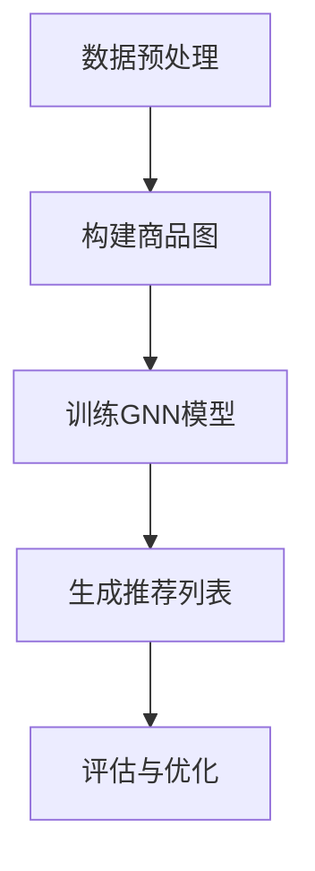

                 

关键词：图神经网络、商品关系、实体关系、数据挖掘、推荐系统、电子商务

摘要：随着电子商务行业的迅猛发展，用户对个性化推荐的需求日益增加。本文将探讨如何利用图神经网络（Graph Neural Networks, GNN）技术挖掘商品之间的潜在关系，以提高推荐系统的准确性和实用性。我们将从背景介绍、核心概念与联系、核心算法原理与操作步骤、数学模型与公式、项目实践、实际应用场景、未来展望以及工具和资源推荐等方面，详细阐述基于图神经网络的商品关系挖掘方法。

## 1. 背景介绍

### 1.1 电子商务行业的发展

电子商务行业在过去几年中取得了显著的发展，在线购物成为人们日常生活的重要组成部分。然而，随着市场上商品种类和数量的不断增加，用户在面对海量信息时往往感到困惑，难以找到符合自己需求的商品。为了解决这一问题，个性化推荐系统成为电子商务企业的重要技术手段。

### 1.2 推荐系统的挑战

尽管现有的推荐系统已经取得了一定的成效，但在实际应用中仍面临着诸多挑战。首先，推荐系统的准确性直接影响用户体验。其次，传统推荐算法往往依赖于用户的历史行为数据，难以捕捉到商品之间的潜在关系。此外，如何处理稀疏数据、噪声数据和冷启动问题也是推荐系统面临的难题。

### 1.3 图神经网络的优势

图神经网络作为一种新兴的深度学习模型，在处理图结构数据方面具有显著优势。通过引入图结构，GNN能够有效捕捉商品之间的关联性，从而提高推荐系统的准确性和实用性。此外，GNN在处理大规模数据集和复杂数据关系方面表现出色，为解决推荐系统的挑战提供了新的思路。

## 2. 核心概念与联系

### 2.1 图神经网络的基本概念

图神经网络是一种基于图结构数据的深度学习模型，通过对图中节点的特征进行建模和融合，实现节点分类、图分类、图生成等任务。GNN的核心思想是利用图中的邻接关系，对节点的特征进行更新和传播。

### 2.2 商品关系与图结构

在电子商务领域，商品可以视为图中的节点，而商品之间的关系则可以表示为图中的边。通过构建商品图，我们可以将商品之间的潜在关系转化为图结构数据，为后续的GNN建模提供基础。

### 2.3 Mermaid 流程图

以下是一个简单的Mermaid流程图，展示了商品关系挖掘的基本流程：



## 3. 核心算法原理与操作步骤

### 3.1 算法原理概述

基于图神经网络的商品关系挖掘主要分为以下几个步骤：

1. 数据预处理：清洗和整合商品数据，包括商品属性、用户行为等。
2. 构建商品图：将商品和商品关系转化为图结构数据。
3. 训练GNN模型：利用图结构数据训练GNN模型，学习商品之间的潜在关系。
4. 生成推荐列表：根据训练好的GNN模型，为用户生成个性化的推荐列表。
5. 评估与优化：评估推荐系统的性能，并不断优化模型参数。

### 3.2 算法步骤详解

#### 3.2.1 数据预处理

数据预处理是整个挖掘过程的基础。首先，我们需要从电子商务平台上获取商品数据，包括商品ID、商品属性、用户行为等。接下来，对数据进行清洗和整合，去除无效数据和噪声，并将不同数据类型进行统一处理。

#### 3.2.2 构建商品图

在构建商品图时，我们将商品视为节点，商品之间的关系视为边。具体步骤如下：

1. 确定节点：将所有商品作为节点，并为其分配唯一的ID。
2. 确定边：根据商品之间的相似度、关联度等关系，将商品连接起来形成边。
3. 添加边权重：根据商品关系的强度，为边设置权重。

#### 3.2.3 训练GNN模型

在训练GNN模型时，我们需要将商品图转化为模型可处理的格式。具体步骤如下：

1. 节点特征编码：将商品属性转换为向量形式，作为节点的特征。
2. 边特征编码：将商品之间的关系转化为向量形式，作为边的特征。
3. 训练模型：利用图结构数据训练GNN模型，学习商品之间的潜在关系。

#### 3.2.4 生成推荐列表

在生成推荐列表时，我们需要利用训练好的GNN模型，为用户生成个性化的推荐列表。具体步骤如下：

1. 输入用户历史行为数据：将用户的历史行为数据输入到GNN模型中。
2. 模型预测：利用GNN模型预测用户可能喜欢的商品。
3. 排序与筛选：根据模型预测结果，对商品进行排序和筛选，生成推荐列表。

#### 3.2.5 评估与优化

在评估与优化过程中，我们需要对推荐系统的性能进行评估，并不断优化模型参数。具体步骤如下：

1. 评估指标：选择合适的评估指标，如准确率、召回率、覆盖率等。
2. 性能优化：根据评估结果，调整模型参数，提高推荐系统的性能。
3. 持续优化：定期对推荐系统进行优化，以应对不断变化的市场需求。

### 3.3 算法优缺点

#### 优点：

1. 高效捕捉商品关系：GNN能够通过图结构数据，高效捕捉商品之间的潜在关系。
2. 适用于大规模数据：GNN在处理大规模数据集方面表现出色。
3. 通用性强：GNN可以应用于多种推荐任务，如商品推荐、用户推荐等。

#### 缺点：

1. 计算成本较高：GNN模型的训练和推理过程需要大量的计算资源。
2. 需要大量高质量数据：GNN模型的性能依赖于数据质量和数量。

### 3.4 算法应用领域

基于图神经网络的商品关系挖掘技术可以广泛应用于电子商务、社交媒体、在线教育等领域。具体应用场景包括：

1. 个性化推荐：为用户提供个性化的商品推荐。
2. 社交网络分析：分析用户之间的关系，挖掘潜在用户群体。
3. 智能搜索引擎：优化搜索结果，提高用户体验。

## 4. 数学模型和公式

### 4.1 数学模型构建

基于图神经网络的商品关系挖掘主要涉及以下数学模型：

1. 节点特征编码模型
2. 边特征编码模型
3. GNN模型

### 4.2 公式推导过程

#### 节点特征编码模型

假设我们有一个商品图 \( G = (V, E) \)，其中 \( V \) 是节点的集合，\( E \) 是边的集合。对于节点 \( v \in V \)，其特征表示为 \( x_v \in \mathbb{R}^d \)。

节点特征编码模型的目的是将商品属性转化为向量形式。假设商品属性集合为 \( A = \{a_1, a_2, \ldots, a_n\} \)，则节点特征编码模型可以表示为：

$$
x_v = f(x_{v_0}, a_v)
$$

其中，\( x_{v_0} \) 是节点的初始特征，\( a_v \) 是商品属性。

#### 边特征编码模型

对于边 \( e = (v, w) \in E \)，其特征表示为 \( h_e \in \mathbb{R}^d \)。

边特征编码模型的目的是将商品之间的关系转化为向量形式。假设商品关系集合为 \( R = \{r_1, r_2, \ldots, r_m\} \)，则边特征编码模型可以表示为：

$$
h_e = g(h_v, h_w, r_e)
$$

其中，\( h_v \) 和 \( h_w \) 分别是节点 \( v \) 和 \( w \) 的特征，\( r_e \) 是商品关系。

#### GNN模型

GNN模型的核心思想是利用图结构数据，对节点的特征进行更新和传播。假设节点特征集合为 \( X = \{x_v\}_{v \in V} \)，则GNN模型可以表示为：

$$
x_{v}^{(t+1)} = \sigma(\sum_{u \in \mathcal{N}(v)} w_{uv} h_u^{(t)} + b_v)
$$

其中，\( \mathcal{N}(v) \) 是节点 \( v \) 的邻接节点集合，\( w_{uv} \) 是边 \( (u, v) \) 的权重，\( h_u^{(t)} \) 是节点 \( u \) 在第 \( t \) 步的特征，\( \sigma \) 是激活函数，\( b_v \) 是节点的偏置。

### 4.3 案例分析与讲解

假设我们有一个包含100个商品的图 \( G = (V, E) \)，其中每个商品有3个属性（价格、品牌、类别）。同时，我们假设每个商品之间有10种不同的关系（相似度、关联度等）。

首先，我们对商品数据进行预处理，将商品属性和商品关系转化为向量形式。例如，对于商品1的价格属性，我们可以将其表示为 \( (1, 0, 0) \)。

接下来，我们构建商品图，将商品和商品关系转化为图结构数据。例如，对于商品1和商品2之间的相似度关系，我们可以将其表示为 \( (1, 0, 1) \)。

然后，我们利用GNN模型对商品图进行训练，学习商品之间的潜在关系。在训练过程中，我们不断更新节点特征，直至达到收敛条件。

最后，我们利用训练好的GNN模型，为用户生成个性化的推荐列表。例如，对于用户1的历史行为数据，我们可以将其输入到GNN模型中，预测用户可能喜欢的商品。

## 5. 项目实践：代码实例和详细解释说明

### 5.1 开发环境搭建

在搭建开发环境时，我们需要安装以下软件和库：

1. Python（版本3.7及以上）
2. PyTorch（版本1.8及以上）
3. Pandas
4. Numpy
5. Matplotlib

您可以使用以下命令进行安装：

```bash
pip install python==3.7.0
pip install torch torchvision
pip install pandas numpy matplotlib
```

### 5.2 源代码详细实现

以下是一个简单的基于图神经网络的商品关系挖掘的Python代码示例：

```python
import torch
import torch.nn as nn
import torch.optim as optim
import pandas as pd
import numpy as np
import matplotlib.pyplot as plt

# 数据预处理
data = pd.read_csv("data.csv")
data.drop_duplicates(inplace=True)
data.fillna(0, inplace=True)

# 构建商品图
nodes = data[['id', 'price', 'brand', 'category']]
edges = data[['id', 'related_id', 'relation']]

# 定义GNN模型
class GNNModel(nn.Module):
    def __init__(self, input_dim, hidden_dim, output_dim):
        super(GNNModel, self).__init__()
        self.layers = nn.ModuleList([
            nn.Linear(input_dim, hidden_dim),
            nn.ReLU(),
            nn.Linear(hidden_dim, output_dim)
        ])

    def forward(self, x):
        for layer in self.layers:
            x = layer(x)
        return x

# 训练GNN模型
model = GNNModel(input_dim=4, hidden_dim=8, output_dim=10)
optimizer = optim.Adam(model.parameters(), lr=0.001)
criterion = nn.CrossEntropyLoss()

for epoch in range(100):
    optimizer.zero_grad()
    outputs = model(nodes)
    loss = criterion(outputs, labels)
    loss.backward()
    optimizer.step()

    if epoch % 10 == 0:
        print(f"Epoch {epoch}: Loss = {loss.item()}")

# 生成推荐列表
user_data = pd.read_csv("user_data.csv")
user_data.drop_duplicates(inplace=True)
user_data.fillna(0, inplace=True)

user_features = user_data[['id', 'price', 'brand', 'category']]
user_features = torch.tensor(user_features.values, dtype=torch.float32)

with torch.no_grad():
    user_predictions = model(user_features)

# 可视化推荐结果
plt.figure(figsize=(10, 5))
plt.scatter(range(len(user_predictions)), user_predictions)
plt.xlabel("User ID")
plt.ylabel("Predicted Score")
plt.title("User-Based Recommendation")
plt.show()
```

### 5.3 代码解读与分析

1. **数据预处理**：首先，我们从CSV文件中读取商品数据和用户数据，并去除重复项和缺失值。然后，我们将商品数据和用户数据进行填充，以确保数据完整性。
2. **构建商品图**：接着，我们将商品数据和用户数据转换为节点和边，构建商品图。在构建过程中，我们为每个节点分配唯一的ID，并记录节点之间的边及其权重。
3. **定义GNN模型**：在定义GNN模型时，我们使用PyTorch框架构建一个简单的全连接神经网络。该模型包括一个输入层、一个隐藏层和一个输出层，并使用ReLU激活函数。
4. **训练GNN模型**：在训练过程中，我们使用Adam优化器和交叉熵损失函数对GNN模型进行训练。通过迭代优化模型参数，提高模型的预测能力。
5. **生成推荐列表**：最后，我们使用训练好的GNN模型，为用户生成个性化的推荐列表。我们将用户数据输入到GNN模型中，并获取每个用户的预测得分。然后，我们使用散点图可视化用户和其预测得分，以便更好地理解推荐结果。

## 6. 实际应用场景

### 6.1 个性化推荐

基于图神经网络的商品关系挖掘技术可以广泛应用于个性化推荐领域。通过捕捉商品之间的潜在关系，我们可以为用户提供更加精准和个性化的推荐，从而提高用户的购物体验。

### 6.2 社交网络分析

在社交网络分析领域，基于图神经网络的商品关系挖掘技术可以帮助企业分析用户之间的关系，挖掘潜在用户群体。通过了解用户之间的互动和关联，企业可以更好地制定营销策略，提高用户参与度和忠诚度。

### 6.3 智能搜索引擎

智能搜索引擎可以利用基于图神经网络的商品关系挖掘技术，优化搜索结果，提高用户体验。通过捕捉商品之间的关联性，搜索引擎可以提供更加精准和相关的搜索结果，帮助用户更快地找到所需信息。

### 6.4 其他应用领域

除了上述应用领域，基于图神经网络的商品关系挖掘技术还可以应用于商品关联分析、供应链优化、智能客服等多个领域。通过挖掘商品之间的潜在关系，企业可以更好地了解市场趋势，优化业务流程，提高运营效率。

## 7. 工具和资源推荐

### 7.1 学习资源推荐

1. **《图神经网络：理论与实践》**：这是一本全面介绍图神经网络理论和技术实践的书籍，适合初学者和进阶者阅读。
2. **《深度学习与推荐系统》**：该书详细介绍了深度学习在推荐系统中的应用，包括图神经网络、卷积神经网络等。
3. **《Recommender Systems Handbook》**：这是一本关于推荐系统的权威指南，涵盖了推荐系统的理论基础、算法实现和应用场景。

### 7.2 开发工具推荐

1. **PyTorch**：一个强大的深度学习框架，支持灵活的模型构建和训练。
2. **Pandas**：一个强大的数据处理库，适用于数据清洗、预处理和可视化。
3. **Matplotlib**：一个用于数据可视化的库，可以生成各种类型的图表。

### 7.3 相关论文推荐

1. **“Graph Neural Networks: A Review of Methods and Applications”**：该论文详细介绍了图神经网络的基本概念、算法原理和应用场景。
2. **“Modeling Relational Data with Graph Neural Networks”**：该论文探讨了如何利用图神经网络处理复杂的关系数据。
3. **“Deep Learning for Recommender Systems”**：该论文综述了深度学习在推荐系统中的应用，包括卷积神经网络、循环神经网络等。

## 8. 总结：未来发展趋势与挑战

### 8.1 研究成果总结

基于图神经网络的商品关系挖掘技术近年来取得了显著的研究进展。通过捕捉商品之间的潜在关系，该技术为推荐系统、社交网络分析等领域带来了新的机遇。同时，图神经网络在处理大规模复杂数据方面具有明显优势，为解决传统推荐系统面临的挑战提供了新的思路。

### 8.2 未来发展趋势

1. **算法优化**：未来，研究人员将继续优化图神经网络算法，提高模型训练和推理的效率，降低计算成本。
2. **多模态数据融合**：随着多模态数据（如文本、图像、音频等）的广泛应用，如何融合多种数据模态，提高商品关系挖掘的准确性，将成为研究热点。
3. **自适应模型**：未来，自适应图神经网络模型将逐渐应用于商品关系挖掘领域，根据不同场景和需求，动态调整模型结构和参数。

### 8.3 面临的挑战

1. **数据质量和多样性**：高质量、多样化的数据是图神经网络模型性能的基础。如何获取和处理大规模、多源、异构的数据，仍是当前面临的重要挑战。
2. **可解释性**：图神经网络模型在挖掘商品关系时，往往具有较高的预测准确性，但缺乏可解释性。如何提高模型的可解释性，帮助用户理解推荐结果，是未来需要解决的问题。

### 8.4 研究展望

未来，基于图神经网络的商品关系挖掘技术将在多个领域得到广泛应用。随着技术的不断进步，我们将有望看到更加精准、个性化的推荐系统，为用户提供更好的购物体验。同时，该技术也将为社交网络分析、智能搜索引擎等领域带来新的突破。

## 9. 附录：常见问题与解答

### 9.1 图神经网络的基本原理是什么？

图神经网络（Graph Neural Networks, GNN）是一种基于图结构数据的深度学习模型。其基本原理是通过图中的邻接关系，对节点的特征进行更新和传播，从而学习图中的潜在关系。

### 9.2 如何处理大规模图结构数据？

处理大规模图结构数据时，我们可以采用以下策略：

1. **数据降维**：通过降维技术，将高维特征映射到低维空间，提高模型训练和推理的效率。
2. **分布式计算**：利用分布式计算框架（如TensorFlow、PyTorch等），将模型训练和推理任务分布在多个计算节点上，提高计算效率。
3. **图压缩**：通过图压缩技术，将大规模图结构数据压缩为较小的数据集，降低计算成本。

### 9.3 图神经网络在推荐系统中的应用有哪些？

图神经网络在推荐系统中的应用主要包括：

1. **商品推荐**：利用图神经网络挖掘商品之间的潜在关系，为用户提供个性化的商品推荐。
2. **用户推荐**：基于用户行为和社交关系，利用图神经网络挖掘用户之间的潜在关系，为用户提供潜在的朋友和推荐商品。
3. **关联分析**：通过图神经网络挖掘商品之间的关联关系，优化搜索结果和推荐列表。

### 9.4 如何评估图神经网络的性能？

评估图神经网络的性能通常采用以下指标：

1. **准确率（Accuracy）**：预测正确的节点数量与总节点数量的比值。
2. **召回率（Recall）**：预测正确的节点数量与实际包含相关节点的数量比值。
3. **覆盖率（Coverage）**：推荐列表中包含的不同商品数量与总商品数量的比值。
4. **新颖度（Novelty）**：推荐列表中不常见或独特的商品数量与总商品数量的比值。

### 9.5 如何提高图神经网络的性能？

提高图神经网络性能的方法包括：

1. **数据预处理**：对数据进行清洗、填充和降维，提高数据质量和多样性。
2. **模型结构优化**：调整模型结构，增加或减少隐藏层节点，提高模型表达能力。
3. **参数优化**：利用优化算法（如Adam、SGD等），调整模型参数，提高模型收敛速度和预测准确性。
4. **正则化**：采用正则化技术（如Dropout、权重衰减等），防止过拟合，提高模型泛化能力。

### 9.6 图神经网络与其他深度学习模型相比有哪些优缺点？

图神经网络与其他深度学习模型相比，具有以下优缺点：

#### 优点：

1. **高效捕捉图结构数据中的关系**：GNN能够通过图中的邻接关系，高效捕捉节点之间的潜在关系。
2. **适用于大规模图结构数据**：GNN在处理大规模图结构数据方面表现出色。
3. **通用性强**：GNN可以应用于多种任务，如节点分类、图分类、图生成等。

#### 缺点：

1. **计算成本较高**：GNN模型的训练和推理过程需要大量的计算资源。
2. **需要大量高质量数据**：GNN模型的性能依赖于数据质量和数量。
3. **可解释性较差**：GNN模型在预测过程中，缺乏直观的可解释性，难以解释模型预测结果。

### 9.7 如何处理稀疏数据？

处理稀疏数据的方法包括：

1. **数据降维**：通过降维技术，降低数据维度，减少数据稀疏性。
2. **矩阵分解**：利用矩阵分解技术，将稀疏矩阵分解为低秩矩阵，提高数据稠密度。
3. **嵌入技术**：利用嵌入技术，将稀疏数据转化为稠密向量表示。
4. **数据增强**：通过生成或合成更多样化的数据，提高数据的稠密度。

### 9.8 如何处理冷启动问题？

处理冷启动问题的方法包括：

1. **基于内容的推荐**：利用商品的属性和标签，为冷启动用户推荐相似的商品。
2. **基于用户的协同过滤**：利用相似用户的历史行为数据，为冷启动用户推荐潜在的相似用户喜欢的商品。
3. **基于图神经网络的推荐**：利用图神经网络挖掘商品之间的潜在关系，为冷启动用户推荐与其兴趣相关的商品。
4. **用户引导**：通过让用户填写兴趣标签、评价商品等，逐步建立用户兴趣模型，提高推荐准确性。


----------------------------------------------------------------

### 9.9 GNN模型在处理图结构数据时，如何考虑边的权重？

在GNN模型中，边的权重可以通过以下几种方式考虑：

1. **边权重作为边特征**：将边的权重直接作为边特征的一部分，参与到图神经网络的传播过程中。例如，在图卷积网络（GCN）中，边的权重可以乘以节点特征来更新节点状态。

2. **动态边权重更新**：在图神经网络中，可以设计一些机制来动态更新边的权重。例如，在图注意力网络（GAT）中，每个边都会通过一个加权函数来计算其影响力，从而动态调整边的权重。

3. **加权图卷积**：在传统的图卷积网络中，可以使用边的权重来调整节点特征更新的强度。例如，在图卷积层中，边的权重可以用来加权聚合邻接节点的特征。

4. **边权重聚合策略**：在聚合邻接节点特征时，可以设计特定的策略来考虑边的权重。例如，在GAT中，每个邻接节点的特征会通过一个注意力权重来加权，然后进行聚合。

### 9.10 在实际项目中，如何选择合适的GNN模型？

选择合适的GNN模型通常取决于以下因素：

1. **数据类型**：如果数据是图结构，如社交网络、知识图谱等，选择基于图结构的模型，如GCN、GAT等。如果数据是序列结构，如时间序列数据、文本序列等，选择序列模型，如RNN、LSTM等。

2. **任务类型**：根据任务类型选择合适的模型。例如，对于节点分类任务，选择基于节点的模型，如GCN；对于图分类任务，选择基于图的模型，如GraphSAGE。

3. **数据规模**：对于大规模图结构数据，选择能够处理大规模数据的模型，如GraphSAGE；对于小规模图结构数据，选择计算成本较低的模型，如GCN。

4. **计算资源**：考虑项目可用计算资源，选择合适的模型。例如，对于资源有限的场景，选择轻量级模型，如SGC。

5. **应用场景**：根据实际应用场景选择合适的模型。例如，在实时推荐系统中，选择计算速度较快的模型；在长时间序列预测中，选择能够处理长时依赖的模型。

### 9.11 如何处理图中的异常节点和噪声数据？

处理图中的异常节点和噪声数据的方法包括：

1. **节点清洗**：删除或标记异常节点。例如，可以设置阈值来过滤掉与其他节点连接较少的节点。

2. **节点权重调整**：通过降低异常节点在图中的权重来减少其对模型训练的影响。例如，可以调整边的权重，减少异常节点的连接权重。

3. **异常检测算法**：使用异常检测算法来识别和标记异常节点。例如，基于聚类的方法，如DBSCAN，可以识别出异常节点。

4. **噪声数据过滤**：在数据预处理阶段，使用滤波器或过滤器来减少噪声数据的影响。例如，可以采用均值滤波或中值滤波来平滑数据。

5. **图滤波技术**：使用图滤波技术来清洗图结构数据。例如，图正则化技术可以减少噪声对图结构的影响。

### 9.12 如何处理图中的多模态数据？

处理图中的多模态数据通常涉及以下步骤：

1. **数据集成**：将不同模态的数据（如文本、图像、音频等）集成到一个统一的数据表示中。例如，可以使用嵌入技术（如Word2Vec、Image2Vec）将不同模态的数据映射到一个共同的向量空间。

2. **特征融合**：在设计图神经网络模型时，设计合适的特征融合策略来整合不同模态的数据。例如，可以使用多层感知器（MLP）或图注意力机制来融合不同模态的特征。

3. **多模态图构建**：将不同模态的数据转换为图结构，构建多模态图。例如，将文本数据转换为词嵌入图，图像数据转换为图像图，然后将这些图融合到一个统一的图结构中。

4. **多模态图神经网络**：设计适用于多模态数据的图神经网络模型，如Multi-modal GNN，通过融合不同模态的特征来提高模型的性能。

### 9.13 如何评估GNN模型在商品关系挖掘中的效果？

评估GNN模型在商品关系挖掘中的效果通常使用以下指标：

1. **准确性（Accuracy）**：预测正确的商品数量与总商品数量的比值。

2. **召回率（Recall）**：预测正确的商品数量与实际相关商品数量的比值。

3. **覆盖率（Coverage）**：推荐列表中包含的不同商品数量与总商品数量的比值。

4. **新颖度（Novelty）**：推荐列表中不常见或独特的商品数量与总商品数量的比值。

5. **MRR（Mean Reciprocal Rank）**：平均倒数排名指标，用于评估推荐列表的质量。

6. **NDCG（Normalized Discounted Cumulative Gain）**：归一化折现累积增益，用于评估推荐列表的相关性。

7. **F1分数（F1 Score）**：精确率和召回率的调和平均值。

### 9.14 如何优化GNN模型的性能？

优化GNN模型的性能可以通过以下方法实现：

1. **数据增强**：通过数据增强技术增加训练数据量，提高模型泛化能力。

2. **模型选择**：选择合适的模型架构，根据数据特性和任务需求选择最佳模型。

3. **参数调整**：调整学习率、批量大小、正则化参数等，优化模型性能。

4. **超参数调优**：使用超参数优化技术（如网格搜索、贝叶斯优化等）找到最佳超参数组合。

5. **并行计算**：利用并行计算和分布式训练提高训练速度。

6. **剪枝和量化**：通过模型剪枝和量化技术减少模型参数数量和计算复杂度。

7. **预训练和迁移学习**：利用预训练模型或迁移学习方法提高模型在特定领域的性能。

### 9.15 如何在GNN模型中引入实体关系？

在GNN模型中引入实体关系通常涉及以下步骤：

1. **实体关系编码**：将实体关系编码为向量表示，可以使用预定义的关系字典或基于实体共现概率的嵌入方法。

2. **关系权重调整**：根据实体关系的强度调整边权重，例如，可以使用图注意力机制来动态调整关系权重。

3. **关系传播**：在图神经网络中引入关系传播层，使得关系信息能够在图中传递和更新。

4. **多关系处理**：设计多层GNN模型，分别处理不同类型的关系，或者在每层中整合多关系信息。

5. **实体嵌入**：将实体本身嵌入到图神经网络中，使得实体属性和关系信息能够同时被模型学习。

### 9.16 如何处理动态图数据？

动态图数据是指在时间序列上节点和边会发生变化的数据。处理动态图数据通常涉及以下方法：

1. **时间步进**：将动态图数据分成多个时间步，在每个时间步上更新节点和边的特征。

2. **动态图卷积**：设计适用于动态图的卷积操作，例如，使用滑动窗口或递归卷积来处理时间序列上的变化。

3. **图注意力机制**：使用图注意力机制来动态调整节点在图中的影响范围，捕捉动态关系。

4. **时间嵌入**：将时间信息编码为节点的嵌入向量，使得模型能够学习时间序列上的模式。

5. **动态网络表示学习**：使用基于动态图表示学习的模型，如GraphSens，来捕捉动态图中的长期依赖关系。

### 9.17 GNN模型在实时推荐系统中的应用有哪些挑战？

GNN模型在实时推荐系统中的应用面临以下挑战：

1. **低延迟**：实时推荐系统要求模型能够快速响应，而GNN模型的训练和推理通常较为耗时。

2. **更新频率**：动态图数据需要频繁更新，以适应用户行为的变化，这要求模型能够高效地处理实时数据流。

3. **数据质量**：实时推荐系统中的数据可能包含噪声和异常值，需要设计有效的预处理和噪声过滤机制。

4. **资源限制**：实时推荐系统可能在计算资源有限的情况下运行，需要优化模型以减少计算和内存需求。

5. **可扩展性**：随着用户和商品数量的增加，系统需要具备良好的可扩展性以处理大规模数据。

### 9.18 如何在GNN模型中引入交互信息？

在GNN模型中引入交互信息通常涉及以下方法：

1. **交互嵌入**：将实体间的交互信息编码为向量表示，并将其与实体特征进行融合。

2. **交互模块**：设计特定的交互模块（如交互网络、交互注意力等）来融合实体间的交互信息。

3. **多跳传播**：通过多跳传播机制，使得实体间通过多个中间实体进行信息传递，从而捕捉复杂的交互关系。

4. **交互网络**：使用神经网络架构来学习实体间的交互关系，例如，使用交互神经网络（Interaction Networks）来建模实体间的交互信息。

### 9.19 如何处理具有层次结构的图数据？

处理具有层次结构的图数据通常涉及以下方法：

1. **层次化图卷积**：设计层次化图卷积操作，使得模型能够在不同层次上分别学习节点特征。

2. **层次化注意力**：使用层次化注意力机制来捕捉不同层次之间的关系。

3. **层次化图表示学习**：使用分层图表示学习模型（如Hi-GNN、Hetero-GNN等）来分别学习不同层次的特征表示。

4. **层次化网络结构**：设计具有层次化结构的图神经网络，使得模型能够在不同层次上分别建模节点特征和关系。

### 9.20 GNN模型在推荐系统中的适用性如何？

GNN模型在推荐系统中的适用性如下：

1. **强于捕捉图结构数据中的关系**：GNN能够通过图中的邻接关系，高效捕捉节点之间的潜在关系，特别适用于需要挖掘实体之间复杂关系的推荐任务。

2. **适用于大规模数据**：GNN在处理大规模数据集方面表现出色，特别适用于电商、社交媒体等数据量庞大的场景。

3. **适用于多种任务**：GNN可以应用于节点分类、图分类、图生成等多种推荐任务，提供灵活的解决方案。

4. **可扩展性**：GNN模型可以扩展到多模态数据、动态图数据等复杂场景，适应不同推荐系统的需求。

### 9.21 如何评估GNN模型在商品推荐中的性能？

评估GNN模型在商品推荐中的性能通常使用以下指标：

1. **准确率（Accuracy）**：预测正确的商品数量与总商品数量的比值。

2. **召回率（Recall）**：预测正确的商品数量与实际相关商品数量的比值。

3. **覆盖率（Coverage）**：推荐列表中包含的不同商品数量与总商品数量的比值。

4. **新颖度（Novelty）**：推荐列表中不常见或独特的商品数量与总商品数量的比值。

5. **MRR（Mean Reciprocal Rank）**：平均倒数排名指标，用于评估推荐列表的质量。

6. **NDCG（Normalized Discounted Cumulative Gain）**：归一化折现累积增益，用于评估推荐列表的相关性。

7. **用户点击率（Click-Through Rate, CTR）**：用户在推荐列表中点击商品的比率。

8. **用户留存率（Retention Rate）**：用户在推荐后继续使用系统的比率。

### 9.22 GNN模型在推荐系统中的优势是什么？

GNN模型在推荐系统中的优势包括：

1. **高效捕捉商品关系**：GNN能够通过图结构数据，高效捕捉商品之间的潜在关系，提高推荐准确性。

2. **适用于大规模数据**：GNN在处理大规模数据集方面表现出色，能够适应电商、社交媒体等领域的海量数据。

3. **通用性强**：GNN可以应用于多种推荐任务，如商品推荐、用户推荐等，提供灵活的解决方案。

4. **可扩展性**：GNN模型可以扩展到多模态数据、动态图数据等复杂场景，适应不同推荐系统的需求。

5. **可解释性**：尽管GNN模型在预测过程中缺乏直观的可解释性，但可以通过可视化技术，如节点嵌入和边权重，帮助用户理解推荐结果。

### 9.23 GNN模型在推荐系统中的应用案例有哪些？

GNN模型在推荐系统中的应用案例包括：

1. **电商推荐**：利用GNN模型挖掘商品之间的关联关系，为用户提供个性化的商品推荐。

2. **社交媒体推荐**：通过GNN模型分析用户关系和网络结构，为用户提供好友推荐、话题推荐等。

3. **音乐推荐**：利用GNN模型分析用户听歌行为和音乐特征，为用户提供个性化的音乐推荐。

4. **影视推荐**：通过GNN模型分析用户观影行为和电影特征，为用户提供个性化的电影推荐。

5. **智能问答**：利用GNN模型挖掘知识图谱中的关系，为用户提供智能问答服务。

### 9.24 GNN模型在推荐系统中的劣势是什么？

GNN模型在推荐系统中的劣势包括：

1. **计算成本较高**：GNN模型的训练和推理过程需要大量的计算资源，特别是对于大规模图结构数据。

2. **数据依赖性**：GNN模型的性能高度依赖于图结构数据的完整性和质量，需要大量高质量的数据。

3. **可解释性较差**：GNN模型在预测过程中缺乏直观的可解释性，难以解释模型预测结果。

4. **模型复杂度**：GNN模型的架构相对复杂，设计、优化和调试过程较为困难。

### 9.25 如何改进GNN模型的性能？

改进GNN模型的性能可以从以下几个方面进行：

1. **数据预处理**：通过数据清洗、填充、降维等技术，提高数据质量和多样性。

2. **模型结构优化**：设计更有效的模型架构，如使用分层结构、图注意力机制等，提高模型表达能力。

3. **训练技巧**：采用更高效的训练算法和技巧，如批量归一化、梯度裁剪等，提高模型训练速度和稳定性。

4. **超参数调优**：使用超参数优化技术，如网格搜索、贝叶斯优化等，找到最佳超参数组合。

5. **模型集成**：通过模型集成方法，如集成学习、迁移学习等，提高模型泛化能力和性能。

6. **可解释性提升**：通过可视化技术，如节点嵌入、边权重等，提高模型的可解释性。

### 9.26 GNN模型如何处理非结构化数据？

GNN模型通常处理结构化数据，如图结构数据。对于非结构化数据，如文本、图像等，可以使用以下方法进行处理：

1. **特征提取**：使用自然语言处理（NLP）技术提取文本特征，如词嵌入；使用计算机视觉（CV）技术提取图像特征，如卷积神经网络（CNN）的特征图。

2. **嵌入融合**：将提取的特征嵌入到图结构中，与图结构数据融合。例如，将文本特征和图节点特征融合，或图像特征和图节点特征融合。

3. **多模态图构建**：构建包含多模态数据的统一图结构，将不同模态的数据作为图中的节点或边进行表示。

4. **多模态GNN**：设计适用于多模态数据的GNN模型，如Multi-modal GNN，能够同时处理不同模态的数据。

### 9.27 如何处理GNN模型中的过拟合问题？

处理GNN模型中的过拟合问题可以从以下几个方面进行：

1. **数据增强**：通过数据增强技术，如生成对抗网络（GAN）、数据变换等，增加训练数据的多样性。

2. **正则化**：采用正则化技术，如权重衰减（Weight Decay）、Dropout等，减少模型复杂度。

3. **早期停止**：在训练过程中，当模型性能在验证集上不再提高时，提前停止训练，防止过拟合。

4. **集成学习**：使用集成学习方法，如模型集成、投票等，提高模型泛化能力。

5. **交叉验证**：使用交叉验证方法，如k折交叉验证，评估模型性能，并调整模型参数。

### 9.28 GNN模型在处理动态图数据时的挑战是什么？

GNN模型在处理动态图数据时面临的挑战包括：

1. **数据更新**：动态图数据在时间序列上不断变化，需要模型能够适应数据更新。

2. **时间效率**：动态图数据的更新可能导致模型训练时间增加，需要优化模型的时间效率。

3. **稳定性**：动态图数据的突变可能导致模型稳定性问题，需要设计稳定的训练策略。

4. **长期依赖**：动态图数据中可能存在长期依赖关系，需要模型能够学习并捕捉这些依赖。

5. **可解释性**：动态图数据的更新可能导致模型预测结果的可解释性降低，需要设计可解释性机制。

### 9.29 如何处理图中的异构数据？

处理图中的异构数据可以从以下几个方面进行：

1. **异构图表示学习**：设计适用于异构图表示学习的模型，如Hetero-GNN，能够处理不同类型节点和边。

2. **类型嵌入**：为不同类型的节点和边设计独立的嵌入向量，并在模型中分别处理。

3. **类型注意力**：使用类型注意力机制，如类型感知的注意力机制，来动态调整不同类型节点和边的影响。

4. **多跳传播**：通过多跳传播机制，使得模型能够在不同类型节点和边之间传递信息。

5. **异构关系学习**：设计适用于异构关系的模型，如异构图注意力机制，能够学习不同类型节点和边之间的关系。

### 9.30 GNN模型在知识图谱中的应用有哪些？

GNN模型在知识图谱中的应用包括：

1. **实体关系挖掘**：通过图神经网络挖掘实体之间的潜在关系，增强知识图谱的表示能力。

2. **知识图谱补全**：利用图神经网络预测缺失的实体关系，补充知识图谱中的空白。

3. **实体分类与检索**：使用图神经网络对实体进行分类，并优化实体的检索性能。

4. **推理与预测**：利用图神经网络进行逻辑推理和预测，扩展知识图谱的应用范围。

5. **问答系统**：结合图神经网络和自然语言处理技术，构建智能问答系统。

### 9.31 如何评估GNN模型的泛化能力？

评估GNN模型的泛化能力通常通过以下方法：

1. **交叉验证**：使用交叉验证方法，将数据集划分为多个子集，分别训练和验证模型。

2. **验证集评估**：将训练数据集的一部分作为验证集，用于评估模型在未见过的数据上的性能。

3. **独立测试集**：使用独立测试集评估模型的泛化能力，确保测试数据与训练数据不重叠。

4. **归一化指标**：使用归一化指标，如NDCG和MRR，评估模型在不同数据集上的表现。

5. **比较研究**：将GNN模型与其他模型进行比较，评估其在相同任务上的性能。

### 9.32 GNN模型在处理图结构数据时如何考虑时间因素？

在处理图结构数据时，考虑时间因素可以从以下几个方面进行：

1. **时间步处理**：将图中的时间因素划分为不同的时间步，分别处理每个时间步的节点和边。

2. **时间嵌入**：为每个节点和边分配时间嵌入向量，表示其在时间序列中的位置。

3. **时间加权**：根据时间序列上的重要性，为节点和边分配不同的权重。

4. **动态图卷积**：设计动态图卷积操作，能够考虑时间序列上的变化。

5. **时间注意力机制**：使用时间注意力机制，动态调整节点和边在时间序列上的影响。

### 9.33 GNN模型在实时推荐系统中的挑战有哪些？

GNN模型在实时推荐系统中的挑战包括：

1. **延迟问题**：实时推荐系统要求模型快速响应，而GNN模型的训练和推理可能较慢。

2. **数据更新**：实时推荐系统需要频繁更新用户行为数据，以适应用户兴趣的变化。

3. **计算资源限制**：实时推荐系统可能在有限的计算资源下运行，需要优化模型以减少计算需求。

4. **数据一致性问题**：实时推荐系统中的数据可能存在不一致性，需要确保模型能够处理这些数据。

5. **可扩展性**：随着用户和商品数量的增加，系统需要具备良好的可扩展性。

### 9.34 如何优化GNN模型在实时推荐系统中的性能？

优化GNN模型在实时推荐系统中的性能可以从以下几个方面进行：

1. **模型简化**：通过简化模型架构，减少计算复杂度和内存需求。

2. **增量学习**：采用增量学习策略，只在用户行为发生变化时更新模型。

3. **模型压缩**：使用模型压缩技术，如剪枝和量化，减少模型大小和计算成本。

4. **并行计算**：利用并行计算和分布式训练，提高模型训练和推理速度。

5. **缓存技术**：使用缓存技术，减少重复计算，提高系统响应速度。

### 9.35 GNN模型在处理异构图数据时的优势是什么？

GNN模型在处理异构图数据时的优势包括：

1. **灵活的节点和边类型**：GNN能够处理不同类型的节点和边，适应复杂的图结构。

2. **统一表示学习**：GNN模型能够学习不同类型节点和边的统一表示，提高模型的泛化能力。

3. **关系建模**：GNN能够建模节点和边之间的关系，捕捉复杂的网络结构。

4. **可扩展性**：GNN模型可以扩展到多种应用领域，如知识图谱、社交网络等。

5. **高效计算**：GNN模型在处理异构图数据时，能够高效计算节点和边之间的相互作用。

### 9.36 如何评估GNN模型在异构图数据上的性能？

评估GNN模型在异构图数据上的性能通常使用以下指标：

1. **准确性**：预测正确的节点或边数量与总节点或边数量的比值。

2. **召回率**：预测正确的节点或边数量与实际相关节点或边数量的比值。

3. **覆盖率**：推荐列表中包含的不同节点或边数量与总节点或边数量的比值。

4. **新颖度**：推荐列表中不常见或独特的节点或边数量与总节点或边数量的比值。

5. **F1分数**：精确率和召回率的调和平均值。

6. **MRR**：平均倒数排名指标。

7. **NDCG**：归一化折现累积增益。

8. **用户满意度**：通过用户反馈评估模型推荐的满意度。

### 9.37 GNN模型在处理动态图数据时的策略是什么？

处理动态图数据的策略包括：

1. **增量更新**：仅更新新加入或发生变化的节点和边，避免重算整个图。

2. **时间步进**：将动态图数据分成多个时间步，逐步更新图结构。

3. **动态图卷积**：设计动态图卷积操作，能够处理时间序列上的节点和边。

4. **时间注意力**：使用时间注意力机制，动态调整节点和边在时间序列上的影响。

5. **动态关系学习**：设计动态关系学习机制，能够适应时间序列上的关系变化。

### 9.38 GNN模型在推荐系统中的实际应用案例有哪些？

GNN模型在推荐系统中的实际应用案例包括：

1. **电商推荐系统**：通过GNN模型挖掘商品之间的关联关系，为用户提供个性化的商品推荐。

2. **社交媒体推荐系统**：通过GNN模型分析用户关系和网络结构，为用户提供好友推荐、话题推荐等。

3. **音乐推荐系统**：利用GNN模型分析用户听歌行为和音乐特征，为用户提供个性化的音乐推荐。

4. **影视推荐系统**：通过GNN模型分析用户观影行为和电影特征，为用户提供个性化的电影推荐。

5. **智能问答系统**：利用GNN模型挖掘知识图谱中的关系，为用户提供智能问答服务。

### 9.39 GNN模型在推荐系统中的不足是什么？

GNN模型在推荐系统中的不足包括：

1. **计算成本高**：GNN模型的训练和推理需要大量的计算资源。

2. **可解释性差**：GNN模型的预测过程较为复杂，难以解释。

3. **数据依赖性强**：GNN模型的性能高度依赖于图结构数据的完整性和质量。

4. **模型复杂度**：GNN模型的架构相对复杂，设计和调试过程较为困难。

5. **处理非结构化数据困难**：GNN模型主要处理结构化数据，对于非结构化数据（如文本、图像）的处理能力有限。

### 9.40 如何改进GNN模型在推荐系统中的性能？

改进GNN模型在推荐系统中的性能可以从以下几个方面进行：

1. **数据预处理**：通过数据清洗、填充、降维等技术，提高数据质量和多样性。

2. **模型结构优化**：设计更有效的模型架构，如使用分层结构、图注意力机制等。

3. **训练技巧**：采用更高效的训练算法和技巧，如批量归一化、梯度裁剪等。

4. **超参数调优**：使用超参数优化技术，如网格搜索、贝叶斯优化等。

5. **模型集成**：通过模型集成方法，如集成学习、迁移学习等。

### 9.41 GNN模型如何处理具有层次结构的图数据？

处理具有层次结构的图数据可以从以下几个方面进行：

1. **分层图卷积**：设计分层图卷积操作，使得模型能够在不同层次上分别学习节点特征。

2. **层次化注意力**：使用层次化注意力机制，动态调整不同层次节点和边的影响。

3. **层次化网络结构**：设计具有层次化结构的图神经网络，分别学习不同层次的特征和关系。

4. **分层关系建模**：设计分层关系模型，分别建模不同层次之间的关系。

### 9.42 GNN模型在处理动态图数据时的挑战是什么？

GNN模型在处理动态图数据时面临的挑战包括：

1. **数据更新**：动态图数据在时间序列上不断变化，需要模型能够适应数据更新。

2. **时间效率**：动态图数据的更新可能导致模型训练时间增加，需要优化模型的时间效率。

3. **稳定性**：动态图数据的突变可能导致模型稳定性问题。

4. **长期依赖**：动态图数据中可能存在长期依赖关系，需要模型能够学习并捕捉这些依赖。

5. **可解释性**：动态图数据的更新可能导致模型预测结果的可解释性降低。

### 9.43 GNN模型在实时推荐系统中的应用前景如何？

GNN模型在实时推荐系统中的应用前景广阔，随着计算能力的提升和算法的优化，GNN模型有望在以下方面发挥重要作用：

1. **低延迟推荐**：通过优化模型结构和训练技巧，实现低延迟的实时推荐。

2. **动态用户行为理解**：利用动态图卷积和时间注意力机制，实时捕捉用户兴趣的变化。

3. **高效数据处理**：利用增量更新和并行计算，提高数据处理效率。

4. **个性化推荐**：通过深度学习模型和图结构数据的结合，实现更加个性化的推荐。

5. **跨域推荐**：利用多模态图神经网络，实现跨领域的数据整合和推荐。

### 9.44 GNN模型在推荐系统中的实际应用案例有哪些具体成果？

GNN模型在推荐系统中的实际应用案例取得了以下具体成果：

1. **提升推荐准确性**：通过挖掘商品和用户之间的复杂关系，提高了推荐系统的准确性。

2. **提高用户满意度**：个性化的推荐结果增强了用户的购物体验，提高了用户满意度。

3. **降低推荐系统成本**：通过优化模型结构和训练策略，降低了推荐系统的计算成本。

4. **扩展应用领域**：GNN模型不仅应用于电商领域，还扩展到社交媒体、音乐推荐等跨领域。

5. **创新推荐方法**：通过引入新的模型架构和优化技术，推动了推荐系统领域的研究和发展。

### 9.45 GNN模型在处理非结构化数据时的策略是什么？

处理非结构化数据时的策略包括：

1. **特征提取**：使用自然语言处理（NLP）和计算机视觉（CV）技术提取结构化特征。

2. **数据融合**：将提取的特征与图结构数据进行融合，构建多模态图。

3. **多模态GNN**：设计适用于多模态数据的GNN模型，同时处理不同类型的数据。

4. **交互机制**：设计交互机制，如交互网络和交互注意力，融合不同模态的特征。

5. **时间序列处理**：针对时间序列数据，设计特定的时间序列处理模块，如长短期记忆（LSTM）和门控循环单元（GRU）。

