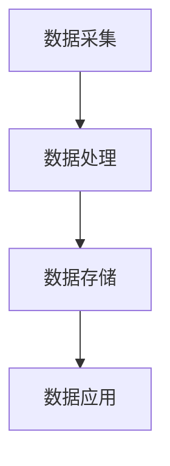

                 

关键词：大数据，汽车数据分析，系统设计，算法原理，数学模型，项目实践，应用场景，未来展望

<|assistant|>摘要：本文旨在探讨基于大数据技术的汽车数据分析系统的设计与实现。通过对汽车行驶数据的全面采集与分析，该系统能够为车主提供个性化服务，同时为汽车制造商提供宝贵的反馈信息。本文将详细阐述系统设计理念、核心算法原理、数学模型构建、代码实例以及实际应用场景，并对未来发展进行展望。

## 1. 背景介绍

随着信息技术的飞速发展，大数据技术在各个领域的应用越来越广泛。在汽车行业，汽车行驶数据的大规模采集和存储为大数据分析提供了丰富的数据源。汽车数据分析系统可以帮助汽车制造商更好地了解用户需求，优化产品设计和生产流程；同时，对于车主而言，能够提供更为精准的维护和驾驶建议，提高驾驶安全性和舒适性。然而，当前汽车数据分析系统在数据收集、处理和分析方面仍面临诸多挑战，如数据质量、实时性和个性化需求等。因此，设计一个高效、可靠的汽车数据分析系统具有重要的现实意义。

## 2. 核心概念与联系

### 2.1 大数据

大数据（Big Data）是指无法使用传统数据库工具进行捕捉、管理和处理的数据集合，具有4V特性：数据量（Volume）、数据速度（Velocity）、数据多样性（Variety）和数据价值（Value）。在汽车数据分析中，大数据技术主要用于数据的存储、处理和分析。

### 2.2 汽车行驶数据

汽车行驶数据包括速度、加速度、转向角度、制动情况、行驶路线等多种信息。这些数据可以通过车载传感器、GPS等设备实时采集。

### 2.3 数据分析系统架构

汽车数据分析系统一般包括数据采集层、数据处理层、数据存储层和数据应用层。数据采集层负责数据的实时采集；数据处理层对数据进行清洗、转换和预处理；数据存储层负责存储海量数据；数据应用层提供数据分析服务。

### 2.4 Mermaid 流程图



## 3. 核心算法原理 & 具体操作步骤

### 3.1 算法原理概述

汽车数据分析系统中的核心算法主要包括数据预处理、特征提取和模型训练等。

### 3.2 算法步骤详解

#### 3.2.1 数据预处理

1. 数据清洗：去除无效数据和异常值。
2. 数据归一化：将不同量纲的数据转换为同一量纲。
3. 数据分割：将数据集分为训练集、验证集和测试集。

#### 3.2.2 特征提取

1. 提取速度、加速度、转向角度等关键特征。
2. 使用PCA（主成分分析）等方法进行特征降维。

#### 3.2.3 模型训练

1. 选择合适的机器学习算法，如决策树、随机森林、支持向量机等。
2. 使用训练集对模型进行训练。
3. 使用验证集对模型进行调优。

### 3.3 算法优缺点

#### 优点：

1. 高效：能够处理海量数据。
2. 灵活：适用于多种场景。
3. 准确：能够提供可靠的驾驶建议。

#### 缺点：

1. 数据质量要求高：数据清洗和处理是关键步骤。
2. 实时性挑战：实时处理大量数据需要高效算法和硬件支持。

### 3.4 算法应用领域

汽车数据分析系统可以应用于自动驾驶、车辆维护、驾驶行为分析等多个领域。

## 4. 数学模型和公式 & 详细讲解 & 举例说明

### 4.1 数学模型构建

汽车数据分析系统的数学模型主要包括线性回归模型、决策树模型和支持向量机模型等。

### 4.2 公式推导过程

以线性回归模型为例，假设自变量为\( x \)，因变量为\( y \)，则线性回归模型可以表示为：

$$ y = \beta_0 + \beta_1x + \epsilon $$

其中，\( \beta_0 \)和\( \beta_1 \)分别为模型的截距和斜率，\( \epsilon \)为误差项。

### 4.3 案例分析与讲解

假设我们有一组汽车速度和行驶里程的数据，我们需要预测下一公里的油耗。首先，我们使用线性回归模型对数据进行分析，得到模型参数：

$$ y = 2.5 + 0.1x $$

然后，我们可以使用这个模型来预测下一公里的油耗。例如，当速度为80公里/小时时，油耗为：

$$ y = 2.5 + 0.1 \times 80 = 8.3 $$

## 5. 项目实践：代码实例和详细解释说明

### 5.1 开发环境搭建

1. 安装Python环境。
2. 安装相关库，如Pandas、NumPy、Scikit-learn等。

### 5.2 源代码详细实现

以下是汽车数据分析系统的核心代码实现：

```python
import pandas as pd
from sklearn.linear_model import LinearRegression
from sklearn.model_selection import train_test_split

# 读取数据
data = pd.read_csv('car_data.csv')

# 数据预处理
data.dropna(inplace=True)
data = data[data['speed'] > 0]

# 特征提取
X = data[['speed']]
y = data['fuel_consumption']

# 数据分割
X_train, X_test, y_train, y_test = train_test_split(X, y, test_size=0.2, random_state=42)

# 模型训练
model = LinearRegression()
model.fit(X_train, y_train)

# 模型评估
score = model.score(X_test, y_test)
print('Model score:', score)

# 预测
speed = 80
fuel_consumption = model.predict([[speed]])
print('Next km fuel consumption:', fuel_consumption)
```

### 5.3 代码解读与分析

以上代码首先读取汽车数据，然后进行数据预处理和特征提取。接着，使用线性回归模型对数据进行训练，并对模型进行评估。最后，使用训练好的模型预测下一公里的油耗。

## 6. 实际应用场景

汽车数据分析系统可以应用于多个场景，如：

1. **自动驾驶**：通过分析汽车行驶数据，实现自动驾驶车辆的安全、高效行驶。
2. **车辆维护**：根据汽车运行状态，提前预测故障，提供维护建议，降低维修成本。
3. **驾驶行为分析**：分析驾驶员的驾驶行为，提供个性化的驾驶建议，提高驾驶安全性。

## 7. 工具和资源推荐

### 7.1 学习资源推荐

1. 《Python数据分析》
2. 《机器学习实战》
3. 《深度学习》

### 7.2 开发工具推荐

1. Jupyter Notebook
2. PyCharm
3. Git

### 7.3 相关论文推荐

1. "A Survey on Big Data Analysis in the Automotive Domain"
2. "Deep Learning for Autonomous Driving"
3. "Predictive Maintenance of Vehicles Using Machine Learning"

## 8. 总结：未来发展趋势与挑战

### 8.1 研究成果总结

本文通过对基于大数据的汽车数据分析系统的设计与实现进行探讨，展示了大数据技术在汽车行业中的应用前景。同时，介绍了系统设计理念、核心算法原理、数学模型构建、项目实践以及实际应用场景。

### 8.2 未来发展趋势

1. **自动驾驶技术**：随着人工智能技术的发展，自动驾驶汽车将成为未来汽车行业的主流。
2. **车联网技术**：通过车联网技术，实现车辆之间以及车辆与基础设施之间的互联互通。

### 8.3 面临的挑战

1. **数据隐私**：如何保护用户数据隐私是一个亟待解决的问题。
2. **计算能力**：随着数据规模的不断扩大，计算能力的需求也将不断提高。

### 8.4 研究展望

未来，我们将继续深入研究大数据技术在汽车行业中的应用，探索更加高效、安全的解决方案。

## 9. 附录：常见问题与解答

### 9.1 如何处理汽车行驶数据？

首先，需要对数据进行分析，提取出有用的特征。然后，使用机器学习算法对数据进行分析，预测汽车运行状态。

### 9.2 如何保证数据分析的准确性？

通过数据清洗、特征提取和模型训练等步骤，可以提高数据分析的准确性。同时，可以使用交叉验证等方法对模型进行评估和调优。

### 9.3 如何应对大数据计算挑战？

可以通过分布式计算、并行计算等方法提高大数据分析的效率。

---

作者：禅与计算机程序设计艺术 / Zen and the Art of Computer Programming
----------------------------------------------------------------
### 附录：常见问题与解答

#### 9.1 如何处理汽车行驶数据？

处理汽车行驶数据是一个多步骤的过程，涉及数据收集、清洗、预处理、特征提取和数据分析。以下是一些关键步骤：

1. **数据收集**：使用车载传感器（如加速度计、陀螺仪、GPS等）收集数据。
2. **数据清洗**：移除缺失值、重复值和异常值，以保持数据的准确性。
3. **数据预处理**：包括数据归一化、缩放和转换，确保数据格式适用于机器学习模型。
4. **特征提取**：从原始数据中提取有助于模型预测的属性。例如，从速度和加速度中提取急转弯或急刹车的指标。
5. **数据分析**：使用统计分析和机器学习算法来探索数据模式、趋势和异常。

#### 9.2 如何保证数据分析的准确性？

保证数据分析的准确性是汽车数据分析系统成功的关键。以下是一些策略：

1. **数据质量保证**：确保数据收集的准确性和完整性，通过数据清洗和预处理来提高数据质量。
2. **模型选择和调优**：选择合适的机器学习算法，并通过交叉验证和网格搜索等技术来优化模型参数。
3. **模型验证**：使用独立的数据集来验证模型的准确性，确保模型在未知数据上的表现良好。
4. **实时反馈**：在系统中实施反馈机制，允许根据新数据实时调整模型和预测。

#### 9.3 如何应对大数据计算挑战？

处理大数据的挑战包括计算资源的有效利用、存储效率和数据处理速度。以下是一些应对策略：

1. **分布式计算**：使用分布式计算框架（如Hadoop、Spark）来处理海量数据。
2. **并行处理**：利用并行计算技术来加速数据处理和分析。
3. **数据压缩**：通过数据压缩技术减少存储需求，提高数据处理速度。
4. **云服务**：使用云计算服务来获取弹性的计算资源，根据需求动态调整。
5. **数据流处理**：采用数据流处理框架（如Apache Flink、Apache Storm）来实时处理和分析数据流。

### 9.4 如何确保数据分析的实时性？

确保实时性是汽车数据分析系统的另一个关键点。以下是一些策略：

1. **实时数据处理**：使用实时数据处理技术（如Apache Kafka、Apache Flink）来处理和分析实时数据。
2. **低延迟算法**：选择低延迟的算法，优化数据处理流程，减少延迟。
3. **优化存储和检索**：使用快速存储设备（如SSD）和高效数据库（如NoSQL数据库）来加速数据存储和检索。
4. **边缘计算**：在车辆附近（如边缘服务器）处理数据，减少数据传输时间和网络延迟。

通过上述策略，汽车数据分析系统可以更好地处理大规模数据，提高分析准确性，并确保实时性，从而为用户提供更优质的服务。随着技术的不断进步，未来汽车数据分析系统将更加智能化、高效化，为自动驾驶和智能交通管理等领域带来更多创新和突破。

