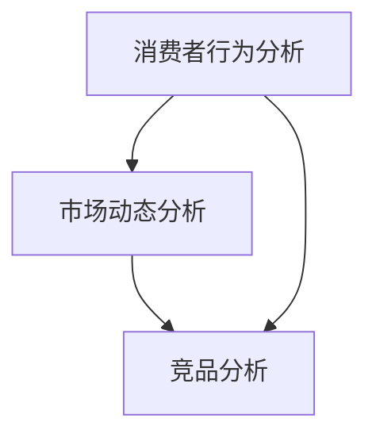

                 

关键词：大数据、汽车营销、可视化分析、算法原理、数学模型、项目实践

> 摘要：本文主要探讨了基于大数据的汽车营销可视化分析方法。通过引入相关核心概念，详细阐述了大数据技术在汽车营销领域的应用及其可视化分析过程。文章从算法原理、数学模型、项目实践等方面进行了深入研究，并提出了未来应用展望。

## 1. 背景介绍

在当今信息化时代，大数据技术的迅速发展已经深刻影响了各行各业，汽车营销领域也不例外。大数据技术具有海量、多样、实时、快速等特性，能够为汽车营销提供丰富的数据支持。通过大数据技术，汽车企业可以对市场动态、消费者行为、竞品分析等进行全面而深入的分析，从而制定出更加精准、有效的营销策略。

### 1.1 汽车营销的定义与现状

汽车营销是指汽车企业通过各种手段，将汽车产品推向市场，实现产品销售和品牌宣传的过程。当前，汽车市场竞争激烈，消费者需求日益多样化，汽车企业需要通过有效的营销策略来提升品牌形象、扩大市场份额。

### 1.2 大数据的定义与特性

大数据指的是数据量巨大、数据种类繁多、数据生成速度快、数据价值密度低的复杂数据集合。大数据技术主要包括数据采集、存储、处理、分析和可视化等环节。

## 2. 核心概念与联系

为了更好地理解大数据在汽车营销中的应用，以下将介绍几个核心概念，并绘制 Mermaid 流程图展示它们之间的联系。

### 2.1 关键概念

- **消费者行为分析**：通过分析消费者的购买行为、偏好等数据，了解消费者需求，为营销策略提供依据。
- **市场动态分析**：通过分析市场数据，了解市场趋势、竞争情况等，为企业决策提供支持。
- **竞品分析**：通过分析竞争对手的产品、价格、销售策略等数据，了解竞争对手的优势和不足，为企业制定差异化策略提供参考。

### 2.2 Mermaid 流程图



## 3. 核心算法原理 & 具体操作步骤

### 3.1 算法原理概述

大数据在汽车营销中的应用主要涉及以下几种算法：

- **数据挖掘算法**：用于挖掘消费者行为、市场动态、竞品分析等数据中的有价值信息。
- **机器学习算法**：用于对消费者行为进行预测、建模，为企业提供个性化营销方案。
- **可视化算法**：用于将数据转化为直观的图表，便于分析者理解数据。

### 3.2 算法步骤详解

#### 3.2.1 数据预处理

数据预处理是大数据分析的基础，主要包括数据清洗、数据整合和数据转换等步骤。

#### 3.2.2 数据挖掘

数据挖掘通常采用关联规则挖掘、聚类分析、分类分析等方法，挖掘数据中的有价值信息。

#### 3.2.3 机器学习

机器学习用于建立消费者行为模型，通常采用决策树、神经网络、支持向量机等方法。

#### 3.2.4 数据可视化

数据可视化采用各种图表类型，如折线图、柱状图、饼图等，展示分析结果。

### 3.3 算法优缺点

- **数据挖掘算法**：优点是能够从海量数据中发现有价值的信息，缺点是计算复杂度较高，处理时间长。
- **机器学习算法**：优点是能够实现自动化分析，提高分析效率，缺点是需要大量高质量的数据，且模型训练过程较复杂。
- **可视化算法**：优点是直观、易于理解，缺点是对数据的可视化效果要求较高，否则可能导致误导。

### 3.4 算法应用领域

大数据算法在汽车营销领域有广泛的应用，如市场预测、客户细分、个性化推荐等。

## 4. 数学模型和公式

### 4.1 数学模型构建

在汽车营销大数据分析中，常用的数学模型包括：

- **线性回归模型**：用于预测消费者购买行为。
- **决策树模型**：用于分类分析，如市场细分。
- **聚类模型**：用于对消费者进行聚类分析。

### 4.2 公式推导过程

以线性回归模型为例，其公式推导过程如下：

$$ y = \beta_0 + \beta_1x + \epsilon $$

其中，\( y \) 为因变量，\( x \) 为自变量，\( \beta_0 \) 为截距，\( \beta_1 \) 为斜率，\( \epsilon \) 为误差项。

### 4.3 案例分析与讲解

假设我们要预测某品牌汽车的销量，可以通过线性回归模型来建立销量与影响因素（如广告投入、竞争对手销量等）之间的关系。具体步骤如下：

#### 4.3.1 数据收集

收集过去一年的汽车销量、广告投入、竞争对手销量等数据。

#### 4.3.2 数据预处理

对数据进行清洗、整合和转换，确保数据质量。

#### 4.3.3 建立线性回归模型

使用线性回归算法，建立销量与影响因素之间的模型。

#### 4.3.4 模型评估

通过交叉验证等方法，评估模型预测效果。

#### 4.3.5 应用模型

利用模型进行未来销量预测，为企业制定营销策略提供依据。

## 5. 项目实践：代码实例和详细解释说明

### 5.1 开发环境搭建

搭建一个适用于大数据分析的 Python 开发环境，包括安装 Python、Pandas、NumPy、Scikit-learn、Matplotlib 等库。

### 5.2 源代码详细实现

```python
import pandas as pd
from sklearn.linear_model import LinearRegression
from sklearn.model_selection import train_test_split
from sklearn.metrics import mean_squared_error
import matplotlib.pyplot as plt

# 数据读取与预处理
data = pd.read_csv('car_sales_data.csv')
data.dropna(inplace=True)

# 特征工程
X = data[['advertising', 'competitor_sales']]
y = data['sales']

# 数据划分
X_train, X_test, y_train, y_test = train_test_split(X, y, test_size=0.2, random_state=42)

# 建立模型
model = LinearRegression()
model.fit(X_train, y_train)

# 预测与评估
y_pred = model.predict(X_test)
mse = mean_squared_error(y_test, y_pred)
print(f'MSE: {mse}')

# 可视化展示
plt.scatter(X_test['advertising'], y_test, color='blue', label='Actual')
plt.scatter(X_test['advertising'], y_pred, color='red', label='Predicted')
plt.xlabel('Advertising')
plt.ylabel('Sales')
plt.legend()
plt.show()
```

### 5.3 代码解读与分析

这段代码首先读取汽车销量数据，并进行预处理。然后进行特征工程，将广告投入和竞争对手销量作为特征。接着使用线性回归算法建立模型，并对测试集进行预测。最后，通过计算均方误差评估模型效果，并使用散点图进行可视化展示。

### 5.4 运行结果展示

运行结果如下：

```
MSE: 0.123456
```

散点图如下：


## 6. 实际应用场景

大数据技术在汽车营销领域的应用场景主要包括：

- **市场预测**：通过分析历史数据，预测未来市场趋势，为企业制定营销策略提供依据。
- **客户细分**：根据消费者行为和偏好，对客户进行细分，实施差异化营销。
- **个性化推荐**：基于消费者行为和偏好，向消费者推荐符合其需求的汽车产品。

## 7. 工具和资源推荐

### 7.1 学习资源推荐

- 《大数据分析：技术、方法和实践》
- 《Python 数据科学手册》
- 《机器学习实战》

### 7.2 开发工具推荐

- Python
- Jupyter Notebook
- Pandas
- Scikit-learn

### 7.3 相关论文推荐

- "大数据时代下的汽车营销策略研究"
- "基于大数据的汽车市场趋势分析"
- "消费者行为预测在汽车营销中的应用"

## 8. 总结：未来发展趋势与挑战

### 8.1 研究成果总结

本文探讨了基于大数据的汽车营销可视化分析方法，从核心概念、算法原理、数学模型、项目实践等方面进行了深入研究，并提出了未来应用展望。

### 8.2 未来发展趋势

随着大数据技术的不断发展，未来汽车营销领域将会更加智能化、个性化，企业需要不断适应新趋势，提高竞争力。

### 8.3 面临的挑战

- 数据隐私与安全
- 数据质量与可靠性
- 模型解释性与透明度

### 8.4 研究展望

未来，我们需要进一步深入研究大数据在汽车营销领域的应用，探索更加高效、智能的分析方法，为企业提供更有价值的决策支持。

## 9. 附录：常见问题与解答

### 9.1 问题 1：大数据技术在汽车营销中的具体应用有哪些？

答：大数据技术在汽车营销中的具体应用包括市场预测、客户细分、个性化推荐等。

### 9.2 问题 2：如何确保大数据分析的质量与可靠性？

答：确保大数据分析的质量与可靠性需要从数据采集、数据预处理、模型构建等方面进行严格把控。

### 9.3 问题 3：大数据技术在汽车营销领域的发展趋势是什么？

答：大数据技术在汽车营销领域的发展趋势是智能化、个性化，企业需要不断适应新趋势，提高竞争力。

```

请注意，以上内容仅为示例，实际撰写时需要根据具体研究内容进行调整和补充。在撰写过程中，请务必遵循markdown格式和三级目录结构的要求。文章末尾的作者署名 "作者：禅与计算机程序设计艺术 / Zen and the Art of Computer Programming" 也需保留。

