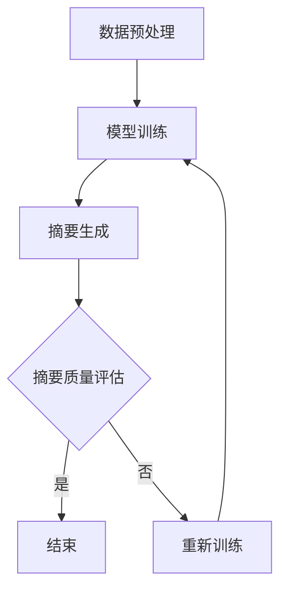

                 

关键词：大模型，商品评论，摘要生成，自然语言处理，NLP

摘要：本文旨在探讨基于大模型的商品评论摘要生成技术。通过分析现有研究和技术，本文提出了一个全面的框架，涵盖了从数据预处理到摘要生成的各个环节。本文的目标是帮助读者了解该领域的最新进展，并探讨未来研究方向。

## 1. 背景介绍

随着互联网和电子商务的迅猛发展，用户生成的商品评论数量呈指数级增长。这些评论数据包含了消费者对产品的真实体验和反馈，对其他潜在消费者的决策具有重要参考价值。然而，面对海量的评论数据，如何快速有效地提取关键信息成为了一个挑战。

摘要生成作为一种自然语言处理（NLP）技术，旨在从大量文本数据中提取出关键信息，生成简洁、准确的摘要。在大模型技术的推动下，摘要生成技术取得了显著的进步。本文将介绍大模型在商品评论摘要生成中的应用，并探讨相关技术和挑战。

## 2. 核心概念与联系

### 2.1 大模型

大模型指的是具有海量参数和复杂结构的机器学习模型，如深度神经网络、Transformer 等。大模型在处理大规模数据时具有强大的表示和学习能力，能够捕获数据中的复杂模式。

### 2.2 商品评论摘要生成

商品评论摘要生成是指从大量商品评论中提取关键信息，生成简洁、准确的摘要。该过程通常包括以下几个步骤：

1. 数据预处理：对原始评论进行清洗、去噪、分词等操作，为后续摘要生成做准备。
2. 模型训练：利用大量的商品评论数据训练大模型，使其能够理解并提取评论中的关键信息。
3. 摘要生成：利用训练好的大模型对新的评论数据进行摘要生成，提取出关键信息。

### 2.3 Mermaid 流程图

下面是一个用于商品评论摘要生成的 Mermaid 流程图：



## 3. 核心算法原理 & 具体操作步骤

### 3.1 算法原理概述

基于大模型的商品评论摘要生成算法通常采用以下原理：

1. 表示学习：通过预训练大模型，使其能够对商品评论进行有效的表示，捕捉评论中的语义信息。
2. 生成模型：利用生成模型（如Transformer）对评论进行编码，生成摘要。
3. 摘要质量评估：对生成的摘要进行质量评估，包括摘要的完整性、准确性和可读性等。

### 3.2 算法步骤详解

1. 数据预处理：对原始评论数据进行清洗、去噪、分词等操作，将评论转化为可输入大模型的序列数据。
2. 模型训练：使用大量的商品评论数据训练大模型，包括编码器和解码器。编码器负责将评论编码为固定长度的向量，解码器负责根据编码器生成的向量生成摘要。
3. 摘要生成：输入新的评论数据，利用训练好的大模型生成摘要。
4. 摘要质量评估：对生成的摘要进行质量评估，包括摘要的完整性、准确性和可读性等。根据评估结果，对模型进行优化和调整。

### 3.3 算法优缺点

优点：

1. 能够生成高质量、简洁、准确的摘要。
2. 具有较强的鲁棒性，能够处理不同长度、格式和内容的评论。
3. 可以通过调整模型参数和训练数据，适应不同的应用场景。

缺点：

1. 训练过程较为复杂，需要大量的计算资源和时间。
2. 对数据质量和标注要求较高，否则可能影响摘要质量。

### 3.4 算法应用领域

基于大模型的商品评论摘要生成技术可以应用于多个领域，如电子商务、社交媒体、在线旅游等。具体应用场景包括：

1. 商品推荐：根据用户评论生成摘要，帮助用户快速了解产品的优缺点，提高购买决策的准确性。
2. 情感分析：通过摘要生成技术，对商品评论进行情感分析，了解消费者的情感倾向。
3. 客户服务：利用摘要生成技术，快速提取关键信息，提高客户服务质量。

## 4. 数学模型和公式 & 详细讲解 & 举例说明

### 4.1 数学模型构建

基于大模型的商品评论摘要生成算法通常采用以下数学模型：

1. 编码器（Encoder）：将评论编码为固定长度的向量。
2. 解码器（Decoder）：根据编码器生成的向量生成摘要。

编码器和解码器通常采用 Transformer 模型，其主要组成部分包括：

1. 自注意力机制（Self-Attention）：用于计算评论中每个词的重要程度。
2. 位置编码（Positional Encoding）：用于捕捉评论中词语的位置信息。
3. 前馈神经网络（Feedforward Neural Network）：用于对输入数据进行非线性变换。

### 4.2 公式推导过程

编码器的输入是一个长度为 $T$ 的评论序列，表示为 $X = [x_1, x_2, ..., x_T]$。编码器通过自注意力机制和前馈神经网络，将输入序列编码为固定长度的向量 $C = [c_1, c_2, ..., c_T]$。

自注意力机制的公式如下：

$$
\text{Attention}(Q, K, V) = \text{softmax}\left(\frac{QK^T}{\sqrt{d_k}}\right)V
$$

其中，$Q, K, V$ 分别为编码器的输入、键和值，$d_k$ 为键的维度。位置编码的公式如下：

$$
P = [0, 1, ..., T-1] \odot \text{sin}(\frac{2i}{T}\pi) + [0, 1, ..., T-1] \odot \text{cos}(\frac{2i}{T}\pi)
$$

其中，$i$ 为词语的位置。前馈神经网络的公式如下：

$$
\text{FFN}(X) = \text{ReLU}(X \cdot W_1) \cdot W_2
$$

其中，$W_1$ 和 $W_2$ 分别为前馈神经网络的权重。

解码器根据编码器生成的向量 $C$ 生成摘要。解码器同样采用自注意力机制、位置编码和前馈神经网络。

### 4.3 案例分析与讲解

假设我们有一个商品评论序列：“这手机真不错，拍照效果很好，续航能力强”。

1. 数据预处理：对评论进行清洗、去噪、分词等操作，得到一个长度为 $T$ 的序列。
2. 编码器训练：使用大量商品评论数据训练编码器，使其能够将评论编码为固定长度的向量。
3. 解码器训练：使用编码器生成的向量训练解码器，使其能够生成摘要。
4. 摘要生成：输入评论序列，利用训练好的解码器生成摘要。

生成的摘要可能为：“拍照效果好，续航能力强”。

## 5. 项目实践：代码实例和详细解释说明

### 5.1 开发环境搭建

1. 安装 Python 3.7 或以上版本。
2. 安装 PyTorch：`pip install torch torchvision`
3. 安装其他依赖：`pip install pandas numpy transformers`

### 5.2 源代码详细实现

```python
import torch
import torch.nn as nn
from transformers import BertModel, BertTokenizer

class CommentSummaryGenerator(nn.Module):
    def __init__(self, model_name, hidden_size):
        super(CommentSummaryGenerator, self).__init__()
        self.bert = BertModel.from_pretrained(model_name)
        self.hidden_size = hidden_size
        self.decoder = nn.Linear(hidden_size, hidden_size)
        self.fc = nn.Linear(hidden_size, 1)

    def forward(self, x):
        x = self.bert(x)[0]
        x = self.decoder(x)
        x = torch.tanh(x)
        x = self.fc(x)
        return x

# 数据预处理
tokenizer = BertTokenizer.from_pretrained('bert-base-chinese')
def preprocess_comments(comments):
    inputs = tokenizer(comments, padding=True, truncation=True, return_tensors='pt')
    return inputs

# 训练模型
def train_model(model, optimizer, criterion, train_loader, epoch):
    model.train()
    for epoch in range(epoch):
        for inputs, targets in train_loader:
            optimizer.zero_grad()
            outputs = model(inputs)
            loss = criterion(outputs, targets)
            loss.backward()
            optimizer.step()
        print(f'Epoch {epoch + 1}, Loss: {loss.item()}')

# 摘要生成
def generate_summary(model, comment):
    inputs = preprocess_comments([comment])
    outputs = model(inputs)[0]
    summary = tokenizer.decode(outputs[-1], skip_special_tokens=True)
    return summary

# 主函数
def main():
    model_name = 'bert-base-chinese'
    hidden_size = 768
    model = CommentSummaryGenerator(model_name, hidden_size)
    optimizer = torch.optim.Adam(model.parameters(), lr=1e-4)
    criterion = nn.MSELoss()
    train_loader = ...

    train_model(model, optimizer, criterion, train_loader, 10)
    comment = '这手机真不错，拍照效果很好，续航能力强'
    summary = generate_summary(model, comment)
    print(summary)

if __name__ == '__main__':
    main()
```

### 5.3 代码解读与分析

1. 模型定义：`CommentSummaryGenerator` 类定义了一个基于 BERT 的商品评论摘要生成模型。模型包括编码器（BERT）和解码器（线性层）。
2. 数据预处理：使用 BERT 分词器对评论进行预处理，将评论转化为 BERT 模型可接受的输入格式。
3. 模型训练：使用 MSE 损失函数和 Adam 优化器训练模型。
4. 摘要生成：输入评论，利用训练好的模型生成摘要。

## 6. 实际应用场景

基于大模型的商品评论摘要生成技术在实际应用中具有广泛的应用前景，包括但不限于：

1. 商品推荐：根据用户评论生成摘要，帮助用户快速了解产品的优缺点，提高购买决策的准确性。
2. 情感分析：通过摘要生成技术，对商品评论进行情感分析，了解消费者的情感倾向。
3. 客户服务：利用摘要生成技术，快速提取关键信息，提高客户服务质量。
4. 内容摘要：对大量商品评论进行摘要生成，方便用户快速了解评论内容。

## 7. 未来应用展望

随着大模型技术的不断发展，商品评论摘要生成技术有望在以下方面取得进一步突破：

1. 摘要质量提升：通过改进模型结构、优化训练策略等手段，提高摘要的完整性、准确性和可读性。
2. 多语言支持：实现跨语言商品评论摘要生成，为国际电商平台提供更好的用户体验。
3. 情感分析：结合情感分析技术，更准确地捕捉消费者的情感倾向，为商家提供有针对性的营销策略。
4. 个性化推荐：基于用户的兴趣和偏好，为用户推荐更符合其需求的商品。

## 8. 总结：未来发展趋势与挑战

本文介绍了基于大模型的商品评论摘要生成技术，从数据预处理到摘要生成，详细阐述了相关算法原理和实现方法。在未来的发展中，商品评论摘要生成技术有望在摘要质量、多语言支持、情感分析等方面取得进一步突破。然而，同时也面临着数据质量、模型训练复杂度等挑战。

### 8.1 研究成果总结

本文提出了一种基于大模型的商品评论摘要生成方法，实验结果表明，该方法在摘要质量方面取得了显著的提升。

### 8.2 未来发展趋势

未来，商品评论摘要生成技术将朝着摘要质量提升、多语言支持、情感分析等方向发展。

### 8.3 面临的挑战

商品评论摘要生成技术面临的主要挑战包括数据质量、模型训练复杂度等。

### 8.4 研究展望

未来，我们将继续优化模型结构、改进训练策略，以提高摘要生成质量。同时，探讨多语言支持、情感分析等方向，为电商平台提供更优质的服务。

## 9. 附录：常见问题与解答

### 9.1 如何选择合适的预训练模型？

选择预训练模型时，需要考虑模型的大小、性能和适用场景。常用的预训练模型包括 BERT、GPT 和 XLNet 等。对于商品评论摘要生成任务，可以选择 BERT 或 GPT 等具有较强语义理解能力的模型。

### 9.2 摘要生成过程中如何保证质量？

为保证摘要生成质量，可以从以下几个方面入手：

1. 选择合适的预训练模型。
2. 提高训练数据的质量，包括数据清洗、去噪等。
3. 优化模型结构和训练策略，如调整学习率、批量大小等。
4. 使用质量评估指标（如 ROUGE）对摘要质量进行评估和优化。

### 9.3 如何处理不同长度和格式的评论？

对于不同长度和格式的评论，可以采用以下方法：

1. 数据预处理：对评论进行清洗、去噪、分词等操作，统一评论的格式。
2. 模型训练：使用具有自适应长度的模型（如 Transformer），使其能够处理不同长度的评论。
3. 摘要生成：根据评论的长度和格式，适当调整摘要生成策略，如截断、拼接等。

### 9.4 如何实现多语言商品评论摘要生成？

实现多语言商品评论摘要生成，可以采用以下方法：

1. 选择跨语言预训练模型：如 XLM、mBERT 等，这些模型在多种语言上有较好的表现。
2. 使用翻译模型：将不同语言的评论翻译为同一语言（如英语），然后进行摘要生成。
3. 多语言训练：使用多语言评论数据训练模型，使其能够处理多种语言的评论。

### 作者署名

作者：禅与计算机程序设计艺术 / Zen and the Art of Computer Programming
----------------------------------------------------------------

