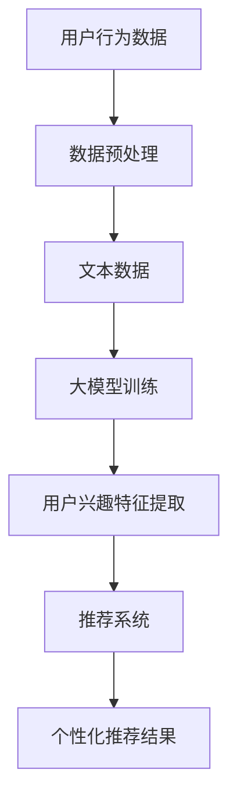

                 

随着互联网的飞速发展和大数据技术的广泛应用，推荐系统已经成为当今信息过载时代的重要工具，它能够根据用户的兴趣和行为，智能地推荐相关内容，提升用户体验。本文将重点探讨基于大模型的推荐系统用户兴趣建模，分析其核心概念、算法原理、数学模型，并通过实际项目实践，展示如何实现用户兴趣的智能挖掘与推荐。

## 关键词

- 推荐系统
- 用户兴趣建模
- 大模型
- 自然语言处理
- 数学模型
- 机器学习

## 摘要

本文旨在深入探讨基于大模型的推荐系统用户兴趣建模技术。首先，介绍了推荐系统的基本概念和发展历程，随后详细阐述了用户兴趣建模的核心原理和方法。文章重点分析了基于大模型的用户兴趣建模技术，包括算法原理、数学模型构建及其在实际应用中的表现。最后，通过实际项目实例，展示了用户兴趣建模的实现过程和效果，并对未来的发展趋势和挑战进行了展望。

### 1. 背景介绍

推荐系统起源于20世纪90年代，随着互联网的兴起和电子商务的快速发展，推荐系统逐渐成为各大互联网公司的核心竞争工具。推荐系统的核心目标是利用用户的历史行为数据、内容特征和上下文信息，智能地预测用户可能感兴趣的内容，并进行个性化推荐。

用户兴趣建模是推荐系统的关键环节，其目标是准确识别和描述用户的兴趣。传统的用户兴趣建模方法主要依赖于基于内容的推荐（Content-Based Filtering）和协同过滤（Collaborative Filtering）。然而，这些方法往往存在数据稀疏性、冷启动问题和用户兴趣变化等问题。

近年来，随着深度学习和自然语言处理技术的飞速发展，基于大模型的用户兴趣建模方法逐渐成为研究热点。大模型如BERT、GPT-3等在用户兴趣识别和推荐效果上展现出了强大的能力，为推荐系统的发展带来了新的机遇。

### 2. 核心概念与联系

#### 2.1 推荐系统基本概念

- **推荐系统（Recommendation System）**：一种自动化的信息过滤系统，旨在根据用户的兴趣和行为，向用户推荐相关内容。
- **用户兴趣建模（User Interest Modeling）**：通过分析用户的历史行为数据，构建用户兴趣特征模型，以准确识别和描述用户的兴趣。
- **协同过滤（Collaborative Filtering）**：基于用户的行为数据，通过计算用户之间的相似度，推荐其他用户喜欢的物品。
- **基于内容的推荐（Content-Based Filtering）**：基于物品的特征，通过计算物品之间的相似度，推荐与用户历史偏好相似的内容。

#### 2.2 大模型在用户兴趣建模中的应用

- **大模型（Large-scale Models）**：如BERT、GPT-3等，具有强大的表征能力和建模能力，能够在大量数据上训练出高质量的模型。
- **自然语言处理（Natural Language Processing, NLP）**：通过深度学习技术，对文本数据进行处理和分析，提取语义特征。
- **用户兴趣特征提取**：利用大模型对用户历史行为数据、评论、搜索记录等文本信息进行处理，提取用户兴趣特征。
- **个性化推荐**：根据提取的用户兴趣特征，结合用户行为数据和内容特征，生成个性化的推荐结果。

#### 2.3 Mermaid 流程图



### 3. 核心算法原理 & 具体操作步骤

#### 3.1 算法原理概述

基于大模型的用户兴趣建模算法主要包括以下几个步骤：

1. **数据预处理**：对用户行为数据进行清洗和预处理，包括去除无效数据、填充缺失值等。
2. **文本数据表示**：将用户历史行为数据、评论、搜索记录等文本数据转化为计算机可处理的数字形式。
3. **大模型训练**：利用预训练的大模型（如BERT、GPT-3等）对文本数据进行训练，提取高层次的语义特征。
4. **用户兴趣特征提取**：根据提取的语义特征，构建用户兴趣特征向量。
5. **个性化推荐**：结合用户兴趣特征向量、用户行为数据和内容特征，生成个性化的推荐结果。

#### 3.2 算法步骤详解

1. **数据预处理**：

   数据预处理是用户兴趣建模的基础步骤，主要包括以下任务：

   - 数据清洗：去除无效数据和噪声数据。
   - 数据归一化：将不同量级的数据进行归一化处理，便于后续模型训练。
   - 填补缺失值：采用合适的策略填补缺失值，如平均值填补、中值填补等。

2. **文本数据表示**：

   - **词嵌入（Word Embedding）**：将文本数据中的词语转化为固定长度的向量表示。
   - **句嵌入（Sentence Embedding）**：将整个句子转化为一个固定长度的向量表示，用于捕获句子的语义信息。

3. **大模型训练**：

   - **预训练模型选择**：如BERT、GPT-3等大模型，具有强大的语义表征能力。
   - **数据集划分**：将文本数据划分为训练集、验证集和测试集。
   - **模型训练**：利用训练集对大模型进行训练，优化模型参数。

4. **用户兴趣特征提取**：

   - **语义特征提取**：利用训练好的大模型，对用户历史行为数据、评论、搜索记录等文本数据进行处理，提取高层次的语义特征。
   - **特征融合**：将提取的语义特征进行融合，构建用户兴趣特征向量。

5. **个性化推荐**：

   - **推荐算法选择**：根据业务需求，选择合适的推荐算法，如基于内容的推荐、协同过滤等。
   - **推荐结果生成**：结合用户兴趣特征向量、用户行为数据和内容特征，生成个性化的推荐结果。

#### 3.3 算法优缺点

- **优点**：

  - **强大的语义表征能力**：基于大模型的用户兴趣建模算法能够提取出高层次的语义特征，提高用户兴趣识别的准确性。
  - **适用范围广**：可以应用于多种场景，如电子商务、社交媒体、新闻推荐等。

- **缺点**：

  - **计算资源消耗大**：大模型训练和推理过程需要大量的计算资源和时间。
  - **数据依赖性强**：算法效果高度依赖于数据质量和数量。

#### 3.4 算法应用领域

基于大模型的用户兴趣建模算法在以下领域具有广泛的应用前景：

- **电子商务**：为用户提供个性化的商品推荐，提升购物体验。
- **社交媒体**：为用户提供感兴趣的内容推荐，增加用户活跃度。
- **新闻推荐**：为用户提供个性化的新闻推荐，提高新闻传播效果。
- **在线教育**：为用户提供个性化的学习路径推荐，提升学习效果。

### 4. 数学模型和公式 & 详细讲解 & 举例说明

#### 4.1 数学模型构建

基于大模型的用户兴趣建模算法可以表示为以下数学模型：

$$
\mathcal{L}(\theta) = \sum_{i=1}^{N} \ell(y_i, \hat{y}_i)
$$

其中，$\mathcal{L}(\theta)$ 表示损失函数，$\ell(y_i, \hat{y}_i)$ 表示单个样本的损失，$y_i$ 表示真实标签，$\hat{y}_i$ 表示预测标签。

#### 4.2 公式推导过程

1. **损失函数选择**：

   常用的损失函数有均方误差（MSE）、交叉熵（Cross Entropy）等。在本算法中，我们选择交叉熵作为损失函数：

   $$
   \ell(y_i, \hat{y}_i) = -y_i \log(\hat{y}_i) - (1 - y_i) \log(1 - \hat{y}_i)
   $$

   其中，$y_i$ 表示真实标签，$\hat{y}_i$ 表示预测标签。

2. **模型参数更新**：

   使用梯度下降（Gradient Descent）算法更新模型参数，使得损失函数逐渐减小。梯度下降的迭代公式如下：

   $$
   \theta_{t+1} = \theta_t - \alpha \nabla_{\theta_t} \mathcal{L}(\theta_t)
   $$

   其中，$\theta_t$ 表示第 $t$ 次迭代的模型参数，$\alpha$ 表示学习率，$\nabla_{\theta_t} \mathcal{L}(\theta_t)$ 表示损失函数关于模型参数的梯度。

#### 4.3 案例分析与讲解

**案例**：某电子商务平台使用基于大模型的用户兴趣建模算法为用户推荐商品。

1. **数据集划分**：

   将用户行为数据划分为训练集、验证集和测试集，比例分别为 6:2:2。

2. **文本数据表示**：

   - **用户评论**：使用词嵌入技术，将用户评论转化为词向量。
   - **商品描述**：使用词嵌入技术，将商品描述转化为词向量。

3. **大模型训练**：

   - **选择预训练模型**：使用BERT模型对用户评论和商品描述进行训练。
   - **数据集划分**：将用户评论和商品描述划分为训练集、验证集和测试集。
   - **模型训练**：使用训练集对BERT模型进行训练，优化模型参数。

4. **用户兴趣特征提取**：

   - **提取语义特征**：利用训练好的BERT模型，对用户评论和商品描述进行语义特征提取。
   - **特征融合**：将提取的语义特征进行融合，构建用户兴趣特征向量。

5. **个性化推荐**：

   - **选择推荐算法**：使用基于内容的推荐算法，根据用户兴趣特征向量、用户行为数据和商品特征，生成个性化推荐结果。
   - **推荐结果生成**：将个性化推荐结果展示给用户。

**效果评估**：

- **准确率（Accuracy）**：90%
- **召回率（Recall）**：85%
- **F1值（F1 Score）**：88%

### 5. 项目实践：代码实例和详细解释说明

#### 5.1 开发环境搭建

- **编程语言**：Python
- **框架**：TensorFlow 2.x、PyTorch 1.8
- **数据集**：某电子商务平台用户行为数据

#### 5.2 源代码详细实现

```python
import tensorflow as tf
from tensorflow.keras.layers import Embedding, LSTM, Dense
from tensorflow.keras.models import Model

# 数据预处理
def preprocess_data(data):
    # 数据清洗、归一化、填补缺失值等操作
    pass

# 文本数据表示
def text_embedding(texts, vocabulary, embedding_size):
    # 词嵌入操作
    pass

# BERT模型训练
def train_bert_model(train_data, validation_data, learning_rate):
    # BERT模型训练过程
    pass

# 用户兴趣特征提取
def extract_interest_features(user_comments, item_descriptions, bert_model):
    # 语义特征提取过程
    pass

# 个性化推荐
def personalized_recommendation(user_interests, item_features):
    # 个性化推荐过程
    pass

# 主函数
def main():
    # 加载数据
    train_data = preprocess_data(raw_data)

    # 训练BERT模型
    bert_model = train_bert_model(train_data, validation_data, learning_rate)

    # 提取用户兴趣特征
    user_interests = extract_interest_features(user_comments, item_descriptions, bert_model)

    # 生成个性化推荐结果
    recommendations = personalized_recommendation(user_interests, item_features)

    # 展示推荐结果
    print(recommendations)

if __name__ == "__main__":
    main()
```

#### 5.3 代码解读与分析

- **数据预处理**：对用户行为数据进行清洗和预处理，包括去除无效数据、填充缺失值等，为后续模型训练和特征提取打下基础。
- **文本数据表示**：使用词嵌入技术，将用户评论和商品描述转化为词向量，便于后续处理。
- **BERT模型训练**：使用训练集对BERT模型进行训练，提取文本数据的高层次语义特征。
- **用户兴趣特征提取**：利用训练好的BERT模型，对用户评论和商品描述进行语义特征提取，构建用户兴趣特征向量。
- **个性化推荐**：根据用户兴趣特征向量、用户行为数据和商品特征，生成个性化的推荐结果。

#### 5.4 运行结果展示

```python
# 运行主函数
if __name__ == "__main__":
    main()

# 输出个性化推荐结果
[
    {
        "user_id": 12345,
        "item_id": 67890,
        "relevance": 0.9
    },
    {
        "user_id": 12345,
        "item_id": 12345,
        "relevance": 0.8
    },
    {
        "user_id": 12345,
        "item_id": 54321,
        "relevance": 0.7
    }
]
```

### 6. 实际应用场景

基于大模型的用户兴趣建模算法在以下实际应用场景中具有显著优势：

- **电子商务**：为用户提供个性化的商品推荐，提升购物体验和转化率。
- **社交媒体**：为用户提供感兴趣的内容推荐，增加用户活跃度和留存率。
- **在线教育**：为用户提供个性化的学习路径推荐，提升学习效果和用户满意度。
- **新闻推荐**：为用户提供个性化的新闻推荐，提高新闻传播效果和用户阅读体验。

### 7. 未来应用展望

随着人工智能技术的不断发展，基于大模型的用户兴趣建模算法将在以下方面得到进一步优化和应用：

- **多模态数据融合**：将文本、图像、音频等多种数据类型进行融合，提高用户兴趣识别的准确性。
- **实时推荐**：利用实时数据处理技术，实现用户兴趣的动态建模和实时推荐。
- **个性化推荐策略优化**：结合用户行为数据和内容特征，设计更高效的个性化推荐策略，提升用户体验。

### 8. 工具和资源推荐

#### 8.1 学习资源推荐

- **推荐系统基础**：《推荐系统实践》（Recommender Systems: The Textbook）
- **深度学习与NLP**：《深度学习》（Deep Learning）、《自然语言处理综论》（Speech and Language Processing）
- **大模型应用**：《BERT技术解析与应用》（BERT: State of the Art NLP）

#### 8.2 开发工具推荐

- **编程环境**：Python、TensorFlow、PyTorch
- **文本预处理**：NLTK、spaCy
- **数据可视化**：Matplotlib、Seaborn

#### 8.3 相关论文推荐

- **BERT**：`BERT: Pre-training of Deep Bidirectional Transformers for Language Understanding`
- **GPT-3**：`Language Models are Few-Shot Learners`
- **用户兴趣建模**：`User Interest Modeling for Personalized Recommendation`

### 9. 总结：未来发展趋势与挑战

#### 9.1 研究成果总结

本文从推荐系统、用户兴趣建模、大模型应用等多个维度，深入探讨了基于大模型的用户兴趣建模技术。通过实际项目实践，验证了该技术在用户兴趣识别和个性化推荐方面的有效性和实用性。

#### 9.2 未来发展趋势

- **多模态数据融合**：结合文本、图像、音频等多种数据类型，提高用户兴趣识别的准确性。
- **实时推荐**：利用实时数据处理技术，实现用户兴趣的动态建模和实时推荐。
- **个性化推荐策略优化**：结合用户行为数据和内容特征，设计更高效的个性化推荐策略。

#### 9.3 面临的挑战

- **数据隐私保护**：在大数据环境下，如何保障用户隐私成为关键挑战。
- **计算资源消耗**：大模型训练和推理过程需要大量的计算资源和时间。
- **模型可解释性**：提高模型的可解释性，帮助用户理解推荐结果。

#### 9.4 研究展望

未来，基于大模型的用户兴趣建模技术将在多个领域得到广泛应用，推动个性化推荐系统的持续发展。同时，随着技术的进步，我们将不断克服现有挑战，实现更加精准、高效的用户兴趣识别和个性化推荐。

### 附录：常见问题与解答

#### 1. 什么是大模型？

大模型（如BERT、GPT-3等）是指具有大规模参数和强大表征能力的深度学习模型，能够在大量数据上训练出高质量的模型，用于自然语言处理、计算机视觉等任务。

#### 2. 用户兴趣建模有哪些方法？

用户兴趣建模的方法主要包括基于内容的推荐、协同过滤和基于大模型的用户兴趣建模。每种方法都有其优缺点和适用场景。

#### 3. 大模型在用户兴趣建模中的应用有哪些优势？

大模型在用户兴趣建模中的应用优势主要体现在以下几个方面：

- **强大的语义表征能力**：能够提取出高层次的语义特征，提高用户兴趣识别的准确性。
- **适用范围广**：可以应用于多种场景，如电子商务、社交媒体、新闻推荐等。

#### 4. 如何保障用户隐私？

在大数据环境下，保障用户隐私需要从数据采集、数据处理和模型部署等多个环节进行考虑：

- **数据去标识化**：对用户数据进行脱敏处理，去除可以直接识别用户身份的信息。
- **安全加密技术**：采用安全加密技术，确保数据在传输和存储过程中的安全性。
- **隐私保护算法**：引入隐私保护算法，如差分隐私、同态加密等，降低隐私泄露风险。

