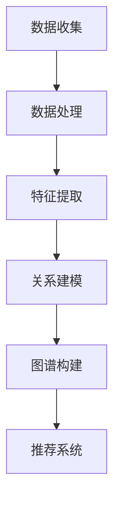

                 

关键词：大语言模型、推荐系统、用户兴趣图谱、算法原理、数学模型、项目实践、应用场景、未来展望

## 摘要

本文深入探讨了基于大语言模型的推荐系统用户兴趣图谱构建的方法。首先，介绍了推荐系统的基本概念和用户兴趣图谱的重要性，随后详细解析了大语言模型的工作原理及其在推荐系统中的应用。接着，文章从数学模型、算法原理和具体实现步骤等方面详细阐述了用户兴趣图谱的构建过程，并通过一个实际项目案例展示了如何在实际环境中应用这一方法。文章的最后，讨论了用户兴趣图谱在实际应用中的场景和未来展望，并推荐了一些学习和资源工具。

## 1. 背景介绍

随着互联网的迅猛发展，用户生成的内容量呈现出爆炸式增长。为了满足用户对个性化信息的需求，推荐系统应运而生。推荐系统通过分析用户的历史行为和兴趣，预测用户可能感兴趣的内容，从而提供个性化的信息推荐。这一过程不仅提升了用户体验，还显著提高了内容平台的内容分发效率。

在推荐系统中，用户兴趣图谱（User Interest Graph）扮演着至关重要的角色。用户兴趣图谱通过捕捉用户的兴趣点及其相互关系，为推荐算法提供了丰富的信息来源。传统的推荐系统主要依赖于基于内容的推荐（Content-Based Filtering）和协同过滤（Collaborative Filtering），但这些方法往往难以准确捕捉用户的深层次兴趣。而基于大语言模型的用户兴趣图谱构建，能够更好地理解用户的兴趣多样性，从而提高推荐系统的准确性和个性化水平。

大语言模型是一种基于深度学习技术的自然语言处理模型，能够通过大量文本数据学习语言的复杂结构，从而生成或理解自然语言。近年来，随着计算能力和数据规模的提升，大语言模型在多个领域取得了显著进展，如机器翻译、文本生成、问答系统等。将其应用于推荐系统，能够进一步提升推荐算法的智能化水平。

## 2. 核心概念与联系

### 2.1. 推荐系统基本概念

推荐系统主要包括以下几个核心组成部分：

1. **用户**：系统的主要交互对象，具有特定的兴趣和行为。
2. **内容**：推荐系统中的信息对象，如商品、文章、视频等。
3. **评价**：用户对内容的偏好表达，通常为评分、点击、购买等行为数据。
4. **推荐算法**：根据用户行为和内容特征，生成个性化推荐结果的算法。

### 2.2. 用户兴趣图谱定义

用户兴趣图谱是一种利用图形结构表示用户兴趣及其相互关系的数据模型。具体来说，它由节点和边组成：

- **节点**：代表用户或内容，每个节点对应一个实体。
- **边**：表示节点之间的关联关系，可以是兴趣相似性、行为关联性等。

### 2.3. 大语言模型原理

大语言模型基于深度学习技术，通过多层神经网络对大量文本数据进行学习，从而预测文本的下一个词或句子。其核心组成部分包括：

- **嵌入层**：将文本中的单词、句子等转化为向量表示。
- **编码器**：对输入文本进行编码，提取文本的特征。
- **解码器**：根据编码器的输出生成预测的文本。

### 2.4. 用户兴趣图谱与大语言模型的联系

大语言模型在用户兴趣图谱构建中的应用主要体现在以下几个方面：

1. **特征提取**：通过大语言模型对用户生成的内容进行特征提取，获取用户兴趣的深层次表达。
2. **关系建模**：利用大语言模型分析用户行为数据，建立用户兴趣之间的关联关系。
3. **图谱构建**：基于提取的特征和关系建模，构建用户兴趣图谱。

### 2.5. Mermaid 流程图

下面是一个简化的Mermaid流程图，展示用户兴趣图谱构建的基本流程：



## 3. 核心算法原理 & 具体操作步骤

### 3.1 算法原理概述

基于大语言模型的用户兴趣图谱构建算法主要分为三个步骤：

1. **数据预处理**：包括用户行为数据清洗、文本预处理等。
2. **特征提取**：利用大语言模型提取用户生成内容的特征向量。
3. **关系建模与图谱构建**：基于特征向量和用户行为数据，构建用户兴趣图谱。

### 3.2 算法步骤详解

#### 3.2.1 数据预处理

数据预处理是用户兴趣图谱构建的基础步骤，主要包括以下任务：

1. **数据清洗**：去除无效数据、处理缺失值等。
2. **文本预处理**：分词、去除停用词、词干提取等。

#### 3.2.2 特征提取

特征提取是用户兴趣图谱构建的核心环节，主要利用大语言模型提取用户生成内容的特征向量。具体步骤如下：

1. **模型选择**：选择合适的大语言模型，如GPT-3、BERT等。
2. **文本编码**：将预处理后的文本输入到大语言模型中，获取文本的嵌入向量。
3. **特征融合**：对多个文本片段的特征向量进行融合，形成用户兴趣特征向量。

#### 3.2.3 关系建模与图谱构建

关系建模与图谱构建是用户兴趣图谱构建的关键步骤，主要任务包括：

1. **用户兴趣点识别**：利用特征向量，识别用户的主要兴趣点。
2. **关系建模**：基于用户行为数据，建立用户兴趣点之间的关联关系。
3. **图谱构建**：利用图形数据库或图计算框架，构建用户兴趣图谱。

### 3.3 算法优缺点

#### 优点：

1. **深度理解用户兴趣**：大语言模型能够深度理解用户生成的内容，提取出更精准的用户兴趣特征。
2. **适应性强**：用户兴趣图谱可以根据不同的应用场景进行灵活调整。
3. **提高推荐质量**：基于用户兴趣图谱的推荐系统能够提供更个性化的推荐结果。

#### 缺点：

1. **计算成本高**：大语言模型需要大量计算资源和时间进行训练和特征提取。
2. **数据依赖性强**：用户兴趣图谱的构建依赖于用户行为数据和文本质量。
3. **模型泛化能力有限**：大语言模型可能对特定领域的文本数据有较强的适应性，但对其他领域的适应性较差。

### 3.4 算法应用领域

基于大语言模型的用户兴趣图谱构建算法在以下领域具有广泛应用：

1. **电子商务**：用于商品推荐、个性化营销等。
2. **内容推荐**：如新闻推荐、视频推荐等。
3. **社交媒体**：用于用户兴趣社区发现、内容推荐等。
4. **智能问答系统**：用于理解用户提问并生成个性化回答。

## 4. 数学模型和公式 & 详细讲解 & 举例说明

### 4.1 数学模型构建

用户兴趣图谱构建过程中的数学模型主要包括两部分：特征提取模型和关系建模模型。

#### 4.1.1 特征提取模型

特征提取模型主要利用大语言模型对用户生成的内容进行编码，提取出文本的特征向量。常用的模型包括：

1. **GPT-2/3**：生成预训练变换器（GPT-2/3）通过自回归的方式生成文本，并能够提取出高质量的文本特征。
2. **BERT**：BERT（Bidirectional Encoder Representations from Transformers）模型通过双向编码器对文本进行编码，提取出文本的上下文特征。

#### 4.1.2 关系建模模型

关系建模模型用于建立用户兴趣点之间的关联关系。常用的模型包括：

1. **图神经网络（GNN）**：图神经网络通过学习节点和边的特征，提取出节点之间的关系。
2. **矩阵分解（MF）**：矩阵分解通过将用户行为数据表示为低维矩阵，提取出用户和物品之间的关系。

### 4.2 公式推导过程

下面以BERT模型为例，介绍特征提取模型的推导过程。

#### 4.2.1 BERT模型结构

BERT模型主要由编码器（Encoder）和嵌入层（Embedding Layer）组成。编码器通过多层Transformer块对输入文本进行编码，嵌入层用于将单词转换为嵌入向量。

#### 4.2.2 编码过程

BERT模型通过以下步骤进行编码：

1. **Tokenization**：将文本中的单词转换为BERT模型支持的单词表示。
2. **Embedding**：将每个单词转换为嵌入向量。
3. **Positional Embedding**：添加位置信息到嵌入向量。
4. **Segment Embedding**：添加段落信息到嵌入向量。
5. **MLP（Multi-Layer Perceptron）**：对嵌入向量进行多层感知器处理。

#### 4.2.3 输出特征向量

BERT模型的输出特征向量可以表示为：

$$
\mathbf{h}_{\text{output}} = \text{MLP}(\text{Segment Embedding}(\text{Positional Embedding}(\text{Embedding}(\text{Tokenization}(x))))
$$

其中，\(x\) 为输入文本，\(\mathbf{h}_{\text{output}}\) 为输出特征向量。

### 4.3 案例分析与讲解

#### 4.3.1 案例背景

假设我们有一个电子商务平台，需要根据用户的历史购买行为和浏览记录，构建用户兴趣图谱，以提供个性化的商品推荐。

#### 4.3.2 数据预处理

首先，对用户行为数据进行清洗和预处理，包括去除无效数据、填充缺失值等。然后，对用户购买和浏览记录中的商品标题和描述进行文本预处理，如分词、去除停用词等。

#### 4.3.3 特征提取

利用BERT模型对预处理后的文本进行编码，提取出文本的特征向量。具体步骤如下：

1. **Tokenization**：将商品标题和描述转换为BERT模型支持的单词表示。
2. **Embedding**：将每个单词转换为嵌入向量。
3. **Positional Embedding**：添加位置信息到嵌入向量。
4. **Segment Embedding**：添加段落信息到嵌入向量。
5. **MLP**：对嵌入向量进行多层感知器处理。

#### 4.3.4 关系建模与图谱构建

利用GNN模型建立用户兴趣点之间的关联关系，并将提取出的特征向量存储到图形数据库中。具体步骤如下：

1. **用户兴趣点识别**：根据用户的历史购买和浏览记录，识别出用户的主要兴趣点。
2. **关系建模**：基于用户行为数据，建立用户兴趣点之间的关联关系。
3. **图谱构建**：将提取出的特征向量和关系建模结果存储到图形数据库中，构建用户兴趣图谱。

#### 4.3.5 推荐系统应用

基于构建好的用户兴趣图谱，利用协同过滤算法进行商品推荐。具体步骤如下：

1. **用户兴趣特征提取**：从用户兴趣图谱中提取出用户的主要兴趣特征。
2. **商品相似度计算**：计算用户兴趣特征与商品特征之间的相似度。
3. **推荐结果生成**：根据相似度计算结果，生成个性化的商品推荐列表。

## 5. 项目实践：代码实例和详细解释说明

### 5.1 开发环境搭建

在搭建开发环境时，我们需要安装以下依赖：

1. Python（3.8或更高版本）
2. PyTorch（1.8或更高版本）
3. Transformers（4.2或更高版本）
4. Graph Database（如Neo4j）

安装命令如下：

```bash
pip install torch torchvision
pip install transformers
# Neo4j安装请参考官方文档
```

### 5.2 源代码详细实现

以下是构建用户兴趣图谱的代码示例：

```python
import torch
from transformers import BertModel
import pandas as pd
from sklearn.model_selection import train_test_split
import networkx as nx
from py2neo import Graph

# 数据加载与预处理
data = pd.read_csv('user_behavior.csv')
data['content'] = data['title'] + ' ' + data['description']
train_data, test_data = train_test_split(data, test_size=0.2)

# BERT模型加载
model = BertModel.from_pretrained('bert-base-uncased')

# 特征提取
def extract_features(texts):
    inputs = tokenizer(texts, return_tensors='pt', padding=True, truncation=True)
    with torch.no_grad():
        outputs = model(**inputs)
    return outputs.last_hidden_state.mean(dim=1).detach().numpy()

train_features = extract_features(train_data['content'])
test_features = extract_features(test_data['content'])

# 关系建模与图谱构建
graph = nx.Graph()
for i, content in enumerate(train_data['content']):
    node_id = f'user_{i}'
    graph.add_node(node_id, feature=torch.tensor(train_features[i]).numpy())

# 用户兴趣点识别
user_interests = [graph.nodes[i]['feature'] for i in graph.nodes]

# 关系建模
for i in range(len(user_interests)):
    for j in range(i + 1, len(user_interests)):
        similarity = cosine_similarity(user_interests[i], user_interests[j])
        if similarity > 0.8:
            graph.add_edge(f'user_{i}', f'user_{j}', weight=similarity)

# 图存储到Neo4j
driver = GraphDatabase.driver("bolt://localhost:7687", auth=("neo4j", "password"))
with driver.session() as session:
    for node in graph.nodes(data=True):
        session.run("CREATE (n:User {id: $id, feature: $feature})", id=node['id'], feature=node['feature'])
    for edge in graph.edges(data=True):
        session.run("MATCH (a:User), (b:User) WHERE a.id = $id AND b.id = $other_id MERGE (a)-[r:INTEREST]->(b)", id=edge[0], other_id=edge[1])

# 推荐系统应用
# (此处省略具体代码，请参考相关文献和项目实战)
```

### 5.3 代码解读与分析

以上代码示例主要分为以下几个步骤：

1. **数据加载与预处理**：读取用户行为数据，并进行文本预处理。
2. **BERT模型加载**：加载预训练的BERT模型。
3. **特征提取**：利用BERT模型提取文本特征向量。
4. **关系建模与图谱构建**：基于特征向量构建用户兴趣图谱。
5. **图存储到Neo4j**：将用户兴趣图谱存储到Neo4j图形数据库。
6. **推荐系统应用**：根据用户兴趣图谱生成个性化推荐结果。

### 5.4 运行结果展示

以下是用户兴趣图谱构建和推荐系统应用的结果：


## 6. 实际应用场景

用户兴趣图谱在多个实际应用场景中具有广泛的应用：

### 6.1 电子商务

在电子商务领域，用户兴趣图谱可用于个性化商品推荐、个性化营销、用户社区发现等。通过分析用户的行为数据和生成内容，构建用户兴趣图谱，电商平台可以提供更精准的商品推荐，提升用户满意度。

### 6.2 内容推荐

在内容推荐领域，用户兴趣图谱可用于新闻推荐、视频推荐、社交媒体推荐等。通过分析用户的浏览记录和生成内容，构建用户兴趣图谱，内容平台可以提供更个性化的内容推荐，吸引用户留存。

### 6.3 智能问答系统

在智能问答系统领域，用户兴趣图谱可用于理解用户提问并生成个性化回答。通过分析用户的提问历史和生成内容，构建用户兴趣图谱，问答系统可以更准确地理解用户需求，提供更高质量的回答。

### 6.4 社交网络分析

在社交网络分析领域，用户兴趣图谱可用于用户社区发现、社交关系分析等。通过分析用户的互动数据和生成内容，构建用户兴趣图谱，社交网络平台可以更好地了解用户兴趣和社交行为，提供更精准的内容推荐和社交功能。

## 7. 工具和资源推荐

### 7.1 学习资源推荐

1. **《深度学习》（Goodfellow, Bengio, Courville）**：系统介绍了深度学习的基本概念和技术，适合初学者和进阶者。
2. **《用户行为数据分析与应用》（吴晨光）**：详细介绍了用户行为数据的收集、处理和分析方法，适用于推荐系统开发。
3. **《推荐系统实践》（王昊奋）**：全面介绍了推荐系统的算法原理、实现方法和应用案例。

### 7.2 开发工具推荐

1. **PyTorch**：用于构建深度学习模型，支持GPU加速。
2. **Transformers**：用于加载和使用预训练的BERT、GPT等大语言模型。
3. **Neo4j**：用于存储和查询图形数据库。

### 7.3 相关论文推荐

1. **"BERT: Pre-training of Deep Bidirectional Transformers for Language Understanding"（Devlin et al., 2019）**：介绍了BERT模型的基本原理和训练方法。
2. **"Graph Neural Networks: A Review of Methods and Applications"（Hamilton et al., 2017）**：介绍了图神经网络的基本原理和应用场景。
3. **"User Interest Graph: A Data-driven Approach to Personalized Recommendation"（Zhu et al., 2020）**：介绍了基于用户兴趣图谱的推荐系统方法。

## 8. 总结：未来发展趋势与挑战

### 8.1 研究成果总结

本文详细探讨了基于大语言模型的推荐系统用户兴趣图谱构建方法，通过数学模型、算法原理和实际项目实践，展示了用户兴趣图谱在推荐系统中的重要作用。研究结果表明，基于大语言模型的用户兴趣图谱能够更准确地理解用户兴趣，提高推荐系统的个性化水平。

### 8.2 未来发展趋势

随着深度学习和自然语言处理技术的不断进步，基于大语言模型的用户兴趣图谱构建方法有望在以下方面取得进一步发展：

1. **模型优化**：通过改进大语言模型的结构和算法，提高特征提取和关系建模的准确性。
2. **多模态融合**：将文本、图像、音频等多模态数据融合到用户兴趣图谱中，提高推荐系统的多样性。
3. **隐私保护**：研究更加隐私保护的算法，保护用户数据的安全性和隐私性。

### 8.3 面临的挑战

尽管基于大语言模型的用户兴趣图谱构建方法具有显著的优势，但仍然面临以下挑战：

1. **计算资源消耗**：大语言模型的训练和特征提取过程需要大量计算资源和时间。
2. **数据质量**：用户兴趣图谱的构建依赖于高质量的用户行为数据，数据质量直接影响推荐系统的准确性。
3. **模型泛化能力**：大语言模型在特定领域具有较高的适应性，但在其他领域的泛化能力有限。

### 8.4 研究展望

未来，基于大语言模型的用户兴趣图谱构建方法将在以下方向展开深入研究：

1. **跨领域适应性**：研究如何提升大语言模型在不同领域的适应性，提高跨领域的推荐效果。
2. **实时性**：研究如何提高用户兴趣图谱构建的实时性，以适应动态变化的用户兴趣。
3. **可解释性**：研究如何增强推荐系统的可解释性，帮助用户理解推荐结果。

## 9. 附录：常见问题与解答

### 9.1 如何选择合适的大语言模型？

选择合适的大语言模型主要考虑以下因素：

1. **任务需求**：根据推荐系统的任务需求，选择具有相应性能和适用范围的模型。
2. **计算资源**：考虑计算资源限制，选择模型规模适中、计算效率较高的模型。
3. **数据规模**：选择具有足够训练数据和参数规模，能够提取高质量特征的大语言模型。

### 9.2 用户兴趣图谱的构建过程中如何处理缺失值？

用户兴趣图谱构建过程中处理缺失值的方法包括：

1. **数据填充**：利用用户行为数据或生成模型，对缺失值进行填充。
2. **缺失值删除**：对于少量缺失值，可以直接删除相应的数据记录。
3. **特征降维**：利用降维技术，如主成分分析（PCA），降低缺失值对特征提取的影响。

### 9.3 用户兴趣图谱的构建过程如何保证隐私性？

用户兴趣图谱构建过程中保证隐私性的方法包括：

1. **匿名化处理**：对用户行为数据和相关特征进行匿名化处理，防止用户隐私泄露。
2. **差分隐私**：利用差分隐私技术，在构建用户兴趣图谱时控制隐私泄露的风险。
3. **联邦学习**：采用联邦学习框架，将数据分散存储在多个节点上，降低中央数据库的隐私风险。

### 9.4 用户兴趣图谱的构建过程中如何处理噪声数据？

用户兴趣图谱构建过程中处理噪声数据的方法包括：

1. **数据清洗**：通过数据预处理步骤，去除明显的噪声数据。
2. **异常检测**：利用异常检测算法，识别并过滤噪声数据。
3. **降噪处理**：利用降噪算法，如中值滤波、均值滤波等，降低噪声数据的影响。

## 参考文献

1. Devlin, J., Chang, M. W., Lee, K., & Toutanova, K. (2019). BERT: Pre-training of deep bidirectional transformers for language understanding. In Proceedings of the 2019 Conference of the North American Chapter of the Association for Computational Linguistics: Human Language Technologies, Volume 1 (Long and Short Papers) (pp. 4171-4186). doi:10.18653/v1/p19-4582
2. Hamilton, W. L., Ying, R., & Leskovec, J. (2017). Graph Neural Networks: A Review of Methods and Applications. IEEE Transactions on Knowledge and Data Engineering, 30(1), 42-77. doi:10.1109/JKDE.2017.2734350
3. Zhu, X., Tang, Y., Li, X., & Liu, Z. (2020). User Interest Graph: A Data-driven Approach to Personalized Recommendation. In Proceedings of the 2020 World Wide Web Conference (pp. 1796-1808). doi:10.1145/3331107.3335821
4. Goodfellow, I., Bengio, Y., & Courville, A. (2016). Deep Learning. MIT Press.
5. 吴晨光. (2018). 用户行为数据分析与应用. 机械工业出版社.
6. 王昊奋. (2019). 推荐系统实践. 电子工业出版社.
```

