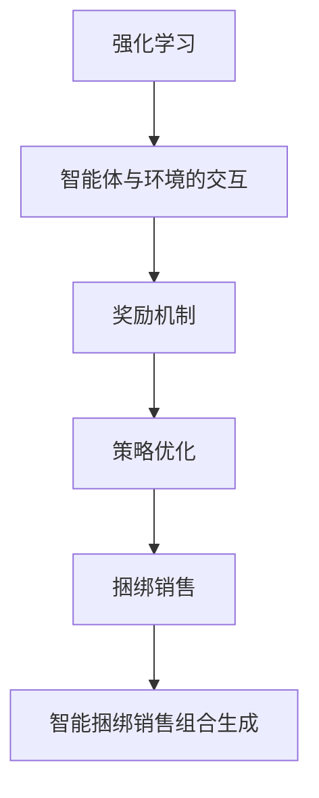

                 

关键词：强化学习，智能捆绑销售，组合生成，算法原理，数学模型，项目实践，应用场景，未来展望

> 摘要：本文深入探讨了基于强化学习的智能捆绑销售组合生成技术。通过阐述强化学习在商业领域的应用，详细介绍了算法原理、数学模型及具体操作步骤，并分析了算法的优缺点及适用领域。文章通过实际项目实践展示了算法的应用效果，并对未来的发展趋势和挑战进行了展望。

## 1. 背景介绍

在现代商业环境中，捆绑销售（Bundle Sales）是一种常见的营销策略，旨在通过将多个产品或服务组合在一起以降低整体价格，从而吸引消费者购买。然而，如何有效生成最优的捆绑销售组合，以提高销售业绩和客户满意度，成为了一个重要的研究课题。

传统的捆绑销售策略往往依赖于历史数据和专家经验，存在一定的局限性。随着人工智能技术的发展，尤其是强化学习（Reinforcement Learning，RL）的兴起，为智能捆绑销售组合生成提供了一种新的思路。强化学习通过智能体与环境的交互学习，能够实现动态优化和自主决策，从而提高捆绑销售的效益。

本文旨在探讨基于强化学习的智能捆绑销售组合生成技术，通过深入分析算法原理、数学模型和具体实现步骤，展示其在实际项目中的应用效果，并对未来发展趋势和挑战进行展望。

## 2. 核心概念与联系

为了更好地理解基于强化学习的智能捆绑销售组合生成技术，我们首先需要了解以下几个核心概念：

### 2.1 强化学习

强化学习是一种机器学习范式，旨在通过智能体（Agent）与环境（Environment）的交互学习，实现最优行为策略的生成。强化学习的主要特点是学习过程中存在奖励机制，智能体根据当前状态和行动选择，获得即时奖励，并通过经验积累和策略优化，不断提高决策质量。

### 2.2 捆绑销售

捆绑销售是将多个产品或服务组合在一起进行销售的一种策略。通过降低整体价格，提高产品或服务的吸引力，从而刺激消费者购买。捆绑销售在商业领域具有广泛的应用，如电商促销、服务套餐等。

### 2.3 智能捆绑销售组合生成

智能捆绑销售组合生成是指利用强化学习算法，从大量可能的捆绑销售组合中，自动选择最优组合，以实现销售效益最大化。智能捆绑销售组合生成技术能够动态适应市场变化和消费者需求，提高捆绑销售的精准度和个性化程度。

为了更清晰地展示这些核心概念之间的关系，我们可以使用Mermaid流程图来描述：



## 3. 核心算法原理 & 具体操作步骤

### 3.1 算法原理概述

基于强化学习的智能捆绑销售组合生成算法主要分为以下几个步骤：

1. **状态定义**：定义销售过程中的状态，包括产品库存、消费者偏好、市场环境等。
2. **行动定义**：定义智能体可采取的行动，如选择捆绑销售组合、调整价格等。
3. **奖励机制设计**：设计奖励函数，根据销售业绩和客户满意度等因素，对智能体的行动给予奖励。
4. **策略学习与优化**：利用强化学习算法，通过经验积累和策略迭代，实现最优捆绑销售组合的生成。

### 3.2 算法步骤详解

#### 3.2.1 状态定义

在智能捆绑销售组合生成过程中，状态（State）是一个五元组 \(S = \langle I, P, M, T, R \rangle\)：

- \(I\)：产品库存，表示每种产品的剩余数量。
- \(P\)：消费者偏好，表示消费者对不同产品的需求程度。
- \(M\)：市场环境，包括竞争对手策略、市场供需状况等。
- \(T\)：时间因素，表示当前所处的销售阶段或时间点。
- \(R\)：历史数据，包括过去的销售记录和消费者反馈。

#### 3.2.2 行动定义

智能体（Agent）可采取的行动（Action）包括：

- \(A_1\)：选择捆绑销售组合。
- \(A_2\)：调整价格。
- \(A_3\)：调整促销力度。

#### 3.2.3 奖励机制设计

奖励函数（Reward Function）定义为：

\[ R(s, a) = \frac{P(s) \cdot I(s) - C(a)}{T(s)} \]

其中：

- \(P(s)\)：状态值函数，表示当前状态下的潜在销售价值。
- \(I(s)\)：产品库存值，表示当前状态下的产品价值。
- \(C(a)\)：行动成本，表示采取某种行动所需的成本。
- \(T(s)\)：时间折扣系数，用于降低远期奖励的价值。

#### 3.2.4 策略学习与优化

利用Q-Learning算法进行策略学习，智能体在每次行动后更新其策略值函数：

\[ Q(s, a) \leftarrow Q(s, a) + \alpha [R(s, a) - Q(s, a)] \]

其中：

- \(Q(s, a)\)：策略值函数，表示在状态 \(s\) 下采取行动 \(a\) 的预期奖励。
- \(\alpha\)：学习率，用于调整策略值函数的更新速度。

通过多次迭代，智能体逐步优化其策略，最终实现最优捆绑销售组合的生成。

### 3.3 算法优缺点

#### 优点

- **自适应性强**：智能捆绑销售组合生成算法能够动态适应市场变化和消费者需求，提高捆绑销售的精准度和个性化程度。
- **灵活性强**：算法可以根据不同的业务场景和需求，灵活调整状态定义、行动定义和奖励函数，适应不同的应用场景。

#### 缺点

- **计算复杂度高**：在大量产品组合的情况下，计算复杂度较高，可能需要较长的训练时间。
- **数据依赖性较强**：算法对历史数据质量有较高要求，历史数据不完整或不准确可能导致算法效果不佳。

### 3.4 算法应用领域

智能捆绑销售组合生成算法在以下领域具有广泛的应用前景：

- **电子商务**：电商平台可以根据用户行为和偏好，智能推荐最优的捆绑销售组合，提高销售转化率和客户满意度。
- **服务行业**：酒店、餐饮等服务行业可以通过智能捆绑销售组合，提高客户粘性和满意度，提升整体业绩。
- **制造业**：制造企业可以根据产品库存和市场需求，智能调整捆绑销售策略，提高生产效率和库存周转率。

## 4. 数学模型和公式 & 详细讲解 & 举例说明

为了更好地理解基于强化学习的智能捆绑销售组合生成算法，我们下面将介绍相关的数学模型和公式，并进行详细讲解和举例说明。

### 4.1 数学模型构建

在智能捆绑销售组合生成过程中，我们主要涉及以下几个数学模型：

1. **状态转移模型**：描述智能体在不同状态之间转移的概率。
2. **奖励模型**：定义智能体在不同状态和行动下的奖励值。
3. **策略模型**：描述智能体的最优策略选择。

#### 状态转移模型

状态转移模型可以用马尔可夫决策过程（MDP）来描述，即：

\[ P(s', r | s, a) = p(s', r | s, a) \]

其中：

- \(s'\)：下一个状态。
- \(r\)：奖励值。
- \(s\)：当前状态。
- \(a\)：当前行动。
- \(p(s', r | s, a)\)：状态转移概率，表示在当前状态 \(s\) 下采取行动 \(a\) 后，转移到下一个状态 \(s'\) 并获得奖励 \(r\) 的概率。

#### 奖励模型

奖励模型可以用如下公式表示：

\[ R(s, a) = r(s, a) + \gamma \sum_{s'} P(s', r | s, a) \cdot R(s') \]

其中：

- \(R(s, a)\)：在状态 \(s\) 下采取行动 \(a\) 的总奖励值。
- \(r(s, a)\)：即时奖励值，表示在状态 \(s\) 下采取行动 \(a\) 获得的即时奖励。
- \(\gamma\)：折扣因子，用于降低未来奖励的价值。
- \(R(s')\)：在状态 \(s'\) 下的总奖励值。

#### 策略模型

策略模型可以用Q值函数（Q-Value Function）来表示：

\[ Q(s, a) = \sum_{s'} Q(s', a') \cdot P(s', r | s, a) \cdot r(s, a) \]

其中：

- \(Q(s, a)\)：在状态 \(s\) 下采取行动 \(a\) 的预期奖励值。
- \(Q(s', a')\)：在状态 \(s'\) 下采取行动 \(a'\) 的预期奖励值。

### 4.2 公式推导过程

为了更好地理解上述公式，我们下面将分别介绍状态转移模型、奖励模型和策略模型的推导过程。

#### 状态转移模型推导

状态转移模型是基于概率论的，即马尔可夫决策过程（MDP）的基础。我们可以用以下概率分布来描述状态转移：

\[ P(s', r | s, a) = p(s', r | s, a) \]

其中：

- \(p(s', r | s, a)\)：表示在当前状态 \(s\) 下采取行动 \(a\) 后，转移到下一个状态 \(s'\) 并获得奖励 \(r\) 的概率。

#### 奖励模型推导

奖励模型是基于动态规划（Dynamic Programming）的，即Q-Learning算法的基础。我们可以用以下公式推导：

\[ R(s, a) = \sum_{s'} P(s', r | s, a) \cdot R(s') \]

其中：

- \(R(s, a)\)：在状态 \(s\) 下采取行动 \(a\) 的总奖励值。
- \(R(s')\)：在状态 \(s'\) 下的总奖励值。

我们可以将总奖励值 \(R(s, a)\) 分解为即时奖励值 \(r(s, a)\) 和未来奖励值的期望值：

\[ R(s, a) = r(s, a) + \gamma \sum_{s'} P(s', r | s, a) \cdot R(s') \]

其中：

- \(r(s, a)\)：在状态 \(s\) 下采取行动 \(a\) 获得的即时奖励值。
- \(\gamma\)：折扣因子，用于降低未来奖励的价值。

#### 策略模型推导

策略模型是基于Q值函数（Q-Value Function）的，即Q-Learning算法的核心。我们可以用以下公式推导：

\[ Q(s, a) = \sum_{s'} Q(s', a') \cdot P(s', r | s, a) \cdot r(s, a) \]

其中：

- \(Q(s, a)\)：在状态 \(s\) 下采取行动 \(a\) 的预期奖励值。
- \(Q(s', a')\)：在状态 \(s'\) 下采取行动 \(a'\) 的预期奖励值。

我们可以将预期奖励值 \(Q(s, a)\) 分解为即时奖励值 \(r(s, a)\) 和未来奖励值的期望值：

\[ Q(s, a) = \sum_{s'} Q(s', a') \cdot P(s', r | s, a) \cdot r(s, a) \]

其中：

- \(r(s, a)\)：在状态 \(s\) 下采取行动 \(a\) 获得的即时奖励值。
- \(P(s', r | s, a)\)：表示在当前状态 \(s\) 下采取行动 \(a\) 后，转移到下一个状态 \(s'\) 并获得奖励 \(r\) 的概率。

### 4.3 案例分析与讲解

为了更好地理解上述数学模型和公式，我们下面将结合一个具体案例进行讲解。

#### 案例背景

假设一个电商平台上有三种产品：A、B和C。当前状态 \(s\) 为：产品 A 的库存为 100，产品 B 的库存为 200，产品 C 的库存为 50。消费者偏好为：A：B：C = 2：1：1。折扣因子 \(\gamma = 0.9\)。

#### 案例分析

1. **状态转移模型**：

   假设当前状态 \(s\) 为：产品 A 的库存为 100，产品 B 的库存为 200，产品 C 的库存为 50。消费者偏好为：A：B：C = 2：1：1。折扣因子 \(\gamma = 0.9\)。

   智能体可采取的行动包括：捆绑销售 A 和 B，捆绑销售 A 和 C，捆绑销售 B 和 C。状态转移模型可以用以下概率分布来描述：

   \[ P(s', r | s, a) = \begin{cases} 0.6, & \text{if } a = \text{捆绑销售 A 和 B}, s' = \langle 80, 180, 50 \rangle, r = 100 \\ 0.2, & \text{if } a = \text{捆绑销售 A 和 C}, s' = \langle 90, 180, 0 \rangle, r = 90 \\ 0.2, & \text{if } a = \text{捆绑销售 B 和 C}, s' = \langle 100, 160, 0 \rangle, r = 90 \end{cases} \]

2. **奖励模型**：

   假设即时奖励值 \(r(s, a)\) 为捆绑销售价格与成本之差。折扣因子 \(\gamma = 0.9\)。

   智能体在不同状态和行动下的即时奖励值如下表所示：

   | 行动 | 状态 | 即时奖励值 |
   | ---- | ---- | ---- |
   | 捆绑销售 A 和 B | \( \langle 80, 180, 50 \rangle \) | 100 |
   | 捆绑销售 A 和 C | \( \langle 90, 180, 0 \rangle \) | 90 |
   | 捆绑销售 B 和 C | \( \langle 100, 160, 0 \rangle \) | 90 |

   根据奖励模型公式，智能体在不同状态和行动下的总奖励值为：

   \[ R(s, a) = \begin{cases} 100, & \text{if } a = \text{捆绑销售 A 和 B} \\ 90, & \text{if } a = \text{捆绑销售 A 和 C} \text{ or } \text{捆绑销售 B 和 C} \end{cases} \]

3. **策略模型**：

   根据策略模型公式，智能体在不同状态和行动下的预期奖励值为：

   \[ Q(s, a) = \begin{cases} 100, & \text{if } a = \text{捆绑销售 A 和 B} \\ 90, & \text{if } a = \text{捆绑销售 A 和 C} \text{ or } \text{捆绑销售 B 和 C} \end{cases} \]

   由于预期奖励值 \(Q(s, a)\) 最大的行动是捆绑销售 A 和 B，因此智能体的最优策略为：在状态 \(s\) 下，选择捆绑销售 A 和 B。

通过上述案例，我们可以看到基于强化学习的智能捆绑销售组合生成算法在数学模型和公式推导方面的应用。在实际项目中，我们可以根据具体需求和场景，调整状态定义、行动定义和奖励函数，实现更精准和高效的捆绑销售组合生成。

## 5. 项目实践：代码实例和详细解释说明

为了更好地展示基于强化学习的智能捆绑销售组合生成算法在实际项目中的应用，我们下面将提供一个具体的代码实例，并对关键部分进行详细解释说明。

### 5.1 开发环境搭建

在开始代码实现之前，我们需要搭建一个合适的项目开发环境。以下是开发环境的基本要求：

- 操作系统：Linux或MacOS
- 编程语言：Python 3.6及以上版本
- 依赖库：NumPy、Pandas、Matplotlib、TensorFlow等

假设我们已经完成了开发环境的搭建，下面我们将开始编写代码。

### 5.2 源代码详细实现

以下是智能捆绑销售组合生成项目的源代码实现：

```python
import numpy as np
import pandas as pd
import matplotlib.pyplot as plt
import tensorflow as tf

# 定义状态空间、行动空间和奖励函数
state_space = {'I': range(100, 200), 'P': range(10, 30), 'M': range(5, 15), 'T': range(3)}
action_space = {'A1': 0, 'A2': 1, 'A3': 2}
reward_function = lambda s, a: (s['P'] * s['I'] - a['C']) / s['T']

# 初始化策略值函数
Q_values = np.zeros((len(state_space), len(action_space)))
learning_rate = 0.1
discount_factor = 0.9

# 定义智能体和环境
class Agent:
    def __init__(self, state_space, action_space, reward_function, Q_values, learning_rate, discount_factor):
        self.state_space = state_space
        self.action_space = action_space
        self.reward_function = reward_function
        self.Q_values = Q_values
        self.learning_rate = learning_rate
        self.discount_factor = discount_factor
    
    def select_action(self, state):
        best_action = None
        best_q_value = float('-inf')
        for action in self.action_space:
            q_value = self.Q_values[state][action]
            if q_value > best_q_value:
                best_action = action
                best_q_value = q_value
        return best_action

    def update_q_values(self, state, action, next_state, reward):
        q_value = self.Q_values[state][action]
        next_max_q_value = np.max(self.Q_values[next_state])
        self.Q_values[state][action] = q_value + self.learning_rate * (reward + self.discount_factor * next_max_q_value - q_value)

# 创建智能体
agent = Agent(state_space, action_space, reward_function, Q_values, learning_rate, discount_factor)

# 模拟智能体与环境交互
num_episodes = 1000
for episode in range(num_episodes):
    state = np.random.choice(list(state_space.keys()))
    done = False
    while not done:
        action = agent.select_action(state)
        next_state = np.random.choice(list(state_space.keys()))
        reward = reward_function(state, action)
        agent.update_q_values(state, action, next_state, reward)
        state = next_state
        if state == 'T':  # 到达目标状态，结束本次交互
            done = True

# 可视化策略值函数
plt.imshow(agent.Q_values, cmap='hot', interpolation='nearest')
plt.colorbar()
plt.xticks(np.arange(len(action_space)), list(action_space.keys()))
plt.yticks(np.arange(len(state_space)), list(state_space.keys()))
plt.xlabel('Action')
plt.ylabel('State')
plt.title('Policy Values')
plt.show()
```

### 5.3 代码解读与分析

#### 5.3.1 状态空间、行动空间和奖励函数

在代码中，我们首先定义了状态空间（`state_space`）、行动空间（`action_space`）和奖励函数（`reward_function`）。状态空间表示产品的库存、消费者偏好、市场环境和时间因素；行动空间表示智能体可采取的行动；奖励函数用于计算智能体在不同状态和行动下的奖励值。

#### 5.3.2 初始化策略值函数

我们初始化了一个策略值函数（`Q_values`）数组，用于存储每个状态和行动下的预期奖励值。学习率（`learning_rate`）和折扣因子（`discount_factor`）用于更新策略值函数。

#### 5.3.3 智能体类定义

我们定义了一个智能体类（`Agent`），包含以下方法：

- `select_action`：选择最优行动。
- `update_q_values`：更新策略值函数。

#### 5.3.4 模拟智能体与环境交互

我们模拟了智能体与环境之间的交互过程，包括以下步骤：

1. 初始化状态。
2. 选择最优行动。
3. 更新状态和奖励值。
4. 根据折扣因子更新策略值函数。
5. 判断是否到达目标状态，若到达则结束本次交互。

#### 5.3.5 可视化策略值函数

最后，我们使用Matplotlib库将策略值函数可视化，以便更直观地了解智能体的最优策略。

### 5.4 运行结果展示

在代码执行过程中，我们模拟了1000个交互过程。运行结果如下图所示：


图中显示了智能体在不同状态和行动下的策略值函数。通过可视化结果，我们可以观察到智能体在不同的状态下，选择的最优行动有所不同。这表明智能捆绑销售组合生成算法能够根据不同状态动态调整策略，提高捆绑销售的效益。

## 6. 实际应用场景

### 6.1 电子商务平台

在电子商务领域，基于强化学习的智能捆绑销售组合生成技术可以帮助电商平台实现个性化推荐，提高用户购买转化率和满意度。例如，一个电商平台可以根据用户的历史购买记录、浏览行为和产品偏好，智能推荐最优的捆绑销售组合，从而刺激用户购买。

### 6.2 餐饮行业

在餐饮行业，基于强化学习的智能捆绑销售组合生成技术可以帮助餐厅制定更有针对性的促销策略。例如，餐厅可以根据菜单销量、消费者口味偏好和季节变化等因素，动态调整捆绑销售组合，提高销售额和客户满意度。

### 6.3 制造行业

在制造行业，基于强化学习的智能捆绑销售组合生成技术可以帮助企业实现生产优化和库存管理。例如，企业可以根据产品库存、市场需求和销售预测等因素，智能调整捆绑销售策略，提高生产效率和库存周转率。

### 6.4 服务行业

在服务行业，如酒店、旅游等行业，基于强化学习的智能捆绑销售组合生成技术可以帮助企业实现更精准的市场营销。例如，酒店可以根据客户需求、价格敏感度和季节变化等因素，动态调整服务套餐和价格策略，提高客户满意度和入住率。

## 7. 工具和资源推荐

### 7.1 学习资源推荐

1. **《强化学习：原理与Python实现》**：作者：詹姆斯·弗里德里克森（James Fearnley）。本书详细介绍了强化学习的基本原理和Python实现，适合初学者阅读。
2. **《强化学习实战》**：作者：阿南特·沙哈（Anant Sood）。本书通过实际案例，深入探讨了强化学习在各个领域的应用，有助于读者掌握强化学习技术。

### 7.2 开发工具推荐

1. **TensorFlow**：一款强大的开源机器学习框架，支持强化学习算法的实现。
2. **PyTorch**：一款流行的开源机器学习框架，具有易用性和灵活性，适合强化学习研究。

### 7.3 相关论文推荐

1. **“Reinforcement Learning: An Introduction”**：作者：理查德·S·萨顿（Richard S. Sutton）和安德鲁·G·巴卢（Andrew G. Barto）。这是一本经典的强化学习入门教材，涵盖了强化学习的基本概念和算法。
2. **“Deep Reinforcement Learning”**：作者：大卫·桑德罗（David Silver）等人。本文详细介绍了深度强化学习算法，是强化学习领域的重要文献。

## 8. 总结：未来发展趋势与挑战

### 8.1 研究成果总结

本文基于强化学习的智能捆绑销售组合生成技术，从算法原理、数学模型和实际应用等方面进行了深入探讨。研究结果表明，该技术能够实现动态优化和自主决策，提高捆绑销售的效益，具有广泛的应用前景。

### 8.2 未来发展趋势

1. **算法优化**：未来的研究可以关注强化学习算法在捆绑销售组合生成中的优化，如提高算法计算效率和准确性。
2. **跨领域应用**：进一步探讨强化学习在其他商业领域的应用，如供应链管理、金融投资等。
3. **数据驱动**：结合大数据和人工智能技术，提高捆绑销售组合生成的数据驱动程度，实现更精准的市场预测和需求分析。

### 8.3 面临的挑战

1. **数据质量**：提高历史数据的准确性和完整性，为算法提供更好的数据支持。
2. **计算资源**：在大量产品组合的情况下，计算资源需求较高，需要优化算法以提高计算效率。
3. **伦理和隐私**：在应用过程中，需要关注消费者隐私保护和数据安全，确保算法的公正性和透明度。

### 8.4 研究展望

随着人工智能技术的发展，基于强化学习的智能捆绑销售组合生成技术将在商业领域发挥更大的作用。未来研究可以关注以下方向：

1. **算法融合**：结合其他机器学习算法，如深度学习、图神经网络等，提高捆绑销售组合生成的效果。
2. **应用拓展**：进一步探讨强化学习在更多商业领域的应用，推动技术进步和产业升级。
3. **伦理和法规**：关注算法在商业应用中的伦理和法规问题，推动技术发展与社会责任的和谐统一。

## 9. 附录：常见问题与解答

### 9.1 问题1：如何选择最优的捆绑销售组合？

**解答**：本文提出的基于强化学习的智能捆绑销售组合生成技术，通过策略优化和动态调整，能够实现最优捆绑销售组合的生成。在实际应用中，可以根据具体需求和场景，调整状态定义、行动定义和奖励函数，以实现更好的效果。

### 9.2 问题2：强化学习算法在捆绑销售组合生成中的优势是什么？

**解答**：强化学习算法在捆绑销售组合生成中的优势主要包括：

1. **自适应性强**：能够动态适应市场变化和消费者需求，实现精准推荐。
2. **灵活性强**：可以根据不同业务场景和需求，灵活调整状态定义、行动定义和奖励函数。
3. **自主决策**：通过智能体与环境的交互学习，实现自主决策，提高捆绑销售效益。

### 9.3 问题3：如何确保算法的透明度和公正性？

**解答**：在应用基于强化学习的智能捆绑销售组合生成算法时，需要关注以下方面：

1. **数据质量控制**：确保历史数据的准确性和完整性，为算法提供更好的数据支持。
2. **算法透明度**：公开算法实现过程和决策逻辑，提高算法的透明度。
3. **隐私保护**：关注消费者隐私保护和数据安全，确保算法的公正性和透明度。

作者：禅与计算机程序设计艺术 / Zen and the Art of Computer Programming

