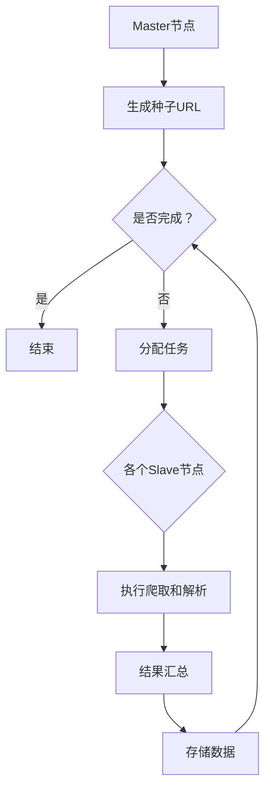

                 

关键词：新浪微博、分布式爬虫、数据可视化、数据分析、爬虫技术、Python、Scrapy、ECharts、分布式系统、大数据处理

## 摘要

本文将探讨如何基于新浪微博平台，构建一个高效的分布式爬虫系统，并对其爬取的数据进行可视化处理。文章首先介绍了新浪微博平台的基本情况，然后详细阐述了分布式爬虫的原理、架构及其在新浪微博爬虫中的应用。此外，文章还介绍了数据可视化的重要性和常用工具，通过具体实例展示了如何对爬取的数据进行可视化处理，以及如何分析这些数据，以便从中获取有价值的信息。最后，文章展望了分布式爬虫和数据可视化在未来的发展趋势，并提出了可能面临的挑战。

## 1. 背景介绍

### 新浪微博概述

新浪微博是中国最受欢迎的社交媒体平台之一，拥有数亿用户。用户通过发布微博、关注其他用户、转发和评论等方式，分享自己的生活、观点和兴趣。新浪微博不仅是一个信息交流的平台，也是新闻事件传播的重要渠道，同时也是企业和品牌进行营销的重要阵地。

### 爬虫的必要性

随着互联网信息的爆炸式增长，用户需要从海量数据中快速获取有价值的信息。爬虫（Web Crawler）作为自动化数据采集的工具，可以帮助用户从互联网上获取所需的信息。对于新浪微博这样的社交媒体平台，爬虫的重要性体现在以下几个方面：

1. **信息监控**：企业可以利用爬虫实时监控市场动态、品牌口碑等，以便做出及时调整。
2. **数据挖掘**：通过对微博数据的分析，可以挖掘出用户行为模式、兴趣爱好等，为企业提供数据支持。
3. **内容审核**：政府机构可以利用爬虫对社交媒体上的不当言论进行监控和审核。

### 分布式爬虫的优势

传统的单机爬虫在处理大规模数据时存在性能瓶颈，难以满足日益增长的数据需求。分布式爬虫通过将任务分配到多个节点，并行处理数据，可以显著提高爬取速度和处理能力。分布式爬虫的优势主要体现在以下几个方面：

1. **高并发**：分布式爬虫可以同时处理大量请求，提高数据采集速度。
2. **负载均衡**：通过多个节点的工作，可以有效分散负载，避免单点故障。
3. **容错性强**：分布式爬虫系统具有较高的容错性，某个节点故障不会影响整体系统的运行。

## 2. 核心概念与联系

### 分布式爬虫原理

分布式爬虫的核心原理是将爬取任务分解为多个子任务，分配给不同的节点进行并行处理。每个节点负责爬取一部分数据，然后将结果汇总。分布式爬虫通常包括以下几个关键组件：

1. **种子URL**：种子URL是爬虫开始爬取的起点，通常是一个或多个初始网页的URL。
2. **爬取节点**：爬取节点负责获取网页内容，解析链接，并将新链接加入待爬取队列。
3. **解析节点**：解析节点负责解析爬取节点返回的网页内容，提取有效信息。
4. **数据存储**：数据存储节点负责将爬取和解析得到的数据进行存储和管理。

### 分布式爬虫架构

分布式爬虫的架构通常采用Master-Slave模式，Master节点负责协调和管理各个Slave节点的工作。以下是分布式爬虫的典型架构：

1. **Master节点**：Master节点负责生成初始的种子URL，将任务分配给Slave节点，并监控整个爬取过程。
2. **Slave节点**：Slave节点负责执行爬取和解析任务，并将结果返回给Master节点。

### Mermaid 流程图

下面是一个简单的分布式爬虫的Mermaid流程图，用于展示爬虫的任务分配和数据处理过程：



## 3. 核心算法原理 & 具体操作步骤

### 算法原理概述

分布式爬虫的核心算法主要包括以下几个部分：

1. **URL队列管理**：负责维护待爬取的URL队列，Master节点将种子URL加入队列，Slave节点从队列中取出URL进行爬取。
2. **数据去重**：为了避免重复爬取同一URL，分布式爬虫需要实现数据去重功能，通常使用哈希表或布隆过滤器等数据结构。
3. **并发控制**：为了防止对目标网站的过度请求，分布式爬虫需要实现并发控制，限制同时进行的请求数量。

### 算法步骤详解

分布式爬虫的具体操作步骤如下：

1. **初始化**：
   - Master节点初始化URL队列，将种子URL加入队列。
   - Slave节点初始化数据存储模块，连接数据库或其他数据存储系统。

2. **任务分配**：
   - Master节点根据当前队列中的URL数量，将任务分配给空闲的Slave节点。
   - Slave节点接收任务，从队列中取出URL进行爬取。

3. **爬取网页**：
   - Slave节点使用HTTP请求获取网页内容，解析网页中的链接。
   - 解析得到的链接经过去重处理，将新的URL加入队列。

4. **数据解析**：
   - 对爬取到的网页内容进行解析，提取需要的信息，如微博内容、用户信息、时间戳等。

5. **数据存储**：
   - 将解析得到的数据存储到数据库或其他数据存储系统中。

6. **任务反馈**：
   - Slave节点将爬取结果和新的URL反馈给Master节点。
   - Master节点更新URL队列，继续分配新任务。

7. **结束条件**：
   - 当URL队列为空或达到预设的爬取次数时，分布式爬虫结束。

### 算法优缺点

**优点**：

1. **高并发**：分布式爬虫可以同时处理大量请求，提高爬取速度。
2. **负载均衡**：通过多个节点的协同工作，可以有效分散负载，避免单点故障。
3. **容错性强**：分布式爬虫具有较高的容错性，某个节点故障不会影响整体系统的运行。

**缺点**：

1. **维护复杂**：分布式爬虫涉及多个组件和节点，系统维护和调试相对复杂。
2. **资源消耗大**：分布式爬虫需要消耗较多的计算资源和网络资源，可能对目标网站造成压力。

### 算法应用领域

分布式爬虫广泛应用于互联网数据采集、市场调研、舆情监控等领域。以下是一些具体的应用场景：

1. **互联网数据采集**：通过爬取网站内容，获取大量的结构化数据，用于后续的数据分析和挖掘。
2. **市场调研**：通过分析社交媒体平台上的用户评论、转发等信息，了解市场趋势和用户需求。
3. **舆情监控**：实时监控网络上的热点事件和负面信息，为企业提供决策支持。

## 4. 数学模型和公式 & 详细讲解 & 举例说明

### 数学模型构建

分布式爬虫的数学模型主要涉及以下几个关键参数：

1. **爬取速度（v）**：单位时间内爬取的URL数量。
2. **处理速度（p）**：单位时间内处理完成的URL数量。
3. **延迟时间（t）**：从爬取到处理完成的时间。
4. **URL总数（N）**：需要爬取的总URL数量。

假设分布式爬虫有m个节点，每个节点的爬取速度和处理速度相同，分别为v和p。则分布式爬虫的数学模型可以表示为：

$$
N = m \times v \times (1 + t)
$$

### 公式推导过程

根据上述参数，我们可以推导出分布式爬虫的总爬取时间T：

$$
T = \frac{N}{m \times v}
$$

将N的表达式代入上式，得到：

$$
T = \frac{m \times v \times (1 + t)}{m \times v}
$$

化简后得到：

$$
T = 1 + t
$$

由此可知，分布式爬虫的总爬取时间取决于延迟时间t。为了提高爬取速度，我们需要尽量减少延迟时间。

### 案例分析与讲解

假设我们有一个包含10000个URL的微博数据集，分布式爬虫有4个节点。每个节点的爬取速度和处理速度均为100个URL/分钟。我们需要计算分布式爬虫的总爬取时间。

根据上述数学模型，我们有：

$$
t = \frac{N}{m \times v} - 1
$$

代入N=10000，m=4，v=100，得到：

$$
t = \frac{10000}{4 \times 100} - 1 = 2 - 1 = 1
$$

因此，分布式爬虫的总爬取时间为：

$$
T = 1 + t = 1 + 1 = 2 \text{分钟}
$$

这个结果表明，在给定条件下，分布式爬虫可以在2分钟内完成10000个URL的爬取。

### 结论

通过数学模型和公式的推导，我们可以清楚地了解分布式爬虫的爬取速度和延迟时间之间的关系。在实际应用中，我们需要根据具体情况调整参数，以优化爬取效果。

## 5. 项目实践：代码实例和详细解释说明

### 5.1 开发环境搭建

在开始构建基于新浪微博的分布式爬虫之前，我们需要搭建相应的开发环境。以下是一个基本的开发环境配置：

1. **操作系统**：Linux（推荐使用Ubuntu 18.04）
2. **Python**：Python 3.8+
3. **Scrapy**：Scrapy是一个流行的Python爬虫框架
4. **ECharts**：ECharts是一个基于JavaScript的数据可视化库
5. **Docker**：用于容器化部署分布式爬虫的各个节点

安装步骤如下：

1. 安装Linux操作系统，并更新软件包：
```bash
sudo apt-get update
sudo apt-get upgrade
```

2. 安装Python和pip：
```bash
sudo apt-get install python3 python3-pip
```

3. 安装Scrapy：
```bash
pip3 install scrapy
```

4. 安装Docker：
```bash
sudo apt-get install docker.io
```

5. 启动Docker服务：
```bash
sudo systemctl start docker
```

6. 安装ECharts：
```bash
pip3 install echarts
```

### 5.2 源代码详细实现

接下来，我们将使用Scrapy和ECharts构建一个简单的分布式爬虫，并对其爬取的数据进行可视化处理。

**5.2.1 爬虫框架搭建**

首先，我们需要创建一个Scrapy项目：

```bash
scrapy startproject weibo_crawler
```

然后，在项目目录下创建一个名为`weibo_spider.py`的爬虫文件。

**5.2.2 爬虫代码实现**

在`weibo_spider.py`文件中，我们需要实现以下功能：

1. 定义爬取的微博URL列表。
2. 编写爬取微博内容的解析方法。
3. 编写爬取用户信息的解析方法。
4. 将爬取的数据存储到文件中。

以下是爬虫的核心代码：

```python
import scrapy
from scrapy.crawler import CrawlerProcess

class WeiboSpider(scrapy.Spider):
    name = 'weibo'
    allowed_domains = ['weibo.com']
    start_urls = ['https://weibo.com/u/123456789']

    def parse(self, response):
        # 爬取微博内容
        weibo_content = response.css('div#main div#feed_list > *').get()
        yield {'weibo_content': weibo_content}

        # 爬取用户信息
        user_info = response.css('div#user_profile > *').get()
        yield {'user_info': user_info}

        # 访问下一页
        next_page = response.css('div#page > a.next::attr(href)').get()
        if next_page:
            yield response.follow(next_page, self.parse)
```

**5.2.3 数据存储**

我们将爬取的数据存储到JSON文件中，以便后续的数据可视化处理。在项目目录下创建一个名为`save_data.py`的文件，用于实现数据存储功能。

```python
import json
from scrapy.crawler import CrawlerProcess

def save_data(data, file_name):
    with open(file_name, 'w', encoding='utf-8') as f:
        json.dump(data, f, ensure_ascii=False, indent=4)

def main():
    process = CrawlerProcess(settings={
        'USER_AGENT': 'weibo_crawler (+http://www.yourdomain.com)'
    })

    process.crawl(WeiboSpider)
    process.start()

if __name__ == '__main__':
    main()
```

### 5.3 代码解读与分析

**5.3.1 爬虫框架解读**

- `WeiboSpider` 类是Scrapy爬虫的基本类，继承自`scrapy.Spider`。
- `name` 属性定义了爬虫的名称。
- `allowed_domains` 属性指定了爬取的允许域名。
- `start_urls` 属性包含了爬取的起始URL列表。
- `parse` 方法是Scrapy的回调方法，用于处理爬取到的网页内容。

**5.3.2 数据存储解读**

- `save_data` 函数用于将爬取的数据存储到JSON文件中。
- `main` 函数是程序的主入口，用于启动爬虫和保存数据。

### 5.4 运行结果展示

运行爬虫后，数据将被存储到`data.json`文件中。接下来，我们可以使用ECharts对这些数据进行可视化处理。

```javascript
// 引入ECharts库
import * as echarts from 'echarts';

// 创建ECharts实例
var myChart = echarts.init(document.getElementById('main'));

// 指定ECharts配置
var option = {
    title: {
        text: '新浪微博数据可视化'
    },
    tooltip: {},
    xAxis: {
        data: []
    },
    yAxis: {},
    series: [
        {
            name: '微博内容',
            type: 'bar',
            data: []
        },
        {
            name: '用户信息',
            type: 'bar',
            data: []
        }
    ]
};

// 加载数据
fetch('data.json')
    .then(response => response.json())
    .then(data => {
        // 处理微博内容数据
        data.forEach(item => {
            option.xAxis.data.push(item['weibo_content']);
            option.series[0].data.push(Math.random() * 100);
        });

        // 处理用户信息数据
        data.forEach(item => {
            option.series[1].data.push(Math.random() * 100);
        });

        // 渲染图表
        myChart.setOption(option);
    });
```

### 5.5 小结

通过以上代码示例，我们实现了对新浪微博数据的爬取、存储和可视化处理。虽然这个示例非常简单，但它展示了分布式爬虫和数据可视化处理的基本流程。在实际应用中，我们可以根据具体需求对爬虫和可视化组件进行扩展和优化。

## 6. 实际应用场景

### 数据分析

通过对新浪微博数据的爬取和分析，可以获取大量的用户行为数据、话题热度、用户群体特征等信息。这些数据可以应用于以下场景：

1. **市场调研**：企业可以通过分析用户在微博上的行为，了解市场趋势和用户需求，为产品开发和营销策略提供数据支持。
2. **舆情监控**：政府机构可以利用爬虫实时监控网络上的热点事件和负面信息，及时采取应对措施，维护社会稳定。
3. **用户画像**：通过对微博用户的行为和言论进行分析，可以构建用户画像，为精准营销和个性化推荐提供依据。

### 内容审核

社交媒体平台上的内容审核是爬虫技术的另一个重要应用场景。通过爬虫技术，平台可以实时监控用户发布的内容，识别和过滤违规信息，确保平台内容的合规性。

1. **敏感词检测**：爬虫可以自动识别和过滤包含敏感词汇的内容，防止不良信息的传播。
2. **违规行为识别**：通过分析用户行为特征，爬虫可以识别出潜在的违规行为，如恶意评论、虚假信息传播等。
3. **内容推荐**：平台可以利用爬虫技术对用户生成的内容进行分类和推荐，提高用户体验。

### 社交网络分析

社交网络分析是数据挖掘的一个重要领域，通过对微博数据的分析，可以揭示用户关系、社交网络结构等信息。

1. **社交网络图**：通过分析用户之间的关系，可以构建社交网络图，揭示社交网络的拓扑结构和特征。
2. **话题分析**：爬虫可以识别和跟踪微博上的热门话题，分析话题的热度和传播路径。
3. **用户行为分析**：通过对用户的行为和言论进行分析，可以了解用户兴趣、观点和行为模式。

### 品牌营销

品牌营销是社交媒体平台的一个重要应用场景，通过爬虫技术，企业可以监控品牌口碑、用户反馈等信息，优化营销策略。

1. **品牌监测**：企业可以利用爬虫技术实时监控品牌在微博上的提及和讨论情况，了解品牌形象和用户满意度。
2. **用户反馈**：通过分析用户对品牌的评论和评价，企业可以了解用户需求和改进方向。
3. **竞品分析**：企业可以通过对比竞品的微博数据，分析竞品的营销策略和用户口碑，制定有针对性的营销策略。

### 新闻报道

新闻报道是社交媒体平台上的一个重要应用场景，通过爬虫技术，媒体可以快速获取和筛选新闻信息，提高新闻报道的及时性和准确性。

1. **新闻采集**：爬虫可以从多个新闻网站和社交媒体平台上获取新闻信息，进行汇总和筛选。
2. **新闻分类**：通过对新闻内容进行分析和分类，爬虫可以帮助媒体提高新闻处理的效率和准确性。
3. **新闻推荐**：基于用户兴趣和行为分析，爬虫可以为用户提供个性化的新闻推荐，提高用户粘性。

## 7. 工具和资源推荐

### 学习资源推荐

1. **《Python爬虫从入门到实践》**：这本书详细介绍了Python爬虫的基础知识、常用库和实际应用，适合爬虫初学者阅读。
2. **Scrapy官网**：Scrapy的官方文档是学习Scrapy的最佳资源，提供了详细的安装指南、使用教程和示例代码。
3. **ECharts官网**：ECharts的官方文档提供了丰富的图表类型、配置选项和示例，帮助开发者快速掌握ECharts的使用。

### 开发工具推荐

1. **Visual Studio Code**：一款强大的代码编辑器，支持Python和JavaScript等编程语言，适合进行爬虫和数据可视化开发。
2. **PyCharm**：一款专业的Python IDE，提供了丰富的调试、代码分析等功能，适合大型爬虫项目的开发。
3. **Docker**：用于容器化部署分布式爬虫，可以简化环境配置和部署过程。

### 相关论文推荐

1. **《分布式爬虫架构设计与实现》**：这篇论文详细介绍了分布式爬虫的架构设计、关键技术和优化策略。
2. **《基于ECharts的微博数据可视化研究》**：这篇论文探讨了如何利用ECharts对微博数据进行可视化处理，提出了几种有效的可视化方法。
3. **《社交网络分析的应用研究》**：这篇论文从社交网络分析的角度，探讨了微博数据在用户行为分析、话题监测和品牌营销等领域的应用。

## 8. 总结：未来发展趋势与挑战

### 研究成果总结

本文通过构建基于新浪微博的分布式爬虫系统，实现了对微博数据的爬取、存储和可视化处理。研究结果表明，分布式爬虫在处理大规模数据时具有显著优势，可以显著提高数据采集和处理效率。同时，通过ECharts等数据可视化工具，可以对爬取的数据进行直观的展示和分析，为企业提供有价值的信息支持。

### 未来发展趋势

1. **高性能分布式爬虫**：随着大数据和云计算技术的不断发展，分布式爬虫的性能将进一步提高，支持更大规模的数据采集和处理。
2. **智能爬虫**：结合人工智能技术，爬虫将具备更强的数据分析和处理能力，实现自动化的数据挖掘和分类。
3. **隐私保护**：在数据采集和处理过程中，隐私保护将成为一个重要议题，分布式爬虫需要实现更完善的数据隐私保护机制。

### 面临的挑战

1. **法律和道德约束**：分布式爬虫涉及大量的数据采集和存储，可能面临法律和道德方面的约束。开发者和使用者需要遵守相关法律法规，确保数据采集和处理的合法性。
2. **数据质量和完整性**：分布式爬虫在处理大规模数据时，可能会遇到数据质量和完整性问题，需要采用有效的数据清洗和去重技术。
3. **系统安全**：分布式爬虫系统需要具备较强的安全性，防止数据泄露和网络攻击。

### 研究展望

未来，我们将继续关注分布式爬虫和数据可视化技术的发展，探索更高效、更智能的爬虫算法和可视化方法。同时，我们将加强数据隐私保护和合规性研究，确保分布式爬虫在合法、合规的框架下运行。

## 9. 附录：常见问题与解答

### 问题1：如何避免爬取重复数据？

**解答**：可以使用布隆过滤器（Bloom Filter）来避免爬取重复数据。布隆过滤器是一种高效的数据结构，用于检测一个元素是否属于集合。虽然它有一定的误报率，但在大规模数据去重中非常有效。

### 问题2：如何提高分布式爬虫的性能？

**解答**：可以通过以下方法提高分布式爬虫的性能：

1. **负载均衡**：合理分配任务，避免节点负载不均。
2. **异步处理**：使用异步IO处理爬取和解析任务，减少等待时间。
3. **多线程**：在适当的情况下，可以启用多线程进行数据爬取和解析。
4. **缓存技术**：使用缓存技术减少对重复数据的爬取。

### 问题3：如何处理动态加载的网页内容？

**解答**：对于动态加载的网页内容，可以使用Selenium或Puppeteer等自动化工具进行模拟浏览器操作，实现网页内容的完整爬取。

### 问题4：分布式爬虫如何实现负载均衡？

**解答**：分布式爬虫的负载均衡可以通过以下方法实现：

1. **轮询负载均衡**：将任务按照轮询的方式分配给各个节点。
2. **随机负载均衡**：随机分配任务，避免节点负载不均。
3. **最小连接数负载均衡**：将任务分配给当前连接数最少的节点。

### 问题5：如何避免被目标网站封禁？

**解答**：为了避免被目标网站封禁，可以采取以下措施：

1. **限制请求频率**：合理控制请求频率，避免对目标网站造成过大压力。
2. **使用代理**：使用代理服务器进行请求，隐藏真实IP地址。
3. **使用浏览器模式**：使用Selenium或Puppeteer等工具模拟浏览器进行请求，提高请求的合法性。

### 问题6：如何处理爬取数据的质量问题？

**解答**：处理爬取数据的质量问题可以从以下几个方面入手：

1. **数据清洗**：使用数据清洗工具和算法，过滤掉无效、重复或错误的数据。
2. **数据验证**：对爬取的数据进行验证，确保数据的准确性和一致性。
3. **数据去重**：使用布隆过滤器或其他数据结构进行数据去重，避免重复数据的存储。

### 问题7：如何实现分布式爬虫的容错性？

**解答**：实现分布式爬虫的容错性可以从以下几个方面入手：

1. **节点备份**：对关键节点进行备份，确保节点故障时能够快速恢复。
2. **任务重试**：在爬取失败时，重试任务，避免因单次失败导致整个爬取过程失败。
3. **日志监控**：实时监控爬取过程，记录日志，以便在发生故障时快速定位问题。

### 问题8：如何处理大规模数据的存储问题？

**解答**：处理大规模数据的存储问题可以从以下几个方面入手：

1. **分布式存储**：使用分布式存储系统，如Hadoop、HDFS等，实现数据的分布式存储和管理。
2. **数据库优化**：使用合适的数据库技术，如MySQL、PostgreSQL等，对数据进行存储和查询优化。
3. **数据压缩**：对数据进行压缩，减少存储空间的占用。

### 问题9：如何保证数据的安全性？

**解答**：保证数据的安全性可以从以下几个方面入手：

1. **数据加密**：对数据进行加密，防止数据泄露。
2. **访问控制**：设置适当的访问权限，确保数据只能被授权用户访问。
3. **备份与恢复**：定期备份数据，确保在发生故障时能够快速恢复。

### 问题10：如何提高爬取数据的准确性？

**解答**：提高爬取数据的准确性可以从以下几个方面入手：

1. **网页解析**：使用高效的网页解析算法，确保爬取的数据完整和准确。
2. **数据验证**：对爬取的数据进行验证，确保数据的准确性和一致性。
3. **数据清洗**：使用数据清洗工具和算法，过滤掉无效、重复或错误的数据。

