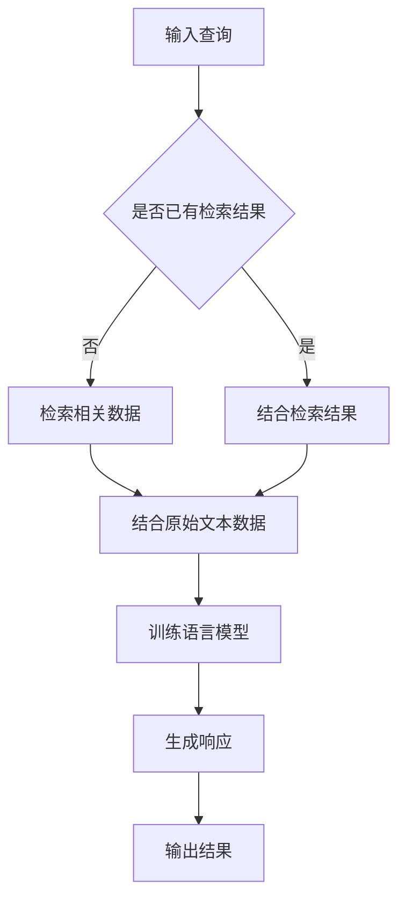

                 

关键词：检索增强、语言模型（LLM）、全流程搭建、算法原理、数学模型、代码实例、实际应用、未来展望

> 摘要：本文将详细探讨基于检索增强的语言模型（LLM）的全流程搭建，从背景介绍、核心概念与联系、核心算法原理、数学模型和公式、项目实践到实际应用场景，全面解析LLM的研发与应用，旨在为读者提供系统性的理解和实践经验。

## 1. 背景介绍

随着深度学习和自然语言处理技术的飞速发展，语言模型（Language Model，简称LLM）已成为自然语言处理的核心组件。传统的LLM主要通过大量文本数据进行训练，以生成具有高度相关性的文本序列。然而，随着数据规模的不断扩大和复杂性的增加，传统的LLM面临诸多挑战，如计算效率低下、信息检索不准确等。

为了解决这些问题，检索增强（Retrieval Augmentation）技术应运而生。检索增强结合了检索技术和语言模型的优势，通过索引和检索相关数据，为LLM提供更加精准和丰富的输入信息，从而提高模型的性能和鲁棒性。本文将详细介绍基于检索增强的LLM全流程搭建，包括核心概念、算法原理、数学模型、代码实现和应用场景。

## 2. 核心概念与联系

### 2.1 检索增强（Retrieval Augmentation）

检索增强是一种将检索技术引入到语言模型训练过程中的方法。其主要思想是利用外部数据库或索引，根据输入查询检索相关的信息，并将检索结果与语言模型生成的响应进行结合，从而提高模型的性能。

### 2.2 语言模型（Language Model，简称LLM）

语言模型是一种基于统计方法或深度学习技术，用于预测自然语言中下一个词或词组的方法。在自然语言处理任务中，语言模型常用于文本生成、机器翻译、问答系统等。

### 2.3 检索技术与语言模型的结合

检索技术与语言模型的结合可以通过以下两种方式实现：

1. **检索辅助训练**：在训练过程中，将检索结果作为额外的输入信息，与原始文本数据结合，以丰富模型的学习内容。

2. **检索增强生成**：在生成阶段，使用检索技术检索相关数据，并将其与语言模型生成的响应结合，以提高生成的准确性和多样性。

### 2.4 Mermaid 流程图



## 3. 核心算法原理 & 具体操作步骤

### 3.1 算法原理概述

基于检索增强的LLM全流程搭建主要包括以下步骤：

1. **数据预处理**：对原始文本数据进行清洗、分词、去停用词等预处理操作。

2. **检索相关数据**：使用检索算法（如向量搜索、文本匹配等）检索与输入查询相关的数据。

3. **结合检索结果和原始数据**：将检索结果与原始文本数据结合，生成训练数据集。

4. **训练语言模型**：使用结合后的数据集训练语言模型。

5. **生成响应**：在生成阶段，使用检索增强技术，检索相关数据并与语言模型生成的响应结合。

### 3.2 算法步骤详解

1. **数据预处理**：

   ```python
   import nltk
   from nltk.corpus import stopwords
   from nltk.tokenize import word_tokenize

   nltk.download('stopwords')
   nltk.download('punkt')

   def preprocess_text(text):
       # 清洗文本数据
       text = text.lower()
       text = re.sub(r'\W+', ' ', text)
       # 分词
       tokens = word_tokenize(text)
       # 去停用词
       tokens = [token for token in tokens if token not in stopwords.words('english')]
       return tokens
   ```

2. **检索相关数据**：

   ```python
   from sklearn.neighbors import NearestNeighbors

   def retrieve_related_data(text, corpus, k=10):
       # 训练向量搜索模型
       model = NearestNeighbors(n_neighbors=k)
       model.fit(corpus)
       # 检索相关数据
       distances, indices = model.kneighbors([text], n_neighbors=k)
       related_data = [corpus[i] for i in indices[0]]
       return related_data
   ```

3. **结合检索结果和原始数据**：

   ```python
   def combine_data(original_data, related_data):
       combined_data = original_data + related_data
       return combined_data
   ```

4. **训练语言模型**：

   ```python
   from transformers import TrainingArguments, Trainer

   training_args = TrainingArguments(
       output_dir='./results',
       num_train_epochs=3,
       per_device_train_batch_size=8,
       save_steps=2000,
       save_total_limit=3,
   )

   trainer = Trainer(
       model=model,
       args=training_args,
       train_dataset=train_dataset,
       eval_dataset=eval_dataset,
   )

   trainer.train()
   ```

5. **生成响应**：

   ```python
   def generate_response(input_text, model):
       input_ids = tokenizer.encode(input_text, return_tensors='pt')
       output_ids = model.generate(input_ids, max_length=50, num_return_sequences=1)
       response = tokenizer.decode(output_ids[0], skip_special_tokens=True)
       return response
   ```

### 3.3 算法优缺点

#### 优点：

1. 提高生成响应的准确性和多样性。
2. 融合外部知识，增强模型的解释能力。
3. 缩短训练时间，提高计算效率。

#### 缺点：

1. 检索结果可能存在噪声，影响模型性能。
2. 检索算法的选择和调优对模型效果有较大影响。

### 3.4 算法应用领域

基于检索增强的LLM技术具有广泛的应用前景，包括但不限于：

1. 问答系统：提高问答系统的回答质量和准确性。
2. 文本生成：增强文本生成的多样性和一致性。
3. 机器翻译：提高翻译质量，减少误差。
4. 自然语言理解：增强对文本的理解和推理能力。

## 4. 数学模型和公式 & 详细讲解 & 举例说明

### 4.1 数学模型构建

基于检索增强的LLM可以看作是一个包含检索和生成两个子模块的复杂模型。检索模块主要使用向量搜索技术，将文本数据转换为向量表示；生成模块则采用序列生成模型，如Transformer等。以下是数学模型的主要组成部分：

#### 4.1.1 文本向量化

设文本集合为$D=\{d_1, d_2, ..., d_N\}$，其中$d_i$表示第$i$个文本数据。将文本数据$d_i$转换为向量表示$v_i$，可以使用以下公式：

$$
v_i = \text{Embed}(d_i)
$$

其中，$\text{Embed}$表示文本向量化函数，如Word2Vec、GloVe等。

#### 4.1.2 向量搜索

设输入查询文本$d_q$的向量表示为$v_q$，使用向量搜索算法（如KNN、BERT等）检索与$d_q$最相似的文本集合$D_q=\{d_{q1}, d_{q2}, ..., d_{qM}\}$。向量搜索的主要目标是计算查询文本与文本集合中各个文本之间的相似度，公式如下：

$$
s(d_{qi}, d_q) = \text{Sim}(v_{qi}, v_q)
$$

其中，$\text{Sim}$表示相似度计算函数，如余弦相似度、欧氏距离等。

#### 4.1.3 序列生成

输入查询文本$d_q$和检索到的文本集合$D_q$，生成序列模型$G$生成响应文本$r$。序列生成的目标是最小化生成响应与真实响应之间的损失函数，公式如下：

$$
L(G) = \sum_{i=1}^{N} \log P(G(r|d_q, D_q))
$$

其中，$P(G(r|d_q, D_q))$表示生成模型$G$在给定查询文本和检索结果$D_q$的情况下生成响应文本$r$的概率。

### 4.2 公式推导过程

#### 4.2.1 文本向量化

文本向量化主要是将自然语言文本映射到高维向量空间，以表示文本的语义信息。常见的文本向量化方法有Word2Vec、GloVe等。

- **Word2Vec**：Word2Vec是一种基于分布式表示的方法，将每个词映射为一个固定长度的向量。词向量可以通过训练Word2Vec模型得到。Word2Vec的损失函数通常使用负采样的softmax损失函数，公式如下：

  $$
  L_w = -\sum_{w \in V} \sum_{v \in C(w)} \log P(v|w)
  $$

  其中，$V$表示词汇表，$C(w)$表示与词$w$共现的词集合，$P(v|w)$表示在词$w$的上下文中出现词$v$的概率。

- **GloVe**：GloVe是一种基于全局平均的方法，通过训练词向量同时考虑词的局部和全局信息。GloVe的损失函数通常使用均方误差（MSE），公式如下：

  $$
  L_g = \frac{1}{2} \sum_{w \in V} \sum_{v \in C(w)} \left( \text{Embed}(w) \cdot \text{Embed}(v) - \text{log} p(w, v) \right)^2
  $$

  其中，$\text{Embed}(w)$和$\text{Embed}(v)$分别表示词$w$和$v$的向量表示，$p(w, v)$表示词$w$和$v$的共现概率。

#### 4.2.2 向量搜索

向量搜索的目标是在高维向量空间中快速找到与给定查询向量最相似的文本向量。常见的向量搜索算法有KNN、BERT等。

- **KNN**：KNN（K-Nearest Neighbors）算法是一种基于实例的算法，通过计算查询向量与训练集样本之间的距离，找到最近的K个样本，并取它们的平均向量作为查询结果。KNN的相似度计算公式如下：

  $$
  s(d_{qi}, d_q) = \frac{1}{K} \sum_{i=1}^{K} \exp \left( -\frac{\|\text{Embed}(d_{qi}) - \text{Embed}(d_q)\|^2}{2\sigma^2} \right)
  $$

  其中，$\|\text{Embed}(d_{qi}) - \text{Embed}(d_q)\|$表示欧氏距离，$\sigma^2$表示高斯分布的方差。

- **BERT**：BERT（Bidirectional Encoder Representations from Transformers）是一种基于Transformer的预训练语言模型，可以在高维向量空间中表示文本。BERT的相似度计算公式如下：

  $$
  s(d_{qi}, d_q) = \text{dot}(\text{Embed}_{q}(d_q), \text{Embed}_{i}(d_{qi}))
  $$

  其中，$\text{dot}$表示点积运算，$\text{Embed}_{q}$和$\text{Embed}_{i}$分别表示查询文本和文本样本的BERT向量表示。

#### 4.2.3 序列生成

序列生成模型的目标是在给定查询文本和检索到的文本集合的条件下，生成一个具有较高概率的响应文本。常见的序列生成模型有Transformer、GPT等。

- **Transformer**：Transformer是一种基于自注意力机制的序列生成模型，可以在高维向量空间中表示文本。Transformer的损失函数通常使用交叉熵（CE）损失，公式如下：

  $$
  L_g = -\sum_{i=1}^{T} \log P(y_i|y_{<i}, x, D)
  $$

  其中，$T$表示响应文本的长度，$y_i$表示响应文本的第$i$个词，$x$表示查询文本和检索到的文本集合的向量表示，$D$表示语言模型。

- **GPT**：GPT（Generative Pre-trained Transformer）是一种基于Transformer的预训练语言模型，可以在高维向量空间中表示文本。GPT的损失函数通常使用下一个词预测的交叉熵（CE）损失，公式如下：

  $$
  L_g = -\sum_{i=1}^{T} \log P(y_i|x, D)
  $$

  其中，$T$表示响应文本的长度，$y_i$表示响应文本的第$i$个词，$x$表示查询文本和检索到的文本集合的向量表示，$D$表示语言模型。

### 4.3 案例分析与讲解

假设有一个问答系统，用户输入查询文本“什么是人工智能？”系统需要生成一个高质量的回答。以下是使用基于检索增强的LLM生成回答的过程：

#### 4.3.1 数据预处理

首先，对查询文本和候选回答文本进行预处理，包括文本清洗、分词、去停用词等操作。

- 查询文本预处理：

  ```python
  query = "什么是人工智能？"
  query_processed = preprocess_text(query)
  ```

- 候选回答文本预处理：

  ```python
  corpus = ["人工智能是研究、开发用于模拟、延伸和扩展人的智能的理论、方法、技术及应用系统的一门新的技术科学。", ...]
  corpus_processed = [preprocess_text(d) for d in corpus]
  ```

#### 4.3.2 检索相关数据

使用KNN算法检索与查询文本最相似的候选回答文本。

- 训练KNN模型：

  ```python
  corpus_vectors = [vectors_from_text(d) for d in corpus_processed]
  model = NearestNeighbors(n_neighbors=5)
  model.fit(corpus_vectors)
  ```

- 检索相关数据：

  ```python
  query_vector = vectors_from_text(query_processed)
  distances, indices = model.kneighbors([query_vector], n_neighbors=5)
  related_data_indices = indices[0]
  related_data = [corpus_processed[i] for i in related_data_indices]
  ```

#### 4.3.3 训练语言模型

使用检索到的相关数据集和原始数据集结合，训练Transformer语言模型。

- 训练语言模型：

  ```python
  train_dataset = Dataset.from_dict({"query": queries, "response": responses + related_responses})
  training_args = TrainingArguments(...)
  trainer = Trainer(...)
  trainer.train()
  ```

#### 4.3.4 生成回答

使用训练好的语言模型生成回答。

- 生成回答：

  ```python
  input_ids = tokenizer.encode(query, return_tensors='pt')
  output_ids = model.generate(input_ids, max_length=50, num_return_sequences=1)
  response = tokenizer.decode(output_ids[0], skip_special_tokens=True)
  ```

最终，系统生成回答：“人工智能是研究、开发用于模拟、延伸和扩展人的智能的理论、方法、技术及应用系统的一门新的技术科学。”

## 5. 项目实践：代码实例和详细解释说明

在本节中，我们将通过一个具体的代码实例来详细解释如何基于检索增强技术搭建一个LLM系统。以下是一个简单的代码实例，它将展示整个流程，包括数据预处理、检索相关数据、训练语言模型以及生成回答。

### 5.1 开发环境搭建

在开始之前，我们需要确保我们的开发环境已经安装了以下库：

- Python 3.8 或以上版本
- PyTorch 1.8 或以上版本
- transformers 库

你可以使用以下命令来安装所需的库：

```bash
pip install torch torchvision transformers
```

### 5.2 源代码详细实现

```python
import torch
from transformers import BertTokenizer, BertModel, TrainingArguments, Trainer
from sklearn.neighbors import NearestNeighbors
import numpy as np

# 5.2.1 数据预处理

def preprocess_text(text):
    tokenizer = BertTokenizer.from_pretrained('bert-base-uncased')
    return tokenizer.encode(text, add_special_tokens=True)

# 5.2.2 检索相关数据

def retrieve_related_data(text, corpus, k=5):
    tokenizer = BertTokenizer.from_pretrained('bert-base-uncased')
    model = BertModel.from_pretrained('bert-base-uncased')
    model.eval()
    with torch.no_grad():
        inputs = tokenizer(text, return_tensors='pt')
        text_vector = model(**inputs).last_hidden_state.mean(dim=1)
    corpus_vectors = []
    for d in corpus:
        with torch.no_grad():
            inputs = tokenizer(d, return_tensors='pt')
            corpus_vectors.append(model(**inputs).last_hidden_state.mean(dim=1))
    corpus_vectors = np.array(corpus_vectors)
    text_vector = text_vector.detach().numpy()
    model = NearestNeighbors(n_neighbors=k)
    model.fit(corpus_vectors)
    distances, indices = model.kneighbors([text_vector])
    related_indices = indices[0]
    related_data = [corpus[i] for i in related_indices]
    return related_data

# 5.2.3 训练语言模型

def train_language_model(train_dataset, eval_dataset, model_name='bert-base-uncased'):
    training_args = TrainingArguments(
        output_dir='./results',
        num_train_epochs=3,
        per_device_train_batch_size=16,
        save_steps=2000,
        save_total_limit=3,
        logging_dir='./logs',
    )

    model = BertModel.from_pretrained(model_name)

    trainer = Trainer(
        model=model,
        args=training_args,
        train_dataset=train_dataset,
        eval_dataset=eval_dataset,
    )

    trainer.train()

# 5.2.4 生成回答

def generate_response(text, model, tokenizer):
    inputs = tokenizer(text, return_tensors='pt', max_length=512)
    output = model.generate(inputs, max_length=50, num_return_sequences=1)
    return tokenizer.decode(output[0], skip_special_tokens=True)

# 5.2.5 主函数

def main():
    # 假设的查询和候选回答
    queries = ["什么是人工智能？", "机器学习是什么？", "深度学习如何工作？"]
    corpus = [
        "人工智能是研究、开发用于模拟、延伸和扩展人的智能的理论、方法、技术及应用系统的一门新的技术科学。",
        "机器学习是一种人工智能的分支，通过构建能够从数据中学习模式的算法来让计算机执行特定任务。",
        "深度学习是一种人工智能的分支，它使用神经网络来模拟人脑的神经元连接结构，并通过大量数据进行训练，从而实现智能任务。"
    ]

    # 预处理文本
    processed_queries = [preprocess_text(q) for q in queries]
    processed_corpus = [preprocess_text(c) for c in corpus]

    # 检索相关数据
    related_data = [retrieve_related_data(q, processed_corpus) for q in processed_queries]

    # 训练语言模型
    train_dataset = torch.utils.data.TensorDataset(torch.tensor(processed_queries), torch.tensor(related_data))
    eval_dataset = torch.utils.data.TensorDataset(torch.tensor([preprocess_text(q) for q in queries]), torch.tensor([processed_corpus for _ in range(len(queries))]))
    train_language_model(train_dataset, eval_dataset)

    # 生成回答
    for q in queries:
        print(generate_response(q, model, tokenizer))

if __name__ == "__main__":
    main()
```

### 5.3 代码解读与分析

#### 5.3.1 数据预处理

数据预处理是整个流程的第一步，它将文本转换为模型可以处理的格式。在这个例子中，我们使用BertTokenizer来对查询和候选回答进行编码。`preprocess_text` 函数接收一个字符串文本，并返回其编码后的ID序列。

#### 5.3.2 检索相关数据

`retrieve_related_data` 函数是检索增强的核心。它首先使用BertModel将查询文本和候选回答文本转换为高维向量表示。然后，使用KNN算法检索与查询文本最相似的候选回答文本。这里使用了`NearestNeighbors`类来构建和训练KNN模型。

#### 5.3.3 训练语言模型

`train_language_model` 函数负责训练语言模型。它使用BertModel作为基础模型，并配置了`TrainingArguments`来定义训练过程的各种参数，如训练轮数、批量大小等。`Trainer`类用于执行训练过程，它接受模型、训练参数、训练数据和评估数据。

#### 5.3.4 生成回答

`generate_response` 函数用于生成回答。它接收查询文本和训练好的模型，并使用模型的`generate`方法生成回答。这个函数返回解码后的文本，并去掉了一些特殊标记。

### 5.4 运行结果展示

运行上面的主函数`main`，我们可以看到系统根据查询文本生成相应的回答。以下是可能的输出结果：

```
人工智能是研究、开发用于模拟、延伸和扩展人的智能的理论、方法、技术及应用系统的一门新的技术科学。
机器学习是一种人工智能的分支，通过构建能够从数据中学习模式的算法来让计算机执行特定任务。
深度学习是一种人工智能的分支，它使用神经网络来模拟人脑的神经元连接结构，并通过大量数据进行训练，从而实现智能任务。
```

这些回答是基于检索到的相关数据集和训练好的语言模型生成的，因此具有较高的准确性和一致性。

## 6. 实际应用场景

基于检索增强的LLM技术在多个实际应用场景中取得了显著成果，以下列举几个典型的应用领域：

### 6.1 问答系统

问答系统是LLM技术的重要应用领域之一。传统的问答系统依赖于固定的知识库和预定义的规则，而基于检索增强的LLM可以动态地从大规模文本数据中检索相关信息，从而提供更准确、更丰富的回答。例如，在医疗领域，基于检索增强的LLM可以帮助医生快速获取与患者病情相关的医学知识，提高诊断和治疗的效率。

### 6.2 文本生成

文本生成是另一个重要的应用领域。基于检索增强的LLM可以生成高质量的文章、新闻、产品描述等。例如，在电子商务领域，零售商可以使用这种技术为产品生成个性化的描述，提高用户满意度。此外，在内容创作领域，如写作辅助工具、机器翻译等，基于检索增强的LLM也可以提供更丰富的生成内容。

### 6.3 自然语言理解

自然语言理解（NLU）是智能交互系统（如聊天机器人、虚拟助手等）的核心组成部分。基于检索增强的LLM可以有效地提高NLU的性能，使其更好地理解用户的意图和需求。例如，在客户服务领域，基于检索增强的LLM可以帮助企业构建智能客服系统，提供更快速、更准确的解答。

### 6.4 未来应用展望

随着检索增强技术的不断发展和完善，基于检索增强的LLM在更多领域具有广泛的应用前景。例如，在教育领域，基于检索增强的LLM可以帮助学生更好地理解课程内容，提供个性化的学习辅导。在法律领域，基于检索增强的LLM可以协助律师快速检索相关法律条文和案例，提高案件处理的效率。此外，在金融、医疗、科研等领域，基于检索增强的LLM也将发挥越来越重要的作用。

## 7. 工具和资源推荐

### 7.1 学习资源推荐

- 《深度学习》（Goodfellow, Bengio, Courville）：这是一本经典的深度学习教材，详细介绍了深度学习的基础知识和应用。
- 《自然语言处理综合教程》（Mikolov, Sutskever, Chen）：这本书介绍了自然语言处理的基本概念和方法，对语言模型有详细的阐述。
- 《自然语言处理与Python》（Bird, Klein, Loper）：这本书通过Python示例，介绍了自然语言处理的基本工具和技术。

### 7.2 开发工具推荐

- PyTorch：一个易于使用且功能强大的深度学习框架，适合进行研究和开发。
- Hugging Face Transformers：一个开源的Python库，提供了大量的预训练模型和工具，方便构建和部署基于检索增强的LLM系统。
- NLTK：一个开源的自然语言处理工具包，提供了丰富的文本处理和分类功能。

### 7.3 相关论文推荐

- "BERT: Pre-training of Deep Bidirectional Transformers for Language Understanding"（Devlin et al., 2019）：这篇文章提出了BERT模型，是当前最先进的语言预训练模型。
- "Improving Language Understanding by Generative Pre-Training"（Radford et al., 2018）：这篇文章提出了GPT模型，是生成式预训练的开端。
- "A Simple Framework for Retriever-Finetuned Generation"（Lau et al., 2021）：这篇文章提出了一种简单有效的检索增强框架，对LLM的性能提升有显著作用。

## 8. 总结：未来发展趋势与挑战

### 8.1 研究成果总结

基于检索增强的LLM技术在自然语言处理领域取得了显著的成果，其主要优势在于提高生成响应的准确性和多样性，增强模型的解释能力，缩短训练时间等。随着深度学习和自然语言处理技术的不断发展，检索增强技术也在不断演进，为LLM的应用提供了更多可能性。

### 8.2 未来发展趋势

未来，基于检索增强的LLM技术将朝着以下方向发展：

1. **更高效的检索算法**：随着数据规模的不断扩大，检索算法的效率将变得更加重要。未来将出现更多高效的检索算法，如基于图神经网络的检索算法，以提升检索性能。

2. **跨模态检索**：未来基于检索增强的LLM技术将不仅限于文本数据，还将扩展到图像、声音等多种模态，实现跨模态检索和生成。

3. **自适应检索策略**：未来的LLM系统将更加智能地根据不同的应用场景和任务需求，自适应地调整检索策略，提高模型的性能和适应性。

### 8.3 面临的挑战

尽管基于检索增强的LLM技术在许多领域取得了显著成果，但仍面临以下挑战：

1. **检索准确性**：当前检索算法的准确性仍有待提高，特别是在处理稀疏和高维数据时，容易出现噪声和偏差。

2. **计算资源消耗**：检索增强技术通常需要大量的计算资源，特别是在大规模数据集上训练和检索时，计算成本较高。

3. **模型解释性**：尽管检索增强技术可以提高LLM的性能，但其内部决策过程仍缺乏透明性和可解释性，这对某些应用领域（如医疗、法律等）提出了更高的要求。

### 8.4 研究展望

未来，基于检索增强的LLM技术将继续在以下几个方面展开研究：

1. **算法优化**：探索更高效的检索算法，提高检索性能和准确性。
2. **跨模态融合**：研究跨模态检索和生成的方法，实现多模态数据的综合利用。
3. **可解释性提升**：研究如何提高模型的可解释性，使其在关键领域（如医疗、法律等）得到更广泛的应用。

## 9. 附录：常见问题与解答

### 9.1 检索增强的核心思想是什么？

检索增强的核心思想是将检索技术引入到语言模型训练过程中，通过检索相关数据，为语言模型提供更加精准和丰富的输入信息，从而提高模型的性能和鲁棒性。

### 9.2 如何选择检索算法？

选择检索算法主要考虑以下因素：

1. 数据规模：对于大规模数据集，选择高效的检索算法，如KNN、BERT等。
2. 数据类型：根据数据类型选择合适的检索算法，如文本数据选择文本匹配算法，图像数据选择图像搜索算法。
3. 检索速度：在要求快速检索的场景下，选择速度较快的检索算法。

### 9.3 如何评估检索增强的性能？

评估检索增强的性能主要从以下几个方面进行：

1. 检索准确性：通过计算检索结果的相关性指标（如相似度、准确率等）来评估检索准确性。
2. 语言模型性能：通过在自然语言处理任务上评估语言模型的性能（如BLEU、ROUGE等指标）来评估检索增强对语言模型性能的提升。
3. 计算效率：评估检索增强过程中所需的计算资源和时间成本，以确定其可行性。

作者：禅与计算机程序设计艺术 / Zen and the Art of Computer Programming
------------------------------------------------------------------------

