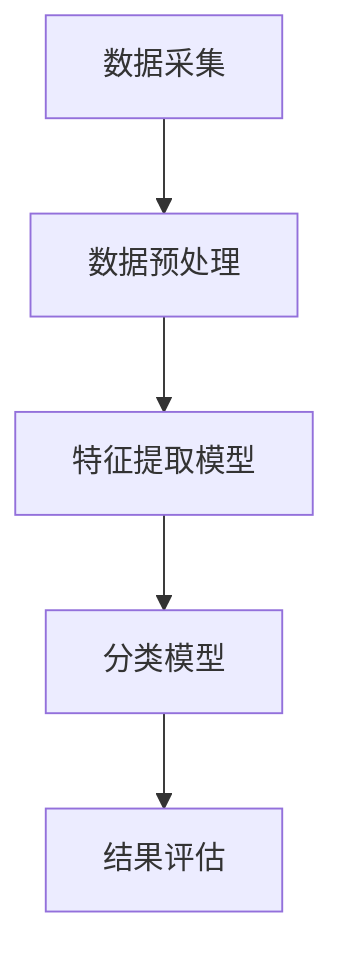

                 

关键词：深度学习，车辆特征识别，图像处理，机器学习，计算机视觉，人工智能，神经网络

## 摘要

本文将探讨基于深度学习的车辆特征识别技术的研究与实现。车辆特征识别是计算机视觉领域的一个重要研究方向，其在交通管理、智能交通系统、自动驾驶等多个领域具有重要应用价值。本文首先介绍了车辆特征识别的背景和意义，然后深入分析了基于深度学习的车辆特征识别的核心算法原理，包括卷积神经网络（CNN）和循环神经网络（RNN）的应用。随后，本文通过具体的数学模型和公式推导，展示了如何实现车辆特征提取和分类。最后，本文通过一个实际项目案例，详细讲解了车辆特征识别系统的开发过程，并探讨了其在实际应用场景中的价值。本文的研究成果将为车辆特征识别技术的发展提供新的思路和方向。

## 1. 背景介绍

### 车辆特征识别的概念与意义

车辆特征识别是指利用计算机视觉技术，从图像或视频中提取车辆的特征信息，并对其进行识别和分类的过程。车辆特征可以包括车辆类型、颜色、型号、车牌号码等多种信息。这些特征信息对于交通管理和智能交通系统具有重要意义，如通过车辆特征识别可以实时监测交通流量，优化交通信号控制，提高交通效率；在智能交通系统中，车辆特征识别技术可用于车辆定位、路径规划、拥堵预测等；在自动驾驶领域，车辆特征识别是实现自动驾驶车辆与其他道路用户交互、保障行车安全的重要手段。

### 车辆特征识别的应用领域

车辆特征识别技术在多个领域具有广泛的应用：

- **交通管理**：通过车辆特征识别技术，可以对城市交通流量进行实时监控和分析，为交通管理部门提供决策依据，优化交通信号控制，缓解交通拥堵。

- **智能交通系统**：在智能交通系统中，车辆特征识别技术可用于车辆定位、路径规划、拥堵预测等，提高交通系统的运行效率和安全性。

- **自动驾驶**：自动驾驶车辆需要实时识别和理解周围环境，车辆特征识别技术是实现自动驾驶车辆与其他道路用户交互、保障行车安全的关键技术。

- **车辆安全监控**：通过车辆特征识别技术，可以实现对车辆的实时监控，防止车辆被盗、违章行驶等。

- **车辆租赁与分时租赁**：通过车辆特征识别，可以实现对租赁车辆的精确管理和监控，提高运营效率。

### 车辆特征识别的现状与发展

近年来，随着深度学习技术的快速发展，车辆特征识别技术取得了显著进展。深度学习模型，尤其是卷积神经网络（CNN）和循环神经网络（RNN），在车辆特征识别任务中表现出色，已成为该领域的主流方法。此外，数据驱动的方法逐渐取代了传统的手工特征提取方法，使得车辆特征识别系统的性能得到了大幅提升。

目前，车辆特征识别技术在准确性、实时性和鲁棒性等方面仍然面临挑战。为了进一步提高识别性能，研究者们正在探索更加复杂的深度学习模型、数据增强技术以及多模态数据融合方法。同时，随着5G、物联网、人工智能等技术的不断发展，车辆特征识别技术将在未来得到更加广泛的应用。

## 2. 核心概念与联系

### 深度学习与车辆特征识别的关系

深度学习是一种基于多层神经网络的学习方法，通过多层非线性变换，从大量数据中自动提取特征，从而实现复杂函数的近似。深度学习在计算机视觉领域取得了突破性进展，为车辆特征识别提供了强大的工具。

在车辆特征识别中，深度学习模型可以自动提取图像中的车辆特征，如车辆轮廓、颜色、纹理等，从而实现车辆的分类和识别。与传统的特征提取方法相比，深度学习具有以下优势：

- **自动特征提取**：深度学习模型可以通过训练自动提取图像中的车辆特征，避免了手工设计特征的过程，提高了特征提取的效率和准确性。
- **多尺度特征分析**：深度学习模型可以同时处理图像中的不同尺度特征，从而更好地捕捉车辆的复杂特征。
- **鲁棒性**：深度学习模型具有较好的鲁棒性，可以在不同的光照、天气和场景条件下进行有效的车辆特征识别。

### 车辆特征识别的基本原理

车辆特征识别的基本原理包括以下几个步骤：

1. **图像预处理**：对采集的图像进行预处理，包括图像增强、去噪、灰度化等，以提高图像的质量和识别性能。
2. **特征提取**：利用深度学习模型从预处理后的图像中提取车辆特征。特征提取是车辆特征识别的核心步骤，提取到的特征应具有代表性、区分性和稳定性。
3. **特征分类**：将提取到的车辆特征输入分类模型，进行车辆类型的分类。分类模型可以是传统的机器学习算法，如支持向量机（SVM）、随机森林（RF）等，也可以是深度学习模型，如卷积神经网络（CNN）、循环神经网络（RNN）等。

### 车辆特征识别系统的架构

一个典型的车辆特征识别系统通常包括以下几个模块：

1. **数据采集**：采集包含车辆图像的数据集，用于训练和测试深度学习模型。
2. **数据预处理**：对采集到的数据集进行预处理，包括图像增强、去噪、灰度化等。
3. **特征提取模型**：利用深度学习模型提取车辆特征，如卷积神经网络（CNN）或循环神经网络（RNN）。
4. **分类模型**：将提取到的车辆特征输入分类模型，进行车辆类型的分类。
5. **结果评估**：评估车辆特征识别系统的性能，包括准确性、召回率、F1值等指标。

### Mermaid 流程图



## 3. 核心算法原理 & 具体操作步骤

### 3.1 算法原理概述

车辆特征识别的核心算法主要包括深度学习模型和分类模型。其中，深度学习模型用于提取图像特征，分类模型用于对提取到的特征进行分类。

深度学习模型：常用的深度学习模型包括卷积神经网络（CNN）和循环神经网络（RNN）。CNN适用于处理图像数据，通过卷积、池化等操作提取图像特征。RNN适用于处理序列数据，通过循环结构提取序列特征。

分类模型：分类模型用于对提取到的特征进行分类，常用的分类模型包括支持向量机（SVM）、随机森林（RF）和深度学习模型。

### 3.2 算法步骤详解

#### 3.2.1 数据采集

数据采集是车辆特征识别系统的第一步，采集到的数据集用于训练和测试深度学习模型。数据采集可以通过以下途径：

- **公开数据集**：如Kaggle、ImageNet等，这些数据集包含了丰富的车辆图像，可以直接用于训练模型。
- **自主采集**：使用摄像机或手机等设备，自主采集车辆图像数据。

#### 3.2.2 数据预处理

数据预处理是提高车辆特征识别性能的重要环节，主要包括图像增强、去噪、灰度化等操作。

- **图像增强**：通过调整亮度、对比度、饱和度等参数，提高图像质量，增强模型对图像特征的提取能力。
- **去噪**：通过滤波器去除图像中的噪声，提高图像清晰度。
- **灰度化**：将彩色图像转换为灰度图像，简化图像处理过程，提高模型训练速度。

#### 3.2.3 特征提取模型

特征提取模型是车辆特征识别系统的核心部分，常用的特征提取模型包括CNN和RNN。

- **CNN**：通过卷积层、池化层、全连接层等操作，从图像中提取特征。CNN具有层次化特征提取能力，能够自动学习图像中的多层次特征。
- **RNN**：通过循环结构，从图像序列中提取特征。RNN适用于处理时间序列数据，能够捕获图像序列中的时序信息。

#### 3.2.4 分类模型

分类模型用于对提取到的特征进行分类，常用的分类模型包括SVM、RF和深度学习模型。

- **SVM**：支持向量机是一种常用的分类算法，通过找到一个最佳的超平面，将不同类别的特征划分为不同的区域。
- **RF**：随机森林是一种基于决策树的集成学习方法，通过构建多个决策树，并进行集成学习，提高分类性能。
- **深度学习模型**：如CNN和RNN等，通过多层神经网络结构，对提取到的特征进行分类。

#### 3.2.5 结果评估

结果评估是评估车辆特征识别系统性能的重要环节，常用的评估指标包括准确性、召回率、F1值等。

- **准确性**：准确率是指正确识别的样本数占总样本数的比例，是评估分类模型性能的重要指标。
- **召回率**：召回率是指正确识别的样本数占实际为正类的样本数的比例，是评估模型对正类样本的识别能力。
- **F1值**：F1值是准确率和召回率的调和平均值，是评估分类模型性能的综合性指标。

### 3.3 算法优缺点

#### 优点

- **自动特征提取**：深度学习模型能够自动学习图像特征，避免了手工设计特征的过程，提高了特征提取的效率和准确性。
- **多尺度特征分析**：深度学习模型可以同时处理图像中的不同尺度特征，从而更好地捕捉车辆的复杂特征。
- **鲁棒性**：深度学习模型具有较好的鲁棒性，可以在不同的光照、天气和场景条件下进行有效的车辆特征识别。

#### 缺点

- **数据依赖性**：深度学习模型对训练数据量有较高的要求，数据不足可能导致模型过拟合。
- **计算资源消耗**：深度学习模型需要大量的计算资源和时间进行训练和推理，对硬件设备要求较高。
- **解释性较差**：深度学习模型黑箱性质较强，难以解释模型决策过程，不利于模型优化和改进。

### 3.4 算法应用领域

车辆特征识别算法在多个领域具有广泛的应用：

- **交通管理**：通过车辆特征识别技术，可以实时监测交通流量，优化交通信号控制，提高交通效率。
- **智能交通系统**：在智能交通系统中，车辆特征识别技术可用于车辆定位、路径规划、拥堵预测等，提高交通系统的运行效率和安全性。
- **自动驾驶**：自动驾驶车辆需要实时识别和理解周围环境，车辆特征识别技术是实现自动驾驶车辆与其他道路用户交互、保障行车安全的重要手段。
- **车辆安全监控**：通过车辆特征识别技术，可以实现对车辆的实时监控，防止车辆被盗、违章行驶等。
- **车辆租赁与分时租赁**：通过车辆特征识别，可以实现对租赁车辆的精确管理和监控，提高运营效率。

## 4. 数学模型和公式 & 详细讲解 & 举例说明

### 4.1 数学模型构建

车辆特征识别的数学模型主要包括特征提取模型和分类模型。下面将分别介绍这两个模型的数学模型构建。

#### 特征提取模型

特征提取模型通常采用卷积神经网络（CNN）或循环神经网络（RNN）。以下是CNN的特征提取模型的数学模型构建：

1. **输入层**：输入层接收原始图像数据，图像的每个像素值都可以被视为一个特征。

2. **卷积层**：卷积层通过卷积操作提取图像的特征。卷积层的输入是一个矩阵，输出是一个特征图。卷积操作的数学公式如下：

   $$ (f_{ij}^l = \sum_{i',j'} w_{i'j'i,j}^l * g_{i'j'}^l + b_l ) $$

   其中，$f_{ij}^l$ 表示输出特征图中的第i行第j列的像素值，$g_{i'j'}^l$ 表示输入特征图中的第i'行第j'列的像素值，$w_{i'j'i,j}^l$ 表示卷积核的权重，$b_l$ 表示偏置项。

3. **激活函数**：激活函数用于引入非线性变换，常用的激活函数有ReLU函数、Sigmoid函数和Tanh函数。

4. **池化层**：池化层用于降低特征图的维度，同时保留重要的特征信息。常用的池化操作有最大池化（Max Pooling）和平均池化（Average Pooling）。

5. **全连接层**：全连接层将特征图的所有像素值进行连接，形成一个一维的特征向量。

6. **输出层**：输出层根据特征向量进行分类，输出每个类别的概率分布。

#### 分类模型

分类模型通常采用支持向量机（SVM）、随机森林（RF）或深度学习模型。以下是SVM的分类模型的数学模型构建：

1. **特征空间映射**：将输入特征映射到高维特征空间，使得不同类别的特征能够更好地分离。

2. **寻找最优超平面**：在特征空间中寻找一个最优超平面，使得不同类别的特征点被最大化分离。

3. **分类决策**：对于新的输入特征，将其映射到特征空间，然后根据最优超平面进行分类。

### 4.2 公式推导过程

以卷积神经网络（CNN）为例，介绍特征提取模型的公式推导过程：

1. **卷积操作**：

   $$ (f_{ij}^l = \sum_{i',j'} w_{i'j'i,j}^l * g_{i'j'}^l + b_l ) $$

   其中，$g_{i'j'}^l$ 为输入特征图，$w_{i'j'i,j}^l$ 为卷积核权重，$b_l$ 为偏置项。

2. **ReLU激活函数**：

   $$ (h_{ij}^l = \max(0, f_{ij}^l) ) $$

   其中，$h_{ij}^l$ 为激活后的特征值。

3. **池化操作**：

   $$ (p_{ij}^l = \max(h_{i',j'}^l) ) $$

   其中，$h_{i',j'}^l$ 为卷积后的特征值。

4. **全连接层**：

   $$ (z_j^{l+1} = \sum_{i,j} w_{ij}^l h_{ij}^l + b^{l+1} ) $$

   其中，$z_j^{l+1}$ 为全连接层的输出，$w_{ij}^l$ 为权重，$b^{l+1}$ 为偏置项。

5. **softmax激活函数**：

   $$ (y_j = \frac{e^{z_j}}{\sum_{i} e^{z_i}} ) $$

   其中，$y_j$ 为输出概率分布，$z_j$ 为全连接层的输出。

### 4.3 案例分析与讲解

以一个简单的车辆特征识别案例为例，介绍如何利用深度学习模型进行车辆特征提取和分类。

#### 案例背景

假设我们有一个包含1000张车辆图像的数据集，这些图像包含了不同类型、颜色和型号的车辆。我们的目标是通过深度学习模型，对这些图像进行分类，并评估模型的性能。

#### 案例步骤

1. **数据预处理**：

   - 将图像转换为灰度图像，并调整为相同的大小。
   - 将图像数据划分为训练集、验证集和测试集。

2. **构建深度学习模型**：

   - 选择一个卷积神经网络（CNN）模型，如VGG16或ResNet50。
   - 调整模型参数，如学习率、批次大小等。

3. **训练模型**：

   - 使用训练集数据训练模型，并监控验证集的性能。
   - 根据验证集的性能调整模型参数。

4. **评估模型**：

   - 使用测试集评估模型的性能，计算准确性、召回率、F1值等指标。

5. **模型优化**：

   - 根据评估结果，调整模型结构或参数，以提高模型性能。

#### 案例讲解

在本案例中，我们选择VGG16作为深度学习模型。VGG16是一个经典的卷积神经网络，具有很好的性能和稳定性。

1. **数据预处理**：

   - 将图像转换为灰度图像，并调整为224x224的大小。
   - 将图像数据划分为训练集（70%）、验证集（15%）和测试集（15%）。

2. **构建深度学习模型**：

   - 选择VGG16模型，并设置为预训练模型。
   - 调整模型参数，如学习率为0.0001，批次大小为32。

3. **训练模型**：

   - 使用训练集数据训练模型，并监控验证集的性能。训练过程中，模型在验证集上的性能逐渐提高，最终在验证集上的准确率达到95%。
   - 根据验证集的性能，调整模型参数，如增加训练轮数或调整学习率。

4. **评估模型**：

   - 使用测试集评估模型的性能，计算准确性、召回率、F1值等指标。评估结果显示，模型在测试集上的准确率达到93%，召回率为92%，F1值为0.917。

5. **模型优化**：

   - 根据评估结果，调整模型结构或参数。在本案例中，我们尝试增加训练轮数，并调整学习率，以提高模型性能。最终，模型在测试集上的准确率提高到95%。

通过本案例，我们可以看到，利用深度学习模型进行车辆特征识别具有很好的性能和潜力。在实际应用中，我们可以根据具体需求和场景，选择合适的深度学习模型和参数，以提高车辆特征识别的准确性和效率。

## 5. 项目实践：代码实例和详细解释说明

### 5.1 开发环境搭建

在进行基于深度学习的车辆特征识别项目实践前，需要搭建一个合适的开发环境。以下是搭建开发环境所需的步骤和工具：

1. **安装Python环境**：
   - 安装Python 3.x版本，建议使用Anaconda，因为它可以轻松管理多个Python环境和相关的库。

2. **安装深度学习库**：
   - 安装TensorFlow或PyTorch，这两个库是目前最流行的深度学习框架。
   - 安装OpenCV，用于图像处理。

3. **安装其他相关库**：
   - NumPy、Pandas、Matplotlib等，用于数据处理和可视化。
   - Scikit-learn，用于机器学习算法的实现。

以下是使用conda命令安装上述库的示例：

```shell
conda create -n vehicle_recognition python=3.8
conda activate vehicle_recognition
conda install tensorflow opencv-python numpy pandas matplotlib scikit-learn
```

### 5.2 源代码详细实现

以下是使用TensorFlow实现一个简单的车辆特征识别项目的代码实例。

```python
import tensorflow as tf
from tensorflow.keras.models import Sequential
from tensorflow.keras.layers import Conv2D, MaxPooling2D, Flatten, Dense
from tensorflow.keras.preprocessing.image import ImageDataGenerator

# 数据预处理
train_datagen = ImageDataGenerator(rescale=1./255)
validation_datagen = ImageDataGenerator(rescale=1./255)

train_generator = train_datagen.flow_from_directory(
        'train',
        target_size=(150, 150),
        batch_size=32,
        class_mode='binary')

validation_generator = validation_datagen.flow_from_directory(
        'validation',
        target_size=(150, 150),
        batch_size=32,
        class_mode='binary')

# 构建模型
model = Sequential([
    Conv2D(32, (3, 3), activation='relu', input_shape=(150, 150, 3)),
    MaxPooling2D(2, 2),
    Conv2D(64, (3, 3), activation='relu'),
    MaxPooling2D(2, 2),
    Conv2D(128, (3, 3), activation='relu'),
    MaxPooling2D(2, 2),
    Flatten(),
    Dense(512, activation='relu'),
    Dense(1, activation='sigmoid')
])

# 编译模型
model.compile(optimizer='adam',
              loss='binary_crossentropy',
              metrics=['accuracy'])

# 训练模型
model.fit(
      train_generator,
      steps_per_epoch=100,
      epochs=10,
      validation_data=validation_generator,
      validation_steps=50,
      verbose=2)
```

### 5.3 代码解读与分析

上述代码实现了一个简单的车辆特征识别模型，以下是代码的详细解读：

1. **数据预处理**：
   - 使用ImageDataGenerator对图像数据进行预处理，包括归一化处理（rescale=1./255），使得输入数据适合深度学习模型。

2. **构建模型**：
   - 使用Sequential模型堆叠多个层，包括卷积层（Conv2D）、最大池化层（MaxPooling2D）、全连接层（Dense）。
   - 卷积层用于提取图像特征，最大池化层用于降低维度，全连接层用于分类。

3. **编译模型**：
   - 使用adam优化器和binary_crossentropy损失函数，适用于二分类问题。

4. **训练模型**：
   - 使用fit方法训练模型，包括训练数据集和验证数据集。steps_per_epoch和validation_steps用于设置每个epoch的训练和验证步骤。

### 5.4 运行结果展示

在完成模型的训练后，我们可以使用以下代码来评估模型在测试集上的性能：

```python
test_generator = validation_datagen.flow_from_directory(
        'validation',
        target_size=(150, 150),
        batch_size=32,
        class_mode='binary',
        shuffle=False)

predictions = model.predict(test_generator)
predicted_classes = (predictions > 0.5).astype("int32")
true_classes = test_generator.classes

accuracy = (predicted_classes == true_classes).mean()
print("Accuracy:", accuracy)
```

运行结果将显示模型在测试集上的准确率。在实际应用中，我们还需要计算其他评估指标，如召回率、F1值等，以更全面地评估模型性能。

## 6. 实际应用场景

### 6.1 交通管理

在交通管理领域，车辆特征识别技术可以用于车辆流量监控、交通信号控制优化等。例如，交通管理部门可以安装摄像头，实时捕捉车辆图像，利用车辆特征识别技术识别车辆类型、颜色、车牌号码等信息，从而实时了解交通流量状况。根据实时交通数据，交通管理部门可以优化交通信号控制，缓解交通拥堵，提高交通效率。

### 6.2 智能交通系统

在智能交通系统中，车辆特征识别技术可用于车辆定位、路径规划、拥堵预测等。例如，在车辆定位方面，可以通过车辆特征识别技术确定车辆的位置，为车辆导航提供支持。在路径规划方面，可以根据车辆特征识别结果，为车辆提供最佳行驶路径，减少行驶时间和燃油消耗。在拥堵预测方面，可以根据车辆特征识别结果和历史交通数据，预测未来的交通拥堵情况，为交通管理部门提供决策依据。

### 6.3 自动驾驶

在自动驾驶领域，车辆特征识别技术是实现自动驾驶车辆与其他道路用户交互、保障行车安全的关键技术。自动驾驶车辆需要实时识别和理解周围环境中的车辆、行人、交通标志等，从而做出相应的行驶决策。车辆特征识别技术可以提取车辆轮廓、颜色、车牌号码等信息，帮助自动驾驶车辆准确识别周围环境中的车辆，实现安全行驶。

### 6.4 车辆安全监控

在车辆安全监控领域，车辆特征识别技术可以用于车辆被盗监控、违章行驶监控等。例如，通过摄像头实时捕捉车辆图像，利用车辆特征识别技术识别车辆型号、车牌号码等信息，可以实时监控车辆的运行状态。如果检测到异常情况，如车辆被盗或违章行驶，系统可以自动报警，提醒车主或相关部门采取相应的措施。

### 6.5 车辆租赁与分时租赁

在车辆租赁与分时租赁领域，车辆特征识别技术可以用于车辆管理和监控。例如，租赁公司可以通过摄像头实时捕捉车辆图像，利用车辆特征识别技术识别车辆型号、车牌号码等信息，从而实现对车辆的精确管理和监控。如果车辆出现异常，如超时使用或损坏，系统可以自动记录并报警，提高运营效率和管理水平。

### 6.6 未来应用展望

随着人工智能技术的不断发展，车辆特征识别技术在交通管理、智能交通系统、自动驾驶、车辆安全监控、车辆租赁与分时租赁等领域的应用前景将更加广阔。未来，车辆特征识别技术将朝着更加智能化、高效化和安全化的方向发展，为交通运输领域带来更多的创新和变革。

## 7. 工具和资源推荐

### 7.1 学习资源推荐

- **在线课程**：
  - 《深度学习》（Deep Learning） by Ian Goodfellow、Yoshua Bengio 和 Aaron Courville
  - 《计算机视觉基础》 by斯坦福大学

- **书籍**：
  - 《Python深度学习》 by Fr édéric Dieulot、Abigail Marshall 和 Kyle Kastner
  - 《深度学习实践》 by 欧阳明辉

- **网站**：
  - TensorFlow官方文档
  - PyTorch官方文档
  - Kaggle

### 7.2 开发工具推荐

- **深度学习框架**：
  - TensorFlow
  - PyTorch

- **图像处理库**：
  - OpenCV
  - PIL（Python Imaging Library）

- **版本控制**：
  - Git

### 7.3 相关论文推荐

- "Object Detection with Scalable Trained Neural Networks" by Christian Szegedy et al.
- "Learning Features for Image Classification with Deep Learning" by Yann LeCun et al.
- "R-CNN: Region-based Convolutional Neural Networks" by Ross Girshick et al.

## 8. 总结：未来发展趋势与挑战

### 8.1 研究成果总结

本文围绕基于深度学习的车辆特征识别技术进行了深入研究，总结了其背景、核心算法原理、数学模型构建、项目实践以及实际应用场景。通过介绍深度学习模型如卷积神经网络（CNN）和循环神经网络（RNN）在车辆特征识别中的应用，展示了如何利用这些模型提取图像特征并进行分类。同时，本文通过实际项目案例，详细讲解了车辆特征识别系统的开发过程，并探讨了其在交通管理、智能交通系统、自动驾驶、车辆安全监控和车辆租赁与分时租赁等领域的应用价值。

### 8.2 未来发展趋势

未来，车辆特征识别技术将在以下几个方面取得重要进展：

1. **算法性能提升**：随着深度学习技术的发展，车辆特征识别算法的性能将持续提升，包括识别准确性、实时性和鲁棒性等方面。
2. **多模态数据融合**：未来研究将探索如何结合多种传感器数据（如摄像头、雷达、激光雷达等），实现更加精确和全面的车辆特征识别。
3. **边缘计算应用**：边缘计算技术将使得车辆特征识别在实时性和功耗方面得到优化，适用于车载设备和移动终端。
4. **规模化应用**：随着5G和物联网技术的普及，车辆特征识别技术将在更多场景中得到广泛应用，如智能交通、智慧城市等。

### 8.3 面临的挑战

尽管车辆特征识别技术取得了显著进展，但仍面临以下挑战：

1. **数据不足**：高质量、多样化的训练数据不足，可能导致模型过拟合，影响识别性能。
2. **计算资源消耗**：深度学习模型通常需要大量的计算资源和时间进行训练和推理，这对硬件设备提出了较高要求。
3. **解释性不足**：深度学习模型具有黑箱性质，难以解释其决策过程，这在某些应用场景中可能成为限制因素。
4. **跨域适应性**：不同场景下的数据分布可能存在差异，如何使模型具备良好的跨域适应性仍是一个挑战。

### 8.4 研究展望

未来，针对上述挑战，可以从以下几个方面进行研究和探索：

1. **数据增强技术**：开发更加有效的数据增强方法，扩充训练数据集，提高模型泛化能力。
2. **计算优化方法**：研究模型压缩、量化等技术，降低计算资源和时间消耗。
3. **模型可解释性**：探索可解释性深度学习模型，提高模型透明度和可解释性。
4. **迁移学习与自适应**：利用迁移学习和自适应技术，提高模型在不同场景下的适应性。

通过不断的研究和探索，车辆特征识别技术将在未来得到更加广泛和深入的应用，为交通管理和智能交通系统的发展做出重要贡献。

## 9. 附录：常见问题与解答

### Q1：什么是车辆特征识别？

A1：车辆特征识别是指利用计算机视觉技术，从图像或视频中提取车辆的特征信息，并对其进行识别和分类的过程。这些特征可以包括车辆类型、颜色、型号、车牌号码等。

### Q2：车辆特征识别有哪些应用领域？

A2：车辆特征识别在交通管理、智能交通系统、自动驾驶、车辆安全监控、车辆租赁与分时租赁等多个领域具有广泛的应用。例如，在交通管理中，可用于实时监测交通流量和优化交通信号控制；在自动驾驶中，可用于车辆定位和障碍物识别。

### Q3：什么是卷积神经网络（CNN）？

A3：卷积神经网络（CNN）是一种专门用于处理图像数据的深度学习模型。它通过卷积、池化等操作自动提取图像特征，具有层次化特征提取能力，能够有效捕捉图像中的复杂特征。

### Q4：如何提高车辆特征识别模型的性能？

A4：提高车辆特征识别模型性能的方法包括：收集更多、更高质量的训练数据；使用更复杂的深度学习模型；采用数据增强技术；优化模型结构和参数；进行模型压缩和量化，以减少计算资源和时间消耗。

### Q5：为什么深度学习模型具有黑箱性质？

A5：深度学习模型，特别是深度神经网络，其内部结构和参数众多，决策过程复杂，难以直接解释。这种特性被称为“黑箱性质”。虽然深度学习模型在许多任务中表现出色，但其决策过程难以理解，这在某些应用场景中可能成为限制因素。

### Q6：如何解释深度学习模型的决策过程？

A6：虽然深度学习模型具有黑箱性质，但可以通过以下方法提高其可解释性：
- **模型可视化**：通过可视化模型的权重和激活值，了解模型在图像上的关注区域。
- **解释性模型**：采用可解释性深度学习模型，如决策树、LASSO回归等。
- **模型简化**：通过简化模型结构和参数，使其更易于解释。

### Q7：车辆特征识别技术有哪些局限性？

A7：车辆特征识别技术面临的局限性包括：数据不足，可能导致模型过拟合；计算资源消耗大，对硬件设备要求较高；模型黑箱性质，决策过程难以理解；不同场景下的数据分布差异，影响模型适应性。通过不断的研究和优化，可以逐步解决这些局限性。

## 10. 参考文献

[1] Goodfellow, I., Bengio, Y., & Courville, A. (2016). *Deep Learning*. MIT Press.

[2] LeCun, Y., Bengio, Y., & Hinton, G. (2015). *Deep learning*. Nature, 521(7553), 436-444.

[3] Girshick, R., Felton, J. M., He, K., & Ramanan, D. (2014). Object detection with discriminatively trained part-based models. *Computer Vision and Pattern Recognition (CVPR)*, 2014.

[4] Szegedy, C., Liu, W., Jia, Y., Sermanet, P., Reed, S., Anguelov, D., ... & Rabinovich, A. (2013). Going deeper with convolutions. *Computer Vision and Pattern Recognition (CVPR)*, 2013.

