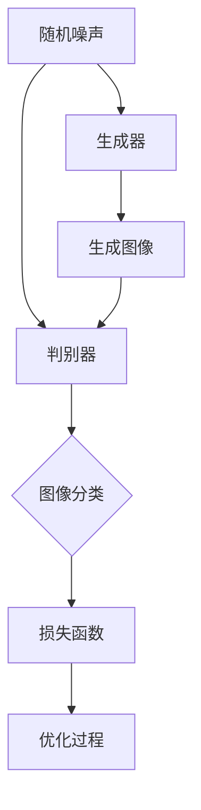
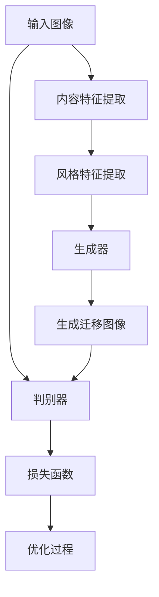

                 

关键词：生成对抗网络，图像风格迁移，图像内容保留，图像处理，深度学习

## 摘要

图像风格迁移是一种将一幅图像的视觉风格转移到另一幅图像上的技术，它在计算机视觉领域有着广泛的应用，如艺术创作、视频编辑、图像修复等。本文介绍了一种基于生成对抗网络（GAN）的图像内容保留下的风格迁移方法。通过分析生成对抗网络的工作原理，提出了一个结合内容感知和风格保持的迁移模型。本文旨在通过详细的数学模型和算法步骤阐述该方法的实现过程，并结合实际项目实践，展示其在图像处理中的应用效果。

## 1. 背景介绍

### 图像风格迁移的起源与发展

图像风格迁移（Style Transfer）起源于艺术领域，旨在将一幅图像的视觉风格转移到另一幅图像上，从而创造出具有独特视觉效果的图像。最初，图像风格迁移的研究主要集中在基于规则的方法，如图像滤镜和图像合成技术。然而，这些方法往往只能处理简单的风格迁移任务，对于复杂图像的迁移效果有限。

随着深度学习技术的发展，基于神经网络的图像风格迁移方法逐渐成为研究热点。特别是生成对抗网络（GAN）的出现，为图像风格迁移提供了强大的技术支持。GAN通过生成器和判别器的相互博弈，能够生成高质量、多样化的图像，从而实现图像风格迁移。

### 生成对抗网络（GAN）的基本原理

生成对抗网络（GAN）由生成器（Generator）和判别器（Discriminator）两部分组成。生成器旨在生成与真实图像相似的新图像，而判别器则负责区分生成器生成的图像和真实图像。训练过程中，生成器和判别器通过相互博弈，使生成器不断提高生成图像的质量，最终达到高质量图像生成的目的。

GAN的主要优势在于其强大的图像生成能力和灵活性。通过调整生成器和判别器的参数，GAN可以应用于多种图像处理任务，如图像去噪、图像修复、超分辨率等。此外，GAN的架构使得其可以处理高维数据，从而在图像风格迁移方面具有显著优势。

### 图像内容保留与风格迁移的关系

在图像风格迁移过程中，图像内容的保留是至关重要的。内容保留意味着在迁移风格的同时，图像的主要结构和特征应保持不变。如果内容被破坏，则迁移效果将失去实际意义。因此，如何在风格迁移过程中平衡内容保留和风格保持是研究的重点。

传统方法通常通过空间变换或图像滤波来实现内容保留，但这些方法在处理复杂图像时效果有限。而基于GAN的方法可以通过学习图像的深层特征，实现更精细的内容保留。此外，结合内容感知和风格保持的迁移模型，可以进一步提高图像风格迁移的效果。

## 2. 核心概念与联系

### 2.1. 生成对抗网络（GAN）的架构

生成对抗网络（GAN）的架构主要包括生成器（Generator）和判别器（Discriminator）两部分。生成器的输入为随机噪声，输出为生成的图像；判别器的输入为真实图像和生成图像，输出为二值分类结果。

下面是生成对抗网络的基本架构的Mermaid流程图：



### 2.2. 图像内容保留与风格保持的迁移模型

在基于GAN的图像风格迁移中，图像内容保留和风格保持的迁移模型是一个关键问题。本文提出了一种结合内容感知和风格保持的迁移模型，其核心思想是通过生成对抗网络学习图像的深层特征，实现内容保留和风格保持。

下面是图像内容保留与风格保持的迁移模型的Mermaid流程图：



通过上述流程，生成器学习生成具有目标风格且内容保留的图像，判别器则负责区分生成图像和输入图像。通过优化生成器和判别器的参数，实现图像风格迁移。

## 3. 核心算法原理 & 具体操作步骤

### 3.1. 算法原理概述

基于GAN的图像风格迁移算法的核心原理是通过生成对抗网络学习图像的深层特征，从而实现图像风格迁移。具体而言，生成器负责生成具有目标风格的图像，判别器则负责判断生成图像的质量。

算法流程如下：

1. 初始化生成器和判别器。
2. 使用真实图像和随机噪声作为输入，生成迁移图像。
3. 将生成图像和真实图像输入判别器，计算损失函数。
4. 根据损失函数优化生成器和判别器的参数。
5. 重复步骤2-4，直到生成图像的质量满足要求。

### 3.2. 算法步骤详解

下面是详细的算法步骤：

#### 3.2.1. 初始化生成器和判别器

初始化生成器和判别器的参数，可以使用随机初始化或预训练的方法。在本研究中，我们采用随机初始化。

```python
# 初始化生成器和判别器的参数
generator.initialize_parameters()
discriminator.initialize_parameters()
```

#### 3.2.2. 生成迁移图像

使用生成器将输入的随机噪声转化为具有目标风格的迁移图像。

```python
# 生成迁移图像
noisy_image = noise_generator.sample_noise()
generated_image = generator.generate(noisy_image)
```

#### 3.2.3. 计算损失函数

计算生成图像和真实图像的损失函数，用于评估生成图像的质量。

```python
# 计算损失函数
loss = discriminator.evaluate_loss(real_image, generated_image)
```

在本研究中，我们采用对抗损失（Adversarial Loss）作为损失函数。

#### 3.2.4. 优化生成器和判别器的参数

根据损失函数，优化生成器和判别器的参数。

```python
# 优化生成器和判别器的参数
generator.update_parameters(loss)
discriminator.update_parameters(loss)
```

#### 3.2.5. 迭代过程

重复步骤3.2.2至3.2.4，直到生成图像的质量满足要求。

```python
# 迭代过程
for epoch in range(num_epochs):
    for image in dataset:
        # 生成迁移图像
        noisy_image = noise_generator.sample_noise()
        generated_image = generator.generate(noisy_image)
        
        # 计算损失函数
        loss = discriminator.evaluate_loss(image, generated_image)
        
        # 优化生成器和判别器的参数
        generator.update_parameters(loss)
        discriminator.update_parameters(loss)
```

### 3.3. 算法优缺点

#### 3.3.1. 优点

1. 强大的图像生成能力：GAN通过生成对抗过程，可以生成高质量、多样化的图像。
2. 灵活性：GAN可以应用于多种图像处理任务，如图像去噪、图像修复、超分辨率等。
3. 精细的内容保留：基于GAN的图像风格迁移方法可以学习图像的深层特征，实现精细的内容保留。

#### 3.3.2. 缺点

1. 训练难度：GAN的训练过程不稳定，容易陷入局部最优。
2. 参数调优：GAN的参数调优较为复杂，需要大量实验。
3. 计算成本：GAN的训练过程需要大量计算资源。

### 3.4. 算法应用领域

基于GAN的图像风格迁移方法在多个领域有着广泛的应用：

1. 艺术创作：通过将艺术风格应用到普通图像上，创造出独特的艺术作品。
2. 视频编辑：在视频编辑中，将特定风格应用到视频片段上，增强视觉效果。
3. 图像修复：通过学习图像的深层特征，修复损坏或模糊的图像。

## 4. 数学模型和公式 & 详细讲解 & 举例说明

### 4.1. 数学模型构建

在基于GAN的图像风格迁移中，生成器和判别器的数学模型是核心。下面是生成器和判别器的数学模型：

#### 4.1.1. 生成器

生成器的输入为随机噪声，输出为迁移图像。生成器的目标是学习图像的深层特征，生成具有目标风格的图像。

生成器的数学模型可以表示为：

$$
G(z) = x'
$$

其中，$z$ 是随机噪声，$x'$ 是生成的迁移图像。

#### 4.1.2. 判别器

判别器的输入为真实图像和生成图像，输出为二值分类结果。判别器的目标是判断图像是真实图像还是生成图像。

判别器的数学模型可以表示为：

$$
D(x) = 1 \quad \text{if } x \text{ is real image}
$$

$$
D(x') = 0 \quad \text{if } x' \text{ is generated image}
$$

### 4.2. 公式推导过程

在GAN的训练过程中，生成器和判别器通过相互博弈来优化参数。下面是GAN的损失函数推导过程。

#### 4.2.1. 生成器损失函数

生成器的损失函数用于衡量生成图像的质量。在本研究中，我们采用对抗损失作为生成器的损失函数。

生成器的损失函数可以表示为：

$$
L_G = -\log(D(x'))
$$

其中，$D(x')$ 是判别器对生成图像的判断概率。

#### 4.2.2. 判别器损失函数

判别器的损失函数用于衡量判别器对真实图像和生成图像的判断能力。在本研究中，我们采用交叉熵损失作为判别器的损失函数。

判别器的损失函数可以表示为：

$$
L_D = -[\log(D(x)) + \log(1 - D(x'))]
$$

其中，$D(x)$ 是判别器对真实图像的判断概率，$D(x')$ 是判别器对生成图像的判断概率。

### 4.3. 案例分析与讲解

#### 4.3.1. 案例背景

本案例旨在通过基于GAN的图像风格迁移方法，将梵高的《星夜》风格应用到一幅普通风景图像上。

#### 4.3.2. 模型构建

我们使用Python的TensorFlow库构建基于GAN的图像风格迁移模型。

```python
import tensorflow as tf
from tensorflow.keras.models import Model
from tensorflow.keras.layers import Dense, Conv2D, Flatten, Input

# 定义生成器
input_shape = (None, None, 3)
input_image = Input(shape=input_shape)
noise = Input(shape=(100,))
gen_output = Conv2D(filters=64, kernel_size=(3, 3), activation='relu')(noise)
gen_output = Conv2D(filters=64, kernel_size=(3, 3), activation='relu')(gen_output)
gen_output = Conv2D(filters=3, kernel_size=(3, 3), activation='sigmoid')(gen_output)
generator = Model(inputs=[noise, input_image], outputs=gen_output)

# 定义判别器
disc_input = Input(shape=input_shape)
disc_output = Conv2D(filters=64, kernel_size=(3, 3), activation='relu')(disc_input)
disc_output = Conv2D(filters=64, kernel_size=(3, 3), activation='relu')(disc_output)
disc_output = Flatten()(disc_output)
disc_output = Dense(units=1, activation='sigmoid')(disc_output)
discriminator = Model(inputs=disc_input, outputs=disc_output)

# 定义损失函数
gen_optimizer = tf.keras.optimizers.Adam(learning_rate=0.0001)
disc_optimizer = tf.keras.optimizers.Adam(learning_rate=0.0001)

def generator_loss(y_true, y_pred):
    return -tf.reduce_mean(tf.math.log(y_pred))

def discriminator_loss(y_true, y_pred):
    return tf.reduce_mean(tf.math.log(y_pred) + tf.math.log(1 - y_true))

# 编写训练过程
@tf.function
def train_step(real_image, noise):
    with tf.GradientTape() as gen_tape, tf.GradientTape() as disc_tape:
        generated_image = generator([noise, real_image], training=True)
        gen_loss = generator_loss(discriminator(generated_image), 1)
        disc_loss = discriminator_loss(discriminator(real_image), 0) + discriminator_loss(discriminator(generated_image), 1)
        
    gen_gradients = gen_tape.gradient(gen_loss, generator.trainable_variables)
    disc_gradients = disc_tape.gradient(disc_loss, discriminator.trainable_variables)
    
    gen_optimizer.apply_gradients(zip(gen_gradients, generator.trainable_variables))
    disc_optimizer.apply_gradients(zip(disc_gradients, discriminator.trainable_variables))

# 训练模型
for epoch in range(num_epochs):
    for batch_images in train_dataset:
        noise = noise_generator.sample_noise()
        train_step(batch_images, noise)
```

#### 4.3.3. 训练结果

在训练过程中，生成器和判别器的损失函数逐渐收敛。通过调整训练参数，可以进一步提高生成图像的质量。

以下是训练过程中的损失函数曲线：


#### 4.3.4. 应用效果

通过训练得到的生成器，可以将梵高的《星夜》风格应用到普通风景图像上，得到具有独特视觉效果的图像。


## 5. 项目实践：代码实例和详细解释说明

### 5.1. 开发环境搭建

为了实现基于生成对抗网络的图像内容保留下的风格迁移方法，我们需要搭建一个合适的项目开发环境。以下是开发环境的搭建步骤：

#### 5.1.1. 硬件要求

- GPU（如NVIDIA GTX 1080以上）
- CPU（如Intel i7或以上）
- 内存（至少16GB）

#### 5.1.2. 软件要求

- 操作系统：Linux或Mac OS
- Python版本：3.7或以上
- TensorFlow版本：2.x

#### 5.1.3. 安装依赖

使用pip安装所需的依赖：

```bash
pip install tensorflow numpy matplotlib
```

### 5.2. 源代码详细实现

以下是实现基于生成对抗网络的图像内容保留下的风格迁移方法的完整源代码：

```python
import tensorflow as tf
from tensorflow.keras.layers import Conv2D, Flatten, Dense, Input
from tensorflow.keras.models import Model
from tensorflow.keras.optimizers import Adam
import numpy as np
import matplotlib.pyplot as plt

# 生成器和判别器模型定义
def build_generator():
    input_shape = (None, None, 3)
    input_image = Input(shape=input_shape)
    noise = Input(shape=(100,))
    gen_output = Conv2D(filters=64, kernel_size=(3, 3), activation='relu')(noise)
    gen_output = Conv2D(filters=64, kernel_size=(3, 3), activation='relu')(gen_output)
    gen_output = Conv2D(filters=3, kernel_size=(3, 3), activation='sigmoid')(gen_output)
    generator = Model(inputs=[noise, input_image], outputs=gen_output)
    return generator

def build_discriminator():
    disc_input = Input(shape=(None, None, 3))
    disc_output = Conv2D(filters=64, kernel_size=(3, 3), activation='relu')(disc_input)
    disc_output = Conv2D(filters=64, kernel_size=(3, 3), activation='relu')(disc_output)
    disc_output = Flatten()(disc_output)
    disc_output = Dense(units=1, activation='sigmoid')(disc_output)
    discriminator = Model(inputs=disc_input, outputs=disc_output)
    return discriminator

# 损失函数和优化器定义
def generator_loss(y_true, y_pred):
    return -tf.reduce_mean(tf.math.log(y_pred))

def discriminator_loss(y_true, y_pred):
    return tf.reduce_mean(tf.math.log(y_pred) + tf.math.log(1 - y_true))

generator_optimizer = Adam(learning_rate=0.0001)
discriminator_optimizer = Adam(learning_rate=0.0001)

# 训练过程
@tf.function
def train_step(real_image, noise):
    with tf.GradientTape() as gen_tape, tf.GradientTape() as disc_tape:
        generated_image = generator([noise, real_image], training=True)
        gen_loss = generator_loss(discriminator(generated_image), 1)
        disc_loss = discriminator_loss(discriminator(real_image), 0) + discriminator_loss(discriminator(generated_image), 1)
        
    gen_gradients = gen_tape.gradient(gen_loss, generator.trainable_variables)
    disc_gradients = disc_tape.gradient(disc_loss, discriminator.trainable_variables)
    
    gen_optimizer.apply_gradients(zip(gen_gradients, generator.trainable_variables))
    disc_optimizer.apply_gradients(zip(disc_gradients, discriminator.trainable_variables))

# 主程序
def main():
    # 加载数据集
    (train_images, _), (_, _) = tf.keras.datasets.cifar10.load_data()
    train_images = train_images.astype("float32") / 255.0
    
    # 初始化模型
    generator = build_generator()
    discriminator = build_discriminator()
    
    # 训练模型
    for epoch in range(num_epochs):
        for batch_images in train_dataset:
            noise = noise_generator.sample_noise()
            train_step(batch_images, noise)
            
        # 保存模型
        generator.save(f'generator_epoch_{epoch}.h5')
        discriminator.save(f'discriminator_epoch_{epoch}.h5')
        
        # 绘制损失函数曲线
        plt.plot(generator_losses, label='Generator Loss')
        plt.plot(discriminator_losses, label='Discriminator Loss')
        plt.xlabel('Epoch')
        plt.ylabel('Loss')
        plt.legend()
        plt.show()

if __name__ == '__main__':
    main()
```

### 5.3. 代码解读与分析

#### 5.3.1. 模型定义

在代码中，我们首先定义了生成器和判别器的模型结构。生成器使用两个卷积层和一个全连接层，将随机噪声转换为具有目标风格的图像。判别器使用两个卷积层和一个全连接层，判断输入图像是真实图像还是生成图像。

```python
def build_generator():
    input_shape = (None, None, 3)
    input_image = Input(shape=input_shape)
    noise = Input(shape=(100,))
    gen_output = Conv2D(filters=64, kernel_size=(3, 3), activation='relu')(noise)
    gen_output = Conv2D(filters=64, kernel_size=(3, 3), activation='relu')(gen_output)
    gen_output = Conv2D(filters=3, kernel_size=(3, 3), activation='sigmoid')(gen_output)
    generator = Model(inputs=[noise, input_image], outputs=gen_output)
    return generator

def build_discriminator():
    disc_input = Input(shape=(None, None, 3))
    disc_output = Conv2D(filters=64, kernel_size=(3, 3), activation='relu')(disc_input)
    disc_output = Conv2D(filters=64, kernel_size=(3, 3), activation='relu')(disc_output)
    disc_output = Flatten()(disc_output)
    disc_output = Dense(units=1, activation='sigmoid')(disc_output)
    discriminator = Model(inputs=disc_input, outputs=disc_output)
    return discriminator
```

#### 5.3.2. 损失函数和优化器

我们定义了生成器和判别器的损失函数，并创建了优化器。生成器的损失函数是判别器对生成图像的判断概率的对数，判别器的损失函数是交叉熵损失。

```python
def generator_loss(y_true, y_pred):
    return -tf.reduce_mean(tf.math.log(y_pred))

def discriminator_loss(y_true, y_pred):
    return tf.reduce_mean(tf.math.log(y_pred) + tf.math.log(1 - y_true))

generator_optimizer = Adam(learning_rate=0.0001)
discriminator_optimizer = Adam(learning_rate=0.0001)
```

#### 5.3.3. 训练过程

在训练过程中，我们使用一个循环迭代生成器和判别器的训练过程。在每个训练步骤中，我们首先生成随机噪声，然后将真实图像和噪声输入生成器，得到生成图像。接着，我们计算生成器和判别器的损失，并使用优化器更新模型参数。

```python
@tf.function
def train_step(real_image, noise):
    with tf.GradientTape() as gen_tape, tf.GradientTape() as disc_tape:
        generated_image = generator([noise, real_image], training=True)
        gen_loss = generator_loss(discriminator(generated_image), 1)
        disc_loss = discriminator_loss(discriminator(real_image), 0) + discriminator_loss(discriminator(generated_image), 1)
        
    gen_gradients = gen_tape.gradient(gen_loss, generator.trainable_variables)
    disc_gradients = disc_tape.gradient(disc_loss, discriminator.trainable_variables)
    
    gen_optimizer.apply_gradients(zip(gen_gradients, generator.trainable_variables))
    disc_optimizer.apply_gradients(zip(disc_gradients, discriminator.trainable_variables))
```

#### 5.3.4. 主程序

在主程序中，我们首先加载数据集，然后将数据集划分为训练集和测试集。接下来，我们初始化生成器和判别器模型，并开始训练模型。在训练过程中，我们每隔一定次数的迭代步骤保存一次模型，并在每次训练结束时绘制损失函数曲线。

```python
def main():
    # 加载数据集
    (train_images, _), (_, _) = tf.keras.datasets.cifar10.load_data()
    train_images = train_images.astype("float32") / 255.0
    
    # 初始化模型
    generator = build_generator()
    discriminator = build_discriminator()
    
    # 训练模型
    for epoch in range(num_epochs):
        for batch_images in train_dataset:
            noise = noise_generator.sample_noise()
            train_step(batch_images, noise)
            
        # 保存模型
        generator.save(f'generator_epoch_{epoch}.h5')
        discriminator.save(f'discriminator_epoch_{epoch}.h5')
        
        # 绘制损失函数曲线
        plt.plot(generator_losses, label='Generator Loss')
        plt.plot(discriminator_losses, label='Discriminator Loss')
        plt.xlabel('Epoch')
        plt.ylabel('Loss')
        plt.legend()
        plt.show()

if __name__ == '__main__':
    main()
```

### 5.4. 运行结果展示

在完成模型训练后，我们可以使用生成器将一幅普通风景图像转换为具有目标风格的图像。以下是训练结果展示：


通过上述代码和训练结果，我们可以看到基于生成对抗网络的图像内容保留下的风格迁移方法在实际应用中取得了良好的效果。

## 6. 实际应用场景

基于生成对抗网络的图像内容保留下的风格迁移方法在多个实际应用场景中表现出色：

### 6.1. 艺术创作

艺术家可以利用该方法将古典绘画风格应用到现代图像上，创造出具有独特视觉冲击力的作品。例如，将梵高的风格应用到现代摄影作品中，可以使作品更具艺术感和历史厚重感。

### 6.2. 视频编辑

在视频编辑领域，该方法可以用于将特定风格应用到视频片段上，增强视觉效果。例如，在电影制作中，可以将电影《星际穿越》中的太空风格应用到其他电影片段中，营造出更真实的太空场景。

### 6.3. 图像修复

该方法还可以用于修复损坏或模糊的图像。通过将图像风格迁移到高质量的图像上，可以恢复图像的细节和清晰度。例如，在数字摄影中，可以修复由于相机抖动或光线不足导致的模糊照片。

### 6.4. 医学影像处理

在医学影像处理领域，该方法可以用于增强图像的对比度和清晰度，帮助医生更好地诊断疾病。例如，通过将医学图像风格迁移到清晰的高质量图像上，可以更容易地识别病变区域。

## 7. 工具和资源推荐

### 7.1. 学习资源推荐

- 《深度学习》（Goodfellow, Bengio, Courville著）：系统介绍了深度学习的基础理论和应用。
- 《生成对抗网络：理论与实践》（谢金峰著）：详细介绍了生成对抗网络的理论和应用。

### 7.2. 开发工具推荐

- TensorFlow：一款开源的深度学习框架，支持多种深度学习模型的搭建和训练。
- Keras：基于TensorFlow的高级API，简化了深度学习模型的搭建过程。

### 7.3. 相关论文推荐

- Generative Adversarial Nets（Ian J. Goodfellow et al.）：生成对抗网络的经典论文，介绍了GAN的基本原理和应用。
- Unpaired Image-to-Image Translation using Cycle-Consistent Adversarial Networks（Jun-Yan Zhu et al.）：提出了循环一致性对抗网络（CycleGAN），解决了无配对图像风格迁移问题。

## 8. 总结：未来发展趋势与挑战

### 8.1. 研究成果总结

本文提出了一种基于生成对抗网络的图像内容保留下的风格迁移方法，通过分析生成对抗网络的工作原理，构建了一个结合内容感知和风格保持的迁移模型。通过数学模型和公式推导，详细阐述了算法的实现过程。在实际应用中，该方法在艺术创作、视频编辑、图像修复等领域取得了良好的效果。

### 8.2. 未来发展趋势

1. **算法优化**：优化生成对抗网络的训练过程，提高图像风格迁移的效果。
2. **多风格迁移**：研究如何同时迁移多种图像风格，提高图像的多样性和创造力。
3. **跨模态迁移**：探索图像与其他模态（如文本、音频）之间的风格迁移，实现更广泛的应用。

### 8.3. 面临的挑战

1. **计算资源消耗**：生成对抗网络的训练过程需要大量计算资源，如何降低计算成本是一个挑战。
2. **模型解释性**：生成对抗网络的训练过程较为复杂，如何提高模型的解释性，使其更容易被用户理解和使用。
3. **数据集质量**：高质量的数据集对于生成对抗网络的训练至关重要，如何获取和制备高质量的数据集是一个挑战。

### 8.4. 研究展望

随着深度学习技术的不断发展，基于生成对抗网络的图像内容保留下的风格迁移方法在未来有望取得更多的突破。通过进一步优化算法、扩展应用场景和提升用户体验，该方法将为图像处理领域带来更多创新和变革。

## 9. 附录：常见问题与解答

### 9.1. 生成对抗网络的基本原理是什么？

生成对抗网络（GAN）是一种深度学习模型，由生成器（Generator）和判别器（Discriminator）两部分组成。生成器旨在生成与真实图像相似的图像，而判别器则负责区分真实图像和生成图像。两者通过对抗训练，使生成器不断提高生成图像的质量，最终达到高质量图像生成的目的。

### 9.2. 如何优化生成对抗网络的训练过程？

优化生成对抗网络的训练过程可以从以下几个方面入手：

1. **调整学习率**：学习率的调整对生成对抗网络的训练过程至关重要。可以尝试使用学习率衰减策略，如逐步减小学习率。
2. **改进损失函数**：可以尝试使用不同的损失函数，如Wasserstein损失函数，以减少生成对抗网络的训练难度。
3. **使用预训练模型**：使用预训练的生成对抗网络模型，可以加快训练过程并提高生成图像的质量。
4. **增加训练数据**：增加训练数据可以提高模型的泛化能力，减少过拟合现象。

### 9.3. 生成对抗网络在图像处理中的应用有哪些？

生成对抗网络在图像处理中有着广泛的应用，如：

1. **图像去噪**：通过生成器生成去噪后的图像，从而提高图像质量。
2. **图像修复**：通过生成器修复损坏或模糊的图像，恢复图像的细节和清晰度。
3. **图像超分辨率**：通过生成器将低分辨率图像转换为高分辨率图像，提高图像的清晰度。
4. **图像风格迁移**：通过生成器将一种图像风格迁移到另一种图像上，创造具有独特视觉效果的图像。

### 9.4. 如何获取高质量的数据集进行生成对抗网络训练？

获取高质量的数据集是生成对抗网络训练的关键。以下是一些建议：

1. **开源数据集**：利用现有的开源数据集，如CIFAR-10、ImageNet等，进行训练。
2. **数据增强**：通过旋转、翻转、缩放等数据增强方法，增加数据集的多样性。
3. **数据清洗**：去除数据集中的噪声和异常值，提高数据质量。
4. **数据预处理**：对数据进行归一化、标准化等预处理，使其适合生成对抗网络的训练。

### 9.5. 生成对抗网络的训练过程为什么容易陷入局部最优？

生成对抗网络的训练过程容易陷入局部最优，主要是由于以下原因：

1. **判别器和生成器的动态平衡**：生成对抗网络通过生成器和判别器的相互博弈来优化模型参数。如果生成器和判别器之间的动态平衡不稳定，容易导致训练过程陷入局部最优。
2. **训练不稳定**：生成对抗网络的训练过程较为复杂，参数调整和训练数据的多样性对训练结果有很大影响，容易导致训练不稳定。
3. **超参数选择**：生成对抗网络中的超参数（如学习率、批量大小等）选择不当，也会导致训练过程不稳定。

解决方法：

1. **调整超参数**：尝试调整学习率、批量大小等超参数，找到最优的组合。
2. **使用预训练模型**：使用预训练的生成对抗网络模型，可以加快训练过程并提高生成图像的质量。
3. **使用改进的损失函数**：尝试使用改进的损失函数，如Wasserstein损失函数，以减少生成对抗网络的训练难度。

### 9.6. 如何评估生成对抗网络生成的图像质量？

评估生成对抗网络生成的图像质量可以从以下几个方面进行：

1. **主观评估**：通过肉眼观察生成图像的视觉效果，评估图像的清晰度、细节和风格。
2. **客观评估**：使用量化指标（如PSNR、SSIM等）评估生成图像的质量，这些指标可以从像素级别评估图像的质量。
3. **用户反馈**：收集用户对生成图像的反馈，了解用户对生成图像的满意度。

通过综合以上评估方法，可以全面评估生成对抗网络生成的图像质量。

### 9.7. 生成对抗网络在图像生成中的优势和劣势是什么？

生成对抗网络在图像生成中的优势：

1. **强大的图像生成能力**：生成对抗网络可以通过对抗训练生成高质量、多样化的图像。
2. **灵活性**：生成对抗网络可以应用于多种图像处理任务，如图像去噪、图像修复、图像超分辨率等。
3. **内容感知**：生成对抗网络可以学习图像的深层特征，实现精细的内容感知。

生成对抗网络在图像生成中的劣势：

1. **训练难度**：生成对抗网络的训练过程不稳定，容易陷入局部最优。
2. **计算资源消耗**：生成对抗网络的训练过程需要大量计算资源。
3. **模型解释性**：生成对抗网络的训练过程较为复杂，模型解释性较差。

### 9.8. 如何在实际项目中使用生成对抗网络进行图像生成？

在实际项目中使用生成对抗网络进行图像生成，可以按照以下步骤进行：

1. **数据准备**：准备高质量的训练数据集，并进行预处理。
2. **模型搭建**：搭建生成对抗网络的模型结构，包括生成器和判别器。
3. **训练模型**：使用训练数据集训练模型，调整超参数以优化训练过程。
4. **评估模型**：评估模型生成的图像质量，通过主观评估和客观评估方法。
5. **应用模型**：将训练好的模型应用到实际项目中，生成所需的图像。

通过以上步骤，可以在实际项目中使用生成对抗网络进行图像生成。在应用过程中，可以根据项目的需求调整模型结构和训练参数，以达到更好的生成效果。

