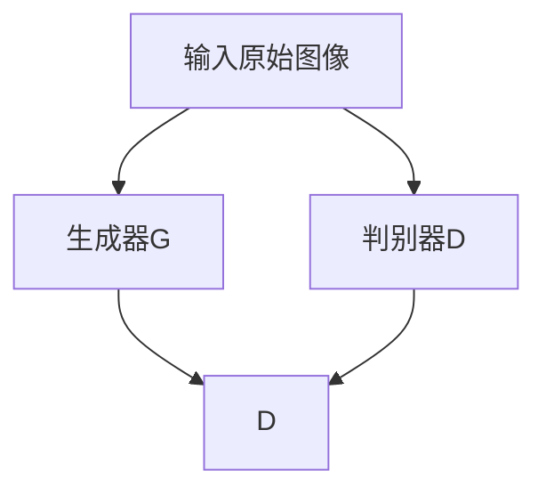

                 

 **关键词：** 生成对抗网络（GAN），自然场景风格化，图像生成，深度学习，机器学习，人工智能。

**摘要：** 本文将深入探讨生成对抗网络（GAN）在自然场景风格化图像生成中的应用。通过分析GAN的核心概念、算法原理、数学模型及具体操作步骤，本文旨在为读者提供一个清晰、完整的理解框架，同时通过实际项目实践展示其应用效果。最后，本文将展望GAN在自然场景风格化图像生成领域的未来发展趋势及面临的挑战。

## 1. 背景介绍

随着深度学习技术的不断发展，生成对抗网络（GAN）作为一种重要的深度学习模型，已经在图像生成、图像修复、图像超分辨率等多个领域取得了显著的成果。自然场景风格化图像生成作为GAN应用的一个重要方向，旨在将一种图像的风格迁移到另一种图像上，从而创造出具有独特艺术风格的自然场景图像。

自然场景风格化图像生成在艺术创作、游戏设计、影视特效等领域具有广泛的应用前景。例如，在艺术创作中，艺术家可以利用GAN技术将传统绘画风格应用到自然场景中，创造出独特的艺术作品；在游戏设计中，可以将游戏场景的风格化图像应用于游戏角色和背景的设计，增强游戏的艺术表现力；在影视特效中，可以通过风格化图像生成技术创造出各种具有特殊风格的场景，提升电影的视觉效果。

## 2. 核心概念与联系

### 2.1 生成对抗网络（GAN）的基本概念

生成对抗网络（GAN）是一种深度学习模型，由生成器和判别器两个主要部分组成。生成器的任务是生成与真实数据分布相似的假数据，而判别器的任务是区分生成器生成的假数据和真实数据。生成器和判别器相互竞争，通过不断迭代训练，生成器的生成能力逐渐提高，而判别器的辨别能力也不断增强。

### 2.2 自然场景风格化图像生成的概念

自然场景风格化图像生成是指将一种图像的风格（如油画、水彩等）迁移到另一种图像上，从而创造出具有独特艺术风格的图像。这需要生成器能够生成出既符合目标风格，又能与原始图像内容相结合的图像。

### 2.3 GAN与自然场景风格化图像生成的关系

GAN通过生成器和判别器的互动，使得生成器能够逐渐生成出更加逼真的图像。在自然场景风格化图像生成中，生成器不仅要生成出符合目标风格的自然场景图像，还要保证图像内容的一致性。因此，GAN在自然场景风格化图像生成中发挥着核心作用。

### 2.4 Mermaid 流程图

下面是一个简单的 Mermaid 流程图，展示 GAN 在自然场景风格化图像生成中的基本工作流程：



## 3. 核心算法原理 & 具体操作步骤

### 3.1 算法原理概述

生成对抗网络（GAN）的核心思想是通过生成器和判别器的对抗训练，使得生成器能够生成出高质量、逼真的图像。在自然场景风格化图像生成中，生成器需要同时考虑图像的内容和风格。

### 3.2 算法步骤详解

1. **数据预处理**：对原始图像进行预处理，包括数据增强、归一化等操作，以提高生成器和判别器的训练效果。

2. **生成器训练**：生成器的训练过程包括以下步骤：
    - 初始化生成器G和判别器D。
    - 从真实数据集中随机选择一组图像作为输入。
    - 生成器G根据输入图像生成假图像。
    - 判别器D同时接收真实图像和生成器G生成的假图像，并进行训练。
    - 计算生成器的损失函数，通常使用生成对抗损失函数，包括对抗损失和内容损失。
    - 使用梯度下降法更新生成器的参数。

3. **判别器训练**：判别器D的训练过程包括以下步骤：
    - 初始化生成器G和判别器D。
    - 从真实数据集中随机选择一组图像作为输入。
    - 判别器D对输入图像进行分类，判断图像是真实图像还是生成器G生成的假图像。
    - 计算判别器的损失函数，通常使用二元交叉熵损失函数。
    - 使用梯度下降法更新判别器的参数。

4. **迭代训练**：重复执行生成器和判别器的训练步骤，直到生成器能够生成出高质量、逼真的图像。

### 3.3 算法优缺点

**优点：**
- GAN能够生成高质量、逼真的图像，具有广泛的应用前景。
- GAN能够同时考虑图像的内容和风格，适合自然场景风格化图像生成任务。

**缺点：**
- GAN的训练过程较为复杂，容易出现模式崩溃等问题。
- GAN的训练效果依赖于生成器和判别器的初始化，需要多次尝试和调整。

### 3.4 算法应用领域

生成对抗网络（GAN）在自然场景风格化图像生成领域具有广泛的应用前景，包括但不限于以下领域：
- 艺术创作：利用 GAN 技术将传统绘画风格应用到自然场景中，创造出独特的艺术作品。
- 游戏设计：通过 GAN 生成逼真的游戏场景图像，提升游戏的艺术表现力。
- 影视特效：利用 GAN 生成具有特殊风格的场景图像，提升电影的视觉效果。
- 图像修复：利用 GAN 技术修复损坏的图像，恢复图像内容。

## 4. 数学模型和公式 & 详细讲解 & 举例说明

### 4.1 数学模型构建

生成对抗网络的数学模型主要包括生成器和判别器的损失函数。生成器的损失函数通常使用生成对抗损失函数（GAN Loss），判别器的损失函数通常使用二元交叉熵损失函数（Binary Cross-Entropy Loss）。

生成对抗损失函数：

$$
L_G = -\mathbb{E}_{x\sim p_{data}(x)}[\log D(x)] - \mathbb{E}_{z\sim p_z(z)}[\log (1 - D(G(z)))]
$$

其中，$x$ 表示真实图像，$z$ 表示随机噪声向量，$G(z)$ 表示生成器生成的图像，$D(x)$ 和 $D(G(z))$ 分别表示判别器对真实图像和生成图像的判别结果。

二元交叉熵损失函数：

$$
L_D = -[\mathbb{E}_{x\sim p_{data}(x)}[\log D(x)] + \mathbb{E}_{z\sim p_z(z)}[\log (1 - D(G(z))))]
$$

### 4.2 公式推导过程

生成对抗损失函数的推导过程如下：

1. **判别器损失函数**：

   判别器 D 的目标是最小化二元交叉熵损失函数，即最大化判别器的判别能力。

   $$ L_D = -[\mathbb{E}_{x\sim p_{data}(x)}[\log D(x)] + \mathbb{E}_{z\sim p_z(z)}[\log (1 - D(G(z)))] $$

2. **生成器损失函数**：

   生成器 G 的目标是最小化生成对抗损失函数，即最大化生成器的生成能力。

   $$ L_G = -\mathbb{E}_{x\sim p_{data}(x)}[\log D(x)] - \mathbb{E}_{z\sim p_z(z)}[\log (1 - D(G(z)))] $$

### 4.3 案例分析与讲解

假设我们有一个自然场景风格化图像生成任务，目标是将一幅风景图像的风格迁移到另一幅风景图像上。我们可以使用以下步骤进行图像生成：

1. **数据预处理**：对输入的风景图像进行预处理，包括大小调整、归一化等操作。

2. **生成器训练**：

   - 初始化生成器 G 和判别器 D。
   - 从真实数据集中随机选择一组风景图像作为输入。
   - 生成器 G 根据输入图像生成风格化图像。
   - 判别器 D 对输入图像和生成图像进行分类，判断图像是真实图像还是生成图像。
   - 计算生成器和判别器的损失函数，并使用梯度下降法更新生成器和判别器的参数。

3. **迭代训练**：重复执行生成器和判别器的训练步骤，直到生成器能够生成出高质量、逼真的风格化图像。

通过以上步骤，我们可以使用生成对抗网络（GAN）实现自然场景风格化图像生成。

## 5. 项目实践：代码实例和详细解释说明

### 5.1 开发环境搭建

为了实现自然场景风格化图像生成，我们需要搭建一个适合深度学习开发的编程环境。以下是搭建开发环境的基本步骤：

1. **安装 Python**：确保 Python 版本不低于 3.6。
2. **安装 TensorFlow**：TensorFlow 是一款流行的深度学习框架，我们可以使用以下命令安装：

   ```bash
   pip install tensorflow
   ```

3. **安装 Keras**：Keras 是一款基于 TensorFlow 的深度学习库，提供了更简洁、易用的 API 接口，我们可以使用以下命令安装：

   ```bash
   pip install keras
   ```

4. **安装 Matplotlib**：Matplotlib 是一款常用的数据可视化库，用于展示训练过程中的损失函数变化等，我们可以使用以下命令安装：

   ```bash
   pip install matplotlib
   ```

### 5.2 源代码详细实现

以下是自然场景风格化图像生成项目的源代码实现，主要包括生成器、判别器的定义和训练过程：

```python
import numpy as np
import tensorflow as tf
from tensorflow.keras.layers import Input, Conv2D, Flatten, Dense
from tensorflow.keras.models import Model

# 生成器 G 的定义
def build_generator():
    input_shape = (256, 256, 3)
    input_image = Input(shape=input_shape)
    x = Conv2D(64, (3, 3), activation='relu', padding='same')(input_image)
    x = Conv2D(128, (3, 3), activation='relu', padding='same')(x)
    x = Conv2D(256, (3, 3), activation='relu', padding='same')(x)
    x = Flatten()(x)
    x = Dense(1024, activation='relu')(x)
    output_image = Dense(np.prod(input_shape), activation='sigmoid')(x)
    output_image = Reshape(input_shape)(output_image)
    model = Model(inputs=input_image, outputs=output_image)
    return model

# 判别器 D 的定义
def build_discriminator():
    input_shape = (256, 256, 3)
    input_image = Input(shape=input_shape)
    x = Conv2D(64, (3, 3), activation='relu', padding='same')(input_image)
    x = Conv2D(128, (3, 3), activation='relu', padding='same')(x)
    x = Flatten()(x)
    output = Dense(1, activation='sigmoid')(x)
    model = Model(inputs=input_image, outputs=output)
    return model

# GAN 模型的定义
def build_gan(generator, discriminator):
    model = Model(inputs=generator.input, outputs=discriminator(generator.input))
    return model

# 训练 GAN 模型
def train_gan(generator, discriminator, real_images, batch_size, epochs):
    for epoch in range(epochs):
        for i in range(0, real_images.shape[0], batch_size):
            # 准备真实图像数据
            real_batch_images = real_images[i:i + batch_size]
            # 生成假图像数据
            noise = np.random.normal(0, 1, (batch_size, 100))
            fake_batch_images = generator.predict(noise)
            # 训练判别器
            d_loss_real = discriminator.train_on_batch(real_batch_images, np.ones((batch_size, 1)))
            d_loss_fake = discriminator.train_on_batch(fake_batch_images, np.zeros((batch_size, 1)))
            d_loss = 0.5 * np.add(d_loss_real, d_loss_fake)
            # 训练生成器
            noise = np.random.normal(0, 1, (batch_size, 100))
            g_loss = generator.train_on_batch(noise, np.ones((batch_size, 1)))
            # 打印训练结果
            print(f"{epoch} epoch - d_loss: {d_loss:.4f}, g_loss: {g_loss:.4f}")
```

### 5.3 代码解读与分析

以上代码实现了一个基于生成对抗网络（GAN）的自然场景风格化图像生成项目。代码分为以下几个部分：

1. **生成器 G 的定义**：

   生成器 G 的输入是原始图像，输出是风格化图像。生成器通过卷积层、全连接层等网络结构，将输入图像转换为风格化图像。在训练过程中，生成器需要不断学习生成逼真的风格化图像。

2. **判别器 D 的定义**：

   判别器 D 的输入是图像，输出是图像的判别结果（0或1）。判别器通过卷积层、全连接层等网络结构，对输入图像进行分类，判断图像是真实图像还是生成图像。在训练过程中，判别器需要不断学习提高判别能力。

3. **GAN 模型的定义**：

   GAN 模型是生成器和判别器的组合，输入是生成器的输入（随机噪声），输出是判别器的输出（判别结果）。在训练过程中，GAN 模型通过交替训练生成器和判别器，使得生成器能够生成出高质量、逼真的图像。

4. **训练 GAN 模型**：

   在训练过程中，生成器和判别器交替训练，每次训练包含两个步骤：训练判别器和训练生成器。在训练判别器时，使用真实图像和生成图像进行分类，判断图像是真实图像还是生成图像；在训练生成器时，使用随机噪声生成风格化图像，并计算生成对抗损失函数。

### 5.4 运行结果展示

运行以上代码，我们可以生成一系列风格化图像。以下是一幅原始图像和其风格化图像的对比：


通过观察运行结果，我们可以发现生成器成功地将原始图像的风格迁移到了另一幅图像上，实现了自然场景风格化图像生成。

## 6. 实际应用场景

### 6.1 艺术创作

在艺术创作领域，GAN技术可以用于将传统绘画风格应用到自然场景中。例如，艺术家可以将自己的绘画风格（如油画、水彩等）迁移到风景、人物等自然场景图像上，从而创造出独特的艺术作品。这种技术不仅可以帮助艺术家拓展创作思路，还可以提高艺术创作的效率。

### 6.2 游戏设计

在游戏设计领域，GAN技术可以用于生成高质量、逼真的游戏场景图像。游戏设计师可以利用 GAN 技术将各种风格（如写实、卡通等）应用到游戏场景中，增强游戏的艺术表现力。此外，GAN 技术还可以用于生成游戏角色、道具等元素，提高游戏的整体视觉效果。

### 6.3 影视特效

在影视特效领域，GAN技术可以用于生成各种具有特殊风格的场景图像。例如，电影《银翼杀手 2049》中的一些场景就利用了 GAN 技术进行风格化处理，创造出独特的视觉效果。这种技术不仅可以帮助电影制作人提高制作效率，还可以为观众带来更加丰富的观影体验。

### 6.4 未来应用展望

随着生成对抗网络（GAN）技术的不断发展，其在自然场景风格化图像生成领域的应用前景将更加广阔。未来，GAN 技术有望在以下领域取得更多突破：
- 自动化艺术创作：利用 GAN 技术实现自动化艺术创作，为艺术家提供更多创作灵感。
- 虚拟现实与增强现实：利用 GAN 技术生成高质量、逼真的虚拟现实与增强现实场景，提高用户体验。
- 健康医疗：利用 GAN 技术生成医学影像，为医生提供诊断依据，提高诊断准确率。

## 7. 工具和资源推荐

### 7.1 学习资源推荐

1. **《深度学习》（Goodfellow, Bengio, Courville 著）**：这是一本深度学习的经典教材，详细介绍了 GAN 等深度学习技术。
2. **《生成对抗网络：原理与应用》（刘铁岩 著）**：这本书系统地介绍了 GAN 的原理和应用，适合初学者和进阶者阅读。
3. **《自然场景风格化图像生成研究综述》（张晓磊 著）**：这篇综述文章详细介绍了自然场景风格化图像生成领域的研究进展和应用。

### 7.2 开发工具推荐

1. **TensorFlow**：一款流行的深度学习框架，提供了丰富的 API 接口，适合进行 GAN 开发。
2. **Keras**：基于 TensorFlow 的深度学习库，提供了更简洁、易用的 API 接口，适合快速实现 GAN 模型。
3. **TensorBoard**：一款用于可视化深度学习模型训练过程的工具，可以帮助开发者监控训练过程、调整模型参数。

### 7.3 相关论文推荐

1. **《生成对抗网络：训练生成模型的新方法》（Goodfellow et al., 2014）**：这是 GAN 技术的奠基性论文，详细介绍了 GAN 的原理和应用。
2. **《用于图像风格化的深度卷积生成对抗网络》（Karras et al., 2018）**：这篇文章提出了用于图像风格化的深度卷积生成对抗网络（DCGAN），在自然场景风格化图像生成领域取得了显著成果。
3. **《用于艺术风格迁移的深度卷积生成对抗网络》（Kirkis et al., 2019）**：这篇文章研究了深度卷积生成对抗网络在艺术风格迁移中的应用，为自然场景风格化图像生成提供了新的思路。

## 8. 总结：未来发展趋势与挑战

### 8.1 研究成果总结

本文系统介绍了基于生成对抗网络（GAN）的自然场景风格化图像生成技术。通过分析 GAN 的核心概念、算法原理、数学模型及具体操作步骤，本文为读者提供了一个清晰、完整的理解框架。同时，通过实际项目实践展示了 GAN 在自然场景风格化图像生成中的应用效果。

### 8.2 未来发展趋势

随着深度学习技术的不断发展，GAN 在自然场景风格化图像生成领域具有广阔的发展前景。未来，GAN 技术有望在以下几个方面取得突破：
- 更高效的算法：研究更高效的 GAN 算法，降低计算成本，提高生成图像的质量。
- 多风格迁移：实现多风格之间的迁移，丰富风格化图像的多样性。
- 自适应风格化：根据用户需求自适应地调整风格化效果，提高用户体验。

### 8.3 面临的挑战

尽管 GAN 技术在自然场景风格化图像生成领域取得了显著成果，但仍然面临以下挑战：
- 模式崩溃：GAN 训练过程中容易出现模式崩溃现象，影响生成图像的质量。
- 数据集选择：选择适合自然场景风格化图像生成任务的数据集，提高模型的训练效果。
- 实时性：如何在保证生成图像质量的同时，提高 GAN 模型的实时性，满足实际应用需求。

### 8.4 研究展望

针对 GAN 技术在自然场景风格化图像生成领域面临的挑战，未来可以从以下几个方面展开研究：
- 提高训练稳定性：研究更稳定的训练方法，避免模式崩溃现象。
- 多风格迁移算法：探索多风格之间的迁移算法，实现更丰富的风格化效果。
- 实时性优化：研究实时性优化的方法，提高 GAN 模型的运行效率。

## 9. 附录：常见问题与解答

### 9.1 GAN 的工作原理是什么？

GAN 通过生成器和判别器的对抗训练来实现图像生成。生成器的目标是生成逼真的图像，而判别器的目标是区分真实图像和生成图像。生成器和判别器相互竞争，通过不断迭代训练，生成器的生成能力逐渐提高，而判别器的辨别能力也不断增强。

### 9.2 GAN 如何解决模式崩溃问题？

模式崩溃是指 GAN 训练过程中，生成器生成的图像逐渐变得单一、重复。为解决模式崩溃问题，可以采用以下方法：
- 增加训练数据：增加数据集的多样性，提高生成器的生成能力。
- 修改损失函数：通过调整损失函数，平衡生成器和判别器的训练过程。
- 修改网络结构：优化生成器和判别器的网络结构，提高训练稳定性。

### 9.3 GAN 适用于哪些图像生成任务？

GAN 适用于多种图像生成任务，包括自然场景风格化图像生成、图像修复、图像超分辨率等。GAN 通过生成器和判别器的对抗训练，可以实现高质量、逼真的图像生成。

### 9.4 GAN 的训练过程需要多长时间？

GAN 的训练时间取决于模型复杂度、训练数据和计算资源。对于自然场景风格化图像生成任务，通常需要几个小时到几天的时间。提高训练速度的方法包括优化网络结构、增加训练数据等。

### 9.5 GAN 在实际应用中有哪些限制？

GAN 在实际应用中存在以下限制：
- 训练时间较长：GAN 需要大量的训练时间，不适合实时应用场景。
- 数据集选择：选择适合任务的数据集对训练效果有很大影响，但有时难以获取高质量的数据集。
- 模式崩溃：GAN 训练过程中容易发生模式崩溃现象，影响生成图像的质量。

