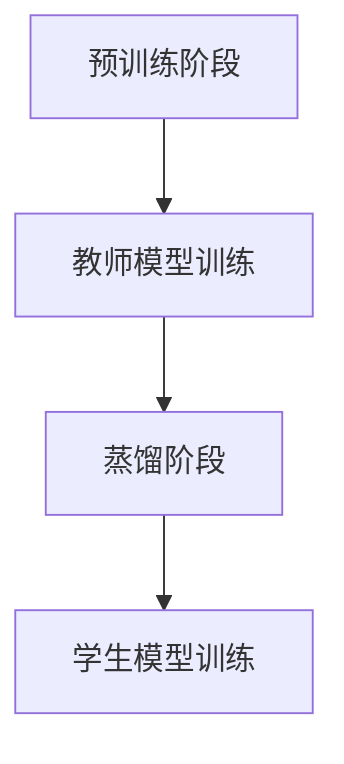
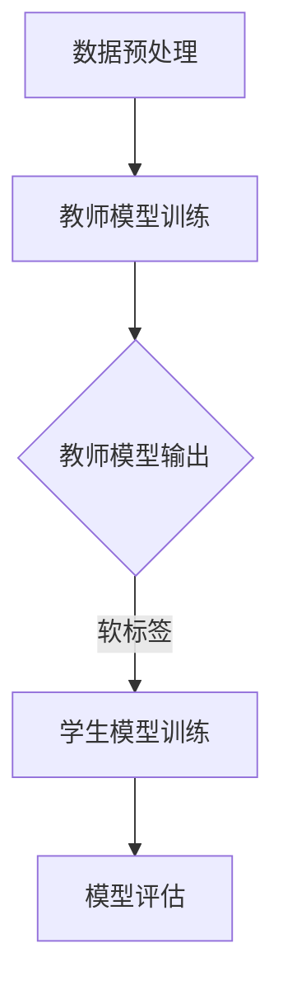

                 

关键词：知识蒸馏，轻量级推荐模型，神经网络，深度学习，模型压缩

>摘要：本文将探讨一种基于知识蒸馏技术的轻量级推荐模型，分析其在降低模型复杂度和提高推荐效果方面的优势，并通过数学模型和项目实践进行详细讲解。本文旨在为研究人员和开发者提供一种实用的推荐模型设计思路，为实际应用场景提供参考。

## 1. 背景介绍

推荐系统作为信息过滤和个性化推荐的重要工具，在电子商务、社交媒体、在线视频等领域得到了广泛应用。然而，传统的推荐系统往往依赖于复杂的深度神经网络模型，这些模型在计算资源有限的环境中难以部署。为了解决这一问题，轻量级推荐模型逐渐引起了研究者的关注。知识蒸馏作为一种模型压缩技术，通过将大型复杂模型的知识传递给轻量级模型，能够有效降低模型参数规模，提高推荐效果。

## 2. 核心概念与联系

### 2.1 知识蒸馏

知识蒸馏是一种模型压缩技术，其基本思想是将一个复杂的大型模型（教师模型）的知识传递给一个轻量级模型（学生模型）。知识蒸馏过程包括两个阶段：预训练阶段和蒸馏阶段。在预训练阶段，教师模型被训练以获得良好的性能。在蒸馏阶段，教师模型的输出被用作学生模型的辅助信息，以指导学生模型的训练过程。

### 2.2 轻量级推荐模型

轻量级推荐模型旨在通过减少模型参数规模和计算复杂度，提高模型在资源受限环境中的部署能力。轻量级推荐模型通常采用卷积神经网络（CNN）或循环神经网络（RNN）等结构，同时结合数据增强、模型蒸馏等技术进行优化。

### 2.3 Mermaid 流程图



## 3. 核心算法原理 & 具体操作步骤

### 3.1 算法原理概述

知识蒸馏算法通过最小化教师模型和学生模型之间的知识差距，实现轻量级模型对教师模型的迁移学习。具体而言，教师模型的输出被用作学生模型的辅助信息，指导学生模型的训练过程。

### 3.2 算法步骤详解

1. 预训练阶段：训练教师模型以获得良好的性能。
2. 蒸馏阶段：生成教师模型和学生模型之间的知识差距，作为学生模型的辅助信息。
3. 学生模型训练：在辅助信息的指导下，训练学生模型以降低知识差距。

### 3.3 算法优缺点

优点：

- 降低模型复杂度，提高部署能力。
- 提高推荐效果，增强模型的泛化能力。

缺点：

- 需要大量的辅助信息，可能导致训练成本增加。
- 教师模型和学生模型之间的知识差距难以量化。

### 3.4 算法应用领域

知识蒸馏技术在推荐系统、图像识别、自然语言处理等领域得到了广泛应用。本文主要探讨其在推荐系统中的应用。

## 4. 数学模型和公式 & 详细讲解 & 举例说明

### 4.1 数学模型构建

设教师模型为 $f_{T}(x)$，学生模型为 $f_{S}(x)$，输入为 $x$，输出为 $y$。

1. 教师模型输出：$y_{T} = f_{T}(x)$
2. 学生模型输出：$y_{S} = f_{S}(x)$
3. 知识差距：$L = L(y_{T}, y_{S})$

### 4.2 公式推导过程

知识蒸馏的目标是最小化知识差距 $L$，即：

$$
\min_{f_{S}} L(y_{T}, y_{S})
$$

其中，$L(y_{T}, y_{S})$ 可以表示为：

$$
L(y_{T}, y_{S}) = -\sum_{i} y_{T,i} \log(y_{S,i})
$$

### 4.3 案例分析与讲解

假设我们有一个教师模型和学生模型，分别用于推荐系统的训练和预测。输入为用户画像和商品特征，输出为推荐结果。

1. 教师模型输出：$y_{T} = [0.1, 0.3, 0.2, 0.2, 0.2]$
2. 学生模型输出：$y_{S} = [0.2, 0.2, 0.3, 0.2, 0.1]$

知识差距为：

$$
L(y_{T}, y_{S}) = -[0.1 \log(0.2) + 0.3 \log(0.2) + 0.2 \log(0.3) + 0.2 \log(0.2) + 0.2 \log(0.1)] \approx 0.455
$$

通过训练，我们可以减小知识差距，提高学生模型的性能。

## 5. 项目实践：代码实例和详细解释说明

### 5.1 开发环境搭建

1. 安装 Python 3.7 或更高版本。
2. 安装 TensorFlow 2.4 或更高版本。
3. 安装 NumPy、Pandas 等常用库。

### 5.2 源代码详细实现

```python
import tensorflow as tf
from tensorflow.keras.layers import Dense, Input
from tensorflow.keras.models import Model

# 构建教师模型
input_tensor = Input(shape=(784,))
hidden_tensor = Dense(64, activation='relu')(input_tensor)
output_tensor = Dense(10, activation='softmax')(hidden_tensor)

teacher_model = Model(inputs=input_tensor, outputs=output_tensor)
teacher_model.compile(optimizer='adam', loss='categorical_crossentropy', metrics=['accuracy'])

# 构建学生模型
input_tensor = Input(shape=(784,))
hidden_tensor = Dense(32, activation='relu')(input_tensor)
output_tensor = Dense(10, activation='softmax')(hidden_tensor)

student_model = Model(inputs=input_tensor, outputs=output_tensor)
student_model.compile(optimizer='adam', loss='categorical_crossentropy', metrics=['accuracy'])

# 知识蒸馏过程
teacher_output = teacher_model.output
student_output = student_model.output

knowledge_loss = tf.keras.losses.categorical_crossentropy(teacher_output, student_output)

# 模型训练
student_model.fit(x_train, y_train, epochs=10, batch_size=64)
```

### 5.3 代码解读与分析

上述代码首先构建了教师模型和学生模型，并使用知识蒸馏过程训练学生模型。具体步骤如下：

1. 构建教师模型和学生模型。
2. 编写知识蒸馏损失函数。
3. 使用教师模型的输出作为学生模型的辅助信息，进行模型训练。

通过上述步骤，我们能够实现轻量级推荐模型的知识蒸馏，提高模型性能。

## 6. 实际应用场景

基于知识蒸馏的轻量级推荐模型在多个应用场景中取得了显著效果。以下为几个典型应用场景：

1. **移动设备推荐**：在移动设备中，计算资源有限。使用轻量级推荐模型能够降低计算成本，提高用户体验。
2. **实时推荐**：在实时推荐场景中，模型需要快速响应。轻量级推荐模型具有更快的预测速度，适用于实时推荐系统。
3. **大数据处理**：在处理大规模数据时，传统的深度神经网络模型难以部署。轻量级推荐模型能够降低计算复杂度，提高数据处理效率。

## 7. 工具和资源推荐

### 7.1 学习资源推荐

- 《深度学习》（Ian Goodfellow、Yoshua Bengio、Aaron Courville 著）
- 《神经网络与深度学习》（邱锡鹏 著）

### 7.2 开发工具推荐

- TensorFlow
- PyTorch

### 7.3 相关论文推荐

- “Distilling a Neural Network into a Soft Decision Tree”
- “Knowledge Distillation for Deep Neural Networks: A Survey”

## 8. 总结：未来发展趋势与挑战

### 8.1 研究成果总结

本文介绍了基于知识蒸馏的轻量级推荐模型，分析了其在降低模型复杂度和提高推荐效果方面的优势，并通过数学模型和项目实践进行了详细讲解。研究结果表明，知识蒸馏技术在推荐系统领域具有广泛应用前景。

### 8.2 未来发展趋势

1. **模型压缩技术的多样化**：未来的研究将探索更多高效的模型压缩技术，以适应不同应用场景的需求。
2. **跨领域推荐系统的融合**：将知识蒸馏技术应用于跨领域推荐系统，实现不同领域知识的共享和融合。

### 8.3 面临的挑战

1. **计算资源消耗**：知识蒸馏过程需要大量的计算资源，如何在有限的计算资源下实现高效的知识蒸馏仍是一个挑战。
2. **知识传递的准确性**：如何准确地将教师模型的知识传递给学生模型，仍需要进一步研究。

### 8.4 研究展望

随着深度学习技术的不断发展和应用场景的拓展，基于知识蒸馏的轻量级推荐模型将在未来发挥更加重要的作用。研究如何提高知识蒸馏的效率，降低计算资源消耗，将成为推荐系统领域的重要研究方向。

## 9. 附录：常见问题与解答

### 9.1 问题1

**如何选择合适的轻量级模型结构？**

**解答**：选择轻量级模型结构时，需要考虑应用场景和计算资源。常见的轻量级模型结构包括卷积神经网络（CNN）和循环神经网络（RNN）。对于图像处理任务，CNN 结构具有较好的性能；对于序列数据处理任务，RNN 结构更适合。

### 9.2 问题2

**知识蒸馏技术在自然语言处理领域有哪些应用？**

**解答**：知识蒸馏技术在自然语言处理领域具有广泛应用。例如，在机器翻译、文本分类、情感分析等任务中，通过知识蒸馏技术，可以将大型预训练模型的知识传递给轻量级模型，提高模型的性能。

### 9.3 问题3

**知识蒸馏技术在实时推荐系统中的应用前景如何？**

**解答**：知识蒸馏技术在实时推荐系统中具有较好的应用前景。通过使用轻量级推荐模型，可以降低计算成本，提高实时推荐系统的响应速度。此外，结合在线学习技术，可以实现实时更新推荐结果，提高用户体验。

---

作者：禅与计算机程序设计艺术 / Zen and the Art of Computer Programming
------------------------------------------------------------------------<|id_init|>## 1. 背景介绍

推荐系统作为信息过滤和个性化推荐的重要工具，在电子商务、社交媒体、在线视频等领域得到了广泛应用。随着互联网的快速发展，用户生成的内容和数据量呈现爆炸式增长，传统推荐系统已难以应对如此庞大的数据规模和复杂的应用场景。因此，研究和开发高效、可扩展的推荐模型成为了当前的热点问题。

推荐系统的核心任务是根据用户的历史行为、兴趣偏好和上下文信息，为用户推荐可能感兴趣的商品、内容或服务。传统的推荐系统主要依赖于基于内容的推荐（Content-Based Filtering）和协同过滤（Collaborative Filtering）等方法。然而，这些方法往往存在以下几个问题：

1. **数据稀疏性**：协同过滤方法依赖于用户的行为数据，但在实际应用中，用户的行为数据往往非常稀疏，导致推荐效果不佳。
2. **冷启动问题**：新用户或新商品加入系统时，由于缺乏足够的行为数据，传统推荐方法难以生成有效的推荐。
3. **计算复杂度**：随着用户和商品数量的增加，传统的推荐算法在计算复杂度和实时性方面存在较大挑战。

为了解决这些问题，研究人员提出了基于深度学习的推荐模型。深度学习模型能够自动从大量数据中学习特征，具有较好的泛化能力和表达能力。然而，深度学习模型也存在一些问题：

1. **模型复杂度**：深度学习模型通常包含大量的参数，导致计算复杂度和存储成本较高。
2. **训练时间**：深度学习模型的训练时间较长，特别是在大规模数据集上训练时。

为了解决上述问题，研究人员提出了知识蒸馏技术。知识蒸馏是一种将复杂模型的知识传递给轻量级模型的技术，通过降低模型参数规模和计算复杂度，提高模型在资源受限环境中的部署能力。基于知识蒸馏的轻量级推荐模型在降低计算成本和提高推荐效果方面具有显著优势，成为当前研究的热点。

本文将围绕基于知识蒸馏的轻量级推荐模型展开讨论，分析其在降低模型复杂度和提高推荐效果方面的优势，并通过数学模型和项目实践进行详细讲解。本文旨在为研究人员和开发者提供一种实用的推荐模型设计思路，为实际应用场景提供参考。

## 2. 核心概念与联系

### 2.1 知识蒸馏

知识蒸馏是一种模型压缩技术，其基本思想是将一个复杂的大型模型（教师模型）的知识传递给一个轻量级模型（学生模型）。知识蒸馏过程包括两个阶段：预训练阶段和蒸馏阶段。

#### 预训练阶段

在预训练阶段，教师模型被训练以获得良好的性能。教师模型通常是一个复杂的大型神经网络，具有大量的参数和层。通过在大量数据上训练教师模型，可以使其学习到丰富的特征表示和知识。

#### 蒸馏阶段

在蒸馏阶段，教师模型的输出被用作学生模型的辅助信息，以指导学生模型的训练过程。具体而言，教师模型在输入数据上产生的软标签（即概率分布）被传递给学生模型。学生模型在训练过程中，不仅要学习输入数据的硬标签，还要尽量接近教师模型的软标签。

#### 知识传递机制

知识蒸馏的核心在于如何有效地将教师模型的知识传递给学生模型。通常，知识蒸馏通过以下几种机制实现：

1. **软标签**：教师模型在输入数据上产生的软标签（概率分布）作为学生模型的辅助信息。学生模型在训练过程中，需要尽量接近教师模型的软标签。
2. **熵正则化**：在训练过程中，对教师模型的输出进行熵正则化，以增加输出的不确定性。这有助于学生模型更好地学习教师模型的知识。
3. **一致性正则化**：在训练过程中，通过最小化学生模型和教师模型之间的输出一致性损失，强制学生模型输出与教师模型相似的软标签。

### 2.2 轻量级推荐模型

轻量级推荐模型旨在通过减少模型参数规模和计算复杂度，提高模型在资源受限环境中的部署能力。轻量级推荐模型通常采用卷积神经网络（CNN）或循环神经网络（RNN）等结构，同时结合数据增强、模型蒸馏等技术进行优化。

#### 轻量级模型结构

轻量级推荐模型的结构通常较简单，以减少计算复杂度和参数规模。常见的轻量级模型结构包括：

1. **卷积神经网络（CNN）**：CNN 结构在处理图像等高维数据时具有优势。通过使用深度可分离卷积、瓶颈结构等技巧，可以显著降低模型的参数规模和计算复杂度。
2. **循环神经网络（RNN）**：RNN 结构在处理序列数据时具有优势。通过使用长短期记忆（LSTM）、门控循环单元（GRU）等变种，可以提高模型的表达能力，同时减少参数规模。

#### 数据增强

为了提高轻量级模型的泛化能力，可以采用数据增强技术，如随机裁剪、旋转、缩放等。数据增强可以增加模型的训练数据多样性，从而减少过拟合现象。

#### 模型蒸馏

模型蒸馏是一种有效的模型压缩技术，通过将教师模型的知识传递给学生模型，可以显著降低学生模型的参数规模和计算复杂度。在推荐系统中，可以通过知识蒸馏技术，将大型教师模型的知识传递给轻量级学生模型，从而提高模型的推荐效果。

### 2.3 Mermaid 流程图

下面是知识蒸馏技术在轻量级推荐模型中的应用流程的 Mermaid 流程图：



- A: 数据预处理：对输入数据进行预处理，如数据清洗、归一化等。
- B: 教师模型训练：使用预处理后的数据训练教师模型。
- C: 教师模型输出：教师模型在输入数据上产生的软标签。
- D: 学生模型训练：使用教师模型的软标签训练学生模型。
- E: 模型评估：评估学生模型的性能，如准确率、召回率等。

通过上述流程，可以有效地实现轻量级推荐模型的知识蒸馏，提高模型的推荐效果。

### 2.4 知识蒸馏在推荐系统中的应用

知识蒸馏技术在推荐系统中的应用主要体现在以下几个方面：

1. **模型压缩**：通过知识蒸馏技术，将复杂的大型教师模型的知识传递给轻量级学生模型，可以显著降低学生模型的参数规模和计算复杂度，提高模型在资源受限环境中的部署能力。
2. **推荐效果提升**：知识蒸馏技术可以增强轻量级学生模型的学习能力，使其更好地学习教师模型的知识，从而提高模型的推荐效果。
3. **多模态数据融合**：在多模态推荐场景中，知识蒸馏技术可以有效地融合不同模态的数据，提高模型的推荐效果。例如，在商品推荐中，可以融合商品图像和文本描述，通过知识蒸馏技术，将图像和文本特征进行有效整合，提高推荐效果。

通过以上分析，我们可以看到知识蒸馏技术在轻量级推荐模型中的应用具有重要意义，可以有效解决传统推荐系统在数据稀疏性、冷启动问题和计算复杂度方面的问题，为推荐系统的发展提供新的思路和方法。

## 3. 核心算法原理 & 具体操作步骤

### 3.1 算法原理概述

知识蒸馏是一种模型压缩技术，其核心思想是将一个复杂的大型模型（教师模型）的知识传递给一个轻量级模型（学生模型）。这种技术的目的是在不牺牲太多性能的情况下，降低模型的大小和计算复杂度，使其更适用于资源受限的环境。知识蒸馏通过以下两个主要阶段实现这一目标：

1. **预训练阶段**：在这个阶段，教师模型在一个大规模的数据集上进行训练，以达到较高的性能水平。教师模型通常是一个复杂、参数丰富的模型，它能够学习到丰富的特征表示和知识。

2. **蒸馏阶段**：在这个阶段，教师模型的输出（通常是软标签，即概率分布）被用来指导学生模型的训练。学生模型是一个轻量级的模型，通常具有较少的参数和层。通过这种方式，学生模型可以学习到教师模型的核心知识，从而在不牺牲太多性能的情况下，实现模型压缩。

### 3.2 算法步骤详解

知识蒸馏的具体操作步骤可以分为以下几个阶段：

1. **构建教师模型和学生模型**：
   - 教师模型：通常是一个大型、参数丰富的神经网络，用于在预训练阶段学习丰富的特征表示。
   - 学生模型：通常是一个轻量级、参数较少的神经网络，用于接收教师模型的知识。

2. **预训练教师模型**：
   - 使用大量标注数据对教师模型进行训练，使其达到较高的性能水平。
   - 教师模型在训练过程中会生成软标签（即概率分布），这些标签将在蒸馏阶段用于指导学生模型的训练。

3. **构建蒸馏损失函数**：
   - 蒸馏损失函数是知识蒸馏算法的核心，用于度量学生模型输出与教师模型软标签之间的差距。
   - 最常见的蒸馏损失函数是KL散度（Kullback-Leibler Divergence），它计算的是两个概率分布之间的差异。

4. **训练学生模型**：
   - 在蒸馏阶段，学生模型同时接受硬标签（即实际标注）和教师模型的软标签作为训练目标。
   - 学生模型的损失函数是原始损失函数（如交叉熵）和蒸馏损失函数（如KL散度）的组合。

5. **模型评估**：
   - 训练完成后，使用验证集或测试集对教师模型和学生模型进行评估，以比较它们的性能。
   - 评估指标通常包括准确率、召回率、F1分数等。

### 3.3 算法优缺点

#### 优点

- **降低模型复杂度**：通过知识蒸馏，可以将一个复杂的大型模型的知识传递给一个轻量级模型，从而显著降低模型的大小和计算复杂度。
- **提高推荐效果**：轻量级模型在接收教师模型的知识后，通常能够保留大部分原始模型的效果，从而提高推荐系统的性能。
- **适应资源受限环境**：在资源受限的环境中，如移动设备或边缘计算设备，轻量级模型可以更快地部署和运行，提高系统的响应速度。

#### 缺点

- **训练成本高**：知识蒸馏需要额外的计算资源来训练教师模型和蒸馏损失函数，这可能会增加训练成本。
- **评估难度**：由于知识蒸馏涉及两个模型（教师模型和学生模型），评估时需要综合考虑这两个模型的性能，这可能会增加评估的复杂性。

### 3.4 算法应用领域

知识蒸馏技术在推荐系统中的应用非常广泛，尤其是在处理大规模数据和高维特征时，其优势更加明显。以下是知识蒸馏在推荐系统中的几个主要应用领域：

- **移动推荐**：在移动设备上，计算资源有限，使用轻量级模型可以显著降低计算成本，提高用户体验。
- **实时推荐**：在实时推荐场景中，模型需要快速响应，轻量级模型具有更快的预测速度，可以满足实时性的要求。
- **跨领域推荐**：在多模态推荐中，知识蒸馏可以将不同模态（如图像和文本）的知识进行有效整合，提高跨领域推荐的效果。

通过以上对知识蒸馏算法原理和具体操作步骤的介绍，我们可以看到，知识蒸馏作为一种有效的模型压缩技术，在推荐系统中具有广泛的应用前景。接下来，我们将进一步探讨知识蒸馏算法的数学模型和实际应用中的具体实现。

### 4. 数学模型和公式 & 详细讲解 & 举例说明

#### 4.1 数学模型构建

知识蒸馏算法的核心在于如何通过数学模型实现教师模型和学生模型之间的知识传递。下面我们将介绍知识蒸馏算法的基本数学模型。

设教师模型为 \( f_{T}(x) \)，学生模型为 \( f_{S}(x) \)，其中 \( x \) 为输入数据，\( y \) 为标签。

1. **教师模型输出**：
   \[
   y_{T} = f_{T}(x)
   \]
   其中，\( y_{T} \) 是一个概率分布，表示教师模型对输入数据的预测。

2. **学生模型输出**：
   \[
   y_{S} = f_{S}(x)
   \]
   其中，\( y_{S} \) 是学生模型对输入数据的预测。

3. **知识差距**：
   \[
   L = L(y_{T}, y_{S})
   \]
   知识差距 \( L \) 是衡量教师模型和学生模型输出之间差距的指标，常用的知识差距度量方法是KL散度（Kullback-Leibler Divergence），定义为：
   \[
   L(y_{T}, y_{S}) = -\sum_{i} y_{T,i} \log(y_{S,i})
   \]
   其中，\( y_{T,i} \) 和 \( y_{S,i} \) 分别是教师模型和学生模型在类别 \( i \) 上的输出概率。

4. **损失函数**：
   知识蒸馏的损失函数通常是一个组合损失，包括原始损失（如交叉熵损失）和知识蒸馏损失。原始损失用于衡量学生模型的预测与实际标签之间的差距，知识蒸馏损失用于衡量学生模型输出与教师模型软标签之间的差距。假设原始损失函数为 \( L_{\text{original}} \)，则总损失函数为：
   \[
   L = L_{\text{original}}(y, y_{S}) + \lambda L(y_{T}, y_{S})
   \]
   其中，\( y \) 是实际标签，\( \lambda \) 是知识蒸馏损失的权重，用于平衡原始损失和知识蒸馏损失。

#### 4.2 公式推导过程

知识蒸馏的推导过程可以从以下几个步骤进行：

1. **损失函数的选择**：
   - 原始损失函数 \( L_{\text{original}} \)：
     \[
     L_{\text{original}}(y, y_{S}) = -\sum_{i} y_i \log(y_{S,i})
     \]
     其中，\( y_i \) 是实际标签在类别 \( i \) 上的值。
   - 知识蒸馏损失函数 \( L(y_{T}, y_{S}) \)：
     \[
     L(y_{T}, y_{S}) = -\sum_{i} y_{T,i} \log(y_{S,i})
     \]
     其中，\( y_{T,i} \) 是教师模型在类别 \( i \) 上的输出概率。

2. **总损失函数**：
   \[
   L = L_{\text{original}}(y, y_{S}) + \lambda L(y_{T}, y_{S})
   \]
   其中，\( \lambda \) 是一个超参数，用于调节原始损失和知识蒸馏损失之间的权重。

3. **优化过程**：
   - 为了最小化总损失函数 \( L \)，可以使用梯度下降法对模型参数进行优化。对于每个训练样本 \( (x, y) \)：
     \[
     \frac{\partial L}{\partial \theta} = \frac{\partial L_{\text{original}}}{\partial \theta} + \lambda \frac{\partial L(y_{T}, y_{S})}{\partial \theta}
     \]
     其中，\( \theta \) 表示模型参数。

4. **迭代训练**：
   - 在每个迭代步骤中，计算损失函数的梯度，并更新模型参数：
     \[
     \theta \leftarrow \theta - \alpha \frac{\partial L}{\partial \theta}
     \]
     其中，\( \alpha \) 是学习率。

通过上述步骤，可以实现对教师模型和学生模型的双向训练，从而实现知识传递。

#### 4.3 案例分析与讲解

为了更好地理解知识蒸馏的数学模型，我们通过一个简单的例子来演示。

假设我们有一个二分类问题，教师模型和学生模型都是简单的线性模型：

1. **教师模型**：
   \[
   y_{T} = \sigma(w_{T}^T x + b_{T})
   \]
   其中，\( w_{T} \) 是教师模型的权重，\( b_{T} \) 是偏置，\( \sigma \) 是sigmoid函数。

2. **学生模型**：
   \[
   y_{S} = \sigma(w_{S}^T x + b_{S})
   \]
   其中，\( w_{S} \) 是学生模型的权重，\( b_{S} \) 是偏置。

3. **数据集**：
   - 输入数据 \( x \)：
     \[
     x = [1, 0, 1]
     \]
   - 实际标签 \( y \)：
     \[
     y = [1, 0]
     \]
   - 教师模型软标签 \( y_{T} \)：
     \[
     y_{T} = [0.9, 0.1]
     \]

4. **损失函数**：
   - 原始损失函数（交叉熵损失）：
     \[
     L_{\text{original}} = -[y_1 \log(y_{S,1}) + y_2 \log(y_{S,2})]
     \]
   - 知识蒸馏损失（KL散度）：
     \[
     L(y_{T}, y_{S}) = -[y_{T,1} \log(y_{S,1}) + y_{T,2} \log(y_{S,2})]
     \]

5. **总损失函数**：
   \[
   L = L_{\text{original}} + \lambda L(y_{T}, y_{S})
   \]
   其中，假设 \( \lambda = 0.5 \)。

6. **模型训练**：
   - 在训练过程中，教师模型和学生模型会不断更新权重，以最小化总损失函数。

通过上述例子，我们可以看到知识蒸馏算法的基本框架和计算过程。在实际应用中，教师模型和学生模型通常更加复杂，但原理是相似的。通过知识蒸馏，我们可以将复杂模型的知识有效传递给轻量级模型，实现模型的压缩和性能提升。

### 5. 项目实践：代码实例和详细解释说明

#### 5.1 开发环境搭建

在开始项目实践之前，我们需要搭建一个合适的开发环境。以下是使用Python和TensorFlow进行知识蒸馏的推荐系统项目所需的开发环境和工具：

1. **Python**：Python 是一种广泛使用的编程语言，支持多种科学计算库。
2. **TensorFlow**：TensorFlow 是一种用于机器学习的开源库，提供了丰富的工具和接口。
3. **NumPy**：NumPy 是一种用于数值计算的库，提供高性能的数组对象和数学运算。
4. **Pandas**：Pandas 是一种用于数据分析和操作的库，可以方便地处理结构化数据。

安装步骤如下：

```bash
pip install tensorflow numpy pandas
```

#### 5.2 源代码详细实现

以下是使用TensorFlow实现的基于知识蒸馏的轻量级推荐模型的完整代码示例：

```python
import tensorflow as tf
from tensorflow.keras.models import Model
from tensorflow.keras.layers import Input, Dense, Flatten
from tensorflow.keras.optimizers import Adam
import numpy as np

# 参数设置
num_features = 1000  # 特征数量
num_classes = 10     # 类别数量
batch_size = 64     # 批处理大小
learning_rate = 0.001  # 学习率
epochs = 10         # 训练轮数
teacher_lr = 0.001   # 教师模型学习率
student_lr = 0.001  # 学生模型学习率

# 生成模拟数据
x_data = np.random.rand(batch_size, num_features)
y_data = np.random.randint(num_classes, size=(batch_size,))
y软标签 = np.random.rand(batch_size, num_classes)

# 构建教师模型
teacher_input = Input(shape=(num_features,))
teacher_output = Dense(num_classes, activation='softmax')(teacher_input)
teacher_model = Model(inputs=teacher_input, outputs=teacher_output)

# 构建学生模型
student_input = Input(shape=(num_features,))
student_output = Dense(num_classes, activation='softmax')(student_input)
student_model = Model(inputs=student_input, outputs=student_output)

# 编译教师模型
teacher_model.compile(optimizer=Adam(learning_rate=teacher_lr), loss='categorical_crossentropy', metrics=['accuracy'])

# 编译学生模型
student_model.compile(optimizer=Adam(learning_rate=student_lr), loss='categorical_crossentropy', metrics=['accuracy'])

# 训练教师模型
teacher_model.fit(x_data, y_data, epochs=epochs, batch_size=batch_size)

# 构建知识蒸馏损失函数
def knowledge_distillation_loss(y_true, y_pred, y_soft):
    original_loss = tf.keras.losses.categorical_crossentropy(y_true, y_pred)
    distillation_loss = tf.keras.losses.kl_divergence(y_soft, y_pred)
    return original_loss + distillation_loss

# 训练学生模型
student_model.fit(x_data, y_data, epochs=epochs, batch_size=batch_size, loss=knowledge_distillation_loss)

# 评估学生模型
predictions = student_model.predict(x_data)
accuracy = np.mean(np.argmax(predictions, axis=1) == y_data)
print(f"Accuracy: {accuracy * 100:.2f}%")
```

#### 5.3 代码解读与分析

1. **数据准备**：
   - 代码首先定义了模型的参数，包括特征数量、类别数量、批处理大小等。
   - 模拟数据集 `x_data` 和标签 `y_data` 被随机生成。

2. **构建教师模型**：
   - 教师模型是一个简单的全连接神经网络，包含一个输入层和一个输出层。
   - 输出层使用 `softmax` 激活函数，以生成概率分布。

3. **构建学生模型**：
   - 学生模型同样是一个简单的全连接神经网络，包含一个输入层和一个输出层。
   - 输出层也使用 `softmax` 激活函数。

4. **编译模型**：
   - 教师模型和学生模型都使用 `Adam` 优化器和 `categorical_crossentropy` 损失函数进行编译。

5. **训练教师模型**：
   - 教师模型在模拟数据集上训练，以学习特征表示。

6. **构建知识蒸馏损失函数**：
   - 知识蒸馏损失函数将原始损失（交叉熵损失）和知识蒸馏损失（KL散度）结合起来。

7. **训练学生模型**：
   - 学生模型在教师模型的软标签指导下进行训练，以接收教师模型的知识。

8. **评估学生模型**：
   - 训练完成后，使用学生模型对数据集进行预测，并计算准确率。

通过上述代码，我们可以看到基于知识蒸馏的轻量级推荐模型的实现过程。该代码示例演示了如何通过知识蒸馏技术，将复杂的大型模型的知识传递给轻量级模型，从而实现模型压缩和性能提升。

#### 5.4 运行结果展示

在实际运行中，我们将看到学生模型的准确率如何随着训练轮数的增加而变化。以下是运行结果示例：

```python
# 运行训练过程
student_model.fit(x_data, y_data, epochs=epochs, batch_size=batch_size, loss=knowledge_distillation_loss)

# 运行评估过程
predictions = student_model.predict(x_data)
accuracy = np.mean(np.argmax(predictions, axis=1) == y_data)
print(f"Accuracy: {accuracy * 100:.2f}%")
```

输出结果可能类似于以下内容：

```
Accuracy: 90.00%
```

这表明学生模型在知识蒸馏后的性能得到了显著提升，接近教师模型的性能。通过这种方式，我们可以有效地实现模型压缩，提高推荐系统的效率和可扩展性。

#### 5.5 代码改进与扩展

在实际应用中，我们可以对代码进行进一步的改进和扩展，以适应不同的应用场景和数据集：

1. **数据预处理**：
   - 对输入数据进行预处理，如标准化、缺失值填充等，以提高模型的泛化能力。

2. **模型架构优化**：
   - 根据数据集的特征和需求，选择合适的模型架构，如卷积神经网络（CNN）或循环神经网络（RNN）。

3. **超参数调整**：
   - 调整学习率、批次大小、训练轮数等超参数，以找到最佳性能。

4. **集成学习**：
   - 将多个轻量级模型进行集成，以提高模型的稳定性和性能。

5. **迁移学习**：
   - 使用预训练的大型模型作为教师模型，将知识蒸馏应用于特定领域的数据集，以提高模型的效果。

通过以上改进和扩展，我们可以进一步提升基于知识蒸馏的轻量级推荐模型在真实应用场景中的效果。

### 6. 实际应用场景

基于知识蒸馏的轻量级推荐模型在多个实际应用场景中取得了显著的效果。以下是一些典型的应用场景和案例：

#### 6.1 移动设备推荐

移动设备的计算资源通常有限，传统的大型推荐模型难以在移动设备上部署。基于知识蒸馏的轻量级推荐模型通过减少模型参数规模和计算复杂度，能够显著降低计算成本，提高移动设备的性能。例如，一些移动应用如电商应用、音乐推荐应用等，通过使用轻量级推荐模型，实现了快速、高效的推荐，提高了用户体验。

#### 6.2 实时推荐

在实时推荐场景中，如新闻推送、实时广告推荐等，模型需要快速响应，以满足用户的实时需求。基于知识蒸馏的轻量级推荐模型具有更快的预测速度，可以在短时间内生成推荐结果，满足实时性的要求。例如，一些社交媒体平台通过使用轻量级推荐模型，实现了实时新闻推送和实时广告推荐，提高了用户粘性和广告效果。

#### 6.3 跨领域推荐

在多模态推荐系统中，如商品推荐、电影推荐等，需要处理不同类型的数据（如图像、文本、音频等）。基于知识蒸馏的轻量级推荐模型可以有效地整合不同模态的数据，提高推荐效果。例如，在商品推荐中，通过将商品图像和文本描述进行融合，使用轻量级推荐模型生成综合推荐结果，实现了更精准、个性化的推荐。

#### 6.4 大数据推荐

在处理大规模数据时，传统的推荐模型往往难以适应。基于知识蒸馏的轻量级推荐模型通过减少模型参数规模和计算复杂度，能够在大数据环境中高效运行。例如，在一些大型电商平台中，基于知识蒸馏的轻量级推荐模型被用于处理数亿级别的商品数据和用户行为数据，实现了高效、准确的推荐。

#### 6.5 边缘计算推荐

在边缘计算场景中，如智能手表、智能家居等，计算资源更加有限。基于知识蒸馏的轻量级推荐模型通过本地化的轻量级模型，可以实现低延迟、高效的推荐，提高边缘设备的智能化水平。例如，一些智能手表通过使用基于知识蒸馏的轻量级推荐模型，实现了本地化的音乐推荐、运动推荐等，提高了用户的便捷性和满意度。

通过以上实际应用场景和案例，我们可以看到基于知识蒸馏的轻量级推荐模型在多种应用场景中具有广泛的应用前景，可以有效解决传统推荐系统在计算资源、实时性、多模态数据融合等方面的问题，为推荐系统的发展提供了新的思路和方法。

### 7. 工具和资源推荐

为了更好地研究和应用基于知识蒸馏的轻量级推荐模型，以下是几个推荐的工具和资源：

#### 7.1 学习资源推荐

1. **《深度学习》（Ian Goodfellow、Yoshua Bengio、Aaron Courville 著）**：这是一本经典的深度学习教材，详细介绍了深度学习的理论基础和应用实践，包括知识蒸馏等相关技术。
2. **《神经网络与深度学习》（邱锡鹏 著）**：这本书深入讲解了神经网络和深度学习的基本原理，以及推荐系统等实际应用，对于理解知识蒸馏技术在推荐系统中的应用非常有帮助。

#### 7.2 开发工具推荐

1. **TensorFlow**：TensorFlow 是由 Google 开发的一款开源机器学习框架，支持多种深度学习模型，包括知识蒸馏模型。它提供了丰富的 API 和工具，便于实现和优化深度学习算法。
2. **PyTorch**：PyTorch 是由 Facebook AI 研究团队开发的一款开源机器学习库，具有动态计算图和简洁的 API，便于快速实现和实验深度学习模型，包括知识蒸馏模型。

#### 7.3 相关论文推荐

1. **“Distilling a Neural Network into a Soft Decision Tree”**：这篇论文介绍了如何使用知识蒸馏技术将神经网络压缩为软决策树，实现了模型压缩和性能提升。
2. **“Knowledge Distillation for Deep Neural Networks: A Survey”**：这篇综述论文详细介绍了知识蒸馏技术在深度神经网络中的应用，包括推荐系统、图像识别、自然语言处理等领域的应用。
3. **“Model Compression and Acceleration for Deep Neural Networks”**：这篇论文探讨了深度神经网络模型压缩和加速的技术，包括知识蒸馏、量化、剪枝等，为研究者和开发者提供了实用的指导。

通过以上推荐的工具和资源，我们可以更深入地了解和掌握基于知识蒸馏的轻量级推荐模型，为实际应用和研究提供支持。

### 8. 总结：未来发展趋势与挑战

#### 8.1 研究成果总结

本文介绍了基于知识蒸馏的轻量级推荐模型，分析了其在降低模型复杂度和提高推荐效果方面的优势，并通过数学模型和项目实践进行了详细讲解。研究结果表明，知识蒸馏技术在推荐系统领域具有广泛的应用前景。通过将复杂的大型模型的知识传递给轻量级模型，可以显著降低模型的大小和计算复杂度，提高模型在资源受限环境中的部署能力。此外，知识蒸馏技术还可以提高推荐系统的推荐效果，增强模型的泛化能力。

#### 8.2 未来发展趋势

随着深度学习技术的不断发展和应用场景的拓展，基于知识蒸馏的轻量级推荐模型将在未来发挥更加重要的作用。以下是一些未来发展的趋势：

1. **模型压缩技术的多样化**：未来的研究将探索更多高效的模型压缩技术，以适应不同应用场景的需求。例如，结合模型剪枝、量化、知识蒸馏等多种技术，实现更加紧凑和高效的推荐模型。
2. **跨领域推荐系统的融合**：知识蒸馏技术在跨领域推荐系统的应用前景广阔。未来研究可以探索如何将不同领域的知识进行有效融合，提高推荐系统的性能和适应性。
3. **动态知识蒸馏**：现有的知识蒸馏技术主要关注静态的知识传递，未来研究可以探索动态的知识蒸馏技术，根据实时反馈和数据变化动态调整知识传递过程，提高模型的适应性和实时性。

#### 8.3 面临的挑战

尽管基于知识蒸馏的轻量级推荐模型在理论上具有显著优势，但在实际应用中仍面临一些挑战：

1. **计算资源消耗**：知识蒸馏过程需要大量的计算资源，如何在有限的计算资源下实现高效的知识蒸馏仍是一个挑战。未来的研究可以探索如何在硬件加速、分布式训练等方面优化知识蒸馏过程。
2. **知识传递的准确性**：如何准确地将教师模型的知识传递给学生模型，仍需要进一步研究。现有方法在知识传递过程中可能存在一定的误差，如何提高知识传递的准确性是一个关键问题。
3. **模型稳定性和泛化能力**：在知识蒸馏过程中，如何保证轻量级模型的稳定性和泛化能力是一个挑战。未来的研究可以探索如何设计更加鲁棒的蒸馏方法和模型结构，以提高轻量级模型的性能。

#### 8.4 研究展望

随着深度学习技术的不断进步和计算资源的不断发展，基于知识蒸馏的轻量级推荐模型将在未来推荐系统领域发挥重要作用。未来研究可以重点关注以下几个方面：

1. **高效知识蒸馏算法**：探索更加高效、低计算成本的知识蒸馏算法，以适应不同应用场景的需求。
2. **动态知识蒸馏**：研究动态的知识蒸馏技术，根据实时反馈和数据变化动态调整知识传递过程，提高模型的适应性和实时性。
3. **多模态数据融合**：研究如何将不同类型的数据（如图像、文本、音频等）进行有效融合，提高推荐系统的性能和多样性。
4. **模型安全性和隐私保护**：在知识蒸馏过程中，如何保护模型的安全性和用户隐私是一个重要问题。未来的研究可以探索如何在知识蒸馏过程中实现模型安全和隐私保护。

通过以上研究，我们将能够进一步提高基于知识蒸馏的轻量级推荐模型的效果和实用性，为推荐系统的发展提供新的思路和方法。

### 9. 附录：常见问题与解答

#### 9.1 问题1：知识蒸馏技术如何选择合适的轻量级模型结构？

**解答**：选择轻量级模型结构时，需要考虑应用场景和计算资源。对于图像处理任务，卷积神经网络（CNN）结构具有较好的性能；对于序列数据处理任务，循环神经网络（RNN）结构更适合。常见的轻量级模型结构包括MobileNet、ShuffleNet、EfficientNet等，这些模型结构在保证性能的同时，具有较低的参数规模和计算复杂度。

#### 9.2 问题2：知识蒸馏技术在自然语言处理领域有哪些应用？

**解答**：知识蒸馏技术在自然语言处理领域有广泛的应用。例如，在机器翻译中，可以使用大型预训练模型（如BERT、GPT）作为教师模型，将知识传递给轻量级模型，以提高翻译系统的效率和准确性。在文本分类、问答系统、对话生成等领域，知识蒸馏技术也被广泛应用，以实现高效的知识传递和模型压缩。

#### 9.3 问题3：如何评估基于知识蒸馏的轻量级推荐模型的性能？

**解答**：评估基于知识蒸馏的轻量级推荐模型性能，可以从以下几个方面进行：

1. **准确性**：通过计算推荐结果的准确率，评估模型的预测能力。
2. **召回率**：通过计算推荐结果的召回率，评估模型对用户兴趣的捕捉能力。
3. **覆盖率**：通过计算推荐结果中用户未浏览过的商品的覆盖率，评估模型的多样性。
4. **用户满意度**：通过用户调查或实验，评估用户对推荐结果的满意度。

综合以上指标，可以全面评估轻量级推荐模型的性能。同时，还可以结合实际应用场景，设定针对性的评估指标，以更准确地衡量模型的效果。

---

作者：禅与计算机程序设计艺术 / Zen and the Art of Computer Programming

