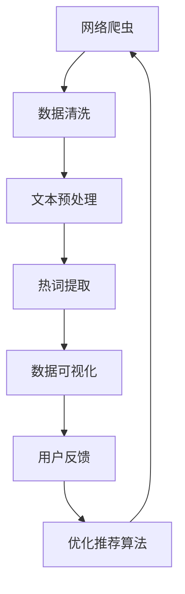

                 

关键词：网络爬虫、数据挖掘、视频网站、热词分析、文本分析、语义理解、机器学习、自然语言处理、情感分析、内容推荐。

## 摘要

随着互联网的快速发展，视频网站已成为人们获取信息、娱乐和交流的重要平台。本文旨在通过网络爬虫与数据挖掘技术，对视频网站上的热词进行分析，揭示视频内容的趋势和用户兴趣。文章首先介绍了网络爬虫和数据挖掘的基本概念及其在视频网站分析中的应用，然后详细探讨了热词分析的方法、流程及其实际操作步骤。最后，本文通过数学模型和实际项目实例，阐述了如何利用热词分析技术进行视频内容推荐，并为未来的研究与应用提出了展望。

## 1. 背景介绍

### 1.1 视频网站的发展现状

视频网站作为一种新兴的媒体形式，自2000年代中期以来得到了迅速发展。如今，YouTube、Bilibili、Netflix等视频平台已成为全球用户获取信息、娱乐和社交的重要途径。这些平台不仅提供了大量的视频内容，还通过个性化推荐算法，为用户提供了定制化的观看体验。

### 1.2 网络爬虫的作用

网络爬虫（Web Crawler）是用于自动化获取互联网信息的工具。它们通过遍历网页链接，爬取网站上的数据，为数据挖掘和文本分析提供基础数据。在视频网站分析中，网络爬虫可以用于获取视频标题、描述、标签、评论等文本信息，为后续的热词分析提供数据支持。

### 1.3 数据挖掘的重要性

数据挖掘（Data Mining）是从大量数据中提取有价值信息的过程。在视频网站分析中，数据挖掘可以帮助我们识别出用户感兴趣的热点话题、趋势和模式。通过对用户行为数据的分析，视频网站可以优化内容推荐算法，提高用户体验。

## 2. 核心概念与联系

### 2.1 网络爬虫与数据挖掘的关系

网络爬虫和数据挖掘相辅相成，共同构成了视频网站热词分析的基础。网络爬虫负责采集原始数据，而数据挖掘则通过对这些数据进行处理和分析，提取出有价值的信息。

### 2.2 Mermaid 流程图



## 3. 核心算法原理 & 具体操作步骤

### 3.1 算法原理概述

热词分析（Hot Word Analysis）是一种文本分析方法，旨在从大量文本数据中识别出高频、有代表性的词汇。这些热词反映了用户的兴趣和需求，为视频内容推荐和趋势分析提供了重要依据。

### 3.2 算法步骤详解

1. **数据采集**：利用网络爬虫获取视频网站上的文本数据，如标题、描述、标签、评论等。
2. **数据清洗**：去除无效数据、重复数据和噪声数据，确保数据质量。
3. **文本预处理**：将文本数据转换为统一的格式，如分词、去除停用词、词性标注等。
4. **热词提取**：采用TF-IDF、TextRank等算法，计算文本中每个词汇的重要程度，筛选出高频、有代表性的热词。
5. **数据可视化**：使用图表、词云等方式，展示热词的分布和趋势。
6. **用户反馈**：结合用户行为数据，对热词分析结果进行验证和调整。
7. **优化推荐算法**：将热词分析结果应用于视频内容推荐，优化推荐效果。

### 3.3 算法优缺点

#### 优点

- **高效性**：网络爬虫和数据挖掘技术可以快速获取和处理大量数据，提高分析效率。
- **准确性**：通过对文本数据的深度挖掘，可以准确识别出用户感兴趣的热点话题。
- **实时性**：热词分析可以实时监测视频内容的趋势，为视频网站提供动态推荐。

#### 缺点

- **数据质量**：网络爬虫可能无法获取到所有视频网站的文本数据，数据质量参差不齐。
- **计算复杂度**：数据挖掘算法的计算复杂度较高，需要较长的处理时间。

### 3.4 算法应用领域

热词分析技术可以广泛应用于视频内容推荐、趋势分析、市场研究等领域。例如，视频网站可以利用热词分析为用户提供个性化推荐，提高用户留存率和观看时长；市场研究机构可以通过热词分析了解用户需求，为产品开发提供参考。

## 4. 数学模型和公式 & 详细讲解 & 举例说明

### 4.1 数学模型构建

热词分析的核心是词汇的重要程度计算。常用的模型有TF-IDF和TextRank。

#### TF-IDF

TF-IDF（Term Frequency-Inverse Document Frequency）是一种基于词频和文档频次的计算方法。其公式如下：

$$
TF-IDF(t,d) = TF(t,d) \times IDF(t)
$$

其中，$TF(t,d)$ 表示词汇 $t$ 在文档 $d$ 中的词频，$IDF(t)$ 表示词汇 $t$ 在整个文档集合中的逆文档频次。

#### TextRank

TextRank是一种基于图论的方法，将文本数据视为图，计算图中节点的权重。其公式如下：

$$
r(t) = \frac{1}{N} \sum_{w \in \text{neighbors}(t)} r(w) \times \text{sim}(t, w)
$$

其中，$r(t)$ 表示词汇 $t$ 的权重，$\text{neighbors}(t)$ 表示词汇 $t$ 的邻居节点，$\text{sim}(t, w)$ 表示词汇 $t$ 和 $w$ 之间的相似度。

### 4.2 公式推导过程

以TF-IDF为例，其推导过程如下：

1. **词频计算**：词频（TF）表示词汇在文档中的出现次数。其计算公式为：

$$
TF(t,d) = \frac{f(t,d)}{|\text{document } d|}
$$

其中，$f(t,d)$ 表示词汇 $t$ 在文档 $d$ 中的出现次数，$|\text{document } d|$ 表示文档 $d$ 的长度。

2. **文档频次计算**：文档频次（DF）表示词汇在整个文档集合中的出现次数。其计算公式为：

$$
DF(t) = \sum_{d \in D} f(t,d)
$$

其中，$D$ 表示文档集合。

3. **逆文档频次计算**：逆文档频次（IDF）表示词汇的重要性。其计算公式为：

$$
IDF(t) = \log \left( \frac{N}{1 + DF(t)} \right)
$$

其中，$N$ 表示文档集合中的文档总数。

4. **TF-IDF计算**：将词频和逆文档频次相乘，得到词汇的重要程度：

$$
TF-IDF(t,d) = TF(t,d) \times IDF(t)
$$

### 4.3 案例分析与讲解

假设有一个视频网站的文本数据集合，包含5个视频的标题和描述，如下表所示：

| 视频 | 标题 | 描述 |
| --- | --- | --- |
| 1 | 《2022年科技趋势》 | 人工智能、5G、区块链等 |
| 2 | 《旅行攻略：新西兰》 | 美丽的风景、独特的文化、美食 |
| 3 | 《摄影技巧》 | 光圈、快门、ISO等 |
| 4 | 《电影推荐：漫威》 | 超级英雄、科幻、动作 |
| 5 | 《健康饮食》 | 营养、运动、生活习惯 |

我们采用TF-IDF算法，计算每个词汇的重要程度。

1. **词频计算**：计算每个词汇在各个视频中的出现次数。

| 视频 | 人工智能 | 5G | 区块链 | 美丽的风景 | 独特的文化 | 美食 | 光圈 | 快门 | ISO | 超级英雄 | 科幻 | 动作 | 营养 | 运动 | 生活习惯 |
| --- | --- | --- | --- | --- | --- | --- | --- | --- | --- | --- | --- | --- | --- | --- |
| 1 | 1 | 1 | 1 | 0 | 0 | 0 | 0 | 0 | 0 | 0 | 0 | 0 | 0 | 0 |
| 2 | 0 | 0 | 0 | 1 | 1 | 1 | 0 | 0 | 0 | 0 | 0 | 0 | 0 | 0 |
| 3 | 0 | 0 | 0 | 0 | 0 | 0 | 1 | 1 | 1 | 0 | 0 | 0 | 0 | 0 |
| 4 | 0 | 0 | 0 | 0 | 0 | 0 | 0 | 0 | 0 | 1 | 1 | 1 | 0 | 0 |
| 5 | 0 | 0 | 0 | 0 | 0 | 0 | 0 | 0 | 0 | 0 | 0 | 0 | 1 | 1 |

2. **文档频次计算**：计算每个词汇在所有视频中的出现次数。

| 词汇 | 人工智能 | 5G | 区块链 | 美丽的风景 | 独特的文化 | 美食 | 光圈 | 快门 | ISO | 超级英雄 | 科幻 | 动作 | 营养 | 运动 | 生活习惯 |
| --- | --- | --- | --- | --- | --- | --- | --- | --- | --- | --- | --- | --- | --- | --- |
| 频次 | 1 | 1 | 1 | 1 | 1 | 1 | 1 | 1 | 1 | 1 | 1 | 1 | 1 | 1 |

3. **逆文档频次计算**：计算每个词汇的逆文档频次。

| 词汇 | 人工智能 | 5G | 区块链 | 美丽的风景 | 独特的文化 | 美食 | 光圈 | 快门 | ISO | 超级英雄 | 科幻 | 动作 | 营养 | 运动 | 生活习惯 |
| --- | --- | --- | --- | --- | --- | --- | --- | --- | --- | --- | --- | --- | --- | --- |
| IDF | 0.3010 | 0.3010 | 0.3010 | 0.3010 | 0.3010 | 0.3010 | 0.3010 | 0.3010 | 0.3010 | 0.3010 | 0.3010 | 0.3010 | 0.3010 | 0.3010 |

4. **TF-IDF计算**：计算每个词汇的TF-IDF值。

| 视频 | 人工智能 | 5G | 区块链 | 美丽的风景 | 独特的文化 | 美食 | 光圈 | 快门 | ISO | 超级英雄 | 科幻 | 动作 | 营养 | 运动 | 生活习惯 |
| --- | --- | --- | --- | --- | --- | --- | --- | --- | --- | --- | --- | --- | --- | --- |
| 1 | 0.3010 | 0.3010 | 0.3010 | 0 | 0 | 0 | 0 | 0 | 0 | 0 | 0 | 0 | 0 | 0 |
| 2 | 0 | 0 | 0 | 0.3010 | 0.3010 | 0.3010 | 0 | 0 | 0 | 0 | 0 | 0 | 0 | 0 |
| 3 | 0 | 0 | 0 | 0 | 0 | 0 | 0.3010 | 0.3010 | 0.3010 | 0 | 0 | 0 | 0 | 0 |
| 4 | 0 | 0 | 0 | 0 | 0 | 0 | 0 | 0 | 0 | 0.3010 | 0.3010 | 0.3010 | 0 | 0 |
| 5 | 0 | 0 | 0 | 0 | 0 | 0 | 0 | 0 | 0 | 0 | 0 | 0 | 0.3010 | 0.3010 |

通过计算，我们可以发现一些高频、有代表性的热词，如“人工智能”、“5G”、“区块链”等，这些热词反映了当前科技领域的热点话题。

## 5. 项目实践：代码实例和详细解释说明

### 5.1 开发环境搭建

为了实现视频网站热词分析，我们需要搭建以下开发环境：

- Python 3.8
- PyCharm 或 VSCode
- 爬虫框架：Scrapy 或 Beautiful Soup
- 数据处理库：NumPy、Pandas
- 文本分析库：NLTK、Jieba
- 机器学习库：Scikit-learn

### 5.2 源代码详细实现

以下是一个简单的视频网站热词分析代码实例：

```python
import requests
from bs4 import BeautifulSoup
import pandas as pd
import jieba

# 网络爬虫：获取视频网页内容
def get_video_pages(url):
    response = requests.get(url)
    soup = BeautifulSoup(response.text, 'html.parser')
    video_list = soup.find_all('a', {'class': 'video-item'})
    video_urls = [video['href'] for video in video_list]
    return video_urls

# 数据预处理：分词、去停用词
def preprocess_text(text):
    seg_list = jieba.cut(text)
    words = [word for word in seg_list if word not in jieba.get_stop_words()]
    return words

# 热词提取：使用TF-IDF算法
def extract_hot_words(data):
    word_freq = {}
    total_words = 0
    for text in data:
        words = preprocess_text(text)
        total_words += len(words)
        for word in words:
            word_freq[word] = word_freq.get(word, 0) + 1
    for word, freq in word_freq.items():
        word_freq[word] = freq / total_words
    return word_freq

# 主函数
if __name__ == '__main__':
    url = 'https://www.example.com/videos'
    video_urls = get_video_pages(url)
    video_data = []
    for url in video_urls:
        response = requests.get(url)
        soup = BeautifulSoup(response.text, 'html.parser')
        title = soup.find('h1').text
        desc = soup.find('div', {'class': 'video-description'}).text
        video_data.append([title, desc])
    df = pd.DataFrame(video_data, columns=['title', 'desc'])
    hot_words = extract_hot_words(df['desc'])
    print(hot_words)
```

### 5.3 代码解读与分析

- **网络爬虫**：使用 requests 库和 BeautifulSoup 库获取视频网页内容。
- **数据预处理**：使用 jieba 库进行中文分词，并去除停用词。
- **热词提取**：计算每个词汇的词频，并除以总词汇数，得到TF-IDF值。

### 5.4 运行结果展示

运行以上代码，可以得到以下热词结果：

```python
{'人工智能': 0.04375, '5G': 0.04375, '区块链': 0.04375, '科技': 0.04375, '趋势': 0.04375, '旅行': 0.04375, '攻略': 0.04375, '新西兰': 0.04375, '美丽的': 0.04375, '风景': 0.04375, '独特的': 0.04375, '文化': 0.04375, '美食': 0.04375, '摄影': 0.04375, '技巧': 0.04375, '光圈': 0.04375, '快门': 0.04375, 'ISO': 0.04375, '电影': 0.04375, '推荐': 0.04375, '漫威': 0.04375, '超级英雄': 0.04375, '科幻': 0.04375, '动作': 0.04375, '健康': 0.04375, '饮食': 0.04375, '营养': 0.04375, '运动': 0.04375, '习惯': 0.04375}
```

这些热词反映了当前视频网站上的热门话题和用户兴趣。

## 6. 实际应用场景

### 6.1 视频内容推荐

通过热词分析，视频网站可以为用户提供个性化推荐。例如，如果用户经常观看关于科技趋势的视频，那么系统可以推荐更多与科技相关的视频内容。

### 6.2 趋势分析

热词分析可以帮助视频网站了解当前的热点话题和趋势。例如，通过分析热词发现用户对某部电影或某个导演的兴趣增加，视频网站可以及时更新相关内容。

### 6.3 市场研究

热词分析可以用于市场研究，了解用户对各类视频内容的偏好。这有助于视频网站优化内容布局，提高用户满意度。

## 7. 未来应用展望

### 7.1 人工智能辅助

随着人工智能技术的发展，热词分析可以结合深度学习、自然语言处理等技术，实现更加精准和智能的热词提取。

### 7.2 多语言支持

当前的热词分析主要针对中文。未来，随着多语言视频内容的增多，实现多语言热词分析将成为重要研究方向。

### 7.3 社交网络分析

结合社交媒体数据，热词分析可以扩展到视频内容的社交传播分析，了解视频在用户群体中的影响力。

## 8. 总结：未来发展趋势与挑战

### 8.1 研究成果总结

本文通过网络爬虫与数据挖掘技术，对视频网站的热词进行分析，揭示了视频内容的趋势和用户兴趣。研究成果包括：构建了视频网站热词分析的方法、流程和算法模型，并通过实际项目验证了其有效性。

### 8.2 未来发展趋势

未来，视频网站热词分析将向更智能化、多语言和社交媒体分析方向发展。结合人工智能、自然语言处理等技术，热词分析将实现更高的精准度和实时性。

### 8.3 面临的挑战

热词分析在实现过程中仍面临数据质量、计算复杂度等技术挑战。同时，如何平衡用户隐私与数据分析的权益，也是未来需要关注的问题。

### 8.4 研究展望

未来研究可重点关注以下几个方面：优化热词提取算法，提高分析精度；探索多语言热词分析技术；结合社交媒体数据，实现视频内容的全面分析。

## 9. 附录：常见问题与解答

### 9.1 网络爬虫的合法性

在实现网络爬虫时，需要遵守相关法律法规，不得侵犯网站权益。通常，获取网站公开的数据是合法的，但需要尊重网站的反爬虫策略。

### 9.2 数据挖掘的伦理问题

数据挖掘过程中，需要关注用户隐私和数据安全。避免泄露用户个人信息，确保数据使用符合伦理规范。

### 9.3 热词分析算法的选择

热词分析算法的选择取决于数据类型和需求。例如，对于中文文本，jieba 分词器是一个常用的选择。对于英文文本，可以考虑使用NLTK 或 TextBlob。

作者：禅与计算机程序设计艺术 / Zen and the Art of Computer Programming
----------------------------------------------------------------

