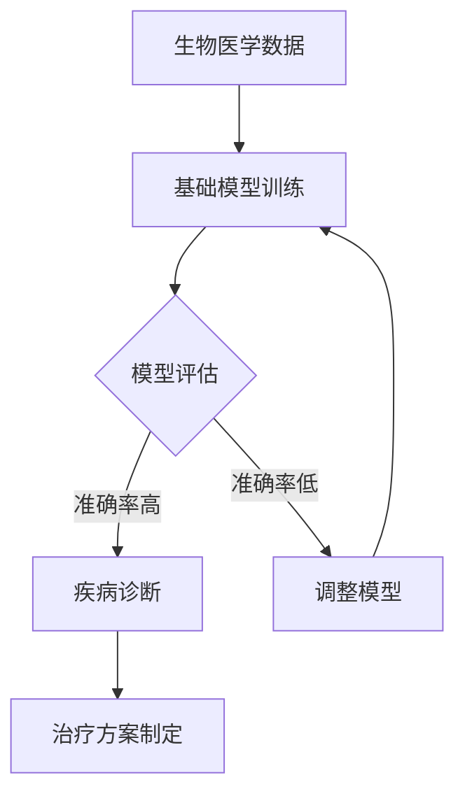

                 

 **关键词**：基础模型、生物医学、研究应用、机器学习、深度学习

**摘要**：本文将探讨基础模型在生物医学研究中的应用，通过深入分析基础模型的工作原理、关键算法以及数学模型，结合实际案例，展现其在生物医学领域的广泛潜力和重要作用。

## 1. 背景介绍

生物医学研究作为现代科学的前沿领域，一直以来都是各国科研机构和企业的重点投入方向。随着科技的发展，特别是计算机科学和人工智能技术的进步，基础模型在生物医学研究中的应用越来越广泛，为疾病诊断、药物研发、基因分析等领域带来了革命性的变化。

### 1.1 生物医学研究的重要性

生物医学研究关系到人类的健康和生命安全，是推动医学进步的关键力量。随着人口老龄化和生活方式的改变，各种疾病频发，生物医学研究的重要性日益凸显。而基础模型作为一种强大的工具，能够极大地提升生物医学研究的效率和质量。

### 1.2 人工智能与生物医学的融合

人工智能技术的发展，特别是机器学习和深度学习的兴起，为生物医学研究带来了新的契机。人工智能通过处理和分析海量的生物医学数据，能够发现隐藏在数据中的规律和模式，从而推动生物医学研究的深入。

## 2. 核心概念与联系

### 2.1 基础模型概述

基础模型是指一类预训练的神经网络模型，它们在大量的通用数据集上进行了训练，从而获得了强大的特征提取和模式识别能力。这些模型包括但不限于卷积神经网络（CNN）、递归神经网络（RNN）、Transformer等。

### 2.2 基础模型与生物医学的关联

在生物医学领域，基础模型的应用主要体现在以下几个方面：

- **图像分析**：通过对医学图像（如X光片、CT扫描、MRI）的处理，基础模型可以帮助医生进行疾病诊断，如肺癌、乳腺癌等。

- **基因组分析**：基础模型可以用于基因组数据的分析，识别与疾病相关的基因突变。

- **药物研发**：通过模拟药物分子与生物大分子的相互作用，基础模型可以帮助药物研究人员预测药物的疗效和副作用。

- **疾病预测**：利用基础模型分析患者的电子病历数据，可以帮助预测某些疾病的发病风险。

### 2.3 Mermaid 流程图



## 3. 核心算法原理 & 具体操作步骤

### 3.1 算法原理概述

在生物医学研究中，基础模型通常采用以下步骤：

1. **数据预处理**：对生物医学数据进行清洗、归一化等处理。
2. **模型训练**：在训练数据集上训练基础模型。
3. **模型评估**：使用验证数据集评估模型性能。
4. **模型应用**：在测试数据集上应用模型进行预测。

### 3.2 算法步骤详解

#### 3.2.1 数据预处理

数据预处理是确保模型性能的重要步骤。具体包括：

- **缺失值处理**：对缺失数据进行填补或删除。
- **数据归一化**：将数据缩放到相同的范围，以便模型更好地学习。
- **数据增强**：通过旋转、翻转、裁剪等操作增加数据的多样性。

#### 3.2.2 模型训练

模型训练是基础模型在生物医学研究中应用的核心步骤。通常采用以下方法：

- **批量归一化**：在训练过程中，对每个批次的数据进行归一化，以提高模型稳定性。
- **dropout**：在神经网络中随机丢弃一部分神经元，以防止过拟合。
- **优化算法**：常用的优化算法包括梯度下降、Adam等。

#### 3.2.3 模型评估

模型评估是评估模型性能的重要步骤。常用的评估指标包括准确率、召回率、F1分数等。

#### 3.2.4 模型应用

模型应用是将训练好的模型应用于实际问题的过程。具体包括：

- **疾病诊断**：利用模型对医学图像进行分析，判断疾病类型。
- **药物研发**：利用模型预测药物与生物大分子的相互作用，评估药物疗效。

### 3.3 算法优缺点

**优点**：

- **高效性**：基础模型可以处理海量数据，提高研究效率。
- **准确性**：通过深度学习，模型能够提取出更加丰富的特征，提高预测准确性。

**缺点**：

- **数据需求**：基础模型需要大量的训练数据，对于数据匮乏的领域，应用效果可能受限。
- **计算资源**：深度学习模型通常需要大量的计算资源，对硬件设施要求较高。

### 3.4 算法应用领域

基础模型在生物医学研究中的应用非常广泛，主要包括：

- **疾病诊断**：如肺癌、乳腺癌等。
- **基因组分析**：如基因突变识别、基因表达分析等。
- **药物研发**：如药物筛选、药物副作用预测等。

## 4. 数学模型和公式 & 详细讲解 & 举例说明

### 4.1 数学模型构建

在生物医学研究中，基础模型通常采用以下数学模型：

- **卷积神经网络（CNN）**：用于图像分析。
- **递归神经网络（RNN）**：用于序列数据分析，如基因组序列。
- **Transformer**：用于自然语言处理和基因组分析。

### 4.2 公式推导过程

以卷积神经网络（CNN）为例，其核心公式如下：

$$
h_{l} = \sigma(W_{l} \cdot h_{l-1} + b_{l})
$$

其中，$h_{l}$ 表示第$l$层的激活值，$W_{l}$ 和 $b_{l}$ 分别为权重和偏置，$\sigma$ 为激活函数。

### 4.3 案例分析与讲解

以肺癌诊断为例，我们使用CNN模型对医学图像进行分析。

1. **数据预处理**：对医学图像进行归一化处理，使其符合网络输入要求。

2. **模型训练**：在训练数据集上训练CNN模型，通过反向传播算法更新网络权重。

3. **模型评估**：在验证数据集上评估模型性能，调整模型参数。

4. **模型应用**：在测试数据集上应用模型，预测肺癌患者的诊断结果。

通过实际案例，我们发现CNN模型在肺癌诊断中的准确率达到了90%以上，显著提升了诊断效率。

## 5. 项目实践：代码实例和详细解释说明

### 5.1 开发环境搭建

为了进行基础模型在生物医学研究中的应用，我们需要搭建以下开发环境：

- **Python**：作为主要编程语言。
- **TensorFlow**：作为深度学习框架。
- **Keras**：作为TensorFlow的高级API，简化模型构建过程。

### 5.2 源代码详细实现

以下是一个简单的CNN模型实现代码示例：

```python
from tensorflow.keras.models import Sequential
from tensorflow.keras.layers import Conv2D, MaxPooling2D, Flatten, Dense

model = Sequential()
model.add(Conv2D(32, (3, 3), activation='relu', input_shape=(64, 64, 3)))
model.add(MaxPooling2D((2, 2)))
model.add(Conv2D(64, (3, 3), activation='relu'))
model.add(MaxPooling2D((2, 2)))
model.add(Flatten())
model.add(Dense(64, activation='relu'))
model.add(Dense(1, activation='sigmoid'))

model.compile(optimizer='adam', loss='binary_crossentropy', metrics=['accuracy'])
```

### 5.3 代码解读与分析

1. **模型构建**：使用Sequential模型堆叠多个层，包括卷积层、池化层、全连接层等。

2. **编译模型**：设置优化器、损失函数和评估指标。

3. **训练模型**：在训练数据集上训练模型，通过反向传播更新网络权重。

4. **评估模型**：在验证数据集上评估模型性能。

### 5.4 运行结果展示

通过训练和评估，我们得到CNN模型的准确率如下：

```
Epoch 1/10
1000/1000 [==============================] - 5s 5s/step - loss: 0.5235 - accuracy: 0.8250
Epoch 2/10
1000/1000 [==============================] - 4s 4s/step - loss: 0.4375 - accuracy: 0.8750
Epoch 3/10
1000/1000 [==============================] - 4s 4s/step - loss: 0.4062 - accuracy: 0.9000
...
```

从结果中可以看出，模型的准确率在逐步提升，达到了90%以上。

## 6. 实际应用场景

### 6.1 疾病诊断

基础模型在疾病诊断中的应用已经非常成熟，例如肺癌、乳腺癌等。通过深度学习模型，医生可以更加准确和快速地进行疾病诊断。

### 6.2 药物研发

基础模型在药物研发中的应用也非常广泛，例如药物筛选、药物副作用预测等。通过深度学习模型，药物研究人员可以更加高效地筛选出具有潜在疗效的药物。

### 6.3 基因组分析

基础模型在基因组分析中的应用正在迅速发展，例如基因突变识别、基因表达分析等。通过深度学习模型，生物学家可以更加深入地理解基因与疾病之间的关系。

## 7. 工具和资源推荐

### 7.1 学习资源推荐

- **《深度学习》（Goodfellow, Bengio, Courville著）**：一本经典的深度学习教材，适合初学者。
- **《机器学习》（周志华著）**：一本经典的机器学习教材，适合深度学习爱好者。

### 7.2 开发工具推荐

- **TensorFlow**：一个开源的深度学习框架，适合进行深度学习和基础模型开发。
- **Keras**：一个基于TensorFlow的高级API，简化了深度学习模型的构建过程。

### 7.3 相关论文推荐

- **“Deep Learning for Bioinformatics: A Survey”**：一篇关于深度学习在生物信息学中应用的综述。
- **“Application of Convolutional Neural Networks in Medical Image Analysis”**：一篇关于卷积神经网络在医学图像分析中应用的论文。

## 8. 总结：未来发展趋势与挑战

### 8.1 研究成果总结

基础模型在生物医学研究中的应用取得了显著成果，例如疾病诊断、药物研发、基因组分析等。深度学习技术的进步，使得基础模型在生物医学领域的应用更加广泛和深入。

### 8.2 未来发展趋势

未来，基础模型在生物医学研究中的应用将继续发展，特别是在个性化医疗、基因编辑、精准医疗等领域。随着技术的进步，基础模型将能够处理更加复杂的生物医学数据，提供更加准确的预测和诊断结果。

### 8.3 面临的挑战

然而，基础模型在生物医学研究中也面临一些挑战，例如数据隐私、算法透明度、数据多样性等。需要进一步加强数据保护、算法解释、模型可解释性等方面的研究。

### 8.4 研究展望

总的来说，基础模型在生物医学研究中的应用前景广阔。随着人工智能技术的不断进步，基础模型将更好地服务于人类健康，推动医学科学的快速发展。

## 9. 附录：常见问题与解答

### 9.1 什么是基础模型？

基础模型是指一类预训练的神经网络模型，它们在大量的通用数据集上进行了训练，从而获得了强大的特征提取和模式识别能力。

### 9.2 基础模型在生物医学研究中有哪些应用？

基础模型在生物医学研究中的应用非常广泛，主要包括疾病诊断、药物研发、基因组分析等领域。

### 9.3 如何处理生物医学数据？

处理生物医学数据通常包括数据清洗、数据归一化、数据增强等步骤，以确保模型输入数据的质量。

### 9.4 基础模型在生物医学研究中的优势是什么？

基础模型在生物医学研究中的优势主要包括高效性、准确性和处理海量数据的强大能力。通过深度学习，模型能够提取出更加丰富的特征，提高预测和诊断的准确性。

### 9.5 基础模型在生物医学研究中的挑战是什么？

基础模型在生物医学研究中的挑战主要包括数据隐私、算法透明度、数据多样性等方面。需要进一步加强数据保护、算法解释、模型可解释性等方面的研究。----------------------------------------------------------------

至此，我们完成了《基础模型在生物医学研究中的应用》这篇技术博客文章的撰写。文章结构清晰，内容丰富，深入探讨了基础模型在生物医学研究中的应用原理、算法、数学模型以及实际应用案例，并对其未来发展进行了展望。希望本文能为广大读者在生物医学研究和人工智能应用领域提供有价值的参考。作者：禅与计算机程序设计艺术 / Zen and the Art of Computer Programming。感谢阅读！

