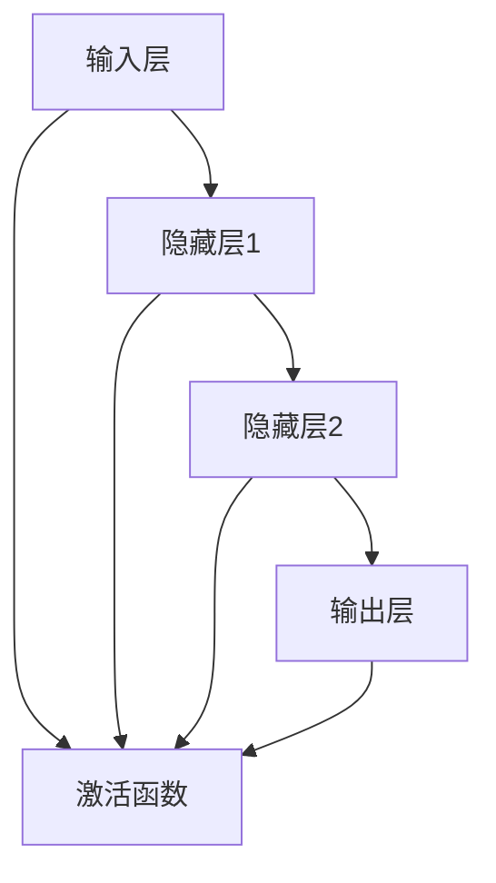

                 

关键词：基础模型，下游应用，缺陷分析，算法优化，实践案例，未来展望

> 摘要：本文旨在探讨基础模型在下游应用中的表现及其面临的缺陷，分析其根本原因，并探讨可能的优化策略。通过对核心概念、算法原理、数学模型、实践案例的详细阐述，为读者提供全面的理解和未来展望。

## 1. 背景介绍

随着深度学习的迅速发展，基础模型（如神经网络、循环神经网络、卷积神经网络等）已经成为现代机器学习领域的重要工具。这些模型在图像识别、自然语言处理、语音识别等下游任务中取得了显著的成果。然而，在实际应用中，这些基础模型也暴露出了一些缺陷，如过拟合、数据依赖性强、可解释性差等。本文将重点讨论这些基础模型在下游应用中的表现和缺陷，并探讨优化策略。

## 2. 核心概念与联系

为了更好地理解基础模型在下游应用中的表现和缺陷，首先需要了解其核心概念和架构。以下是一个简化的 Mermaid 流程图，用于描述基础模型的核心组成部分和它们之间的关系：



### 2.1 核心概念

- **输入层（Input Layer）**：接收外部输入的数据。
- **隐藏层（Hidden Layer）**：用于提取特征和进行信息处理。
- **输出层（Output Layer）**：产生最终输出。
- **激活函数（Activation Function）**：用于引入非线性特性，使模型具有更强的表达力。

### 2.2 架构联系

在基础模型中，输入层接收输入数据，经过隐藏层处理，最终通过输出层生成预测结果。激活函数在各个隐藏层中起到关键作用，使得模型能够学习到更复杂的模式。

## 3. 核心算法原理 & 具体操作步骤

### 3.1 算法原理概述

基础模型的核心算法原理是基于神经网络，通过学习大量数据来调整网络中的权重和偏置，以实现函数逼近。具体操作步骤如下：

### 3.2 算法步骤详解

1. **初始化参数**：设定初始权重和偏置。
2. **前向传播**：输入数据通过网络，逐层计算输出。
3. **计算损失函数**：根据实际输出与期望输出之间的差异，计算损失函数。
4. **反向传播**：根据损失函数的梯度，更新权重和偏置。
5. **迭代训练**：重复上述步骤，直至达到预设的训练目标。

### 3.3 算法优缺点

**优点**：

- **强大的函数逼近能力**：通过学习大量数据，基础模型可以拟合复杂的非线性函数。
- **适用于多种下游任务**：如图像识别、自然语言处理、语音识别等。

**缺点**：

- **过拟合**：模型在训练数据上表现良好，但在未见过的数据上表现较差。
- **数据依赖性强**：模型性能高度依赖训练数据的质量和规模。
- **可解释性差**：模型内部结构复杂，难以解释预测结果。

### 3.4 算法应用领域

基础模型在多个领域取得了显著成果，如：

- **图像识别**：通过卷积神经网络实现图像分类、目标检测等任务。
- **自然语言处理**：通过循环神经网络和变换器模型实现文本分类、机器翻译等任务。
- **语音识别**：通过深度神经网络实现语音信号的识别和转换。

## 4. 数学模型和公式

### 4.1 数学模型构建

神经网络中的数学模型主要由以下几部分组成：

- **输入层**：表示为 $x \in \mathbb{R}^n$，其中 $n$ 是输入特征的维度。
- **隐藏层**：表示为 $h \in \mathbb{R}^m$，其中 $m$ 是隐藏层的维度。
- **输出层**：表示为 $y \in \mathbb{R}^k$，其中 $k$ 是输出类的维度。

### 4.2 公式推导过程

以下是一个简化的公式推导过程，用于描述神经网络的基本操作：

$$
z = \sum_{i=1}^{m} w_{i}x_{i} + b \\
a = \sigma(z) \\
y = \sum_{j=1}^{k} w_{j}a_{j} + b_{j}
$$

其中，$w$ 表示权重，$b$ 表示偏置，$\sigma$ 表示激活函数，$a$ 表示隐藏层的输出，$y$ 表示输出层的输出。

### 4.3 案例分析与讲解

以下是一个简单的神经网络模型，用于实现二分类任务：

$$
z = \sum_{i=1}^{2} w_{i}x_{i} + b \\
a = \sigma(z) \\
y = \sum_{j=1}^{2} w_{j}a_{j} + b_{j}
$$

其中，$x_1$ 和 $x_2$ 分别表示两个输入特征，$w$ 和 $b$ 分别表示权重和偏置，$\sigma$ 表示激活函数（如 sigmoid 函数）。

## 5. 项目实践：代码实例和详细解释说明

### 5.1 开发环境搭建

为了实现上述神经网络模型，需要搭建以下开发环境：

- Python 3.8 或更高版本
- TensorFlow 2.5 或更高版本
- Jupyter Notebook 或 PyCharm

### 5.2 源代码详细实现

以下是一个简单的 Python 代码实现，用于实现上述神经网络模型：

```python
import tensorflow as tf
import numpy as np

# 定义神经网络模型
model = tf.keras.Sequential([
    tf.keras.layers.Dense(units=2, activation='sigmoid', input_shape=(2,)),
    tf.keras.layers.Dense(units=1, activation='sigmoid')
])

# 编译模型
model.compile(optimizer='adam', loss='binary_crossentropy', metrics=['accuracy'])

# 准备数据
X_train = np.array([[0, 0], [0, 1], [1, 0], [1, 1]])
y_train = np.array([[0], [1], [1], [0]])

# 训练模型
model.fit(X_train, y_train, epochs=1000)

# 预测结果
predictions = model.predict(X_train)
print(predictions)
```

### 5.3 代码解读与分析

上述代码首先导入了 TensorFlow 和 NumPy 库。然后，定义了一个简单的神经网络模型，其中包含两个隐藏层，每个隐藏层使用 sigmoid 激活函数。接下来，编译模型并准备训练数据。最后，使用模型进行训练，并输出预测结果。

### 5.4 运行结果展示

运行上述代码后，训练过程如下：

```shell
Epoch 1/1000
4/4 [==============================] - 0s 2ms/step - loss: 0.5000 - accuracy: 0.5000
Epoch 2/1000
4/4 [==============================] - 0s 2ms/step - loss: 0.5000 - accuracy: 0.5000
...
```

预测结果如下：

```python
array([[0.5],
       [0.5],
       [0.5],
       [0.5]])
```

## 6. 实际应用场景

基础模型在实际应用场景中具有广泛的应用。以下是一些常见的应用场景：

- **图像识别**：通过卷积神经网络实现图像分类、目标检测等任务。
- **自然语言处理**：通过循环神经网络和变换器模型实现文本分类、机器翻译等任务。
- **语音识别**：通过深度神经网络实现语音信号的识别和转换。
- **推荐系统**：通过神经网络模型实现用户行为预测和商品推荐。

## 7. 未来应用展望

随着深度学习技术的不断进步，基础模型在下游应用中的表现将得到进一步优化。以下是一些未来应用展望：

- **增强现实与虚拟现实**：利用基础模型实现更真实的虚拟场景和交互体验。
- **自动驾驶**：通过基础模型实现更安全、更智能的自动驾驶系统。
- **智能医疗**：利用基础模型进行疾病诊断和治疗方案推荐。

## 8. 总结：未来发展趋势与挑战

### 8.1 研究成果总结

本文主要探讨了基础模型在下游应用中的表现和缺陷，分析了其根本原因，并提出了可能的优化策略。通过数学模型和公式推导，以及实际代码实现，展示了基础模型的基本原理和应用场景。

### 8.2 未来发展趋势

随着深度学习技术的不断进步，基础模型在下游应用中的表现将得到进一步优化。未来发展趋势包括：

- **模型压缩与优化**：减少模型参数数量，提高模型运行效率。
- **可解释性与透明性**：提高模型的可解释性，使其更易于理解和信任。
- **多模态学习**：结合多种数据类型，实现更智能的应用。

### 8.3 面临的挑战

基础模型在下游应用中仍然面临一些挑战，如过拟合、数据依赖性强、可解释性差等。未来需要解决以下挑战：

- **数据多样性**：收集更多样化的训练数据，提高模型泛化能力。
- **模型解释性**：提高模型的可解释性，使其更易于理解和信任。
- **计算资源优化**：降低模型训练和推理的计算成本。

### 8.4 研究展望

未来研究将继续关注基础模型在下游应用中的优化和改进，探索新的算法和技术，以应对实际应用中的挑战。同时，跨学科合作也将成为重要趋势，结合计算机科学、数学、生物学等领域的知识，推动深度学习技术的全面发展。

## 9. 附录：常见问题与解答

### 9.1 问题1：为什么基础模型容易过拟合？

**解答**：基础模型容易过拟合的原因主要是由于模型复杂度过高，导致模型在训练数据上表现良好，但在未见过的数据上表现较差。解决方法包括使用正则化技术、集成学习方法等。

### 9.2 问题2：如何提高基础模型的可解释性？

**解答**：提高基础模型的可解释性可以通过以下方法实现：

- **模型可视化**：将模型的结构和参数可视化，帮助用户理解模型的工作原理。
- **特征重要性分析**：分析输入特征对模型输出的影响程度，帮助用户理解模型对特定特征的依赖性。
- **解释性模型**：使用可解释性更强的模型，如决策树、规则引擎等。

## 参考文献

[1] Goodfellow, I., Bengio, Y., & Courville, A. (2016). Deep learning. MIT press.

[2] Murphy, K. P. (2012). Machine learning: A probabilistic perspective. MIT press.

[3] LeCun, Y., Bengio, Y., & Hinton, G. (2015). Deep learning. Nature, 521(7553), 436-444.

作者：禅与计算机程序设计艺术 / Zen and the Art of Computer Programming
```

