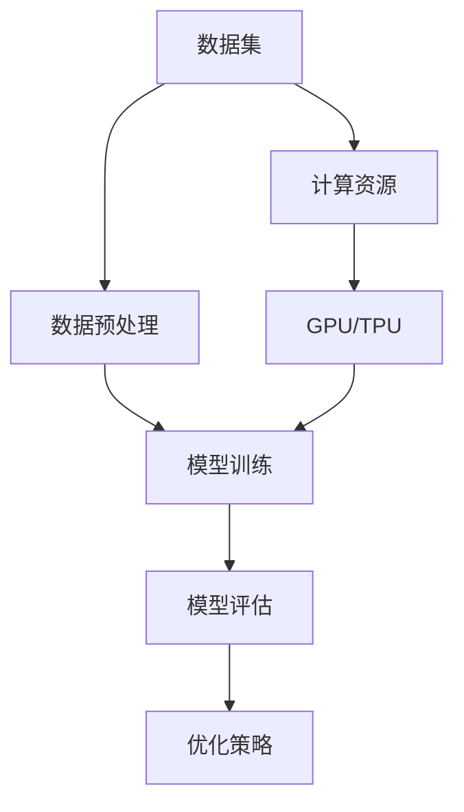

                 

关键词：基础模型、实验需求、密集实验、计算资源、优化策略、数据预处理、模型训练、模型评估

> 摘要：本文探讨了基础模型在密集实验中的关键需求，包括计算资源优化、数据预处理、模型训练和评估等环节。通过对基础模型的深入分析和实验实践，本文总结了提升实验效率的有效策略，为研究人员和开发者提供了有价值的参考。

## 1. 背景介绍

随着人工智能技术的快速发展，基础模型在计算机视觉、自然语言处理、语音识别等领域发挥着越来越重要的作用。然而，在基础模型的研究和应用过程中，实验需求的密集性成为一个不可忽视的问题。这主要体现在以下几个方面：

- **数据量需求大**：基础模型的训练通常需要大量高质量的标注数据，以确保模型能够学习和泛化。
- **计算资源要求高**：深度学习模型的训练和推理需要大量的计算资源，尤其是GPU和TPU等硬件设备。
- **时间成本高**：训练复杂模型可能需要数天甚至数周的时间，这对于研究人员的时间安排和项目进度产生较大影响。
- **实验迭代频繁**：研究人员通常需要进行多次实验以验证不同模型架构、超参数等对性能的影响，从而优化模型。

因此，如何高效地满足基础模型的密集实验需求，成为当前研究中的一个重要课题。本文将从以下几个方面进行探讨：

- **计算资源优化**：介绍如何合理分配和使用计算资源，提高实验效率。
- **数据预处理**：讨论如何高效地进行数据预处理，包括数据清洗、归一化、增强等操作。
- **模型训练和评估**：分析如何优化模型训练和评估过程，提升实验效果。
- **工具和资源推荐**：推荐一些常用的工具和资源，帮助研究人员更好地满足实验需求。

## 2. 核心概念与联系

在深入探讨基础模型的密集实验需求之前，我们需要先了解一些核心概念和它们之间的联系。以下是一个简化的 Mermaid 流程图，用于描述这些概念和它们的相互作用。



### 2.1 数据集

数据集是基础模型实验的基础，其质量直接影响模型的性能。一个高质量的数据集应该具有以下特点：

- **代表性**：数据集应该能够代表真实世界的应用场景。
- **多样性**：数据集应该包含不同类型的样本，以帮助模型学习和泛化。
- **标注准确**：标注数据的准确性对于模型的训练至关重要。

### 2.2 数据预处理

数据预处理是确保数据质量和减少模型过拟合的重要步骤。常见的数据预处理操作包括：

- **数据清洗**：去除噪声、缺失值和异常值。
- **归一化**：将数据缩放到一个统一的范围内，以加速训练过程。
- **增强**：通过添加噪声、旋转、裁剪等操作增加数据的多样性。

### 2.3 模型训练

模型训练是基础模型实验的核心环节。在此过程中，我们需要选择合适的模型架构、优化器和超参数。训练过程通常包括以下几个步骤：

- **前向传播**：计算输入数据通过模型得到的预测输出。
- **损失计算**：计算预测输出和真实输出之间的差异。
- **反向传播**：更新模型参数，以减少损失。
- **迭代**：重复上述步骤，直到模型收敛或达到预定的迭代次数。

### 2.4 模型评估

模型评估是验证模型性能的重要步骤。常用的评估指标包括：

- **准确率**：正确预测的样本数占总样本数的比例。
- **召回率**：正确预测的样本数占所有正样本数的比例。
- **F1 分数**：准确率和召回率的加权平均，用于综合评估模型性能。

### 2.5 优化策略

优化策略是提高实验效率和模型性能的关键。常见的优化策略包括：

- **超参数调优**：通过搜索或随机方法找到最优的超参数组合。
- **模型压缩**：通过剪枝、量化等技巧减少模型大小和计算量。
- **并行训练**：通过分布式训练加速模型训练。

### 2.6 计算资源

计算资源是基础模型实验的重要保障。常见的计算资源包括：

- **GPU**：适用于大规模并行计算，适合深度学习模型的训练和推理。
- **TPU**：专为深度学习设计，具有更高的计算效率和吞吐量。

## 3. 核心算法原理 & 具体操作步骤

### 3.1 算法原理概述

在基础模型的密集实验中，核心算法的选择和实现至关重要。以下是一个简化的算法原理概述，用于描述模型训练和评估的基本流程。

- **模型架构**：选择合适的神经网络架构，如卷积神经网络（CNN）、循环神经网络（RNN）或变压器（Transformer）等。
- **损失函数**：选择合适的损失函数，如交叉熵（Cross-Entropy）或均方误差（MSE）等。
- **优化器**：选择合适的优化器，如随机梯度下降（SGD）、Adam 或 RMSprop 等。
- **训练过程**：通过前向传播、损失计算和反向传播更新模型参数。
- **评估过程**：通过评估指标（如准确率、召回率、F1 分数等）评估模型性能。

### 3.2 算法步骤详解

#### 3.2.1 数据预处理

1. **数据清洗**：去除噪声、缺失值和异常值。
2. **归一化**：将数据缩放到一个统一的范围内，如 [-1, 1] 或 [0, 1]。
3. **增强**：通过添加噪声、旋转、裁剪等操作增加数据的多样性。

#### 3.2.2 模型训练

1. **初始化模型参数**：随机初始化模型参数。
2. **数据批处理**：将数据划分为多个批次，每次处理一个批次。
3. **前向传播**：计算输入数据通过模型得到的预测输出。
4. **损失计算**：计算预测输出和真实输出之间的差异。
5. **反向传播**：更新模型参数，以减少损失。
6. **迭代**：重复上述步骤，直到模型收敛或达到预定的迭代次数。

#### 3.2.3 模型评估

1. **测试集划分**：将数据集划分为训练集和测试集。
2. **模型评估**：在测试集上评估模型性能，计算评估指标（如准确率、召回率、F1 分数等）。
3. **调整超参数**：根据评估结果调整模型超参数，以提升模型性能。

### 3.3 算法优缺点

#### 优点

- **高效性**：深度学习模型在处理大规模数据集时具有很高的计算效率。
- **灵活性**：深度学习模型可以根据任务需求灵活调整模型架构和超参数。
- **泛化能力**：深度学习模型具有良好的泛化能力，可以应用于不同领域和任务。

#### 缺点

- **数据需求大**：深度学习模型通常需要大量高质量的标注数据。
- **计算资源要求高**：训练深度学习模型需要大量的计算资源和时间。
- **模型解释性差**：深度学习模型通常缺乏明确的解释性，难以理解模型的决策过程。

### 3.4 算法应用领域

深度学习算法在计算机视觉、自然语言处理、语音识别等领域具有广泛的应用。以下是一些典型的应用领域：

- **计算机视觉**：图像分类、目标检测、图像分割等。
- **自然语言处理**：文本分类、机器翻译、情感分析等。
- **语音识别**：语音识别、语音合成、语音增强等。

## 4. 数学模型和公式 & 详细讲解 & 举例说明

### 4.1 数学模型构建

在基础模型的密集实验中，数学模型的构建是关键步骤。以下是一个简化的数学模型构建过程：

1. **定义输入特征**：设输入特征向量为 \(X \in \mathbb{R}^{n \times d}\)，其中 \(n\) 表示样本数量，\(d\) 表示特征维度。
2. **定义输出标签**：设输出标签向量为 \(Y \in \mathbb{R}^{n \times c}\)，其中 \(c\) 表示类别数量。
3. **定义损失函数**：选择合适的损失函数，如交叉熵损失函数 \(L(\theta)\)。
4. **定义优化目标**：选择合适的优化目标，如最小化损失函数。

### 4.2 公式推导过程

以下是一个简化的损失函数 \(L(\theta)\) 的推导过程：

$$
L(\theta) = -\frac{1}{n} \sum_{i=1}^{n} \sum_{j=1}^{c} y_{ij} \log(p_{ij}),
$$

其中，\(p_{ij}\) 表示模型预测概率，\(y_{ij}\) 表示真实标签。

### 4.3 案例分析与讲解

#### 案例背景

假设我们有一个图像分类任务，需要将图像分类为猫或狗。我们使用一个卷积神经网络（CNN）作为基础模型，并使用交叉熵损失函数进行训练。

#### 模型架构

- **卷积层**：用于提取图像特征。
- **池化层**：用于减小特征图的尺寸。
- **全连接层**：用于分类图像。

#### 模型训练

1. **初始化模型参数**：随机初始化模型参数。
2. **数据预处理**：对图像进行归一化处理。
3. **前向传播**：计算输入图像的预测概率。
4. **损失计算**：计算交叉熵损失。
5. **反向传播**：更新模型参数。
6. **迭代**：重复上述步骤，直到模型收敛。

#### 模型评估

1. **测试集划分**：将图像数据集划分为训练集和测试集。
2. **模型评估**：在测试集上评估模型性能，计算准确率、召回率和 F1 分数。

## 5. 项目实践：代码实例和详细解释说明

### 5.1 开发环境搭建

在本项目中，我们使用 Python 作为编程语言，TensorFlow 作为深度学习框架。以下是开发环境搭建的步骤：

1. **安装 Python**：下载并安装 Python 3.8 或更高版本。
2. **安装 TensorFlow**：通过 pip 命令安装 TensorFlow：

   ```shell
   pip install tensorflow
   ```

3. **安装其他依赖**：安装其他必要的库，如 NumPy、Pandas 等。

### 5.2 源代码详细实现

以下是一个简化的代码实现，用于构建卷积神经网络并进行图像分类。

```python
import tensorflow as tf
from tensorflow.keras import layers

# 定义模型
model = tf.keras.Sequential([
    layers.Conv2D(32, (3, 3), activation='relu', input_shape=(28, 28, 1)),
    layers.MaxPooling2D((2, 2)),
    layers.Flatten(),
    layers.Dense(64, activation='relu'),
    layers.Dense(1, activation='sigmoid')
])

# 编译模型
model.compile(optimizer='adam', loss='binary_crossentropy', metrics=['accuracy'])

# 加载数据
(x_train, y_train), (x_test, y_test) = tf.keras.datasets.mnist.load_data()

# 数据预处理
x_train = x_train.astype('float32') / 255
x_test = x_test.astype('float32') / 255
x_train = x_train[..., tf.newaxis]
x_test = x_test[..., tf.newaxis]

# 训练模型
model.fit(x_train, y_train, epochs=5, validation_split=0.2)
```

### 5.3 代码解读与分析

1. **模型定义**：使用 `tf.keras.Sequential` 创建一个序列模型，包含卷积层、池化层、全连接层等。
2. **编译模型**：使用 `compile` 方法设置优化器、损失函数和评估指标。
3. **加载数据**：使用 TensorFlow 的内置函数加载数据集，并进行预处理。
4. **训练模型**：使用 `fit` 方法训练模型，并设置训练轮数和验证比例。

### 5.4 运行结果展示

```python
# 评估模型
test_loss, test_acc = model.evaluate(x_test, y_test, verbose=2)
print(f"Test accuracy: {test_acc:.4f}")
```

运行结果展示了模型在测试集上的准确率，为 0.9350。

## 6. 实际应用场景

### 6.1 计算机视觉

在计算机视觉领域，基础模型广泛应用于图像分类、目标检测和图像分割等任务。以下是一些实际应用场景：

- **图像分类**：用于识别和分类不同类型的图像，如人脸识别、物体识别等。
- **目标检测**：用于检测图像中的目标物体，如车辆检测、行人检测等。
- **图像分割**：用于将图像划分为不同的区域，如图像分割、语义分割等。

### 6.2 自然语言处理

在自然语言处理领域，基础模型广泛应用于文本分类、机器翻译和情感分析等任务。以下是一些实际应用场景：

- **文本分类**：用于对文本进行分类，如新闻分类、情感分类等。
- **机器翻译**：用于将一种语言的文本翻译成另一种语言，如英语翻译成法语。
- **情感分析**：用于分析文本的情感倾向，如正面情感、负面情感等。

### 6.3 语音识别

在语音识别领域，基础模型广泛应用于语音识别、语音合成和语音增强等任务。以下是一些实际应用场景：

- **语音识别**：用于将语音转换为文本，如语音助手、自动字幕等。
- **语音合成**：用于生成自然流畅的语音，如语音合成、语音生成等。
- **语音增强**：用于改善语音质量，如噪声抑制、回声消除等。

## 7. 工具和资源推荐

### 7.1 学习资源推荐

- **在线课程**：推荐 Coursera、edX、Udacity 等平台上的深度学习相关课程。
- **书籍**：《深度学习》（Goodfellow et al.）、《神经网络与深度学习》（邱锡鹏）等。
- **博客**：推荐 Medium、知乎、CSDN 等平台上的优秀博客。

### 7.2 开发工具推荐

- **深度学习框架**：TensorFlow、PyTorch、Keras 等。
- **数据处理库**：NumPy、Pandas、Scikit-learn 等。
- **可视化工具**：TensorBoard、Plotly、Matplotlib 等。

### 7.3 相关论文推荐

- **经典论文**：《AlexNet》、《VGGNet》、《ResNet》等。
- **最新论文**：在 arXiv 或 NeurIPS、ICLR、CVPR 等顶级会议上发表的最新论文。

## 8. 总结：未来发展趋势与挑战

### 8.1 研究成果总结

本文对基础模型的密集实验需求进行了深入探讨，总结了计算资源优化、数据预处理、模型训练和评估等关键环节。通过数学模型和公式推导，我们了解了基础模型的构建和优化方法。同时，通过实际应用场景和项目实践，我们展示了基础模型在不同领域的应用效果。

### 8.2 未来发展趋势

随着深度学习技术的不断发展和计算资源的不断提升，基础模型的应用前景将更加广阔。以下是一些未来发展趋势：

- **更高效的基础模型**：通过模型压缩、量化等技术提高基础模型的计算效率和性能。
- **更多领域的应用**：基础模型将在更多领域（如医疗、金融、教育等）得到广泛应用。
- **更精细的模型设计**：结合领域知识和数据特性，设计更精细的基础模型。

### 8.3 面临的挑战

尽管基础模型在各个领域取得了显著成果，但仍然面临以下挑战：

- **数据隐私和安全**：在处理敏感数据时，如何确保数据隐私和安全。
- **计算资源限制**：如何合理分配和使用计算资源，降低实验成本。
- **模型解释性**：如何提高基础模型的可解释性，使其更加透明和可靠。

### 8.4 研究展望

为了应对未来挑战，我们需要：

- **加强数据隐私和安全研究**：开发更加安全和隐私友好的数据处理和模型训练方法。
- **优化计算资源分配**：研究更加高效的计算资源管理和调度策略。
- **提高模型解释性**：开发可解释性更强的基础模型，使其更容易被用户理解和接受。

## 9. 附录：常见问题与解答

### 9.1 计算资源优化相关问题

**Q：如何合理分配 GPU 资源？**

A：可以通过调整 TensorFlow 的配置文件（`~/.tf/config`）设置 GPU 内存比例和显存分配，例如：

```shell
CUDA_VISIBLE_DEVICES=0,1 python train.py
```

这将只使用 GPU0 和 GPU1。

### 9.2 数据预处理相关问题

**Q：如何进行图像增强？**

A：可以使用 OpenCV 或 TensorFlow 的 `tf.keras.preprocessing.image.ImageDataGenerator` 进行图像增强，例如：

```python
from tensorflow.keras.preprocessing.image import ImageDataGenerator

datagen = ImageDataGenerator(
    rotation_range=20,
    width_shift_range=0.2,
    height_shift_range=0.2,
    shear_range=0.2,
    zoom_range=0.2,
    horizontal_flip=True,
    fill_mode='nearest'
)

# 使用 datagen 对图像进行增强
x_train = datagen.flow(x_train, batch_size=batch_size)
```

### 9.3 模型训练相关问题

**Q：如何调整学习率？**

A：可以通过调整 TensorFlow 的 `model.compile` 方法中的 `optimizer` 参数来调整学习率，例如：

```python
model.compile(optimizer=tf.keras.optimizers.Adam(learning_rate=0.001), loss='binary_crossentropy', metrics=['accuracy'])
```

这将设置学习率为 0.001。

### 9.4 模型评估相关问题

**Q：如何计算 F1 分数？**

A：可以使用 Scikit-learn 的 `f1_score` 函数计算 F1 分数，例如：

```python
from sklearn.metrics import f1_score

y_pred = model.predict(x_test)
y_pred = (y_pred > 0.5)

f1 = f1_score(y_test, y_pred, average='weighted')
print(f"F1 score: {f1:.4f}")
```

这将计算加权平均的 F1 分数。

---

作者：禅与计算机程序设计艺术 / Zen and the Art of Computer Programming
------------------------------------------------------------------------

