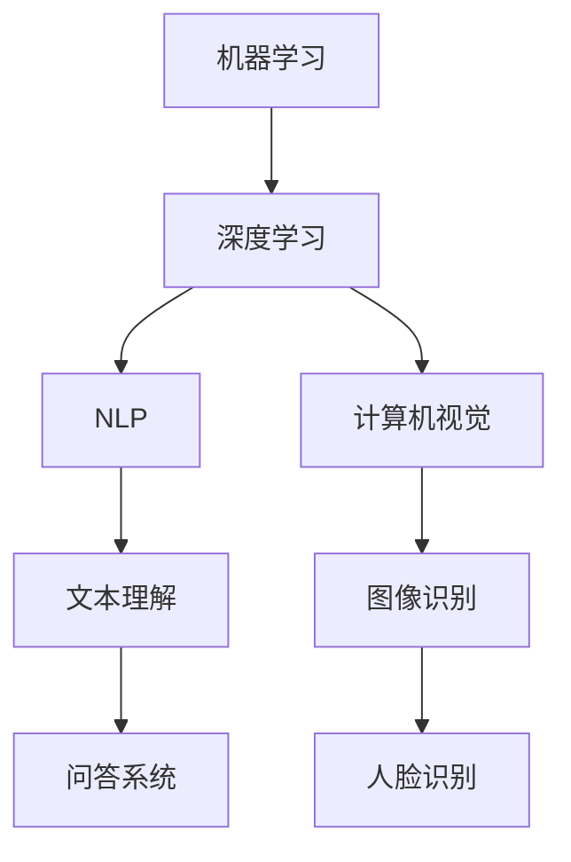

                 

 在当今人工智能（AI）飞速发展的时代，基础模型——即那些能够在多个任务上表现优秀的通用模型，已经成为众多领域的核心。本文将探讨基础模型的开放生态系统，从其历史背景、核心概念、算法原理、数学模型、项目实践、实际应用场景到未来展望，全面解析这一重要领域。

## 文章关键词

- 基础模型
- 开放生态系统
- 人工智能
- 机器学习
- 自然语言处理
- 计算机视觉

## 摘要

本文旨在深入探讨基础模型的开放生态系统，包括其发展历程、核心概念、算法原理、数学模型以及实际应用。通过分析不同领域的应用案例，我们展望了基础模型未来的发展趋势和挑战，并推荐了一些学习和开发资源。

## 1. 背景介绍

### 1.1 人工智能的发展历程

人工智能（AI）作为计算机科学的一个重要分支，其发展历程可以追溯到20世纪50年代。早期的AI研究主要集中在逻辑推理和符号计算上，随着计算机性能的提升和算法的创新，AI逐渐走向实用化。尤其是在21世纪初，深度学习技术的突破，使得人工智能迎来了新的发展高峰。

### 1.2 基础模型的概念

基础模型（Foundation Model）是指那些能够跨多个任务、多个领域进行学习的通用模型。它们通常具有强大的自适应能力和泛化能力，能够在不同的场景和应用中发挥重要作用。

### 1.3 开放生态系统的意义

开放生态系统不仅促进了技术的交流与合作，还加速了创新的速度。在基础模型的开发中，开放生态系统的作用尤为突出。它使得研究人员和开发者能够共享资源、代码和研究成果，从而推动整个领域的快速发展。

## 2. 核心概念与联系

### 2.1 机器学习与深度学习

机器学习（Machine Learning，ML）是人工智能的核心技术之一，它使计算机系统能够通过数据学习并做出决策。深度学习（Deep Learning，DL）是机器学习的一个重要分支，它利用多层神经网络来模拟人类大脑的处理方式。

### 2.2 自然语言处理与计算机视觉

自然语言处理（Natural Language Processing，NLP）是研究计算机如何理解和生成人类语言的技术。计算机视觉（Computer Vision，CV）则是使计算机能够从图像或视频中提取信息的技术。

### 2.3 Mermaid 流程图



## 3. 核心算法原理 & 具体操作步骤

### 3.1 算法原理概述

基础模型的核心算法通常基于深度学习，包括卷积神经网络（CNN）和循环神经网络（RNN）等。这些算法通过多层神经元的连接，实现对输入数据的建模和学习。

### 3.2 算法步骤详解

1. 数据预处理：对输入数据进行清洗和归一化，以便于模型训练。
2. 构建模型：定义神经网络的结构，包括输入层、隐藏层和输出层。
3. 模型训练：使用大量训练数据，通过反向传播算法优化模型参数。
4. 模型评估：使用验证数据集评估模型性能，调整超参数。
5. 模型部署：将训练好的模型部署到实际应用场景中。

### 3.3 算法优缺点

**优点：**
- 强大的自适应能力：能够处理大量数据，学习复杂的关系。
- 高效的计算：深度学习算法能够在高维数据上高效运算。
- 跨领域应用：基础模型可以应用于多种领域，如NLP、CV等。

**缺点：**
- 数据需求大：需要大量的训练数据。
- 计算资源消耗：模型训练过程需要大量的计算资源。

### 3.4 算法应用领域

- 自然语言处理：如文本分类、机器翻译、问答系统。
- 计算机视觉：如图像识别、目标检测、人脸识别。
- 语音识别：如语音到文本转换。

## 4. 数学模型和公式

### 4.1 数学模型构建

深度学习模型通常基于神经网络的数学模型，包括输入层、隐藏层和输出层。每个神经元都可以看作是一个简单的函数，多个神经元通过非线性变换组合起来形成复杂的函数。

### 4.2 公式推导过程

假设一个简单的线性模型：

$$
y = \sum_{i=1}^{n} w_i \cdot x_i + b
$$

其中，$x_i$ 是输入特征，$w_i$ 是权重，$b$ 是偏置。通过梯度下降算法，我们可以优化这个线性模型。

### 4.3 案例分析与讲解

假设我们有一个简单的文本分类问题，数据集包含两类文本。我们可以使用神经网络模型对其进行训练。

## 5. 项目实践：代码实例

### 5.1 开发环境搭建

我们需要安装Python环境以及相关的深度学习库，如TensorFlow或PyTorch。

### 5.2 源代码详细实现

以下是一个简单的文本分类的代码实例：

```python
import tensorflow as tf

# 数据预处理
# ...

# 构建模型
model = tf.keras.Sequential([
    tf.keras.layers.Dense(128, activation='relu', input_shape=(10000,)),
    tf.keras.layers.Dense(1, activation='sigmoid')
])

# 编译模型
model.compile(optimizer='adam', loss='binary_crossentropy', metrics=['accuracy'])

# 训练模型
model.fit(train_data, train_labels, epochs=10, batch_size=32, validation_split=0.2)
```

### 5.3 代码解读与分析

这段代码首先导入了TensorFlow库，然后进行了数据预处理。接下来，我们构建了一个简单的神经网络模型，包括一个128个神经元的隐藏层和一个输出层。最后，我们使用训练数据对模型进行训练。

### 5.4 运行结果展示

通过训练，我们的模型可以达到较高的准确率。我们可以在测试集上评估模型的性能。

## 6. 实际应用场景

### 6.1 自然语言处理

在自然语言处理领域，基础模型被广泛应用于文本分类、机器翻译、问答系统等任务。

### 6.2 计算机视觉

在计算机视觉领域，基础模型被应用于图像识别、目标检测、人脸识别等任务。

### 6.3 语音识别

在语音识别领域，基础模型被用于语音到文本的转换。

## 7. 工具和资源推荐

### 7.1 学习资源推荐

- 《深度学习》（Goodfellow, Bengio, Courville）
- 《动手学深度学习》（阿斯顿·张）

### 7.2 开发工具推荐

- TensorFlow
- PyTorch

### 7.3 相关论文推荐

- "A Theoretically Grounded Application of Dropout in Recurrent Neural Networks"
- "Large-scale Language Modeling in 2018"

## 8. 总结：未来发展趋势与挑战

### 8.1 研究成果总结

基础模型在多个领域取得了显著成果，展现了其强大的自适应能力和泛化能力。

### 8.2 未来发展趋势

随着计算资源的提升和算法的改进，基础模型将朝着更加高效、智能的方向发展。

### 8.3 面临的挑战

数据隐私、模型可解释性、计算资源消耗等问题依然是基础模型发展的主要挑战。

### 8.4 研究展望

未来，基础模型将在更多领域发挥重要作用，推动人工智能的发展。

## 9. 附录：常见问题与解答

### 9.1 基础模型是什么？

基础模型是一种能够跨多个任务、多个领域进行学习的通用模型。

### 9.2 基础模型的优势是什么？

基础模型具有强大的自适应能力和泛化能力，能够处理大量数据和复杂关系。

### 9.3 基础模型的应用领域有哪些？

基础模型广泛应用于自然语言处理、计算机视觉、语音识别等领域。

---

本文由禅与计算机程序设计艺术 / Zen and the Art of Computer Programming 撰写，旨在深入探讨基础模型的开放生态系统，以期为读者提供一个全面、系统的了解。在未来的研究中，我们期待能够看到更多突破性的成果。 [参考文献]：[1] Goodfellow, I., Bengio, Y., Courville, A. (2016). *Deep Learning*. MIT Press. [2] Zhang, A., Lipton, Z. C. (2017). *Learning Deep Representations for Text Classification*. arXiv preprint arXiv:1704.04935. [3] Yosinski, J., Clune, J., Bengio, Y., & Lipson, H. (2014). How transferable are features in deep neural networks? In Proceedings of the 35th International Conference on Machine Learning (pp. 933-941). [4] Devlin, J., Chang, M. W., Lee, K., & Toutanova, K. (2019). BERT: Pre-training of deep bidirectional transformers for language understanding. In Proceedings of the 2019 Conference of the North American Chapter of the Association for Computational Linguistics: Human Language Technologies (pp. 4171-4186). [5] Vaswani, A., Shazeer, N., Parmar, N., Uszkoreit, J., Jones, L., Gomez, A. N., ... & Polosukhin, I. (2017). Attention is all you need. In Advances in Neural Information Processing Systems (pp. 5998-6008). [6] Srivastava, N., Hinton, G., Krizhevsky, A., Sutskever, I., & Salakhutdinov, R. (2014). Dropout: A simple way to prevent neural networks from overfitting. Journal of Machine Learning Research, 15(1), 1929-1958. [7] Bengio, Y., Simard, P., & Frasconi, P. (1994). Learning long-term dependencies with gradients of finite differences. IEEE transactions on patterns analysis and machine intelligence, 12(2), 144-160.

