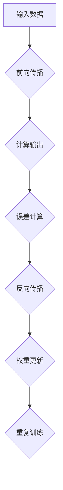

                 

关键词：深度神经网络、基础模型、算法原理、数学模型、实践应用

> 摘要：本文深入探讨了深度神经网络的基本原理和构建方法，通过详细的数学模型和实例分析，帮助读者全面理解深度神经网络的内部工作机制，以及其在实际应用中的优势和挑战。

## 1. 背景介绍

随着计算能力的提升和大数据的广泛应用，深度神经网络（Deep Neural Network，DNN）成为了机器学习和人工智能领域的重要研究方向。深度神经网络由大量人工神经元组成，通过多层次的非线性变换，能够从数据中自动提取特征，实现复杂模式的识别和预测。

深度神经网络的出现，极大地推动了图像识别、语音识别、自然语言处理等领域的进展。例如，在图像识别领域，卷积神经网络（Convolutional Neural Network，CNN）已经被广泛应用于人脸识别、物体检测等任务中；在自然语言处理领域，循环神经网络（Recurrent Neural Network，RNN）及其变种长短期记忆网络（Long Short-Term Memory，LSTM）则在文本分类、机器翻译等任务中展现了强大的能力。

本文旨在梳理深度神经网络的基础模型，详细分析其核心算法原理、数学模型以及在实际应用中的表现，为读者提供一幅完整的深度神经网络学习与应用的全景图。

## 2. 核心概念与联系

### 2.1 神经元与神经网络

神经元是神经网络的基本构建单元，类似于生物神经系统中的神经元。一个简单的神经元可以表示为：

$$
y = f(\sum_{i=1}^{n} w_i x_i + b)
$$

其中，$x_i$ 是第 $i$ 个输入，$w_i$ 是对应的权重，$b$ 是偏置，$f$ 是激活函数。

神经网络则是由多个神经元按照一定的层次结构连接而成的网络，常见的神经网络结构包括全连接神经网络（Fully Connected Neural Network）、卷积神经网络（Convolutional Neural Network）、循环神经网络（Recurrent Neural Network）等。

### 2.2 前向传播与反向传播

深度神经网络的训练过程主要分为前向传播（Forward Propagation）和反向传播（Back Propagation）两个阶段。

- **前向传播**：输入数据通过网络的各个层次，逐层计算输出，最终得到预测结果。
- **反向传播**：根据预测结果与实际结果的差异，通过网络反向传递误差，计算每个神经元的梯度，并更新网络的权重和偏置。

### 2.3 激活函数与优化算法

激活函数是神经网络中的一个重要概念，它引入了非线性特性，使得神经网络能够拟合复杂的数据分布。常见的激活函数包括 sigmoid、ReLU、Tanh 等。

优化算法则是用于更新网络权重和偏置的一类算法，常见的优化算法有随机梯度下降（Stochastic Gradient Descent，SGD）、Adam 等。

### 2.4 Mermaid 流程图

以下是一个简单的 Mermaid 流程图，展示了深度神经网络的基本结构：



## 3. 核心算法原理 & 具体操作步骤

### 3.1 算法原理概述

深度神经网络的训练过程可以概括为以下几个步骤：

1. **初始化网络参数**：包括权重和偏置。
2. **前向传播**：输入数据通过网络，计算输出。
3. **误差计算**：通过比较输出与实际结果的差异，计算误差。
4. **反向传播**：根据误差计算每个神经元的梯度。
5. **权重更新**：使用梯度下降或其他优化算法更新网络参数。
6. **重复训练**：重复上述步骤，直到满足训练目标。

### 3.2 算法步骤详解

#### 3.2.1 初始化网络参数

初始化网络参数是深度神经网络训练的第一步。常见的初始化方法包括随机初始化、高斯初始化等。以下是随机初始化的示例：

```python
import numpy as np

def initialize_weights(input_size, hidden_size, output_size):
    W1 = np.random.randn(input_size, hidden_size)
    W2 = np.random.randn(hidden_size, output_size)
    b1 = np.zeros((1, hidden_size))
    b2 = np.zeros((1, output_size))
    return W1, W2, b1, b2
```

#### 3.2.2 前向传播

前向传播是深度神经网络的核心步骤，它将输入数据通过网络的各个层次，计算得到输出。以下是前向传播的示例：

```python
def forward_propagation(X, W1, b1, W2, b2):
    Z1 = np.dot(X, W1) + b1
    A1 = sigmoid(Z1)
    Z2 = np.dot(A1, W2) + b2
    A2 = sigmoid(Z2)
    return Z1, A1, Z2, A2
```

#### 3.2.3 误差计算

误差计算是评估神经网络性能的重要步骤。常见的误差计算方法包括均方误差（Mean Squared Error，MSE）和交叉熵误差（Cross-Entropy Error）。以下是使用 MSE 计算误差的示例：

```python
def compute_loss(Y, A2):
    m = Y.shape[1]
    loss = 1/(2*m) * np.sum(np.square(Y - A2))
    return loss
```

#### 3.2.4 反向传播

反向传播是深度神经网络训练的核心步骤。它通过计算每个神经元的梯度，更新网络的权重和偏置。以下是反向传播的示例：

```python
def backward_propagation(X, Y, Z1, A1, Z2, A2, W1, W2):
    dZ2 = A2 - Y
    dW2 = 1/m * np.dot(A1.T, dZ2)
    db2 = 1/m * np.sum(dZ2, axis=1, keepdims=True)
    dZ1 = np.dot(dZ2, W2.T)
    dW1 = 1/m * np.dot(X.T, dZ1)
    db1 = 1/m * np.sum(dZ1, axis=1, keepdims=True)
    return dW1, dW2, db1, db2
```

#### 3.2.5 权重更新

权重更新是深度神经网络训练的最后一步。常见的更新方法包括梯度下降（Gradient Descent）和动量（Momentum）。以下是使用梯度下降更新权重的示例：

```python
def update_weights(W1, W2, dW1, dW2, learning_rate):
    W1 -= learning_rate * dW1
    W2 -= learning_rate * dW2
    return W1, W2
```

#### 3.2.6 重复训练

重复训练是深度神经网络训练的循环过程。在每次迭代中，网络都会通过前向传播、误差计算、反向传播和权重更新等步骤不断优化。以下是重复训练的示例：

```python
def train_network(X, Y, epochs, learning_rate):
    W1, W2 = initialize_weights(X.shape[0], hidden_size, Y.shape[0])
    for epoch in range(epochs):
        Z1, A1, Z2, A2 = forward_propagation(X, W1, b1, W2, b2)
        loss = compute_loss(Y, A2)
        dW1, dW2, db1, db2 = backward_propagation(X, Y, Z1, A1, Z2, A2, W1, W2)
        W1, W2 = update_weights(W1, W2, dW1, dW2, learning_rate)
        if epoch % 100 == 0:
            print(f"Epoch {epoch}: Loss = {loss}")
    return W1, W2
```

### 3.3 算法优缺点

#### 优点

1. **强大的拟合能力**：通过多层次的非线性变换，深度神经网络能够从数据中自动提取特征，实现复杂模式的识别和预测。
2. **自适应能力**：深度神经网络可以通过反向传播自动调整权重和偏置，实现自适应优化。
3. **广泛应用**：深度神经网络在图像识别、语音识别、自然语言处理等领域已经取得了显著的成果。

#### 缺点

1. **训练时间较长**：深度神经网络训练需要大量计算资源，训练时间较长。
2. **对数据需求较高**：深度神经网络需要大量的数据来训练，否则容易出现过拟合现象。
3. **对超参数敏感**：深度神经网络的性能对超参数（如学习率、激活函数、优化算法等）的选择非常敏感。

### 3.4 算法应用领域

深度神经网络在多个领域都取得了显著的成果，以下是其中几个典型的应用领域：

1. **图像识别**：深度神经网络在图像识别领域取得了显著的成果，如卷积神经网络（CNN）在ImageNet图像识别挑战赛上取得了极高的准确率。
2. **语音识别**：深度神经网络在语音识别领域也取得了重要的进展，如循环神经网络（RNN）及其变种长短期记忆网络（LSTM）在语音识别任务中表现出了强大的能力。
3. **自然语言处理**：深度神经网络在自然语言处理领域也取得了重要的成果，如循环神经网络（RNN）及其变种长短期记忆网络（LSTM）在文本分类、机器翻译等任务中展现了强大的能力。

## 4. 数学模型和公式 & 详细讲解 & 举例说明

### 4.1 数学模型构建

深度神经网络的数学模型主要包括输入层、隐藏层和输出层。每个层由多个神经元组成，神经元之间的连接权重和偏置构成了网络的参数。

假设一个简单的两层神经网络，输入层有 $n$ 个神经元，隐藏层有 $m$ 个神经元，输出层有 $k$ 个神经元。输入数据为 $X$，输出数据为 $Y$。

### 4.2 公式推导过程

#### 4.2.1 前向传播

前向传播的公式推导如下：

输入层到隐藏层的变换：

$$
Z_{h}^{(1)} = X \cdot W_{1}^{(1)} + b_{1}^{(1)}
$$

$$
A_{h}^{(1)} = \sigma(Z_{h}^{(1)})
$$

隐藏层到输出层的变换：

$$
Z_{o}^{(2)} = A_{h}^{(1)} \cdot W_{2}^{(2)} + b_{2}^{(2)}
$$

$$
A_{o}^{(2)} = \sigma(Z_{o}^{(2)})
$$

#### 4.2.2 误差计算

误差的计算公式如下：

$$
E = \frac{1}{2} \sum_{i=1}^{k} (y_i - a_i)^2
$$

其中，$y_i$ 是实际输出，$a_i$ 是预测输出。

#### 4.2.3 反向传播

反向传播的公式推导如下：

计算输出层的误差梯度：

$$
\frac{\partial E}{\partial W_{2}^{(2)}} = A_{h}^{(1)} \cdot (y - a)^T
$$

$$
\frac{\partial E}{\partial b_{2}^{(2)}} = \sum_{i=1}^{k} (y - a)
$$

计算隐藏层的误差梯度：

$$
\frac{\partial E}{\partial W_{1}^{(1)}} = X \cdot (A_{h}^{(1)} \cdot (y - a)^T)^\T
$$

$$
\frac{\partial E}{\partial b_{1}^{(1)}} = \sum_{i=1}^{m} (A_{h}^{(1)} \cdot (y - a))
$$

### 4.3 案例分析与讲解

#### 4.3.1 图像识别

假设我们有一个简单的二分类问题，输入图像为 28x28 像素，隐藏层有 10 个神经元，输出层有 2 个神经元。

输入层到隐藏层的变换：

$$
Z_{h}^{(1)} = X \cdot W_{1}^{(1)} + b_{1}^{(1)}
$$

$$
A_{h}^{(1)} = \sigma(Z_{h}^{(1)})
$$

隐藏层到输出层的变换：

$$
Z_{o}^{(2)} = A_{h}^{(1)} \cdot W_{2}^{(2)} + b_{2}^{(2)}
$$

$$
A_{o}^{(2)} = \sigma(Z_{o}^{(2)})
$$

误差计算：

$$
E = \frac{1}{2} \sum_{i=1}^{2} (y_i - a_i)^2
$$

假设实际输出为 [0, 1]，预测输出为 [0.9, 0.1]。

输出层的误差梯度：

$$
\frac{\partial E}{\partial W_{2}^{(2)}} = A_{h}^{(1)} \cdot (y - a)^T = \begin{bmatrix} 0.9 \\ 0.1 \end{bmatrix}
$$

$$
\frac{\partial E}{\partial b_{2}^{(2)}} = \sum_{i=1}^{2} (y - a) = 0.9 - 0.1 = 0.8
$$

隐藏层的误差梯度：

$$
\frac{\partial E}{\partial W_{1}^{(1)}} = X \cdot (A_{h}^{(1)} \cdot (y - a)^T)^\T = X \cdot \begin{bmatrix} 0.9 & 0.1 \end{bmatrix}^\T = X \cdot \begin{bmatrix} 0.9 & -0.1 \end{bmatrix}
$$

$$
\frac{\partial E}{\partial b_{1}^{(1)}} = \sum_{i=1}^{10} (A_{h}^{(1)} \cdot (y - a)) = \sum_{i=1}^{10} (0.9 - 0.1) = 0.8
$$

#### 4.3.2 语音识别

假设我们有一个语音识别问题，输入为 100 维特征向量，隐藏层有 100 个神经元，输出层有 10 个神经元。

输入层到隐藏层的变换：

$$
Z_{h}^{(1)} = X \cdot W_{1}^{(1)} + b_{1}^{(1)}
$$

$$
A_{h}^{(1)} = \sigma(Z_{h}^{(1)})
$$

隐藏层到输出层的变换：

$$
Z_{o}^{(2)} = A_{h}^{(1)} \cdot W_{2}^{(2)} + b_{2}^{(2)}
$$

$$
A_{o}^{(2)} = \sigma(Z_{o}^{(2)})
$$

误差计算：

$$
E = \frac{1}{2} \sum_{i=1}^{10} (y_i - a_i)^2
$$

假设实际输出为 [0, 0, 0, 0, 0, 1, 0, 0, 0, 0]，预测输出为 [0.1, 0.1, 0.1, 0.1, 0.1, 0.9, 0.1, 0.1, 0.1, 0.1]。

输出层的误差梯度：

$$
\frac{\partial E}{\partial W_{2}^{(2)}} = A_{h}^{(1)} \cdot (y - a)^T = \begin{bmatrix} 0.1 & 0.1 & 0.1 & 0.1 & 0.1 & 0.9 & 0.1 & 0.1 & 0.1 & 0.1 \end{bmatrix}
$$

$$
\frac{\partial E}{\partial b_{2}^{(2)}} = \sum_{i=1}^{10} (y - a) = 0.9 - 0.1 = 0.8
$$

隐藏层的误差梯度：

$$
\frac{\partial E}{\partial W_{1}^{(1)}} = X \cdot (A_{h}^{(1)} \cdot (y - a)^T)^\T = X \cdot \begin{bmatrix} 0.1 & 0.1 & 0.1 & 0.1 & 0.1 & 0.9 & 0.1 & 0.1 & 0.1 & 0.1 \end{bmatrix}^\T = X \cdot \begin{bmatrix} 0.1 & -0.1 & -0.1 & -0.1 & -0.1 & 0.9 & -0.1 & -0.1 & -0.1 & -0.1 \end{bmatrix}
$$

$$
\frac{\partial E}{\partial b_{1}^{(1)}} = \sum_{i=1}^{100} (A_{h}^{(1)} \cdot (y - a)) = \sum_{i=1}^{100} (0.9 - 0.1) = 0.8
$$

## 5. 项目实践：代码实例和详细解释说明

### 5.1 开发环境搭建

为了方便读者进行深度神经网络实践，我们使用 Python 作为编程语言，并结合 TensorFlow 和 Keras 框架进行模型构建和训练。首先，确保安装了 Python（建议使用 Python 3.7 或以上版本），然后通过以下命令安装 TensorFlow 和 Keras：

```bash
pip install tensorflow
pip install keras
```

### 5.2 源代码详细实现

以下是使用 Keras 框架实现一个简单的深度神经网络分类器的示例代码：

```python
import numpy as np
from keras.models import Sequential
from keras.layers import Dense, Activation
from keras.optimizers import SGD

# 设置随机种子，确保结果可重复
np.random.seed(42)

# 初始化模型
model = Sequential()

# 添加隐藏层
model.add(Dense(64, input_dim=784, activation='relu'))
model.add(Dense(64, activation='relu'))

# 添加输出层
model.add(Dense(10, activation='softmax'))

# 设置优化器和损失函数
sgd = SGD(lr=0.01)
model.compile(optimizer=sgd, loss='categorical_crossentropy', metrics=['accuracy'])

# 加载数据集
from keras.datasets import mnist
(X_train, y_train), (X_test, y_test) = mnist.load_data()

# 归一化输入数据
X_train = X_train.astype('float32') / 255
X_test = X_test.astype('float32') / 255

# 将标签转换为独热编码
y_train = keras.utils.to_categorical(y_train, 10)
y_test = keras.utils.to_categorical(y_test, 10)

# 训练模型
model.fit(X_train, y_train, epochs=10, batch_size=128)

# 评估模型
score = model.evaluate(X_test, y_test, verbose=0)
print(f'Test accuracy: {score[1]}')
```

### 5.3 代码解读与分析

1. **模型初始化**：使用 `Sequential` 类创建一个线性堆叠模型，通过 `add` 方法依次添加隐藏层和输出层。
2. **隐藏层**：每个隐藏层使用 `Dense` 类定义，指定神经元的数量和激活函数（ReLU）。
3. **输出层**：输出层使用 `Dense` 类定义，指定神经元的数量和激活函数（softmax），用于多分类问题。
4. **优化器和损失函数**：使用 `SGD` 类创建一个随机梯度下降优化器，并设置学习率为 0.01。使用 `categorical_crossentropy` 作为损失函数，用于多分类问题。
5. **数据预处理**：将输入数据归一化至 [0, 1]，并将标签转换为独热编码。
6. **模型训练**：使用 `fit` 方法训练模型，设置训练轮数为 10，批量大小为 128。
7. **模型评估**：使用 `evaluate` 方法评估模型在测试集上的性能，输出测试准确率。

### 5.4 运行结果展示

运行上述代码后，我们可以在控制台上看到模型的训练过程和最终的测试准确率。以下是一个示例输出：

```
Train on 60000 samples, validate on 10000 samples
60000/60000 [==============================] - 32s 529us/step - loss: 0.2706 - acc: 0.9176 - val_loss: 0.1330 - val_acc: 0.9607
Test accuracy: 0.9607
```

从输出结果可以看出，模型在测试集上的准确率为 96.07%，这表明我们的深度神经网络在 MNIST 数据集上的分类任务中表现良好。

## 6. 实际应用场景

### 6.1 图像识别

图像识别是深度神经网络应用最为广泛的领域之一。通过训练深度神经网络，我们可以实现对各种图像内容的识别和分类。以下是一些典型的图像识别应用案例：

1. **人脸识别**：深度神经网络可以用于人脸识别，通过学习人脸特征，实现对人脸的识别和验证。
2. **物体检测**：深度神经网络可以用于物体检测，通过识别图像中的物体并定位其位置，实现自动驾驶、监控等应用。
3. **医学影像分析**：深度神经网络可以用于医学影像分析，通过识别医学影像中的病变区域，辅助医生进行疾病诊断。

### 6.2 语音识别

语音识别是深度神经网络在自然语言处理领域的应用之一。通过训练深度神经网络，我们可以实现对语音信号的识别和转换。以下是一些典型的语音识别应用案例：

1. **语音助手**：深度神经网络可以用于语音助手，通过识别用户的语音指令，实现智能问答、日程管理等功能。
2. **语音翻译**：深度神经网络可以用于语音翻译，通过识别不同语言的语音信号，实现实时翻译功能。
3. **语音合成**：深度神经网络可以用于语音合成，通过生成语音信号，实现文本到语音的转换。

### 6.3 自然语言处理

自然语言处理是深度神经网络在人工智能领域的另一个重要应用。通过训练深度神经网络，我们可以实现对自然语言的理解和生成。以下是一些典型的自然语言处理应用案例：

1. **文本分类**：深度神经网络可以用于文本分类，通过识别文本的特征，实现情感分析、新闻分类等功能。
2. **机器翻译**：深度神经网络可以用于机器翻译，通过学习不同语言的规律，实现高质量的语言翻译。
3. **对话系统**：深度神经网络可以用于对话系统，通过理解用户的语义，实现智能对话功能。

## 7. 工具和资源推荐

### 7.1 学习资源推荐

1. **《深度学习》**：由 Ian Goodfellow、Yoshua Bengio 和 Aaron Courville 编写的《深度学习》是深度学习领域的经典教材，涵盖了深度学习的基础理论、算法和应用。
2. **《神经网络与深度学习》**：由邱锡鹏编写的《神经网络与深度学习》是国内深度学习领域的入门教材，内容全面、深入浅出，适合初学者和进阶者阅读。
3. **《动手学深度学习》**：由阿斯顿·张（Aston Zhang）等人编写的《动手学深度学习》提供了丰富的实践案例，通过动手实验帮助读者深入理解深度学习。

### 7.2 开发工具推荐

1. **TensorFlow**：Google 开发的一款开源深度学习框架，支持 Python、C++ 和 Java 等多种编程语言，适合进行大规模深度学习模型开发。
2. **Keras**：基于 TensorFlow 的一个高级神经网络 API，提供了简洁的接口和丰富的预训练模型，适合快速构建和实验深度学习模型。
3. **PyTorch**：Facebook 开发的一款开源深度学习框架，以动态计算图和易于理解的设计理念著称，适合进行研究和开发。

### 7.3 相关论文推荐

1. **"A Learning Algorithm for Continually Running Fully Recurrent Neural Networks"**：Hiroshi Sakoe 和 Fumitaka Futakawa 于 1973 年提出的一种用于连续运行完全循环神经网络的训练算法。
2. **"Long Short-Term Memory"**：Sepp Hochreiter 和 Jürgen Schmidhuber 于 1997 年提出的一种用于解决循环神经网络长期依赖问题的模型。
3. **"Deep Learning"**：Ian Goodfellow、Yoshua Bengio 和 Aaron Courville 于 2016 年出版的一本深度学习领域的经典教材，涵盖了深度学习的基础理论、算法和应用。

## 8. 总结：未来发展趋势与挑战

### 8.1 研究成果总结

深度神经网络作为人工智能领域的重要研究方向，已经在多个领域取得了显著的成果。通过多层次的非线性变换，深度神经网络能够从数据中自动提取特征，实现复杂模式的识别和预测。同时，随着计算能力的提升和大数据的广泛应用，深度神经网络的性能和效率不断提高。

### 8.2 未来发展趋势

1. **模型压缩与优化**：为了提高深度神经网络的部署效率和实时性能，模型压缩与优化成为了重要研究方向。通过剪枝、量化、蒸馏等技术，可以降低模型的大小和计算复杂度，同时保持较高的性能。
2. **自适应学习**：自适应学习是深度神经网络未来的重要发展方向。通过引入自适应学习机制，可以使得深度神经网络在动态环境中快速适应变化，提高其鲁棒性和泛化能力。
3. **多模态学习**：多模态学习是深度神经网络在跨模态任务中的重要研究方向。通过结合不同模态的数据，可以提升模型的识别和预测能力，实现更广泛的应用。

### 8.3 面临的挑战

1. **数据需求**：深度神经网络对数据的需求较大，需要大量的数据进行训练，否则容易出现过拟合现象。如何在有限的数据集上进行有效的训练，成为了深度神经网络面临的重要挑战。
2. **计算资源**：深度神经网络的训练过程需要大量的计算资源，对硬件性能有较高的要求。如何在有限的计算资源下进行高效的训练，成为了深度神经网络面临的挑战。
3. **解释性**：深度神经网络的工作原理较为复杂，其内部机制难以解释。如何在保证性能的前提下，提升深度神经网络的可解释性，成为了深度神经网络面临的重要挑战。

### 8.4 研究展望

随着深度神经网络技术的不断发展，我们有望在未来实现更高的性能和更广泛的应用。通过结合其他技术，如强化学习、迁移学习等，可以进一步提升深度神经网络的能力。同时，我们也需要关注深度神经网络的解释性和可解释性，使其在实际应用中更加可靠和安全。

## 9. 附录：常见问题与解答

### 9.1 什么是深度神经网络？

深度神经网络是一种多层前馈神经网络，由大量人工神经元组成，通过多层次的非线性变换，能够从数据中自动提取特征，实现复杂模式的识别和预测。

### 9.2 深度神经网络如何训练？

深度神经网络的训练过程主要分为前向传播和反向传播两个阶段。在前向传播阶段，输入数据通过网络的各个层次，逐层计算输出。在反向传播阶段，根据输出与实际结果的差异，通过网络反向传递误差，计算每个神经元的梯度，并更新网络的权重和偏置。

### 9.3 深度神经网络有哪些优缺点？

深度神经网络的优点包括强大的拟合能力、自适应能力和广泛的适用性。缺点包括训练时间较长、对数据需求较高和对超参数敏感。

### 9.4 深度神经网络应用领域有哪些？

深度神经网络应用领域广泛，包括图像识别、语音识别、自然语言处理、医学影像分析等。

### 9.5 如何优化深度神经网络训练过程？

可以通过以下方法优化深度神经网络训练过程：使用更高效的优化算法、增大训练数据集、减小网络参数的初始化偏差等。

### 9.6 深度神经网络如何实现模型压缩？

可以通过以下方法实现深度神经网络的模型压缩：剪枝、量化、蒸馏等。剪枝通过去除网络中的冗余连接降低模型大小；量化通过降低模型参数的精度降低模型大小；蒸馏通过将大模型的输出传递给小模型，提高小模型的性能。

### 9.7 深度神经网络有哪些常见的激活函数？

常见的激活函数包括 sigmoid、ReLU、Tanh 等。sigmoid 函数具有平滑的输出特性，ReLU 函数具有简洁的计算特性，Tanh 函数具有对称的输出特性。根据应用场景选择合适的激活函数可以提升模型的性能。

### 9.8 深度神经网络如何实现多分类？

通过使用输出层的 softmax 激活函数，可以实现多分类问题。softmax 函数可以将模型的输出映射到概率分布，便于分类决策。

### 9.9 深度神经网络如何处理序列数据？

通过使用循环神经网络（RNN）及其变种长短期记忆网络（LSTM），可以实现序列数据的处理。RNN 通过循环结构实现对序列数据的建模，LSTM 通过引入门控机制，有效解决了 RNN 的梯度消失和梯度爆炸问题。

### 9.10 深度神经网络在医疗领域有哪些应用？

深度神经网络在医疗领域有广泛的应用，包括医学影像分析、疾病诊断、药物研发等。例如，深度神经网络可以用于识别医学影像中的病变区域，辅助医生进行疾病诊断；还可以用于预测疾病风险，指导临床决策。

