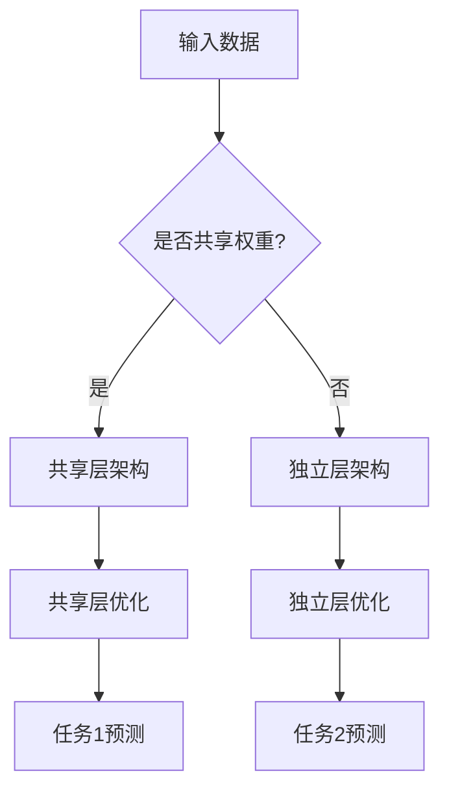

                 

关键词：多任务学习、机器学习、深度学习、共享权重、协同学习、任务关联性、神经架构搜索、代码实例、实践经验

摘要：本文详细介绍了多任务学习（Multi-Task Learning, MTL）的基本原理、核心算法、数学模型以及实际应用场景。通过具体的项目实践和代码实例，读者可以全面了解多任务学习的方法和技巧，从而在机器学习和深度学习领域更好地应用这一技术。

## 1. 背景介绍

随着深度学习技术的发展，越来越多的复杂任务需要通过机器学习模型来实现。这些任务可能存在一定的关联性，例如图像分类和目标检测。传统的单任务学习（Single-Task Learning, STL）方法需要为每个任务分别训练模型，这不仅增加了计算成本，而且难以充分利用任务间的关联性。因此，多任务学习作为一种新兴的机器学习方法，引起了广泛的研究兴趣。

多任务学习的基本思想是在一个统一的模型框架下，同时训练多个任务。这样不仅可以共享模型参数，降低模型复杂度，还能提高学习效率。此外，多任务学习还可以在任务之间存在关联性的情况下，更好地利用任务间的相关性，从而提高模型的泛化能力。

## 2. 核心概念与联系

### 2.1 多任务学习的核心概念

多任务学习涉及到以下几个核心概念：

- **任务（Task）**：指需要学习的具体任务，如图像分类、目标检测、语音识别等。
- **模型（Model）**：指用于学习任务的数学模型，可以是传统的神经网络、卷积神经网络（CNN）或循环神经网络（RNN）等。
- **共享权重（Shared Weights）**：指多个任务共享相同的模型参数，以减少模型复杂度和计算成本。
- **协同学习（Co-Training）**：指在训练过程中，多个任务相互协作，共同优化模型参数。

### 2.2 多任务学习的架构

多任务学习的架构可以分为以下几种：

- **并行架构**：多个任务同时训练，各自独立优化模型参数。
- **序列架构**：多个任务按顺序训练，前一个任务的输出作为后一个任务的输入。
- **共享层架构**：多个任务共享一部分模型层，但各自的输出层独立优化。
- **交叉架构**：多个任务通过交叉连接共享模型参数，同时优化不同任务。

### 2.3 多任务学习的 Mermaid 流程图



## 3. 核心算法原理 & 具体操作步骤

### 3.1 算法原理概述

多任务学习的核心算法是基于共享权重的协同学习。具体来说，多任务学习算法可以分为以下几步：

1. **数据预处理**：对输入数据进行预处理，如数据增强、归一化等。
2. **模型初始化**：初始化多任务模型，包括共享层和独立层的权重。
3. **迭代训练**：通过迭代训练优化模型参数，包括共享权重和独立权重。
4. **任务预测**：使用训练好的模型进行任务预测。

### 3.2 算法步骤详解

#### 3.2.1 数据预处理

数据预处理是多任务学习的重要步骤，包括以下操作：

- **数据增强**：通过随机旋转、缩放、裁剪等操作增加数据多样性。
- **归一化**：将输入数据归一化到相同的范围，如[0, 1]。
- **数据集划分**：将数据集划分为训练集、验证集和测试集。

#### 3.2.2 模型初始化

模型初始化包括以下步骤：

- **共享层初始化**：初始化共享层的权重，可以使用随机初始化或预训练模型。
- **独立层初始化**：初始化独立层的权重，同样可以使用随机初始化或预训练模型。

#### 3.2.3 迭代训练

迭代训练是优化模型参数的关键步骤，包括以下操作：

- **前向传播**：计算输入数据的预测结果。
- **后向传播**：计算损失函数，并更新模型参数。
- **权重共享**：在训练过程中，共享层的权重会同时更新。
- **独立优化**：独立层的权重会分别优化。

#### 3.2.4 任务预测

任务预测包括以下步骤：

- **输入数据**：将待预测的数据输入到训练好的模型中。
- **模型输出**：计算模型的输出结果。
- **结果处理**：对输出结果进行处理，如分类、回归等。

### 3.3 算法优缺点

#### 优点

- **共享权重**：共享权重可以减少模型参数，降低计算成本。
- **协同学习**：协同学习可以充分利用任务间的相关性，提高模型的泛化能力。
- **效率提升**：多任务学习可以在一个统一的模型框架下同时训练多个任务，提高学习效率。

#### 缺点

- **模型复杂度**：多任务学习模型可能比单任务学习模型复杂，难以调试。
- **关联性限制**：多任务学习需要任务之间存在一定的关联性，否则难以发挥效果。

### 3.4 算法应用领域

多任务学习在多个领域都有广泛的应用，包括：

- **计算机视觉**：图像分类、目标检测、人脸识别等。
- **自然语言处理**：语言翻译、情感分析、文本分类等。
- **语音识别**：语音识别、语音合成、语音增强等。
- **推荐系统**：协同过滤、内容推荐等。

## 4. 数学模型和公式 & 详细讲解 & 举例说明

### 4.1 数学模型构建

多任务学习的数学模型可以表示为：

$$
L = \sum_{i=1}^{n} w_i L_i
$$

其中，$L$ 表示总损失函数，$L_i$ 表示第 $i$ 个任务的损失函数，$w_i$ 表示第 $i$ 个任务的权重。

### 4.2 公式推导过程

假设我们有两个任务 $T_1$ 和 $T_2$，它们的损失函数分别为 $L_1$ 和 $L_2$。则多任务学习的总损失函数可以表示为：

$$
L = \alpha L_1 + (1 - \alpha) L_2
$$

其中，$\alpha$ 表示任务 $T_1$ 的权重，$1 - \alpha$ 表示任务 $T_2$ 的权重。

### 4.3 案例分析与讲解

假设我们有一个图像分类任务和一个目标检测任务。图像分类任务的损失函数为交叉熵损失，目标检测任务的损失函数为平滑$L_1$损失。

- **图像分类任务**：

$$
L_1 = -\sum_{i=1}^{m} y_i \log(p_i)
$$

其中，$y_i$ 表示第 $i$ 个图像的真实标签，$p_i$ 表示模型对第 $i$ 个图像的预测概率。

- **目标检测任务**：

$$
L_2 = \frac{1}{m} \sum_{i=1}^{m} \sum_{j=1}^{n} (w_j | \hat{t}_{ij} - t_{ij} |)
$$

其中，$\hat{t}_{ij}$ 表示模型对第 $i$ 个图像中第 $j$ 个目标的预测位置，$t_{ij}$ 表示第 $i$ 个图像中第 $j$ 个目标的真实位置，$w_j$ 表示第 $j$ 个目标的权重。

则多任务学习的总损失函数为：

$$
L = \alpha L_1 + (1 - \alpha) L_2
$$

其中，$\alpha$ 可以通过交叉验证等方法来确定。

## 5. 项目实践：代码实例和详细解释说明

### 5.1 开发环境搭建

为了实现多任务学习，我们需要搭建一个合适的开发环境。以下是搭建环境的步骤：

1. 安装 Python（版本 3.6 以上）。
2. 安装深度学习框架（如 TensorFlow、PyTorch）。
3. 安装必要的依赖库（如 NumPy、Pandas 等）。

### 5.2 源代码详细实现

以下是多任务学习的源代码实现：

```python
import torch
import torch.nn as nn
import torch.optim as optim

# 定义模型
class MultiTaskModel(nn.Module):
    def __init__(self):
        super(MultiTaskModel, self).__init__()
        self.shared_layer = nn.Linear(784, 128)
        self.task1_layer = nn.Linear(128, 10)
        self.task2_layer = nn.Linear(128, 5)

    def forward(self, x):
        x = torch.relu(self.shared_layer(x))
        x1 = self.task1_layer(x)
        x2 = self.task2_layer(x)
        return x1, x2

# 初始化模型
model = MultiTaskModel()

# 定义损失函数和优化器
criterion = nn.CrossEntropyLoss()
optimizer = optim.Adam(model.parameters(), lr=0.001)

# 训练模型
for epoch in range(100):
    for inputs, targets1, targets2 in data_loader:
        optimizer.zero_grad()
        outputs1, outputs2 = model(inputs)
        loss1 = criterion(outputs1, targets1)
        loss2 = criterion(outputs2, targets2)
        loss = loss1 + loss2
        loss.backward()
        optimizer.step()
    print(f"Epoch [{epoch+1}/{100}], Loss: {loss.item()}")

# 测试模型
with torch.no_grad():
    correct1 = 0
    correct2 = 0
    total1 = 0
    total2 = 0
    for inputs, targets1, targets2 in test_loader:
        outputs1, outputs2 = model(inputs)
        _, predicted1 = torch.max(outputs1.data, 1)
        _, predicted2 = torch.max(outputs2.data, 1)
        total1 += targets1.size(0)
        total2 += targets2.size(0)
        correct1 += (predicted1 == targets1).sum().item()
        correct2 += (predicted2 == targets2).sum().item()
    print(f"Test Accuracy for Task 1: {100 * correct1 / total1}%")
    print(f"Test Accuracy for Task 2: {100 * correct2 / total2}%")
```

### 5.3 代码解读与分析

以上代码实现了多任务学习的模型训练和测试。具体解读如下：

- **模型定义**：定义了一个多任务模型，包括共享层和独立层。
- **损失函数和优化器**：定义了交叉熵损失函数和 Adam 优化器。
- **训练过程**：通过迭代训练优化模型参数。
- **测试过程**：使用测试集评估模型性能。

## 6. 实际应用场景

多任务学习在多个实际应用场景中都有显著的优势，例如：

- **自动驾驶**：多任务学习可以同时实现目标检测、道路识别、行人检测等任务，提高自动驾驶系统的鲁棒性和安全性。
- **医疗影像分析**：多任务学习可以同时进行肿瘤检测、病灶分割、诊断分类等任务，提高医疗影像分析的整体性能。
- **语音识别**：多任务学习可以同时实现语音识别、语音合成、语音增强等任务，提高语音处理系统的综合性能。

## 7. 工具和资源推荐

### 7.1 学习资源推荐

- **《深度学习》**：Goodfellow、Bengio 和 Courville 著，介绍了深度学习的理论基础和实践方法。
- **《动手学深度学习》**：花书，提供了丰富的深度学习实践案例和代码实现。

### 7.2 开发工具推荐

- **TensorFlow**：谷歌推出的开源深度学习框架，支持多任务学习。
- **PyTorch**：Facebook AI 推出的开源深度学习框架，支持动态计算图和自动微分。

### 7.3 相关论文推荐

- **"Multi-Task Learning Using Uncoupled Multi-Head Attention for Autonomous Driving"**：介绍了多任务学习在自动驾驶中的应用。
- **"Multi-Task Learning for Visual Tracking"**：探讨了多任务学习在视觉跟踪任务中的应用。

## 8. 总结：未来发展趋势与挑战

### 8.1 研究成果总结

多任务学习作为机器学习和深度学习领域的重要研究方向，取得了显著的成果。目前，多任务学习在多个应用场景中已经取得了良好的效果，例如自动驾驶、医疗影像分析、语音识别等。

### 8.2 未来发展趋势

未来，多任务学习将继续朝着以下方向发展：

- **神经架构搜索（Neural Architecture Search, NAS）**：结合多任务学习和神经架构搜索技术，探索自动设计多任务学习模型的方法。
- **任务关联性研究**：深入研究任务间的关联性，设计更有效的多任务学习算法。
- **硬件加速**：利用 GPU、TPU 等硬件加速多任务学习模型的训练和推理。

### 8.3 面临的挑战

多任务学习在发展过程中也面临着一些挑战：

- **模型复杂度**：多任务学习模型可能比单任务学习模型复杂，需要更高效的算法和优化方法。
- **任务关联性限制**：多任务学习需要任务之间存在一定的关联性，否则难以发挥效果。
- **计算成本**：多任务学习需要同时训练多个任务，可能导致计算成本增加。

### 8.4 研究展望

展望未来，多任务学习将继续在机器学习和深度学习领域发挥重要作用。随着技术的不断进步，多任务学习有望在更多应用场景中取得突破性进展，为人工智能的发展做出更大贡献。

## 9. 附录：常见问题与解答

### 9.1 什么是多任务学习？

多任务学习（Multi-Task Learning, MTL）是一种机器学习方法，旨在同时训练多个相关的任务。与单任务学习（Single-Task Learning, STL）相比，MTL可以通过共享模型参数和任务间的协同学习，提高学习效率和模型泛化能力。

### 9.2 多任务学习的优势有哪些？

多任务学习的优势包括：

- **共享权重**：通过共享模型参数，减少模型复杂度和计算成本。
- **协同学习**：充分利用任务间的相关性，提高模型泛化能力。
- **效率提升**：在一个统一的模型框架下同时训练多个任务，提高学习效率。

### 9.3 多任务学习有哪些应用领域？

多任务学习在多个领域都有广泛应用，包括：

- **计算机视觉**：图像分类、目标检测、人脸识别等。
- **自然语言处理**：语言翻译、情感分析、文本分类等。
- **语音识别**：语音识别、语音合成、语音增强等。
- **推荐系统**：协同过滤、内容推荐等。

### 9.4 如何设计多任务学习模型？

设计多任务学习模型需要考虑以下因素：

- **任务关联性**：分析任务间的关联性，选择合适的模型架构。
- **共享权重**：设计共享权重策略，优化模型参数更新。
- **损失函数**：设计合适的损失函数，平衡不同任务的权重。

---

作者：禅与计算机程序设计艺术 / Zen and the Art of Computer Programming

