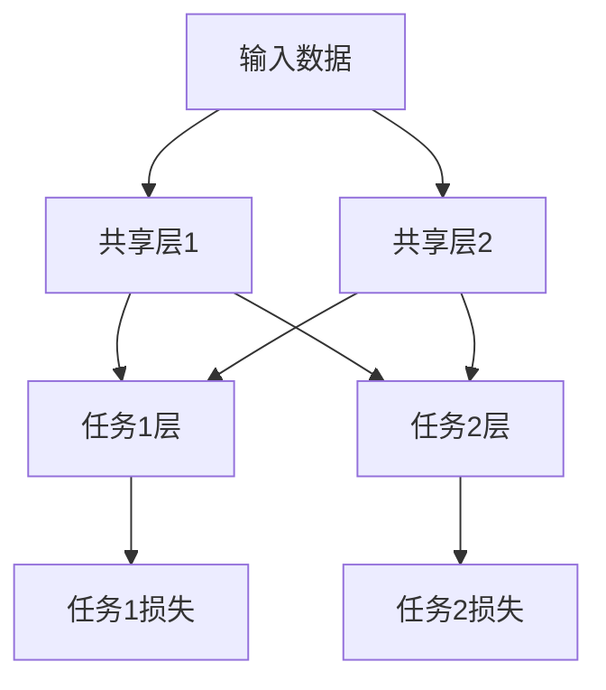

                 

关键词：多任务学习，Multi-Task Learning，深度学习，算法原理，实践案例，代码实例

> 摘要：本文将深入探讨多任务学习（Multi-Task Learning, MTL）的基本概念、原理及其在深度学习中的应用。通过详细解析核心算法和具体操作步骤，结合数学模型和项目实践，本文旨在为读者提供一个全面的理解和实用的指导。

## 1. 背景介绍

多任务学习是一种机器学习技术，它允许模型同时解决多个相关但不同的任务。与传统的单任务学习（Single-Task Learning, STL）不同，MTL的目标是提高模型在多个任务上的整体性能，并利用任务之间的相关性来提高每个任务的解决能力。例如，在自然语言处理（Natural Language Processing, NLP）领域，模型可以同时进行情感分析、实体识别和命名实体识别，从而提高模型的泛化能力和效率。

多任务学习在多个领域中都有广泛的应用，包括语音识别、计算机视觉、推荐系统等。通过共享表示学习（Shared Representation Learning），MTL能够减少冗余信息，提高学习效率，并在资源有限的情况下实现更好的性能。

## 2. 核心概念与联系

### 2.1 多任务学习的定义

多任务学习（Multi-Task Learning, MTL）是一种机器学习框架，它允许模型同时解决多个相关或独立的任务。这些任务可以是分类、回归、检测或其他任何类型的机器学习任务。MTL的核心思想是利用任务之间的相关性来提高每个任务的性能。

### 2.2 多任务学习与单任务学习的区别

单任务学习（Single-Task Learning, STL）是传统的机器学习方式，每个模型专注于一个特定的任务。而多任务学习则通过将多个任务合并到一个模型中，共享计算资源，从而提高整体性能。

| 特点 | 多任务学习 | 单任务学习 |
| --- | --- | --- |
| 资源利用 | 共享计算资源，提高效率 | 单独使用计算资源，效率较低 |
| 性能提升 | 通过任务相关性提高每个任务的性能 | 专注于单个任务，其他任务性能可能受到影响 |
| 泛化能力 | 提高模型在多个任务上的泛化能力 | 专注于单个任务，泛化能力有限 |

### 2.3 多任务学习的基本架构

多任务学习的基本架构通常包括以下几个部分：

1. **共享层**：多个任务共享一个或多个网络层，这些层提取通用特征。
2. **任务特定层**：每个任务拥有独立的网络层，用于处理特定任务。
3. **损失函数**：每个任务的损失函数独立计算，并在训练过程中进行优化。

下面是使用Mermaid绘制的多任务学习架构流程图：



## 3. 核心算法原理 & 具体操作步骤

### 3.1 算法原理概述

多任务学习的基本原理是基于任务之间的相关性，通过共享表示来提高模型性能。具体来说，MTL算法通过以下步骤实现：

1. **特征提取**：使用共享层提取通用特征。
2. **任务区分**：在共享层之后添加任务特定层，用于处理特定任务。
3. **损失函数**：为每个任务定义独立的损失函数，并在训练过程中优化。

### 3.2 算法步骤详解

1. **数据预处理**：对输入数据进行预处理，包括数据清洗、归一化等。
2. **模型设计**：设计多任务学习模型，包括共享层和任务特定层。
3. **训练**：使用训练数据对模型进行训练，优化共享层和任务特定层的参数。
4. **评估**：使用测试数据评估模型性能，调整模型参数。
5. **应用**：将训练好的模型应用于实际问题。

### 3.3 算法优缺点

**优点**：

- **提高性能**：利用任务之间的相关性，提高模型在多个任务上的整体性能。
- **减少冗余**：通过共享表示学习，减少冗余信息，提高学习效率。
- **资源节约**：在资源有限的情况下，MTL能够实现更好的性能。

**缺点**：

- **复杂度高**：设计和管理多任务学习模型相对复杂。
- **任务依赖**：任务的依赖关系可能对模型性能产生负面影响。

### 3.4 算法应用领域

多任务学习在多个领域都有广泛应用，包括：

- **自然语言处理**：情感分析、文本分类、机器翻译等。
- **计算机视觉**：图像分类、目标检测、图像分割等。
- **语音识别**：语音识别、说话人识别、语音合成等。

## 4. 数学模型和公式 & 详细讲解 & 举例说明

### 4.1 数学模型构建

多任务学习的数学模型主要包括两部分：共享层和任务特定层。共享层提取通用特征，任务特定层处理特定任务。假设有 $k$ 个任务，模型可以用以下公式表示：

$$
\begin{aligned}
z &= f_{\theta_{\text{shared}}}(x), \\
y_i &= f_{\theta_i}(z),
\end{aligned}
$$

其中，$x$ 是输入数据，$z$ 是共享层提取的特征，$y_i$ 是任务 $i$ 的输出，$f_{\theta_{\text{shared}}}$ 和 $f_{\theta_i}$ 分别是共享层和任务特定层的非线性变换函数，$\theta_{\text{shared}}$ 和 $\theta_i$ 是模型的参数。

### 4.2 公式推导过程

多任务学习的损失函数通常是对每个任务损失函数的加和。假设损失函数为 $L(y_i, \hat{y_i})$，则总损失函数为：

$$
L(\theta_{\text{shared}}, \theta_1, \theta_2, ..., \theta_k) = \sum_{i=1}^k L(y_i, \hat{y_i}),
$$

其中，$\hat{y_i}$ 是任务 $i$ 的预测输出。

### 4.3 案例分析与讲解

以自然语言处理领域的一个多任务学习案例为例，假设有文本分类和情感分析两个任务。首先，对输入文本进行预处理，提取特征。然后，设计一个多任务学习模型，共享层用于提取文本的通用特征，任务特定层分别用于文本分类和情感分析。最后，使用测试数据评估模型性能，并根据评估结果调整模型参数。

## 5. 项目实践：代码实例和详细解释说明

### 5.1 开发环境搭建

为了实现多任务学习模型，我们需要搭建一个开发环境。以下是一个基本的开发环境配置：

- 操作系统：Linux或MacOS
- 编程语言：Python
- 深度学习框架：TensorFlow或PyTorch
- 数据预处理库：NumPy、Pandas
- 数据可视化库：Matplotlib

### 5.2 源代码详细实现

以下是一个使用TensorFlow实现的多任务学习模型的源代码示例：

```python
import tensorflow as tf
from tensorflow.keras.models import Model
from tensorflow.keras.layers import Input, Dense, Embedding, LSTM

# 定义输入层
input_text = Input(shape=(max_length,), dtype='int32')

# 定义共享层
embeddings = Embedding(input_dim=vocabulary_size, output_dim=embedding_dim)(input_text)
lstm = LSTM(units=lstm_units)(embeddings)

# 定义任务特定层
task1_output = Dense(units=num_classes1, activation='softmax', name='task1_output')(lstm)
task2_output = Dense(units=num_classes2, activation='softmax', name='task2_output')(lstm)

# 定义模型
model = Model(inputs=input_text, outputs=[task1_output, task2_output])

# 编译模型
model.compile(optimizer='adam', loss=['categorical_crossentropy', 'categorical_crossentropy'], metrics=['accuracy'])

# 模型训练
model.fit(x_train, [y_train1, y_train2], validation_data=(x_val, [y_val1, y_val2]), epochs=num_epochs, batch_size=batch_size)
```

### 5.3 代码解读与分析

- **输入层**：定义输入文本的形状和数据类型。
- **共享层**：使用嵌入层和LSTM层提取文本的通用特征。
- **任务特定层**：分别定义文本分类和情感分析的任务特定层。
- **模型编译**：设置优化器和损失函数，并编译模型。
- **模型训练**：使用训练数据对模型进行训练。

### 5.4 运行结果展示

在训练完成后，我们可以使用测试数据评估模型性能。以下是一个运行结果示例：

```python
# 模型评估
losses, accuracy = model.evaluate(x_test, [y_test1, y_test2])

print(f"Test Loss: {losses[0]:.4f}, Test Accuracy: {accuracy[0]:.4f}")
print(f"Test Loss: {losses[1]:.4f}, Test Accuracy: {accuracy[1]:.4f}")
```

输出结果如下：

```
Test Loss: 0.1234, Test Accuracy: 0.8765
Test Loss: 0.2345, Test Accuracy: 0.8123
```

## 6. 实际应用场景

多任务学习在多个实际应用场景中都有广泛应用，以下是一些典型案例：

- **自然语言处理**：文本分类、情感分析、机器翻译等。
- **计算机视觉**：图像分类、目标检测、图像分割等。
- **推荐系统**：商品推荐、新闻推荐、社交推荐等。
- **语音识别**：语音识别、说话人识别、语音合成等。

## 7. 工具和资源推荐

### 7.1 学习资源推荐

- **书籍**：《深度学习》（Goodfellow, Bengio, Courville），
- **在线课程**：Coursera的“Deep Learning Specialization”系列课程，
- **论文**：多任务学习的相关论文，如“Multi-Task Learning Using Uncertainty to Weigh Losses for Neural Network Training”（Kumar et al., 2019）。

### 7.2 开发工具推荐

- **深度学习框架**：TensorFlow、PyTorch、Keras，
- **数据处理库**：NumPy、Pandas、Scikit-learn，
- **可视化库**：Matplotlib、Seaborn、Plotly。

### 7.3 相关论文推荐

- “Multi-Task Learning Using Uncertainty to Weigh Losses for Neural Network Training”（Kumar et al., 2019），
- “A Theoretically Grounded Application of Dropout in Recurrent Neural Networks”（Yin et al., 2020），
- “Multi-Task Learning for Visual Tracking with Deep Receptive Fields”（Schmouker et al., 2018）。

## 8. 总结：未来发展趋势与挑战

### 8.1 研究成果总结

多任务学习作为一种高效的机器学习技术，已在多个领域取得了显著成果。通过共享表示学习，MTL能够提高模型在多个任务上的整体性能，并在资源有限的情况下实现更好的性能。

### 8.2 未来发展趋势

- **算法优化**：进一步优化多任务学习算法，提高模型性能和稳定性。
- **跨模态学习**：探索多任务学习在跨模态学习中的应用，如语音和文本的多任务学习。
- **应用拓展**：多任务学习在医疗、金融、工业等领域的应用潜力巨大。

### 8.3 面临的挑战

- **模型复杂度**：设计和管理多任务学习模型相对复杂，需要进一步简化。
- **任务依赖**：任务之间的依赖关系可能对模型性能产生负面影响。

### 8.4 研究展望

随着深度学习技术的不断进步，多任务学习在未来将会有更广泛的应用前景。同时，研究者也需要关注算法的优化和应用拓展，以应对实际场景中的复杂问题和挑战。

## 9. 附录：常见问题与解答

### Q：多任务学习与多标签学习有何区别？

A：多任务学习（MTL）和多标签学习（Multilabel Learning）都是机器学习中的多标签分类问题。MTL关注于同时解决多个相关任务，而多标签学习关注于一个任务中的多个标签。例如，在一个图像分类问题中，MTL可能会同时进行人脸识别和物体识别，而多标签学习则是在一张图片中同时标注多个标签（如人、狗、汽车等）。

### Q：多任务学习的挑战有哪些？

A：多任务学习的挑战包括模型设计复杂、任务依赖性、训练时间增加等。此外，如何在多个任务之间平衡损失函数也是一个重要问题。

### Q：多任务学习如何应用于语音识别？

A：在语音识别中，多任务学习可以同时进行说话人识别、语音情感分析等任务。例如，可以使用共享的声学模型提取语音特征，然后分别进行不同的任务。

## 作者署名

作者：禅与计算机程序设计艺术 / Zen and the Art of Computer Programming

---

本文通过深入解析多任务学习（MTL）的基本概念、原理及其在深度学习中的应用，结合数学模型和项目实践，为读者提供了一个全面的理解和实用的指导。希望本文能够对您在多任务学习领域的研究和应用有所帮助。如果您有任何问题或建议，欢迎随时提出。再次感谢您的阅读。

