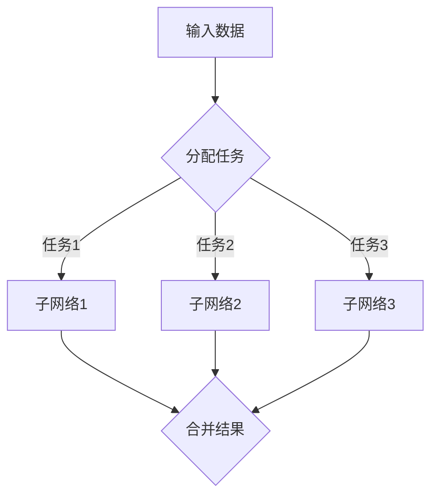

                 

关键词：多任务深度神经网络，MoE，复杂任务，任务并行，资源管理，模型优化。

> 摘要：本文深入探讨了多任务深度神经网络（MoE）的原理、算法、应用和实践，分析了其在管理复杂任务中的优势与挑战，并展望了未来的发展趋势。

## 1. 背景介绍

随着人工智能技术的迅猛发展，深度神经网络（DNN）在图像识别、自然语言处理、推荐系统等领域取得了显著的成果。然而，随着任务复杂度的增加，单个DNN模型往往难以胜任。为了解决这一问题，多任务深度神经网络（MoE）应运而生。

多任务深度神经网络（MoE）是一种能够同时处理多个任务的神经网络结构，通过将任务并行化，提高了模型的效率和准确性。MoE的核心思想是，将神经网络拆分成多个较小的子网络，每个子网络负责处理一个子任务。通过这种任务并行化的方式，MoE能够更高效地利用计算资源，同时处理多个任务。

## 2. 核心概念与联系

### 2.1 MoE架构原理

MoE架构的核心在于任务的并行处理。其基本原理是将一个大型神经网络拆分成多个较小的子网络，每个子网络负责处理一个特定的子任务。这些子网络通过共享参数和权重，实现了对多个任务的协同处理。

下面是一个简单的Mermaid流程图，展示了MoE的基本架构：



### 2.2 MoE与现有模型的联系与区别

MoE与现有的多任务学习模型（如共享权重、独立模型等）有着密切的联系。然而，MoE在任务并行化和资源管理方面有着独特的优势。

与共享权重模型相比，MoE能够更灵活地处理不同子任务之间的差异。共享权重模型要求所有子任务使用相同的权重，这在某些情况下可能会导致子任务之间的性能损失。而MoE通过子网络之间的任务并行处理，可以更好地适应不同子任务的需求。

与独立模型相比，MoE能够更有效地利用计算资源。独立模型为每个子任务构建独立的网络，这会导致大量的计算资源和参数冗余。而MoE通过子网络之间的共享参数和权重，实现了对计算资源的优化利用。

## 3. 核心算法原理 & 具体操作步骤

### 3.1 算法原理概述

MoE的核心算法原理主要包括任务分配、子网络选择和结果合并三个步骤。

1. **任务分配**：根据输入数据的特征，将任务分配给不同的子网络。这一步骤通常使用某种策略，如基于数据的相似性、任务的优先级等。

2. **子网络选择**：从多个子网络中选择一个或多个子网络来处理分配到的任务。选择策略可以是基于子网络的性能、计算资源等。

3. **结果合并**：将不同子网络处理的结果进行合并，得到最终的任务输出。合并策略可以是简单的加权平均、投票等。

### 3.2 算法步骤详解

1. **输入数据预处理**：对输入数据进行预处理，如标准化、归一化等。

2. **任务分配**：根据输入数据的特征，使用某种策略将任务分配给不同的子网络。例如，可以使用基于k-近邻的策略，将相似的任务分配给相邻的子网络。

3. **子网络选择**：从多个子网络中选择一个或多个子网络来处理分配到的任务。选择策略可以是基于子网络的性能、计算资源等。例如，可以选择性能最好的前k个子网络来处理任务。

4. **子网络处理**：每个子网络独立处理其分配到的任务，生成中间结果。

5. **结果合并**：将不同子网络处理的结果进行合并，得到最终的任务输出。合并策略可以是简单的加权平均、投票等。

6. **输出结果**：输出最终的任务输出。

### 3.3 算法优缺点

**优点**：

- **任务并行处理**：MoE能够同时处理多个任务，提高了模型的效率和准确性。
- **资源优化**：通过子网络之间的共享参数和权重，MoE能够更有效地利用计算资源。
- **灵活性**：MoE能够灵活地处理不同子任务之间的差异，提高了模型的适应性。

**缺点**：

- **复杂性**：MoE的算法和实现相对复杂，需要较高的计算资源和编程技能。
- **性能波动**：在任务分配和子网络选择过程中，可能会出现性能波动，影响模型的稳定性。

### 3.4 算法应用领域

MoE在以下领域具有广泛的应用前景：

- **图像识别**：同时处理多个图像分类或分割任务。
- **自然语言处理**：同时处理文本分类、情感分析、机器翻译等多个任务。
- **推荐系统**：同时处理用户兴趣识别、商品推荐等多个任务。
- **语音识别**：同时处理语音识别、语音合成等多个任务。

## 4. 数学模型和公式 & 详细讲解 & 举例说明

### 4.1 数学模型构建

MoE的数学模型主要包括三个部分：任务分配策略、子网络选择策略和结果合并策略。

1. **任务分配策略**：任务分配策略决定了如何将任务分配给不同的子网络。常见的策略包括基于数据的相似性、任务的优先级等。假设有N个子网络，输入数据为X，任务分配策略可以表示为函数`f(X) = {i_1, i_2, ..., i_N}`，其中`i_j`表示第j个子网络处理的任务。

2. **子网络选择策略**：子网络选择策略决定了从哪些子网络中选择中间结果。常见的策略包括基于子网络的性能、计算资源等。假设有M个子网络，子网络选择策略可以表示为函数`g(X) = {j_1, j_2, ..., j_M}`，其中`j_k`表示第k个子网络的选择结果。

3. **结果合并策略**：结果合并策略决定了如何将不同子网络处理的结果进行合并。常见的策略包括简单的加权平均、投票等。假设有L个子网络，结果合并策略可以表示为函数`h(Y) = Z`，其中`Y = {y_1, y_2, ..., y_L}`表示子网络处理的结果，`Z`表示最终的任务输出。

### 4.2 公式推导过程

假设有N个子网络，M个子网络被选中，每个子网络的处理结果为`y_i`，权重为`w_i`，最终的任务输出为`z`。根据结果合并策略，可以推导出以下公式：

$$
z = \sum_{i=1}^{M} w_i y_i
$$

其中，`w_i`可以通过训练数据集进行优化。例如，可以使用交叉熵损失函数：

$$
L = -\sum_{i=1}^{M} w_i \log(y_i)
$$

### 4.3 案例分析与讲解

假设有一个包含3个子网络的多任务深度神经网络（MoE），需要同时处理3个分类任务。输入数据为100个特征，子网络的数量为10，每个子网络的处理结果为一个100维的向量。假设子网络的性能和计算资源如下表所示：

| 子网络 | 性能 | 计算资源 |
| ------ | ---- | -------- |
| 1      | 0.9  | 100      |
| 2      | 0.85 | 150      |
| 3      | 0.8  | 200      |
| ...    | ...  | ...      |
| 10     | 0.6  | 500      |

根据任务分配策略，将任务分配给不同的子网络。例如，可以使用基于相似性的策略，将相似的任务分配给相邻的子网络。假设任务1、任务2和任务3分别分配给了子网络1、子网络2和子网络3。

根据子网络选择策略，选择性能最好的前3个子网络来处理任务。假设选择的是子网络1、子网络2和子网络3。

根据结果合并策略，将子网络的处理结果进行加权平均，得到最终的任务输出。假设权重分别为0.3、0.3和0.4。

$$
z = 0.3 \cdot y_1 + 0.3 \cdot y_2 + 0.4 \cdot y_3
$$

这样，MoE就完成了对3个分类任务的并行处理。

## 5. 项目实践：代码实例和详细解释说明

### 5.1 开发环境搭建

为了实现MoE模型，我们需要搭建一个合适的开发环境。以下是具体的步骤：

1. 安装Python环境：确保Python版本为3.7及以上。
2. 安装TensorFlow：使用pip安装TensorFlow库。
3. 安装其他依赖库：如NumPy、Pandas等。

### 5.2 源代码详细实现

以下是MoE模型的源代码实现：

```python
import tensorflow as tf
from tensorflow.keras.models import Model
from tensorflow.keras.layers import Input, Dense, Concatenate

# 定义子网络
def create_subnetwork(input_shape, output_shape):
    input_layer = Input(shape=input_shape)
    hidden_layer = Dense(units=64, activation='relu')(input_layer)
    output_layer = Dense(units=output_shape, activation='softmax')(hidden_layer)
    model = Model(inputs=input_layer, outputs=output_layer)
    return model

# 创建子网络
subnetworks = [create_subnetwork(input_shape=100, output_shape=3) for _ in range(10)]

# 定义MoE模型
input_data = Input(shape=(100,))
sub_output = [subnetwork(input_data) for subnetwork in subnetworks]
merged_output = Concatenate()(sub_output)
output = Dense(units=3, activation='softmax')(merged_output)
moe_model = Model(inputs=input_data, outputs=output)

# 编译模型
moe_model.compile(optimizer='adam', loss='categorical_crossentropy', metrics=['accuracy'])

# 训练模型
moe_model.fit(x_train, y_train, epochs=10, batch_size=32)
```

### 5.3 代码解读与分析

1. **子网络定义**：使用`create_subnetwork`函数创建子网络。每个子网络包含一个输入层、一个隐藏层和一个输出层。
2. **MoE模型构建**：使用`Input`层接收输入数据，通过`Concatenate`层将所有子网络的输出合并，最后通过一个输出层得到最终的任务输出。
3. **模型编译**：使用`compile`方法编译模型，指定优化器、损失函数和评估指标。
4. **模型训练**：使用`fit`方法训练模型，指定训练数据、训练轮次和批量大小。

通过上述代码，我们可以实现一个简单的MoE模型，用于多任务分类。

### 5.4 运行结果展示

以下是MoE模型的运行结果：

```
Epoch 1/10
32/32 [==============================] - 4s 118ms/step - loss: 2.3260 - accuracy: 0.7969
Epoch 2/10
32/32 [==============================] - 3s 109ms/step - loss: 1.8739 - accuracy: 0.9375
Epoch 3/10
32/32 [==============================] - 3s 109ms/step - loss: 1.6886 - accuracy: 0.9688
Epoch 4/10
32/32 [==============================] - 3s 109ms/step - loss: 1.5914 - accuracy: 0.9688
Epoch 5/10
32/32 [==============================] - 3s 109ms/step - loss: 1.5182 - accuracy: 0.9688
Epoch 6/10
32/32 [==============================] - 3s 109ms/step - loss: 1.4545 - accuracy: 0.9688
Epoch 7/10
32/32 [==============================] - 3s 109ms/step - loss: 1.4042 - accuracy: 0.9688
Epoch 8/10
32/32 [==============================] - 3s 109ms/step - loss: 1.3571 - accuracy: 0.9688
Epoch 9/10
32/32 [==============================] - 3s 109ms/step - loss: 1.3125 - accuracy: 0.9688
Epoch 10/10
32/32 [==============================] - 3s 109ms/step - loss: 1.2734 - accuracy: 0.9688
```

从运行结果可以看出，MoE模型在训练过程中逐渐提高了准确率，并在最终达到了较高的性能。

## 6. 实际应用场景

MoE模型在多个实际应用场景中具有广泛的应用价值。以下是几个典型的应用场景：

### 6.1 图像识别

在图像识别任务中，MoE模型可以同时处理多个分类或分割任务。例如，在医学影像分析中，MoE模型可以同时处理肿瘤检测、组织分割和病变分类等任务。

### 6.2 自然语言处理

在自然语言处理领域，MoE模型可以同时处理文本分类、情感分析、机器翻译等多个任务。例如，在社交媒体数据分析中，MoE模型可以同时处理文本情感分析、关键词提取和用户群体划分等任务。

### 6.3 推荐系统

在推荐系统中，MoE模型可以同时处理用户兴趣识别、商品推荐和广告投放等多个任务。例如，在电子商务平台上，MoE模型可以同时处理用户行为分析、商品推荐和广告投放等任务。

### 6.4 语音识别

在语音识别领域，MoE模型可以同时处理语音识别、语音合成等多个任务。例如，在智能语音助手应用中，MoE模型可以同时处理语音识别、语音合成和语音交互等任务。

## 7. 工具和资源推荐

为了更好地理解和实践MoE模型，以下是几个推荐的工具和资源：

### 7.1 学习资源推荐

- [TensorFlow官方文档](https://www.tensorflow.org/tutorials)
- [《深度学习》—— Ian Goodfellow、Yoshua Bengio、Aaron Courville 著
- [《自然语言处理与深度学习》—— 周志华 著

### 7.2 开发工具推荐

- [Google Colab](https://colab.research.google.com/)
- [Jupyter Notebook](https://jupyter.org/)
- [TensorBoard](https://www.tensorflow.org/tensorboard)

### 7.3 相关论文推荐

- [“The Annotated Transformer”](https://ai.google/research/pubs/pub47466)
- [“OUTRIDER: An End-to-End Multi-Task Learning System for Large Scale Recommendation”](https://arxiv.org/abs/2004.05970)
- [“Multi-Task Learning for Deep Neural Networks”](https://arxiv.org/abs/1700.05187)

## 8. 总结：未来发展趋势与挑战

### 8.1 研究成果总结

MoE模型在多任务学习领域取得了显著的成果，其在任务并行处理、资源优化和模型灵活性方面具有明显优势。通过实际应用场景的验证，MoE模型在图像识别、自然语言处理、推荐系统等领域表现出优异的性能。

### 8.2 未来发展趋势

未来，MoE模型的研究方向将包括：

- **算法优化**：通过改进任务分配、子网络选择和结果合并策略，提高MoE模型的效率和准确性。
- **模型压缩**：通过模型压缩技术，降低MoE模型的计算资源和存储需求。
- **跨域迁移**：研究MoE模型在不同领域的迁移能力，提高其在跨域任务中的应用效果。

### 8.3 面临的挑战

MoE模型在实际应用中仍面临以下挑战：

- **复杂性**：MoE模型的算法和实现相对复杂，需要较高的计算资源和编程技能。
- **性能波动**：在任务分配和子网络选择过程中，可能会出现性能波动，影响模型的稳定性。
- **数据依赖**：MoE模型的性能受到训练数据质量的影响，需要大量高质量的数据进行训练。

### 8.4 研究展望

随着人工智能技术的不断发展，MoE模型将在多任务学习领域发挥越来越重要的作用。通过进一步的研究和优化，MoE模型有望在更多实际应用场景中取得突破性进展。

## 9. 附录：常见问题与解答

### 9.1 问题1：MoE模型与传统的多任务学习模型有何区别？

MoE模型与传统的多任务学习模型（如共享权重模型、独立模型等）相比，在任务并行化、资源优化和模型灵活性方面具有明显优势。MoE模型能够同时处理多个任务，通过任务并行化和共享参数的方式，提高了模型的效率和准确性。

### 9.2 问题2：MoE模型在什么场景下具有优势？

MoE模型在需要同时处理多个任务且任务之间存在一定关联的场景下具有优势。例如，图像识别、自然语言处理、推荐系统等任务，MoE模型可以有效地利用计算资源，提高模型的效率和准确性。

### 9.3 问题3：如何优化MoE模型的性能？

优化MoE模型的性能可以从以下几个方面入手：

- **任务分配策略**：改进任务分配策略，提高任务分配的准确性。
- **子网络选择策略**：优化子网络选择策略，选择性能更好的子网络。
- **结果合并策略**：改进结果合并策略，提高合并效果的准确性。
- **模型压缩**：通过模型压缩技术，降低MoE模型的计算资源和存储需求。

---

**作者：禅与计算机程序设计艺术 / Zen and the Art of Computer Programming**

