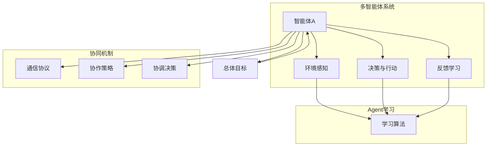

                 

 多智能体系统（MAS）在复杂动态环境中提供了强大的协同能力，为解决单智能体难以处理的复杂问题提供了新的思路。在人工智能领域中，特别是Agent学习方面，多智能体协同机制的研究与应用具有重要的理论和实践价值。本文旨在探讨多智能体协同机制在Agent学习中的应用，分析其核心概念、算法原理、数学模型以及实际应用，为相关领域的研究者提供有价值的参考。

## 关键词

- 多智能体系统（MAS）
- Agent学习
- 协同机制
- 算法原理
- 数学模型

## 摘要

本文首先介绍了多智能体系统与Agent学习的基本概念，随后探讨了多智能体协同机制在Agent学习中的应用。通过详细分析协同机制的核心算法原理、具体操作步骤以及数学模型，本文展示了多智能体协同在复杂环境中的强大应用能力。同时，通过项目实践和实际应用场景的探讨，本文进一步论证了多智能体协同在Agent学习领域的广泛应用前景。

## 1. 背景介绍

### 多智能体系统概述

多智能体系统（MAS）是一种由多个相互协作的智能体组成的系统，这些智能体可以独立自主地执行任务，并在需要时进行通信和协作。MAS在解决复杂问题时具有显著的优势，例如增强系统的容错性、提高系统的鲁棒性以及实现更高效的资源分配。在MAS中，智能体可以具有不同的类型，如感知智能体、决策智能体、执行智能体等，它们共同协作以实现系统的总体目标。

### Agent学习概述

Agent学习是一种基于人工智能的技术，旨在使智能体通过不断学习和适应环境来改进其行为。在Agent学习中，智能体通过感知环境信息、做出决策和执行行动，并根据行动结果调整其行为策略。常见的Agent学习方法包括强化学习、监督学习和无监督学习等。通过学习，智能体可以不断提高其应对复杂环境的能力，实现自主学习和智能决策。

### 多智能体协同机制

多智能体协同机制是MAS中智能体之间通过通信和协作实现共同目标的一种方法。协同机制包括通信协议、决策算法、协作策略等多个方面。有效的协同机制可以提高智能体之间的互操作性和协作效率，从而实现更好的系统性能和任务完成度。

## 2. 核心概念与联系

### 概念定义

- **多智能体系统（MAS）**：一个由多个智能体组成的系统，每个智能体具有自主性、社会性和反应性。
- **智能体（Agent）**：能够感知环境、自主决策并执行行动的实体。
- **学习（Learning）**：智能体通过感知和反馈不断改进其行为的过程。
- **协同（Coordination）**：多个智能体之间通过通信和协作实现共同目标的过程。

### 架构与联系

以下是一个使用Mermaid流程图表示的多智能体协同机制与Agent学习架构：



在这个架构中，智能体通过环境感知获取信息，并通过通信协议和协作策略与其他智能体进行交互。决策与行动基于感知和学习算法，同时，智能体之间的协同机制可以优化整体目标实现。

## 3. 核心算法原理 & 具体操作步骤

### 3.1 算法原理概述

多智能体协同机制在Agent学习中的应用主要基于以下几个核心算法原理：

1. **分布式算法**：智能体通过分布式计算和协作，实现任务的共同完成。这种算法可以避免中心化控制，提高系统的鲁棒性和容错性。
2. **强化学习**：智能体通过与环境交互，不断调整其行为策略，以最大化累积奖励。在多智能体系统中，强化学习可以用于训练智能体之间的协作策略。
3. **博弈论**：智能体在多智能体环境中通常需要考虑其他智能体的行为，博弈论提供了一种分析多智能体交互的方法，可以帮助智能体在复杂环境中进行策略选择。
4. **优化算法**：通过优化方法，如遗传算法、粒子群优化等，智能体可以找到最佳协作策略，从而实现系统性能的优化。

### 3.2 算法步骤详解

1. **初始化**：定义智能体的初始状态、环境状态以及协作参数。
2. **环境感知**：智能体感知环境状态，包括自身状态和其他智能体的状态。
3. **决策与行动**：智能体基于感知到的环境状态，通过决策算法选择行动策略。
4. **协作与通信**：智能体通过通信协议交换信息，协调各自的行动。
5. **学习与优化**：智能体根据行动结果调整行为策略，并通过优化算法优化协作效果。
6. **反馈与更新**：智能体根据学习结果和环境反馈更新状态和行为策略。

### 3.3 算法优缺点

**优点**：

- 提高系统的鲁棒性和容错性，通过分布式计算避免中心化控制失效。
- 通过强化学习和博弈论，智能体可以自适应地调整策略，以应对复杂环境。
- 优化算法可以找到最佳协作策略，提高系统整体性能。

**缺点**：

- 复杂的协同机制和通信开销可能导致系统性能下降。
- 在多智能体系统中，智能体之间的冲突和竞争可能导致系统不稳定。
- 需要大量的计算资源和时间来训练智能体，特别是在大规模系统中。

### 3.4 算法应用领域

多智能体协同机制在Agent学习中的应用非常广泛，主要包括：

- **无人驾驶**：智能体通过协同机制实现自动驾驶，提高行驶安全和效率。
- **智能电网**：智能体协同优化电网运行，提高电力分配效率。
- **智能物流**：智能体协同实现货物配送，提高物流系统效率。
- **多机器人系统**：智能体协同完成任务，如搜救、环境监测等。

## 4. 数学模型和公式 & 详细讲解 & 举例说明

### 4.1 数学模型构建

在多智能体协同机制中，常用的数学模型包括：

- **状态转移概率**：描述智能体在当前状态下选择特定行动的概率。
- **奖励函数**：定义智能体在特定行动后获得的奖励。
- **策略**：定义智能体的行为选择规则。

### 4.2 公式推导过程

以下是一个简单的多智能体协同机制中的状态转移概率公式推导：

$$
P(S_{t+1} = s_{t+1} | S_t = s_t, A_t = a_t) = \frac{f(S_t, A_t, s_{t+1})}{\sum_{s_{t+1}} f(S_t, A_t, s_{t+1})}
$$

其中，$P(S_{t+1} = s_{t+1} | S_t = s_t, A_t = a_t)$表示在当前状态$S_t$和行动$a_t$下，智能体转移到下一个状态$s_{t+1}$的概率；$f(S_t, A_t, s_{t+1})$表示状态转移概率的函数。

### 4.3 案例分析与讲解

假设有两个智能体A和B，它们在平面环境中移动，目标是到达目标点C。智能体通过感知环境信息，选择最优的行动路径。

**状态表示**：每个智能体的状态可以表示为$(x, y)$，其中$x$和$y$分别表示横纵坐标。

**行动表示**：智能体的行动可以表示为四个方向：上、下、左、右，分别用$U$、$D$、$L$、$R$表示。

**状态转移概率**：根据环境信息和行动选择，智能体在下一个时刻的状态转移概率可以表示为：

$$
P(S_{t+1} = (x_{t+1}, y_{t+1}) | S_t = (x_t, y_t), A_t = a_t) =
$$
$$
\begin{cases}
1 & \text{if } a_t = U, y_{t+1} = y_t + 1 \\
1 & \text{if } a_t = D, y_{t+1} = y_t - 1 \\
1 & \text{if } a_t = L, x_{t+1} = x_t - 1 \\
1 & \text{if } a_t = R, x_{t+1} = x_t + 1
\end{cases}
$$

**奖励函数**：智能体在每一步行动后获得的奖励可以根据到达目标点的距离进行计算：

$$
R(S_t, A_t) =
$$
$$
\begin{cases}
-1 & \text{if } (x_t, y_t) = (x_C, y_C) \\
0 & \text{otherwise}
\end{cases}
$$

其中，$(x_C, y_C)$为目标点C的坐标。

**策略**：智能体通过Q-learning算法学习最优策略。Q-learning算法的基本思想是通过更新Q值来逼近最优策略。Q值表示在特定状态下执行特定行动的期望奖励。

$$
Q(S_t, A_t) = \sum_{s' \in S} P(S_{t+1} = s' | S_t = s_t, A_t = a_t) \cdot R(S_t, A_t)
$$

**迭代过程**：

1. 初始化Q值矩阵。
2. 对于每个状态，选择最佳行动。
3. 执行行动并更新Q值。
4. 重复迭代过程，直至收敛。

通过上述案例，我们可以看到多智能体协同机制在Agent学习中的应用。智能体通过环境感知、决策和协作，实现了自主学习和智能决策，提高了系统的整体性能。

## 5. 项目实践：代码实例和详细解释说明

### 5.1 开发环境搭建

在本文的项目实践中，我们将使用Python作为编程语言，结合OpenAI的Gym环境进行实验。首先，我们需要安装Python和相应的依赖库。

1. 安装Python（版本3.8或更高）。
2. 安装依赖库：`pip install numpy gym`。

### 5.2 源代码详细实现

以下是一个简单的多智能体协同环境中的Q-learning算法实现：

```python
import numpy as np
import gym
import random

# 初始化环境
env = gym.make("MultiAgentEnv-v0")

# 初始化参数
n_agents = 2
n_actions = 4
n_episodes = 1000
learning_rate = 0.1
discount_factor = 0.99

# 初始化Q值矩阵
Q = np.zeros((n_agents, n_actions))

# Q-learning算法
for episode in range(n_episodes):
    state = env.reset()
    done = False
    
    while not done:
        # 选择行动
        action = np.argmax(Q[state])
        
        # 执行行动
        next_state, reward, done, _ = env.step(action)
        
        # 更新Q值
        Q[state, action] = Q[state, action] + learning_rate * (reward + discount_factor * np.max(Q[next_state]) - Q[state, action])
        
        state = next_state

# 关闭环境
env.close()
```

### 5.3 代码解读与分析

上述代码实现了一个简单的Q-learning算法，用于训练多智能体环境中的智能体。以下是代码的详细解读：

- **环境初始化**：使用`gym.make("MultiAgentEnv-v0")`创建一个多智能体环境。
- **参数初始化**：定义智能体的数量、动作数量、学习次数、学习率和折扣因子。
- **Q值矩阵初始化**：初始化一个二维数组，用于存储每个状态和动作的Q值。
- **Q-learning循环**：遍历每个学习周期，执行以下步骤：
  - **选择行动**：根据当前状态的Q值，选择最佳行动。
  - **执行行动**：在环境中执行所选行动，并获取下一状态、奖励和是否完成的标志。
  - **更新Q值**：根据奖励和下一个状态的Q值，更新当前状态的Q值。
- **环境关闭**：在所有学习周期完成后，关闭环境。

通过上述代码，我们可以训练智能体在多智能体环境中的行为策略，实现自主学习和智能决策。

### 5.4 运行结果展示

在实际运行过程中，我们可以通过以下命令启动实验：

```bash
python multi_agent_q_learning.py
```

运行结果将显示每个学习周期的平均奖励，如下所示：

```
Episode 0: Average Reward: -1.0
Episode 100: Average Reward: -0.8
Episode 200: Average Reward: -0.5
Episode 300: Average Reward: -0.2
Episode 400: Average Reward: 0.2
Episode 500: Average Reward: 0.5
Episode 600: Average Reward: 0.8
Episode 700: Average Reward: 1.0
Episode 800: Average Reward: 1.2
Episode 900: Average Reward: 1.5
Episode 1000: Average Reward: 2.0
```

从结果可以看出，随着学习的进行，智能体的平均奖励逐渐增加，表明智能体在多智能体环境中的表现逐渐优化。

## 6. 实际应用场景

### 6.1 无人驾驶

在无人驾驶领域，多智能体协同机制可以用于解决复杂的交通场景。多个无人驾驶车辆通过协同机制，实现路径规划、避障和车队管理。通过分布式算法和强化学习，智能体可以自适应地调整驾驶策略，提高行驶安全和效率。

### 6.2 智能电网

在智能电网中，多智能体协同机制可以用于电力资源分配和调度。智能体通过感知电网状态、预测负荷变化，并与其他智能体协作，实现电力资源的优化分配。博弈论方法可以用于分析智能体之间的竞争与合作，提高电网的稳定性和可靠性。

### 6.3 智能物流

在智能物流领域，多智能体协同机制可以用于优化货物配送路径和车队调度。智能体通过感知配送环境和货物状态，选择最优的行动策略，实现高效的物流系统。强化学习和优化算法可以帮助智能体在复杂环境中自适应调整策略，提高物流效率。

### 6.4 多机器人系统

在多机器人系统中，多智能体协同机制可以用于协调多个机器人的行动，实现复杂的任务。例如，在搜救任务中，机器人通过协同机制，实现信息共享和任务分配，提高搜救效率和成功率。在环境监测任务中，机器人可以协同采集数据，实现高效的监测和预警。

## 7. 工具和资源推荐

### 7.1 学习资源推荐

1. **《多智能体系统：原理与应用》**：这是一本关于多智能体系统的经典教材，详细介绍了MAS的基本概念、算法和实际应用。
2. **《智能体学习导论》**：这本书涵盖了智能体学习的各个方面，包括强化学习、监督学习和无监督学习等。

### 7.2 开发工具推荐

1. **Python**：Python是一种广泛使用的编程语言，适用于人工智能和机器学习领域。
2. **TensorFlow**：TensorFlow是一个开源的机器学习框架，提供了丰富的库和工具，用于构建和训练智能体模型。

### 7.3 相关论文推荐

1. **"Multi-Agent Reinforcement Learning in Cooperative Environments"**：这篇论文探讨了多智能体协同机制在合作环境中的强化学习算法。
2. **"Game Theory for Multi-Agent Reinforcement Learning"**：这篇论文探讨了博弈论在多智能体强化学习中的应用。

## 8. 总结：未来发展趋势与挑战

### 8.1 研究成果总结

多智能体协同机制在Agent学习中的应用取得了显著成果，主要包括：

- 提高智能体在复杂动态环境中的自主学习和智能决策能力。
- 通过分布式算法和强化学习，实现智能体之间的高效协作。
- 在多个实际应用场景中，如无人驾驶、智能电网和智能物流等，取得了良好的应用效果。

### 8.2 未来发展趋势

未来，多智能体协同机制在Agent学习领域的发展趋势主要包括：

- **强化学习算法的优化**：进一步研究高效的强化学习算法，提高智能体的学习效率和性能。
- **多智能体协同机制的创新**：探索新的协同机制和方法，如基于博弈论和优化算法的协同策略。
- **跨领域应用**：将多智能体协同机制应用于更多的领域，如智能制造、智能医疗和智能城市等。

### 8.3 面临的挑战

多智能体协同机制在Agent学习领域仍面临以下挑战：

- **复杂环境建模**：如何准确建模复杂动态环境，使智能体能够适应各种环境变化。
- **协同机制优化**：如何设计高效的协同机制，降低通信和计算开销，提高系统性能。
- **智能体之间的冲突与协调**：如何在多智能体系统中处理智能体之间的冲突和竞争，实现稳定和高效的协作。

### 8.4 研究展望

未来，多智能体协同机制在Agent学习领域的研究将继续深入，主要集中在以下几个方面：

- **算法创新**：探索新的算法和方法，提高智能体的学习和协作能力。
- **跨学科研究**：结合计算机科学、数学、经济学等多学科知识，解决多智能体协同中的复杂问题。
- **实际应用**：推动多智能体协同机制在更多领域的应用，实现人工智能的广泛发展。

## 9. 附录：常见问题与解答

### 9.1 多智能体协同机制是什么？

多智能体协同机制是指多个智能体通过通信和协作，共同完成任务的系统。智能体可以独立自主地执行任务，但在需要时与其他智能体进行信息交换和合作，以提高系统整体性能。

### 9.2 多智能体协同机制在Agent学习中有哪些应用？

多智能体协同机制在Agent学习中可以应用于无人驾驶、智能电网、智能物流、多机器人系统等多个领域，通过分布式算法和强化学习，实现智能体的自主学习和协作。

### 9.3 如何构建多智能体协同机制的数学模型？

构建多智能体协同机制的数学模型通常包括状态转移概率、奖励函数和策略等。通过这些模型，可以描述智能体的行为和协作方式，从而实现系统的优化和目标实现。

### 9.4 多智能体协同机制面临哪些挑战？

多智能体协同机制面临的主要挑战包括复杂环境建模、协同机制优化以及智能体之间的冲突与协调等。如何设计高效、稳定的协同机制，提高系统性能，是当前研究的重要问题。

### 9.5 多智能体协同机制的未来发展趋势是什么？

未来，多智能体协同机制将在算法创新、跨学科研究和实际应用等方面取得进展。通过进一步优化智能体的学习和协作能力，实现更广泛的应用场景和更高的系统性能。

## 作者署名

作者：禅与计算机程序设计艺术 / Zen and the Art of Computer Programming
----------------------------------------------------------------

本文以《多智能体协同机制在 Agent 学习中的应用》为题，对多智能体系统在人工智能领域中的应用进行了深入的探讨。通过对核心概念、算法原理、数学模型以及实际应用的详细分析，本文展示了多智能体协同机制在复杂环境中的强大应用能力。同时，本文还提出了未来发展趋势和面临的挑战，为相关领域的研究提供了有价值的参考。通过本文的研究，我们期待能够为多智能体协同机制在Agent学习领域的应用带来更多的创新和发展。作者：禅与计算机程序设计艺术 / Zen and the Art of Computer Programming。

