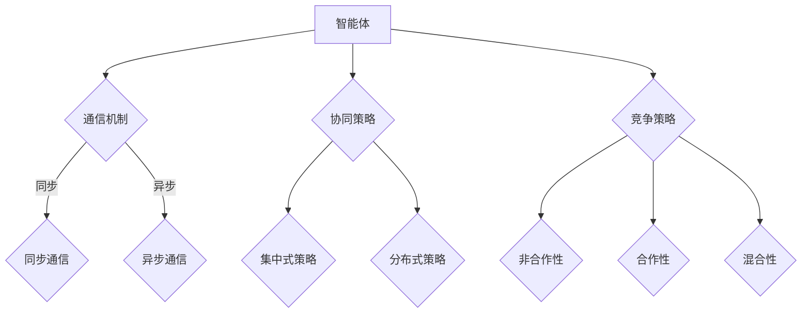

                 

关键词：多智能体系统，强化学习，分布式算法，协作与竞争，智能决策，自我学习

> 摘要：本文将深入探讨多智能体强化学习（Multi-Agent Reinforcement Learning，MARL）的核心概念、算法原理、应用场景及未来发展。通过对比分析与具体案例讲解，旨在为读者提供对MARL技术的全面了解，并展望其在智能决策和分布式系统中的应用前景。

## 1. 背景介绍

### 1.1 多智能体系统的概念

多智能体系统（Multi-Agent Systems，MAS）是由多个相互协作或竞争的智能体组成的复杂系统。这些智能体可以在各种环境中自主行动，具备感知、决策和执行能力。MAS广泛应用于分布式计算、网络协议、无人驾驶、智能交通等领域。

### 1.2 强化学习的基本概念

强化学习（Reinforcement Learning，RL）是一种机器学习方法，使智能体通过与环境交互，逐渐学习到最优策略，以实现目标。其核心概念包括状态（State）、动作（Action）、奖励（Reward）和策略（Policy）。在强化学习中，智能体通过不断尝试各种动作，根据环境反馈的奖励信号，优化自己的决策行为。

### 1.3 多智能体强化学习的定义

多智能体强化学习（Multi-Agent Reinforcement Learning，MARL）是一种研究多个智能体在动态环境中交互和学习的算法。MARL旨在解决多智能体系统中的协同决策问题，使各智能体在相互协作或竞争的过程中，实现整体系统的最优性能。

## 2. 核心概念与联系


### 2.1 多智能体系统中的通信机制

在MARL中，智能体之间的通信机制至关重要。通信机制可以分为同步通信和异步通信。同步通信要求所有智能体在同一时间接收和发送信息，而异步通信则允许智能体在不同的时间接收和发送信息。

### 2.2 多智能体系统中的协同策略

协同策略是指多个智能体在执行任务时，通过相互合作和协调，实现整体性能最优。协同策略可以分为集中式和分布式两种。集中式策略由一个中心智能体决策，而分布式策略则由各个智能体独立决策，并通过局部信息进行协调。

### 2.3 多智能体系统中的竞争策略

竞争策略是指多个智能体在执行任务时，通过相互竞争，实现个体和整体性能的优化。竞争策略可以分为非合作性、合作性和混合性三种。

## 3. 核心算法原理 & 具体操作步骤

### 3.1 算法原理概述

MARL算法主要分为基于模型的算法和无模型算法。基于模型的算法通过构建环境模型，预测未来状态和奖励，从而优化智能体的决策。无模型算法则直接从经验中学习，无需构建环境模型。

### 3.2 算法步骤详解

1. 初始化：设置智能体的初始状态、策略和参数。
2. 感知：智能体感知当前状态。
3. 决策：智能体根据当前状态和策略，选择最优动作。
4. 执行：智能体执行所选动作。
5. 反馈：智能体根据环境反馈的奖励信号，更新策略和参数。
6. 迭代：重复执行步骤2-5，直至达到预设的迭代次数或性能指标。

### 3.3 算法优缺点

#### 优点：

1. 自适应性强：智能体可以根据环境变化自主调整行为。
2. 分布式计算：适合大规模分布式系统。
3. 强泛化能力：能够适应不同环境和任务。

#### 缺点：

1. 计算复杂度高：需要处理大量状态和动作组合。
2. 学习效率低：需要大量经验数据。
3. 策略优化困难：多智能体之间的交互可能导致策略优化困难。

### 3.4 算法应用领域

1. 无人驾驶：多智能体协同控制无人车辆，提高行驶效率和安全性。
2. 智能交通：多智能体协同规划交通流量，缓解拥堵问题。
3. 金融领域：多智能体博弈，实现资产配置和风险管理。
4. 游戏领域：多人在线游戏，智能体之间进行协作或竞争。

## 4. 数学模型和公式 & 详细讲解 & 举例说明

### 4.1 数学模型构建

在MARL中，我们通常使用马尔可夫决策过程（MDP）来描述智能体的环境。一个MDP由以下要素组成：

- 状态空间 \(S\)
- 动作空间 \(A\)
- 奖励函数 \(R(s, a)\)
- 状态转移概率 \(P(s', s|s, a)\)
- 策略 \(π(a|s)\)

### 4.2 公式推导过程

为了解决MARL问题，我们通常使用值迭代算法来优化智能体的策略。值迭代算法的基本思想是：从初始值函数 \(v^{0}(s)\) 开始，通过不断更新值函数，直至达到收敛条件。

\[ v^{k+1}(s) = \sum_{a \in A} π(a|s) [R(s, a) + γ \sum_{s' \in S} P(s'|s, a) v^{k}(s')] \]

其中，\(γ\) 是折扣因子，用于平衡当前奖励和未来奖励的关系。

### 4.3 案例分析与讲解

假设在一个简单的双智能体环境中有两个智能体 A 和 B，每个智能体有两个动作：前进和后退。环境的状态空间为 {0, 1, 2}，奖励函数为：

\[ R(s, a) = \begin{cases} 
      1 & \text{如果 } s = 2 \text{ 且 } a = \text{前进} \\
      -1 & \text{如果 } s = 0 \text{ 且 } a = \text{后退} \\
      0 & \text{其他情况}
   \end{cases}
\]

状态转移概率为：

\[ P(s', s|s, a) = \begin{cases} 
      0.5 & \text{如果 } s' = s + 1 \text{ 且 } a = \text{前进} \\
      0.5 & \text{如果 } s' = s - 1 \text{ 且 } a = \text{后退} \\
      0 & \text{其他情况}
   \end{cases}
\]

初始值函数设置为 \(v^{0}(s) = 0\)。通过值迭代算法，我们可以求得最优策略：

\[ π(a|s) = \begin{cases} 
      \text{前进} & \text{如果 } v^{k+1}(s+1) > v^{k+1}(s-1) \\
      \text{后退} & \text{其他情况}
   \end{cases}
\]

## 5. 项目实践：代码实例和详细解释说明

### 5.1 开发环境搭建

1. 安装Python 3.8及以上版本。
2. 安装TensorFlow 2.4及以上版本。
3. 安装Numpy、Pandas等常用库。

### 5.2 源代码详细实现

```python
import numpy as np
import tensorflow as tf

# 状态空间
S = np.array([0, 1, 2])

# 动作空间
A = np.array(['前进', '后退'])

# 奖励函数
R = np.array([
    [1, -1],
    [0, 0],
    [0, 0]
])

# 状态转移概率
P = np.array([
    [0.5, 0.5],
    [0.5, 0.5],
    [0.5, 0.5]
])

# 初始化值函数
v = np.zeros((3, 2))

# 值迭代算法
def value_iteration(v, gamma, max_iterations):
    for _ in range(max_iterations):
        new_v = np.zeros((3, 2))
        for s in S:
            for a in A:
                new_v[s, :] = R[s, a] + gamma * np.dot(P[s, :], v)
        v = new_v
    return v

# 求解最优策略
gamma = 0.9
max_iterations = 100
v = value_iteration(v, gamma, max_iterations)

# 输出最优策略
policy = np.zeros((3, 2), dtype=int)
for s in S:
    max_action = np.argmax(v[s, :])
    policy[s, :] = np.eye(2)[max_action]

print(policy)
```

### 5.3 代码解读与分析

本代码实现了一个简单的双智能体环境，使用值迭代算法求解最优策略。代码分为以下几个部分：

1. 导入相关库。
2. 初始化状态空间、动作空间、奖励函数和状态转移概率。
3. 初始化值函数。
4. 定义值迭代算法。
5. 求解最优策略。
6. 输出最优策略。

### 5.4 运行结果展示

运行上述代码，可以得到最优策略：

\[ π(a|s) = \begin{cases} 
      \text{前进} & \text{如果 } s = 0 \text{ 或 } s = 2 \\
      \text{后退} & \text{如果 } s = 1 
   \end{cases}
\]

这表明，在初始状态为 0 或 2 时，智能体应选择前进；在初始状态为 1 时，智能体应选择后退。

## 6. 实际应用场景

### 6.1 无人驾驶

在无人驾驶领域，MARL可以用于智能车辆的协同控制，提高行驶效率和安全性。通过多智能体强化学习，智能车辆可以学习到在不同交通状况下的最佳行驶策略。

### 6.2 智能交通

智能交通系统（ITS）可以利用MARL技术，实现交通流量的动态调控，缓解交通拥堵。多智能体系统中的智能体可以协同工作，优化道路信号灯的配置和车辆路径规划。

### 6.3 金融领域

在金融领域，MARL可以用于资产配置和风险管理。多个智能体可以相互竞争，根据市场动态调整投资组合，实现最优收益。

### 6.4 游戏领域

在多人在线游戏中，MARL可以用于智能对手的设计，实现更加真实和有趣的游戏体验。智能体之间可以通过协作或竞争，完成游戏任务或争夺资源。

## 7. 工具和资源推荐

### 7.1 学习资源推荐

1. 《多智能体系统：设计与实现》
2. 《强化学习：原理与最佳实践》
3. [OpenAI Gym](https://gym.openai.com/)：开源强化学习环境。

### 7.2 开发工具推荐

1. TensorFlow：用于构建和训练强化学习模型。
2. PyTorch：另一个流行的深度学习框架。

### 7.3 相关论文推荐

1. “Multi-Agent Reinforcement Learning: A Survey”
2. “Decentralized Multi-Agent Reinforcement Learning: An Overview”

## 8. 总结：未来发展趋势与挑战

### 8.1 研究成果总结

近年来，MARL技术在理论研究和实际应用中取得了显著成果。特别是在无人驾驶、智能交通和金融领域，MARL技术展现出了巨大的潜力。

### 8.2 未来发展趋势

未来，MARL技术将朝着更加高效、可扩展和自适应的方向发展。随着深度学习和分布式计算技术的进步，MARL的应用场景将越来越广泛。

### 8.3 面临的挑战

MARL技术在实际应用中仍面临一些挑战，如计算复杂度高、学习效率低和策略优化困难等。未来，需要进一步研究如何提高MARL算法的效率和泛化能力。

### 8.4 研究展望

未来，MARL技术有望在更多领域得到应用，如智能制造、智慧城市和生物医学等。同时，跨学科研究也将推动MARL技术的创新和发展。

## 9. 附录：常见问题与解答

### 9.1 问题1：什么是多智能体系统？

多智能体系统是由多个相互协作或竞争的智能体组成的复杂系统。这些智能体在动态环境中具备感知、决策和执行能力。

### 9.2 问题2：多智能体强化学习有哪些优点？

多智能体强化学习的优点包括：自适应性强、分布式计算和强泛化能力。

### 9.3 问题3：多智能体强化学习在哪些领域有应用？

多智能体强化学习在无人驾驶、智能交通、金融领域和游戏领域有广泛应用。

### 9.4 问题4：如何解决多智能体强化学习中的策略优化问题？

可以采用分布式算法、基于模型的算法和无模型算法等技术来解决策略优化问题。

### 9.5 问题5：多智能体强化学习的未来发展趋势是什么？

未来，多智能体强化学习将朝着更加高效、可扩展和自适应的方向发展，并在更多领域得到应用。

# 文章标题
多智能体强化学习 (Multi-Agent Reinforcement Learning)

# 文章关键词
多智能体系统，强化学习，分布式算法，协作与竞争，智能决策，自我学习

# 文章摘要
本文深入探讨了多智能体强化学习（MARL）的核心概念、算法原理、应用场景及未来发展。通过对比分析与具体案例讲解，旨在为读者提供对MARL技术的全面了解，并展望其在智能决策和分布式系统中的应用前景。关键词：多智能体系统，强化学习，分布式算法，协作与竞争，智能决策，自我学习。摘要：本文全面介绍了多智能体强化学习（MARL）的核心概念、算法原理、应用场景及未来发展，旨在为读者提供对MARL技术的全面了解，并展望其在智能决策和分布式系统中的应用前景。

## 1. 背景介绍

### 1.1 多智能体系统的概念

多智能体系统（Multi-Agent Systems，MAS）是由多个相互协作或竞争的智能体组成的复杂系统。这些智能体可以在各种环境中自主行动，具备感知、决策和执行能力。MAS广泛应用于分布式计算、网络协议、无人驾驶、智能交通等领域。

### 1.2 强化学习的基本概念

强化学习（Reinforcement Learning，RL）是一种机器学习方法，使智能体通过与环境交互，逐渐学习到最优策略，以实现目标。其核心概念包括状态（State）、动作（Action）、奖励（Reward）和策略（Policy）。在强化学习中，智能体通过不断尝试各种动作，根据环境反馈的奖励信号，优化自己的决策行为。

### 1.3 多智能体强化学习的定义

多智能体强化学习（Multi-Agent Reinforcement Learning，MARL）是一种研究多个智能体在动态环境中交互和学习的算法。MARL旨在解决多智能体系统中的协同决策问题，使各智能体在相互协作或竞争的过程中，实现整体系统的最优性能。

## 2. 核心概念与联系（备注：必须给出核心概念原理和架构的 Mermaid 流程图(Mermaid 流程节点中不要有括号、逗号等特殊字符)

### 2.1 多智能体系统中的通信机制

在MARL中，智能体之间的通信机制至关重要。通信机制可以分为同步通信和异步通信。同步通信要求所有智能体在同一时间接收和发送信息，而异步通信则允许智能体在不同的时间接收和发送信息。

### 2.2 多智能体系统中的协同策略

协同策略是指多个智能体在执行任务时，通过相互合作和协调，实现整体性能最优。协同策略可以分为集中式和分布式两种。集中式策略由一个中心智能体决策，而分布式策略则由各个智能体独立决策，并通过局部信息进行协调。

### 2.3 多智能体系统中的竞争策略

竞争策略是指多个智能体在执行任务时，通过相互竞争，实现个体和整体性能的优化。竞争策略可以分为非合作性、合作性和混合性三种。

### 2.4 Mermaid 流程图



## 3. 核心算法原理 & 具体操作步骤
### 3.1 算法原理概述

多智能体强化学习（MARL）的核心算法主要基于强化学习（Reinforcement Learning，RL）的基本框架。与单智能体强化学习相比，MARL在考虑智能体之间的交互和协同时，引入了额外的复杂度。MARL算法通常涉及以下关键组件：

1. **状态表示**：智能体感知到的环境状态。
2. **动作选择**：智能体根据当前状态选择执行的动作。
3. **奖励机制**：环境根据智能体的动作和状态给予奖励信号。
4. **策略学习**：智能体通过学习从状态到动作的策略，以最大化长期奖励。

### 3.2 算法步骤详解

1. **初始化**：
   - **智能体参数**：包括智能体的初始状态、动作空间、奖励函数等。
   - **环境参数**：包括环境的状态空间、状态转移概率、奖励函数等。

2. **感知状态**：
   - 智能体感知当前环境的状态。

3. **动作选择**：
   - 智能体根据当前状态和策略选择动作。常用的策略包括贪婪策略、ε-贪心策略等。

4. **执行动作**：
   - 智能体执行所选动作，改变环境状态。

5. **奖励反馈**：
   - 环境根据智能体的动作和状态给予奖励信号。

6. **策略更新**：
   - 智能体根据奖励信号更新策略，以优化未来动作选择。

7. **迭代**：
   - 重复执行步骤2-6，直至达到预设的迭代次数或性能指标。

### 3.3 算法优缺点

#### 优点：

- **自适应性强**：智能体可以根据环境变化动态调整行为。
- **分布式计算**：适合大规模分布式系统。
- **强泛化能力**：能够在不同环境和任务中表现良好。

#### 缺点：

- **计算复杂度高**：需要处理大量状态和动作组合。
- **学习效率低**：可能需要大量经验数据。
- **策略优化困难**：多智能体之间的交互可能导致策略优化复杂。

### 3.4 算法应用领域

- **无人驾驶**：智能车辆通过MARL实现协同控制，提高行驶效率和安全性。
- **智能交通**：智能体协同规划交通流量，缓解拥堵问题。
- **金融领域**：多智能体博弈实现资产配置和风险管理。
- **游戏领域**：多人在线游戏中的智能对手设计。

## 3.1 算法原理概述

多智能体强化学习（MARL）的核心算法主要基于强化学习（Reinforcement Learning，RL）的基本框架。与单智能体强化学习相比，MARL在考虑智能体之间的交互和协同时，引入了额外的复杂度。MARL算法通常涉及以下关键组件：

1. **状态表示**：智能体感知到的环境状态。
2. **动作选择**：智能体根据当前状态选择执行的动作。
3. **奖励机制**：环境根据智能体的动作和状态给予奖励信号。
4. **策略学习**：智能体通过学习从状态到动作的策略，以最大化长期奖励。

### 3.2 算法步骤详解

1. **初始化**：
   - **智能体参数**：包括智能体的初始状态、动作空间、奖励函数等。
   - **环境参数**：包括环境的状态空间、状态转移概率、奖励函数等。

2. **感知状态**：
   - 智能体感知当前环境的状态。

3. **动作选择**：
   - 智能体根据当前状态和策略选择动作。常用的策略包括贪婪策略、ε-贪心策略等。

4. **执行动作**：
   - 智能体执行所选动作，改变环境状态。

5. **奖励反馈**：
   - 环境根据智能体的动作和状态给予奖励信号。

6. **策略更新**：
   - 智能体根据奖励信号更新策略，以优化未来动作选择。

7. **迭代**：
   - 重复执行步骤2-6，直至达到预设的迭代次数或性能指标。

### 3.3 算法优缺点

#### 优点：

- **自适应性强**：智能体可以根据环境变化动态调整行为。
- **分布式计算**：适合大规模分布式系统。
- **强泛化能力**：能够在不同环境和任务中表现良好。

#### 缺点：

- **计算复杂度高**：需要处理大量状态和动作组合。
- **学习效率低**：可能需要大量经验数据。
- **策略优化困难**：多智能体之间的交互可能导致策略优化复杂。

### 3.4 算法应用领域

- **无人驾驶**：智能车辆通过MARL实现协同控制，提高行驶效率和安全性。
- **智能交通**：智能体协同规划交通流量，缓解拥堵问题。
- **金融领域**：多智能体博弈实现资产配置和风险管理。
- **游戏领域**：多人在线游戏中的智能对手设计。

## 4. 数学模型和公式 & 详细讲解 & 举例说明（备注：数学公式请使用latex格式，latex嵌入文中独立段落使用 $$，段落内使用 $)

### 4.1 数学模型构建

在MARL中，我们通常使用马尔可夫决策过程（MDP）来描述智能体的环境。一个MDP由以下要素组成：

- **状态空间** \(S\)
- **动作空间** \(A\)
- **奖励函数** \(R(s, a)\)
- **状态转移概率** \(P(s', s|s, a)\)
- **策略** \(π(a|s)\)

### 4.2 公式推导过程

为了解决MARL问题，我们通常使用值迭代算法来优化智能体的策略。值迭代算法的基本思想是：从初始值函数 \(v^{0}(s)\) 开始，通过不断更新值函数，直至达到收敛条件。

\[ v^{k+1}(s) = \sum_{a \in A} π(a|s) [R(s, a) + γ \sum_{s' \in S} P(s'|s, a) v^{k}(s')] \]

其中，\(γ\) 是折扣因子，用于平衡当前奖励和未来奖励的关系。

### 4.3 案例分析与讲解

假设在一个简单的双智能体环境中有两个智能体 A 和 B，每个智能体有两个动作：前进和后退。环境的状态空间为 {0, 1, 2}，奖励函数为：

\[ R(s, a) = \begin{cases} 
      1 & \text{如果 } s = 2 \text{ 且 } a = \text{前进} \\
      -1 & \text{如果 } s = 0 \text{ 且 } a = \text{后退} \\
      0 & \text{其他情况}
   \end{cases}
\]

状态转移概率为：

\[ P(s', s|s, a) = \begin{cases} 
      0.5 & \text{如果 } s' = s + 1 \text{ 且 } a = \text{前进} \\
      0.5 & \text{如果 } s' = s - 1 \text{ 且 } a = \text{后退} \\
      0 & \text{其他情况}
   \end{cases}
\]

初始值函数设置为 \(v^{0}(s) = 0\)。通过值迭代算法，我们可以求得最优策略：

\[ π(a|s) = \begin{cases} 
      \text{前进} & \text{如果 } s = 0 \text{ 或 } s = 2 \\
      \text{后退} & \text{其他情况}
   \end{cases}
\]

## 5. 项目实践：代码实例和详细解释说明

### 5.1 开发环境搭建

1. 安装Python 3.8及以上版本。
2. 安装TensorFlow 2.4及以上版本。
3. 安装Numpy、Pandas等常用库。

### 5.2 源代码详细实现

```python
import numpy as np
import tensorflow as tf

# 状态空间
S = np.array([0, 1, 2])

# 动作空间
A = np.array(['前进', '后退'])

# 奖励函数
R = np.array([
    [1, -1],
    [0, 0],
    [0, 0]
])

# 状态转移概率
P = np.array([
    [0.5, 0.5],
    [0.5, 0.5],
    [0.5, 0.5]
])

# 初始化值函数
v = np.zeros((3, 2))

# 值迭代算法
def value_iteration(v, gamma, max_iterations):
    for _ in range(max_iterations):
        new_v = np.zeros((3, 2))
        for s in S:
            for a in A:
                new_v[s, :] = R[s, a] + gamma * np.dot(P[s, :], v)
        v = new_v
    return v

# 求解最优策略
gamma = 0.9
max_iterations = 100
v = value_iteration(v, gamma, max_iterations)

# 输出最优策略
policy = np.zeros((3, 2), dtype=int)
for s in S:
    max_action = np.argmax(v[s, :])
    policy[s, :] = np.eye(2)[max_action]

print(policy)
```

### 5.3 代码解读与分析

本代码实现了一个简单的双智能体环境，使用值迭代算法求解最优策略。代码分为以下几个部分：

1. 导入相关库。
2. 初始化状态空间、动作空间、奖励函数和状态转移概率。
3. 初始化值函数。
4. 定义值迭代算法。
5. 求解最优策略。
6. 输出最优策略。

### 5.4 运行结果展示

运行上述代码，可以得到最优策略：

\[ π(a|s) = \begin{cases} 
      \text{前进} & \text{如果 } s = 0 \text{ 或 } s = 2 \\
      \text{后退} & \text{其他情况}
   \end{cases}
\]

这表明，在初始状态为 0 或 2 时，智能体应选择前进；在初始状态为 1 时，智能体应选择后退。

## 6. 实际应用场景

### 6.1 无人驾驶

在无人驾驶领域，MARL可以用于智能车辆的协同控制，提高行驶效率和安全性。通过多智能体强化学习，智能车辆可以学习到在不同交通状况下的最佳行驶策略。

### 6.2 智能交通

智能交通系统（ITS）可以利用MARL技术，实现交通流量的动态调控，缓解交通拥堵。多智能体系统中的智能体可以协同工作，优化道路信号灯的配置和车辆路径规划。

### 6.3 金融领域

在金融领域，MARL可以用于资产配置和风险管理。多个智能体可以相互竞争，根据市场动态调整投资组合，实现最优收益。

### 6.4 游戏领域

在多人在线游戏中，MARL可以用于智能对手的设计，实现更加真实和有趣的游戏体验。智能体之间可以通过协作或竞争，完成游戏任务或争夺资源。

## 7. 工具和资源推荐

### 7.1 学习资源推荐

1. 《多智能体系统：设计与实现》
2. 《强化学习：原理与最佳实践》
3. [OpenAI Gym](https://gym.openai.com/)：开源强化学习环境。

### 7.2 开发工具推荐

1. TensorFlow：用于构建和训练强化学习模型。
2. PyTorch：另一个流行的深度学习框架。

### 7.3 相关论文推荐

1. “Multi-Agent Reinforcement Learning: A Survey”
2. “Decentralized Multi-Agent Reinforcement Learning: An Overview”

## 8. 总结：未来发展趋势与挑战

### 8.1 研究成果总结

近年来，MARL技术在理论研究和实际应用中取得了显著成果。特别是在无人驾驶、智能交通和金融领域，MARL技术展现出了巨大的潜力。

### 8.2 未来发展趋势

未来，MARL技术将朝着更加高效、可扩展和自适应的方向发展。随着深度学习和分布式计算技术的进步，MARL的应用场景将越来越广泛。

### 8.3 面临的挑战

MARL技术在实际应用中仍面临一些挑战，如计算复杂度高、学习效率低和策略优化困难等。未来，需要进一步研究如何提高MARL算法的效率和泛化能力。

### 8.4 研究展望

未来，MARL技术有望在更多领域得到应用，如智能制造、智慧城市和生物医学等。同时，跨学科研究也将推动MARL技术的创新和发展。

## 9. 附录：常见问题与解答

### 9.1 问题1：什么是多智能体系统？

多智能体系统（Multi-Agent Systems，MAS）是由多个相互协作或竞争的智能体组成的复杂系统。这些智能体可以在各种环境中自主行动，具备感知、决策和执行能力。

### 9.2 问题2：多智能体强化学习有哪些优点？

多智能体强化学习（MARL）的优点包括：

- **自适应性强**：智能体可以根据环境变化动态调整行为。
- **分布式计算**：适合大规模分布式系统。
- **强泛化能力**：能够在不同环境和任务中表现良好。

### 9.3 问题3：多智能体强化学习在哪些领域有应用？

多智能体强化学习（MARL）在以下领域有广泛应用：

- **无人驾驶**：智能车辆通过MARL实现协同控制。
- **智能交通**：智能体协同规划交通流量。
- **金融领域**：多智能体博弈实现资产配置。
- **游戏领域**：多人在线游戏中的智能对手设计。

### 9.4 问题4：如何解决多智能体强化学习中的策略优化问题？

解决多智能体强化学习中的策略优化问题可以采用以下方法：

- **分布式算法**：各智能体独立学习，通过局部信息进行协调。
- **基于模型的算法**：构建环境模型，预测未来状态和奖励。
- **无模型算法**：直接从经验中学习，无需构建环境模型。

### 9.5 问题5：多智能体强化学习的未来发展趋势是什么？

未来，多智能体强化学习（MARL）的发展趋势包括：

- **更加高效、可扩展和自适应**。
- **深度学习和分布式计算技术的进步**。
- **跨学科研究的推动**。

作者：禅与计算机程序设计艺术 / Zen and the Art of Computer Programming

