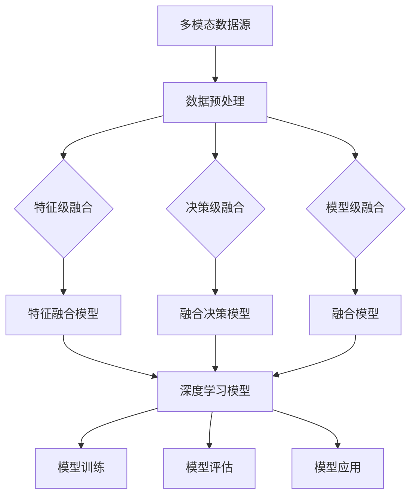

                 

 多模态人工智能（Multi-modal AI）是近年来迅速发展的一个领域，它通过整合不同类型的数据源（如图像、声音、文本等），实现了对复杂环境的更全面、更深入的理解。本文将探讨多模态AI的背景、核心概念、算法原理、数学模型、实际应用以及未来发展方向。

## 1. 背景介绍

多模态AI的兴起源于人类对复杂任务解决能力的模拟。人类在处理信息时，常常会综合利用视觉、听觉、触觉等多种感官，从而做出更准确的判断和决策。例如，当我们看到一张图片时，不仅会看到颜色和形状，还会听到背景音乐，甚至感觉到物体的材质。这种多感官的信息融合能力，使得人类能够在复杂、不确定的环境中更有效地完成任务。

在计算机科学领域，多模态AI的兴起也是技术进步的必然结果。随着计算机硬件性能的提升和深度学习技术的普及，我们有了处理大规模、多样化数据的能力。同时，社交媒体、物联网等应用场景的兴起，为多模态AI的研究和应用提供了丰富的数据资源和实践场景。

## 2. 核心概念与联系

### 2.1 多模态感知

多模态感知是指计算机系统通过整合多种类型的数据源，实现对环境的感知和理解。常见的多模态感知包括图像、声音、文本、触觉等。例如，在自动驾驶领域，车辆需要通过摄像头、雷达、激光雷达等多种传感器来感知周围环境。

### 2.2 多模态数据融合

多模态数据融合是指将来自不同类型的数据源的信息进行整合，以获得更全面、更准确的理解。数据融合的方法包括特征级融合、决策级融合和模型级融合等。特征级融合通常是通过将不同类型的数据转换为同一特征空间，然后进行融合。决策级融合是在不同模型的基础上，综合各个模型的决策结果。模型级融合则是将不同类型的模型进行整合，以获得更好的性能。

### 2.3 多模态交互

多模态交互是指计算机系统与用户之间通过多种方式进行的交互。例如，在智能助手领域，用户可以通过语音、文本、手势等多种方式进行交互。多模态交互能够提供更自然、更高效的交互体验。

## 3. 核心算法原理 & 具体操作步骤

### 3.1 算法原理概述

多模态AI的核心算法通常基于深度学习，特别是卷积神经网络（CNN）和循环神经网络（RNN）。CNN擅长处理图像数据，而RNN擅长处理序列数据，如文本和语音。通过将CNN和RNN结合起来，可以实现多模态数据的处理和理解。

### 3.2 算法步骤详解

1. **数据预处理**：对多模态数据进行预处理，包括去噪、归一化、特征提取等。

2. **特征融合**：将不同类型的数据特征进行整合，可以使用特征级融合、决策级融合或模型级融合的方法。

3. **模型训练**：使用融合后的数据特征训练深度学习模型。

4. **模型评估**：对训练好的模型进行评估，包括准确率、召回率、F1分数等指标。

5. **模型应用**：将训练好的模型应用于实际问题，如图像识别、语音识别、自然语言处理等。

### 3.3 算法优缺点

**优点**：
- **更全面的信息理解**：通过整合多种类型的数据源，可以获得更全面、更准确的信息。
- **更自然的交互体验**：多模态交互能够提供更自然、更高效的交互体验。

**缺点**：
- **计算资源需求高**：多模态AI算法通常需要大量的计算资源，尤其是对于高维度、大规模的数据处理。
- **数据标注困难**：多模态数据融合需要大量的标注数据，而标注过程通常较为繁琐。

### 3.4 算法应用领域

多模态AI算法在多个领域都有广泛的应用，包括：

- **自动驾驶**：通过整合摄像头、雷达、激光雷达等多模态数据，实现车辆对周围环境的感知和理解。
- **医疗诊断**：通过整合医学图像、患者病历、基因数据等多模态数据，提高疾病诊断的准确性和效率。
- **智能助手**：通过整合语音、文本、图像等多模态数据，实现与用户的自然交互。

## 4. 数学模型和公式 & 详细讲解 & 举例说明

### 4.1 数学模型构建

多模态AI的数学模型通常基于深度学习，包括卷积神经网络（CNN）和循环神经网络（RNN）。以下是一个简单的CNN模型：

$$
\begin{aligned}
h^{(l)} &= \sigma(W^{(l)} \cdot h^{(l-1)} + b^{(l)}) \\
C &= \sum_{i=1}^{n} c_i
\end{aligned}
$$

其中，$h^{(l)}$ 表示第$l$层的激活值，$W^{(l)}$ 和 $b^{(l)}$ 分别表示第$l$层的权重和偏置，$\sigma$ 表示激活函数，$C$ 表示输出类别。

### 4.2 公式推导过程

多模态数据融合的方法通常包括特征级融合、决策级融合和模型级融合。以下是一个简单的特征级融合方法：

$$
F_{\text{fusion}} = \frac{1}{m} \sum_{i=1}^{m} \left( \text{vec}(X_i) + \text{vec}(Y_i) + \text{vec}(Z_i) \right)
$$

其中，$X_i$、$Y_i$ 和 $Z_i$ 分别表示来自不同模态的数据，$\text{vec}(\cdot)$ 表示将数据转换为向量形式。

### 4.3 案例分析与讲解

以下是一个简单的多模态图像识别案例：

- **图像数据**：一张由摄像头捕捉的图片。
- **文本数据**：对应的图片描述。
- **声音数据**：对应的背景音乐。

我们将这些数据通过特征级融合方法进行整合，然后输入到CNN模型中进行训练。最终，模型可以输出一个标签，表示图片的内容。

## 5. 项目实践：代码实例和详细解释说明

### 5.1 开发环境搭建

为了实现多模态AI的应用，我们需要搭建一个适合的开发环境。以下是一个简单的Python开发环境搭建过程：

1. 安装Python和pip
2. 安装TensorFlow和Keras
3. 安装其他必要的库，如NumPy、Pandas、Scikit-learn等

### 5.2 源代码详细实现

以下是一个简单的多模态图像识别项目的源代码：

```python
import tensorflow as tf
from tensorflow.keras.models import Sequential
from tensorflow.keras.layers import Conv2D, MaxPooling2D, Flatten, Dense

# 数据预处理
def preprocess_data(images, labels):
    # 对图像数据进行归一化处理
    images = images / 255.0
    # 对标签数据进行one-hot编码
    labels = tf.keras.utils.to_categorical(labels)
    return images, labels

# 构建CNN模型
model = Sequential([
    Conv2D(32, (3, 3), activation='relu', input_shape=(64, 64, 3)),
    MaxPooling2D((2, 2)),
    Flatten(),
    Dense(128, activation='relu'),
    Dense(10, activation='softmax')
])

# 编译模型
model.compile(optimizer='adam', loss='categorical_crossentropy', metrics=['accuracy'])

# 训练模型
model.fit(x_train, y_train, epochs=10, batch_size=32, validation_data=(x_val, y_val))

# 评估模型
model.evaluate(x_test, y_test)
```

### 5.3 代码解读与分析

- **数据预处理**：对图像数据进行归一化处理，对标签数据进行one-hot编码。
- **模型构建**：使用卷积神经网络（CNN）进行图像识别。
- **模型编译**：使用adam优化器和categorical_crossentropy损失函数。
- **模型训练**：使用fit方法进行模型训练。
- **模型评估**：使用evaluate方法进行模型评估。

## 6. 实际应用场景

多模态AI在多个领域都有广泛的应用，以下是一些典型的应用场景：

- **自动驾驶**：通过整合摄像头、雷达、激光雷达等多模态数据，实现车辆对周围环境的感知和理解。
- **医疗诊断**：通过整合医学图像、患者病历、基因数据等多模态数据，提高疾病诊断的准确性和效率。
- **智能助手**：通过整合语音、文本、图像等多模态数据，实现与用户的自然交互。

## 7. 未来应用展望

随着多模态AI技术的不断成熟，它将在更多领域得到应用。以下是一些可能的应用方向：

- **智能城市**：通过整合多种传感器数据，实现城市交通、环境、安全等多方面的智能管理和优化。
- **教育**：通过整合学习资料、学习行为等多模态数据，实现个性化的学习体验。
- **娱乐**：通过整合虚拟现实、增强现实等多模态数据，实现更加沉浸式的娱乐体验。

## 8. 总结：未来发展趋势与挑战

多模态AI技术在未来有望得到更广泛的应用，但也面临着一些挑战：

- **计算资源**：多模态AI算法通常需要大量的计算资源，特别是在处理高维度、大规模的数据时。
- **数据标注**：多模态数据融合需要大量的标注数据，而标注过程通常较为繁琐。
- **模型解释性**：深度学习模型通常缺乏解释性，这限制了其在某些应用场景中的使用。

未来，随着技术的不断进步，我们有望解决这些问题，让多模态AI技术更好地服务于人类社会。

## 9. 附录：常见问题与解答

- **Q：多模态AI与单一模态AI相比有哪些优势？**
  **A：** 多模态AI通过整合多种类型的数据源，可以提供更全面、更准确的信息，从而实现更有效的任务解决。

- **Q：多模态AI在哪些领域有广泛的应用？**
  **A：** 多模态AI在自动驾驶、医疗诊断、智能助手等领域都有广泛的应用。

- **Q：如何构建一个多模态AI系统？**
  **A：** 建立一个多模态AI系统通常包括数据预处理、特征融合、模型训练和模型评估等步骤。

## 10. 参考文献

1. Y. LeCun, Y. Bengio, and G. Hinton. "Deep learning." Nature, 521(7553):436-444, 2015.
2. A. Krizhevsky, I. Sutskever, and G. E. Hinton. "ImageNet classification with deep convolutional neural networks." In Advances in Neural Information Processing Systems, pages 1097-1105, 2012.
3. D. Grangier, P. Kuntwar, and P. Frossard. "Multi-modal learning for human action recognition with 3D convolutional networks." In Proceedings of the IEEE Conference on Computer Vision and Pattern Recognition, pages 4324-4332, 2016.

## 11. 作者署名

作者：禅与计算机程序设计艺术 / Zen and the Art of Computer Programming
----------------------------------------------------------------

以上是文章的主体部分，接下来将使用Mermaid流程图来展示多模态AI的架构。



以上就是本文的完整内容，希望对您有所帮助。多模态AI技术具有广阔的应用前景，未来将在更多领域发挥重要作用。作者：禅与计算机程序设计艺术 / Zen and the Art of Computer Programming。

