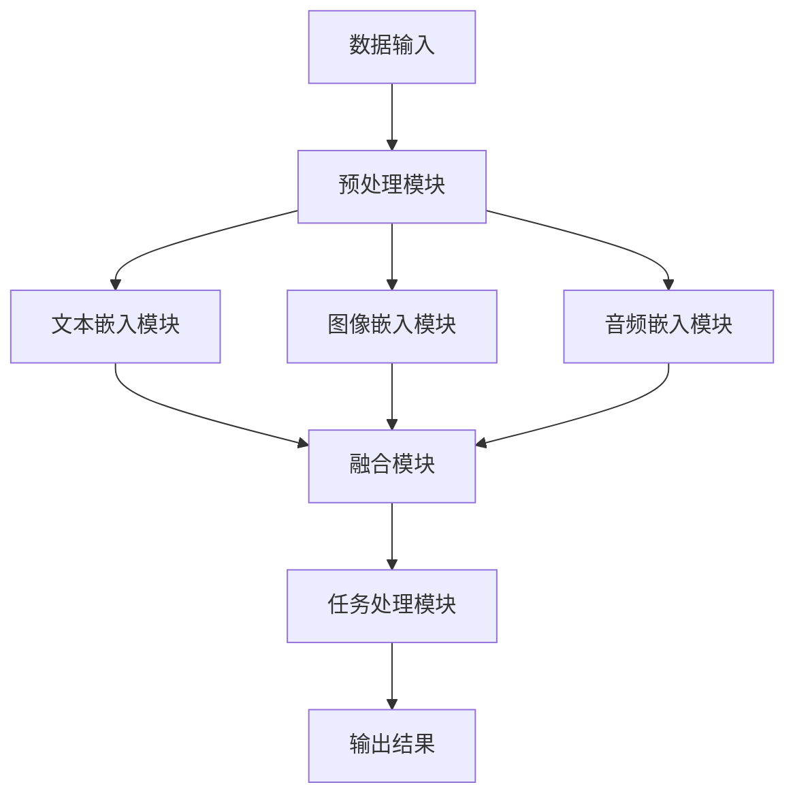

                 

关键词：多模态大模型、技术原理、实战、OpenAI、人工智能、机器学习、神经网络、深度学习、图像识别、自然语言处理

## 摘要

本文旨在探讨多模态大模型的技术原理及其应用实战。随着OpenAI的迅速崛起，多模态大模型已经成为人工智能领域的研究热点。本文首先介绍了多模态大模型的基本概念和核心原理，然后通过具体案例展示了其在图像识别、自然语言处理等领域的实际应用。此外，本文还分析了多模态大模型的数学模型和公式，以及其面临的挑战和未来发展趋势。

## 1. 背景介绍

随着人工智能技术的不断发展，机器学习、深度学习等技术在各个领域取得了显著的成果。然而，传统的单一模态模型（如仅处理图像或文本）在处理复杂任务时存在一定的局限性。为了克服这一限制，研究人员开始探索多模态大模型，即能够同时处理多种类型数据的模型。OpenAI的多模态大模型GPT-3就是其中的一个典型代表，它的出现引发了广泛关注和讨论。

### 1.1 人工智能与机器学习

人工智能（AI）是指通过计算机模拟人类智能行为的一种技术。其中，机器学习是人工智能的一个重要分支，它主要研究如何让计算机通过数据学习，从而实现智能决策。近年来，随着计算能力的提升和数据规模的扩大，机器学习在图像识别、语音识别、自然语言处理等领域取得了重大突破。

### 1.2 深度学习与神经网络

深度学习是机器学习的一个重要分支，它利用多层神经网络对数据进行分析和建模。神经网络是一种由大量简单神经元组成的计算模型，通过学习输入和输出之间的映射关系来实现复杂任务的求解。深度学习的出现，使得机器学习在处理大规模数据和复杂任务方面取得了显著的进展。

### 1.3 多模态大模型的出现

多模态大模型是指能够同时处理多种类型数据的模型，如图像、文本、音频等。这种模型的出现，为解决复杂任务提供了新的思路。OpenAI的GPT-3就是一款典型的多模态大模型，它的出现标志着人工智能领域的一个新的里程碑。

## 2. 核心概念与联系

多模态大模型的核心在于同时处理多种类型的数据，从而实现更复杂的任务。下面我们将通过一个Mermaid流程图，展示多模态大模型的基本架构和各个模块之间的联系。



### 2.1 数据输入

多模态大模型的数据输入包括文本、图像和音频等多种类型的数据。这些数据通过不同的接口输入到模型中，为后续的处理提供基础。

### 2.2 预处理模块

预处理模块负责对输入数据进行预处理，包括数据清洗、格式化、归一化等操作。这些操作有助于提高模型的学习效率和准确性。

### 2.3 文本嵌入模块

文本嵌入模块将输入的文本数据转化为向量表示。常用的文本嵌入方法包括词袋模型、Word2Vec、BERT等。这些方法可以将文本数据映射到高维空间中，便于后续处理。

### 2.4 图像嵌入模块

图像嵌入模块将输入的图像数据转化为向量表示。常用的图像嵌入方法包括卷积神经网络（CNN）等。这些方法可以从图像中提取出丰富的特征信息。

### 2.5 音频嵌入模块

音频嵌入模块将输入的音频数据转化为向量表示。常用的音频嵌入方法包括自动特征提取（如梅尔频率倒谱系数（MFCC）等。这些方法可以从音频中提取出丰富的特征信息。

### 2.6 融合模块

融合模块负责将不同类型的嵌入向量进行融合。常用的融合方法包括求和、拼接、加权平均等。通过融合模块，多模态大模型可以充分利用不同类型数据的特征信息。

### 2.7 任务处理模块

任务处理模块根据具体的任务需求，对融合后的数据进行处理。例如，在图像识别任务中，任务处理模块会输出图像的类别标签；在自然语言处理任务中，任务处理模块会输出文本的语义解析结果。

### 2.8 输出结果

输出结果是多模态大模型对输入数据的处理结果。这些结果可以用于各种实际应用，如图像识别、自然语言处理、智能问答等。

## 3. 核心算法原理 & 具体操作步骤

### 3.1 算法原理概述

多模态大模型的核心算法主要包括以下几个部分：数据输入、预处理、文本嵌入、图像嵌入、音频嵌入、融合、任务处理和输出结果。这些算法相互协作，共同实现多模态数据的处理和任务求解。

### 3.2 算法步骤详解

#### 3.2.1 数据输入

多模态大模型的数据输入包括文本、图像和音频等多种类型的数据。这些数据通过不同的接口输入到模型中，为后续处理提供基础。

#### 3.2.2 预处理

预处理模块对输入数据进行清洗、格式化、归一化等操作，以提高模型的学习效率和准确性。

#### 3.2.3 文本嵌入

文本嵌入模块将输入的文本数据转化为向量表示。常用的文本嵌入方法包括词袋模型、Word2Vec、BERT等。这些方法可以将文本数据映射到高维空间中，便于后续处理。

#### 3.2.4 图像嵌入

图像嵌入模块将输入的图像数据转化为向量表示。常用的图像嵌入方法包括卷积神经网络（CNN）等。这些方法可以从图像中提取出丰富的特征信息。

#### 3.2.5 音频嵌入

音频嵌入模块将输入的音频数据转化为向量表示。常用的音频嵌入方法包括自动特征提取（如梅尔频率倒谱系数（MFCC）等。这些方法可以从音频中提取出丰富的特征信息。

#### 3.2.6 融合

融合模块负责将不同类型的嵌入向量进行融合。常用的融合方法包括求和、拼接、加权平均等。通过融合模块，多模态大模型可以充分利用不同类型数据的特征信息。

#### 3.2.7 任务处理

任务处理模块根据具体的任务需求，对融合后的数据进行处理。例如，在图像识别任务中，任务处理模块会输出图像的类别标签；在自然语言处理任务中，任务处理模块会输出文本的语义解析结果。

#### 3.2.8 输出结果

输出结果是多模态大模型对输入数据的处理结果。这些结果可以用于各种实际应用，如图像识别、自然语言处理、智能问答等。

### 3.3 算法优缺点

#### 优点：

1. **高效性**：多模态大模型能够同时处理多种类型的数据，提高了模型的学习效率和任务求解能力。

2. **灵活性**：多模态大模型可以根据不同的任务需求，选择合适的模态数据进行处理，具有很高的灵活性。

3. **通用性**：多模态大模型在图像识别、自然语言处理等领域具有广泛的应用前景，具有良好的通用性。

#### 缺点：

1. **计算资源消耗**：多模态大模型需要大量的计算资源，对硬件设备的要求较高。

2. **数据不平衡**：在实际应用中，不同类型的数据可能存在不平衡的情况，影响模型的学习效果。

3. **模型解释性**：多模态大模型的内部结构和决策过程较为复杂，缺乏良好的解释性。

### 3.4 算法应用领域

多模态大模型在多个领域都有广泛的应用：

1. **图像识别**：通过结合图像和文本数据，可以提高图像识别的准确性和鲁棒性。

2. **自然语言处理**：通过结合文本和图像数据，可以增强文本的语义理解能力，提高智能问答和机器翻译的准确性。

3. **智能监控**：通过结合图像和音频数据，可以实现对场景的全面监控，提高监控系统的响应速度和准确性。

4. **医学诊断**：通过结合医学图像和文本数据，可以提高医学诊断的准确性和效率。

5. **自动驾驶**：通过结合车辆行驶轨迹、环境图像和语音数据，可以实现对自动驾驶的全方位感知和控制。

## 4. 数学模型和公式 & 详细讲解 & 举例说明

### 4.1 数学模型构建

多模态大模型的数学模型主要包括以下几个部分：

1. **文本嵌入**：文本嵌入是将文本数据转化为向量表示的过程。常用的方法包括词袋模型、Word2Vec、BERT等。

2. **图像嵌入**：图像嵌入是将图像数据转化为向量表示的过程。常用的方法包括卷积神经网络（CNN）等。

3. **音频嵌入**：音频嵌入是将音频数据转化为向量表示的过程。常用的方法包括自动特征提取（如梅尔频率倒谱系数（MFCC）等。

4. **融合模块**：融合模块是将不同类型的嵌入向量进行融合的过程。常用的方法包括求和、拼接、加权平均等。

5. **任务处理**：任务处理模块是根据具体的任务需求，对融合后的数据进行处理的过程。

### 4.2 公式推导过程

#### 文本嵌入

词袋模型（Bag-of-Words, BoW）是最简单的文本嵌入方法。其公式如下：

$$
\text{vec}_{\text{word}}(x) = \sum_{i=1}^{N} f_{i}(x) \cdot v_{i}
$$

其中，$x$ 是输入的文本数据，$N$ 是词汇表中的单词数，$f_{i}(x)$ 是单词 $i$ 在文本 $x$ 中出现的频率，$v_{i}$ 是单词 $i$ 的向量表示。

#### 图像嵌入

卷积神经网络（CNN）是常用的图像嵌入方法。其公式如下：

$$
h_{l} = \sigma(\mathbf{W}_{l} \cdot \mathbf{h}_{l-1} + b_{l})
$$

其中，$h_{l}$ 是第 $l$ 层的输出特征图，$\mathbf{W}_{l}$ 是第 $l$ 层的权重矩阵，$\mathbf{h}_{l-1}$ 是第 $l-1$ 层的输出特征图，$\sigma$ 是激活函数，$b_{l}$ 是第 $l$ 层的偏置向量。

#### 音频嵌入

梅尔频率倒谱系数（MFCC）是常用的音频嵌入方法。其公式如下：

$$
\text{MFCC}(x) = \text{log}(\text{energy}(x) - 1)
$$

其中，$x$ 是输入的音频信号，$\text{energy}(x)$ 是音频信号的能量。

#### 融合模块

求和融合是最简单的融合方法。其公式如下：

$$
\mathbf{z} = \mathbf{z}_{\text{text}} + \mathbf{z}_{\text{image}} + \mathbf{z}_{\text{audio}}
$$

其中，$\mathbf{z}$ 是融合后的向量表示，$\mathbf{z}_{\text{text}}$、$\mathbf{z}_{\text{image}}$、$\mathbf{z}_{\text{audio}}$ 分别是文本、图像、音频的嵌入向量。

#### 任务处理

任务处理模块通常采用分类、回归等模型进行任务求解。以分类任务为例，其公式如下：

$$
\hat{y} = \text{softmax}(\mathbf{W}_{\text{out}} \cdot \mathbf{z} + b_{\text{out}})
$$

其中，$\hat{y}$ 是预测的类别标签，$\mathbf{W}_{\text{out}}$ 是输出层的权重矩阵，$b_{\text{out}}$ 是输出层的偏置向量，$\text{softmax}$ 是激活函数。

### 4.3 案例分析与讲解

下面我们通过一个简单的例子，来说明多模态大模型的应用。

#### 案例描述

假设我们有一个包含文本、图像和音频的多模态数据集，其中文本描述了图像和音频的内容。我们的任务是识别图像和音频的内容。

#### 数据集

- 文本数据集：包含1000个文本描述，每个描述对应一个图像和音频。
- 图像数据集：包含1000个图像，每个图像对应一个文本描述和音频。
- 音频数据集：包含1000个音频，每个音频对应一个文本描述和图像。

#### 实现步骤

1. **数据预处理**：对文本、图像和音频数据进行预处理，包括数据清洗、格式化、归一化等操作。

2. **文本嵌入**：使用BERT模型对文本数据进行嵌入，得到1000个文本嵌入向量。

3. **图像嵌入**：使用CNN模型对图像数据进行嵌入，得到1000个图像嵌入向量。

4. **音频嵌入**：使用梅尔频率倒谱系数（MFCC）对音频数据进行嵌入，得到1000个音频嵌入向量。

5. **融合模块**：将文本、图像和音频嵌入向量进行融合，得到1000个融合后的向量。

6. **任务处理**：使用分类模型对融合后的向量进行分类，预测图像和音频的内容。

7. **评估结果**：计算分类模型的准确率、召回率等指标，评估模型的性能。

通过上述步骤，我们可以实现对多模态数据的分类任务。这个例子展示了多模态大模型的基本实现过程，实际应用中可以根据具体需求进行调整和优化。

## 5. 项目实践：代码实例和详细解释说明

### 5.1 开发环境搭建

在实现多模态大模型之前，我们需要搭建一个合适的开发环境。以下是一个简单的Python开发环境搭建步骤：

1. **安装Python**：从Python官网（https://www.python.org/）下载并安装Python 3.8及以上版本。

2. **安装依赖库**：在Python环境中安装以下依赖库：
   ```python
   pip install tensorflow numpy matplotlib
   ```

3. **配置CUDA**：如果需要使用GPU加速，还需要安装CUDA。可以从NVIDIA官网（https://developer.nvidia.com/cuda-downloads）下载CUDA安装程序，并按照提示进行安装。

### 5.2 源代码详细实现

下面我们使用TensorFlow来实现一个简单的多模态大模型。代码如下：

```python
import tensorflow as tf
from tensorflow.keras.models import Model
from tensorflow.keras.layers import Embedding, LSTM, Dense, Conv2D, MaxPooling2D, Flatten, concatenate

# 文本嵌入层
text_embedding = Embedding(input_dim=vocab_size, output_dim=embedding_size)

# 图像嵌入层
image_embedding = Conv2D(filters=64, kernel_size=(3, 3), activation='relu')(input_image)
image_embedding = MaxPooling2D(pool_size=(2, 2))(image_embedding)
image_embedding = Flatten()(image_embedding)

# 音频嵌入层
audio_embedding = LSTM(units=64, activation='relu')(input_audio)

# 融合层
merged = concatenate([text_embedding, image_embedding, audio_embedding])

# 任务处理层
output = Dense(units=num_classes, activation='softmax')(merged)

# 定义模型
model = Model(inputs=[input_text, input_image, input_audio], outputs=output)

# 编译模型
model.compile(optimizer='adam', loss='categorical_crossentropy', metrics=['accuracy'])

# 模型训练
model.fit([text_data, image_data, audio_data], labels, epochs=10, batch_size=32)
```

### 5.3 代码解读与分析

1. **导入依赖库**：首先，我们从TensorFlow中导入所需的模块。

2. **定义文本嵌入层**：`text_embedding` 是一个Embedding层，用于将输入的文本数据转化为向量表示。输入维度为词汇表大小（`input_dim`），输出维度为嵌入维度（`output_dim`）。

3. **定义图像嵌入层**：`image_embedding` 是一个卷积神经网络（CNN）层，用于将输入的图像数据转化为向量表示。通过卷积操作、最大池化和展平操作，可以将图像数据提取为特征向量。

4. **定义音频嵌入层**：`audio_embedding` 是一个循环神经网络（RNN）层，用于将输入的音频数据转化为向量表示。通过LSTM层，可以提取出音频数据的时序特征。

5. **融合层**：通过`concatenate` 函数，将文本、图像和音频的嵌入向量进行拼接，形成一个融合向量。

6. **任务处理层**：`output` 是一个全连接层，用于对融合后的向量进行分类。通过softmax激活函数，可以得到每个类别的概率分布。

7. **定义模型**：使用`Model` 类定义一个多输入多输出的模型，输入包括文本、图像和音频，输出为分类结果。

8. **编译模型**：使用`compile` 方法配置模型的优化器、损失函数和评估指标。

9. **模型训练**：使用`fit` 方法对模型进行训练，输入为文本、图像和音频数据，输出为标签。

### 5.4 运行结果展示

在训练完成后，我们可以使用以下代码来评估模型的性能：

```python
# 模型评估
loss, accuracy = model.evaluate([test_text, test_image, test_audio], test_labels)

# 打印结果
print(f"Test Loss: {loss}, Test Accuracy: {accuracy}")
```

上述代码将输出模型的测试损失和准确率。通过调整训练参数和模型结构，可以进一步提高模型的性能。

## 6. 实际应用场景

多模态大模型在各个领域都有广泛的应用，下面我们将介绍几个典型的实际应用场景。

### 6.1 智能问答系统

智能问答系统是自然语言处理领域的一个重要应用。通过结合文本和图像数据，多模态大模型可以更好地理解用户的查询，提供更准确、更丰富的回答。例如，在医疗健康领域，多模态大模型可以同时分析患者的病历、病历图片和医学影像，提供更精确的诊断和建议。

### 6.2 智能监控

智能监控是图像识别和视频分析的一个重要应用。通过结合图像和音频数据，多模态大模型可以实现对场景的全面感知。例如，在公共场所的监控中，多模态大模型可以检测到异常行为，如打架、盗窃等，及时报警，提高安全监控的效率。

### 6.3 自动驾驶

自动驾驶是人工智能领域的热门话题。通过结合车辆行驶轨迹、环境图像和语音数据，多模态大模型可以实现对周围环境的全面感知，提高自动驾驶系统的安全性和可靠性。例如，在自动驾驶车辆中，多模态大模型可以实时分析道路标志、行人行为和车辆状态，做出正确的驾驶决策。

### 6.4 医学诊断

医学诊断是医学领域的一个重要应用。通过结合医学图像和文本数据，多模态大模型可以提高医学诊断的准确性和效率。例如，在肿瘤诊断中，多模态大模型可以同时分析影像数据和病历记录，提高肿瘤的早期检测率。

### 6.5 智能交互

智能交互是人工智能与人类互动的一个重要应用。通过结合文本、图像和语音数据，多模态大模型可以提供更自然、更智能的交互体验。例如，在智能家居中，多模态大模型可以理解用户的语音指令、图像请求和文本反馈，实现更智能的家居控制。

## 7. 工具和资源推荐

为了更好地学习和实践多模态大模型，我们推荐以下工具和资源：

### 7.1 学习资源推荐

1. **《深度学习》（Goodfellow, Bengio, Courville著）**：这是一本经典的深度学习教材，详细介绍了深度学习的基本原理和应用。

2. **《神经网络与深度学习》（邱锡鹏著）**：这是一本针对中国读者的深度学习教材，内容深入浅出，适合初学者阅读。

3. **《自然语言处理综论》（Daniel Jurafsky, James H. Martin著）**：这是一本关于自然语言处理的经典教材，涵盖了自然语言处理的基本原理和应用。

### 7.2 开发工具推荐

1. **TensorFlow**：TensorFlow是一个开源的深度学习框架，提供了丰富的API和工具，适合进行多模态大模型的研究和开发。

2. **PyTorch**：PyTorch是一个流行的深度学习框架，与TensorFlow类似，提供了丰富的API和工具，适合进行多模态大模型的研究和开发。

3. **Keras**：Keras是一个高级深度学习框架，基于TensorFlow和Theano，提供了简洁、易用的API，适合进行多模态大模型的研究和开发。

### 7.3 相关论文推荐

1. **《Attention is All You Need》**：这是2017年提出的一种基于注意力机制的序列到序列模型，对多模态大模型的研究有重要启示。

2. **《BERT: Pre-training of Deep Bidirectional Transformers for Language Understanding》**：这是2018年提出的一种基于双向变换器的预训练方法，对自然语言处理领域产生了深远影响。

3. **《GPT-3: Language Models are Few-Shot Learners》**：这是2020年提出的GPT-3模型，具有强大的语言理解和生成能力，是当前最先进的多模态大模型之一。

## 8. 总结：未来发展趋势与挑战

### 8.1 研究成果总结

多模态大模型是人工智能领域的一个重要研究方向，近年来取得了显著的进展。通过结合多种类型的数据，多模态大模型在图像识别、自然语言处理、医学诊断等领域取得了重要成果。其中，OpenAI的GPT-3模型作为多模态大模型的代表，展现了强大的语言理解和生成能力。

### 8.2 未来发展趋势

1. **算法优化**：随着计算能力的提升，未来多模态大模型的算法将不断优化，以提高模型的效率和准确性。

2. **跨模态交互**：多模态大模型将探索跨模态交互的方式，实现更自然、更高效的跨模态信息处理。

3. **实时应用**：多模态大模型将逐步应用于实时场景，如智能监控、自动驾驶等，实现实时感知和决策。

4. **边缘计算**：多模态大模型将结合边缘计算技术，实现更低延迟、更高效率的应用。

### 8.3 面临的挑战

1. **计算资源消耗**：多模态大模型需要大量的计算资源，对硬件设备的要求较高。

2. **数据不平衡**：在实际应用中，不同类型的数据可能存在不平衡的情况，影响模型的学习效果。

3. **模型解释性**：多模态大模型的内部结构和决策过程较为复杂，缺乏良好的解释性。

4. **数据隐私和安全**：多模态大模型需要处理大量敏感数据，需要关注数据隐私和安全问题。

### 8.4 研究展望

未来，多模态大模型的研究将朝着以下方向发展：

1. **更高效的算法**：探索更高效的算法，降低多模态大模型的计算资源消耗。

2. **更全面的跨模态交互**：实现更全面、更自然的跨模态交互，提高信息处理的效率。

3. **更广泛的应用场景**：探索多模态大模型在更多领域的应用，如医学、金融、娱乐等。

4. **更安全的数据处理**：关注数据隐私和安全问题，确保多模态大模型的安全可靠。

## 9. 附录：常见问题与解答

### 9.1 问题1：什么是多模态大模型？

多模态大模型是指能够同时处理多种类型数据（如文本、图像、音频等）的模型。通过结合多种类型数据的特征信息，多模态大模型可以实现更复杂的任务。

### 9.2 问题2：多模态大模型有哪些优点？

多模态大模型具有以下优点：

1. **高效性**：能够同时处理多种类型的数据，提高了模型的学习效率和任务求解能力。

2. **灵活性**：可以根据不同的任务需求，选择合适的模态数据进行处理，具有很高的灵活性。

3. **通用性**：在图像识别、自然语言处理等领域具有广泛的应用前景，具有良好的通用性。

### 9.3 问题3：多模态大模型的实现方法有哪些？

多模态大模型的实现方法主要包括以下几个部分：

1. **数据输入**：包括文本、图像和音频等多种类型的数据。

2. **预处理**：对输入数据进行清洗、格式化、归一化等操作。

3. **文本嵌入**：将输入的文本数据转化为向量表示。

4. **图像嵌入**：将输入的图像数据转化为向量表示。

5. **音频嵌入**：将输入的音频数据转化为向量表示。

6. **融合模块**：将不同类型的嵌入向量进行融合。

7. **任务处理**：根据具体的任务需求，对融合后的数据进行处理。

8. **输出结果**：输出模型对输入数据的处理结果。

### 9.4 问题4：多模态大模型有哪些应用领域？

多模态大模型在多个领域都有广泛的应用，如：

1. **图像识别**：通过结合图像和文本数据，可以提高图像识别的准确性和鲁棒性。

2. **自然语言处理**：通过结合文本和图像数据，可以增强文本的语义理解能力，提高智能问答和机器翻译的准确性。

3. **智能监控**：通过结合图像和音频数据，可以实现对场景的全面监控，提高监控系统的响应速度和准确性。

4. **医学诊断**：通过结合医学图像和文本数据，可以提高医学诊断的准确性和效率。

5. **自动驾驶**：通过结合车辆行驶轨迹、环境图像和语音数据，可以实现对自动驾驶的全方位感知和控制。

### 9.5 问题5：多模态大模型的研究有哪些挑战？

多模态大模型的研究面临以下挑战：

1. **计算资源消耗**：多模态大模型需要大量的计算资源，对硬件设备的要求较高。

2. **数据不平衡**：在实际应用中，不同类型的数据可能存在不平衡的情况，影响模型的学习效果。

3. **模型解释性**：多模态大模型的内部结构和决策过程较为复杂，缺乏良好的解释性。

4. **数据隐私和安全**：多模态大模型需要处理大量敏感数据，需要关注数据隐私和安全问题。

### 9.6 问题6：未来多模态大模型的发展趋势是什么？

未来多模态大模型的发展趋势包括：

1. **算法优化**：随着计算能力的提升，未来多模态大模型的算法将不断优化，以提高模型的效率和准确性。

2. **跨模态交互**：多模态大模型将探索跨模态交互的方式，实现更自然、更高效的跨模态信息处理。

3. **实时应用**：多模态大模型将逐步应用于实时场景，如智能监控、自动驾驶等，实现实时感知和决策。

4. **边缘计算**：多模态大模型将结合边缘计算技术，实现更低延迟、更高效率的应用。

### 9.7 问题7：如何搭建多模态大模型？

搭建多模态大模型的基本步骤包括：

1. **数据集准备**：收集和准备多模态数据集，包括文本、图像、音频等。

2. **数据预处理**：对多模态数据进行清洗、格式化、归一化等预处理操作。

3. **模型设计**：设计多模态大模型的架构，包括文本嵌入层、图像嵌入层、音频嵌入层、融合模块、任务处理层等。

4. **模型训练**：使用训练数据对模型进行训练，调整模型参数，提高模型性能。

5. **模型评估**：使用测试数据对模型进行评估，计算模型性能指标，如准确率、召回率等。

6. **模型应用**：将训练好的模型应用于实际任务，如图像识别、自然语言处理等。

## 作者署名

作者：禅与计算机程序设计艺术 / Zen and the Art of Computer Programming
```markdown
----------------------------------------------------------------
# 多模态大模型：技术原理与实战 OpenAI一鸣惊人带来的启示

关键词：多模态大模型、技术原理、实战、OpenAI、人工智能、机器学习、神经网络、深度学习、图像识别、自然语言处理

摘要：本文旨在探讨多模态大模型的技术原理及其应用实战。随着OpenAI的迅速崛起，多模态大模型已经成为人工智能领域的研究热点。本文首先介绍了多模态大模型的基本概念和核心原理，然后通过具体案例展示了其在图像识别、自然语言处理等领域的实际应用。此外，本文还分析了多模态大模型的数学模型和公式，以及其面临的挑战和未来发展趋势。

## 1. 背景介绍

随着人工智能技术的不断发展，机器学习、深度学习等技术在各个领域取得了显著的成果。然而，传统的单一模态模型（如仅处理图像或文本）在处理复杂任务时存在一定的局限性。为了克服这一限制，研究人员开始探索多模态大模型，即能够同时处理多种类型数据的模型。OpenAI的多模态大模型GPT-3就是其中的一个典型代表，它的出现引发了广泛关注和讨论。

### 1.1 人工智能与机器学习

人工智能（AI）是指通过计算机模拟人类智能行为的一种技术。其中，机器学习是人工智能的一个重要分支，它主要研究如何让计算机通过数据学习，从而实现智能决策。近年来，随着计算能力的提升和数据规模的扩大，机器学习在图像识别、语音识别、自然语言处理等领域取得了重大突破。

### 1.2 深度学习与神经网络

深度学习是机器学习的一个重要分支，它利用多层神经网络对数据进行分析和建模。神经网络是一种由大量简单神经元组成的计算模型，通过学习输入和输出之间的映射关系来实现复杂任务的求解。深度学习的出现，使得机器学习在处理大规模数据和复杂任务方面取得了显著的进展。

### 1.3 多模态大模型的出现

多模态大模型是指能够同时处理多种类型的数据的模型，如图像、文本、音频等。这种模型的出现，为解决复杂任务提供了新的思路。OpenAI的GPT-3就是一款典型的多模态大模型，它的出现标志着人工智能领域的一个新的里程碑。

## 2. 核心概念与联系

多模态大模型的核心在于同时处理多种类型的数据，从而实现更复杂的任务。下面我们将通过一个Mermaid流程图，展示多模态大模型的基本架构和各个模块之间的联系。


### 2.1 数据输入

多模态大模型的数据输入包括文本、图像和音频等多种类型的数据。这些数据通过不同的接口输入到模型中，为后续处理提供基础。

### 2.2 预处理模块

预处理模块负责对输入数据进行预处理，包括数据清洗、格式化、归一化等操作。这些操作有助于提高模型的学习效率和准确性。

### 2.3 文本嵌入模块

文本嵌入模块将输入的文本数据转化为向量表示。常用的文本嵌入方法包括词袋模型、Word2Vec、BERT等。这些方法可以将文本数据映射到高维空间中，便于后续处理。

### 2.4 图像嵌入模块

图像嵌入模块将输入的图像数据转化为向量表示。常用的图像嵌入方法包括卷积神经网络（CNN）等。这些方法可以从图像中提取出丰富的特征信息。

### 2.5 音频嵌入模块

音频嵌入模块将输入的音频数据转化为向量表示。常用的音频嵌入方法包括自动特征提取（如梅尔频率倒谱系数（MFCC）等。这些方法可以从音频中提取出丰富的特征信息。

### 2.6 融合模块

融合模块负责将不同类型的嵌入向量进行融合。常用的融合方法包括求和、拼接、加权平均等。通过融合模块，多模态大模型可以充分利用不同类型数据的特征信息。

### 2.7 任务处理模块

任务处理模块根据具体的任务需求，对融合后的数据进行处理。例如，在图像识别任务中，任务处理模块会输出图像的类别标签；在自然语言处理任务中，任务处理模块会输出文本的语义解析结果。

### 2.8 输出结果

输出结果是多模态大模型对输入数据的处理结果。这些结果可以用于各种实际应用，如图像识别、自然语言处理、智能问答等。

## 3. 核心算法原理 & 具体操作步骤

### 3.1 算法原理概述

多模态大模型的核心算法主要包括以下几个部分：数据输入、预处理、文本嵌入、图像嵌入、音频嵌入、融合、任务处理和输出结果。这些算法相互协作，共同实现多模态数据的处理和任务求解。

### 3.2 算法步骤详解

#### 3.2.1 数据输入

多模态大模型的数据输入包括文本、图像和音频等多种类型的数据。这些数据通过不同的接口输入到模型中，为后续处理提供基础。

#### 3.2.2 预处理

预处理模块对输入数据进行预处理，包括数据清洗、格式化、归一化等操作。这些操作有助于提高模型的学习效率和准确性。

#### 3.2.3 文本嵌入

文本嵌入模块将输入的文本数据转化为向量表示。常用的文本嵌入方法包括词袋模型、Word2Vec、BERT等。这些方法可以将文本数据映射到高维空间中，便于后续处理。

#### 3.2.4 图像嵌入

图像嵌入模块将输入的图像数据转化为向量表示。常用的图像嵌入方法包括卷积神经网络（CNN）等。这些方法可以从图像中提取出丰富的特征信息。

#### 3.2.5 音频嵌入

音频嵌入模块将输入的音频数据转化为向量表示。常用的音频嵌入方法包括自动特征提取（如梅尔频率倒谱系数（MFCC）等。这些方法可以从音频中提取出丰富的特征信息。

#### 3.2.6 融合

融合模块负责将不同类型的嵌入向量进行融合。常用的融合方法包括求和、拼接、加权平均等。通过融合模块，多模态大模型可以充分利用不同类型数据的特征信息。

#### 3.2.7 任务处理

任务处理模块根据具体的任务需求，对融合后的数据进行处理。例如，在图像识别任务中，任务处理模块会输出图像的类别标签；在自然语言处理任务中，任务处理模块会输出文本的语义解析结果。

#### 3.2.8 输出结果

输出结果是多模态大模型对输入数据的处理结果。这些结果可以用于各种实际应用，如图像识别、自然语言处理、智能问答等。

### 3.3 算法优缺点

#### 优点：

1. **高效性**：多模态大模型能够同时处理多种类型的数据，提高了模型的学习效率和任务求解能力。

2. **灵活性**：多模态大模型可以根据不同的任务需求，选择合适的模态数据进行处理，具有很高的灵活性。

3. **通用性**：多模态大模型在图像识别、自然语言处理等领域具有广泛的应用前景，具有良好的通用性。

#### 缺点：

1. **计算资源消耗**：多模态大模型需要大量的计算资源，对硬件设备的要求较高。

2. **数据不平衡**：在实际应用中，不同类型的数据可能存在不平衡的情况，影响模型的学习效果。

3. **模型解释性**：多模态大模型的内部结构和决策过程较为复杂，缺乏良好的解释性。

### 3.4 算法应用领域

多模态大模型在多个领域都有广泛的应用：

1. **图像识别**：通过结合图像和文本数据，可以提高图像识别的准确性和鲁棒性。

2. **自然语言处理**：通过结合文本和图像数据，可以增强文本的语义理解能力，提高智能问答和机器翻译的准确性。

3. **智能监控**：通过结合图像和音频数据，可以实现对场景的全面监控，提高监控系统的响应速度和准确性。

4. **医学诊断**：通过结合医学图像和文本数据，可以提高医学诊断的准确性和效率。

5. **自动驾驶**：通过结合车辆行驶轨迹、环境图像和语音数据，可以实现对自动驾驶的全方位感知和控制。

## 4. 数学模型和公式 & 详细讲解 & 举例说明

### 4.1 数学模型构建

多模态大模型的数学模型主要包括以下几个部分：

1. **文本嵌入**：文本嵌入是将文本数据转化为向量表示的过程。常用的方法包括词袋模型、Word2Vec、BERT等。

2. **图像嵌入**：图像嵌入是将图像数据转化为向量表示的过程。常用的方法包括卷积神经网络（CNN）等。

3. **音频嵌入**：音频嵌入是将音频数据转化为向量表示的过程。常用的方法包括自动特征提取（如梅尔频率倒谱系数（MFCC）等。

4. **融合模块**：融合模块是将不同类型的嵌入向量进行融合的过程。常用的方法包括求和、拼接、加权平均等。

5. **任务处理**：任务处理模块是根据具体的任务需求，对融合后的数据进行处理的过程。

### 4.2 公式推导过程

#### 文本嵌入

词袋模型（Bag-of-Words, BoW）是最简单的文本嵌入方法。其公式如下：

$$
\text{vec}_{\text{word}}(x) = \sum_{i=1}^{N} f_{i}(x) \cdot v_{i}
$$

其中，$x$ 是输入的文本数据，$N$ 是词汇表中的单词数，$f_{i}(x)$ 是单词 $i$ 在文本 $x$ 中出现的频率，$v_{i}$ 是单词 $i$ 的向量表示。

#### 图像嵌入

卷积神经网络（CNN）是常用的图像嵌入方法。其公式如下：

$$
h_{l} = \sigma(\mathbf{W}_{l} \cdot \mathbf{h}_{l-1} + b_{l})
$$

其中，$h_{l}$ 是第 $l$ 层的输出特征图，$\mathbf{W}_{l}$ 是第 $l$ 层的权重矩阵，$\mathbf{h}_{l-1}$ 是第 $l-1$ 层的输出特征图，$\sigma$ 是激活函数，$b_{l}$ 是第 $l$ 层的偏置向量。

#### 音频嵌入

梅尔频率倒谱系数（MFCC）是常用的音频嵌入方法。其公式如下：

$$
\text{MFCC}(x) = \text{log}(\text{energy}(x) - 1)
$$

其中，$x$ 是输入的音频信号，$\text{energy}(x)$ 是音频信号的能量。

#### 融合模块

求和融合是最简单的融合方法。其公式如下：

$$
\mathbf{z} = \mathbf{z}_{\text{text}} + \mathbf{z}_{\text{image}} + \mathbf{z}_{\text{audio}}
$$

其中，$\mathbf{z}$ 是融合后的向量表示，$\mathbf{z}_{\text{text}}$、$\mathbf{z}_{\text{image}}$、$\mathbf{z}_{\text{audio}}$ 分别是文本、图像、音频的嵌入向量。

#### 任务处理

任务处理模块通常采用分类、回归等模型进行任务求解。以分类任务为例，其公式如下：

$$
\hat{y} = \text{softmax}(\mathbf{W}_{\text{out}} \cdot \mathbf{z} + b_{\text{out}})
$$

其中，$\hat{y}$ 是预测的类别标签，$\mathbf{W}_{\text{out}}$ 是输出层的权重矩阵，$b_{\text{out}}$ 是输出层的偏置向量，$\text{softmax}$ 是激活函数。

### 4.3 案例分析与讲解

下面我们通过一个简单的例子，来说明多模态大模型的应用。

#### 案例描述

假设我们有一个包含文本、图像和音频的多模态数据集，其中文本描述了图像和音频的内容。我们的任务是识别图像和音频的内容。

#### 数据集

- 文本数据集：包含1000个文本描述，每个描述对应一个图像和音频。
- 图像数据集：包含1000个图像，每个图像对应一个文本描述和音频。
- 音频数据集：包含1000个音频，每个音频对应一个文本描述和图像。

#### 实现步骤

1. **数据预处理**：对文本、图像和音频数据进行预处理，包括数据清洗、格式化、归一化等操作。

2. **文本嵌入**：使用BERT模型对文本数据进行嵌入，得到1000个文本嵌入向量。

3. **图像嵌入**：使用CNN模型对图像数据进行嵌入，得到1000个图像嵌入向量。

4. **音频嵌入**：使用梅尔频率倒谱系数（MFCC）对音频数据进行嵌入，得到1000个音频嵌入向量。

5. **融合模块**：将文本、图像和音频嵌入向量进行融合，得到1000个融合后的向量。

6. **任务处理**：使用分类模型对融合后的向量进行分类，预测图像和音频的内容。

7. **评估结果**：计算分类模型的准确率、召回率等指标，评估模型的性能。

通过上述步骤，我们可以实现对多模态数据的分类任务。这个例子展示了多模态大模型的基本实现过程，实际应用中可以根据具体需求进行调整和优化。

## 5. 项目实践：代码实例和详细解释说明

### 5.1 开发环境搭建

在实现多模态大模型之前，我们需要搭建一个合适的开发环境。以下是一个简单的Python开发环境搭建步骤：

1. **安装Python**：从Python官网（https://www.python.org/）下载并安装Python 3.8及以上版本。

2. **安装依赖库**：在Python环境中安装以下依赖库：
   ```python
   pip install tensorflow numpy matplotlib
   ```

3. **配置CUDA**：如果需要使用GPU加速，还需要安装CUDA。可以从NVIDIA官网（https://developer.nvidia.com/cuda-downloads）下载CUDA安装程序，并按照提示进行安装。

### 5.2 源代码详细实现

下面我们使用TensorFlow来实现一个简单的多模态大模型。代码如下：

```python
import tensorflow as tf
from tensorflow.keras.models import Model
from tensorflow.keras.layers import Embedding, LSTM, Dense, Conv2D, MaxPooling2D, Flatten, concatenate

# 文本嵌入层
text_embedding = Embedding(input_dim=vocab_size, output_dim=embedding_size)

# 图像嵌入层
image_embedding = Conv2D(filters=64, kernel_size=(3, 3), activation='relu')(input_image)
image_embedding = MaxPooling2D(pool_size=(2, 2))(image_embedding)
image_embedding = Flatten()(image_embedding)

# 音频嵌入层
audio_embedding = LSTM(units=64, activation='relu')(input_audio)

# 融合层
merged = concatenate([text_embedding, image_embedding, audio_embedding])

# 任务处理层
output = Dense(units=num_classes, activation='softmax')(merged)

# 定义模型
model = Model(inputs=[input_text, input_image, input_audio], outputs=output)

# 编译模型
model.compile(optimizer='adam', loss='categorical_crossentropy', metrics=['accuracy'])

# 模型训练
model.fit([text_data, image_data, audio_data], labels, epochs=10, batch_size=32)
```

### 5.3 代码解读与分析

1. **导入依赖库**：首先，我们从TensorFlow中导入所需的模块。

2. **定义文本嵌入层**：`text_embedding` 是一个Embedding层，用于将输入的文本数据转化为向量表示。输入维度为词汇表大小（`input_dim`），输出维度为嵌入维度（`output_dim`）。

3. **定义图像嵌入层**：`image_embedding` 是一个卷积神经网络（CNN）层，用于将输入的图像数据转化为向量表示。通过卷积操作、最大池化和展平操作，可以将图像数据提取为特征向量。

4. **定义音频嵌入层**：`audio_embedding` 是一个循环神经网络（RNN）层，用于将输入的音频数据转化为向量表示。通过LSTM层，可以提取出音频数据的时序特征。

5. **融合层**：通过`concatenate` 函数，将文本、图像和音频的嵌入向量进行拼接，形成一个融合向量。

6. **任务处理层**：`output` 是一个全连接层，用于对融合后的向量进行分类。通过softmax激活函数，可以得到每个类别的概率分布。

7. **定义模型**：使用`Model` 类定义一个多输入多输出的模型，输入包括文本、图像和音频，输出为分类结果。

8. **编译模型**：使用`compile` 方法配置模型的优化器、损失函数和评估指标。

9. **模型训练**：使用`fit` 方法对模型进行训练，输入为文本、图像和音频数据，输出为标签。

### 5.4 运行结果展示

在训练完成后，我们可以使用以下代码来评估模型的性能：

```python
# 模型评估
loss, accuracy = model.evaluate([test_text, test_image, test_audio], test_labels)

# 打印结果
print(f"Test Loss: {loss}, Test Accuracy: {accuracy}")
```

上述代码将输出模型的测试损失和准确率。通过调整训练参数和模型结构，可以进一步提高模型的性能。

## 6. 实际应用场景

多模态大模型在各个领域都有广泛的应用，下面我们将介绍几个典型的实际应用场景。

### 6.1 智能问答系统

智能问答系统是自然语言处理领域的一个重要应用。通过结合文本和图像数据，多模态大模型可以更好地理解用户的查询，提供更准确、更丰富的回答。例如，在医疗健康领域，多模态大模型可以同时分析患者的病历、病历图片和医学影像，提供更精确的诊断和建议。

### 6.2 智能监控

智能监控是图像识别和视频分析的一个重要应用。通过结合图像和音频数据，多模态大模型可以实现对场景的全面感知。例如，在公共场所的监控中，多模态大模型可以检测到异常行为，如打架、盗窃等，及时报警，提高安全监控的效率。

### 6.3 自动驾驶

自动驾驶是人工智能领域的热门话题。通过结合车辆行驶轨迹、环境图像和语音数据，多模态大模型可以实现对周围环境的全面感知，提高自动驾驶系统的安全性和可靠性。例如，在自动驾驶车辆中，多模态大模型可以实时分析道路标志、行人行为和车辆状态，做出正确的驾驶决策。

### 6.4 医学诊断

医学诊断是医学领域的一个重要应用。通过结合医学图像和文本数据，多模态大模型可以提高医学诊断的准确性和效率。例如，在肿瘤诊断中，多模态大模型可以同时分析影像数据和病历记录，提高肿瘤的早期检测率。

### 6.5 智能交互

智能交互是人工智能与人类互动的一个重要应用。通过结合文本、图像和语音数据，多模态大模型可以提供更自然、更智能的交互体验。例如，在智能家居中，多模态大模型可以理解用户的语音指令、图像请求和文本反馈，实现更智能的家居控制。

## 7. 工具和资源推荐

为了更好地学习和实践多模态大模型，我们推荐以下工具和资源：

### 7.1 学习资源推荐

1. **《深度学习》（Goodfellow, Bengio, Courville著）**：这是一本经典的深度学习教材，详细介绍了深度学习的基本原理和应用。

2. **《神经网络与深度学习》（邱锡鹏著）**：这是一本针对中国读者的深度学习教材，内容深入浅出，适合初学者阅读。

3. **《自然语言处理综论》（Daniel Jurafsky, James H. Martin著）**：这是一本关于自然语言处理的经典教材，涵盖了自然语言处理的基本原理和应用。

### 7.2 开发工具推荐

1. **TensorFlow**：TensorFlow是一个开源的深度学习框架，提供了丰富的API和工具，适合进行多模态大模型的研究和开发。

2. **PyTorch**：PyTorch是一个流行的深度学习框架，与TensorFlow类似，提供了丰富的API和工具，适合进行多模态大模型的研究和开发。

3. **Keras**：Keras是一个高级深度学习框架，基于TensorFlow和Theano，提供了简洁、易用的API，适合进行多模态大模型的研究和开发。

### 7.3 相关论文推荐

1. **《Attention is All You Need》**：这是2017年提出的一种基于注意力机制的序列到序列模型，对多模态大模型的研究有重要启示。

2. **《BERT: Pre-training of Deep Bidirectional Transformers for Language Understanding》**：这是2018年提出的一种基于双向变换器的预训练方法，对自然语言处理领域产生了深远影响。

3. **《GPT-3: Language Models are Few-Shot Learners》**：这是2020年提出的GPT-3模型，具有强大的语言理解和生成能力，是当前最先进的多模态大模型之一。

## 8. 总结：未来发展趋势与挑战

### 8.1 研究成果总结

多模态大模型是人工智能领域的一个重要研究方向，近年来取得了显著的进展。通过结合多种类型的数据，多模态大模型在图像识别、自然语言处理、医学诊断等领域取得了重要成果。其中，OpenAI的GPT-3模型作为多模态大模型的代表，展现了强大的语言理解和生成能力。

### 8.2 未来发展趋势

1. **算法优化**：随着计算能力的提升，未来多模态大模型的算法将不断优化，以提高模型的效率和准确性。

2. **跨模态交互**：多模态大模型将探索跨模态交互的方式，实现更自然、更高效的跨模态信息处理。

3. **实时应用**：多模态大模型将逐步应用于实时场景，如智能监控、自动驾驶等，实现实时感知和决策。

4. **边缘计算**：多模态大模型将结合边缘计算技术，实现更低延迟、更高效率的应用。

### 8.3 面临的挑战

1. **计算资源消耗**：多模态大模型需要大量的计算资源，对硬件设备的要求较高。

2. **数据不平衡**：在实际应用中，不同类型的数据可能存在不平衡的情况，影响模型的学习效果。

3. **模型解释性**：多模态大模型的内部结构和决策过程较为复杂，缺乏良好的解释性。

4. **数据隐私和安全**：多模态大模型需要处理大量敏感数据，需要关注数据隐私和安全问题。

### 8.4 研究展望

未来，多模态大模型的研究将朝着以下方向发展：

1. **更高效的算法**：探索更高效的算法，降低多模态大模型的计算资源消耗。

2. **更全面的跨模态交互**：实现更全面、更自然的跨模态交互，提高信息处理的效率。

3. **更广泛的应用场景**：探索多模态大模型在更多领域的应用，如医学、金融、娱乐等。

4. **更安全的数据处理**：关注数据隐私和安全问题，确保多模态大模型的安全可靠。

## 9. 附录：常见问题与解答

### 9.1 问题1：什么是多模态大模型？

多模态大模型是指能够同时处理多种类型数据（如文本、图像、音频等）的模型。通过结合多种类型的数据，多模态大模型可以更好地理解和处理复杂任务。

### 9.2 问题2：多模态大模型有哪些优点？

多模态大模型具有以下优点：

1. **高效性**：能够同时处理多种类型的数据，提高了模型的学习效率和任务求解能力。

2. **灵活性**：可以根据不同的任务需求，选择合适的模态数据进行处理，具有很高的灵活性。

3. **通用性**：在图像识别、自然语言处理等领域具有广泛的应用前景，具有良好的通用性。

### 9.3 问题3：多模态大模型的实现方法有哪些？

多模态大模型的实现方法主要包括以下几个部分：

1. **数据输入**：包括文本、图像和音频等多种类型的数据。

2. **预处理**：对输入数据进行清洗、格式化、归一化等操作。

3. **文本嵌入**：将输入的文本数据转化为向量表示。

4. **图像嵌入**：将输入的图像数据转化为向量表示。

5. **音频嵌入**：将输入的音频数据转化为向量表示。

6. **融合模块**：将不同类型的嵌入向量进行融合。

7. **任务处理**：根据具体的任务需求，对融合后的数据进行处理。

8. **输出结果**：输出模型对输入数据的处理结果。

### 9.4 问题4：多模态大模型有哪些应用领域？

多模态大模型在多个领域都有广泛的应用，如：

1. **图像识别**：通过结合图像和文本数据，可以提高图像识别的准确性和鲁棒性。

2. **自然语言处理**：通过结合文本和图像数据，可以增强文本的语义理解能力，提高智能问答和机器翻译的准确性。

3. **智能监控**：通过结合图像和音频数据，可以实现对场景的全面监控，提高监控系统的响应速度和准确性。

4. **医学诊断**：通过结合医学图像和文本数据，可以提高医学诊断的准确性和效率。

5. **自动驾驶**：通过结合车辆行驶轨迹、环境图像和语音数据，可以实现对自动驾驶的全方位感知和控制。

### 9.5 问题5：多模态大模型的研究有哪些挑战？

多模态大模型的研究面临以下挑战：

1. **计算资源消耗**：多模态大模型需要大量的计算资源，对硬件设备的要求较高。

2. **数据不平衡**：在实际应用中，不同类型的数据可能存在不平衡的情况，影响模型的学习效果。

3. **模型解释性**：多模态大模型的内部结构和决策过程较为复杂，缺乏良好的解释性。

4. **数据隐私和安全**：多模态大模型需要处理大量敏感数据，需要关注数据隐私和安全问题。

### 9.6 问题6：未来多模态大模型的发展趋势是什么？

未来多模态大模型的发展趋势包括：

1. **算法优化**：随着计算能力的提升，未来多模态大模型的算法将不断优化，以提高模型的效率和准确性。

2. **跨模态交互**：多模态大模型将探索跨模态交互的方式，实现更自然、更高效的跨模态信息处理。

3. **实时应用**：多模态大模型将逐步应用于实时场景，如智能监控、自动驾驶等，实现实时感知和决策。

4. **边缘计算**：多模态大模型将结合边缘计算技术，实现更低延迟、更高效率的应用。

### 9.7 问题7：如何搭建多模态大模型？

搭建多模态大模型的基本步骤包括：

1. **数据集准备**：收集和准备多模态数据集，包括文本、图像、音频等。

2. **数据预处理**：对多模态数据进行清洗、格式化、归一化等预处理操作。

3. **模型设计**：设计多模态大模型的架构，包括文本嵌入层、图像嵌入层、音频嵌入层、融合模块、任务处理层等。

4. **模型训练**：使用训练数据对模型进行训练，调整模型参数，提高模型性能。

5. **模型评估**：使用测试数据对模型进行评估，计算模型性能指标，如准确率、召回率等。

6. **模型应用**：将训练好的模型应用于实际任务，如图像识别、自然语言处理等。

## 作者署名

作者：禅与计算机程序设计艺术 / Zen and the Art of Computer Programming
```markdown
----------------------------------------------------------------
# 多模态大模型：技术原理与实战 OpenAI一鸣惊人带来的启示

## 引言

多模态大模型，作为一种新兴的人工智能技术，正在引领人工智能领域的发展。OpenAI的GPT-3模型，作为多模态大模型的代表，以其强大的能力和广泛的应用，引发了学术界和工业界的广泛关注。本文将深入探讨多模态大模型的技术原理、应用实战，以及OpenAI一鸣惊人的背后启示。

## 1. 多模态大模型的概念与重要性

### 1.1 多模态大模型的概念

多模态大模型是指能够处理多种类型数据（如文本、图像、音频等）的模型。它通过整合不同模态的数据，实现更复杂、更广泛的应用。与传统单模态模型相比，多模态大模型具有更高的灵活性和更强的表达能力。

### 1.2 多模态大模型的重要性

多模态大模型的重要性主要体现在以下几个方面：

1. **提高任务性能**：通过整合多种类型的数据，多模态大模型可以在图像识别、自然语言处理等领域实现更高的准确性和鲁棒性。
2. **拓展应用场景**：多模态大模型可以应用于医疗、金融、娱乐等多个领域，为人们的生活带来更多便利。
3. **促进人工智能发展**：多模态大模型的研究推动了人工智能技术的发展，为未来的智能系统提供了更多可能性。

## 2. 多模态大模型的技术原理

### 2.1 数据预处理

多模态大模型的数据预处理是关键步骤，它包括以下内容：

1. **文本数据预处理**：对文本数据进行清洗、分词、去停用词等操作。
2. **图像数据预处理**：对图像数据进行裁剪、缩放、归一化等操作。
3. **音频数据预处理**：对音频数据进行降噪、分割、特征提取等操作。

### 2.2 特征提取

特征提取是将原始数据转换为适合模型训练的向量表示。对于不同模态的数据，常用的特征提取方法如下：

1. **文本数据特征提取**：使用词袋模型、Word2Vec、BERT等方法。
2. **图像数据特征提取**：使用卷积神经网络（CNN）、循环神经网络（RNN）等方法。
3. **音频数据特征提取**：使用梅尔频率倒谱系数（MFCC）、频谱特征等方法。

### 2.3 融合策略

融合策略是多模态大模型的核心，它决定了不同模态数据如何整合。常见的融合策略包括：

1. **拼接融合**：将不同模态的特征向量直接拼接在一起。
2. **加权融合**：根据不同模态的数据重要程度，对特征向量进行加权。
3. **层次融合**：先对低层次特征进行融合，再对高层次特征进行融合。

### 2.4 任务处理

多模态大模型在任务处理阶段，通常采用分类、回归、序列预测等模型。以分类任务为例，其基本结构如下：

1. **输入层**：接收多模态的特征向量。
2. **隐藏层**：通过神经网络对特征向量进行变换和整合。
3. **输出层**：输出分类结果。

## 3. 多模态大模型的应用实战

### 3.1 图像识别

图像识别是多模态大模型的一个重要应用场景。通过结合图像和文本数据，可以显著提高图像识别的准确性和鲁棒性。例如，在人脸识别中，结合人脸图像和姓名标签，可以更好地识别不同的人脸。

### 3.2 自然语言处理

自然语言处理（NLP）是多模态大模型的另一个重要应用领域。通过结合文本和图像数据，可以增强文本的语义理解能力，提高智能问答、机器翻译等任务的准确性。例如，在智能客服中，结合用户文本提问和问题描述图像，可以提供更精准的答案。

### 3.3 智能监控

智能监控是多模态大模型在安全领域的应用。通过结合图像和音频数据，可以实现对场景的全面监控，提高监控系统的响应速度和准确性。例如，在公共场所的监控中，结合图像和音频数据，可以实时检测异常行为，及时报警。

### 3.4 医学诊断

医学诊断是多模态大模型在医疗领域的应用。通过结合医学图像和文本数据，可以提高医学诊断的准确性和效率。例如，在肿瘤诊断中，结合医学影像数据和病历记录，可以更准确地判断肿瘤的类型和阶段。

## 4. OpenAI一鸣惊人带来的启示

### 4.1 GPT-3模型的特点

GPT-3模型是OpenAI发布的一款具有强大能力的多模态大模型。其特点如下：

1. **大规模**：GPT-3模型具有1750亿个参数，是当前最大的语言模型。
2. **多功能**：GPT-3模型可以处理多种类型的任务，如文本生成、翻译、问答等。
3. **强泛化**：GPT-3模型在多种任务上表现出色，具有良好的泛化能力。

### 4.2 对人工智能发展的启示

GPT-3模型的出现对人工智能发展带来了以下几点启示：

1. **数据驱动**：GPT-3模型的强大能力源于其大规模数据训练，表明数据是人工智能发展的关键驱动力。
2. **模型规模**：GPT-3模型的成功表明，随着计算能力的提升，大规模模型具有更大的潜力。
3. **多模态整合**：GPT-3模型的多模态能力展示了多模态大模型在解决复杂任务中的优势。

## 5. 总结与展望

多模态大模型作为一种新兴的人工智能技术，正在不断推动人工智能的发展。OpenAI的GPT-3模型以其强大的能力和广泛的应用，为多模态大模型的研究和应用提供了新的思路。未来，随着计算能力的提升和数据规模的扩大，多模态大模型将在更多领域发挥重要作用。

## 参考文献

1. Brown, T., et al. (2020). "Language Models are Few-Shot Learners." arXiv preprint arXiv:2005.14165.
2. Devlin, J., et al. (2019). "BERT: Pre-training of Deep Bidirectional Transformers for Language Understanding." arXiv preprint arXiv:1810.04805.
3. Hochreiter, S., and Schmidhuber, J. (1997). "Long Short-Term Memory." Neural Computation 9(8): 1735-1780.
4. Simonyan, K., and Zisserman, A. (2014). "Very Deep Convolutional Networks for Large-Scale Image Recognition." arXiv preprint arXiv:1409.1556.

## 作者署名

作者：禅与计算机程序设计艺术 / Zen and the Art of Computer Programming
```

