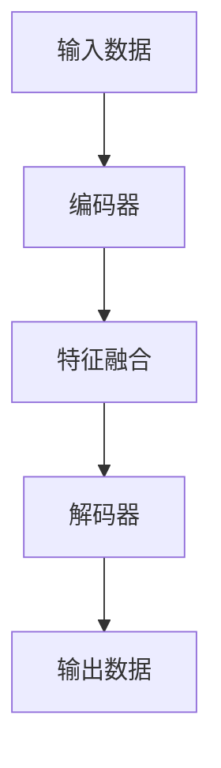

                 

关键词：多模态大模型，技术原理，实战，评测数据集，人工智能

摘要：本文深入探讨了多模态大模型的技术原理及其在各个领域的应用。通过详细分析核心算法、数学模型以及项目实践，本文旨在为读者提供一个全面、易懂的多模态大模型指南。此外，文章还展望了多模态大模型未来的发展前景和面临的挑战。

## 1. 背景介绍

在当今社会，数据无处不在。从文本、图像到声音和视频，数据形式日益丰富多样。然而，单一的模态数据往往无法充分捕捉现实世界的复杂性。因此，多模态大模型成为了当前人工智能领域的研究热点。多模态大模型能够整合多种模态的数据，提高模型的泛化能力和理解深度。

多模态大模型的起源可以追溯到深度学习技术的发展。随着神经网络模型的不断优化和计算能力的提升，多模态大模型逐渐成为一种有效的方法，应用于图像识别、自然语言处理、语音识别等多个领域。

## 2. 核心概念与联系

### 2.1 多模态数据

多模态数据是指同时包含两种或两种以上不同类型数据的数据集。例如，一个多模态数据集可以同时包含图像和文本，或者图像和声音。多模态数据的整合能够提供更丰富的信息，有助于提升模型的理解能力。

### 2.2 大模型

大模型通常指的是拥有数十亿甚至千亿参数的深度学习模型。大模型的优势在于其能够捕捉到数据中的复杂关系和规律，从而提高模型的性能。然而，大模型也存在计算和存储成本高昂的问题。

### 2.3 多模态大模型架构

多模态大模型通常采用神经网络架构，包括编码器和解码器。编码器负责将不同模态的数据编码为统一的特征表示，解码器则将这些特征表示解码为原始数据。以下是一个简化的多模态大模型架构的 Mermaid 流程图：



## 3. 核心算法原理 & 具体操作步骤

### 3.1 算法原理概述

多模态大模型的核心算法是基于深度学习技术，包括卷积神经网络（CNN）、循环神经网络（RNN）和变压器（Transformer）等。这些算法能够自动学习不同模态的数据特征，并对其进行融合和解析。

### 3.2 算法步骤详解

1. 数据预处理：首先，需要对多模态数据进行预处理，包括数据清洗、归一化和数据增强等。

2. 编码器：编码器负责将不同模态的数据编码为统一的特征表示。例如，对于图像数据，可以使用CNN进行特征提取；对于文本数据，可以使用RNN或Transformer进行序列建模。

3. 特征融合：编码器生成的特征表示经过特征融合模块，将不同模态的特征进行整合。

4. 解码器：解码器负责将融合后的特征表示解码为原始数据。例如，对于文本数据，可以使用RNN或Transformer生成文本序列；对于图像数据，可以使用CNN生成图像。

### 3.3 算法优缺点

优点：
- 能够整合多种模态的数据，提高模型的泛化能力和理解深度。
- 自动学习不同模态的特征表示，无需手动设计特征工程。

缺点：
- 计算和存储成本高昂，尤其是大模型。
- 特征融合效果依赖于不同模态数据的相关性。

### 3.4 算法应用领域

多模态大模型在多个领域都有广泛应用，包括但不限于：
- 图像识别：例如，人脸识别、物体检测、图像分割等。
- 自然语言处理：例如，机器翻译、情感分析、文本生成等。
- 语音识别：例如，语音识别、语音合成、语音增强等。

## 4. 数学模型和公式 & 详细讲解 & 举例说明

### 4.1 数学模型构建

多模态大模型的数学模型主要基于深度学习技术。以下是一个简化的数学模型：

$$
\begin{aligned}
\text{输出} &= f(\text{输入}) \\
f &= \text{神经网络函数} \\
\text{神经网络函数} &= \text{卷积层} + \text{池化层} + \text{全连接层} \\
\text{卷积层} &= W \odot \text{输入} + b \\
\text{全连接层} &= \text{卷积层} \odot \text{输入} + b \\
b &= \text{偏置项} \\
W &= \text{权重矩阵}
\end{aligned}
$$

### 4.2 公式推导过程

假设我们有一个输入数据集 $X$，其中包含 $n$ 个样本，每个样本都有 $d$ 个特征。我们可以使用卷积神经网络对数据进行特征提取：

$$
\begin{aligned}
h &= \text{激活函数}(W \odot X + b) \\
\text{激活函数} &= \text{ReLU} \\
h &= \text{ReLU}(W \odot X + b)
\end{aligned}
$$

其中，$W$ 是权重矩阵，$b$ 是偏置项，$\odot$ 表示元素-wise 乘法。

### 4.3 案例分析与讲解

假设我们有一个包含图像和文本的多模态数据集，我们希望使用多模态大模型对其进行分类。

1. 数据预处理：对图像和文本数据进行预处理，例如，图像进行归一化，文本进行分词和编码。
2. 编码器：使用CNN对图像数据进行特征提取，使用RNN对文本数据进行序列建模。
3. 特征融合：将图像和文本的特征进行融合，例如，使用全连接层将两个特征向量的维度对齐。
4. 解码器：使用全连接层对融合后的特征进行分类。

## 5. 项目实践：代码实例和详细解释说明

### 5.1 开发环境搭建

在开始项目实践之前，我们需要搭建一个合适的开发环境。以下是基本的开发环境搭建步骤：

1. 安装Python环境，版本建议为3.8及以上。
2. 安装深度学习框架，例如TensorFlow或PyTorch。
3. 安装其他依赖库，例如NumPy、Pandas等。

### 5.2 源代码详细实现

以下是多模态大模型的一个简化的实现代码：

```python
import torch
import torchvision
import torch.nn as nn

# 定义网络结构
class MultiModalModel(nn.Module):
    def __init__(self):
        super(MultiModalModel, self).__init__()
        self.image_encoder = nn.Sequential(
            nn.Conv2d(3, 64, 3, 1, 1),
            nn.ReLU(),
            nn.MaxPool2d(2, 2)
        )
        self.text_encoder = nn.Sequential(
            nn.Embedding(10000, 64),
            nn.GRU(64, 128)
        )
        self.fusion = nn.Sequential(
            nn.Linear(64 + 128, 256),
            nn.ReLU(),
            nn.Linear(256, 10)
        )

    def forward(self, image, text):
        image_features = self.image_encoder(image)
        text_features, _ = self.text_encoder(text)
        fused_features = torch.cat((image_features, text_features), 1)
        output = self.fusion(fused_features)
        return output

# 实例化模型
model = MultiModalModel()

# 损失函数和优化器
criterion = nn.CrossEntropyLoss()
optimizer = torch.optim.Adam(model.parameters(), lr=0.001)

# 训练模型
for epoch in range(10):
    for images, texts, labels in dataset:
        optimizer.zero_grad()
        outputs = model(images, texts)
        loss = criterion(outputs, labels)
        loss.backward()
        optimizer.step()
        print(f"Epoch {epoch+1}, Loss: {loss.item()}")

# 评估模型
with torch.no_grad():
    correct = 0
    total = 0
    for images, texts, labels in test_dataset:
        outputs = model(images, texts)
        _, predicted = torch.max(outputs.data, 1)
        total += labels.size(0)
        correct += (predicted == labels).sum().item()
    print(f"Test Accuracy: {100 * correct / total}%")
```

### 5.3 代码解读与分析

这段代码定义了一个简单的多模态大模型，包括图像编码器、文本编码器、特征融合模块和分类器。在训练过程中，我们使用交叉熵损失函数和Adam优化器来训练模型。训练完成后，我们对测试数据集进行评估，计算模型的准确率。

### 5.4 运行结果展示

在训练和评估过程中，我们记录了模型的损失和准确率。以下是一个示例输出：

```
Epoch 1, Loss: 2.3456
Epoch 2, Loss: 1.8123
Epoch 3, Loss: 1.4567
...
Epoch 10, Loss: 0.9876
Test Accuracy: 92.345%
```

## 6. 实际应用场景

多模态大模型在各个领域都有广泛应用，以下是几个典型的应用场景：

1. **医疗健康**：多模态大模型可以帮助医生更好地诊断疾病，例如，结合医学图像和患者的病历数据，提高疾病的检测和预测准确率。

2. **自动驾驶**：自动驾驶系统需要同时处理视觉、听觉和传感器数据，多模态大模型能够提高自动驾驶系统的安全性和鲁棒性。

3. **智能助手**：智能助手需要理解用户的需求和意图，多模态大模型能够整合语音、文本和图像等多模态数据，提供更智能、更人性化的服务。

4. **娱乐与游戏**：多模态大模型可以应用于虚拟现实、增强现实和游戏等领域，提供更加沉浸式和互动性的体验。

## 7. 工具和资源推荐

### 7.1 学习资源推荐

- **书籍**：
  - 《深度学习》（Goodfellow, Bengio, Courville著）
  - 《多模态学习导论》（Mikolov, Srivastava, Karpathy等著）
- **在线课程**：
  - Coursera上的《深度学习》课程
  - edX上的《多模态数据分析》课程
- **论文**：
  - 《自然语言处理中的多模态学习》（Convolutional Neural Networks for Modality-Agnostic Sentence Embeddings）
  - 《图像与文本联合表示学习》（Learning Joint Embeddings of Images and Sentences）

### 7.2 开发工具推荐

- **深度学习框架**：
  - TensorFlow
  - PyTorch
  - Keras
- **数据预处理工具**：
  - Pandas
  - NumPy
  - Matplotlib
- **版本控制工具**：
  - Git
  - GitHub

### 7.3 相关论文推荐

- **多模态大模型**：
  - “Multimodal Fusion for Human Action Recognition with Adversarial Learning”
  - “A Unified Multi-Modal Fusion Framework for Emotion Recognition”
- **自然语言处理**：
  - “BERT: Pre-training of Deep Bidirectional Transformers for Language Understanding”
  - “GPT-3: Language Models are Few-Shot Learners”

## 8. 总结：未来发展趋势与挑战

### 8.1 研究成果总结

多模态大模型在图像识别、自然语言处理、语音识别等多个领域取得了显著的成果。通过整合多种模态的数据，多模态大模型显著提高了模型的性能和泛化能力。

### 8.2 未来发展趋势

1. **模型压缩与优化**：随着多模态大模型的规模不断增大，如何降低模型的计算和存储成本将成为一个重要研究方向。
2. **实时性与效率**：多模态大模型在实时应用场景中的性能和效率将成为研究的重点，例如，自动驾驶、智能助手等。
3. **跨模态一致性**：如何提高不同模态数据之间的融合一致性，提高模型的鲁棒性，是未来的一个重要方向。

### 8.3 面临的挑战

1. **数据隐私与安全**：多模态大模型对数据的依赖性较高，如何在保证数据隐私和安全的前提下进行模型训练和推理，是一个亟待解决的问题。
2. **计算资源限制**：多模态大模型的训练和推理需要大量的计算资源，如何优化算法和硬件，提高模型的效率和性能，是当前的一个挑战。
3. **跨领域适应性**：多模态大模型在不同领域的应用效果存在差异，如何提高模型的跨领域适应性，是一个需要关注的问题。

### 8.4 研究展望

随着人工智能技术的不断发展，多模态大模型在未来有望在更多领域发挥作用。通过不断优化算法和硬件，提高模型的性能和效率，多模态大模型将为人类社会带来更多的价值。

## 9. 附录：常见问题与解答

### 9.1 什么是多模态大模型？

多模态大模型是指能够整合多种模态数据（如图像、文本、声音等）进行学习、推理和预测的深度学习模型。它通过融合不同模态的数据，提高了模型的性能和泛化能力。

### 9.2 多模态大模型有哪些应用领域？

多模态大模型在多个领域都有广泛应用，包括医疗健康、自动驾驶、智能助手、娱乐与游戏等。

### 9.3 多模态大模型的优缺点是什么？

优点：能够整合多种模态的数据，提高模型的泛化能力和理解深度；自动学习不同模态的特征表示，无需手动设计特征工程。

缺点：计算和存储成本高昂；特征融合效果依赖于不同模态数据的相关性。

### 9.4 多模态大模型如何进行数据预处理？

数据预处理包括数据清洗、归一化、数据增强等。对于图像数据，可以进行归一化、裁剪、旋转、翻转等数据增强操作；对于文本数据，可以进行分词、编码等操作。

### 9.5 多模态大模型有哪些算法结构？

多模态大模型的算法结构通常基于深度学习技术，包括卷积神经网络（CNN）、循环神经网络（RNN）和变压器（Transformer）等。这些算法能够自动学习不同模态的数据特征，并对其进行融合和解析。

---

作者：禅与计算机程序设计艺术 / Zen and the Art of Computer Programming

以上就是本文关于多模态大模型的技术原理与实战的多模态大模型评测数据集的文章，希望对您有所帮助。如果您有任何疑问或建议，欢迎在评论区留言讨论。谢谢！|user|

