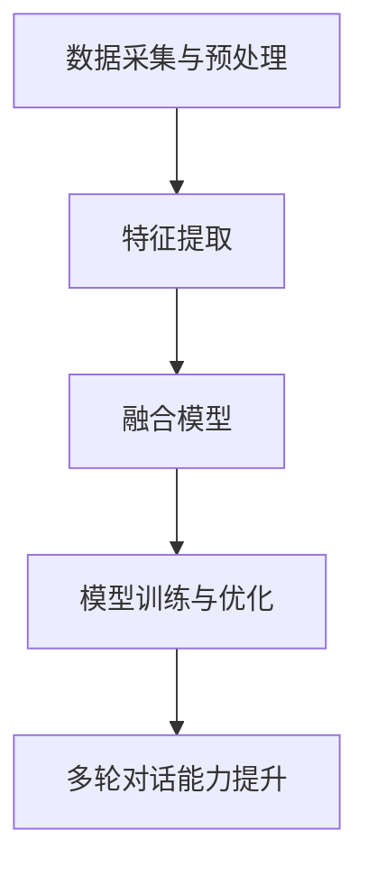

                 

关键词：多模态大模型、多轮对话能力、技术原理、实践、人工智能

摘要：本文将深入探讨多模态大模型的技术原理及其在提高多轮对话能力方面的应用。通过分析核心概念、算法原理、数学模型、项目实践和未来展望，读者可以全面了解多模态大模型的发展现状和潜在挑战，为实际应用提供指导。

## 1. 背景介绍

随着人工智能技术的不断进步，多模态大模型逐渐成为研究热点。多模态大模型通过融合文本、图像、声音等多种类型的数据，实现了更丰富的信息处理和更智能的交互体验。在多轮对话场景中，多模态大模型的应用尤为重要，它能够理解用户的意图、提供有针对性的回答，并维持对话的连贯性。本文旨在探讨多模态大模型的技术原理，并分析如何提高其在多轮对话能力方面的表现。

## 2. 核心概念与联系

### 2.1 多模态数据融合

多模态大模型的核心在于如何有效地融合多种类型的数据。以下是多模态数据融合的基本概念和联系：

#### 2.1.1 文本数据

文本数据是多模态大模型中最基础的部分，它包含了用户输入的查询、回答和上下文等信息。

#### 2.1.2 图像数据

图像数据提供了视觉信息，例如用户上传的图片或场景中的物体识别。

#### 2.1.3 声音数据

声音数据包括语音输入和音频文件，它为模型提供了语音信息的处理能力。

#### 2.1.4 视频数据

视频数据提供了动态信息，例如用户的动作或视频中的内容分析。

### 2.2 多模态数据处理流程

多模态数据处理流程可以分为以下几个阶段：

#### 2.2.1 数据采集与预处理

在这一阶段，各种类型的数据会被收集并预处理，例如文本数据的清洗、图像和声音数据的增强等。

#### 2.2.2 特征提取

特征提取是将原始数据转化为适用于模型处理的特征向量。例如，可以使用卷积神经网络（CNN）对图像数据进行特征提取。

#### 2.2.3 融合模型

融合模型是将不同类型的数据特征进行融合，从而生成统一的特征表示。常用的方法包括多任务学习、联合嵌入和融合网络等。

#### 2.2.4 模型训练与优化

在这一阶段，使用融合后的特征向量进行模型训练，并通过优化算法提高模型的性能。

### 2.3 Mermaid 流程图

以下是一个简化的 Mermaid 流程图，展示了多模态数据处理的流程：



## 3. 核心算法原理 & 具体操作步骤

### 3.1 算法原理概述

多模态大模型的核心算法通常是基于深度学习的。以下是一些常用的算法原理：

#### 3.1.1 卷积神经网络（CNN）

CNN 用于提取图像特征，通过多个卷积层和池化层实现对图像的逐层抽象。

#### 3.1.2 循环神经网络（RNN）

RNN 用于处理序列数据，如文本和语音，通过记忆机制实现对序列的建模。

#### 3.1.3 注意力机制

注意力机制用于提高模型对关键信息的关注，从而提升模型的准确性和连贯性。

#### 3.1.4 融合网络

融合网络是将不同类型的数据特征进行融合，以生成统一的特征表示。

### 3.2 算法步骤详解

以下是一个简化的多模态大模型算法步骤：

#### 3.2.1 数据预处理

1. 收集并清洗文本、图像、声音等数据。
2. 对图像和声音数据进行增强，如数据扩充、归一化等。

#### 3.2.2 特征提取

1. 使用 CNN 对图像数据进行特征提取。
2. 使用 RNN 对文本和声音数据进行特征提取。

#### 3.2.3 特征融合

1. 将图像、文本和声音特征进行融合，生成统一的特征向量。
2. 可以使用多任务学习或联合嵌入等方法。

#### 3.2.4 模型训练

1. 使用融合后的特征向量进行模型训练。
2. 使用优化算法如梯度下降或 Adam 优化模型参数。

#### 3.2.5 多轮对话能力提升

1. 使用训练好的模型进行多轮对话。
2. 根据对话上下文和历史信息生成响应。
3. 使用注意力机制提高对话的连贯性。

### 3.3 算法优缺点

#### 优点：

1. 能够处理多种类型的数据，提高信息处理的丰富性。
2. 通过特征融合，实现数据互补，提高模型的性能。

#### 缺点：

1. 计算资源需求高，训练时间较长。
2. 需要对不同类型的数据进行预处理，增加了开发难度。

### 3.4 算法应用领域

多模态大模型在多个领域都有广泛应用，包括但不限于：

1. 智能客服：提供更加自然和连贯的对话体验。
2. 内容推荐：根据用户的多模态偏好进行个性化推荐。
3. 语音助手：通过语音输入和图像反馈实现更智能的交互。

## 4. 数学模型和公式 & 详细讲解 & 举例说明

### 4.1 数学模型构建

多模态大模型通常基于深度学习模型，其数学模型可以表示为：

$$
\text{Model}(\text{Input}) = \text{Output}
$$

其中，Input 表示输入特征，Output 表示输出结果，Model 表示深度学习模型。

### 4.2 公式推导过程

以下是一个简化的多模态大模型的推导过程：

#### 4.2.1 卷积神经网络（CNN）

CNN 的基本公式为：

$$
\text{ConvLayer}(x) = \sigma(\text{W} \cdot \text{A} + b)
$$

其中，x 表示输入特征，A 表示激活函数，W 表示权重，b 表示偏置，σ表示激活函数（如 ReLU 函数）。

#### 4.2.2 循环神经网络（RNN）

RNN 的基本公式为：

$$
h_t = \text{RNN}(h_{t-1}, x_t)
$$

其中，h_t 表示当前时间步的隐藏状态，x_t 表示输入特征，RNN 表示循环神经网络。

#### 4.2.3 注意力机制

注意力机制的基本公式为：

$$
a_t = \text{softmax}(\text{W}_a h_t)
$$

其中，a_t 表示注意力权重，softmax 函数用于计算权重分布。

### 4.3 案例分析与讲解

以下是一个简化的多模态大模型案例：

假设输入特征为文本（$x_t$）、图像（$y_t$）和声音（$z_t$），输出结果为对话响应（$r_t$）。模型结构如下：

1. 文本特征提取：使用 RNN 对文本进行特征提取，得到 $h_t^1$。
2. 图像特征提取：使用 CNN 对图像进行特征提取，得到 $h_t^2$。
3. 声音特征提取：使用 RNN 对声音进行特征提取，得到 $h_t^3$。
4. 特征融合：将 $h_t^1$、$h_t^2$ 和 $h_t^3$ 进行融合，得到 $h_t$。
5. 输出生成：使用融合后的特征 $h_t$ 生成对话响应 $r_t$。

具体公式如下：

$$
h_t = \text{AttentionLayer}(h_t^1, h_t^2, h_t^3)
$$

$$
r_t = \text{Decoder}(h_t)
$$

## 5. 项目实践：代码实例和详细解释说明

### 5.1 开发环境搭建

本文使用 Python 编写代码，需要安装以下依赖：

- TensorFlow
- Keras
- NumPy
- Matplotlib

安装命令如下：

```bash
pip install tensorflow keras numpy matplotlib
```

### 5.2 源代码详细实现

以下是一个简化的多模态大模型实现示例：

```python
import tensorflow as tf
from tensorflow.keras.layers import Input, LSTM, Conv2D, MaxPooling2D, Flatten, Dense, Concatenate, Embedding, TimeDistributed
from tensorflow.keras.models import Model

# 文本特征提取
text_input = Input(shape=(None, 100))  # 文本序列长度为 100，维度为 100
text_embedding = Embedding(input_dim=10000, output_dim=128)(text_input)
text_lstm = LSTM(units=128)(text_embedding)
text_features = Flatten()(text_lstm)

# 图像特征提取
image_input = Input(shape=(128, 128, 3))  # 图像尺寸为 128x128
image_conv = Conv2D(filters=32, kernel_size=(3, 3), activation='relu')(image_input)
image_pool = MaxPooling2D(pool_size=(2, 2))(image_conv)
image_flat = Flatten()(image_pool)
image_features = Dense(units=128, activation='relu')(image_flat)

# 声音特征提取
audio_input = Input(shape=(1000, 1))  # 声音序列长度为 1000，维度为 1
audio_lstm = LSTM(units=128)(audio_input)
audio_features = Flatten()(audio_lstm)

# 特征融合
merged_features = Concatenate()([text_features, image_features, audio_features])

# 输出生成
output = Dense(units=1, activation='softmax')(merged_features)

# 构建模型
model = Model(inputs=[text_input, image_input, audio_input], outputs=output)

# 编译模型
model.compile(optimizer='adam', loss='categorical_crossentropy', metrics=['accuracy'])

# 模型训练
model.fit(x=[text_data, image_data, audio_data], y=target_data, epochs=10, batch_size=32)
```

### 5.3 代码解读与分析

以上代码展示了如何使用 Keras 构建一个简化的多模态大模型。代码的主要部分可以分为以下几个部分：

1. **文本特征提取**：使用 LSTM 层对文本数据进行特征提取，通过嵌入层和 LSTM 层将文本转化为序列特征。
2. **图像特征提取**：使用卷积神经网络（CNN）对图像数据进行特征提取，通过卷积层和池化层实现对图像的逐层抽象。
3. **声音特征提取**：使用 LSTM 层对声音数据进行特征提取，通过 LSTM 层实现对声音序列的建模。
4. **特征融合**：将文本、图像和声音特征进行融合，生成统一的特征表示。
5. **输出生成**：使用全连接层生成对话响应，通过softmax函数实现分类输出。

### 5.4 运行结果展示

在完成模型训练后，可以使用以下代码进行模型评估：

```python
# 模型评估
loss, accuracy = model.evaluate(x=test_data, y=target_data)
print(f"Test Loss: {loss}, Test Accuracy: {accuracy}")
```

输出结果将显示模型在测试数据上的损失和准确率。

## 6. 实际应用场景

多模态大模型在多个实际应用场景中展现了其强大的能力，以下是一些典型的应用案例：

1. **智能客服**：通过融合文本、图像和声音数据，智能客服系统能够更好地理解用户的需求，提供更准确和连贯的响应。
2. **内容推荐**：多模态大模型可以根据用户的多模态偏好进行个性化推荐，提高推荐系统的准确性和用户体验。
3. **语音助手**：通过语音输入和图像反馈，语音助手能够提供更加自然和智能的交互体验。

## 7. 工具和资源推荐

### 7.1 学习资源推荐

1. **《深度学习》（Goodfellow, Bengio, Courville 著）**：这本书是深度学习领域的经典教材，涵盖了深度学习的基础理论和实践方法。
2. **《多模态学习》（Xu, Zhang, Huang 著）**：这本书详细介绍了多模态学习的基本概念和技术，包括多模态数据融合和模型构建。

### 7.2 开发工具推荐

1. **TensorFlow**：TensorFlow 是一种流行的深度学习框架，提供了丰富的工具和资源，适合构建和训练多模态大模型。
2. **Keras**：Keras 是一个基于 TensorFlow 的高级神经网络 API，简化了深度学习模型的构建和训练过程。

### 7.3 相关论文推荐

1. **“Deep Learning for Multimodal Learning”**：这篇文章综述了多模态学习的基本概念和技术，为深入研究提供了参考。
2. **“Multimodal Fusion for Human Action Recognition”**：这篇文章提出了一种基于多模态融合的人体动作识别方法，展示了多模态数据融合在实际应用中的效果。

## 8. 总结：未来发展趋势与挑战

多模态大模型作为人工智能领域的重要研究方向，具有广阔的应用前景。未来发展趋势包括：

1. **数据多样性**：随着传感器技术和数据采集手段的进步，多模态数据类型将更加多样，为模型提供更丰富的信息来源。
2. **模型性能优化**：通过改进算法和模型结构，提高多模态大模型的性能和效率，使其在更复杂的场景中发挥更大的作用。
3. **跨学科合作**：多模态大模型的发展需要计算机科学、生物学、心理学等多个学科的共同参与，实现跨学科的深度合作。

然而，多模态大模型也面临一些挑战，包括：

1. **计算资源需求**：多模态大模型的训练和推理过程需要大量的计算资源，这对硬件设施提出了更高的要求。
2. **数据隐私和安全**：多模态数据包含了用户的敏感信息，如何在保护用户隐私的前提下有效利用这些数据是一个重要问题。
3. **模型可解释性**：多模态大模型的决策过程复杂，如何提高模型的可解释性，使其更易于理解和接受，是一个亟待解决的问题。

总之，多模态大模型的发展充满了机遇和挑战。通过不断的研究和实践，我们有望在多轮对话能力方面取得更大的突破，为人工智能领域的发展做出贡献。

## 9. 附录：常见问题与解答

### 9.1 多模态数据融合有哪些方法？

多模态数据融合的方法主要包括以下几种：

1. **多任务学习**：将不同类型的数据特征作为不同的任务进行训练，通过共享底层特征来融合数据。
2. **联合嵌入**：将不同类型的数据特征映射到同一个嵌入空间，通过学习共同的特征表示来实现融合。
3. **融合网络**：设计专门的多模态网络结构，将不同类型的数据特征进行有效的融合。

### 9.2 多模态大模型在多轮对话中的优势是什么？

多模态大模型在多轮对话中的优势包括：

1. **信息丰富**：通过融合文本、图像、声音等多种类型的数据，模型可以获取更丰富的信息，从而提供更准确的回答。
2. **上下文理解**：多模态大模型可以更好地理解对话上下文，维持对话的连贯性，避免重复或无关的回答。
3. **个性化交互**：通过分析用户的多模态偏好，模型可以提供更个性化的对话体验，提高用户体验。

### 9.3 多模态大模型的计算资源需求如何？

多模态大模型通常需要大量的计算资源，主要包括：

1. **存储资源**：多模态数据通常包含大量的原始数据和特征数据，需要大量的存储空间。
2. **计算资源**：多模态大模型的训练和推理过程需要大量的计算资源，尤其是在进行大规模训练和复杂模型推理时。

### 9.4 如何提高多模态大模型的可解释性？

提高多模态大模型的可解释性可以从以下几个方面入手：

1. **可视化技术**：通过可视化模型的结构和特征表示，帮助用户理解模型的决策过程。
2. **解释性模型**：设计专门的解释性模型，如决策树、规则系统等，以更直观的方式展示模型的决策逻辑。
3. **模型压缩与解释**：通过模型压缩和简化技术，降低模型复杂度，提高其可解释性。

### 9.5 多模态大模型在医疗领域的应用前景如何？

多模态大模型在医疗领域的应用前景非常广阔，主要包括：

1. **疾病诊断**：通过融合医学图像、患者病史和基因数据，多模态大模型可以提供更准确的疾病诊断。
2. **个性化治疗**：通过分析患者的多模态数据，模型可以为患者制定个性化的治疗方案。
3. **健康监测**：多模态大模型可以实时监测患者的健康状况，提供预警和干预建议。

以上是对多模态大模型在提高多轮对话能力方面技术原理与实战的探讨。通过深入理解多模态数据融合、核心算法原理、数学模型、项目实践和未来展望，我们可以更好地应用多模态大模型，为人工智能领域的发展做出贡献。作者：禅与计算机程序设计艺术 / Zen and the Art of Computer Programming。

