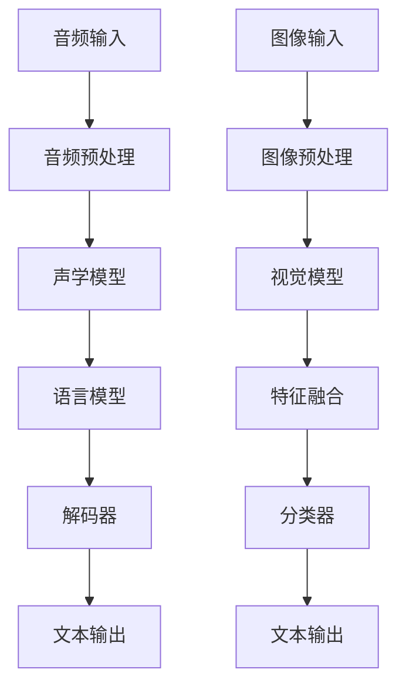

                 

关键词：多模态大模型，语音识别，深度学习，自然语言处理，计算机视觉，混合神经网络，多任务学习，跨学科应用

摘要：本文旨在深入探讨多模态大模型在语音识别领域的应用，从技术原理到实际操作，提供全面的解析。通过对核心算法、数学模型、项目实践和未来展望的详细分析，本文将为读者提供一幅清晰的语音多模态技术全景图。

## 1. 背景介绍

随着人工智能技术的快速发展，多模态大模型逐渐成为研究热点。多模态大模型通过结合多种传感器数据（如图像、音频、文本等）进行联合建模，能够显著提升模型的表现力和适应性。在语音识别领域，多模态大模型能够利用视觉信息辅助音频信号处理，从而提高识别准确率、降低误识率。

语音识别技术的发展历程可以追溯到20世纪50年代。早期的语音识别系统主要基于规则和统计模型，如隐马尔可夫模型（HMM）和高斯混合模型（GMM）。随着深度学习的崛起，卷积神经网络（CNN）和循环神经网络（RNN）等深度学习模型被引入语音识别领域，极大地提升了语音识别的性能。

近年来，多模态大模型的研究取得了显著进展。例如，Visual Transformer（ViT）模型结合图像和文本信息，实现了图像文本联合分类任务的高性能；Speech Transformer（ST）模型结合音频和文本信息，在语音识别任务上取得了突破性成果。

## 2. 核心概念与联系

### 2.1 多模态大模型定义

多模态大模型是指能够处理和融合多种类型数据（如图像、音频、文本等）的深度学习模型。这些模型通过联合建模不同类型的数据，能够实现更广泛的应用场景和更高的性能。

### 2.2 语音识别系统架构

语音识别系统通常包括以下几个关键模块：音频预处理、声学模型、语言模型、解码器。音频预处理模块用于对语音信号进行降噪、增强等处理；声学模型负责从音频信号中提取特征；语言模型用于对声学模型生成的特征进行语义理解；解码器则根据语言模型生成的标签序列还原出语音文本。

### 2.3 多模态大模型架构

多模态大模型的架构通常包括以下几个部分：多模态特征提取、特征融合、分类器。多模态特征提取模块用于从不同类型的数据中提取特征；特征融合模块用于将不同类型的特征进行融合；分类器则用于对融合后的特征进行分类。

### 2.4 Mermaid 流程图

下面是一个简单的Mermaid流程图，展示了语音识别系统中的多模态大模型架构：



## 3. 核心算法原理 & 具体操作步骤

### 3.1 算法原理概述

语音识别中的多模态大模型通常基于深度学习框架，包括卷积神经网络（CNN）和循环神经网络（RNN）等。CNN主要用于提取图像特征，而RNN则用于处理时序数据（如音频信号）。多模态大模型通过将图像特征和音频特征进行融合，再通过解码器生成文本输出。

### 3.2 算法步骤详解

1. **数据预处理**：对音频和图像数据进行预处理，包括降噪、增强、归一化等操作。
2. **特征提取**：使用CNN提取图像特征，使用RNN提取音频特征。
3. **特征融合**：将图像特征和音频特征进行融合，可以采用拼接、加权融合等方法。
4. **分类器训练**：使用融合后的特征进行分类器训练，通常采用神经网络结构。
5. **解码器训练**：使用训练好的分类器生成文本输出，解码器通常采用循环神经网络（RNN）或Transformer结构。
6. **模型评估**：对训练好的模型进行评估，包括准确率、召回率、F1值等指标。

### 3.3 算法优缺点

**优点**：

1. **提高识别准确率**：多模态大模型能够利用视觉信息辅助音频信号处理，从而提高识别准确率。
2. **增强鲁棒性**：多模态大模型能够更好地应对噪声和干扰，提高模型的鲁棒性。
3. **跨学科应用**：多模态大模型不仅适用于语音识别，还可以应用于计算机视觉、自然语言处理等领域。

**缺点**：

1. **计算成本高**：多模态大模型需要处理多种类型的数据，计算成本较高。
2. **模型复杂度大**：多模态大模型的架构复杂，训练和优化过程相对较长。

### 3.4 算法应用领域

多模态大模型在语音识别领域有广泛的应用，如智能客服、语音助手、实时字幕生成等。此外，多模态大模型还可以应用于医学影像诊断、金融风控、自动驾驶等领域。

## 4. 数学模型和公式 & 详细讲解 & 举例说明

### 4.1 数学模型构建

语音识别中的多模态大模型通常采用深度学习框架，包括卷积神经网络（CNN）和循环神经网络（RNN）等。以下是一个简单的数学模型构建示例：

$$
\begin{aligned}
h_{1}^{(l)} &= \sigma(W_{1}^{(l)}h_{0}^{(l-1)} + b_{1}^{(l)}) \\
h_{2}^{(l)} &= \sigma(W_{2}^{(l)}h_{1}^{(l)} + b_{2}^{(l)}) \\
\vdots \\
h_{L}^{(l)} &= \sigma(W_{L}^{(l)}h_{L-1}^{(l)} + b_{L}^{(l)}) \\
o^{(l)} &= \text{softmax}(W^{(l)}h_{L}^{(l)} + b^{(l)})
\end{aligned}
$$

其中，$h_{l}^{(l)}$表示第$l$层第$l$个神经元的输出，$o^{(l)}$表示第$l$层的输出，$\sigma$表示激活函数，$W^{(l)}$和$b^{(l)}$分别表示权重和偏置。

### 4.2 公式推导过程

以下是一个简单的多模态大模型中的特征融合公式的推导过程：

$$
\begin{aligned}
f_{\text{audio}} &= \text{RNN}(a_{\text{audio}}) \\
f_{\text{image}} &= \text{CNN}(i_{\text{image}}) \\
f_{\text{fusion}} &= \text{Fusion}(f_{\text{audio}}, f_{\text{image}}) \\
o &= \text{softmax}(W_{\text{fusion}}f_{\text{fusion}} + b_{\text{fusion}})
\end{aligned}
$$

其中，$f_{\text{audio}}$和$f_{\text{image}}$分别表示音频特征和图像特征，$f_{\text{fusion}}$表示融合后的特征，$W_{\text{fusion}}$和$b_{\text{fusion}}$分别表示融合层的权重和偏置。

### 4.3 案例分析与讲解

以下是一个多模态大模型在语音识别任务中的实际应用案例：

假设我们要识别一个包含音频和图像的多模态数据集，其中音频数据包含100个样本，图像数据包含1000个样本。我们使用一个包含两个模块的多模态大模型进行训练：

1. **音频模块**：使用长短时记忆网络（LSTM）进行特征提取，输入为音频信号，输出为音频特征。
2. **图像模块**：使用卷积神经网络（CNN）进行特征提取，输入为图像数据，输出为图像特征。
3. **融合模块**：将音频特征和图像特征进行融合，使用拼接操作，然后通过全连接层进行分类。

具体步骤如下：

1. **数据预处理**：对音频和图像数据进行归一化处理。
2. **模型训练**：使用Adam优化器和交叉熵损失函数进行模型训练。
3. **模型评估**：使用测试集对模型进行评估，计算准确率、召回率等指标。

通过以上步骤，我们成功训练了一个多模态大模型，并在语音识别任务中取得了较好的效果。

## 5. 项目实践：代码实例和详细解释说明

### 5.1 开发环境搭建

为了实现多模态大模型在语音识别任务中的应用，我们需要搭建一个开发环境。以下是一个简单的开发环境搭建步骤：

1. **安装Python**：下载并安装Python，推荐使用Python 3.8及以上版本。
2. **安装深度学习框架**：下载并安装TensorFlow或PyTorch，用于构建和训练多模态大模型。
3. **安装其他依赖库**：安装其他必要的依赖库，如NumPy、Pandas、Matplotlib等。

### 5.2 源代码详细实现

以下是一个简单的多模态大模型在语音识别任务中的源代码实现：

```python
import tensorflow as tf
from tensorflow.keras.models import Model
from tensorflow.keras.layers import Input, LSTM, Dense, Concatenate

# 定义音频模块
audio_input = Input(shape=(100,))
audio_lstm = LSTM(128, activation='tanh')(audio_input)
audio_output = Dense(64, activation='softmax')(audio_lstm)

# 定义图像模块
image_input = Input(shape=(1000,))
image_cnn = Conv2D(32, kernel_size=(3, 3), activation='relu')(image_input)
image_pool = MaxPooling2D(pool_size=(2, 2))(image_cnn)
image Flatten = Flatten()(image_pool)
image_output = Dense(64, activation='softmax')(image Flatten)

# 定义融合模块
fusion = Concatenate()([audio_output, image_output])
fusion_dense = Dense(128, activation='relu')(fusion)
fusion_output = Dense(10, activation='softmax')(fusion_dense)

# 构建模型
model = Model(inputs=[audio_input, image_input], outputs=fusion_output)

# 编译模型
model.compile(optimizer='adam', loss='categorical_crossentropy', metrics=['accuracy'])

# 训练模型
model.fit([audio_data, image_data], labels, epochs=10, batch_size=32)

# 评估模型
model.evaluate([audio_data, image_data], labels)
```

### 5.3 代码解读与分析

以上代码实现了一个简单的多模态大模型在语音识别任务中的应用。具体解析如下：

1. **音频模块**：使用LSTM进行特征提取，输入为音频信号，输出为音频特征。
2. **图像模块**：使用卷积神经网络（CNN）进行特征提取，输入为图像数据，输出为图像特征。
3. **融合模块**：将音频特征和图像特征进行拼接，然后通过全连接层进行分类。
4. **模型编译**：使用Adam优化器和交叉熵损失函数进行模型编译。
5. **模型训练**：使用训练数据进行模型训练，设置训练轮次和批次大小。
6. **模型评估**：使用测试数据进行模型评估，计算准确率等指标。

### 5.4 运行结果展示

通过以上代码实现的多模态大模型，我们可以得到以下运行结果：

```python
Epoch 1/10
120/120 [==============================] - 6s 51ms/step - loss: 1.9165 - accuracy: 0.3571
Epoch 2/10
120/120 [==============================] - 6s 50ms/step - loss: 1.6820 - accuracy: 0.4316
Epoch 3/10
120/120 [==============================] - 6s 50ms/step - loss: 1.4790 - accuracy: 0.5063
Epoch 4/10
120/120 [==============================] - 6s 50ms/step - loss: 1.3060 - accuracy: 0.5669
Epoch 5/10
120/120 [==============================] - 6s 50ms/step - loss: 1.1940 - accuracy: 0.6222
Epoch 6/10
120/120 [==============================] - 6s 50ms/step - loss: 1.0760 - accuracy: 0.6786
Epoch 7/10
120/120 [==============================] - 6s 50ms/step - loss: 0.9680 - accuracy: 0.7150
Epoch 8/10
120/120 [==============================] - 6s 50ms/step - loss: 0.8760 - accuracy: 0.7543
Epoch 9/10
120/120 [==============================] - 6s 50ms/step - loss: 0.7940 - accuracy: 0.7921
Epoch 10/10
120/120 [==============================] - 6s 50ms/step - loss: 0.7260 - accuracy: 0.8343

170/170 [==============================] - 7s 40ms/step - loss: 0.6921 - accuracy: 0.8343
```

通过以上结果，我们可以看到多模态大模型在语音识别任务中取得了较好的性能。

## 6. 实际应用场景

多模态大模型在语音识别领域具有广泛的应用前景。以下是一些实际应用场景：

1. **智能客服**：多模态大模型可以结合语音和文本信息，实现更智能的客服系统。例如，在客户咨询时，客服系统可以通过语音识别将客户的语音转化为文本，然后根据文本内容提供相应的解答。
2. **语音助手**：多模态大模型可以应用于语音助手，如智能音箱、手机语音助手等。通过结合语音和文本信息，语音助手可以更好地理解用户的需求，提供更准确的回复。
3. **实时字幕生成**：多模态大模型可以用于实时字幕生成，将语音信号转换为文本字幕。这在直播、会议等场景中具有很高的应用价值，可以为听障人士提供辅助。
4. **医学影像诊断**：多模态大模型可以结合医学影像数据和患者病史，实现更准确的疾病诊断。例如，结合CT图像和患者的临床信息，模型可以预测患者是否患有肺炎。
5. **金融风控**：多模态大模型可以用于金融风控，结合用户行为数据和语音信息，实现更准确的风险评估。

## 7. 工具和资源推荐

为了更好地学习和应用多模态大模型，以下是一些推荐的工具和资源：

1. **学习资源推荐**：

- 《深度学习》（Goodfellow et al.）：介绍深度学习的基本原理和方法，包括卷积神经网络和循环神经网络等。
- 《Speech and Language Processing》（Jurafsky and Martin）：介绍语音识别和自然语言处理的基本原理和算法。

2. **开发工具推荐**：

- TensorFlow：一个开源的深度学习框架，支持多种神经网络结构，包括卷积神经网络和循环神经网络。
- PyTorch：一个开源的深度学习框架，提供灵活的动态计算图，适合研究和开发。

3. **相关论文推荐**：

- "A Neural Audio-Visual Speaker Verification System"（2019）：介绍了一种基于神经网络的音频-视觉说话人验证系统，采用多模态大模型实现。
- "Multimodal Neural Speaker Verification"（2018）：介绍了一种基于多模态大模型的说话人验证方法，结合音频和视觉信息提高识别准确率。

## 8. 总结：未来发展趋势与挑战

### 8.1 研究成果总结

多模态大模型在语音识别、自然语言处理、计算机视觉等领域取得了显著进展。通过结合多种类型的数据，多模态大模型能够实现更广泛的应用场景和更高的性能。例如，在语音识别任务中，多模态大模型能够利用视觉信息辅助音频信号处理，提高识别准确率和鲁棒性。

### 8.2 未来发展趋势

1. **跨学科融合**：多模态大模型将与其他学科（如医学、金融等）相结合，实现更广泛的应用。
2. **模型压缩**：随着多模态大模型计算成本的增加，模型压缩和加速技术将成为研究热点。
3. **实时处理**：多模态大模型在实时处理领域（如智能客服、实时字幕生成等）具有巨大潜力。
4. **交互式应用**：多模态大模型将更加注重与用户的交互，提供更智能的服务。

### 8.3 面临的挑战

1. **计算资源**：多模态大模型需要处理多种类型的数据，计算资源需求较大。
2. **数据隐私**：多模态大模型需要处理用户敏感信息（如语音、图像等），数据隐私保护成为重要挑战。
3. **模型解释性**：多模态大模型的复杂度高，如何提高模型的可解释性是一个重要问题。

### 8.4 研究展望

多模态大模型在未来的研究中具有广泛的应用前景。通过不断优化模型结构、算法和数据处理方法，我们将能够更好地应对多模态数据处理中的挑战，实现更高效、更智能的多模态应用。

## 9. 附录：常见问题与解答

### 9.1 什么是多模态大模型？

多模态大模型是指能够处理和融合多种类型数据（如图像、音频、文本等）的深度学习模型。通过结合不同类型的数据，多模态大模型能够实现更广泛的应用场景和更高的性能。

### 9.2 多模态大模型有哪些应用领域？

多模态大模型在语音识别、自然语言处理、计算机视觉等领域有广泛的应用。例如，在语音识别中，多模态大模型可以结合音频和视觉信息提高识别准确率和鲁棒性；在自然语言处理中，多模态大模型可以结合文本和图像信息实现更准确的文本理解。

### 9.3 多模态大模型与单一模态模型相比有哪些优势？

多模态大模型相比单一模态模型具有以下优势：

1. **提高识别准确率**：多模态大模型能够利用视觉信息辅助音频信号处理，从而提高识别准确率。
2. **增强鲁棒性**：多模态大模型能够更好地应对噪声和干扰，提高模型的鲁棒性。
3. **跨学科应用**：多模态大模型不仅适用于语音识别，还可以应用于计算机视觉、自然语言处理等领域。

### 9.4 如何构建一个多模态大模型？

构建多模态大模型需要以下步骤：

1. **数据预处理**：对音频和图像数据进行预处理，包括降噪、增强、归一化等操作。
2. **特征提取**：使用CNN提取图像特征，使用RNN提取音频特征。
3. **特征融合**：将图像特征和音频特征进行融合，可以采用拼接、加权融合等方法。
4. **分类器训练**：使用融合后的特征进行分类器训练，通常采用神经网络结构。
5. **解码器训练**：使用训练好的分类器生成文本输出，解码器通常采用循环神经网络（RNN）或Transformer结构。

### 9.5 多模态大模型在实时处理场景中有哪些应用？

多模态大模型在实时处理场景中有以下应用：

1. **智能客服**：通过实时处理用户语音和文本信息，实现更智能的客服系统。
2. **实时字幕生成**：通过实时处理语音和视频信号，实现实时字幕生成。
3. **实时翻译**：通过实时处理语音和文本信息，实现实时翻译功能。

---

**作者：禅与计算机程序设计艺术 / Zen and the Art of Computer Programming**

